# CS61A

>   *Notes of Courses* on gitee.io
>
>   [CS61A - My Pamphlet (gitee.io)](https://ronald-luo.gitee.io/my-pamphlet_-notes-of-courses/Notes of Courses/CS61A/)

!!! info

    [CS 61A Fall 2020 (berkeley.edu)](https://inst.eecs.berkeley.edu/~cs61a/fa20/)

## Lab 00

### 1

运行hw或者lab任务的对应命令时，都加上 `--local` ，就只在本地运行，不会上传然后要求输入邮箱，如

```bash
python ok [-q xxx] [-u] --local
```

## Lecture 2 Functions

### 1

变量可以 “指向” 一个函数

{ loading=lazy }

### 2

cs61a中使用的可以显示python程序中 environment 、 frame 等信息的在线网站：

[Online Python Tutor - Composing Programs - Python 3](https://pythontutor.com/cp/composingprograms.html#mode=edit)

>   John DeNero 编写的cs61a的配套英文原版教材：
>
>   [Composing Programs](https://www.composingprograms.com/)
>
>   在github上发现的其对应仓库：
>
>   [DestructHub/composing-programs: Annotation and code about SICP Python (github.com)](https://github.com/DestructHub/composing-programs)
>
>   github上发现的非官方的还在翻译(23/7/21发现)的中文版的仓库：
>
>   [csfive/composing-programs-zh: 🚧 CS61A 教材《Composing Programs》即《计算机程序的构造与解释》Python 版本的中文翻译 (github.com)](https://github.com/csfive/composing-programs-zh)
>
>   其对应网页：
>
>   [CSfive | CSfive](https://sicp.csfive.works/)

### 3

调用函数时，会创建一个新的frame，且frame的名字为函数本身的名字(即创建时的名字 (如果是lambda匿名函数则 没有名字/名字为lambda))，

{ loading=lazy }

即如果用某个变量指向了函数，在用变量调用函数的时，创建的frame名字仍为原函数名

{ loading=lazy }

### 4

{ loading=lazy }

python中，赋值可以同时对两个变量进行，会使交换变量的值等操作更方便，如

```python
a, b = b, a
```

## Lecture 2 Q&A

### 1

{ loading=lazy }

在哪个frame中定义(define)的函数，其parent就是哪个frame，除了Global frame其他都有parent

## HW 01

### 1

Q3，可以用总的减去最大的，得到最小的两个

??? note "code"

    ```python
    def two_of_three(x, y, z):
        return x * x + y * y + z * z - max(x, y, z) ** 2
    ```

### 2

Q5

```python
def with_if_function():
    """
    >>> result = with_if_function()
    42
    47
    >>> print(result)
    None
    """
    return if_function(cond(), true_func(), false_func())
```

由于在 `return` 语句中，填入的时调用的函数( `true_func()` 和 `false_func()` )，运行的顺序是 先进行 `true_func()` 和 `false_func()` 两个函数的调用，再将他们的返回值传递给 `if_function()` 中，所以(由于两个函数被调用了) 42和47都会输出

```python
def with_if_statement():
    """
    >>> result = with_if_statement()
    47
    >>> print(result)
    None
    """
    if cond():
        return true_func()
    else:
        return false_func()
```

而在这个函数中，则只会调用 `true_func()` 和 `false_func()` 其中一个函数，因此只会输出一个数字

??? note "code"

    ```python
    def if_function(condition, true_result, false_result):
        """Return true_result if condition is a true value, and
        false_result otherwise.
    
        >>> if_function(True, 2, 3)
        2
        >>> if_function(False, 2, 3)
        3
        >>> if_function(3==2, 3+2, 3-2)
        1
        >>> if_function(3>2, 3+2, 3-2)
        5
        """
        if condition:
            return true_result
        else:
            return false_result


​    
​    def with_if_statement():
​        """
​        >>> result = with_if_statement()
​        47
​        >>> print(result)
​        None
​        """
​        if cond():
​            return true_func()
​        else:
​            return false_func()


​    
​    def with_if_function():
​        """
​        >>> result = with_if_function()
​        42
​        47
​        >>> print(result)
​        None
​        """
​        return if_function(cond(), true_func(), false_func())


​    
​    def cond():
​        "*** YOUR CODE HERE ***"
​        return False


​    
​    def true_func():
​        "*** YOUR CODE HERE ***"
​        print(42)


​    
​    def false_func():
​        "*** YOUR CODE HERE ***"
​        print(47)
​    ```

## Homework 1 Hints

### 1

Q3 的两种思路：

1.   全部的结果取最小
2.   全部平方和减去最大平方


## Lecture 3 Control

### 1

{ loading=lazy }

`print()` 可以传入多个参数，打印时每个参数之间会空一个空格

### 2

{ loading=lazy }

-   在 a函数 参数调用的位置填入 被调用的b函数 ，实际上使先运行 b函数 ，再将b的返回值传入 a函数

-   `print()` 的返回值是 `None` 

补充：

{ loading=lazy }

### 3

!!! quote

    An environment is a sequence of frames.
    
    -   The global frame alone
    -   A local, then the global frame

{ loading=lazy }

{ loading=lazy }

变量名在查找对应的值的时候，会从当前的 frame 依次向上(parent frame) 查找值，并绑定最早找到的值，如图中的 `square` 先在f1中查找(如果f1没有再在Global frame中查找)，并绑定了4 (如果f1中没有 `square` 对应的值，则会绑定到global frame中的func square)

==此外==，

图中也可以发现，frame的parent是根据代码的结构来确定的，而不是根据调用的关系来确定的，如 第一张图中 `square(square(3))` 里面和外面的 `square` 的 parent 都是 global frame

>   跟 Lecture 2 Q&A 中一样

### 4

{ loading=lazy }

-   ```bash
    python -i xxx.py
    ```

    可以将 `xxx.py` 文件中的代码引入命令行或者终端

-   命令行/终端中使用python时，++ctrl+d++ `^D` 可以清空界面

{ loading=lazy }

-   ```bash
    python -m doctest [-v] xxx.py
    ```

    可以运行 `xxx.py` 中函数说明语句部分的代码(用于测试函数能否输入正确预期结果)，如果报错会显示出报错信息，如果不报错则不显示信息 而正常显示下一行(如果死循环就一直不显示下一行)，

    `-v` 选项是不报错也能显示每个输入的测试结果，如上图

### 5

真值为**假**的值： `False` , `0` , `''` , `None` 等等

其余其他值基本上都为真

### 6

{ loading=lazy }

老师写分解质因数的思路值得学习：

将问题分解成两步：

1.   一个数的最小因数(因为要求要升序)
2.   再循环找最小因数，从而获得升序的分解质因数

并且将找最小的因数这个功能单独写成一个函数，这样看起来就很清晰

```python
def prime_factors(n):
    """Print the prime factors of n in non-decreasing order.
    
    >>> prime_factors(8)
    2
    2
    2
    >>> prime_factors(9)
    3
    3
    >>> prime_factors(10)
    2
    5
    >>> prime_factors(11)
    11
    >>> prime_factors(12)
    2
    2
    3
    >>> prime_factors(858)
    2
    3
    11
    13
    """
    while n > 1:
        k = smallest_prime_factor(n)
        n = n // k
        print(k)
        
def smallest_prime_factor(n):
    """Return the smallest k > 1 that evenly divides n."""
    k = 2
    while n % k != 0:
        k = k + 1
    return k
```

## Lecture 3 Q&A

### 1

{ loading=lazy }

由于**同一个函数内的同一个变量名必须指向同一个框架下的东西**，所以

```python
x = 2

def f():
    print(x)
    x = 3
    print(x)
    
f()
```

`x = 3` 这行已经对local框架下的x赋值，所以 f 函数内的x就都只能绑定local框架下的值，不能绑定母框架下的值

而第一个 `print(x)` 在执行时，(local框架下的)变量x还并未赋值，所以会报错，

如果去掉 `x = 3` 那么程序就不会报错

==[Lecture 16](https://ronaldln.github.io/MyPamphlet/Notes%20of%20Courses/CS61A/#3_12)中也说到了这一点==

## Lecture 4 Higher-Order Functions


## Lecture 10 Containers

### 1

`exec()` 函数可以执行字符串中的语句，如

```python
exec("curry = lambda f: lambda x: lambda y: f(x, y)")
```

可以让 `curry` 变量指向一个匿名函数

{ loading=lazy }

### 2

例

```python
for _ in range(3):
    ...
```

可以用 `_` 变量表示 `for` 循环中执行的语句与迭代的变量无关

### 3

string字符串的元素也是字符串，list的元素就是元素，即有

```python
>>> str = "hello"
>>> str[3][0][0]
'l'
```

### 4

{ loading=lazy }

记忆技巧 *“下标”* 对应元素之前，

对有序结构切片也适用，其中的负数也适用，如

```python
>>> l = list(range(5))
>>> l
[0, 1, 2, 3, 4]
>>> l[1:-1]
[1, 2, 3]
```

### 5

列表推导式(list comprehension)可以用 `if` ：

```python
>>> l2 = [x for x in [0, 1, 2, 5, 6] if x % 3 == 0]
>>> l2
[0, 6]
```

### 6

如果列表有子列表，且元素个数都固定，那么 `for` 可以直接获取子列表的元素/unpack子列表，如子列表都含两个元素：

{ loading=lazy }

## Lecture 10 Q&A

### 1

递增的递归写阶乘：

```python
def fact(n):
    return fact_helper(n, 1, 1)

def fact_helper(n, k, result):
    """Computes k * (k + 1) * (k + 2) * ... * n
    by accumulating the result
    """
    if n == k:
        return k * result
    else:
        return fact_helper(n, k + 1, k * result)
```

{ loading=lazy }

>   or
>
>   ```python
>   def fact(n, k=1, result=1):
>       """Computes k * (k + 1) * (k + 2) * ... * n
>       by accumulating the result
>       """
>       if n == k:
>           return k * result
>       else:
>           return fact(n, k + 1, k * result)
>   ```

这种(递增的递归)更像循环语句

(也可以将helper写入函数内部)

```python
def fact(n):
    def helper(k, result):
        if k == n:
            return k * result
        else:
            return helper(k + 1, k * result)
    return helper(1, 1)
```

or

```python
def fact(n):
    def helper(k):
        if k == n:
            return k
        else:
            return k * helper(k + 1)
    return helper(1)
```

## Lab 04

lab04中的Q4-Q6 在掌握了 *假想函数能返回所需要返回的东西(即假想返回的东西是已知的)* 的诀窍(在lecture12中)之后，做的很顺畅。

1.   先假想函数能返回所需的东西/值
2.   再想如何把情况分解成另一个或几个差不多(形式一样)但简单了一点的情况(有点类似于动态规划的找递推式)，如Q4中一般情况可以分成两个行/列减一的情况(即向上或向右走一步)
3.   再想 “基本情况” (最简单/特殊的情况(作为递归的终止情况))
4.   最后调整一般情况的返回的值

??? note "code"

    Q4
    
    ```python
    def paths(m, n):
        """Return the number of paths from one corner of an
        M by N grid to the opposite corner.
    
        >>> paths(2, 2)
        2
        >>> paths(5, 7)
        210
        >>> paths(117, 1)
        1
        >>> paths(1, 157)
        1
        """
        "*** YOUR CODE HERE ***"
        if m == 1 or n == 1:
            return 1
        else:
            return paths(m - 1, n) + paths(m, n - 1)
    ```
    
    Q5
    
    ```python
    def max_subseq(n, t):
        """
        Return the maximum subsequence of length at most t that can be found in the given number n.
        For example, for n = 20125 and t = 3, we have that the subsequences are
            2
            0
            1
            2
            5
            20
            21
            22
            25
            01
            02
            05
            12
            15
            25
            201
            202
            205
            212
            215
            225
            012
            015
            025
            125
        and of these, the maxumum number is 225, so our answer is 225.
    
        >>> max_subseq(20125, 3)
        225
        >>> max_subseq(20125, 5)
        20125
        >>> max_subseq(20125, 6) # note that 20125 == 020125
        20125
        >>> max_subseq(12345, 3)
        345
        >>> max_subseq(12345, 0) # 0 is of length 0
        0
        >>> max_subseq(12345, 1)
        5
        """
        "*** YOUR CODE HERE ***"
        if t == 0:
            return 0
        elif n < 10:
            return n
        else:
            return max(max_subseq(n // 10, t - 1) * 10 + n % 10, max_subseq(n // 10, t))
    ```
    
    Q6
    
    ```python
    def add_chars(w1, w2):
        """
        Return a string containing the characters you need to add to w1 to get w2.
    
        You may assume that w1 is a subsequence of w2.
    
        >>> add_chars("owl", "howl")
        'h'
        >>> add_chars("want", "wanton")
        'on'
        >>> add_chars("rat", "radiate")
        'diae'
        >>> add_chars("a", "prepare")
        'prepre'
        >>> add_chars("resin", "recursion")
        'curo'
        >>> add_chars("fin", "effusion")
        'efuso'
        >>> add_chars("coy", "cacophony")
        'acphon'
        >>> from construct_check import check
        >>> # ban iteration and sets
        >>> check(LAB_SOURCE_FILE, 'add_chars',
        ...       ['For', 'While', 'Set', 'SetComp']) # Must use recursion
        True
        """
        "*** YOUR CODE HERE ***"
        if not w1:
            return w2
        elif w1[0] == w2[0]:
            return add_chars(w1[1:], w2[1:])
        else:
            return w2[0] + add_chars(w1, w2[1:])
    ```

## Lecture 11 Data Abstraction

### 1

**"Unpacking" a list**

{ loading=lazy }

### 2

抽象思想

{ loading=lazy }

{ loading=lazy }

>   **==... you should know that when you're writing one part of a large program, that it should use the level abstraction appropriate to what you're trying to do,==**
>
>   **==and the higher you stay up, without crossing of these boundaries, the easier it will be to change your program==**

要 *向下解构*，和 *向上抽象*

### 3

{ loading=lazy }

字典可以通过特定的列表构造( 二元元组 组成的列表)

### 4

字典也有推导式

{ loading=lazy }

## Lecture 11 Q&A

### 1

抽象可以使得修改某一层(layer)代码时带来的冲击/影响被隔离(isolate the impact)，有时可以使得修改所产生的影响只在这一层上。

冲击被隔离的例子：python dictionary的底层代码经常改变，但并不影响python中的使用

### 2

添加判断功能可以这样设计

{ loading=lazy }

## Project Cats

!!! info

    需要了解 Lec 12 Trees 中的数据抽象(data abstraction)部分的内容

### 1

Problem 5 中使用 `min()` (序列聚合函数)会很方便，

但要注意 使用 `key` 参数传入判断函数时，需要写上 `key=` 

### 2

Problem 9 中尝试了列表推导式的嵌套使用

```python
def time_per_word(times_per_player, words):
    """Given timing data, return a game data abstraction, which contains a list
    of words and the amount of time each player took to type each word.

    Arguments:
        times_per_player: A list of lists of timestamps including the time
                          the player started typing, followed by the time
                          the player finished typing each word.
        words: a list of words, in the order they are typed.
    """
    # BEGIN PROBLEM 9
    "*** YOUR CODE HERE ***"
    times = [[timestamp[i + 1] - timestamp[i] for i in range(len(timestamp) - 1)] for timestamp in times_per_player]
    return game(words, times)
    # END PROBLEM 9
```

### 3

Problem 10 中如果要把一个string加入(使用 `+` 运算符)到list中，不能直接*加*string (否则会把只含有单个字母的string作为元素加入到列表中)，应该 `+ [str]` 或 `+= [str]` (创建一个含该字符串的列表)

### 4

Problem 6

看了hint视频后，将原本需要借助内部helper函数的写法改成了不需要helper的，关键之处在于 想到了limit可以用于计数(拿来减)

```python
def shifty_shifts(start, goal, limit):
    """A diff function for autocorrect that determines how many letters
    in START need to be substituted to create GOAL, then adds the difference in
    their lengths.
    """
    # BEGIN PROBLEM 6
    # assert False, 'Remove this line'
    # def helper(start, goal, count):
    #     if count > limit:
    #         return count
    #     # elif not start:
    #     #     return count + len(goal)
    #     # elif not goal:
    #     #     return count + len(start)
    #     elif not start or not goal:
    #         return count + len(start + goal)
    #     else:
    #         return helper(start[1:], goal[1:], count if start[0] == goal[0] else count + 1)
    # return helper(start, goal, 0)

    # if limit == 0:
    #     return 1
    if limit < 0:
        return 0
    elif not start or not goal:
        return len(start + goal)
    elif start[0] == goal[0]:
        return shifty_shifts(start[1:], goal[1:], limit)
    else:
        return 1 + shifty_shifts(start[1:], goal[1:], limit - 1)
    # END PROBLEM 6
```

>   下图有一点启发作用(对problem 7如何找到*降解*的方法也有一定帮助)
>
>   { loading=lazy }

### 5

Problem 7

由提示视频中problem 6中的，助教*降解* **替换** 操作的方法如下：

```python
#   "range", "rungs"  2
#    "ange",  "ungs"  2
#     "nge",   "ngs"  1
#      "ge",    "gs"  1
#       "e",     "s"  1
#        "",      ""  0
```

>   { loading=lazy }

即*降解*的关键一步为：

```python
#   "range", "rungs"  1 + x
#    "ange",  "ungs"  1 + x
#     "nge",   "ngs"  x
#       ...,     ...  ...
```

那么，类似的， **添加** 操作的降解，拿 `cats` 作为start 以及 `scat` 作为goal 举例，可理解为：

cats在开头添加一个s，变成scats (添加的字母一定是goal的第一个字母)，

**那么需要判断的部分，就从 ==cats== 、 ==scat==，变成了 s ==cats== 、 s ==cat==**

则降解的关键一步就应该是：

```python
#       ...,     ...  ...
#    "cats",  "scat"  1 + x
#    "cats",   "cat"  x
#       ...,     ...  ...
```

则同理，**删除** 操作的降解，拿 ckiteus 、 kittens 举例，

操作前后，**需要判断的部分，从 ==ckiteus== 、 ==kittens==，变成了 ==kiteus== 、 ==kittens==**

则降解的关键一步就应该是：

```python
#          ...,        ...  ...
#    "ckiteus",  "kittens"  1 + x
#     "kiteus",  "kittens"  x
#          ...,        ...  ...
```

则最后根据模板修改的代码为：

```python
def pawssible_patches(start, goal, limit):
    """A diff function that computes the edit distance from START to GOAL."""
    # assert False, 'Remove this line'

    if limit < 0: # Fill in the condition
        # BEGIN
        "*** YOUR CODE HERE ***"
        return 0
        # END

    elif not start or not goal: # Feel free to remove or add additional cases
        # BEGIN
        "*** YOUR CODE HERE ***"
        return len(start + goal)
        # END

    elif start[0] == goal[0]:
        return pawssible_patches(start[1:], goal[1:], limit)
    else:
        add_diff = 1 + pawssible_patches(start, goal[1:], limit - 1) # ... # Fill in these lines
        remove_diff = 1 + pawssible_patches(start[1:], goal, limit - 1) # ...
        substitute_diff = 1 + pawssible_patches(start[1:], goal[1:], limit - 1) # ...
        # BEGIN
        "*** YOUR CODE HERE ***"
        return min(add_diff, remove_diff, substitute_diff)
        # END
```

>   最后发现思路与助教提示的一样
>
>   { loading=lazy }

!!! quote

    ...("ats" and "cats") we see thats adding one letter to the front, is actually the exact same as just chopping off letter from the front of the second word. so what do I mean by that, this is what I mean, I mean if I add one letter to the front, I might as well just be taking off one letter from the back, so instead of adding C to this word I can just say, well I'm just going to take off the first letter of whatever this word is, because I know that, if I add that letter to this word, then I know that it's going to be the correct letter, so I don't even need to add it, I can just go ahead and chop off the letter from the second word, and I know that it'll be okay. right, so doing comparing cats and cats, is the exact same thing as comparing ats and ats, there will be no more difference. so that's the add example right there...
    
    ...the last is the substitute example("hello" and "mello"). so this should be pretty familiar from our previous problem. remember for the previous problem we just took out the first letter of both, so it said that if they were different, then we're just gonna take them all out, and say that we had one edit distance, we had one substitution needed. and so you see that, substituting the first letter to an M to make it match the second, is the exact same thing as just taking out both letters. we don't care what they are, we see that they're different, we're just gonna take out both and call it a day. and so we see that we end with ello and ello, and then we're done...

### 6

字典可以这样写，更清晰

```python
report = {
    "id": user_id,
    "progress": progress,
}
```

(最后一个逗号有没有不影响)

>   { loading=lazy }

### 7

一个小发现

`...` 可以赋值给变量，如

```python
a = 
```

会报错，

而

```python
a = ...
```

则不会报错

## Lecture 12 Trees

### 1

{ loading=lazy }

`[...]` 中括号/方括号(square brackets)中的内容表示为可选的(optional)

### 2

序列聚合函数(Sequence Aggregation)

{ loading=lazy }

`sum()` 函数，可以用于除字符串以外的序表，将序表中的元素以其对应的 `+` 法求和并返回(默认初始值为0，如果是其他类型，需要设置初始值，如列表需要传入空列表 `[]` 座位 `start` 参数)

{ loading=lazy }

`max()` 函数，可以返回最大值，或者是使key函数返回值最大的值(自变量)

{ loading=lazy }

>   对应的还有 `min()` 和 `any()`

### 3

**树抽象(Tree Abstaction)的实现**

{ loading=lazy }

### 4

递归在树中的运用，

要**==直接假想函数能返回所需要返回的东西(即假想返回的东西是已知的)==**，然后直接在函数内部去**直接使用**这个返回的东西，

并且需要记住树的孩子也是树。

例如

```python
def count_leaves(t):
    """Count the leaves of a tree."""
    if is_leaf(t):
        return 1
    else:
        branch_counts = [count_leaves(b) for b in branches(t)]
        return sum(branch_counts)
```

>   Hint: 假想该函数一定能返回树的叶子数(即假想已知子树叶子数)，然后对子树的叶子数和即得到本树的叶子数

```python
def leaves(tree):
    """Return a list containing the leaves labels of tree.
    
    >>> leaves(fib_tree(5))
    [1, 0, 1, 0, 1, 1, 0, 1]
    """
    if is_leaf(tree):
        return [label(tree)]
    else:
        return sum([leaves(b) for b in branches(tree)], [])
```

>   Hint: 假想该函数能返回 一个含 *树的所有叶子的值/标签* 的list 

```python
def increment_leaves(t):
    """Return a tree like t but with leaf labels incremented."""
    if is_leaf(t):
        return tree(label(t) + 1)
    else:
        bs = [increment_leaves(b) for b in branches(t)]
        return tree(label(t), bs)
```

```python
def increment(t):
    """Return a tree like t but with all labels incremented"""
    return tree(label(t) + 1, [increment(b) for b in branches(t)])
```

>   Hint: 假想能返回一个 ... 的树

```python
def fib_tree(n):
    if n <= 1:
        return tree(n)
    else:
        left, right = fib_tree(n - 2), fib_tree(n - 1)
        return tree(label(left) + label(right), [left, right])
```

>   Hint同上

### 5

还有另一种**不使用函数本身返回的值**的递归函数

{ loading=lazy }

```python
def fact(n):
    return fact_times(n, 1)

def fact_times(n, k):
    """Return k * n * (n - 1) * ... * 1"""
    if n == 0:
        return k
    else:
        return fact_times(n - 1, k * n)
```

{ loading=lazy }

(打印每个叶子(从根开始)的路径)

```python
def print_sums(t, so_far):
    so_far = so_far + label(t)
    if is_leaf(t):
        print(so_far)
    else:
        for b in branches(t):
            print_sums(b, so_far)
```

>   应该是将要迭代的变量作为参数传入函数中

## Lecture 12 Q&A

### 1

11:06

关于lab04 Q6

!!! quote

    ...by the way this is this is sort of a classic recursion problem, where you can see, you know, you think about the problem as what if i have a, you know, just there's one letter in each, and those match, what do i do, right, and then what do you do otherwise. it's, it's that classic recursion where you, you sort of simplify the problem to the simplest possible cases. the base case, one of them is empty, and then here there's there's sort of like two base cases almost, not quite because that second one is a recursion but it's that really really simple case, and then you build in the complexity after that. um, so that i, that's what's sort of really cool about these recursive solutions...
    
    ---
    
    ...顺便说一句，这是一个经典的递归问题，你可以看到，你知道，你认为这个问题是，如果我有一个，你知道的，每个只有一个字母，这些匹配，我该怎么做，对吧，然后你该怎么做。这是一个经典的递归，你可以将问题简化为最简单的情况。基本情况，其中一个是空的，然后这里几乎有两个基本情况，不完全是因为第二个是递归，但这是一个非常简单的情况，然后你构建复杂度。嗯，所以我，这就是这些递归解决方案真正酷的地方...

### 2

18:16

关于hw02 Q5，匿名函数的递归

!!! quote

    **John**:
    
    ```python
    lambda n: 1 if n == 1 else n * fact(n - 1)
    ```
    
    ...uh how would we give this thing a different name, well, instead of assigning we could have it be fact, 
    
    ```python
    lambda fact: lambda n: 1 if n == 1 else n * fact(n - 1)
    ```
    
    but then, how would we like, pass that in, i guess instead of putting it here, maybe, maybe the best place to put it is here,
    
    ```python
    lambda n, fact: 1 if n == 1 else n * fact(n - 1)
    ```
    
    so, basically in order to run this, we need an n and we need factorial. i'll just let that sink in, if factorial is not already defined, then somebody needs to pass it in, in order for us to call it. i'm gonna need a little bit more space than this i'm afraid. now, that we have a function that takes n and factorial. we need to be a little bit careful, we want this to be our factorial function, but it takes two arguments, and here we're calling it with only one argument, so that seems like a mismatch. what should be the second argument every time we call fact, well it should be the same function again, that's kind of how we get that recursive structure,
    
    ```python
    lambda n, fact: 1 if n == 1 else n * fact(n - 1, fact)
    ```
    
    is that every time we call this thing that takes in a number and the function that we're going to call recursively, it needs to be called on a new number and the function that we're going to call recursively. so we've actually made some progress even though all we've done is kind of like move a name in here, and uh, pass it around. the last part is that we need to figure out, how to write a function, that takes only n, and somehow uh, calls this one instead,
    
    ```python
    lambda n: (lambda n, fact: 1 if n == 1 else n * fact(n - 1, fact))
    ```
    
    and that's actually not so bad, this says, uh, give me a function, and call that function, on both n and itself.
    
    ```python
    lambda n: (lambda f: f(n, f))(lambda n, fact: 1 if n == 1 else n * fact(n - 1, fact))
    ```
    
    so if i have a function, and i call it on n and itself, where n comes from here, now i just need to know which function i'm supposed to be calling on n in itself. and the answer is, this guy (`(lambda n, fact: 1 if n == 1 else n * fact(n - 1, fact))`).
    
    ```python
    g = lambda n: (lambda f: f(n, f))(lambda n, fact: 1 if n == 1 else n * fact(n - 1, fact))
    ```
    
    so let's see what g does now. g computes n factorial, if we really wanted to get rid of that assignment statement, 
    
    ```python
    print((lambda n: (lambda f: f(n, f))(lambda n, fact: 1 if n == 1 else n * fact(n - 1, fact)))(4))
    ```
    
    then we could compute four factorial this way, by taking this function and calling it on four, and then, hopefully, if everything went right, we will have printed four factorial, or five factorial, or whatever. ==so, what was the key moments in figuring this out, one was, if we can't have fact defined already, then we have to pass it in as an argument, and the second was, if we have a function that takes two arguments, and we really want a function that takes one argument, then we should write a function that takes one argument, and calls the function that takes two arguments. and, then, the last part really is kind of a trick, which is to say like if you had a function and an argument, you would then call the function on the argument in itself, this is basically how you create recursion, without using assignment statements== is this little part right here...
    
    **Hany**:
    
    ...i i think john's right here. by the way, look there's a couple of things that you've seen before, ==essentially there's the helper function in here. you have a function that, uh, only takes one parameter and, you really need to pass two, so you put a helper function in==, that's basically what you have here with the lambda. um, you've got sort of the notion of recursion and then there's just that little trick there, um, which you see with, uh, this, uh, lambda f of f of nf. so don't, don't get too worried if you didn't see that obvi, it obvious, i don't think it's at all obvious actually.
    
    **John**:
    
    one thing that's exciting about this while it's not obvious at all, is that it allows you to create iteration out of just functions, like of course there's no assignment here, there's also no while statement or for statement here. but we are doing something repetitively, and, so, um, this is kind of, uh, this idea right here, is a building block for the claim, that once you can define functions you can kind of write any program that you want, you can perform any computation, and you might wonder was that really true, like don't i need a while statement or a for statement. it turns out technically you don't, that does not mean we should get rid of while statements and for statements, they're a lot more readable than this i think, but, um, they're not strictly necessary in order to perform interesting computations.
    
    **Hany**:
    
    yes, and some in the chat just pointed out scheme and lisp is this is sort of the premise of these functional programming languages, that don't have looping, explicit looping constructs as you do everything, with these types of constructs, and it's a little bit mind-bending, but, it turns out it's expressive enough...
    
    ---
    
    **John**:
    
    ```python
    lambda n: 1 if n == 1 else n * fact(n - 1)
    ```
    
    ...呃，我们怎么给这个东西取一个不同的名字呢，好吧，与其指定，我们可以让它成为fact，
    
    ```python
    lambda fact: lambda n: 1 if n == 1 else n * fact(n - 1)
    ```
    
    但是，我们会怎么想，把它传进来，我想与其把它放在这里，也许，也许最好的地方放在这里，
    
    ```python
    lambda n, fact: 1 if n == 1 else n * fact(n - 1)
    ```
    
    所以，基本上，为了运行这个，我们需要一个n，我们需要fact。我会让它沉下去，如果fact还没有定义，那么需要有人把它传进来，这样我们才能调用它。恐怕我需要更多的空间。现在，我们有一个函数，它取n和fact。我们需要小心一点，我们希望这是我们的阶乘函数，但它需要两个参数，而这里我们只用一个参数来调用它，所以这看起来不匹配。每次我们调用fact时，第二个参数应该是什么，它应该是同一个函数，这就是我们得到递归结构的方式，
    
    ```python
    lambda n, fact: 1 if n == 1 else n * fact(n - 1, fact)
    ```
    
    每次我们调用这个包含一个数字和我们要递归调用的函数的东西时，都需要对一个新的数字和我们将递归调用的功能进行调用。所以我们实际上已经取得了一些进展，尽管我们所做的只是把一个名字移到这里，然后把它传来传去。最后一部分是，我们需要弄清楚，如何编写一个只需要n的函数，并以某种方式调用这个函数，
    
    ```python
    lambda n: (lambda n, fact: 1 if n == 1 else n * fact(n - 1, fact))
    ```
    
    这其实还不错，这说，给我一个函数，并调用这个函数，对n和它本身。
    
    ```python
    lambda n: (lambda f: f(n, f))(lambda n, fact: 1 if n == 1 else n * fact(n - 1, fact))
    ```
    
    如果我有一个函数，我在n和它本身上调用它，n来自这里，现在我只需要知道我应该在n本身上调用哪个函数。答案是，这家伙 (`(lambda n, fact: 1 if n == 1 else n * fact(n - 1, fact))`)。
    
    ```python
    g = lambda n: (lambda f: f(n, f))(lambda n, fact: 1 if n == 1 else n * fact(n - 1, fact))
    ```
    
    让我们看看g现在做什么。g计算n阶乘，如果我们真的想去掉赋值语句，
    
    ```python
    print((lambda n: (lambda f: f(n, f))(lambda n, fact: 1 if n == 1 else n * fact(n - 1, fact)))(4))
    ```
    
    然后我们可以用这种方式计算4的阶乘，通过取这个函数并在4上调用它，然后，如果一切顺利，我们将打印出4的阶乘，或5的阶乘，或其他什么。==那么，弄清楚这一点的关键时刻是什么，一个是，如果我们还不能定义fact，那么我们必须将其作为一个参数传递，第二个是，我们有一个接受两个参数的函数，我们真的想要一个接受一个参数的函式，那么我们应该写一个接受了一个参数，并调用接受两个变量的函数。然后，最后一部分实际上是一种技巧，也就是说，如果你有一个函数和一个参数，你会在参数本身上调用函数，这基本上就是你创建递归的方法，而不使用赋值语句==，这就是这个小部分...
    
    **Hany**:
    
    ...我觉得约翰是对的。顺便说一下，这里有你以前见到过一些东西，最基本地 ==这里有helper函数。你有一个函数，呃，只接受一个参数，你需要传递两个，所以你在里面放了一个辅助函数==，这基本上就是lambda。嗯，你已经有了递归的概念，然后有一个小技巧，你可以看到，这个，这个，lambda f of f of nf。所以不要，不要太担心，如果你没有清楚地看到，我认为它实际上一点也不明显。
    
    **John**:
    
    虽然这一点并不明显，但有一点令人兴奋，那就是它允许你仅从函数中创建迭代，当然这里没有赋值，这里也没有while语句或for语句。但我们在重复地做一些事情，这是一种，嗯，这个想法，是这个主张的一个构建块，一旦你定义了函数，你就可以编写任何你想要的程序，你可以执行任何计算，你可能会想，这真的是真的吗，比如我不需要while语句或for语句。事实证明，从技术上讲，你没有，这并不意味着我们应该去掉while语句，对于语句，它们比这更可读，但是，嗯，为了执行有趣的计算，它们并不是严格必要的。
    
    **Hany**:
    
    是的，聊天中的一些人刚刚指出scheme和lisp，这是这些函数式编程语言的前提，它们在做任何事情时都没有循环、显式的循环结构，有这些类型的结构，这有点让人费解，但事实证明它足够有表达力...

我的理解是，匿名函数的递归，由于无法声明变量和给变量赋值，所以需要将函数作为参数传入匿名函数，然后再在内部调用，而由于此时匿名函数测参数中有一个函数参数，所以在调用以参数传入的函数时，参数也要与自身相匹配(即加上该函数自身)，如

```python
lambda n, f: 1 if n == 1 else f(n, f)
```

下一步我的理解是，由于需要去调用匿名函数自身，而又不能赋值，那么就智能将函数作为参数传入另一个函数，再在后者内部调用前者，即

```python
(lambda f: f(n, f))(lambda n, f: 1 if n == 1 else f(n, f))
```

最后，由于n是最终想要设置的参数，所以在最外面最后包上一层

```python
lambda n: (lambda f: f(n, f))(lambda n, f: 1 if n == 1 else f(n, f))
```

### 3

23:52

关于lecture 12最后提及的递归函数的构建方式

!!! quote

    { loading=lazy }
    
    ```python
    def fact(n):
        if n == 0:
            return 1
        else:
            return n * fact(n - 1)
    
    def fact_times(n, k):
        """Return k times n factorial
                  k *     n * (n-1) * ... * 1
        """
        if n == 0:
            return k
        else:
            return fact_times(n - 1, k * n)
    ```
    
    **John**:
    
    ...yeah, so the reason we did something a little bit different here, was so that we could show an example, of a recursive function, that just called itself, without doing anything with it, so there kind of wasn't anything outside of the call, everything happened inside the call, where we subtracted one from n and we multiplied k by n. but we didn't like add anything or multiply anything afterwards, which was different than the original version of factorial, which did multiply the result of the recursive call by n. the original one looked like this, right, it was like if n equals zero return one, else return n times fact n minus one. so here we make the recursive call and then we like do some work afterwards, and that means the recursive call doesn't really know where it came from. it doesn't know anything about which factorial result you're constructing, whereas this one does. at the end, when you hit the base case, you have computed k times n factorial for whatever n in k you started with, and that is now named k, which is a little confusing, but that's how it goes sometimes with recursion. but the point is that the whole answer is, uh, built up by the time you hit the base
    case, at which point you just have to return return return return, all the work is done.
    
    **Hany**:
    
    and notice, by the way, ==in that first one== that's not true, as you're doing recursion, ==there is a delayed gratification of the evaluation of that product, so when you hit the base case in the first fact, you then have to go back and now multiply all those numbers between n and one==. yeah because you built an expression, whereas ==in the fact times==, you basically have an assignment operator, it's that you're, you're just ==using the parameters as the assignment operator==, and so ==when you hit that base case, done, i've got the answer==. so, so you're right, ==of course, we could have done it differently, we didn't have to do it this way, but you see that the structurally the recursion is subtly different here==, and it turns out this has a real implication too by the way, downstream, and i think, i think we'll eventually do that, right john.
    
    **John**:
    
    yeah so ==this is called, uh, tail recursion==, and this is not, and we'll talk about this later when we talk about interpreters. um, so the goal here wasn't to implement fact times, it was actually to re-implement fact. but ==in order to re-implement fact you'd have to have a helper function, that's what fact times is. that keeps track of two arguments instead of one. the thing you're trying to compute the factorial of, and the result the answer of computing n.==
    
    ---
    
    **John**：
    
    ...是的，我们在这里做了一些不同的事情，是为了展示一个递归函数的示例，它只是调用了自己，而没有对它做任何事情，所以在调用之外几乎没有什么东西，所有事情都发生在调用内部，我们从n中减去了1并将k乘以n。但是我们没有添加或乘以任何其他东西，这与阶乘的原始版本不同，原始版本通过乘以递归调用的结果来计算。原始版本看起来像这样，如果n等于零，则返回1，否则返回n乘以fact（n-1）。所以在这里，我们进行递归调用，然后在之后进行一些工作，这意味着递归调用不知道它来自哪里。它不知道你正在构建哪个阶乘结果，而这个版本知道。最后，当你到达基本情况时，你已经计算出了对于任何以k为n开始的n，k乘以n的阶乘，现在它被命名为k，这有点令人困惑，但有时就是这样递归。但是重点是整个答案在达到基本情况时就已经构建完成，此时你只需要返回，返回，返回，所有的工作都已完成。
    
    **Hany**：
    
    顺便提一下，==在第一个函数中==，当你进行递归时，==有一个乘积的评估延迟，所以当你在第一个fact中达到基本情况时，你需要回去现在乘以n和1之间的所有数字==。是的，因为你构建了一个表达式，而 ==在fact times中==，你基本上有一个赋值运算符，你只是 ==将参数用作赋值运算符==，所以当你 ==到达基本情况时，完成了，我得到了答案==。所以，当然，你是对的，==我们本来可以用不同的方式做这个，但你可以看到，递归的结构在这里是微妙不同的==，这在下游也有实际影响，我认为我们最终会做，对吧，John。
    
    **John**：
    
    是的，所以 ==这被称为尾递归==，而这不是尾递归，我们将在讨论解释器时再谈论这个问题。所以这里的目标不是实现fact times，而是重新实现fact。但是 ==为了重新实现fact，您必须有一个辅助函数，即fact times。与一个参数不同，它保留了要计算阶乘的元素和计算n结果的答案这两个参数。==

## Lab 05

### 1

Q6 中，借鉴了 `lab05.py` 文件底部 `Tree ADT` 中最后一个函数 `copy_tree()` 的函数构造思路

>   ```python
>   def copy_tree(t):
>       """Returns a copy of t. Only for testing purposes.
>   
>       >>> t = tree(5)
>       >>> copy = copy_tree(t)
>       >>> t = tree(6)
>       >>> print_tree(copy)
>       5
>       """
>       return tree(label(t), [copy_tree(b) for b in branches(t)])
>   ```

由于Q6中是需要返回一个新的树，所以直接用树的构造函数根据原树去**递归地**(参考 `copy_tree()` )构造一个新树

>   (先构建好基本的递归，再考虑基本情况(basic situation)下如何处理)
>
>   1.   ```python
>        def sprout_leaves(t, leaves):
>            return tree(label(t), [... sprout_leaves(branch, leaves) for branch in branches(t)])
>        ```
>
>   2.   ```python
>        def sprout_leaves(t, leaves):
>            return tree(label(t), [... if is_leaf(branch) else sprout_leaves(branch, leaves) for branch in branches(t)])
>        ```
>
>   3.   ```python
>        def sprout_leaves(t, leaves):
>            return tree(label(t), [tree(label(branch), [...]) if is_leaf(branch) else sprout_leaves(branch, leaves) for branch in branches(t)])
>        ```
>
>   4.   ```python
>        def sprout_leaves(t, leaves):
>            return tree(label(t), [tree(label(branch), [tree(leaf) for leaf in leaves]) if is_leaf(branch) else sprout_leaves(branch, leaves) for branch in branches(t)])
>        ```

### 2

Q9

(可以利用下标来构建推导式)

!!! quote

    ==*Hint:* To write this as a single comprehension, you may find the expression `k%2`, which evaluates to 0 on even numbers and 1 on odd numbers, to be useful. Consider how you can use the 0 or 1 returned by `k%2` to alternatively access the beginning and the middle of the list.==

??? note "code"

    ```python
    def riffle(deck):
    """Produces a single, perfect riffle shuffle of DECK, consisting of
    DECK[0], DECK[M], DECK[1], DECK[M+1], ... where M is position of the
    second half of the deck.  Assume that len(DECK) is even.
    >>> riffle([3, 4, 5, 6])
    [3, 5, 4, 6]
    >>> riffle(range(20))
    [0, 10, 1, 11, 2, 12, 3, 13, 4, 14, 5, 15, 6, 16, 7, 17, 8, 18, 9, 19]
    """
    "*** YOUR CODE HERE ***"
    return [deck[i // 2] if i % 2 == 0 else deck[(len(deck) + i) // 2] for i in range(len(deck))]
    ```

### 3

在 [Lecture 14 Q&A](#Lecture 14 Q&A) 中 John 有提到此题的解法，在看了一部分(使用下标的方法)之后，用列表推导式写出了一个可用的方法(结构有点类似于Q6)：

```python
def add_trees(t1, t2):
    return tree(label(t1) + label(t2), [add_trees(branches(t1)[i] if i < len(branches(t1)) else tree(0), branches(t2)[i] if i < len(branches(t2)) else tree(0)) for i in range(max(len(branches(t1)), len(branches(t2))))])
```

### 4

Q11中

```python
def build_successors_table(tokens):
    """Return a dictionary: keys are words; values are lists of successors.

    >>> text = ['We', 'came', 'to', 'investigate', ',', 'catch', 'bad', 'guys', 'and', 'to', 'eat', 'pie', '.']
    >>> table = build_successors_table(text)
    >>> sorted(table)
    [',', '.', 'We', 'and', 'bad', 'came', 'catch', 'eat', 'guys', 'investigate', 'pie', 'to']
    >>> table['to']
    ['investigate', 'eat']
    >>> table['pie']
    ['.']
    >>> table['.']
    ['We']
    """
    table = {}
    prev = '.'
    for word in tokens:
        if prev not in table:
            "*** YOUR CODE HERE ***"
        "*** YOUR CODE HERE ***"
        prev = word
    return table
```

中的 `sorted()` 函数如果以字典为传入参数，输出的 应该 是一个含有所有key并且排序好的列表

## Lecture 13 Q&A

### 1

John关于 `min()` 和 `max()` 的 `key` 参数的一些解释和说明

!!! qoute

    ...what's going on with the min function and its optional argument called key. sometimes what you want is to find the smallest number among a list, and min will do that for you. but **sometimes what you want is to find a particular number that's extreme in another way, like it's not the smallest, it's not the largest, but it's the closest to five or it's the, it's the thing that when you square it is closest to 24, or you know you could imagine any kind of description, where there's like a some value, that would do this the best**, and min allows you to find that element for any possible condition, and that's the point of that key function. **so the way you do it is that, you start out with your same set of values, of which one is the one that you're looking for, and then you provide a function, and this function is going to be called on every single one of these values**, and yeah, let's use that example of, uh, the square is as close as possible to 24. i don't know why you would want this, but maybe you would for some reason.
    
    ```python
    >>> min([3, 2, 5, 6], key=lambda x: abs(x * x - 24))
    ```
    
    so what's going to happen here, is that it's going to square, and then subtract 24 from each of these, and then take the absolute value in order to get some measurement of how close is the square of this x to 24. and it tells us 5 is among these numbers the one that when you square it gets you pretty close to 24. **in fact there's like an important property about this computation that's not shown, which is that 5 squared minus 24 is 1, and there's no 1 in this output, that's all hidden**. what is happening is that, that 1 is computed along with the result of, squaring 3 and subtracting 24, and squaring 6 and subtracting 24. **so it's done it for all of them, and then it has found the one, for which the result of calling this function is the smallest**. why the smallest, because it's min. **so in this way you can use min in order to find the, kind of extreme value for any notion of extreme that you want, but you always get one of these values**. and if there's a tie, then you'll get an arbitrary one i think. you get the first one but i'm not actually sure...
    
    ---
    
    ...min函数及其名为key的可选参数发生了什么。有时，你想要的是在一个列表中找到最小的数字，min会为你做到这一点。**有时，你想要的是找到一个以另一种方式极端的特定数字，比如它不是最小的，也不是最大的，但它最接近5，或者它是，当你把它平方时，它最接近24，或者你知道你可以想象任何一种描述，其中有一个值，这将是最好的**，min允许你找到任何可能条件下的元素，这就是关键函数的意义所在。**这样做的方法是，你从一组相同的值开始，其中一个是你正在寻找的值，然后你提供一个函数，这个函数将对这些值中的每一个调用**，是的，让我们用这个例子，呃，平方尽可能接近24。我不知道你为什么想要这个，但也许出于某种原因你会想要。
    
    ```python
    >>> min([3, 2, 5, 6], key=lambda x: abs(x * x - 24))
    ```
    
    这里要做的是，它要平方，然后从每一个中减去24，然后取绝对值，得到x和24的平方有多接近。它告诉我们，5是这些数字中的一个，当你平方时，它会非常接近24**事实上，这个计算有一个重要的性质没有显示，那就是5的平方减去24是1，而这个输出中没有1，这都是隐藏的**。现在的情况是，1与平方3和减法24、平方6和减法24的结果一起计算。**因此，它对所有这些函数都进行了处理，然后找到了一个函数，调用该函数的结果是最小的**。为什么是最小的，因为它是最小的。**通过这种方式，你可以使用min来找到，任何你想要的极值概念的极值，但你总是得到其中一个值**。如果打成平手，我想你会得到一个任意的平手。你得到了第一个，但我实际上不确定...

### 2

{ loading=lazy }

两个列表在比较大小时，会比较第一个元素的大小( `min()` 函数也类似)，

测试了一下，应该是像字符串一样的规则，即前一个元素能比较出就按照该结果，若相等则比较下一个元素...

```python
>>> [3, 4, 5] > [3, 3]
True
>>> [3, 4, 5] > [4, 3]
False
>>> [3, 4, 5] > [3, 4]
True
>>> [3, 4, 5] > [3, 5]
False
```

## Lecture 14 Circuits

### 1

Hany讲设计电路(Design Circuits)的内容中，构建命题逻辑公式的思路(step 1-3)值得学习

>   1.   step 1. build truth-table for all possible input/output values
>   2.   step 2. build sub-expressions with *and/not* for each output column
>   3.   step 3. combine, two at a time, sub-expressions with an *or*
>   4.   step 4. draw circuit diagram

{ loading=lazy }

1.   先根据真值表写出子表达式
2.   再将子表达式析取(or)到一起

|  a   |  b   |   c   |  d   |
| :--: | :--: | :---: | :--: |
|  0   |  0   |   0   |  0   |
|  0   |  1   | ==1== |  0   |
|  1   |  0   |   1   |  0   |
|  1   |  1   |   0   |  1   |

上面真值表中高亮的c的1的输出值，需要的子表达式应为 `c = a' · b` (非a且b)

|  a   |  b   |   c   |  d   |
| :--: | :--: | :---: | :--: |
|  0   |  0   |   0   |  0   |
|  0   |  1   |   1   |  0   |
|  1   |  0   | ==1== |  0   |
|  1   |  1   |   0   |  1   |

同理，这个高亮的输出值，对应的子表达式应为 `c = a · b'` 

最后，再析取两个子表达式，即得到

`c = (a' · b) + (a · b') ` 

### 2

二进制数的加法需要构建出有3个输入值和2个输出值的电路

{ loading=lazy }

{ loading=lazy }

### 3

{ loading=lazy }

>   ...okay, remember how the sub expressions work, **you treat each output column separately**, the d and the e. **output column are completely independent of each other**. we're going to identify **wherever there's a one**, and then here here here and here. we're going to build a sub expression **using only and and not**, and then we're going to **combine those sub expressions using the or operator**. and then once we have the final expression, of course we're going to draw some circuitry...
>

感觉有点类似与写出主析取范式

### 4

{ loading=lazy }

写命题逻辑公式的技巧：

1.   变元多的时候可以多个变元合成一组，然后结合表格展示真值
2.   写子表达式时的技巧，如由上图灰色区域，可以发现与a的取值无关，故可以写出子表达式 `b·c·d'`

## Lecture 14 Q&A

### 1

Lab 05 的 Q10

**不使用 built-in zip function:**

{ loading=lazy }

John的方法我认为关键之处在于，用下标去联系两颗树对应的树枝/分支

>   ```python
>   def add_trees(t1, t2):
>       result_label = label(t1) + label(t2)
>       result_branches = []
>       i = 0
>       while i < min(len(branches(t1)), len(branches(t1))):
>           b1, b2 = branches(t1)[i], branches(t2)[i]
>           new_branch = add_trees(b1, b2)
>           result_branches = result_branches + [new_branch]
>           i = i + 1
>       result_branches = result_branches + branches(t1)[i:]
>       result_branches = result_branches + branches(t2)[i:]
>       return tree(result_label, result_branches)
>   ```

**使用 built-in zip function:**

{ loading=lazy }

`zip()` 可以将多个序列中的元素同时提取出来，比如，a列表有5个元素，b列表有8个元素，则 将两者输入到 `zip()` 中，会得到一个含有a列表全部元素和b列表前5个元素的*序列*，序列中每个元素为a b列表中下标对应的元素(像上图中的一样)

**重要的是**可以使用 序列推导式，或者 `for` 语句(利用 `zip()` )**将多个序列中的元素一起提取出来**，如

```python
>>> l1 = [1, 2, 3]
>>> l2 = ["a", "b", "c"]
>>> [[x, y] for x, y in zip(l1, l2)]
[[1, 'a'], [2, 'b'], [3, 'c']]
```

那么使用 `zip` 的代码可以写成：

```python
def add_trees(t1, t2):
    result_label = label(t1) + label(t2)
    result_branches = [add_trees(b1, b2) for b1, b2 in zip(branches(t1), branches(t2))]
    result_branches += branches(t1)[len(result_branches):] + branches(t2)[len(result_branches):]
    return tree(result_label, result_branches)
```

## Lecture 15 Mutable Values

### 1


!!! quote

    ...so objects represent information, **they consist of data and behavior bundled together to create abstractions. objects can represent things, but also properties of things, or interactions, or processes, they're an extremely general concept, anything that has attributes can be represented as an object**. a type of object is called a class, classes are first class values in python, they can be passed in as arguments to functions. and objects are the heart of object oriented programming, which is an approached programming, that allows us to organize large programs using a central metaphor, that a large program is just one big thing, it's a bunch of individual objects, communicating with each other by sending messages back and forth.
    
    ---
    
    ...所以对象表示信息，**它们由捆绑在一起的数据和行为组成，以创建抽象。对象可以表示事物，也可以表示事物的属性、交互或过程，它们是一个非常通用的概念，任何具有属性的东西都可以表示为对象**。一种类型的对象被称为类，类是python中的第一个类值，它们可以作为参数传递给函数。对象是面向对象编程的核心，这是一种接近编程，它允许我们使用一个中心隐喻来组织大型程序，大型程序只是一件大事，它是一堆单独的对象，通过来回发送消息来相互通信。

### 2

`str` 的几个方法(每种数据类型下的数据都是一个对象，如 `int` 、 `str` )

{ loading=lazy }

### 3

我认为这是一个适合记忆的ascii码表

{ loading=lazy }

这是16进制的ascii码表：

```python
>>> a = 'A'
>>> ord(a)
65
>>> hex(ord(a))
'0x41'
```

### 4

{ loading=lazy }

-   一些 `list` 的方法 
-   列表可以同时修改多个值，如图中 `suit[0:2] = ['heart', 'diamond']`

-   如果将值为一个列表的变量赋值给另一个变量，那么两个变量其实上都指向同一个列表对象，通过二者之一进行改动，都是对对象本身改动(显示另外一个变量的值时会发现也改变了)

>   { loading=lazy }
>
>   从环境图中也可以看到，两个变量指向的时通过一个列表，修改都是对于列表对象本身进行修改

### 5

{ loading=lazy }

所有指向同一个对象的变量(的值，即指向的对象)都会被**一个改变(==mutation==)**影响

并且，只有*可变的*类型才能这样：list 和 dictionary

>   All name thar refer to the same object are affected by a mutation
>
>   Only objects of *mutable* types can change: lists & dictionaries

### 6


可以使用*列表切片*去来 增添 或 删减 或 替换 列表中的元素

```python
>>> list = [1, 2]
>>> list[4:6] = [4, 5]
>>> list
[1, 2, 4, 5]
>>> list[3:] = [6, 7, 8]
>>> list
[1, 2, 4, 6, 7, 8]
>>> list[2:] = []
>>> list
[1, 2]
```

### 7

{ loading=lazy }

-   被逗号分隔的几个数据也会被认为元组(tuple) (可认为是省略了括号的元组)
-   用一个列表来调用 tuple 的构造函数，会得到含有相同顺序的相同元素的元组
-   逗号 `,` 可以位于元组的最后(应该也可以位于列表和字典的最后，之前有试过)
-   第三点和第一点结合起来可以得到：`2,` 和 `2` 是不一样的(前者是一个元素，后者是一个整数)

### 8

元组能作为字典的 key:

```python
>>> {(1, 2): 3}
{(1, 2): 3}
```

但元组中也不能含有列表:

```python
>>> {(1, [2]): 3}
Traceback (most recent call last):
  File "<stdin>", line 1, in <module>
TypeError: unhashable type: 'list'
```

### 9

{ loading=lazy }

-   可变对象可以通过 *对象突变(Object mutation)* 来改变值，也可以通过 *Name change* 来改变(应该是直接改变指向的对象)，而不可变对象(如元组等)只能通过 *Name change* 来改变
-   如果不可变对象含有可变对象的元素，这个可变对象可以改变(个人认为，可以类比成c中的指针常量，指针本身不改变，但指向的值能改变)

### 10

**恒等运算符(Identity Operators) `is`**

用于判断两个变量是否指向同一个对象

{ loading=lazy }

{ loading=lazy }

### 11

{ loading=lazy }

同一个函数的默认参数是同一个对象，即使多次调用函数，使用默认参数时使用的都是同一个对象

因此如果是可变对象类型，要注意==修改这个对象会导致之后调用函数时(如果使用的话)默认参数会与之前不一样

### 12

list的各种运算

-   `.append()` 方法，将传入的参数添加道列表尾部(如果传入的是一个列表，就将该列表(同一对象)存入尾部)

    { loading=lazy }

-   `.extend()` 方法，应该是传入一个列表(元组或许也可以？(试了，可以))，将列表中的元素依次添加到原列表尾部

    { loading=lazy }

-   **加法** 和 **切片** ，**两者都会创建出一个新的列表**，因此下图中 `a[1] = 9` 并没有使 列表s 的元素改变，但由于 列表a 的第三个元素是列表，同时也是 列表b 的第二个元素，因此通过 列表b 修改时，也会让原本的 列表t 改变

    { loading=lazy }

-   `list()` 列表的构造方法，可以传入一个列表(元组和 `range()` 也可以)，(如果传入的是一个列表)会构建出一个与原列表一样的**新**列表

    { loading=lazy }

-   **列表切片的赋值**，可以对列表进行 **添加(添的比删的多)** / **替换(添的删的一样多)** / **删减(添的比删的少)** 操作，如下图中

    -   `s[0:0] = t` 将t中元素加到(==塞入==)s的头部(0号位置)
    -   `s[3:] = t` 将4号元素删去，并在该位置 塞入 t中的元素

    { loading=lazy }

-   -   `.pop()` 方法，从列表中**拿出**并**返回**最后一个元素
    -   `.remove()` 方法，传入一个参数，在列表中删去第一个跟传入参数相同的元素
    -   用切片赋值的方法去删除列表中的元素

    { loading=lazy }


### 13

{ loading=lazy }

```python
t = [1, 2, 3]
t[1:3] = [t]
t.extend(t)
```

最终得到 `t = [1, [...], 1, [...]]` 的结果的原因，个人的理解：由上图中的环境图可以看到，列表中会有 *无穷循环的指向* 会一直后指向前再从前走到后，因此会得到 `...` 的东西

## Lecture 15 Q&A

### 1

{ loading=lazy }

*切片赋值*需要是一个列表(可能元组或者字符串 或其他*容器(container)*也行？)，如上图中 `s[0:0] = 5` 会报错，应该写成 `s[0:0] = [5]`

###  2

(可以作为上一点的补充)

!!! quote

    good question. so why isn't it that t becomes an element of s, and the reason is that's just how slice assignment works. it's that it takes a container full of elements and **it doesn't put that whole container in s, instead of puts the elements of that container in s**.
    
    ---
    
    好问题。为什么t不成为s的一个元素，原因是切片赋值就是这样工作的。它取一个装满元素的容器，**不是将整个容器放在s中，而是将该容器的元素放在s**。

### 3

{ loading=lazy }

下标选择(*selector*)不会改变列表的长度

而切片赋值会改变列表的长度

!!! quote

    ...there's only t and this used to be three elements long, it's still three elements long, element assignment never changes the length of the list, it just changes what's in it. slice assignment is different, it changes the length of the list, it replaces an existing slice with some new elements.
    
    ---
    
    ...只有t，它过去有三个元素长，现在仍然有三个元件长，元素赋值永远不会改变列表的长度，它只是改变其中的内容。切片赋值不同，它改变了列表的长度。它用一些新元素替换了现有的切片。

### 4

Hany关于切片的比喻

!!! quote

    ...what you're going to do, is think about it this way, so on the left hand side with the slicing you say, grab those elements, throw them out, and then take whatever's on the right hand side, and shove them into the position, so they can be longer, shorter, it doesn't matter.
    
    ---
    
    ...你要做的是这样想，所以在切片的左手边，抓住这些元素，把它们扔出去，然后拿走右手边的任何东西，把它们推到这个位置，这样它们就可以更长、更短，这无关紧要。

### 5

关于元组tuple存在和被使用的原因

!!! quote

    **John**:
    
    ...but the more common reason is that, people are designing their programs so that they don't have to think about mutation back, when you could just describe every function by its domain range and behavior, life was easier. i'm not saying it was easy, there were plenty of like tricky recursion problems and stuff like that, but at least you knew that, if you called a function, the only thing you really have to worry about is what does it return, not what does it change. and if you use tuples everywhere, since they can't be changed, you kind of don't have to think about what does it change, you just have to think about what it returns, whereas if you're using lists everywhere, if you're not careful, the consequence of calling a function will be not only that it changes something, or that it returns something but also that it changes something, and that's like twice as many things to keep track of when you're writing a big program, and trying to understand how all the parts work, so that's like the main reason to have some immutable version of a sequence, is just to like make sure you write programs in such a way, that nothing can change anything else, except by passing in arguments and returning them.
    
    **Hany**:
    
    it's it's called side effects, the thing that's scary when you call a function is there some side effect, that it that goes beyond just what was passed and what was returned it modified a list, and i, how did i, how do i know that, that how do i control that, and so the tuples are nice...so the tools are nice, because it's essentially like you're locking your data, right, it's giving you data security yeah.
    
    ---
    
    **John**:
    
    ...但更常见的原因是，人们正在设计他们的程序，这样他们就不必再考虑突变了，当你可以通过每个函数的域范围和行为来描述它时，生活就更容易了。我并不是说这很容易，有很多类似棘手的递归问题和类似的东西，但至少你知道，如果你调用一个函数，你真正需要担心的是它会返回什么，而不是改变什么。如果你在任何地方都使用元组，因为它们是不可更改的，你不必考虑它会改变什么，你只需要考虑它会返回什么，而如果你在所有地方都使用列表，如果你不小心，调用一个函数的后果不仅是它会改变一些东西，或者它会返回一些东西，当你在写一个大程序，并试图了解所有部分是如何工作的时候，这就像是需要跟踪的事情的两倍，所以这就像是拥有一个不可变版本的序列的主要原因，就是要确保你以这样的方式写程序，除了传递参数并返回它们之外，没有什么能改变其他任何事情。
    
    **Hany**:
    
    它被称为副作用，当你调用一个函数时，可怕的是有一些副作用，它超出了传递和返回的内容，它修改了一个列表，我，我是怎么知道的，我是如何控制的，所以元组很好...所以这些工具很好，因为它本质上就像你在锁定你的数据，对吧，它给了你数据安全性。

### 6

Hany和John关于 *类(Class)* 和 *对象(Object)* 的区别的解释

(将 *类* 比作 *蓝图* ，将 *对象* 比作 *依据蓝图修建好的具体的房子*)

!!! quote

    **Hany**:
    
    so the question is what is the difference between a class and an object. the class is, so here's how i think about
    it, think about a blueprint for a house, is the class, and the house is the thing you build from the blueprint. okay so i can have a class date, um that is the sort of the definition of the data i'm storing, and the functionality of it, and then i can instantiate, i can create as many of those objects as i want, so they're essentially realizations of the thing that you've created, so the class is, just it's sort of like a definition, nothing exists, and then when you create an object, well now i can sort of do things with it. so there's a class of type list, and then i can define lists, i can define one list, two lists, 50 lists whatever i want, yeah.
    
    **John**:
    
    yeah, and that analogy is nice because you can live in a house, but you can't live in a blueprint, like if you just have the class, you can't really do anything with it, until you construct one of the things that it describes, build the house and then you can go live.
    
    **Hany**:
    
    and you can go live in it, right. and it's sort of like a function definition, right, you define a function, but doesn't do anything, it's just a definition, it just hangs out in the global frame somewhere, but then when you call it, ah now we're actually doing something.
    
    ---
    
    **Hany**:
    
    所以问题是类和对象之间的区别是什么。课堂是这样的，所以我是这样想的
    想想房子的蓝图，它就是阶级，房子就是你根据蓝图建造的东西。好的，我可以有一个类的日期，嗯，这是我存储的数据的定义，以及它的功能，然后我可以实例化，我可以创建我想要的任意多的对象，所以它们本质上是你创建的东西的实现，所以类是，它有点像一个定义，什么都不存在，然后当你创建一个对象时，现在我可以用它做一些事情了，所以有一类类型列表，然后我可以定义列表，我可以定义一个列表，两个列表，50个列表，我想要的，是的。
    
    **John**:
    
    是的，这个比喻很好，因为你可以住在房子里，但你不能住在蓝图里，就像你只有课，你真的不能用它做任何事情，直到你建造了它描述的东西之一，建造了房子，然后你就可以生活了。
    
    **Hany**:
    
    你可以住在里面，对吧。这有点像函数定义，对吧，你定义了一个函数，但什么都不做，它只是一个定义，它只是挂在全局框架的某个地方，但当你调用它时，啊，现在我们实际上在做一些事情。

## HW 03

### 1

**减少递归中的冗余部分**

!!! quote

    **Arms-length recursion (sidenote)**
    
    Before we get started, a quick comment on recursion with tree data structures. Consider the following function.
    
    ```python
    def min_depth(t):
        """A simple function to return the distance between t's root and its closest leaf"""
        if is_leaf(t):
            return 0 # Base case---the distance between a node and itself is zero
        h = float('inf') # Python's version of infinity
        for b in branches(t):
            if is_leaf(b): return 1 # !!!
            h = min(h, 1 + min_depth(b))
        return h
    ```
    
    The line flagged with `!!!` is an "arms-length" recursion violation. Although our code works correctly when it is present, by performing this check we are doing work that should be done by the next level of recursion—we already have an if-statement that handles any inputs to `min_depth` that are leaves, so we should not include this line to eliminate redundancy in our code.
    
    ```python
    def min_depth(t):
        """A simple function to return the distance between t's root and its closest leaf"""
        if is_leaf(t):
            return 0
        h = float('inf')
        for b in branches(t):
            # Still works fine!
            h = min(h, 1 + min_depth(b))
        return h
    ```
    
    Arms-length recursion is not only redundant but often complicates our code and obscures the functionality of recursive functions, making writing recursive functions much more difficult. We always want our recursive case to be handling one and only one recursive level.
    
    ---
    
    **臂长递归 (旁注)**
    
    在我们开始之前，先简要介绍一下树数据结构的递归。考虑以下函数。
    
    ```python
    def min_depth(t):
        """A simple function to return the distance between t's root and its closest leaf"""
        if is_leaf(t):
            return 0 # Base case---the distance between a node and itself is zero
        h = float('inf') # Python's version of infinity
        for b in branches(t):
            if is_leaf(b): return 1 # !!!
            h = min(h, 1 + min_depth(b))
        return h
    ```
    
    该行标记为 `!!!` 是一种“臂长”递归冲突。尽管我们的代码在存在时可以正常工作，但通过执行此检查，我们正在做下一级递归应该做的工作——我们已经有了一个if语句，它处理 `min_depth` 的任何叶子输入，所以我们不应该包括这一行来消除代码中的冗余。
    
    ```python
    def min_depth(t):
        """A simple function to return the distance between t's root and its closest leaf"""
        if is_leaf(t):
            return 0
        h = float('inf')
        for b in branches(t):
            # Still works fine!
            h = min(h, 1 + min_depth(b))
        return h
    ```
    
    臂长递归不仅是多余的，而且经常使我们的代码复杂化，并模糊递归函数的功能，使编写递归函数变得更加困难。我们总是希望我们的递归情况是处理一个并且只有一个递归级别。

### 2

Q2 中我将计算力矩的代码独立成了一个函数

```python
def balanced(m):
    ...
    def torque(s):
        assert is_arm(s), "must call torque on a arm"
        return length(s) * total_weight(end(s))
    ...
```

??? note "code"

    ```python
    def balanced(m):
        """Return whether m is balanced.
    
        >>> t, u, v = examples()
        >>> balanced(t)
        True
        >>> balanced(v)
        True
        >>> w = mobile(arm(3, t), arm(2, u))
        >>> balanced(w)
        False
        >>> balanced(mobile(arm(1, v), arm(1, w)))
        False
        >>> balanced(mobile(arm(1, w), arm(1, v)))
        False
        >>> from construct_check import check
        >>> # checking for abstraction barrier violations by banning indexing
        >>> check(HW_SOURCE_FILE, 'balanced', ['Index'])
        True
        """
        "*** YOUR CODE HERE ***"
        def torque(s):
            assert is_arm(s), "must call torque on a arm"
            return length(s) * total_weight(end(s))
    
        if is_planet(m):
            return True
        else:
            if torque(left(m)) != torque(right(m)):
                return False
            else:
                return balanced(end(left(m))) and balanced(end(right(m)))
    ```

### 3

Q5中，使用构造一个helper函数来传递结果列表

```python
def preorder(t):
    ...
    def preorder_helper(t, res):
        res += [label(t)]
        for branch in branches(t):
            res += preorder_helper(branch, [])
        return res
    ...
```

??? note "code"

    ```python
    def preorder(t):
        """Return a list of the entries in this tree in the order that they
        would be visited by a preorder traversal (see problem description).
    
        >>> numbers = tree(1, [tree(2), tree(3, [tree(4), tree(5)]), tree(6, [tree(7)])])
        >>> preorder(numbers)
        [1, 2, 3, 4, 5, 6, 7]
        >>> preorder(tree(2, [tree(4, [tree(6)])]))
        [2, 4, 6]
        """
        "*** YOUR CODE HERE ***"
        def preorder_helper(t, res):
            res += [label(t)]
            # if is_leaf(t):
            #     return res
            # else:
            #     for branch in branches(t):
            #         res += preorder_helper(branch, res)
            #     return res
    
            for branch in branches(t):
                res += preorder_helper(branch, [])
            return res
        return preorder_helper(t, [])
    ```

### 4

Q6

(居然能只用一行)

```python
def has_path(t, word):
    assert len(word) > 0, 'no path for empty word.'
    "*** YOUR CODE HERE ***"
    return word[0] == label(t) and True if len(word) == 1 else True in [has_path(b, word[1:]) for b in branches(t)]
```

### 5

Q8

题目是需要求x和y的差值的范围

方法就是将y取负数，上/下界的负值作为新下/上界，然后使用之前的加法函数

(由于没理解题目意思被卡了很久...)

```python
def sub_interval(x, y):
    """Return the interval that contains the difference between any value in x
    and any value in y."""
    "*** YOUR CODE HERE ***"
    return add_interval(x, interval(-upper_bound(y), -lower_bound(y)))
```

## Homework 3 Hints

### 1

助教在提示Q5时，也说到了，**要假设/假想递归能返回正确的结果**

!!! quote

    so when we look at this problem. we see that the preordering of any tree always starts at the root, so it makes sense to make this our starting point, we want to add the current label to our pre ordering. so we want to maintain a list of the pre order, and we want to add our current label to the first element in our pre ordering. after we do that, we want to go through all of our children, so remember that we always go down the left most child, all the way to the right most child, in order. so we do pre order of this child, and then we do pre order of this left child, and then we do pre order the right child. so it makes sense to recurs down each child from left most to right most. and think about what you want to do with the recursive result, **remember that by the cursive leap of faith, we, remember that the pre ordering of any child, is assumed to return the correct value**. so think about what you expect the pre ordering of any child to be, and think about what you want to do with our result, and just a hint, that the call of pre order on any child is going to return a list, because pre ordering returns a list, based on the numbers there. so think about what you want to do the recursive result, and then maybe appending them or extending them, you want to return the pre ordering. so first you add the current label, then you add the results from each pre order on each child, and then we return the pre ordering of all of them. after you do all of this think about your base case, is there a base case you need to handle, maybe when the tree is a leaf, or maybe something similar to that. and I think that's enough for this problem good luck.
    
    ---
    
    在解决这个问题时，我们可以看到，任何树的前序遍历始终从根节点开始，因此将根节点作为我们的起始点是有意义的。我们希望将当前节点的标签添加到我们的前序遍历列表中，所以我们需要维护一个前序遍历的列表，并将当前节点的标签添加到前序遍历列表的第一个位置。在这之后，我们需要遍历所有的子节点。请记住，我们总是从最左边的子节点开始，一直遍历到最右边的子节点，按顺序进行。因此，我们首先对最左边的子节点进行前序遍历，然后对左子节点进行前序遍历，接着对右子节点进行前序遍历。这样，从最左边到最右边的子节点递归调用是有意义的。接下来，考虑如何处理递归结果。**请记住，按照递归的“跳跃信仰”，我们假定任何子节点的前序遍历都返回了正确的值**。因此，需要思考对递归结果要做什么，记住调用子节点的前序遍历会返回一个列表，根据这一点思考如何处理递归结果。一种可能的方式是将它们添加或扩展到当前前序遍历列表中。最终，我们需要返回前序遍历的结果。具体来说，操作顺序是：首先添加当前标签，然后添加每个子节点的前序遍历结果，最后返回所有子节点的前序遍历结果。在解决这个问题时，还需要考虑基本情况。是否有需要处理的基本情况，例如当树是叶子节点时，或者类似情况。在考虑完所有这些方面后，就可以着手解决问题了。祝你好运！

## Lecture 16 Mutable Functions

### 1

{ loading=lazy }

**函数中的赋值语句，只能影响到函数所在的frame**，不能影响到母框架里的变量

### 2

{ loading=lazy }

**==`nonlocal` 语句==**

感觉是能在一个函数中声明要使用 ***非当前框架内的变量(名)***，从而之后在使用的时候，就不会在当前的框架内创建这个变量，而是在上级框架中寻找

### 3

{ loading=lazy }

**在函数体中，名称的所有实例都必须引用同一框架**

所以不能像图里面一样，一开始使用了母框架中的值--绑定了母框架中的变量，而后又在**未使用 `nonlocal` 语句**的情况下，进行赋值

### 4

另一种实现使用并更改母框架中的数据并且**不使用 `nonlocal` 语句**的方法

{ loading=lazy }

在母框架中使用可改变的数据类型，如列表或字典，然后在子函数中对其的元素进行更改，以达到需求

### 5

*参考透明度 (Referential Transparency)*

{ loading=lazy }

这个概念好像是指，如果表达式是*参考透明(referentially transparent)*的，那么在**直接用与返回值相同的值替换表达式中的函数**后，能**得到和原来一样的结果**，即**不改变程序的意义(not change the meaning of a program)**

而*突变(mutation)*可能会破坏表达式的参考透明，因为**突变可以改变环境(中的属性/值)**，

比如

```python
def f(x):
    x = 4
    def g(y):
        def h(z):
            nonlocal x
            x = x + 1
            return x + y + z
        return h
    return g
a = f(1)
b = a(2)
total = b(3) + b(4)
```

运行出来，`total` 结果是22(10+12)

但如果将 `b(3)` 替换成 `10`

```python
def f(x):
    x = 4
    def g(y):
        def h(z):
            nonlocal x
            x = x + 1
            return x + y + z
        return h
    return g
a = f(1)
b = a(2)
total = 10 + b(4)
```

`total` 结果就变成了21(10+11)

这是由于，前者 `b(3)` 在调用 `h` 函数的时候，改动了母框架中的 `x` 的值，使得两处代码中 `b(4)` 在调用 `h` 函数时，使用的值不一样，因此`total` 结果就不一样

### 6

这节课最后，教授提到的一题

{ loading=lazy }

教授提到，在开始做这题时，可以寻找base cases是什么，

然后从输入示例中可以得到，base case是当其中一个为零的时候

---

开始写代码时，我是先注意到最后的 `return` 的语句的形式，再联想到教授说到的 *tree recursion* ，所以我感觉括号外应该是一个 `min` ，然后括号里面是比较两种递归返回的值哪个更小，所以我就暂且填上：

```python
def combo(a, b):
    if a == 0 or b == 0:
        return a + b
    elif ...:
        return combo(...)
    return min(combo(a // 10, b) * 10 + a % 10, combo(a, b // 10) * 10 + b % 10)
```

但是 `elif` 之后填什么一直没想到，(因为不知道有相同数字还有不同的数字要怎么分割怎么处理，以及a只剩一种数字的情况下，怎么判断放在b前面还是后面，感觉要分非常多种情况特别复杂，之后发现其实情况很简单...)

直到三天之后

开始继续思考这题时，我开始思考到达 base case 的最后一种情况，即 a 是个一位数，而 b 是 321，想到如果a和b某个数位相同，那么可以想*快速排序*一样将b分成两边去递归(但是好像对数字分割很难操作起来)，然后由分割就进一步开始想a和b的最后一位去比较(将b分割成前面和最后一位)，那么(要使得结果最小)应该是将大的那个放在最后，所以开始尝试编写代码

但是发现 `elif` 后填不上东西，所以打算先不按它提供的结构自己写：

```python
def combo(a, b):
    if a == 0 or b == 0:
        return a + b
    else:
        if a % 10 < b % 10:
            ...
        else:
            ...
    # elif ...:
    #     return combo(...)
    # return min(combo(a // 10, b) * 10 + a % 10, combo(a, b // 10) * 10 + b % 10)
```

==然后发现 `...` 处的代码就是最后 `return` 中之前写的代码，并且能实现对应的处理功能==，所以 `elif` 后应该考虑的是a b最后一位相同的情况，故

```python
def combo(a, b):
    """Return the smallest integer with all of the digits of a and b (in order).

    >>> combo(531, 432)    # 45312 contains both _531_ and 4_3_2.
    45312
    >>> combo(531, 4321)   # 45321 contains both _531_ and 4_321.
    45321
    >>> combo(1234, 9123)  # 91234 contains both _1234 and 9123_.
    91234
    >>> combo(0, 321)      # The number 0 has no digits, so 0 is not in the result.
    321
    """
    if a == 0 or b == 0:
        return a + b
    elif a % 10 == b % 10:
        return combo(a // 10, b // 10) * 10 + a % 10
    return min(combo(a // 10, b) * 10 + a % 10, combo(a, b // 10) * 10 + b % 10)
```

然后半信半疑地进行了测试，发现这竟然就是答案

最后总结反思了一下，递归还是**得牢记要假设函数能返回所需要的东西**(我感觉这样可能就更好能想到分割出最后一位)

## Lecture 16 Q&A

### 1

{ loading=lazy }

列表的 `+=` 和 `=` 的一些区别，

图中左侧，`a = a + b` 可以理解成，**先是 `a + b` 得到一个新的列表，然后将变量名 `a` 绑定到这个新的列表上**，所以 `c` 绑定的原列表没有被改变

而右侧，`a += b` 可以类比成 `a.extend(b)` ，是**对 `a` 指向的列表本身进行了修改**，所以通过 `c` 也能看到列表改变了

## Lab 06

### 1

Q4，我采用先取出和 `entry` 相同的元素的下标存在一个列表中，再将这些下标应用到 `insert` 方法上

```python
def insert_items(lst, entry, elem):
    entries_indices = [i for i in range(len(lst)) if lst[i] == entry]
    for index in entries_indices:
        lst.insert(index, elem)
    return lst
```

但是发现有两个地方需要修正：

-   插入时，由于是在相应的元素之后插入，所以 `index` 需要改成 `index + 1` 

-   由于如果按照从前到后插入新的元素，那么在前面插入时，会引起后面的元素的下标的改变，所以我改成从后往前插入，即把存储下标的列表顺序反过来

    ```python
        entries_indices = entries_indices[::-1]
    ```

??? note "code"

    ```python
    def insert_items(lst, entry, elem):
        """
        >>> test_lst = [1, 5, 8, 5, 2, 3]
        >>> new_lst = insert_items(test_lst, 5, 7)
        >>> new_lst
        [1, 5, 7, 8, 5, 7, 2, 3]
        >>> large_lst = [1, 4, 8]
        >>> large_lst2 = insert_items(large_lst, 4, 4)
        >>> large_lst2
        [1, 4, 4, 8]
        >>> large_lst3 = insert_items(large_lst2, 4, 6)
        >>> large_lst3
        [1, 4, 6, 4, 6, 8]
        >>> large_lst3 is large_lst
        True
        """
        "*** YOUR CODE HERE ***"
        entries_indices = [i for i in range(len(lst)) if lst[i] == entry]
        entries_indices = entries_indices[::-1]
        for index in entries_indices:
            lst.insert(index + 1, elem)
        return lst
    ```

## Lecture 17 Iterations

### 1

{ loading=lazy }

-   `iter()` 传入一个可以迭代的数据(比如列表)，然后返回一个对应的迭代器(我感觉应该是一个 `iter` 类型的构造函数)，并且迭代器的初始的位置位于数据(如列表)的起始端(第一个元素之前)，并且如果两次对同一个列表调用 `iter()` 函数，返回的是两个不同的迭代器，即

    ```python
    >>> s = [3, 4, 5]
    >>> t = iter(s)
    >>> next(t)
    3
    >>> next(t)
    4
    >>> u = iter(s)
    >>> next(u)
    3
    >>> next(t)
    5
    >>> next(u)
    4
    ```

-   `next()` **传入一个迭代器**(传入可迭代数据会报错)，返回迭代器的后一个元素，并向前移动一个位置，即下次再调用 `next()` 并传入同一个迭代器，返回的会是另一个元素

### 2

如果用 `list()` 去传入一个迭代器，那么会返回一个列表包含迭代器之后的所有元素，**不包含之前的，并且会将迭代器的位置移动到列表的末端**

```python
>>> s = [[1, 2], 3, 4, 5]
>>> s
[[1, 2], 3, 4, 5]
>>> t = iter(s)
>>> next(t)
[1, 2]
>>> next(t)
3
>>> list(t)
[4, 5]
>>> next(t)
Traceback (most recent call last):
  File "<stdin>", line 1, in <module>
StopIteration
```

### 3

>   A dictionary, its keys, its values, and its items are all iterable values

`dict.keys` `dict.values` `dict.items` 都是可以迭代的对象

-   如果对 `iter()` 直接传入一个字典，返回的迭代器对应的是keys的迭代器
-   对 `next()` 传入 `dict.items` 对应的迭代器，返回的是由字典的key和对应的value组成的二元元组

```python
>>> d = {'one': 1, 'two': 2, 'three': 3}
>>> d['zero'] = 0
>>> k = iter(d.keys())  # or iter(d)
>>> next(k)
'one'
>>> next(k)
'two'
>>> next(k)
'three'
>>> next(k)
'zero'
>>> v = iter(d.values())
>>> next(v)
1
>>> next(v)
2
>>> next(v)
3
>>> next(v)
0
>>> i = iter(d.items())
>>> next(i)
('one', 1)
>>> next(i)
('two', 2)
>>> next(i)
('three', 3)
>>> next(i)
('zero', 0)
```

### 4

如果改变一个**字典**的大小(经过测试，给字典添加元素，不会使得之前构建的迭代器失效)，比如添加一组新的键值对，或者删去，会使得之前构建的迭代器不能使用(keys, values, items都不能)

```python
>>> d = {'one': 1, 'two': 2}
>>> k = iter(d)
>>> next(k)
'one'
>>> d['zero'] = 0
>>> next(k)
Traceback (most recent call last):
  File "<stdin>", line 1, in <module>
RuntimeError: dictionary changed size during iteration
>>> d
{'one': 1, 'two': 2, 'zero': 0}
>>> k = iter(d)
>>> next(k)
'one'
>>> next(k)
'two'
>>> d['zero'] = 5
>>> next(k)
'zero'
```

而如果只是**修改已存在的键值对的值**，不会使得之前构建的迭代器失效(values, items对应的迭代器在修改了字典之后连接的会是修改之后的值)

### 5

`for` 语句也可以使用迭代器，但只是从迭代器当前的位置开始，并且会将迭代器的位置移动到最后，(感觉跟第二点很相像)

```python
>>> r = range(3, 6)
>>> ri = iter(r)
>>> next(ri)
3
>>> for i in ri:
...     print(i)
...
4
5
>>> for i in ri:
...     print(i)
...
>>> next(ri)
Traceback (most recent call last):
  File "<stdin>", line 1, in <module>
StopIteration
```

### 6

{ loading=lazy }

一些会返回迭代器的 built-in functions

**==上图中的 `iterable` 也包括迭代器，所以迭代器也算作可迭代对象==**

**John的个Demo**

1.   >   ```python
     >   >>> bcd = ['b', 'c', 'd']
     >   >>> [x.upper() for x in bcd]
     >   ['B', 'C', 'D']
     >   >>> map(lambda x: x.upper(), bcd)
     >   <map object at 0x000002597B19F730>
     >   >>> m = map(lambda x: x.upper(), bcd)
     >   >>> next(m)
     >   'B'
     >   >>> next(m)
     >   'C'
     >   >>> next(m)
     >   'D'
     >   >>> next(m)
     >   Traceback (most recent call last):
     >     File "<stdin>", line 1, in <module>
     >   StopIteration
     >   >>>
     >   ```

     这是一个简单展示的利用 `map` 来获取 一个将传入函数套用在迭代出来的数据的迭代器 的例子

2.   >   >   ```python
     >   >   def double(x):
     >   >       print('**', x, '=>', 2 * x, '**')
     >   >       return 2 * x
     >   >   ```
     >
     >   ```python
     >   >>> m = map(double, [3, 5, 7])
     >   >>> next(m)
     >   ** 3 => 6 **
     >   6
     >   >>> next(m)
     >   ** 5 => 10 **
     >   10
     >   >>> next(m)
     >   ** 7 => 14 **
     >   14
     >   >>>
     >   ```

     在这个例子中，可以注意到，map返回的迭代器，**并不是直接把 传入的函数对可迭代对象的每个数据的返回值存在迭代器中，而是将可迭代对象和传入的函数绑定在同一个迭代器里，在迭代时就用==迭代器迭代返回的数据==去调用函数**(所以才会运行 `print` 函数，即打印出东西)

3.   >   ```python
     >   >>> m = map(double, range(3, 7))
     >   >>> f = lambda y: y >= 10
     >   >>> t = filter(f, m)
     >   >>> next(t)
     >   ** 3 => 6 **
     >   ** 4 => 8 **
     >   ** 5 => 10 **
     >   10
     >   >>> next(t)
     >   ** 6 => 12 **
     >   12
     >   >>> list(t)
     >   []
     >   >>> list(filter(f, map(double, range(3, 7))))
     >   ** 3 => 6 **
     >   ** 4 => 8 **
     >   ** 5 => 10 **
     >   ** 6 => 12 **
     >   [10, 12]
     >   >>>
     >   ```

     **==这个例子==**中，展示了 `filter` ，和 `map` 很类似，也是**将迭代对象和函数绑定到一起(而不是直接取目标的返回值，也没有保存迭代对象的值)**，所以在迭代 ==`filter` 返回的迭代器==时，是==先迭代它的迭代对象==，==再将迭代返回值放入函数判断(不符合就继续迭代)==(所以 `double` 内部的print语句才会执行)，==然后返回符合(判断)函数的值==。从这个例子中可以很清晰地看到这一点

4.   >   ```python
     >   >>> t = [1, 2, 3, 2, 1]
     >   >>> t
     >   [1, 2, 3, 2, 1]
     >   >>> reversed(t)
     >   <list_reverseiterator object at 0x000002597B1D12D0>
     >   >>> reversed(t) == t
     >   False
     >   >>> list(reversed(t))
     >   [1, 2, 3, 2, 1]
     >   >>> list(reversed(t)) == t
     >   True
     >   >>>
     >   ```

     这个例子展现了 `reversed` 返回的是一个迭代器(所以不会等于原来的列表)

5.   >   ```python
     >   >>> d = {'a': 1, 'b': 2}
     >   >>> d
     >   {'a': 1, 'b': 2}
     >   >>> items = iter(d.items())
     >   >>> next(items)
     >   ('a', 1)
     >   >>> next(items)
     >   ('b', 2)
     >   >>> items = zip(d.keys(), d.values())
     >   >>> next(items)
     >   ('a', 1)
     >   >>> next(items)
     >   ('b', 2)
     >   >>>
     >   ```
     >
     >   { loading=lazy }

     这个例子中，字典键值对的顺序和John的demo有点不一样，应该是由于python版本不同的原因

### 7

{ loading=lazy }

*生成器和生成器函数 Generators and Generator Functions*

使用 `yield` 而不是 `return` 关键字来返回值的函数，就是*生成器函数*，而*生成器函数*会返回一个*生成器*，*生成器*是一个迭代器，迭代时会按照函数中 `yield` 语句的顺序来返回值，参考上图

John的一个demo

>   >   ```python
>   >   def evens(start, end):
>   >       even = start + (start % 2)
>   >       while even < end:
>   >           yield even
>   >           even += 2
>   >   ```
>
>   ```python
>   >>> t = evens(2, 10)
>   >>> t
>   <generator object evens at 0x000002597B170580>
>   >>> next(t)
>   2
>   >>> next(t)
>   4
>   >>> next(t)
>   6
>   >>> next(t)
>   8
>   >>> next(t)
>   Traceback (most recent call last):
>     File "<stdin>", line 1, in <module>
>   StopIteration
>   >>> list(evens(1, 10))
>   [2, 4, 6, 8]
>   >>>
>   ```

John的解释是，当一个 *Generator Function* 被调用时，函数里面的语句不会被立即执行，而是直接返回一个 *Generator* ，而在 *generator* 每次迭代时，函数内的语句才会被执行，且只执行到下一个 `yield` 处就暂停执行，并返回值

### 8

{ loading=lazy }

**`yield from` 语句**，后面可以是 迭代器 或者 可迭代对象 (如果是迭代器估计会修改迭代器的位置)

上图中还展示了生成器函数的一种类似于递归的写法

>   ```python
>   def countdown(k):
>       if k > 0:
>           yield k
>           for x in countdown(k - 1):
>               yield x
>   ```
>
>   更简洁的写法就是
>
>   ```python
>   def countdown(k):
>       if k > 0:
>           yield k
>           yield from countdown(k - 1)
>   ```

### 9

{ loading=lazy }

John的一个神奇的生成器函数的demo，感觉很像递归的感觉，并且多个生成器函数组合使用可以产生神奇的效果

## Lecture 17 Q&A

### 1

John 关于迭代器的解释

!!! quote

    yeah good question, so if an iterator is not a list, what is it. um, there are lots of different kinds of, uh, iterators, so you know it more by its behavior than its, like what it's constituted of. an iterator is something that you can call next on, and get more elements. in the case of a list, the iterator for a list, is more than just a list, it's kind of a reference to the list along with a position in that list that tells you where you are, so that if you call the next thing the iterator advances, meaning that if you called next again you'd get something else than you did the first time. so in that sense, it's, it has different behavior than a list, because it's both a list and like a marker for where you are. but list iterators are not the only kind of iterators, you could have an iterator through the labels in a tree, you could have an iterator through the prefixes in a string, you could have an iterator kind of through anything, and it's just a description of something that lets you go through multiple elements in some order by calling next on the iterator and getting the next value, and you can do that over and over again. so it's quite an abstract thing as opposed to, feeling quite as concrete as for example a list.
    
    ---
    
    好问题，如果迭代器不是一个列表，它是什么。嗯，有很多不同类型的迭代器，所以你更多地通过它的行为而不是它的行为来了解它，比如它是由什么组成的。迭代器是您接下来可以调用并获取更多元素的东西。在列表的情况下，列表的迭代器不仅仅是一个列表，它是对列表的引用，以及列表中的一个位置，告诉你在哪里，所以如果你调用下一个东西，迭代器会前进，这意味着如果你再次调用next，你会得到比第一次不同的东西。从这个意义上说，它的行为与列表不同，因为它既是一个列表，又像是一个你所在位置的标记。但列表迭代器并不是唯一一种迭代器，你可以通过树中的标签有一个迭代器。你可以通过字符串中的前缀有一个迭代器。你也可以通过任何东西有一个iterator。它只是一个东西的描述，让你通过在迭代器上调用next并获得下一个值来按某种顺序遍历多个元素，你可以一次又一次地这样做。所以这是一件非常抽象的事情，而不是像列表一样具体。

### 2

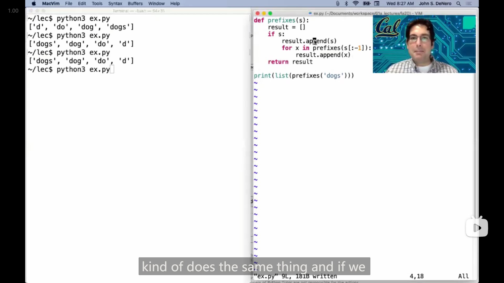{ loading=lazy }

John展示了一种不使用 `yield` 关键字也可以实现相同功能的写法：

```python
def prefixes(s):
    result = []
    if s:
        for x in prefixes(s[:-1]):
            result.append(x)
    return result

print(list(prefixes('doges')))
```

>   原本的使用 `yield` 的写法
>
>   ```python
>   def prefixes(s):
>       if s:
>           for x in prefixes(s[:-1]):
>               yield x
>           yield s
>   
>   print(list(prefixes('doges')))
>   ```

### 3

John 和 Hany 解释关于迭代器每次迭代时就会被*更改*的特点(一次性使用的特点)

!!! quote
    
    ```python
    s = [1, 2, 3]
    t = iter(s)
    
    len(list(t)) #-> returns 3
    len(list(t)) #-> returns 0?
    ```
    
    **John**:
    
    yeah good question, so the questions about this example and why is it the case that when you get the length of, uh, the result of listing out the contents of an iterator twice you get a different thing each time, first time you got three things, next time you got zero things. this isn't something having to do with len, this is having to do with how list interacts with an iterator. when you call list on an iterator, you end up building a list of all the contents of that iterator, but the iterator is used up as a side effect of calling list on it. so, if i have an iterator over these values, um, i can get one thing out of it, but then if i get another thing i get a different thing. list is kind of like calling next over and over again, and putting all the results in a list. so as soon as you call list on t, you're going to get everything that's left over in the iterator, that hasn't been used up or returned already. so we've already seen the one, we've seen the two, therefore calling list on t will just show us the three. and now t is used up, i can't get the next thing in t, because we're already at the end, and so if i try to list everything that's left and t, i'll get an empty list. so your version was start with this, get all the contents of that, which is a list containing one two and three. if i do this, i'm changing t. this is, uh, every time you get elements from an iterator, you're changing that iterator, which means you can't really use it again. so if you get the length of this you get three, you get the length of this you get zero.
    
    **Hany**:
    
    **so think of these iterators as one use disposable operators, once you've gone through the list, either next next next next, or the list of it is you're essentially enumerating the list, it's gone**. right, so by the way you could have implemented this yourself, you could have written a function that every time you access an element, the next element, you delete that element from the list, that's essentially what's going on here. yeah. and so once you, it's a funny thing about iterators by the way, is that once you look at the list, it's, it's sort of like, uh, what is it, **it's like snapchat, right, the image comes in, you look at it, and then it vanishes, it's gone**.
    
    **John**:
    
    that is beautiful.
    
    **Hany**:
    
    yeah, you got to be impressed by somebody my age, making a snapchat reference, that's, that's i think you know, you have a little credit for that.
    
    **John**:
    
    perfect snapchat analogy.
    
    ---
    
    ```python
    s = [1, 2, 3]
    t = iter(s)
    
    len(list(t)) #-> returns 3
    len(list(t)) #-> returns 0?
    ```
    
    **John**:
    
    是的，这是一个很好的问题。关于这个示例的问题是，为什么在两次获取迭代器的内容的长度时，每次都会得到不同的结果？第一次得到三个元素，下一次却得到零个元素？这与 `len` 函数无关，而与 `list` 如何与迭代器交互有关。当你在迭代器上调用 `list` 时，你实际上正在构建一个包含该迭代器的所有内容的列表，但调用 `list` 会消耗迭代器，这是一个副作用。因此，如果我有一个迭代器遍历这些值，我可以从中获取一个元素，但如果我再次获取一个元素，我将得到不同的结果。 `list` 就像一次又一次地调用 `next` ，然后将所有结果放入列表中。因此，一旦在 `t` 上调用 `list` ，你将获得迭代器中剩余的所有内容，这些内容尚未被使用或返回。所以我们已经看到了1和2，因此在 `t` 上调用 `list` 将只显示3。现在 `t` 已经被用完了，我无法再获取 `t` 中的下一个元素，因为我们已经到达末尾，所以如果我尝试列出 `t` 中剩下的所有内容，我将得到一个空列表。所以你的版本是从这个开始，获取了包含1、2和3的列表。如果我做这个，我就改变了 `t` 。每当从迭代器中获取元素时，你都会改变该迭代器，这意味着你不能再次使用它。因此，如果你获取这个的长度，你会得到3，如果你获取这个的长度，你会得到0。
    
    **Hany**:
    
    **所以把这些迭代器看作是一次性的操作符，一旦你遍历了列表，无论是通过连续调用 `next` 还是通过调用 `list` ，它们都消失了**。对，顺便说一句，你其实可以自己实现这个，你可以编写一个函数，每次访问一个元素，都从列表中删除那个元素，这本质上就是这里发生的事情。是的，所以一旦你看过列表，**这有点像 Snapchat，对吧？图像进来，你看了一眼，然后它就消失了，没有了**。
    
    **John**:
    
    这太精彩了。
    
    **Hany**:
    
    是的，你得对我这个年龄的人能够提到 Snapchat 感到印象深刻，我想你应该给我点信用。
    
    **John**:
    
    完美的 Snapchat 比喻。

## Lecture 18 Objects

### 1

{ loading=lazy }

关于 class 和 object 之间的关系的形容

!!! quote

    关于 class 和 object 的解释：
    
    -   **class**: A class combines (and abstracts) data and functions
    -   **object**: An object is an instantiation of a class

### 2

{ loading=lazy }

类内的方法在编写是，第一个参数须是 `self` ，

但类内方法在被调用的时候，不需要传入 `self` 的值，或者说 `self` 就是调用方法的实例，所以只需要传入之后的参数

### 3

{ loadind=lazy }

python有内置函数可以查询/访问类的实例的*属性(attribute)*，或者是类的属性 (**==类内的方法算作是类本身的属性，而不是具体实例的属性==**)

`getattr()` 可以访问属性，获取对应的值

`hasatrr()` 可以看是否有某个属性

**函数的第一个参数需要传入实例，第二个参数需要传入要查询的属性的属性名(以字符串传入)**

### 4

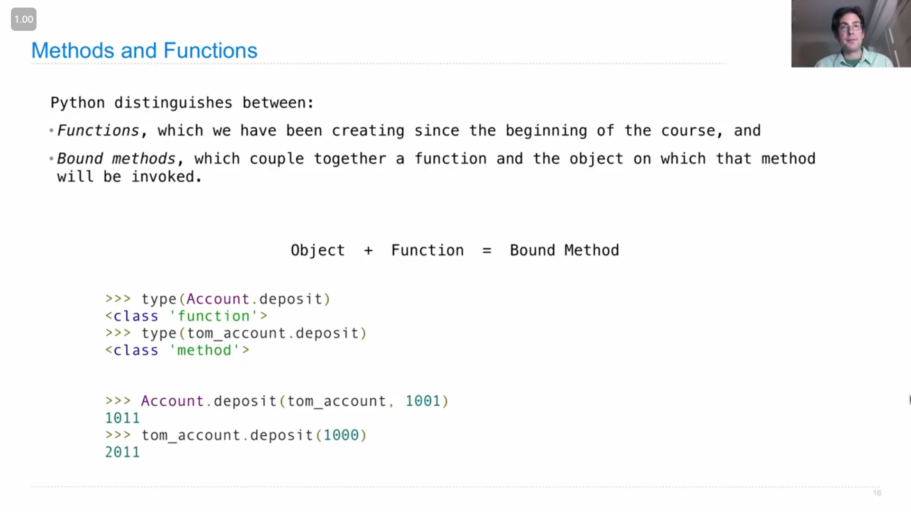{ loading=lazy }

如上图，`类名.方法名` 是一个函数，并且 `self` 参数需要传入东西，而 `对象.方法名` 是一个方法，`self` 不用传

### 5

{ loading=lazy }

**类属性**

如上图，在类中赋值的变量，(应该)就是类的属性(类内的方法也算是类的属性，第3点有提到过)，

**==类属性不是对象/实例的一部分，而是类的一部分==。每次通过对象来访问类属性，访问的是类中的属性，而通过 `对象.属性名` 赋值/更改属性，其实是在对象中创建/更改对应的属性(所以通过对象修改“类属性”不会更改实际的类属性)**

## Lecture 18 Q&A

### 1

类属性除了可以在类内定义，也可以在类以外，通过 `类名.属性名` 的形式赋值去定义，如

```python
class Account:
    ...
    
Account.interest = 0.03
```

>   ```python
>   >>> Account.interest  0.03
>   >>> a = Account('John')
>   >>> a.interest
>   0.03
>   >>> a.interest = 0.05
>   >>> a.interest
>   0.05
>   >>> b = Account('Hany')
>   >>> b.interest
>   0.03
>   >>> a.interest
>   0.05
>   >>> a.interest = Account.interest
>   >>> a.interest
>   0.03
>   >>> Account.interest = 0.04
>   >>> a.interest
>   0.03
>   >>>
>   ```

John的这段代码演示，显示了通过对象来修改“类属性”(指相同的名字)时，其实是修改的是具体对象中的属性

类和对象**两者各自的修改都不会影响到对方的属性**

**`del` 语句**，经过测试，是可以将对象中已有的属性清除掉，从而再次访问相同的属性名时，获取到的是类属性的值

```python
>>> class Account:
...     def __init__(self):
...         return
...
>>> Account.interest = 5
>>> p1 = Account()
>>> p1.interest
5
>>> del p1.interest
Traceback (most recent call last):
  File "<stdin>", line 1, in <module>
AttributeError: interest
>>> p1.interest += 2
>>> p1.interest
7
>>> Account.interest
5
>>> del p1.interest
>>> p1.interest
5
>>> del p1.interest
Traceback (most recent call last):
  File "<stdin>", line 1, in <module>
AttributeError: interest
>>>
```

### 2

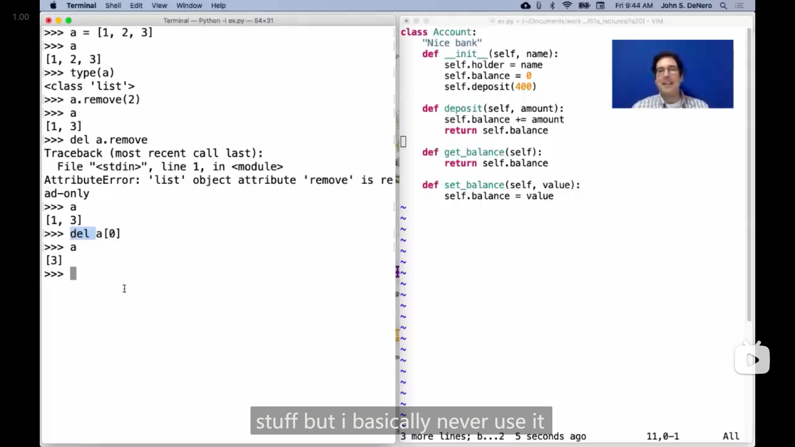{ loading=lazy }

`del` 也可以删除列表中的元素，

但是John说 `del` 不常用

## HW 04

### 1

Q4

!!! info

    *Hint:* If you had the permutations of all the elements in `seq` not including the first element, how could you use that to generate the permutations of the full `seq`?

这个提示很有用：考虑每次抽去其中一个元素的情况，然后依次递归...

一开始感觉能用推导式写成一行

```python
def permutations(seq):
    yield from [[seq[i]] + p for p in permutations(seq[:i] + seq[i + 1:]) for i in range(len(seq))]
```

然后发现，`i` 只对 `permutations(seq[:i] + seq[i + 1:])` 生效，`[seq[i]]` 中 `i` 显示未定义

然后改成

```python
def permutations(seq):
    for i in range(len(seq))
        yield from [[seq[i]] + p for p in permutations(seq[:i] + seq[i + 1:])]
```

然后在测试文档的一个测试用例中，用 `next()` 使用函数返回的生成器，显示 `StopIteration` ，

思考了很久，发现是因为，递归到了最后， `permutations(seq[:i] + seq[i + 1:])` 传入的是空列表，那么就不能*解压*出 `p` ，那么推导式的结果就会是空的列表，再一层层返回，所以最后整体的函数返回的生成器中没有可以迭代的元素

所以需要设置 base case ，(一开始以为不需要设置，或者说以为空列表就可以作为 base case)

```python
def permutations(seq):
    if len(seq) == 1:
        yield seq
    else:
        yield from [[seq[i]] + p for p in permutations(seq[:i] + seq[i + 1:])]
```

然后发现，测试文档中，有一个传入了元组，所以我稍加了修改

```python
def permutations(seq):
    seq = list(seq)
    if len(seq) == 1:
        yield seq
    else:
        yield from [[seq[i]] + p for p in permutations(seq[:i] + seq[i + 1:])]
```

>   后面发现，其实这样改也可以：
>
>   ```python
>   def permutations(seq):
>       if len(seq) == 1:
>           yield [seq[0]]
>       else:
>           yield from [[seq[i]] + p for p in permutations(seq[:i] + seq[i + 1:])]
>   ```

在思索到底一行语句实现功能是否可行时，想到了 `sum()` 函数，想到可以用它来把结果合并在一个列表中

```python
def permutations(seq):
    yield from sum([[... for p in permutations(seq[:i] + seq[i + 1:])] for i in range(len(seq))], start=[])
```

然后想到可以把 base case 放在 `sum` 函数外面

```python
def permutations(seq):
    yield from [[seq[0]]] if len(seq) == 1 else sum([[[seq[i]] + p for p in permutations(seq[:i] + seq[i + 1:])] for i in range(len(seq))], start=[])    
```

??? note "code"

    ```python
    def permutations(seq):
        """Generates all permutations of the given sequence. Each permutation is a
        list of the elements in SEQ in a different order. The permutations may be
        yielded in any order.
    
        >>> perms = permutations([100])
        >>> type(perms)
        <class 'generator'>
        >>> next(perms)
        [100]
        >>> try: #this piece of code prints "No more permutations!" if calling next would cause an error
        ...     next(perms)
        ... except StopIteration:
        ...     print('No more permutations!')
        No more permutations!
        >>> sorted(permutations([1, 2, 3])) # Returns a sorted list containing elements of the generator
        [[1, 2, 3], [1, 3, 2], [2, 1, 3], [2, 3, 1], [3, 1, 2], [3, 2, 1]]
        >>> sorted(permutations((10, 20, 30)))
        [[10, 20, 30], [10, 30, 20], [20, 10, 30], [20, 30, 10], [30, 10, 20], [30, 20, 10]]
        >>> sorted(permutations("ab"))
        [['a', 'b'], ['b', 'a']]
        """
        "*** YOUR CODE HERE ***"
        # seq = list(seq)
        # if len(seq) == 1:
        #     yield seq
        # else:
        #     for i in range(len(seq)):
        #         yield from [[seq[i]] + p for p in permutations(seq[:i] + seq[i + 1:])]
        yield from [[seq[0]]] if len(seq) == 1 else sum([[[seq[i]] + p for p in permutations(seq[:i] + seq[i + 1:])] for i in range(len(seq))], start=[])
    ```

### 2

Q5

>   Use `type(value) == str` to test if some `value` is a string

可以使用 `type(value) == str` 来判断一个东西是否是字符串

感觉我最后答案中的这一行是关键的地方：

```python
def make_joint(with_draw, old_pass, new_pass):
    def joint(amount, pw_input):
        ...
        return withdraw(amount, pw_input)  # key point
    ...
    return joint
```

??? note "code"

    ```python
    def make_joint(withdraw, old_pass, new_pass):
        """Return a password-protected withdraw function that has joint access to
        the balance of withdraw.
    
        >>> w = make_withdraw(100, 'hax0r')
        >>> w(25, 'hax0r')
        75
        >>> make_joint(w, 'my', 'secret')
        'Incorrect password'
        >>> j = make_joint(w, 'hax0r', 'secret')
        >>> w(25, 'secret')
        'Incorrect password'
        >>> j(25, 'secret')
        50
        >>> j(25, 'hax0r')
        25
        >>> j(100, 'secret')
        'Insufficient funds'
    
        >>> j2 = make_joint(j, 'secret', 'code')
        >>> j2(5, 'code')
        20
        >>> j2(5, 'secret')
        15
        >>> j2(5, 'hax0r')
        10
    
        >>> j2(25, 'password')
        'Incorrect password'
        >>> j2(5, 'secret')
        "Frozen account. Attempts: ['my', 'secret', 'password']"
        >>> j(5, 'secret')
        "Frozen account. Attempts: ['my', 'secret', 'password']"
        >>> w(5, 'hax0r')
        "Frozen account. Attempts: ['my', 'secret', 'password']"
        >>> make_joint(w, 'hax0r', 'hello')
        "Frozen account. Attempts: ['my', 'secret', 'password']"
        """
        "*** YOUR CODE HERE ***"
        def joint(amount, pw_input):
            if pw_input == new_pass:
                return withdraw(amount, old_pass)
            else:
                return withdraw(amount, pw_input)
        old_result = withdraw(0, old_pass)
        if type(old_result) == str:
            return old_result
        return joint
    ```

### 3

Q6

??? note "code"

    ```python
    def remainders_generator(m):
        """
        Yields m generators. The ith yielded generator yields natural numbers whose
        remainder is i when divided by m.
    
        >>> import types
        >>> [isinstance(gen, types.GeneratorType) for gen in remainders_generator(5)]
        [True, True, True, True, True]
        >>> remainders_four = remainders_generator(4)
        >>> for i in range(4):
        ...     print("First 3 natural numbers with remainder {0} when divided by 4:".format(i))
        ...     gen = next(remainders_four)
        ...     for _ in range(3):
        ...         print(next(gen))
        First 3 natural numbers with remainder 0 when divided by 4:
        4
        8
        12
        First 3 natural numbers with remainder 1 when divided by 4:
        1
        5
        9
        First 3 natural numbers with remainder 2 when divided by 4:
        2
        6
        10
        First 3 natural numbers with remainder 3 when divided by 4:
        3
        7
        11
        """
        "*** YOUR CODE HERE ***"
        def helper(i):
            # yield from [n * m + i for n in naturals()]
            if i != 0:
                yield i
            for n in naturals():
                yield n * m + i
        yield from [helper(i) for i in range(m)]
    ```

## Lecture 19 Inheritance

### 1

{ loading=lazy }

用 *点表达式 dot expression* 给属性赋值

==如果*点 `.`* 左边的对象是实例，那么赋值的就是实例的属性，==

==而如果*点 `.`* 左边的对象是类，那么赋值的就是类的属性==

>   这就解释了上节课 Q&A 中的第一点

并且，由于

>   Attribute assignment statement adds or modifies the attribute named ...

所以，属性赋值就是，如果实例/类**还没有**对应名字的属性，那么赋值就会添加一个相对应的属性，而如果已经存在对应名字的属性，那么就会修改这个属性的值

### 2

{ loading=lazy }

通过 `实例.属性` ，实际上是先在实例中先查看是否有对应的属性，如果有就返回，如果没有就到类中去查看是否有对应的属性

{ loading=lazy }

### 3

继承的语法：

```python
class <name>(<base class>):
    <suite>
```

### 4

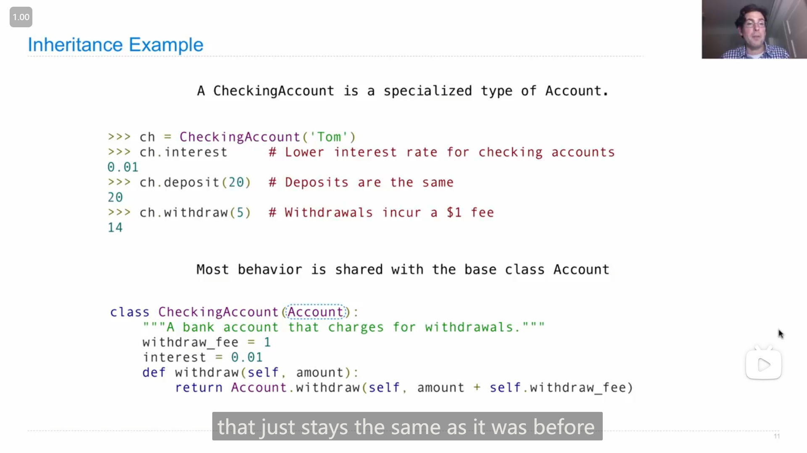{ loading=lazy }

一个使用继承的例子，没想到居然可以这样使用父类的方法 来修改成为自己的方法(惊奇地发现 `self` 参数原来是这么用的)

### 5

{ loading=lazy }

子类与父类的属性的使用关系感觉也是和实例与类的属性使用关系很像，即**父类的属性并没有复制并绑定到子类中，而是在使用属性时，现在子类中查看，如果没有就到父类中查看**(如果父类中没有就继续到父类的父类...)

### 6

John在demo中展示了 `CheckingAccount` 的 `withdraw` 方法的两种写法：

-   ```python
    class CheckingAccount(Account):
        ...
        def withdraw(self, amount):
            amount = amount + 1
            if amount > self.balance:
                return 'Insufficient funds'
            self.balance = self.balance - amount
            return self.balance
    ```

-   ```python
    class CheckingAccount(Account):
        ...
        withdraw_fee = 1
        def withdraw(self, amount):
            return Account.withdraw(self, amount + self.withdraw_fee)
    ```

前者相比于后者有个类似于(之前数据抽象相关的课程中提到的)打破抽象的界限的问题，会存在一个隐患，即如果对父类的方法进行修改，那么子类的方法还会是原来的样子，而后者如果父类被修改了，子类也会跟着一起修改

### 7

关于设计继承的时候John的几个**==建议==**：

-   **Don't repeat yourself; use existing implementations.**

    >   **try to avoid copying and pasting code**

    要避免直接复制代码，而是使用已经实现了的(父类的)方法或函数

-   **Attributes that have been overridden are still accessible via class objects.**

    意思就是，父类中被子类*覆写*了的属性，可以通过类名去访问

-   **Look up attributes on instances whenever possible.**

    意思是，尽可能使用实例的属性(值或者方法)，(而不是类的)

### 8

!!! quote

    **Inheritance and Composition**
    
    Object-oriented programming shines when we adopt the metaphor
    
    -   Inheritance is best for representing *is-a* relationships.
    
        E.g., a checking account **is a** specific type of account.
    
        So, CheckingAccount inherits from Account.
    
    -   Composition is best for representing *has-a* relationships.
    
        E.g., a bank **has a** collection of bank accounts it manages.
    
        So, A bank has a list of accounts as an attribute.

*继承*和*构成* (*Inheritance and Composition*)

==面向对象编程(的思想/概念)很适合类比现实中的事物==

-   **继承**适合表示 **是/属于** 的关系，比如：支票账户**是**银行账户的一种

    所以 支票账户 从 银行账户 继承

-   **构成**适合表示 **有** 的关系，比如：银行**有**很多银行账户

    所以，银行 有 一系列 银行账户 作为它的属性

### 9

{ loading=lazy }

关于第一个语句 `>>> C(2).n` 创建出的右下角的 `C` 类的实例中会存在 `z` 的疑惑和理解

由于**在创建 `C` 类的时候，会调用*初始化函数* `__init__()` ，而 `C` 类本身类中又没有*初始化函数*，所以==会调用父类中的*初始化函数*==**，故会调用 `B` 中的 `__init__()` ，**而值得注意的一点，由于是 `C` 的实例调用*初始化函数*，所以 ==`self` 被传入的是 `C` 的实例本身，因此 `self.z = self.f(y)` 这一行语句中，执行的 `f()` 函数是 `C` 类中的 `f()` 方法==，所以最后的结果是，那个实例中会存在一个 值为2的 `z`** 

所以对于python中的 `self` 参数有了新的认知，即**可以使用父类的方法，而 `self` 参数传入的却是子类的实例(所以要注意由于是子类的实例，有可能 `self.xxx` 之类的self的*点表达式*代码，得到的效果会和一般的父类实例不一样，比如上图中 `B` 的*初始化函数*如果传入的是 `B` 类的实例，那么很可能 `self.f(y)` 调用的是 `A` 类中的方法)**

>   在第三个语句中也出现了类似的情况(但是这第三个语句极其地绕)
>
>   `b = B(1)` 中，实例中的 `z` 由于调用了 `A` 中的 `f` 方法，所以指向了另一个 `B` 类实例，而新的实例*初始化函数*中 `z` 又指向的是一个 `C` 类的实例，而 `C` 类实例在初始化时，又需要调用 `B` 的 `__init__()` ，然后就调用了 `C` 类的 `f` 方法(我本来以为会一直 `B` 类 `C` 类来回一直指下去)

### 10

一个类可以继承多个父类，如

```python
class AsSeenOnTVAccount(CheckingAccount, SavingsAccount):
    def __init__(self, account_holder):
        self.holder = account_holder
        self.balance = 1
```

### 11

>   now it's hard for me to show you why this (multiple inheritance tends to make programs complicated) is the case, so instead I'll just show you an analogy about human inheritance.

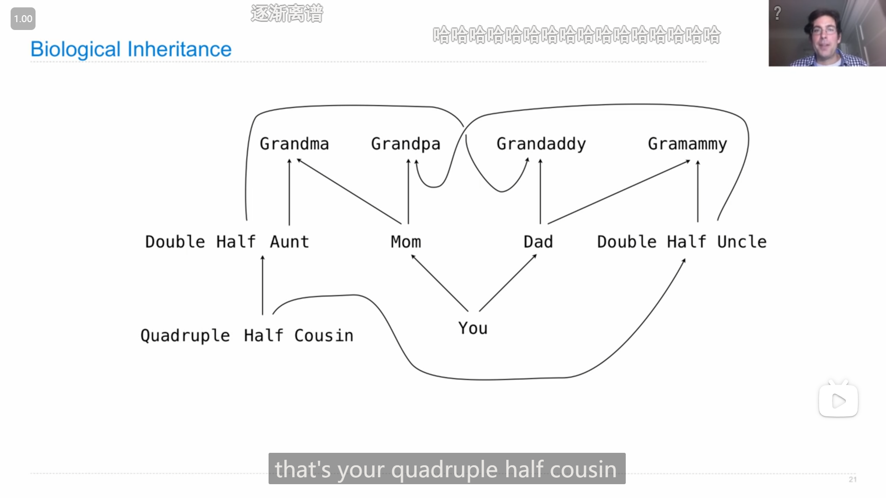{ loading=lazy }

在使用多重继承的时候，除非是真的很重要的关系，或者十分必须，在使用时要很注意，因为多重继承会使程序变得复杂，虽然很难举出例子，但是可以参考现实中(生物上)的继承

## Lecture 19 Q&A

### 1

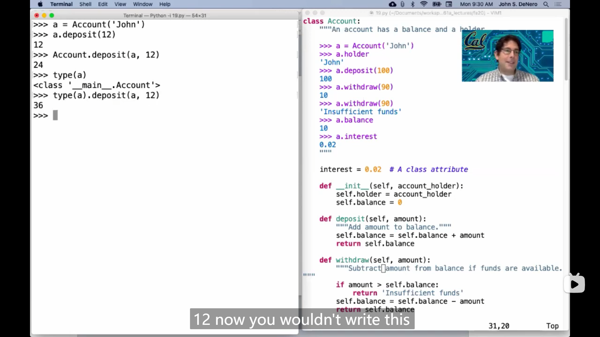{ loading=lazy }

`type()` 函数如果返回类，可以通过它的返回值来访问类内的属性，如

>   ```python
>   class Account:
>       def __init__(self, account_holder):
>           self.holderr = account_holder
>           self.balance = 0
>           
>       def deposit(self, amount):
>           self.balance = self.balance = amount
>           return self.balance
>   ```

```python
>>> a = Account('John')
>>> type(a).deposit(a, 100)
100
```

但是 Hany 说应该避免使用这种写法，因为大多数人不会怎么写

### 2

{ loading=lazy }

根据 John 的解释，`super()` 的作用是，不在本类中寻找 `.` 之后的东西，而是在上一级父类中寻找

并且在使用父类的*方法*时，会将实例自动传入 `self` 参数，和直接 `父类名.方法` 的使用形式略有不同

### 3

{ loading=lazy }

有多继承的类在使用本类中没有的方法时，是先在**上一级父类**中**按顺序**寻找，比如上图，如果在 `CheckingAccount` 中没找到对应的方法，那么不会在 `CheckingAccount` 的父类( `Acount` 类)中寻找，而是在 `SavingAccount` 类中寻找，**如果所有的上一级父类中都没找到对应的方法，那么才会在上两级父类中寻找(即父类的父类)**

### 4

??? quote

    **John**:
    
    well i'd say at the outset that it's often the case that tracing through, uh, tree recursion is not something that humans can tolerate, like it's, it's just really messy sometimes, um, so the right answer is to shift the way in which you approach understanding, uh, implementation to get away from tracing, and instead just treat the recursive calls as abstractions, they do the thing that they're supposed to do, but how they do them is not your problem, and then like you can put it together. but this is not, not like obvious or easy so, um, so maybe we can talk about that with a particular example. so maybe while i read this maybe hany can, uh, say whether that makes sense to him.
    
    **Hany**:
    
    i i'll add one more thing to it, so john's absolutely right that tracing tree recursion is very hard, you have to hold a lot in your memory. um, so one way to fix it is as he just said, is to just think differently about it. it's not about tracing, it's about thinking about the fundamental nature of, um, the, the functions and they just do what you want them to do, and the other is to just use toy examples.
    
    ---
    
    **John**：
    
    嗯，我首先要说的是，往往情况是，追踪树形递归对人类来说是无法忍受的，就像有时候非常混乱一样。所以正确的答案是改变你理解实现的方式，摆脱追踪，而是将递归调用视为抽象，它们执行它们应该执行的任务，但它们如何执行不是你的问题，然后你可以将它们组合起来。但这并不明显或容易，所以也许我们可以用一个具体的例子来讨论一下。所以也许在我阅读这个的时候，Hany可以说一下这是否有意义。
    
    **Hany**：
    
    我要补充一点，John说得对，追踪树形递归非常困难，你必须记住很多东西。所以解决的一种方法就像他刚才说的那样，只是以不同的方式思考。这不是关于追踪，而是思考函数的基本性质，它们只是执行你想要它们执行的任务，另一种方法是使用简单的示例。

John 和 Hany 说到**对树形递归追踪很难，所以不应该去追踪递归(我认为这里可以理解为，弄清楚递归的每一步的具体效果)，而是换一种想法去思考(即之前总结的假定函数能返回正确/所需的值)**

### 5

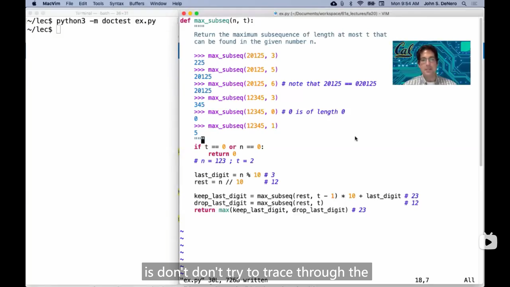{ loading=lazy }

John 解答 Lab04 中的 Q5 ，

提到，在解答/构建递归时，可以先拿简单的例子来进行思考，比如 `n = 123 ; t = 2` (而不要上来就尝试弄清楚 5 位数)，然后通过分析简单的例子，思路就会很清晰

## Lab 07

### 1

在做Q1时，本来使用

```python
yield from [x * multiplier for x in it]
```

但是当 `it` 是能无穷迭代的生成器时(如要测试的 `naturals()` )，就会超时，

但我询问 chatgpt ，它提供的代码与我上面的代码很像，只是把列表换成了元组，然后测试竟然不会超时，

**所以使用 `yield from` 时可以使用元组来避免可以无穷迭代的迭代器造成的超时**

下面是询问 chatgpt 为什么会这样的原因的记录

???+ example "chat log"

    **You**:
    
    Generators also allow us to represent infinite sequences, such as the sequence of natural numbers (1, 2, ...) shown in the function below!
    
    ```python
    def naturals():
        """A generator function that yields the infinite sequence of natural
        numbers, starting at 1.
    
        >>> m = naturals()
        >>> type(m)
        <class 'generator'>
        >>> [next(m) for _ in range(10)]
        [1, 2, 3, 4, 5, 6, 7, 8, 9, 10]
        """
        i = 1
        while True:
            yield i
            i += 1
    ```
    
    **Q1: Scale**
    
    Implement the generator function `scale(it, multiplier)`, which yields elements of the given iterable `it`, scaled by `multiplier`. As an extra challenge, try writing this function using a `yield from` statement!
    
    ```python
    def scale(it, multiplier):
        """Yield elements of the iterable it scaled by a number multiplier.
    
        >>> m = scale([1, 5, 2], 5)
        >>> type(m)
        <class 'generator'>
        >>> list(m)
        [5, 25, 10]
    
        >>> m = scale(naturals(), 2)
        >>> [next(m) for _ in range(5)]
        [2, 4, 6, 8, 10]
        """
        "*** YOUR CODE HERE ***"
    ```
    
    &nbsp;
    
    **ChatGPT**:
    
    Certainly! You can implement the `scale` generator function using a `yield from` statement. Here's one way to do it:
    
    ```python
    def scale(it, multiplier):
        """Yield elements of the iterable it scaled by a number multiplier."""
        yield from (element * multiplier for element in it)
    
    # Test cases
    m = scale([1, 5, 2], 5)
    print(type(m))  # <class 'generator'>
    print(list(m))  # [5, 25, 10]
    
    m = scale(naturals(), 2)
    print([next(m) for _ in range(5)])  # [2, 4, 6, 8, 10]
    ```
    
    In this implementation, the `scale` function uses a generator expression with `yield from` to yield elements of the iterable `it` scaled by the given `multiplier`. The generator expression `(element * multiplier for element in it)` generates scaled elements one by one, and `yield from` is used to yield each element from this expression.
    
    &nbsp;
    
    **You**:
    
    why timeout by using list type while not by using tuple type?
    
    &nbsp;
    
    **ChatGPT**:
    
    If you are experiencing a timeout when using a list type but not when using a tuple type, it might be due to the differences in how lists and tuples are handled in Python. Lists are mutable, meaning their elements can be changed after the list is created, while tuples are immutable, and their elements cannot be changed.
    
    When you use a list comprehension with a generator expression and `yield from`, the entire list needs to be generated in memory before any elements can be yielded. This might be problematic for an infinite generator, as attempting to generate an infinite list in memory can lead to a timeout.
    
    On the other hand, when using a tuple, it is immutable. Python can optimize and generate each element of the tuple on-the-fly without needing to create an entire list in memory. This can be more efficient, especially when dealing with infinite sequences.
    
    Here's an example to illustrate the difference:
    
    ```python
    # Using a list
    def scale_list(it, multiplier):
        yield from [x * multiplier for x in it]
    
    # Using a tuple
    def scale_tuple(it, multiplier):
        yield from (x * multiplier for x in it)
    
    # Test cases
    m_list = scale_list(naturals(), 2)
    # This may lead to a timeout because it attempts to generate an infinite list in memory.
    # print(list(m_list))
    
    m_tuple = scale_tuple(naturals(), 2)
    # This is more efficient because it generates each element on-the-fly without creating an entire list.
    print([next(m_tuple) for _ in range(5)])
    ```
    
    In the commented-out line for `scale_list`, attempting to convert an infinite list to a list object might cause the program to run out of memory or take a very long time, leading to a timeout. Using a tuple can avoid this issue because it doesn't try to create an entire list in memory.
    
    &nbsp;
    
    **You**:
    
    translate to chinese
    
    &nbsp;
    
    **ChatGPT**:
    
    如果你在使用列表类型时遇到超时问题，但在使用元组类型时却没有，这可能是由于 Python 处理列表和元组的方式不同。列表是可变的，意味着它们的元素在列表创建后可以被修改，而元组是不可变的，它们的元素不能被修改。
    
    当你使用列表解析与生成器表达式以及 `yield from` 时，在产生任何元素之前需要在内存中生成整个列表。对于无限生成器，尝试在内存中生成无限列表可能导致超时。
    
    另一方面，使用元组是不可变的。Python 可以优化并在需要时即时生成元组的每个元素，而无需创建整个列表在内存中。这可能更有效率，尤其是在处理无限序列时。
    
    以下是一个示例，用以说明这种差异：
    
    ```python
    # 使用列表
    def scale_list(it, multiplier):
        yield from [x * multiplier for x in it]
    
    # 使用元组
    def scale_tuple(it, multiplier):
        yield from (x * multiplier for x in it)
    
    # 测试案例
    m_list = scale_list(naturals(), 2)
    # 这可能导致超时，因为它试图在内存中生成一个无限列表。
    # print(list(m_list))
    
    m_tuple = scale_tuple(naturals(), 2)
    # 这更加有效，因为它在不创建整个列表的情况下即时生成每个元素。
    print([next(m_tuple) for _ in range(5)])
    ```
    
    在注释掉的 `scale_list` 的行中，试图将无限列表转换为列表对象可能导致程序耗尽内存或花费很长时间，从而导致超时。使用元组可以避免这个问题，因为它不会尝试在内存中创建整个列表。

### 2

Q5中，我利用列表的 `.pop()` 方法来实现 `Player.play()` 方法，

在之前课程视频里介绍列表的 `.pop()` 方法是只能移除并返回列表的最后一个元素，但上网查询发现 `.pop()` 方法只是默认最后一个，还可以传入下标指定要移除并返回的元素，例如

```python
>>> list = [1, 2, 3, 4, 5]
>>> list.pop()
5
>>> list
[1, 2, 3, 4]
>>> list.pop(1)
2
>>> list
[1, 3, 4]
```

## Project Ants

### 1

Problem 4 中，有一点值得注意

!!! quote

    A good way to approach the implementation to `ShortThrower` and `LongThrower` is to have it inherit the `nearest_bee` method from the base `ThrowerAnt` class. The logic of choosing which bee a thrower ant will attack is essentially the same, except the `ShortThrower` and `LongThrower` ants have maximum and minimum ranges, respectively.
    
    To implement these behaviors, you will need to modify the `nearest_bee` method to reference `min_range` and `max_range` attributes, and only return a bee that is in range.

这题中要求实现两个 *蚂蚁射手* 的子类的寻找射击目标的方法，我本来差点就是想的在原有的代码上进行修改，看到上面这段话，我才想到有更好的方法--去**使用父类的方法**，

**教程中建议的方法是**，在父类中添加属性，再在子类中(有需要的话)进行覆写

>   最后发现采用教程中的思路，居然可以在子类中不用重新实现方法，直接使用父类中的方法即可
>
>   所以说，**==能用父类的属性(值或者方法)，就用父类的，尽可能的不要去重新实现==**
>

??? note "code"

    class ThrowerAnt(Ant):
        ...
        # ADD/OVERRIDE CLASS ATTRIBUTES HERE
        food_cost = 3
        min_range = 0
        max_range = float('inf')
        
        def nearest_bee(self, beehive):
            """Return the nearest Bee in a Place that is not the HIVE (beehive), connected to
            the ThrowerAnt's Place by following entrances.
    
            This method returns None if there is no such Bee (or none in range).
            """
            # BEGIN Problem 3 and 4
            # return rANTdom_else_none(self.place.bees) # REPLACE THIS LINE
            place = self.place
            dist = 0
            while place is not beehive:
                if place.bees and dist >= self.min_range and dist <= self.max_range:
                    return rANTdom_else_none(place.bees)
                place = place.entrance
                dist += 1
            return None
            # END Problem 3 and 4
        
        ...
    
    class ShortThrower(ThrowerAnt):
        """A ThrowerAnt that only throws leaves at Bees at most 3 places away."""
    
        name = 'Short'
        food_cost = 2
        # OVERRIDE CLASS ATTRIBUTES HERE
        # BEGIN Problem 4
        max_range = 3
        # implemented = False   # Change to True to view in the GUI
        implemented = True
        # END Problem 4
    
    class LongThrower(ThrowerAnt):
        """A ThrowerAnt that only throws leaves at Bees at least 5 places away."""
    
        name = 'Long'
        food_cost = 2
        # OVERRIDE CLASS ATTRIBUTES HERE
        # BEGIN Problem 4
        min_range = 5
        # implemented = False   # Change to True to view in the GUI
        implemented = True
        # END Problem 4

### 2

Problem 4 中有一点提示，

可以使用 `float('inf')` 来获得一个*无穷大*的值

### 3

在 Extra Credit 中，

>   Some hints:
>
>   All instances of the same class share the same class attributes. How can you use this information to tell whether a QueenAnt instance is the true QueenAnt?
>
>   ...

基于这一点提示，所以我采取的方法是，在 `Ant` 类中设置一个类属性 `true_queen = None` 默认值是 `None` ，当第一个/真蚁后被创建时(通过判断 `true_queen` 是否为 `None` 来确定是否是真蚁后)， `true_queen` 就会指向它，而之后的蚁后就可以依据这个属性来判断出是*假蚁后*(impostor)

??? note "code"

    ```python
    class Ant(Insect):
        ...
        # ADD CLASS ATTRIBUTES HERE
        true_queen = None
        
        ...
        def remove_from(self, place):
            if self == self.true_queen:
                return
                    if place.ant is self:
                place.ant = None
            elif place.ant is None:
                assert False, '{0} is not in {1}'.format(self, place)
            else:
                # queen or container (optional) or other situation
                place.ant.remove_ant(self)
            Insect.remove_from(self, place)
            
    ...
    
    # BEGIN Problem EC
    # class QueenAnt(Ant):  # You should change this line
    class QueenAnt(ScubaThrower):
    # END Problem EC
        """The Queen of the colony. The game is over if a bee enters her place."""
    
        name = 'Queen'
        food_cost = 7
        # OVERRIDE CLASS ATTRIBUTES HERE
        # BEGIN Problem EC
        # implemented = False   # Change to True to view in the GUI
        implemented = True
        # END Problem EC
    
        def __init__(self, armor=1):
            # BEGIN Problem EC
            "*** YOUR CODE HERE ***"
            ScubaThrower.__init__(self, armor)
            self.buffed_ants = []
            if not Ant.true_queen:
                Ant.true_queen = self
            # END Problem EC
    
        def action(self, gamestate):
            """A queen ant throws a leaf, but also doubles the damage of ants
            in her tunnel.
    
            Impostor queens do only one thing: reduce their own armor to 0.
            """
            # BEGIN Problem EC
            "*** YOUR CODE HERE ***"
            if self is not self.true_queen:
                Ant.reduce_armor(self, self.armor)
                return
            ScubaThrower.action(self, gamestate)
            place = self.place.exit
            while place:
                if place.ant and place.ant not in self.buffed_ants:
                    place.ant.damage *= 2
                    self.buffed_ants += [place.ant]
                place = place.exit
            # END Problem EC
    
        def reduce_armor(self, amount):
            """Reduce armor by AMOUNT, and if the True QueenAnt has no armor
            remaining, signal the end of the game.
            """
            # BEGIN Problem EC
            "*** YOUR CODE HERE ***"
            ScubaThrower.reduce_armor(self, amount)
            if self == self.true_queen and self.armor <= 0:
                bees_win()
            # END Problem EC
    ```

### 4

Optional Problem 2 中

>   Hint: You may find the `isinstance` function useful for checking if an object is an instance of a given class. For example:
>
>   ```python
>       >>> a = Foo()
>       >>> isinstance(a, Foo)
>       True
>   ```

可以用 `isinstance()` 的函数来判断某个实例是否是某个类

### 5

Optional Problem 2 中

>   Note: the constructor of `ContainerAnt.__init__` is implemented as such
>
>   ```python
>       def __init__(self, *args, **kwargs):
>           Ant.__init__(self, *args, **kwargs)
>           self.contained_ant = None
>   ```
>
>   As we saw in Hog, we have that `args` is bound to all positional arguments (that is all arguments not passed not with keywords, and `kwargs` is bound to all the keyword arguments. This ensures that both sets of arguments are passed to the Ant constructor).

`args` 是所有没有 *关键字* (比如 `key=` 、 `base=` 就是关键字) 的参数，而 `kwargs` 是所有有 *关键字* 的参数

### 6

Optional Problem 2 有点难，debug都debug了10多次，成功实现的代码在下面

??? note "code"

    ```python
    class Ant(Insect):
        ...
        
        def add_to(self, place):
            if place.ant is None:
                place.ant = self
            else:
                # BEGIN Problem Optional 2
                # if not (isinstance(self, ContainerAnt) and self.can_contain(place.ant)) and not (isinstance(place.ant, ContainerAnt) and place.ant.can_contain(self)):
                if isinstance(self, ContainerAnt) and self.can_contain(place.ant):
                    self.contain_ant(place.ant)
                    place.ant = self
                elif isinstance(place.ant, ContainerAnt) and place.ant.can_contain(self):
                    place.ant.contain_ant(self)
                else:
                    assert place.ant is None, 'Two ants in {0}'.format(place)
                # END Problem Optional 2
            Insect.add_to(self, place)
        
        ...
        
    ...
    
    class ContainerAnt(Ant):
        def __init__(self, *args, **kwargs):
            Ant.__init__(self, *args, **kwargs)
            self.contained_ant = None
    
        def can_contain(self, other):
            # BEGIN Problem Optional 2
            "*** YOUR CODE HERE ***"
            return not self.contained_ant and not isinstance(other, ContainerAnt)
            # END Problem Optional 2
    
        def contain_ant(self, ant):
            # BEGIN Problem Optional 2
            "*** YOUR CODE HERE ***"
            if self.can_contain(ant):
                self.contained_ant = ant
                # self.place.ant = self
            # END Problem Optional 2
    
        def remove_ant(self, ant):
            if self.contained_ant is not ant:
                assert False, "{} does not contain {}".format(self, ant)
            self.contained_ant = None
    
        def remove_from(self, place):
            # Special handling for container ants (this is optional)
            if place.ant is self:
                # Container was removed. Contained ant should remain in the game
                place.ant = place.ant.contained_ant
                Insect.remove_from(self, place)
            else:
                # default to normal behavior
                Ant.remove_from(self, place)
    
        def action(self, gamestate):
            # BEGIN Optional 2
            "*** YOUR CODE HERE ***"
            if self.contained_ant:
                self.contained_ant.action(gamestate)
            # END Optional 2
    
    class BodyguardAnt(ContainerAnt):
        """BodyguardAnt provides protection to other Ants."""
    
        name = 'Bodyguard'
        food_cost = 4
        # OVERRIDE CLASS ATTRIBUTES HERE
        # BEGIN Optional 2
        # implemented = False   # Change to True to view in the GUI
        implemented = True
    
        def __init__(self, armor=2):
            ContainerAnt.__init__(self, armor)
        # END Optional 2
    ```

### 7

Optional Problem 4

这题我认为很难(看完题目要求时就已经头大了)，应该算是所有题目里面最难的一题，修修改改了很久才初步写完，然后还debug了很多次

---

刚开始时没什么头绪，所以打算 在教程的要求(主要要实现三个函数)中 **先从最简单的问题开始解决(最后发现这很有用，因为把简单的问题解决了，最后难的问题就变得清晰明了了)**，

`make_slow` 和 `make_scare` ，这两个基本上差不多，他们都是要返回一个新的方法

>   ```python
>   def make_slow(action, bee):
>       """Return a new action method that calls ACTION every other turn.
>   
>       action -- An action method of some Bee
>       """
>       # BEGIN Problem Optional 4
>       "*** YOUR CODE HERE ***"
>       # END Problem Optional 4
>   
>   def make_scare(action, bee):
>       """Return a new action method that makes the bee go backwards.
>   
>       action -- An action method of some Bee
>       """
>       # BEGIN Problem Optional 4
>       "*** YOUR CODE HERE ***"
>       # END Problem Optional 4
>   ```

但我一开始没有理解 *返回方法* 应该意味着什么，然后注意到了 **教程中的提示** ，即**==实例的方法是可以通过赋值去覆盖掉的==**

>   *Hint:* You will need to rebind a method in one of the functions. Note that when assigning to an instance, the self parameter isn't bound.
>
>   ```python
>     class X: pass
>     def f(x): return x ** 3
>     x = X()
>     x.f = f
>     print(x.f(2)) # prints 8
>   ```

所以我这时的想法是，在 `make_slow` 函数里面创建一个 用来当作方法 的函数，然后绑定到 `bee` 中，所以

```python
def make_slow(action, bee):
    def new_action(gamestate):
        if gamestate.time % 2 == 0:
            action(bee, gamestate)
    bee.action = new_action
    
...
```

但是突然感觉，方法应该是有 `self` 参数的，

以及 好像要求说的是要返回，所以我这时认为，应该要在函数中将这个 用作方法的函数 返回，然后在 `apply_status` 中再将它绑定到对象中，所以

```python
def make_slow(action, bee):
    def new_action(self, gamestate):
        if gamestate.time % 2 == 0:
            action(self, gamestate)
    return new_action
    
def make_scare(action, bee):
    def new_action(self, gamestate):
        bee.direction = self.place if self.place.entrance is gamestate.beehive else self.place.entrance
        action(self, gamestate)
    return new_action
```

`.direction` 属性是由于，教程中提示到

>   *Hint:* to make a bee go backwards, consider adding an instance variable indicating its current direction. Where should you change the bee's direction? Once the direction is known, how can you modify the `action` method of `Bee` to move appropriately?

所以我对 `Bee.action` 进行了修改

```python
class Bee(Insect):
    ...
    
    def action(self, gamestate):
        """A Bee's action stings the Ant that blocks its exit if it is blocked,
        or moves to the exit of its current place otherwise.

        gamestate -- The GameState, used to access game state information.
        """
        destination = self.place.exit
        # Extra credit: Special handling for bee direction
        # BEGIN EC
        "*** YOUR CODE HERE ***"
        destination = self.direction
        # END EC
        if self.blocked():
            self.sting(self.place.ant)
        elif self.armor > 0 and destination is not None:
            self.move_to(destination)
```

---

然后就开始写 `apply_status` 函数

一开始我没想好怎么设置 持续时间，所以就只是这样

```python
def apply_status(status, bee, length):
    """Apply a status to a BEE that lasts for LENGTH turns."""
    # BEGIN Problem Optional 4
    "*** YOUR CODE HERE ***"
    bee.action = status(bee.action, bee)
    # END Problem Optional 4
```

然后由于 剩余时间 需要被记录下来，而且我想到调用一次 action 函数就减少一次剩余时间，所以想到了在函数中再构建一个嵌套函数，然后使用 `nonlocal` 语句来减少 `length` 的值，并且在剩余时间为0的时候把方法换回原本的方法，所以

```python
def apply_status(status, bee, length):
    old_action = bee.action
    def new_action(gamestate):
        nonlocal length
        length -= 1
        status(old_action, bee)(self, gamestate)
        if length == 0:
            bee.action = old_action
            bee.direction = None
    bee.action = new_action
```

最后教程中还有一点，就是 **多状态** 的问题，

>   `apply_status` takes a `status` (either `make_slow` or `make_scare`), a `Bee`, and a `length`. The way it works is as so: imagine that a `Bee` has a bunch of statuses, each of which modifies `action` in sequence. When a status's length is up, it removes itself from the list. `apply_status` adds the given status to the end of the list, so that it is applied latest. Note that you don't necessarily need to make a literal list of statuses - it is just helpful to think of statuses in this way.
>
>   ---
>
>   As an example of what "previous behavior" means, take the example of a bee that has been slowed twice (say by two separate `SlowThrower`s). It will have the following behavior:
>
>   -   on time 1, it will do nothing. The outer slow has 2 turns to go, the inner one still has 3 turns
>   -   on time 2, it moves forward. The outer slow has 1 turn to go, the inner one has 2 turns
>   -   on time 3, it will do nothing. The outer slow has no turns left, the inner one has 2 turns
>   -   on time 4, it moves forward. The inner slow has 1 turn left
>   -   on time 5, it does nothing. The inner slow has no turns left

意思是要求，存在多个状态时，剩余时间会一起减少，但是应用的效果是按从早(最先生效)到晚(后产生)的顺序应用的，具体可以看教程中的解释

由于这个点我没有弄清楚应该如何实现，于是没有办法，我只能尝试先进行测试

---

测试出现的第一个问题

```python
>>> from ants import *
>>> beehive, layout = Hive(AssaultPlan()), dry_layout
>>> dimensions = (1, 9)
>>> gamestate = GameState(None, beehive, ant_types(), layout, dimensions)
>>> # Testing Slow
>>> slow = SlowThrower()
>>> bee = Bee(3)
>>> gamestate.places["tunnel_0_0"].add_insect(slow)
>>> gamestate.places["tunnel_0_4"].add_insect(bee)
>>> slow.action(gamestate)
>>> gamestate.time = 1
>>> bee.action(gamestate)
TypeError: apply_status.<locals>.new_action() missing 1 required positional argument: 'gamestate'

# Error: expected

# but got
#     Traceback (most recent call last):
#       ...
#     TypeError: apply_status.<locals>.new_action() missing 1 required positional argument: 'gamestate'
```

是指 `apply_status` 函数中的嵌套函数 `new_action` 在被使用时，第二个 `gamestate` 参数没有被传入值(一开始我的理解还有些偏差，经过了一些测试和试错才最终确定是这个原因)

这就意味着， `bee.action(gamestate)` 处，在调用新的方法时，只传入了一个参数(所以第二个参数没有被传入)，所以这似乎告诉我，在编写新的方法时，并不需要使用 `self` 参数

为了求证，我重新去查看和理解教程中给出的示例

>   *Hint:* You will need to rebind a method in one of the functions. Note that when assigning to an instance, the self parameter isn't bound.
>
>   ```python
>     class X: pass
>     def f(x): return x ** 3
>     x = X()
>     x.f = f
>     print(x.f(2)) # prints 8
>   ```

如何发现，这里面的 新方法 就是没有 `self` 参数，并且在调用时，这个实例也没有将自身作为参数传入其中(调用自身或父类的方法时，会把自身 **隐式地** 传入 `self` 参数)，所以得到结论，**==如果一个在类外定义的函数，被绑定成为了某个实例的属性，或者某种程度上可以说时成为了这个实例的一个方法，在通过 `实例.属性名` 的方式使用这个函数/方法时，是不会将实例传入函数/方法的==**

所以对原有代码进行了修改

```python
def make_slow(action, bee):
    def new_action(gamestate):
        if gamestate.time % 2 == 0:
            action(bee gamestate)
    return new_action

def make_scare(action, bee):
    def new_action(gamestate):
        bee.direction = bee.place if bee.place.entrance is gamestate.beehive else bee.place.entrance
        action(bee, gamestate)
    return new_action

def apply_status(status, bee, length):
    old_action = bee.action
    def new_action(gamestate):
        nonlocal length
        length -= 1
        status(old_action, bee)(gamestate)
        if length == 0:
            bee.action = old_action
            bee.direction = None
    bee.action = new_action
```

然后在测试修改好的代码时，发现

```python
>>> from ants import *
>>> beehive, layout = Hive(AssaultPlan()), dry_layout
>>> dimensions = (1, 9)
>>> gamestate = GameState(None, beehive, ant_types(), layout, dimensions)
>>> # Testing Slow
>>> slow = SlowThrower()
>>> bee = Bee(3)
>>> gamestate.places["tunnel_0_0"].add_insect(slow)
>>> gamestate.places["tunnel_0_4"].add_insect(bee)
>>> slow.action(gamestate)
>>> gamestate.time = 1
>>> bee.action(gamestate)
Traceback (most recent call last):
  File "E:\Courses\cs61a\projects\ants\ants.py", line 606, in new_action
    action(gamestate)
  File "E:\Courses\cs61a\projects\ants\ants.py", line 470, in action
    destination = self.direction
AttributeError: 'Bee' object has no attribute 'direction'

# Error: expected

# but got
#     Traceback (most recent call last):
#       ...
#     AttributeError: 'Bee' object has no attribute 'direction'
```

由于 `bee.direction` 没有初始值/默认值，所以有可能出现属性不存在的情况，所以进行修改

```python
class Bee(Insect):
    ...
    direction = None
    ...
    
    def action(self, gamestate):
        destination = self.place.exit
        # Extra credit: Special handling for bee direction
        # BEGIN EC
        "*** YOUR CODE HERE ***"
        if self.direction:
            destination = self.direction
        # END EC
        if self.blocked():
            self.sting(self.place.ant)
        elif self.armor > 0 and destination is not None:
            self.move_to(destination)
```

然后又出现了一个问题，

```python
>>> from ants import *
>>> beehive, layout = Hive(AssaultPlan()), dry_layout
>>> dimensions = (1, 9)
>>> gamestate = GameState(None, beehive, ant_types(), layout, dimensions)
>>> # Testing Slow
>>> slow = SlowThrower()
>>> bee = Bee(3)
>>> gamestate.places["tunnel_0_0"].add_insect(slow)
>>> gamestate.places["tunnel_0_4"].add_insect(bee)
>>> slow.action(gamestate)
>>> gamestate.time = 1
>>> bee.action(gamestate)
Traceback (most recent call last):
  File "E:\Courses\cs61a\projects\ants\ants.py", line 606, in new_action
    action(bee, gamestate)
TypeError: Bee.action() takes 2 positional arguments but 3 were given

# Error: expected

# but got
#     Traceback (most recent call last):
#       ...
#     TypeError: Bee.action() takes 2 positional arguments but 3 were given
```

`bee` 原本的方法传入了一个参数，所以可以发现，**==实例的方法本身已经将实例本身传入了 `self` 参数==**，比如 `old_action = bee.action` ，`bee.action` 已经给 `Bee.action` 中的 `self` 参数传入了自身(即 `bee` 实例)，而如果使用 `old_action` ，比如 `old_action(gs)` ，那么 `gs` 会被传入 `Bee.action` 的 `gamestate` (第二个参数)而不是 `self` 

所以进行修改

```python
def make_slow(action, bee):
    def new_action(gamestate):
        if gamestate.time % 2 == 0:
            action(gamestate)
    return new_action

def make_scare(action, bee):
    def new_action(gamestate):
        bee.direction = bee.place if bee.place.entrance is gamestate.beehive else bee.place.entrance
        action(gamestate)
    return new_action

def apply_status(status, bee, length):
    old_action = bee.action
    def new_action(gamestate):
        nonlocal length
        length -= 1
        status(old_action, bee)(gamestate)
        if length == 0:
            bee.action = old_action
            bee.direction = None
    bee.action = new_action
```

---

测试出现的第二个问题

```python
>>> from ants import *
>>> beehive, layout = Hive(AssaultPlan()), dry_layout
>>> dimensions = (1, 9)
>>> gamestate = GameState(None, beehive, ant_types(), layout, dimensions)
>>> scare = ScaryThrower()
>>> bee = Bee(3)
>>> gamestate.places["tunnel_0_0"].add_insect(scare)
>>> gamestate.places["tunnel_0_1"].add_insect(bee)
>>> scare.action(gamestate)
>>> bee.action(gamestate)
>>> bee.place.name
'tunnel_0_2'
>>> bee.action(gamestate)
>>> bee.place.name
'tunnel_0_3'
>>> #
>>> # Same bee should not be scared more than once
>>> scare.action(gamestate)
>>> bee.action(gamestate)
>>> bee.place.name
'tunnel_0_4'

# Error: expected
#     'tunnel_0_2'
# but got
#     'tunnel_0_4'
```

同一个蜜蜂只能被*恐吓*一次，所以对原有代码进行修改

```python
class Bee(Insect):
    ...
    direction = None
    has_been_scared = False
    ...

...
def make_scare(action, bee):
    def new_action(gamestate):
        if not bee.has_been_scared:
            bee.direction = bee.place if bee.place.entrance is gamestate.beehive else bee.place.entrance
        action(gamestate)
    return new_action

def apply_status(status, bee, length):
    old_action = bee.action
    def new_action(gamestate):
        nonlocal length
        length -= 1
        status(old_action, bee)(gamestate)
        if length == 0:
            bee.action = old_action
            bee.direction = None
            if status is make_scare:
                bee.has_been_scared = True
    bee.action = new_action
```

---

测试出现的第三个问题

```python
>>> from ants import *
>>> beehive, layout = Hive(AssaultPlan()), dry_layout
>>> dimensions = (1, 9)
>>> gamestate = GameState(None, beehive, ant_types(), layout, dimensions)
>>> # Testing long status stack
>>> scary = ScaryThrower()
>>> slow = SlowThrower()
>>> bee = Bee(3)
>>> gamestate.places["tunnel_0_0"].add_insect(scary)
>>> gamestate.places["tunnel_0_1"].add_insect(slow)
>>> gamestate.places["tunnel_0_3"].add_insect(bee)
>>> scary.action(gamestate) # scare bee once
>>> gamestate.time = 0
>>> bee.action(gamestate) # scared
>>> bee.place.name
'tunnel_0_4'
>>> for _ in range(3): # slow bee three times
...    slow.action(gamestate)
>>> gamestate.time = 1
>>> bee.action(gamestate) # scared, but also slowed thrice
>>> bee.place.name
'tunnel_0_4'
>>> gamestate.time = 2
>>> bee.action(gamestate) # scared and slowed thrice
>>> bee.place.name
'tunnel_0_5'
>>> gamestate.time = 3
>>> bee.action(gamestate) # slowed thrice
>>> bee.place.name
'tunnel_0_4'

# Error: expected
#     'tunnel_0_5'
# but got
#     'tunnel_0_4'
```

我判断这个就是由于没有处理多状态的情况而产生的问题

然后开始观察测试的代码(因为前几个输出都没有报错)，经过思考以及梳理代码的具体流程，我大概明白了出现这种情况的原因(前面计中情况没错而后面错了)，问题可能是出在，多状态下，*恐吓*状态结束时，(我写的原本的代码中)会把实例的 `.action` 方法赋值成原来的 `action` 方法，就应该会导致某种矛盾

而前面没有出错的 是因为 ***==恐吓==*==之后的*减速*状态，是将*恐吓*后的新 `action` 方法设置成了旧 `action` 方法，所以会有种类似于 hw04 的 Q5 Joint Account 一样的感觉(即联合账户在取钱时，会调用原账户的方法，然后如果原账户也是一个联合账户，那么就会继续调用原账户的原账户的方法...)==**，所以我的理解是这样

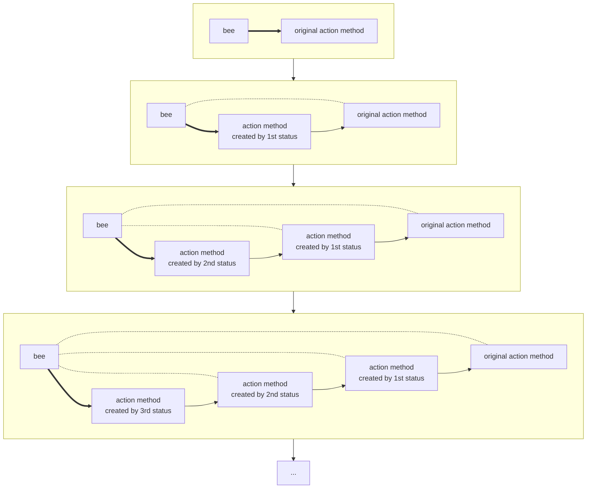
```mermaid
flowchart TD
subgraph g1[" "]
a1["bee"] ==> b1["original action method"]
end
subgraph g2[" "]
a2["bee"] -.- b2["original action method"]
a2 ==> c2["action method \n created by 1st status"]
c2 --> b2
end
subgraph g3[" "]
a3["bee"] -.- b3["original action method"]
a3 -.- c3["action method \n created by 1st status"]
a3 ==> d3["action method \n created by 2nd status"]
d3 --> c3
c3 --> b3
end
subgraph g4[" "]
a4["bee"] -.- b4["original action method"]
a4 -.- c4["action method \n created by 1st status"]
a4 -.- d4["action method \n created by 2nd status"]
a4 ==> e4["action method \n created by 3rd status"]
e4 --> d4
d4 --> c4
c4 --> b4
end
g1 --> g2 --> g3 --> g4 --> ...
```

由于在状态剩余时间减为0之后，想不到如何把 `old_action` 给后面的 新action方法

所以将思路改变成，在剩余时间减为0之后，不结束函数，而是继续保留函数，并且剩余时间减为0之后就直接执行原本的 `old_action` 方法即可，所以

```python
def apply_status(status, bee, length):
    old_action = bee.action
    def new_action(gamestate):
        nonlocal length
        if length > 0:
            length -= 1
            status(old_action, bee)(gamestate)
            if length == 0:
                bee.direction = None
                if status is make_scare:
                    bee.has_been_scared = True
        else:
            old_action(gamestate)
    bee.action = new_action
```

最终终于成功解决这个问题

```bash
$ python ok -q optional4 --local
=====================================================================
Assignment: Project 3: Ants Vs. SomeBees
OK, version v1.18.1
=====================================================================

~~~~~~~~~~~~~~~~~~~~~~~~~~~~~~~~~~~~~~~~~~~~~~~~~~~~~~~~~~~~~~~~~~~~~
Running tests

---------------------------------------------------------------------
Test summary
    10 test cases passed! No cases failed.
```

??? note "code"

    ```python
    class Bee(Insect):
        ...
        # OVERRIDE CLASS ATTRIBUTES HERE
        ...
        direction = None
        has_been_scared = False


​    
​        ...
​    
​        def action(self, gamestate):
​            """A Bee's action stings the Ant that blocks its exit if it is blocked,
​            or moves to the exit of its current place otherwise.
​    
​            gamestate -- The GameState, used to access game state information.
​            """
​            destination = self.place.exit
​            # Extra credit: Special handling for bee direction
​            # BEGIN EC
​            "*** YOUR CODE HERE ***"
​            if self.direction:
​                destination = self.direction
​            # END EC
​            if self.blocked():
​                self.sting(self.place.ant)
​            elif self.armor > 0 and destination is not None:
​                self.move_to(destination)
​    
​        ...
​    
​    ...
​    
​    ############
​    # Statuses #
​    ############
​    
​    def make_slow(action, bee):
​        """Return a new action method that calls ACTION every other turn.
​    
​        action -- An action method of some Bee
​        """
​        # BEGIN Problem Optional 4
​        "*** YOUR CODE HERE ***"
​        # def new_action(gamestate):
​        #     if gamestate.time % 2 == 1:
​        #         action(bee, gamestate)
​        def new_action(gamestate):
​            if gamestate.time % 2 == 0:
​                action(gamestate)
​        # bee.action = new_action
​        return new_action
​        # END Problem Optional 4
​    
​    def make_scare(action, bee):
​        """Return a new action method that makes the bee go backwards.
​    
​        action -- An action method of some Bee
​        """
​        # BEGIN Problem Optional 4
​        "*** YOUR CODE HERE ***"
​        # bee.direction = bee.place.exit
​        # def new_action(gamestate):
​        #     bee.direction = bee.place if bee.place.entrance is gamestate.beehive else bee.place.entrance
​        #     action(bee, gamestate)
​        def new_action(gamestate):
​            if not bee.has_been_scared:
​                bee.direction = bee.place if bee.place.entrance is gamestate.beehive else bee.place.entrance
​            action(gamestate)
​        # bee.action = new_action
​        return new_action
​        # END Problem Optional 4
​    
​    def apply_status(status, bee, length):
​        """Apply a status to a BEE that lasts for LENGTH turns."""
​        # BEGIN Problem Optional 4
​        "*** YOUR CODE HERE ***"
​        old_action = bee.action
​        def new_action(gamestate):
​            nonlocal length
​            if length > 0:
​                length -= 1
​                status(old_action, bee)(gamestate)
​                if length == 0:
​                    # bee.action = old_action
​                    bee.direction = None
​                    if status is make_scare:
​                        bee.has_been_scared = True
​            else:
​                old_action(gamestate)
​        # bee.action = status(bee.action, bee)
​        bee.action = new_action
​        # END Problem Optional 4


​    
​    class SlowThrower(ThrowerAnt):
​        """ThrowerAnt that causes Slow on Bees."""
​    
​        name = 'Slow'
​        food_cost = 4
​        # BEGIN Problem Optional 4
​        # implemented = False   # Change to True to view in the GUI
​        implemented = True
​        # END Problem Optional 4
​    
​        def throw_at(self, target):
​            if target:
​                apply_status(make_slow, target, 3)


​    class ScaryThrower(ThrowerAnt):
​        """ThrowerAnt that intimidates Bees, making them back away instead of advancing."""
​    
​        name = 'Scary'
​        food_cost = 6
​        # BEGIN Problem Optional 4
​        # implemented = False   # Change to True to view in the GUI
​        implemented = True
​        # END Problem Optional 4
​    
​        def throw_at(self, target):
​            # BEGIN Problem Optional 4
​            "*** YOUR CODE HERE ***"
​            if target:
​                apply_status(make_scare, target, 2)
​            # END Problem Optional 4
​    ```

## Lecture 20 Representation

### 1

{ loading=lazy }

`repr()` 函数能把python表达式转换成在自然语言中*规范*的字符串，

返回的字符串和在终端中使用交互式的python，输入表达式时显示的结果一样(即如上图，`12e12` 和 `print(repr(12e12))` 显示的一样)

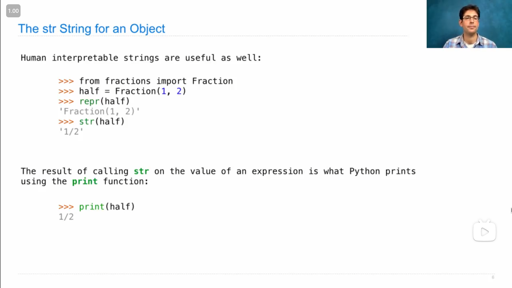{ loading=lazy }

`str()` (类)可以将对象转换成(其对应的)字符串(感觉有点类似于 c++ 中 左移运算符 `<<` 的重载)，这个字符串和 使用 `print` 函数 显示的结果是相应的(或者说使用 `print` 函数会隐式地调用 `__str__` 方法)

上图中可以看到 `repr()` 和 `str()` 的不同之处

### 2

`repr()` 和 `str()` 都是通过调用传入参数的方法来实现功能

`repr()` 会调用 `__repr__` 方法，

>   ```python
>   def repr(x):
>       return type(x).__repr__(x)
>   ```
>
>   使用类内方法可以避免在实例中修改了方法

`str()` 会调用 `__str__` 方法

>   如果没有 `__str__` 方法，则调用 `__repr__` 方法
>
>   ```python
>   def str(x):
>       t = type(x)
>       if hasattr(t, '__str__'):
>           return t.__str__(x)
>       else:
>           return t.__repr__(x)
>   ```

### 3

如果一个类没有 `__str__` 方法，在直接调用 `__str__` 方法时，会改为调用 `__repr__` 方法

>   ```python
>   class Bear:
>       """A Bear."""
>       
>       def __repr__(self):
>           return 'Bear()'
>       
>   oski = Bear()
>   print(oski)
>   print(str(oski))
>   print(repr(oski))
>   print(oski.__str__())
>   print(oski.__repr__())
>   ```
>
>   运行以上代码，会显示
>
>   ```bash
>   Bear()
>   Bear()
>   Bear()
>   Bear()
>   Bear()
>   ```

### 4

字符串可以使用 `.format()` 来填入参数(需要注意序号/下标与传入顺序对应)

```python
>>> x = 5
>>> y = 6
>>> "x + y = {0}".format(x + y)
'x + y = 11'
>>> "x + y = {1}".format(x + y, y)
'x + y = 6'
```

或者也可以使用

```python
>>> f"x + y = {x + y}"
'x + y = 11'
```

### 5

{ loading=lazy }

python的一些特殊方法名(前后都有两个下划线的方法)

### 6

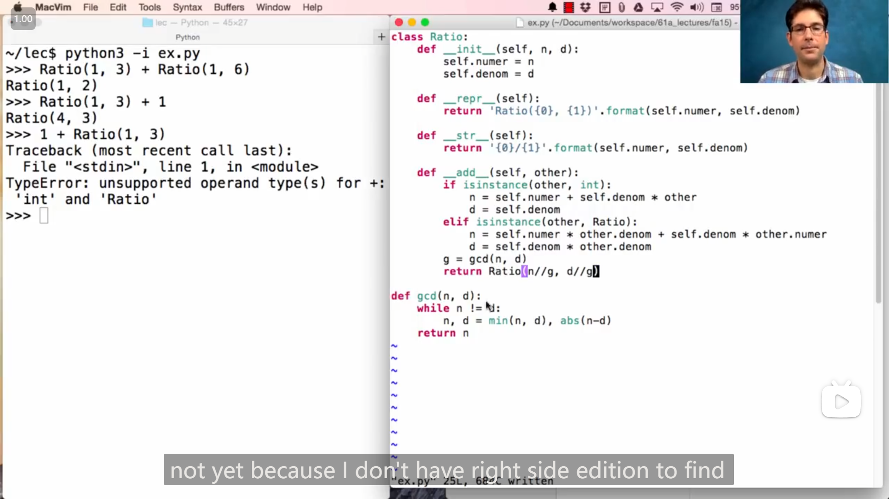{ loading=lazy }

`__add__` 方法是实例在加号左边时使用， `__radd__` 方法是实例在加号右边时使用，

>   John 直接添加了一行代码
>
>   ```python
>   __radd__ = __add__
>   ```

## Lecture 20 Q&A

### 1

{ loading=lazy }

`type` 和 `isinstance` 的区别

-   `isinstance` 会判断一个实例是否是某个类或它的子类们
-   `type` 只会返回实例具体的类

### 2

{ loading=lazy }

John 使用递归和 `yield` 语句来实现输出树的所有根到叶子的路径的方法

```python
def print_all_paths(t):
    """Print all the paths from the root to a leaf.
    
    >>> t = tree(1, [tree(2, [tree(3), tree(5)]), tree(4)])
    >>> print_all_paths(t)
    [1, 2, 3]
    [1, 2, 5]
    [1, 4]
    """
    for path in all_paths(t):
        print(path)

def all_paths(t):
    if is_leaf(t):
        yield [label(t)]
    for b in branches(t):
        for path in all_paths(b):   # path might be [2, 3]
            yield [label(t)] + path # yielding [1, 2, 3]
```

## Lecture 21 Composition

### 1

John 为自定义的 *链表 Linked List* 类 用递归的方式编写了类似于python内置的 `range` `map` `filter` 函数

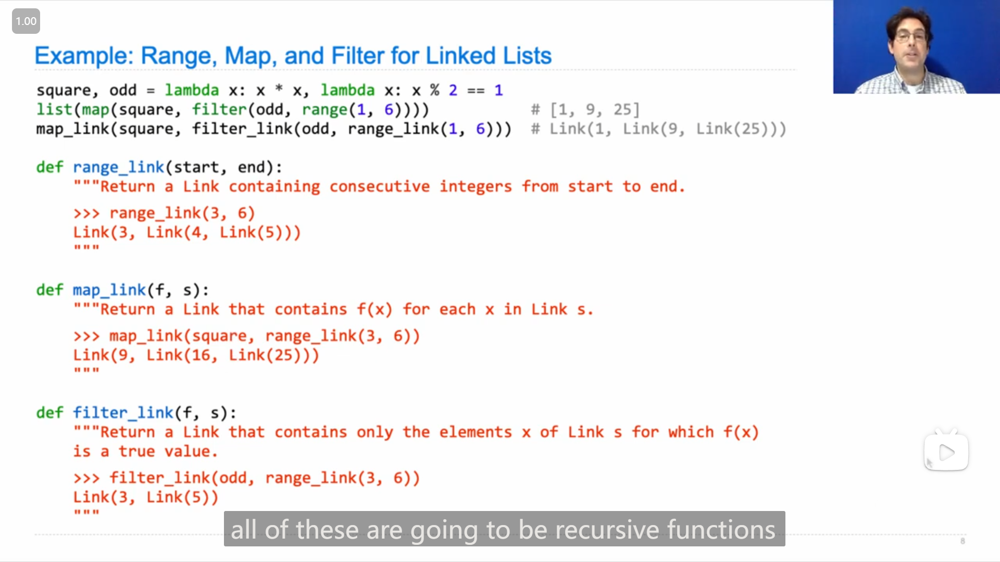{ loading=lazy }

>   ```python
>   class Link:
>       empty = ()
>       
>       def __init__(self, first, rest=empty):
>           assert rest is Link.empty or isinstance(rest, Link)
>           self.first = first
>           self.rest = rest
>           
>       def __repr__(self):
>           if self.rest:
>               rest_repr = ', ' + repr(self.rest)
>           else:
>               rest_repr = ''
>           return 'Link()' + repr(self.first) + rest_repr + ')'
>       
>       def __str__(self):
>           string = '<'
>           while self.rest is not Link.empty:
>               string += str(self.first) + ' '
>               slef = self.rest
>           return string + str(self.first) + '>'
>   ```

```python
def range_link(start, end):
    """Return a Link containing consecutive integers from start to end.
    
    >>> range_link(3, 6)
    Link(e, Link(4, Link(5)))
    """
    if start >= end:
        return Link.empty
    else:
        return Link(start, range_link(start + 1, end))
```

```python
def map_link(f, s):
    """Return a link that contains f(x) for each x in Link s.
    
    >>> map_link(square, range_link(3, 6))
    Link(9, Link(16, Link(25)))
    """
    if s is Link.empty:
        return s
    else:
        return Link(f(s.first), map_link(f, s.rest))
```

```python
def filter_link(f, s):
    """Return a Link that contains only the elements x of Link s for which f(x) is a true value.
    
    >>> filter_link(odd, range_link(3, 6))
    Link(3, Link(5))
    """
    if s is Link.empty:
        return s
    filtered_rest = filter_link(f, s.rest)
    if f(s.first):
        return Link(s.first, filtered_rest)
    else:
        return filtered_rest
```

### 2

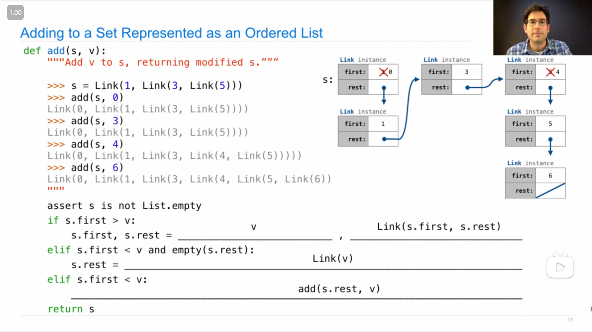{ loading=lazy }

John 用递归的方式写的 自定义链表结构 的 `add` 函数(让我觉得看起来很简洁)

```python
def add(s, v):
    """Add v to s, returning modified s.
    
    >>> s = Link(1, Link(3, Link(5)))
    >>> add(s, 0)
    Link(0, Link(1, Link(3, Link(5))))
    >>> add(s, 3)
    Link(0, Link(1, Link(3, Link(5))))
    >>> add(s, 4)
    Link(0, Link(1, Link(3, Link(4, Link(5)))))
    >>> add(s, 6)
    Link(0, Link(1, Link(3, Link(4, Link(5, Link(6))))))
    """
    assert s is not Link.empty
    if s.first > v:
        s.first, s.rest = v, Link(s.first, s.rest)
    elif s.first < v and empty(s.rest):
        s.rest = Link(v)
    elif s.first < v:
        add(s.rest, v)
    return s
```

### 3

John 展示的 `Tree` 类的实现代码

```python
class Tree:
    """A tree is a label and a list of branches."""
    def __init__(self, label, branches=[]):
        self.label = label
        for branch in branches:
            assert isinstance(branch, Tree)
        self.branches = list(branches)
        
    def __repr__(self):
        if self.branches:
            branch_str = ', ' + repr(self.branches)
        else:
            branch_str = ''
        return 'Tree({0}{1})'.format(repr(self.label), branch_str)
    
    def __str__(self):
        return '\n'.join(self.indented())
    
    def indented(self):
        lines = []
        for b in self.branches:
            for line in b.indented():
                lines.append('  ' + line)
        return [str(self.label)] + lines
    
    def is_leaf(self):
        return not self.branches
```

## HW 05

### 1

Q5 中，本来我以为

```python
return [t.label].extend([preorder(b) for b in t.branches])
```

能实现，但是显示没有返回的值，然后进行测试发现，**列表的 `.append()` 和 `.extend()` 方法没有返回值**

### 2

Q6，我的两种实现方式

-   按照原本提供的框架

    ??? note "code"

        ```python
        def path_yielder(t, value):
            "*** YOUR CODE HERE ***"
            
            if t.label == value:
                yield [t.label]
            for b in t.branches:
                for path in path_yielder(b, value):
            
                    "*** YOUR CODE HERE ***"
                    yield [t.label] + path
        ```
    
-   我整合成一行代码

    ??? note "code"

        ```python
        def path_yielder(t, value):
            yield from (([[t.label]] if t.label == value else []) +
                        sum([[[t.label] + path for path in path_yielder(b, value)] for b in t.branches], start=[]))
        ```

### 3

Q3中，原本我是用递归的方式来实现，但是会稍微麻烦一些，

```python
def store_digits(n):
    if n // 10 == 0:
        return Link(n)
    else:
        pre_digits = store_digits(n // 10)
        last_digits = pre_digits
        while last_digits.rest != Link.empty:
            last_digits = last_digits.rest
        last_digits.rest = Link(n % 10)
        return pre_digits
```

然后在提示视频中看到助教老师说**一般链表会使用递归和迭代的方式来实现功能**，这题使用迭代比较方便，然后我将我的代码改成了用迭代来实现

??? note "code"

    ```python
    def store_digits(n):
        link = Link(n % 10)
        while n // 10:
            n //= 10
            link = Link(n % 10, link)
        return link
    ```

## Lecture 22 Efficiency

### 1

{ loading=lazy }

从John的demo演示中可以看到， `def` 定义出的函数似乎也可以像类一样拥有*属性 Attribute* (可以使用 `.` 来访问)

### 2

**函数内部的变量具体指向的对象 取决于 ==调用时== 的情况**，

例如

```python
>>> def f(n):
...     return f(n-1) if n else n
...
>>> ori_f = f
>>> f = 6
>>> ori_f(4)
Traceback (most recent call last):
  File "<stdin>", line 1, in <module>
  File "<stdin>", line 2, in f
TypeError: 'int' object is not callable
>>>
```

在定义好 `f` 函数之后，将 `f` 修改为 `6` ，那么之后调用**原本的函数 `f`** 时，在进行递归调用(访问 `f` 变量)时，获取到的是整型 `6` ，所以会显示

```python
TypeError: 'int' object is not callable
```

所以，下面图中 John 演示的 demo 我觉得应该这样理解

{ loading=lazy }

```python
def fib(n):
    if n == 0 or n == 1:
        return n
    else:
        return fib(n-2) + fib(n-1)
    
def count(f):
    def counted(n):
        counted.call_count += 1
        return f(n)
    counted.call_count = 0
    return counted

def memo(f):
    cache = {}
    def memoized(n):
        if n not in cache:
            cache[n] = f(n)
        return cache[n]
    return memoized
```

-   第一步

    ```python
    >>> fib = count(fib)
    >>> counted_fib = fib
    ```

    将 `fib` 函数传入 `count` 函数中，获得 第一个 `counted` (与之后第二个 `counted` 作区分)

    ```mermaid
    flowchart LR
    变量名fib --> 第一个counted函数 --"f"--> fib函数
    counted_fib --> 第一个counted函数
    ```

-   第二步

    ```python
    >>> fib = memo(fib)
    ```

    这里 `fib` 指向的是 第一个 `counted` ，所以传入 `memo` 的是 第一个 `counted` ，

    然后获得 `memoized` 函数

    ```mermaid
    flowchart LR
    counted_fib --> 第一个counted函数 --"f"--> fib函数
    变量名fib --> memoized函数 --"f"--> 第一个counted函数
    ```

-   第三步

    ```python
    >>> fib = count(fib)
    ```

    和刚才类似，这里是将 `memoized` 函数传入 `count` ，然后获得 第二个 `counted` 函数

    ```mermaid
    flowchart LR
    counted_fib --> 第一个counted函数 --"f"--> fib函数
    memoized函数 --"f"--> 第一个counted函数
    变量名fib --> 第二个counted函数 --"f"--> memoized函数
    ```

-   而 `fib` 函数内部在递归时，会访问 变量名 `fib` ，所以关系可以进一步理解为

    ```mermaid
    flowchart LR
    变量名fib --> 第二个counted函数 --"f"--> memoized函数
    counted_fib --> 第一个counted函数 --"f"--> fib函数
    memoized函数 --"f"--> 第一个counted函数
    fib函数 -.-> 变量名fib
    ```

    所以，每次调用(原本的) `fib` 函数时，递归调用的是 第二个 `counted` 函数，并且由于是 *树形递归*，所以 第二个 `counted` 函数的 `call_count` 大约为 `n` (30)的两倍，

    而 第一个 `counted` 函数，只有 `memoized` 函数中传入未被记录结果的 `n` 时，才会被调用，因此 第一个 `counted` 函数 的 `call_count` 为 `31` ，刚好对应 0 到 30

### 3

{ loading=lazy }

John 给出了一种利用平方来加速 幂运算 的方法：
$$
b^n = \begin{cases}
1 & \mathrm{if} \ n = 0 \\
(b^{\frac{1}{2}n})^2 & \mathrm{if} \ n \ \mathrm{is \ even} \\
b \cdot b^{n-1} & \mathrm{if} \ n \ \mathrm{is \ odd} \\
\end{cases}
$$

```python
def exp(b, n):
    if n == 0:
        return 1
    elif n % 2 == 0:
        return square(exp(b, n // 2))
    else:
        return b * exp(b, n - 1)
    
def square(x):
    return x * x
```

### 4

John 展示了一下 Jupyter Notebook 的使用

!!! quote

    John:
    
    ...this environment is called a jupiter notebook, you can read about them online. it's a common way that people use in order to execute python code when the output is a graph or a chart.
    
    ---
    
    John:
    
    ...这个环境被称为Jupyter笔记本，你可以在网上了解更多相关信息。这是人们在执行输出为图表或图表的Python代码时常用的一种方式。

{ loading=lazy }

{ loading=lazy }

感觉用来画图会很方便

## Lab 08

### 1

Q5 的额外挑战 extra challenge，实现检测链表是否带有循环，但是只能使用固定大小的/恒定的空间

我一开始没想出来，第二天重新思考的时候，想到有循环就意味着会来到曾经来过的节点，那么就意味着 这个节点可以用比当前更少的步数从链表头到达，所以，我打算使用恒定空间来记录当前走过的步数，

最后成功实现了功能

??? note "code"

    ```python
    def has_cycle_constant(link):
        head = link
        count = 0
        while link.rest:
            link = link.rest
            count += 1
            sublist = head
            for _ in range(count):
                if sublist is link:
                    return True
                sublist = sublist.rest
        return False
    ```

## Lecture 23 Decomposition

### 1

{ loading=lazy }

一个之前没怎么使用过的python的数据类型 **set** ，它的特性

-   只能包含不同的元素，如果创建时有多个相同的元素，则只会保留一个
-   元素的顺序是无序的
-   John介绍说，使用 `in` 语句查询某个元素是否在一个 set 中，所需的时间是常数级的，不会随着 set 的长度增长(像列表就会随着长度增长，是线性级的)
-   `.union()` 和 `.intersection()` 分别是 set 取**并集**和**交集**的方法，并且 John 说道，这两个方法并不会对原本的 set 进行修改，而是会创建出一个新的 set

## Lecture 23 Q&A

### 1

有人提问的一道考试题目

{ loading=lazy }

我感觉还蛮有意思，于是我就暂停尝试了一下

```python
def stable(s, k, n):
    """Return whether all pairs of elements of S within distance K differ by at most N.
    
    >>> stable([1, 2, 3, 5, 6], 1, 2)  # All adjacent values differ by at most 2.
    True
    >>> stable([1, 2, 3, 5, 6], 2, 2)  # abs(5-2) is a difference of 3.
    False
    >>> stable([1, 5, 1, 5, 1], 2, 2)  # abs(5-1) is a difference of 4.
    False
    """
    for i in range(len(s)):
        near = range(max(i - k, 0), i)
        if any([abs(s[j] - s[i]) > n for j in near]):
            return False
    return True
```

运行进行测试，成功通过

```bash
> python -m doctest -v .\test.py
Trying:
    stable([1, 2, 3, 5, 6], 1, 2)  # All adjacent values differ by at most 2.
Expecting:
    True
ok
Trying:
    stable([1, 2, 3, 5, 6], 2, 2)  # abs(5-2) is a difference of 3.
Expecting:
    False
ok
Trying:
    stable([1, 5, 1, 5, 1], 2, 2)  # abs(5-1) is a difference of 4.
Expecting:
    False
ok
1 items had no tests:
    test
1 items passed all tests:
   3 tests in test.stable
3 tests in 2 items.
3 passed and 0 failed.
Test passed.
```

### 2

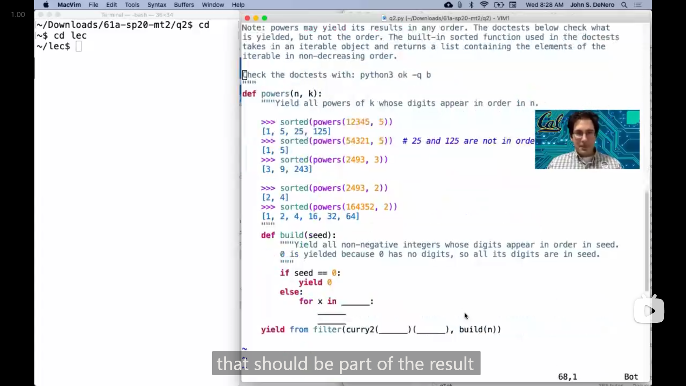{ loading=lazy }

!!! quote

    ```python
    """A: (3 pts) Implement is_power, which takes a positive integer base and a
    non-negative integer s. It returns whether s is power of base, meaning that there
    is some non-negative integer n such that pow(base, n) equals s.
    
    IMPORTANT: You may not call pow, use the ** operator, or import any function
    (such as math.log). Your solution must be recursive.
    
    Check the doctests with: python3 -q a
    """
    def is_power(base, s):
        """Return whether s is a power of base.
        
        >>> is_power(5, 625)  # pow(5, 4) = 5 * 5 * 5 * 5 = 625
        True
        >>> is_power(5, 1)    # pow(5, 0) = 1
        True
        >>> is_power(5, 5)    # pow(5, 1) = 5
        True
        >>> is_power(5, 15)   # 15 is not a power of 5 (it's multiple)
        False
        >>> is_power(3, 9)
        True
        >>> is_power(3, 8)
        False
        >>> is_power(3, 10)
        False
        >>> is_power(1, 8)
        False
        >>> is_power(2, 0)    # 0 is not a power of any positive base.
        False
        
        >>> is_power(4, 16)
        True
        >>> is_power(4, 64)
        True
        >>> is_power(4, 63)
        False
        >>> is_power(4, 65)
        False
        >>> is_power(4, 32)
        False
        """
        assert base > 0 and s >= 0
        assert type(base) is int and type(s) is int
        if ______:
            return True
        elif ______:
            return False
        else:
            return ______


​    
​    curry2 = lambda f: lambda x: lambda y: f(x, y)
​    
​    """B: (5 pts) Implement powers, a generator function which takes positive
​    integers n and k. It yields all integers m that are both powers of k and whose
​    digits appear in order in n.
​    
​    Assume thar is_power is implemented correctly.
​    
​    Note: powers may yield its results in any order. The doctests below check what
​    is yielded, but not the order. The built-in sorted funcion used in the doctests
​    takes in an iterable object and returns a list containing the elements of the
​    iterable in non-decreasing order.
​    
​    Check the doctests with: python3 ok -q b"""
​    def powers(n, k):
​        """Yield all powers of k whose digits appear in order in n.
​        
​        >>> sorted(powers(12345, 5))
​        [1, 5, 25, 125]
​        >>> sorted(powers(54321, 5))  # 25 and 125 are not in order
​        [1, 5]
​        >>> sorted(powers(2493, 3))
​        [3, 9, 243]
​        
​        >>> sorted(powers(2493, 2))
​        [2, 4]
​        >>> sorted(powers(164352, 2))
​        [1, 2, 4, 16, 32, 64]
​        """
​        def build(seed):
​            """Yield all non-negetive integers whose digits appear in order in seed.
​            0 is yielded because 0 has no digits, so all its digits are in seed.
​            """
​            if seed == 0:
​                yield 0
​            else:
​                for x in ______:
​                    ______
​                    ______
​        yield from filter(curry2(______)(______), build(n))
​    ```

有人提问的一道题目，我有点想尝试一下，

本来只是想做一下第二题/第二部分，但是看题目要求好像第二题需要用到第一题的函数，于是就连第一题一起做完了😂

```python
def is_power(base, s):
    """Return whether s is a power of base.
    
    >>> is_power(5, 625)  # pow(5, 4) = 5 * 5 * 5 * 5 = 625
    True
    >>> is_power(5, 1)    # pow(5, 0) = 1
    True
    >>> is_power(5, 5)    # pow(5, 1) = 5
    True
    >>> is_power(5, 15)   # 15 is not a power of 5 (it's multiple)
    False
    >>> is_power(3, 9)
    True
    >>> is_power(3, 8)
    False
    >>> is_power(3, 10)
    False
    >>> is_power(1, 8)
    False
    >>> is_power(2, 0)    # 0 is not a power of any positive base.
    False
    
    >>> is_power(4, 16)
    True
    >>> is_power(4, 64)
    True
    >>> is_power(4, 63)
    False
    >>> is_power(4, 65)
    False
    >>> is_power(4, 32)
    False
    """
    assert base > 0 and s >= 0
    assert type(base) is int and type(s) is int
    if s == 1:
        return True
    elif base == 0 or base == 1 or s == 0 or s % base != 0:
        return False
    else:
        return is_power(base, s // base)
    
    
curry2 = lambda f: lambda x: lambda y: f(x, y)

def powers(n, k):
    """Yield all powers of k whose digits appear in order in n.
    
    >>> sorted(powers(12345, 5))
    [1, 5, 25, 125]
    >>> sorted(powers(54321, 5))  # 25 and 125 are not in order
    [1, 5]
    >>> sorted(powers(2493, 3))
    [3, 9, 243]
    
    >>> sorted(powers(2493, 2))
    [2, 4]
    >>> sorted(powers(164352, 2))
    [1, 2, 4, 16, 32, 64]
    """
    def build(seed):
        """Yield all non-negetive integers whose digits appear in order in seed.
        0 is yielded because 0 has no digits, so all its digits are in seed.
        """
        if seed == 0:
            yield 0
        else:
            for x in build(seed // 10):
                yield x
                yield x * 10 + seed % 10
    yield from filter(curry2(is_power)(k), build(n))
```

### 3

{ loading=lazy }

John 提到了 lab 08 的 Q6 `reverse_other` 这题，基本的思路和之前我做的时候的思路感觉差不多，但是在具体处理上，我觉得老师的一些处理值得学习，

首先就是，用到了之前的练习中也有提到的 `zip` 函数，利用了 `zip` 感觉就比我之前的写法更加简洁，

然后是处理 **隔一层反转** 的操作上，是直接在子节点的循环中再次循环，就刚好能拿到 孙子节点，我之前的做法就稍微麻烦，还需要一个 `helper` 函数来辅助计数

{ loading=lazy }

John又展示了不使用 `zip` 的实现方法，而他这次利用了**负的下标**来实现翻转

```python
for i in range(len(t.branches)):
    t.branches[i].label = labels_of_branches[-i - 1]
    ...
```

### 4

有人提问，如果一个类继承自两个不同的类，那么它使用 `super` 时会怎样

!!! quote

    John:
    
    so if you use super on a class that inherits from two different classes, what have you built, you built something very strange, but basically whay you've built is the same object except for, it's gonna not look up things is its class, it's gonna look at them up in one of the base classes, and which one, well, it looks at them in the order that you inherit, so if have a class that inherits from both b and c, it's gonna look in b first and then it's gonna look at c, to find the corresponding attribute that you're looking at.
    
    ---
    
    John:
    
    当你在一个从两个不同类继承的类上使用 super 时，你构建了一些非常奇怪的东西，但基本上你构建的是相同的对象，只是它不会在其类中查找属性，而是会在其中一个基类中查找。而具体是哪一个基类呢？它会按照你继承的顺序查找，所以如果有一个类同时继承自类B和类C，它会首先在B中查找，然后再在C中查找相应的属性。

## Lecture 24 Data Example

### 1

{ loading=lazy }

尝试自己做了一下这四题，下面是我写的

```python
def indices_of_min_abs(s):
    """
    >>> indices_of_min_abs([-4, -3, -2, 3, 2, 4])
    [2, 4]
    >>> indices_of_min_abs([1, 2, 3, 4, 5])
    [0]
    """
    min_abs = min([abs(x) for x in s])
    return [i for i in range(len(s)) if abs(s[i]) == min_abs]

def largest_sum_of_adjacency(s):
    """
    >>> largest_sum_of_adjacency([-4, -3, -2, 3, 2, 4])
    6
    >>> largest_sum_of_adjacency([-4, 3, -2, -3, 2, -4])
    1
    """
    return max([s[i] + s[i + 1] for i in range(len(s) - 1)])

def map_digit_to_element(s):
    """
    >>> map_digit_to_element([5, 8, 13, 21, 34, 55, 89])
    {1: [21], 3: [13], 4: [34], 5: [5, 55], 8: [8], 9: [89]}
    """
    result = {}
    for x in s:
        d = x % 10
        if d not in result:
            result[d] = [x]
        else:
            result[d] += [x]
    return {d: result[d] for d in sorted(result)}

def every_element_has_equal_value(s):
    """
    >>> every_element_has_equal_value([-4, -3, -2, 3, 2, 4])
    False
    >>> every_element_has_equal_value([4, 3, 2, 3, 2, 4])
    True
    """
    for i in range(len(s)):
        if all([i == j or s[i] != s[j] for j in range(len(s))]):
            return False
    return True
```

---

在做第三个问题时，发现了如果 `sorted` 函数传入的是一个字典，那么会返回以键为元素排好序的列表

### 2

John 第一个问题中运用了 `map` 函数来获取 `min_abs` ，感觉比我的代码看起来更简洁些

```python
min_abs = min(map(abs, s))
```

John `return` 的那一行代码，提供了使用 `filter` 函数的另一种写法(由于 `filter` 返回的是一个迭代器，所以需要转换成列表)，

```python
return list(filter(lambda i: abs(s[i]) == min_abs, range(len(s))))
```

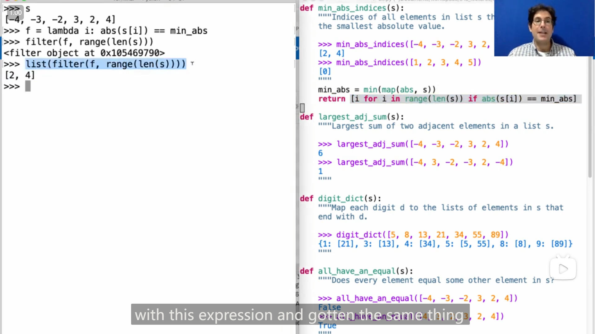{ loading=lazy }

---

John 在第二个问题中又提供了第二种方法，利用 `zip` 函数，并且**利用切片来获取相邻元素**(感觉太强了😲，完全没想到能这样用 `zip` )

```python
return max([a + b for a, b in zip(s[:-1], s[1:])])
```

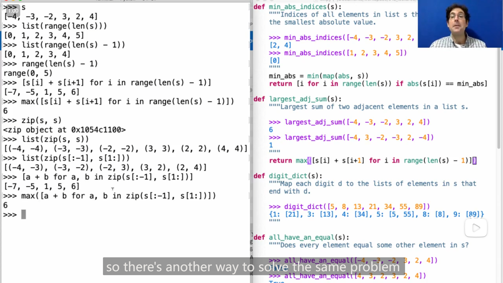{ loading=lazy }

---

第三个问题 John 用了跟我的思路不同的另一种思路来实现

```python
return {d: [x for x in s if x % 10 == d] for d in range(10) if any([x % 10 == d for x in s])}
```

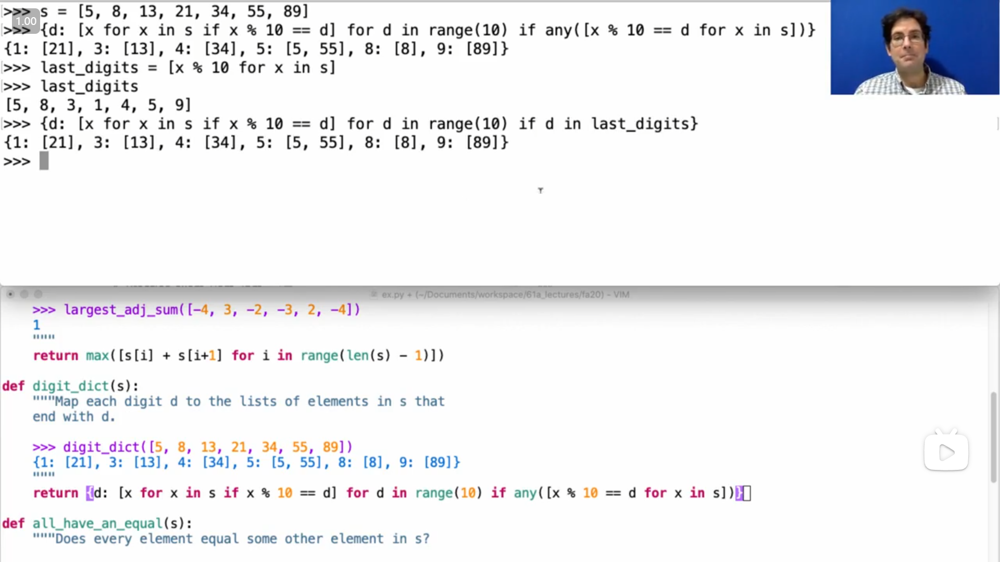{ loading=lazy }

---

第四个问题，John 一开始的思路感觉感觉和我的差不多，但是也比我的代码要简洁，

```python
return all([s[i] in s[:i] + s[i + 1:] for i in range(len(s))])
```

但是 John 提供了第二种思路，**==如果列表中有两个相同的数，那么意味着这个数的个数大于等于2==**，

{ loading=lazy }

因此可以这样写

```python
return all([sum([1 for y in s if y == x]) > 1 for x in s])
```

而进一步，可以借助 `min` 来判断最小的结果大于 1 就可以了，

而然后，列表有一个 `.count()` 方法，计算某个元素的个数，因此得到(应该是)最简洁的写法(真给我看得全程惊呆了😲)

```python
return min([s.count(x) for x in s]) > 1
```

{ loading=lazy }

### 3

{ loading=lazy }

这里的第三和第四个问题感觉有点意思，第四个问题我一开始想没有想出来，最后看了 John 的编写才想明白

{ loading=lazy }

```python
def merge(s, t):
    """Return a sorted Link with the elements of sorted s & t.
    
    >>> a = Link(1, Link(5))
    >>> b = Link(1, Link(4))
    >>> merge(a, b)
    Link(1, Link(1, Link(4, Link(5))))
    >>> a
    Link(1, Link(5))
    >>> b
    Link(1, Link(4))
    """
    if s is Link.empty:
        return t
    elif t is Link.empty:
        return s
    elif s.first <= t.first:
        return Link(s.first, merge(s.rest, t))
    else:
        return Link(t.first, merge(s, t.rest))
    
def merge_in_place(s, t):
    """Return a sorted Link with the elements of sorted s & t.
    
    >>> a = Link(1, Link(5))
    >>> b = Link(1, Link(4))
    >>> merge(a, b)
    Link(1, Link(1, Link(4, Link(5))))
    >>> a
    Link(1, Link(1, Link(4, Link(5))))
    >>> b
    Link(1, Link(4, Link(5)))
    """
    if s is Link.empty:
        return t
    elif t is Link.empty:
        return s
    elif s.first <= t.first:
        # return Link(s.first, merge(s.rest, t))
        s.rest = merge_in_place(s.rest, t)
        return s
    else:
        # return Link(t.first, merge(s, t.rest))
        t.rest = merge_in_place(s, t.rest)
        return t
```

## Lecture 24 Q&A

### 1

提到的17春(第二次期中模拟考)的一个题目

!!! quote

    **Perfect Engine!**
    
    You are in an apocalyptic society and have been charged with making an n-gen, or a generator that computes all of the n-perfect numbers. However, in this apocalyptic society, **built-in AND user-defined Python multiplication is forbidden** in any form!
    
    You have a blueprint for building a few n-gins from a natural number generator:
    
    -   ```txt
        A 2-gen:
        1 2 3 4 5 6 7 8 9 ...
        1 4 9 16 25 ...
        ```
    
    -   ```txt
        A 3-gen:
        1 2 3 4 5 6 7 8 9 ...
        1 3 7 12 19 27 ...
        1 8 27 ...
        ```
    
    Hint: Here is how `yield from` works. When used inside an iterable `yield from` will issue each element from another iterable as though it was issued from the first iterable. The following code is equivalent:
    
    -   ```python
        def generator1 ():
            for item in generator2 ():
                yield item
            # do more things in this generator
        ```
    
    -   ```python
        def generator1 ():
            yield from generator2 ()
            # more things on this generator
        ```
    
    Now its your job to build the perfect n-gen and power society out of the apocalypse! Good luck!
    
    ```python
    def nats():
        """
        A generator that yields
        all natural numbers.
        Might be helpful!
        """
        curr = 0
        while True:
            curr += 1
            yield curr
            
    def create_skip(n, gen):
        if n == 1:
            yield from ____________
        curr , skip = ________, ________
        for elem in ____________:
            if skip == n:
                ___________________
            else:
                curr = __________________
                skip = _________________
                yield _________________
            
    def perfect_ngen(n):
        """
        >>> two_gen = perfect_ngen(2)
        >>> next(two_gen)
        1
        >>> next(two_gen)
        4
        >>> next(two_gen)
        9
        >>> three_gen = perfect_ngen(3)
        >>> next(three_gen)
        1
        >>> next(three_gen)
        8
        >>> next(three_gen)
        27
        """
        gen = create_skip(____, _______)
        while _________________:
            n = _________________
            gen = create_skip(____, _______)
        return gen
    ```

感觉这题有点好玩，用到了一些数学上的结论，看了好一会才看懂题目，

大概是，要实现一个能返回 自然数的 n 次方生成器 的函数，而且不能使用乘法，

从给出的两个例子看，输出平方数列的方法是，将自然数列中的偶数(2的倍数)跳过，再将数列中之前的其他数加起来，和就刚好是平方，

而对于立方数列，与平方类似，先是将自然数列中 3的倍数跳过，然后将之前的其他数加起来，得到一个数列，再将这个数列再进行一次同样的操作(即跳过 3的倍数，取之前数的和，看到这里会发现 **自然数列中，3的倍数刚好间隔为3，而新数列中刚好间隔为2**，这一点会在给出的代码框架中被用上)，最后得到的数列就是立方数列(感觉好神奇😲)，

所以我就尝试了一下这个题目

```python
def nats():
    """
    A generator that yields
    all natural numbers.
    Might be helpful!
    """
    curr = 0
    while True:
        curr += 1
        yield curr
        
def create_skip(n, gen):
    if n == 1:
        yield from gen
    curr , skip = 0, 1
    for elem in gen:
        if skip == n:
            skip = 1
        else:
            curr = curr + elem
            skip = skip + 1
            yield curr
        
def perfect_ngen(n):
    """
    >>> two_gen = perfect_ngen(2)
    >>> next(two_gen)
    1
    >>> next(two_gen)
    4
    >>> next(two_gen)
    9
    >>> three_gen = perfect_ngen(3)
    >>> next(three_gen)
    1
    >>> next(three_gen)
    8
    >>> next(three_gen)
    27
    """
    gen = create_skip(n, nats())
    while n != 1:
        n = n - 1
        gen = create_skip(n, gen)
    return gen
```

{ loading=lazy }

### 2

{ loading=lazy }

!!! quote

    ```python
    def close(n, smallest=10, d=10):
        """ A sequence is near increasing if each element but the last two is smaller than all elements
        following its subsequent element. That is, element i must be smaller than elements i + 2, i + 3, i + 4 etc.
        Implement close, which takes a non-negative integer n and returns the largest near increasing sequence
        of digits within n as an integer. The arguments smallest and d are part of the implementation; you must
        determine their purpose. The only values you may use are integers and booleans (True and False) (no lists, strings, etc.).
        Return the longest sequence of near-increasing digits in n.
        >>> close(123)
        123
        >>> close(153)
        153
        >>> close(1523)
        153
        >>> close(15123)
        1123
        >>> close(11111111)
        11
        >>> close(985357)
        557
        >>> close(14735476)
        143576
        >>> close(812348567)
        1234567
        >>> close(45671) # with a 1 is 71; without a 1 is 4567
        4567
        """
        if n == 0:
            return 0
        no = close(n // 10, smallest, d)
        if smallest > ______:
            yes = ______
            return ______(yes, no)
        return ______
    ```

这道题有点难想，一开始看完了 John 写出答案的整个过程但还是没想明白，

然后 John 换了一个简单的例子来讲解，实现获得最大的递增子序列函数

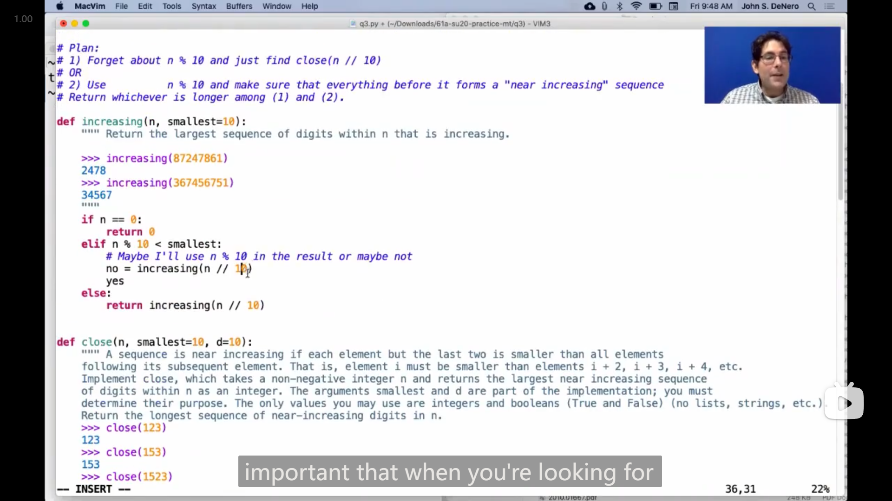{ loading=lazy }

!!! quote

    John:
    
    ...let's let's solve a simpler one, more complicated than this, but less complicated than this, let's get rid of this notion of near increasing, and just, uh, look for the longest increasing sequence within n. we would need to keep track of some notion of what's the smallest thing i've done so far, um, so what does this do, return the sequence of digits within n, sorry, the largest sequence of digits within n that is increasing. so how might it work, if i call increasing on here's some digits, let's see what we got we could have two, then four, then seven and eight, that's pretty long try one more, uh we could have three four five six seven, that's pretty long. i didn't check too carefully but it's about right.
    
    ```python
    def increasing(n, smallest=10):
        """Return the largest sequence of digits within n that is increasing.
        
        >>> increasing(87247861)
        2478
        >>> increasing(367456751)
        34567
        """
    ```
    
    how will we do this one, if n equals zero, return zero. otherwise, if um the last digit of n is less than whatever is the smallest thing i've seen so far, then i might want to include it. so i'm going to just write this as, maybe i'll use n percent 10 in the result, or maybe not.
    
    ```python
    def increasing(n, smallest=10):
        """Return the largest sequence of digits within n that is increasing.
        
        >>> increasing(87247861)
        2478
        >>> increasing(367456751)
        34567
        """
        if n == 0:
            return 0
        elif n % 10 < smallest:
            # Maybe I'll use n % 10 in the result or maybe not
        else:
    ```
    
    if n if the last digit is not allowed because it's bigger, than something that i've already decided i'm going to use, then i just can't use it. so that means the best i can do, is find the biggest increasing number within n divided by 10. okay so now we're going to have this notion of no and yes. no says i ignore n percent ten.
    
    ```python
    def increasing(n, smallest=10):
        """Return the largest sequence of digits within n that is increasing.
        
        >>> increasing(87247861)
        2478
        >>> increasing(367456751)
        34567
        """
        if n == 0:
            return 0
        elif n % 10 < smallest:
            # Maybe I'll use n % 10 in the result or maybe not
            no = increasing(n // 10)
            yes
        else:
            return increasing(n // 10)
    ```
    
    this is the same as that, which is why this had kind of a funny structure, we'll talk about that later. it is important that when you're looking for the smallest thing within, and ignoring the last digit you still respect, how whatever digits you've decided to keep already along the way, so you have to pass in this notion of what's the smallest thing i've already decided to use. and then if you decide to use n percent 10, which is smaller than the smallest, now you can still find more digits, but they're not allowed to just be smaller than the smallest thing you had previously seen, now they have to be smaller than n percent 10. it turns out that this could be simplified, because we know that this is smaller than that, so i could trim this down, and i'd get the same result. but i'm going to leave it like this just so we can compare it with the other thing in a minute. and then here i would say, well, maybe i found the best thing without using this digit.
    
    ```python
    def increasing(n, smallest=10):
        """Return the largest sequence of digits within n that is increasing.
        
        >>> increasing(87247861)
        2478
        >>> increasing(367456751)
        34567
        """
        if n == 0:
            return 0
        elif n % 10 < smallest:
            # Maybe I'll use n % 10 in the result or maybe not
            no = increasing(n // 10, smallest)
            yes = increasing(n // 10, min(n % 10, smallest)) * 10 + n % 10
            return max(no, yes)
        else:
            return increasing(n // 10, smallest)
    ```
    
    ...so uh so what now, if you can understand this, then you can eventually understand this, but i agree that like close is just a much, like a considerably more complicated version of increasing. so i would focus on understanding this first what's going on here. let's just look at the mechanics, we either use one or we don't, in the in the choice where we don't, we just kind of pretend it's not there, and then we either use six or we don't, and in the choice where we don't we just pretend it's not there, and then we either use eight or we don't, in the choice that we do now, we have to make sure that everything else that we choose from here is smaller than eight. so we're going to have eight in the end, but we make a recursive call, that is i want the longest increasing sequence within eight seven two four seven, you know everything that's left over, except for all of the digits there have to be smaller than eight, and that's how i got this number. so if that makes sense then look at the difference between this, and that the difference between this and that is that, like we're just tucking away the most recent digit, and we're gonna include it in this notion of smallest, one step later than we otherwise would. so you're allowed to ignore the five, when you're checking to make sure that one is small enough, because that's just the rules of how this works.
    
    ---
    
    John:
    
    ...让我们解决一个更简单的问题，比这个复杂，但比这个简单，让我们摆脱近似递增的概念，只是寻找n中最长的递增序列。我们需要保持某种关于到目前为止我做过的最小的概念，那么这个函数是干什么的，返回n中递增的最大数字序列。所以它可能是怎么工作的，如果我在这里的一些数字上调用increasing，让我们看看我们得到了什么，我们可能有2，然后4，然后7和8，这很长，再试一次，我们可能有3，4，5，6，7，这也很长。我没有仔细检查，但大致是对的。
    
    ```python
    def increasing(n, smallest=10):
        """Return the largest sequence of digits within n that is increasing.
        
        >>> increasing(87247861)
        2478
        >>> increasing(367456751)
        34567
        """
    ```
    
    我们要如何解决这个问题，如果n等于零，返回零。否则，如果n的最后一位数字小于到目前为止我看到的最小值，那么我可能想要包含它。所以我将写成这样，也许我会在结果中使用n % 10，或者也许不会。
    
    ```python
    def increasing(n, smallest=10):
        """Return the largest sequence of digits within n that is increasing.
        
        >>> increasing(87247861)
        2478
        >>> increasing(367456751)
        34567
        """
        if n == 0:
            return 0
        elif n % 10 < smallest:
            # Maybe I'll use n % 10 in the result or maybe not
        else:
    ```
    
    如果n的最后一位不允许，因为它比我已经决定要使用的某个东西要大，那么我就不能使用它。所以这意味着我能做的最好的事情是，在n除以10的范围内找到最大的递增数。好的，现在我们将有no和yes的概念。no表示我忽略n除以10的余数。
    
    ```python
    def increasing(n, smallest=10):
        """Return the largest sequence of digits within n that is increasing.
        
        >>> increasing(87247861)
        2478
        >>> increasing(367456751)
        34567
        """
        if n == 0:
            return 0
        elif n % 10 < smallest:
            # Maybe I'll use n % 10 in the result or maybe not
            no = increasing(n // 10)
            yes
        else:
            return increasing(n // 10)
    ```
    
    这与那个相同，这就是为什么这个有点奇怪的结构，我们稍后会讨论的原因。在查找最小值时，忽略最后一位数字时，仍然要尊重沿途已经决定要保留的任何数字的规则，因此您必须传递这个已经决定使用的最小值的概念。然后，如果决定使用n % 10，这小于最小值，现在仍然可以找到更多的数字，但它们不能仅仅小于之前已经看到的最小值，现在它们必须小于n % 10。事实证明，这可以简化，因为我们知道这小于那，所以我可以缩短这个，然后得到相同的结果。但我会保留它，只是为了在一分钟内与另一种情况进行比较。然后在这里我会说，嗯，也许我已经找到了不使用这个数字的最好的结果。
    
    ```python
    def increasing(n, smallest=10):
        """Return the largest sequence of digits within n that is increasing.
        
        >>> increasing(87247861)
        2478
        >>> increasing(367456751)
        34567
        """
        if n == 0:
            return 0
        elif n % 10 < smallest:
            # Maybe I'll use n % 10 in the result or maybe not
            no = increasing(n // 10, smallest)
            yes = increasing(n // 10, min(n % 10, smallest)) * 10 + n % 10
            return max(no, yes)
        else:
            return increasing(n // 10, smallest)
    ```
    
    ...所以，如果您能理解这一点，那么最终您就能理解这一点，但我同意close只是increasing的一个更复杂的版本。所以我建议先理解这个，这里发生了什么。让我们只看看机制，我们要么使用数字1，要么不使用，在我们不使用的选择中，我们只是假装它不存在，然后我们要么使用6，要么不使用，在我们不使用的选择中，我们只是假装它不存在，然后我们要么使用8，要么不使用，在我们使用的选择中，我们必须确保从这里选择的其他所有东西都小于8。所以最后我们会得到8，但是我们进行递归调用，也就是我要找到87247中最长的递增序列，你知道除了所有的数字之外，都必须小于8，这就是我得到这个数字的方式。所以如果这有意义，然后看看这个和那个之间的区别，这和那个之间的区别是，我们只是藏起了最近的数字，然后我们会在这个最小值的概念中包含它，比我们本来想的要晚一步。所以在检查1是否足够小时，您可以忽略5，因为这只是这个工作规则。

所以，如果拿 `increasing` 的例子来理解，就是先判断 `n` 的个位是否比 之前(之前即当前数位右边的数位，可以通过递归的方式来理解)浏览/判断过的位数的最小值 小，小就意味着是可以构成递增序列/满足递增条件的，那么再分出是否使用这个位数的两种情况，如果打算使用，就将最小值更新( `min(n % 10, smallest)` ，但由于 `elif` 已经判断过了，确实也可以直接使用 `n % 10` )，如果不打算使用就不改变最小值。而如果不满足递增条件，就刚好跟不打算使用的情况一样。

理解了 `increasing` 再去理解 `close` 就会好理解很多，除了 `d` 几乎都一样，而 `d` 的作用就是为了让位数晚传一位(满足 near increasing 的要求)

### 3

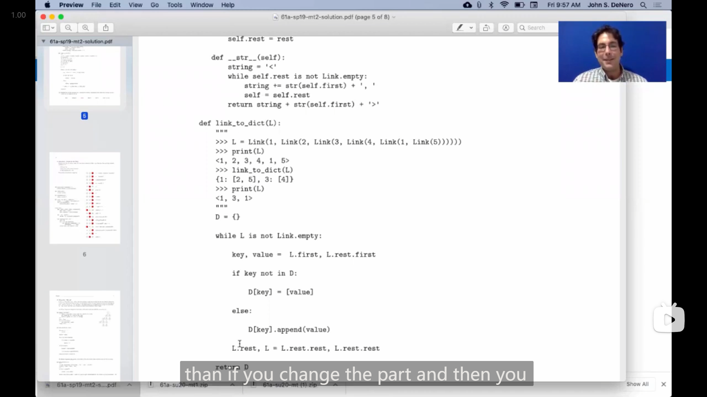{ loading=lazy }

John 提到了一种使用 *同时赋值 Simultaneous Assignment* 的特殊情况，

John 说到在使用*同时赋值*时，会先计算等号右边的结果，再**按顺序**赋值给左边的，所以在这一行代码中

```python
L.rest, L = L.rest.rest, L.rest.rest
```

会先将 `L.rest` 指向 `L.rest.rest` ，然后再将变量名 `L` 指向 `L.rest.rest` ，所以会有如下图的改变

=== "前"

    { loading=lazy }

=== "后"

    { loading=lazy }

先是含有 `1` 的节点的 `rest` 指向含有 `3` 的节点(即 `L.rest.rest` )，再是 `L` 指向含有 `3` 的节点

## Lab 09

### 1

Q3，做的时候想了好一会，做完之后我感觉蛮有意思的，

这一题和上一题Q2很像，但是需要判断是否是(非严格)升序，所以提供的框架是构建一个 `subseq_helper` 函数，来记录前一个数的大小，

-   如果当前的数比前一个数小，就可以直接忽略这个数
-   如果大于等于，就需要分情况，当前这个数是否被使用(感觉算是Q2的升级版)

??? note "code"

    ```python
    def inc_subseqs(s):
        def subseq_helper(s, prev):
            if not s:
                return [[]]
            elif s[0] < prev:
                return subseq_helper(s[1:], prev)
            else:
                a = subseq_helper(s[1:], s[0])
                b = subseq_helper(s[1:], prev)
                return insert_into_all(s[0], a) + b
        return subseq_helper(s, 0)
    ```

### 2

Q4 这题也有点意思，我想到的递归的思路就是，把大的树分成两个小的，

然后一开始是把两个小的加起来，然后错了，捋了一下，发现应该是把两个小的 结果/可能 相乘，最后就对了

??? note "code"

    ```python
    def num_trees(n):
        if n == 1:
            return 1
        return sum([num_trees(i) * num_trees(n - i) for i in range(1, n)])
    ```

### 3

Q5，有点难想感觉(但是做完以后感觉这题又不是很复杂😂)

>   一开始 `for` 语句里 `g` 之后没写 `()` ，然后就发生了报错😅
>
>   ```python
>   Traceback (most recent call last):
>     File "E:\Courses\cs61a\lab\lab09\lab09.py", line 121, in make_generators_generator
>       for _ in g:
>   TypeError: 'function' object is not iterable
>   ```
>
>   之后这样类似的要注意

??? note "code"

    ```python
    def make_generators_generator(g):
        def gen(i):
            for e in g():
                if i == 0:
                    break
                yield e
                i -= 1
        count = 0
        for _ in g():
            count += 1
            yield gen(count)
    ```

### 4

Q12，感觉这题蛮有意思，定义了某种模板(可以从 doctest 中看出来)，感觉之后说不定能参考

```python
def make_to_string(front, mid, back, empty_repr):
    """ Returns a function that turns linked lists to strings.

    >>> kevins_to_string = make_to_string("[", "|-]-->", "", "[]")
    >>> jerrys_to_string = make_to_string("(", " . ", ")", "()")
    >>> lst = Link(1, Link(2, Link(3, Link(4))))
    >>> kevins_to_string(lst)
    '[1|-]-->[2|-]-->[3|-]-->[4|-]-->[]'
    >>> kevins_to_string(Link.empty)
    '[]'
    >>> jerrys_to_string(lst)
    '(1 . (2 . (3 . (4 . ()))))'
    >>> jerrys_to_string(Link.empty)
    '()'
    """
    def printer(lnk):
        if ______________:
            return _________________________
        else:
            return _________________________
    return printer
```

??? note "code"

    ```python
    def make_to_string(front, mid, back, empty_repr):
        def printer(lnk):
            if lnk is Link.empty:
                return empty_repr
            else:
                return front + str(lnk.first) + mid + printer(lnk.rest) + back
        return printer
    ```

### 5

Q13，给的代码框架感觉值得学习，而且一开始还没想明白要怎么编写😂

```python
def prune_small(t, n):
    while ___________________________:
        largest = max(_______________, key=____________________)
        _________________________
    for __ in _____________:
        ___________________
```

??? note "code"

    ```python
    def prune_small(t, n):
        while len(t.branches) > n:
            largest = max([b for b in t.branches], key=lambda t: t.label)
            t.branches.remove(largest)
        for b in t.branches:
            prune_small(b, n)
    ```

## Lecture 25 Users

### 1

!!! quote

    Alan Kay:
    
    ...We realized that was an incredibly important principle for user interface design. Why spend two weeks trying to read an MS-DOS manual to see how to copy a file or open up an application? What do you get from it? Much better to find a way of designing the user interface so that the person who uses it acts like an intermediate from the first time they sit down, and then they get into a process that is rewarding in itself.
    
    ---
    
    Alan Kay:
    
    ...我们意识到这是界面设计中非常重要的原则。为什么要花两周的时间阅读MS-DOS手册，看如何复制文件或打开应用程序呢？从中得到了什么？更好的方法是设计用户界面，使使用者从第一次坐下来就像一个中间人，然后他们进入一个本身就是有益的过程。

Alan Kay 借助一个实验，

>   让一个40多岁的大妈，通过简单的训练，短时间内上手网球的实验，
>
>   实验者通过教会这个大妈网球对打和发球的一些诀窍，而不是系统学习，来让她快速上手网球

提到了用户界面设计的一个重要的理念，用户界面应该要设计得能让用户快速学会并上手(而不是需要花大量的时间去查阅说明书来学习)，使用户感觉自己像一个 *中等水平的学生 intermediate* ，于是之后的学习就能得到积极的反馈(所以就会有兴趣去学习)

## Lecture 25 Q&A

### 1

提到的20春(第二次期中考试)的一题

{ loading=lazy }

!!! quote

    ```python
    """This question involves plucking the leaves off a tree one by one.
    
    Definitions:
    
    1) A "number tree" is a Tree whose labels are _unique_ positive integers.
       No repeated labels appear in a number tree.
       
    2) A "plucking order" for a number tree t is a sequence of unique positive
       integers that are all labels of t.
       
    3) A plucking order is "valid" if both of these conditions are true:
       (a) the plucking order contains all labels of t, and
       (b) in the plucking order contains all labels of t, and
           the labels of all its descendant nodes. Thus, leaves appear first.
           
    Note: redwood, pine, and cyprus are all kinds of trees.
    """
    
    """A: (3 pts) Implement order, which takes a number tree called rewood. It returns
    a valid plucking order as a list of numbers. If there is more than one valid
    plucking order for redwood, your order function can return any one of them.
    
    IMPORTANT: You do not need to return EVERY valid plucking order; just one.
    
    Check the doctests with: python3 ok -q a
    """
    def order(redwood):
        """Return a list containing a valid plucking order for the labels of t.
        
        >>> order(Tree(1, [Tree(2, [Tree(3, [Tree(4)])])]))               # The only valid plucking order.
        [4, 3, 2, 1]
        >>> order(Tree(1, [Tree(2), Tree(3)])) in [[2, 3, 1], [3, 2, 1]]  # Therre are 2 valid orders.
        True
        >>> o = order(Tree(1, [Tree(2, [Tree(3)]), Tree(4, [Tree(5)])]))  # There are many valid orders,
        >>> o.index(5) < o.index(4)                                       # but all have 5 before 4,
        True
        >>> o.index(3) < o.index(2)                                       # and 3 before 2,
        True
        >>> o[4:]                                                         # and 1 at the end.
        [1]
    
        >>> order(Tree(7, [Tree(4, [Tree(6)]), Tree(5)])) in [[6, 5, 4, 7], [5, 6, 4, 7], [6, 4, 5, 7]]
        True
        """
        plucking_order = []
        for b in ______:
            ______
        return plucking_order + [redwood.label]


​    
​    """B: (5 pts) Implement pluck, which takes a number tree called pine and returns
​    a function that is called repeatedly on the elements of a plucking order. If that
​    plucking order is valid, the final call returns 'success!'. Otherwise, if one of
​    the repeated calls is on a number that is not part of a valid plucking order, the
​    error string 'Hey, not valid!' is returned.
​    
​    Since pine is a number tree and the values passed to plucker form a plucking
​    order, you can assume that:
​    - The labels of pine are unique,
​    - All values k passed to the plucker function are unique for a given pine, and
​    - All values k are labels of pine.
​    
​    Check the doctests with: python3 ok -q b
​    """
​    def pluck(pine):
​        """Return a function that returns whether a plucking order is valid
​        for a number tree t when called repeatedly on elements of a plucking order.
​    
​        Calling the function returned by pluck should not mutate pine.
​    
​               +---+
​               | 1 |
​               +---+
​               /   \----          /                 +---+         +---+
​           | 2 |         | 6 |
​           +---+         +---+
​             |            /          |           /          +---+      +---+ +---+
​           | 3 |      | 7 | | 8 |
​           +---+      +---+ +---+
​            / \               |
​           /   \              |
​        +---+ +---+         +---+
​        | 4 | | 5 |         | 9 |
​        +---+ +---+         +---+
​    
​        >>> b0 = Tree(2, [Tree(3, [Tree(4), Tree(5)])])
​        >>> b1 = Tree(6, [Tree(7), Tree(8, [Tree(9)])])
​        >>> t = Tree(1, [b0, b1])
​        >>> pluck(t)(9)(8)(7)(6)(5)(4)(3)(2)(1)
​        'success!'
​        >>> pluck(t)(5)(9)(4)(7)(3)(8)(6)(2)(1)
​        'success!'
​        >>> pluck(t)(2)
​        'Hey, not valid!'
​        >>> pluck(t)(5)(9)(7)(6)
​        'Hey, not valid!'
​    
​        >>> pluck(b0)(5)(2)
​        'Hey, not valid!'
​        >>> pluck(b0)(4)(5)(3)(2)
​        'success!'
​        """
​        def plucker(k):
​            def pluck_one_leaf(cyprus):
​                """Return a copy of cyprus without leaf k and check that k is a
​                leaf label, not an interior node label.
​                """
​                if ______:
​                    ______
​                plucked_branches = []
​                for b in cyprus.branches:
​                    skip_this_leaf = ______ and ______
​                    if not skip_this_leaf:
​                        plucked_branch_or_error = pluck_one_leaf(b)
​                        if isinstance(plucked_branch_or_error, str):
​                            return plucked_branch_or_error
​                        else:
​                            ______
​                return Tree(______, plucked_branches)
​            nonlocal pine
​            if pine.is_leaf():
​                assert k == pine.label, 'all k must appear in pine'
​                return 'success!'
​            ______
​            if isinstance(pine, str):
​                return pine
​            return plucker
​        return plucker
​    ```

>   需要用到的 *树 Tree* 类
>
>   ```python
>   class Tree:
>       def __init__(self, label, branches=[]):
>           self.label = label
>           for branch in branches:
>               assert isinstance(branch, Tree)
>           self.branches = list(branches)
>           
>       def is_leaf(self):
>           return not self.branches
>   ```

于是尝试写了一下，

a题十分地简单

```python
def order(redwood):
        plucking_order = []
    for b in redwood.branches:
        plucking_order += order(b)
    return plucking_order + [redwood.label]
```

b题有点难度，但是照着框架去分析思考，最终也不难做出来

```python
def pluck(pine):
    def plucker(k):
        def pluck_one_leaf(cyprus):
            """Return a copy of cyprus without leaf k and check that k is a
            leaf label, not an interior node label.
            """
            if k == cyprus.label and not cyprus.is_leaf():
                return "Hey, not valid!"
            plucked_branches = []
            for b in cyprus.branches:
                skip_this_leaf = b.is_leaf() and b.label == k
                if not skip_this_leaf:
                    plucked_branch_or_error = pluck_one_leaf(b)
                    if isinstance(plucked_branch_or_error, str):
                        return plucked_branch_or_error
                    else:
                        plucked_branches += [plucked_branch_or_error]
            return Tree(cyprus.label, plucked_branches)
        nonlocal pine
        if pine.is_leaf():
            assert k == pine.label, 'all k must appear in pine'
            return 'success!'
        pine = pluck_one_leaf(pine)
        if isinstance(pine, str):
            return pine
        return plucker
    return plucker
```

### 2

提到了18秋第二次期中考试的一题

{ loading=lazy }

!!! quote

    **Trictionary or Treat**
    
    **Definition.** A *trictionary* is a pair of `Tree` instances `k` and `v` that have identical structure: each node in `k` has a corresponding node in `v` . The labels in `k` are called *keys*. Each key may be the label for multiple nodes in `k` , and the *values* for that key are the labels of all the corresponding nodes in `v` .
    
    A *lookup function* returns one of the values for a key. Specifically, a lookup function for a node in `k` is a function that takes `v` as an argument and returns the label for the corresponding node in `v` .
    
    Implement the generator function `lookups` , which takes a `Tree` instance `k` and some `key` . It yields all *lookup functions* for nodes in `k` that have `key` as their label. The `new_lookup` function is part of the implementation.
    
    -   `k` :
    
        ```txt
                5
              / | \
            7   8   5
          /   / |  / \
        2    3  4  4  2 
        ```
    
    -   `v` :
    
        ```txt
                'Go'
               / | \
            'C' 'A' 'L'
           /   / |  / \
        'C'  'S' 6  1 'A' 
        ```
    
    | <u>*key*</u> | <u>*values*</u> |
    | ------------ | --------------- |
    | 2            | 'C', 'A'        |
    | 3            | 'S'             |
    | 4            | 6, 1            |
    | 5            | 'Go', 'L'       |
    | 7            | 'C'             |
    | 8            | 'A'             |
    
    ```python
    k = Tree(5, [Tree(7, [Tree(2)]), Tree(8, [Tree(3), Tree(4)]), Tree(5, [Tree(4), Tree(2)])])
    v = Tree('Go', [Tree('C', [Tree('C')]), Tree('A', [Tree('S'), Tree(6)]), Tree('L', [Tree(1), Tree('A')])])
    
    def lookups(k, key):
        """Yield one lookup function for each node of k that has the label key.
        
        >>> [f(v) for f in lookups(k, 2)]
        ['c', 'A']
        >>> [f(v) for f in lookups(k, 3)]
        ['S']
        >>> [f(v) for f in lookups(k, 6)]
        []
        """
        if ______:
            yield lambda v: ______
        for i in range(len(k.branches)):
            ______:
                yield new_lookup(i, lookup)
            
    def new_lookup(i, f):
        def g(v):
            return ______
        return g
    ```

这题有点难度，首先使理解题目的意思，`lookups` 是需要生成能返回在(输入的) 树 `v` 中对应位置的值的函数。

题目给的框架也不是很容易看懂，我先是看到 `yield new_lookup(i, lookup)` 这行(看到 `lookup` )，所以猜上面一行是

```python
for lookup in lookups(k.branches[i], key):
```

这一行应该是用来递归，所以进而就很容易想到上面的 `if` 语句是 **base case** 即走到了叶子节点，于是，在最简单的情况下，就直接判断 树 `k` 的值和 `key` 是否相等就行了，所以

```python 
if k.is_leaf() and k.label == key:
    return lambda v: v.label
```

最后是 `new_lookup` 的部分(想了一会才想出来)，看到 `i` 所以想到 `i` 是用来传递路径相关的信息的(重点是需要理解传入的 `lookup` ，是子树的查找函数，所以 `new_lookup` 中需要的也是传入对应 `v` 的子树)，因此

```python
return f(v.branches[i])
```

>   完整代码
>
>   ```python
>   def lookups(k, key):
>       if k.is_leaf() and k.label == key:
>           yield lambda v: v.label
>       for i in range(len(k.branches)):
>           for lookup in lookups(k.branches[i], key):
>               yield new_lookup(i, lookup)
>           
>   def new_lookup(i, f):
>       def g(v):
>           return f(v.branches[i])
>       return g
>   ```

---

看了John的讲解，发现 `if` 那一行正确答案应该没有 `k.is_leaf()` ，上面的代码能通过只是因为刚好测试的值都在叶子节点，所以正确的代码应该是

```python
def lookups(k, key):
    if k.label == key:
        yield lambda v: v.label
    for i in range(len(k.branches)):
        for lookup in lookups(k.branches[i], key):
            yield new_lookup(i, lookup)
        
def new_lookup(i, f):
    def g(v):
        return f(v.branches[i])
    return g
```

{ loading=lazy }

## Lecture 26 Ethical AI & Data

### 1

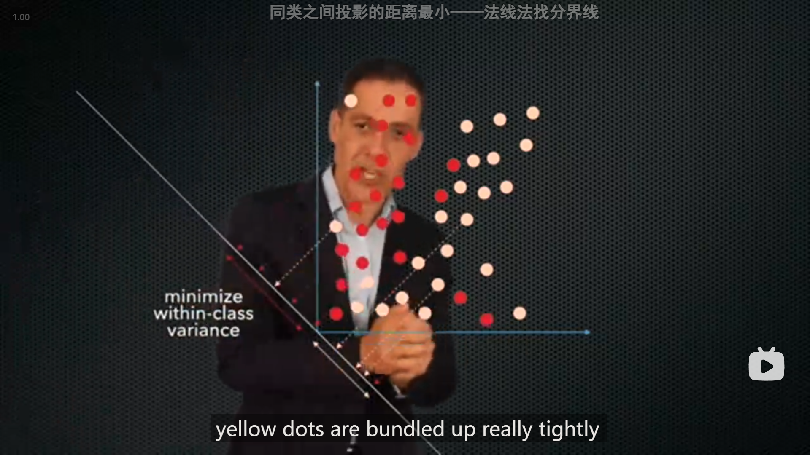{ loading=lazy }

Hany 在介绍 *监督学习 supervised learning* 时，提到了**线性**处理二维数据一种方法，通过找到一个投影面(线)，使得在投影面上，同类之间距离尽可能小，而异类之间的距离尽可能大，于是通过其法线就可以获得分割线

### 2

Hany在这节课的最后关于AI的使用的看法，我认为说的很好

!!! quote

    Hany:
    
    ...We just seem to be stuck at around 65% (accuracy).
    
    Okay, I posit I cannot prove, but I posit: I think that this is a fundamentally hard problem, and I am unconvinced that you can actually do better than this. Because think about what you're asking the algorithm to do. You're asking it to predict the future from a relatively small amount of data, and the future, two years in advance, of a fairly complex set of social, economic, personal, and just what is random dumb luck going to happen in somebody's life. And I don't think that's a stretch of imagination to say that this is really hard.
    
    So here's a question for you: should we even be doing this? Should we actually be trying to predict whether somebody's going to commit a crime in the future and then incarcerate them if we think that they are, if the accuracy is 65%? What if the accuracy is 75%? What if it's 85%? What if it's you? What if it's somebody you love? Do you want this algorithm being applied to somebody with this kind of error rate? What's an acceptable error rate? Are these things really better than humans? How do you deal with the bias? Nobody has good answers to these things.
    
    So here's a question. Now I come back to the title. right? Just because you can do something doesn't mean you should. And as you enter into what is undoubtedly an incredibly exciting time for us in terms of computation and AI and data, and the impact that we can have on the world, we have to start thinking about what are the negative aspects of what we are doing. Should we be trying to make these decisions? And if we do, the answer may be yes, but then are they accurate? Are they fair? Do they disproportionately affect women, people of color, LGBTQ community, people who are not born in this country, people who aren't native speakers, whatever it is? We have to think about the consequences of that.
    
    We have spent the last 20 years with the mantra of "move fast and break things," and while lots of good things have come from that, some really bad things have come from this. Bias in algorithms for hiring, bias in algorithms in healthcare, bias in algorithms in the financial sectors, bias in algorithms in the criminal justice system, bias in facial recognition. We've got to tread lightly here. And what that means is you can't come at this after the fact. You can't develop, deploy, and then debug on the fly. This isn't a word processing software. If you have a bug, somebody loses a document. This is the real world where you make a mistake and somebody sits in jail, or somebody doesn't get a home loan, or somebody doesn't get a small business loan, or somebody doesn't get a job or go to the university. We are impacting real people's lives with our algorithms and our data, and if we don't understand these things, we have the potential to do way more harm than we do good.
    
    And so the free-for-all of the last two decades, in my opinion, should be over. And I want to emphasize that I am not anti-technology. I'm not saying don't do things. I'm not saying don't innovate. But I'm saying think, think carefully about the consequences of what you are doing and make sure that there is transparency, there is fairness, and there is accuracy in how these technologies are being used. And more generally, making sure that you understand how your technologies can be misused as well because almost all technologies have benefits and drawbacks, and we have to start thinking about those things up front and simply try to mitigate the harm while harnessing the phenomenal power of technology and AI and data.
    
    All right, I'm done. I hope you enjoyed this and I hope you learned something from it. We'll see you soon.
    
    ---
    
    Hany:
    
    ...我们似乎卡在了65%左右（准确率）。
    
    好的，我假设我不能证明，但我假设：我认为这是一个基本上的难题，我不相信你能做得比这更好。因为想想你要算法做什么。你让它从相对较少的数据中预测未来，未来是两年后，涉及到一组相当复杂的社会、经济、个人因素，还有在某人生活中会发生的随机运气。我认为这并不是一种夸张，说这真的很难。
    
    那么这里有一个问题给你：我们甚至应该这样做吗？我们真的应该尝试预测某人将来是否会犯罪，然后如果我们认为他们会犯罪就监禁他们，即使准确率是65%吗？如果准确率是75%怎么办？如果是85%呢？如果是你呢？如果是你爱的人呢？你希望这种算法应用于有这种错误率的人吗？什么是可以接受的错误率？这些东西真的比人类更好吗？如何处理偏见？没有人对这些问题有好的答案。
    
    所以这里有一个问题。现在我回到标题，对吧？仅仅因为你能做某事并不意味着你应该这样做。当你进入计算、人工智能和数据方面无疑是一个非常激动人心的时刻，以及我们可以对世界产生的影响时，我们必须开始思考我们正在做的事情的负面方面。我们应该尝试做这些决定吗？如果是，答案可能是肯定的，但它们是否准确？是否公平？它们是否对女性、有色人种、LGBTQ社区、不在这个国家出生的人、不是本土说话者的人等产生不成比例的影响？我们必须考虑这些后果。
    
    在过去的20年里，我们一直奉行“迅速行动并打破一切”的口号，虽然从中获得了很多好处，但也从中产生了一些非常糟糕的事情。在招聘算法中存在的偏见，在医疗保健领域的算法中存在的偏见，在金融领域的算法中存在的偏见，在刑事司法系统的算法中存在的偏见，在面部识别中存在的偏见。我们必须小心行事。这意味着你不能在事后就这么做。你不能开发、部署，然后在飞行中调试。这不是文字处理软件。如果有一个错误，某人就会丢失一份文件。这是真实的世界，你犯了一个错误，有人坐在监狱里，或者有人没有获得房屋贷款，或者有人没有获得小额贷款，或者有人没有得到工作或上大学。我们正在影响真实人们的生活，用我们的算法和数据，如果我们不理解这些事情，我们可能会造成比做好事更多的伤害。
    
    因此，在我看来，过去20年的放任态度应该结束了。我想强调的是，我并不是反对技术。我并不是说不要做事情。我并不是说不要创新。但我说的是要考虑，要仔细考虑你正在做的事情的后果，并确保在使用这些技术的方式上有透明度、公平性和准确性。更一般地说，确保你了解你的技术如何被滥用，因为几乎所有技术都有利弊，我们必须开始从一开始就考虑这些事情，尽力减轻伤害，同时利用技术和人工智能和数据的巨大力量。
    
    好了，我说完了。希望你喜欢这个，希望你从中学到了一些东西。我们很快就会见面。

## Lecture 27 Scheme

### 1

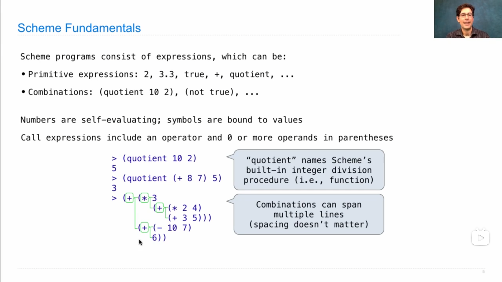{ loading=lazy }

感觉 scheme 这个表达式有点像逆波兰式😂

---

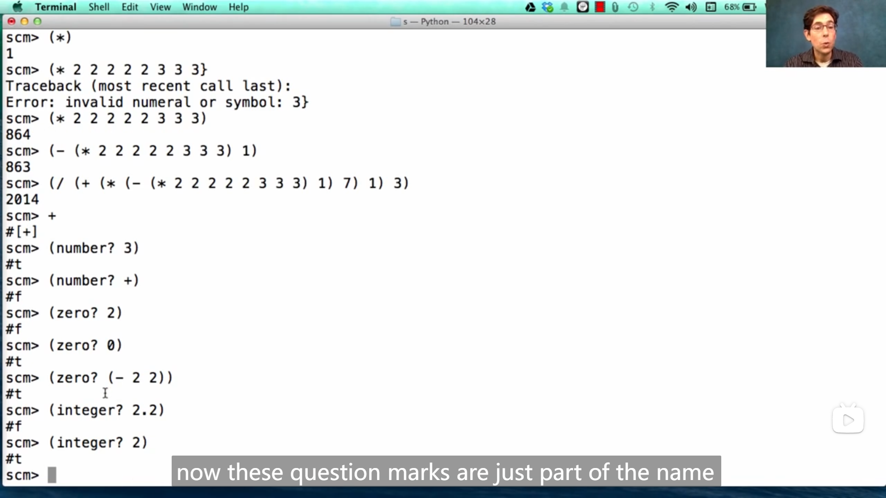{ loading=lazy }

scheme 语言里的一些用法(看John的demo应该就可以看懂了)

---

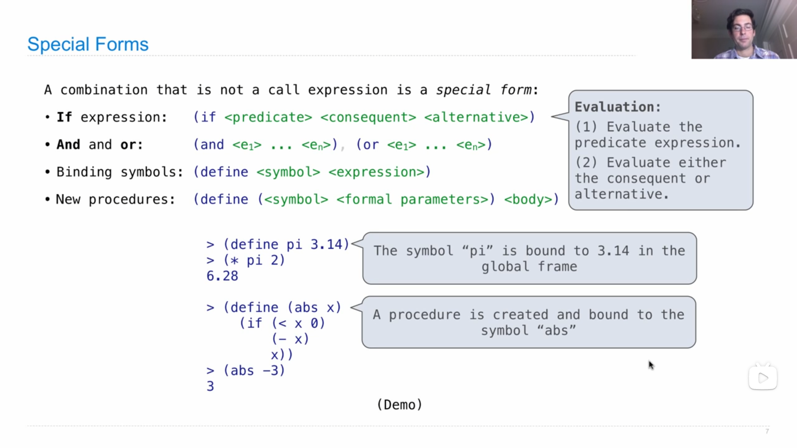{ loading=lazy }

scheme 中的一些语句

>   John 说到 scheme 使用的 *环境模型 model of environments* 和 python 的一样

### 2

{ loading=lazy }

John 演示scheme中的嵌套函数时，构造了一个求平方根的递归函数，

```scheme
(define (sqrt x)
  (define (update guess)
    (if (= (square guess) x)
        guess
        (update (average guess (/ x guess)))))
  (update 1))
```

> 翻译成 python 应该大致是这样
>
> ```python
> def sqrt(x):
>  def update(guess):
>      if guess ^ 2 == x:
>          return guess
>      else:
>          return update((x // guess + guess) // 2)
>  return update(1)
> ```

并且其中使用了
$$
guess = \frac{x}{guess} + guess
$$
的迭代方法，感觉很厉害

---

询问了同学之后，发现这就是(以前学过的)对勾函数，最后收敛于 $\sqrt{x}$ 😂

### 3

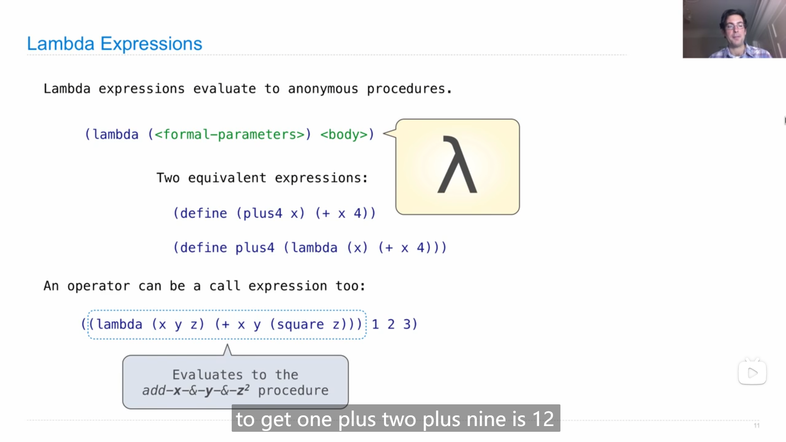{ loading=lazy }

scheme中的 lambda 匿名函数(类比 python 中的很好理解)

### 4

{ loading=lazy }

John 演示用 scheme 画 *谢尔宾斯基三角形 Sierpinski's Triangle* ，

用递归的方式画，每个大的三角形(的三条边)由(三个)小的三角形组成，因此

```scheme
(define (repeat k fn)
  (fn)
  (if (> k 1) (repeat (- k 1) fn)))
(define (tri fn)
  (repeat 3 (lambda () (fn) (lt 120))))
(define (sier d k)
  (tri (lambda () (if (= d 1) (fd k) (leg d k)))))
(define (leg d k)
  (sier (- d 1) (/ k 2))
  (penup) (fd k) (pendown))
```

代码大概是 `sier` 和 `leg` 相互调用的递归，

翻译成 python 大致是这样

```python
def repeat(k, fn):
    fn()
    if k > 1:
        repeat(k - 1, fn)

def tri(fn):
    repeat(3, lambda: fn() and turn_left(120))

def sier(d, k):
    tri(lambda: (move_forward(k) if d == 1 else leg(d, k)))

def leg(d, k):
    sier(d - 1, k // 2)
    pen_up()
    move_forward(k)
    pen_down()
```

>   其中 `turn_left` `move_forward` `pen_up` `pen_down` 
>
>   分别对应 scheme 中的内置函数 `lr` `fd` `penup` `pendown`

### 5

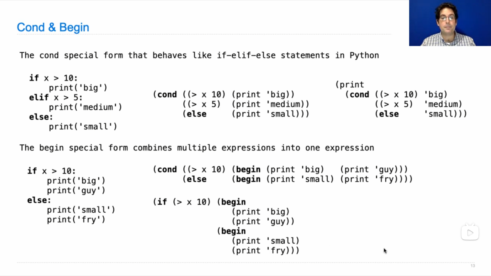{ loading=lazy }

`cond` 语句，可以类比 `if-elif-else` 语句，而且，可以理解为这个语句也可以返回值，所以可以像图中右上一样写

`begin` 语句，将多个语句合成一个( `begin` )语句

---

{ loading=lazy }

`let` 可以在其中定义临时的变量，格式是 `(let ((a 1) (b 2) ...) (...))` ，`let` 后第一个括号内是若干个定义临时变量的 *对 part* ，第二个括号是要执行的语句或者要返回的值

### 6

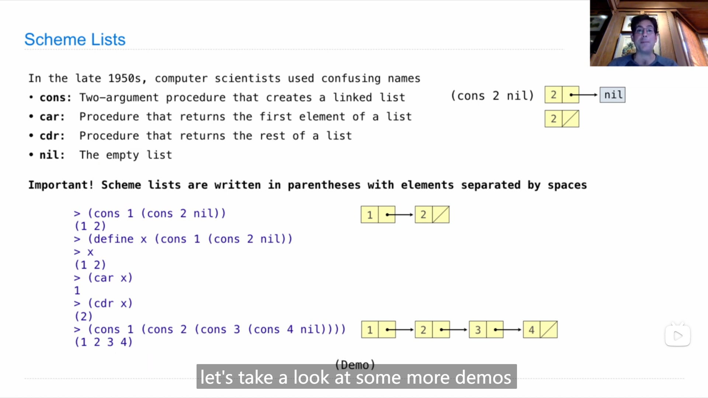{ loadin=lazy }

scheme 中 链表 list 相关内容

### 7

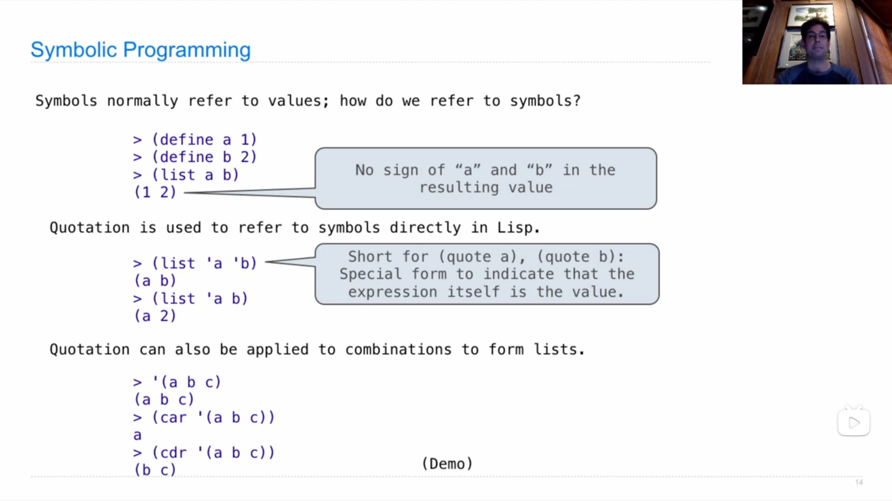{ loading=lazy }

***引用 quotation*** (感觉似乎理解了 c++ 中的引用)，可以将**符号本身**传入到表达式中

>   Special form to indicate that the expression itself is the value.
>
>   表示表达式本身就是值的特殊形式。

```scheme
scm> '(+ a b)
(+ a b)
scm> '(zero? a)
(zero? a)
```

也可以是在表达式前加 单引号 `'` ，那么表达式中的符号都会以*引用*的形式使用

---

John 的demo演示

```scheme
scm> '(1 2)
(1 2)
scm> '(1 a)
(1 a)
scm> (list 1 'a)
(1 a)
scm> (list 1 a)
Traceback (most recent call last):
  0     (list 1 a)
  1     a
Error: unknown identifier: a
```

!!! quote

    John:
    
    When quoting a list, you get a list, but all the expressions within it are quoted as well.
    
    ...I can't evaluate a until I've define it, but I can refer to a before I've defined it, because it's just a symbol. It could mean something in the future, it just hasn't been defined yet.
    
    ---
    
    John:
    
    引用列表时，你会得到一个列表，但其中的所有表达式也会被引用。
    
    ...在定义a之前，我无法评估它，但在定义之前，我可以参考a，因为它只是一个符号。它可能在未来有意义，只是还没有定义。

### 8

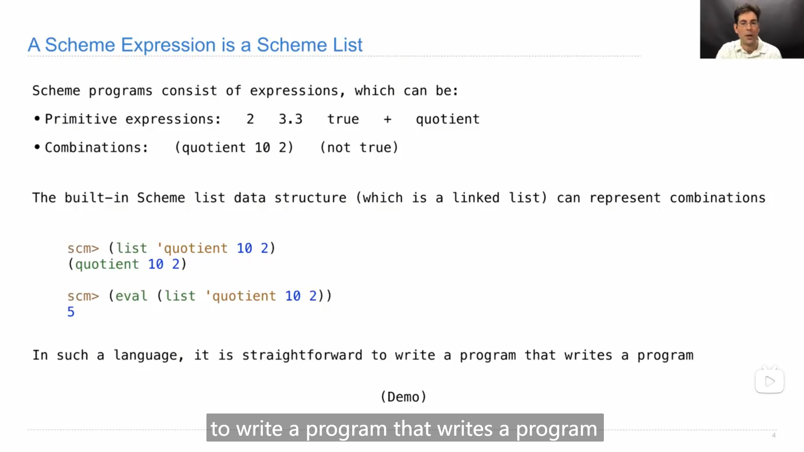{ loading=lazy }

scheme 的内置函数 `eval` 可以计算引用形式的表达式(可见于上图) (感觉可以理解为 反向引用，或者说 解引用)

### 9

John 关于符号表达式的演示(看起来感觉很厉害😲)

{ loading=lazy }

>   ```scheme
>   (define (fact n)
>     (if (= n 1) 1 (* n (fact (- n 1)))))
>   
>   (define (fact-exp n)
>     (if (= n 1) 1 (list '* n (fact-exp (- n 1)))))
>   ```

{ loading=lazy }

>   ```scheme
>   (define (fib n)
>     (if (<= n 1) n (+ (fib (- n 2)) (fib (- n 1)))))
>   
>   (define (fib-exp n)
>     (if (<= n 1) n (list '+ (fib-exp (- n 2)) (fib-exp (- n 1)))))
>   ```

### 10

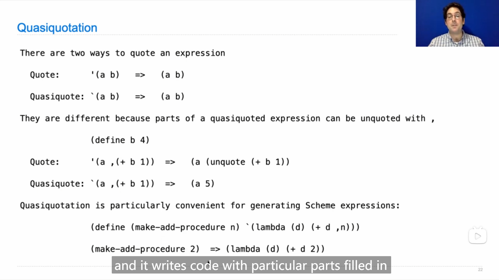{ loading=lazy }

*准引用 quasiquotation* ，可以被**中断**的引用

反引号 <code>\`</code> 的引用效果可以被 逗号 `,` 中断，即 `,` 后的括号以及更里面的括号取消引用效果，而其他地方还是有引用效果

```scheme
scm> `(a ,(+) b)
(a 0 b)
scm> `(a (+) b)
(a (+) b)
```

### 11

John 关于 *准引用 quasiquotation* 引用的演示，

用*准引用*构造了类似于 `while` 的(某种程度上)通用的循环结构(给我看傻了😲)

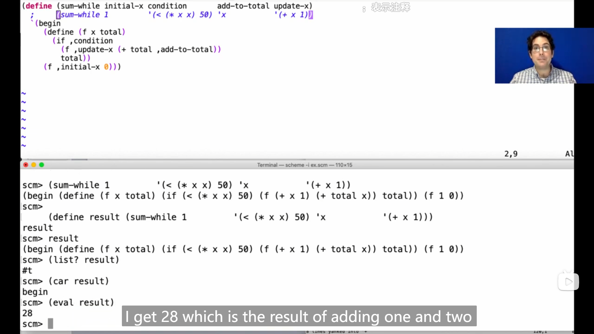{ loading=lazy }

>   **分号 `;` 表示注释**

我的理解是，如果 `begin` 中的 `condition` `add-to-total` 等不加逗号 `,` 的话，返回的表达式中会直接就是 `condition` `add-to-total` 等**这些符号本身**，而加了逗号 `,` 之后，最后的表达式就会是 在使用 `sum-while` 时 具体传入的值，因此在使用 `sum-while` 时应该传入的是引用形式的表达式(即如 John 演示的一样，`(sum-while 1 '(< (* x x) 50) 'x '(+ x 1))` )

>   ```scheme
>   (define (sum-while initial-x condition       add-to-total update-x)
>     ;     (sum-while 1         '(< (* x x) 50) 'x           '(+ x 1))
>     `(begin
>        (define (f x total)
>          (if ,condition
>            (f ,update-x (+ total ,add-to-total))
>            total))
>        (f ,initial-x 0)))
>   ```

## Lecture 27  Q&A

### 1

{ loading=lazy }

有人向提问到 scheme 中的 `print` 的返回值是什么，于是 John 开始演示

```scheme
scm> (define s (print 1))
1
s
scm> s
scm> print(s)
undefined
```

John之后解释道，scheme 中的 `undefined` 和 python 中的 `None` 类似，但也有区别， `None` 还会用于一些比较，但 `undefined` 基本上不会被使用

!!! quote

    John:
    
    Well, we get this special value called "undefined." That's it. It's kind of close to Python's "None," except for here's the rule. This is more of a conventional rule than enforced by the language, but here's the rule: you're never supposed to do anything with the undefined value.
    
    Whereas in Python, people use "None" for all kinds of stuff. They compare whether something is "None," etc. That basically never shows up in Scheme code. So when you get this undefined value, which happens to exist, the idea is you should never do anything with it. You should never check to see if it's equal to another undefined. You should never check to see how many undefineds there are in a list or something like that. You should just stop.
    
    So basically, like this expression is legal, but it's a no-no. You should never take the value of "print" and do something else with it.
    
    ---
    
    John:
    
    嗯，我们有这个特殊的值叫做 "undefined"。就是这样，它有点类似于 Python 的 "None"，除了这里有一个规则。这更像是一种约定俗成的规则，而不是语言强制的，但这就是规则：你永远不应该对 "undefined" 值做任何事情。
    
    而在 Python 中，人们用 "None" 来处理各种事情。他们比较某个东西是否为 "None" 等等。这基本上在 Scheme 代码中几乎不会出现。所以当你得到这个存在的 "undefined" 值时，理念是你不应该对它做任何事情。你不应该检查它是否等于另一个 "undefined"，你不应该检查列表中有多少个 "undefined" 等等。你应该停止。
    
    所以基本上，像这个表达式是合法的，但是是不推荐的。你永远不应该获取 "print" 的值然后用它做其他事情。

## HW 06

### 1

Q3中，在处理奇数情况时，一开始我写的是

```scheme
(* x (square (pow x (/ y 2))))
```

但是在跑第一个测试用例时，

```scheme
(pow 2 5)
```

显示递归溢出了

```bash
# Error: expected
#     32
# but got
#     Traceback (most recent call last):
#       ...
#     RecursionError: maximum recursion depth exceeded in __instancecheck__
```

猜测是因为除法的问题，于是去测试了一下，发现 `/` 不是整除

```scheme
scm> (/ 5 2)
2.5
scm> (/ 4 2)
2
```

于是将基数情况的代码修改成了

```scheme
(* x (square (pow x (/ (- y 1) 2))))
```

??? note "code"

    ```scheme
    (define (pow x y)
      'YOUR-CODE-HERE
      (if (= y 1)
          x
          (if (even? y)
              (square (pow x (/ y 2)))
              (* x (square (pow x (/ (- y 1) 2))))))
    )
    ```

