>   *Notes of Courses* on gitee.io
>
>   [CS61A - My Pamphlet (gitee.io)](https://ronald-luo.gitee.io/my-pamphlet_-notes-of-courses/Notes of Courses/CS61A/)

!!! info

    [CS 61A Fall 2020 (berkeley.edu)](https://inst.eecs.berkeley.edu/~cs61a/fa20/)

## Lab 0

### 1

运行hw或者lab任务的对应命令时，都加上 `--local` ，就只在本地运行，不会上传然后要求输入邮箱，如

```bash
python ok [-q xxx] [-u] --local
```

## Lecture 2 Functions

### 1

变量可以 “指向” 一个函数

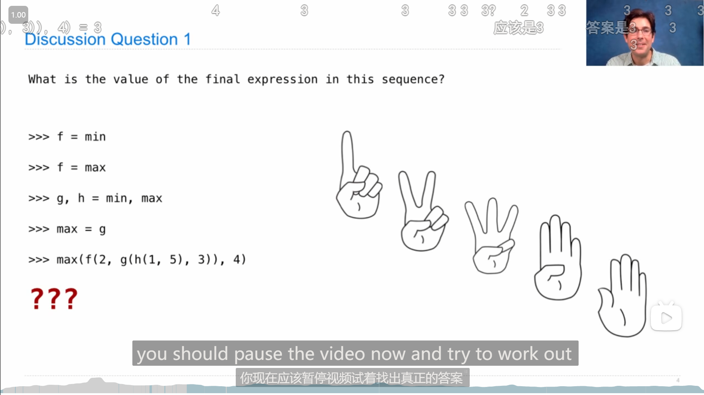{ loading=lazy }

### 2

cs61a中使用的可以显示python程序中 environment 、 frame 等信息的在线网站：

[Online Python Tutor - Composing Programs - Python 3](https://pythontutor.com/cp/composingprograms.html#mode=edit)

>   John DeNero 编写的cs61a的配套英文原版教材：
>
>   [Composing Programs](https://www.composingprograms.com/)
>
>   在github上发现的其对应仓库：
>
>   [DestructHub/composing-programs: Annotation and code about SICP Python (github.com)](https://github.com/DestructHub/composing-programs)
>
>   github上发现的非官方的还在翻译(23/7/21发现)的中文版的仓库：
>
>   [csfive/composing-programs-zh: 🚧 CS61A 教材《Composing Programs》即《计算机程序的构造与解释》Python 版本的中文翻译 (github.com)](https://github.com/csfive/composing-programs-zh)
>
>   其对应网页：
>
>   [CSfive | CSfive](https://sicp.csfive.works/)

### 3

调用函数时，会创建一个新的frame，且frame的名字为函数本身的名字(即创建时的名字 (如果是lambda匿名函数则 没有名字/名字为lambda))，

{ loading=lazy }

即如果用某个变量指向了函数，在用变量调用函数的时，创建的frame名字仍为原函数名

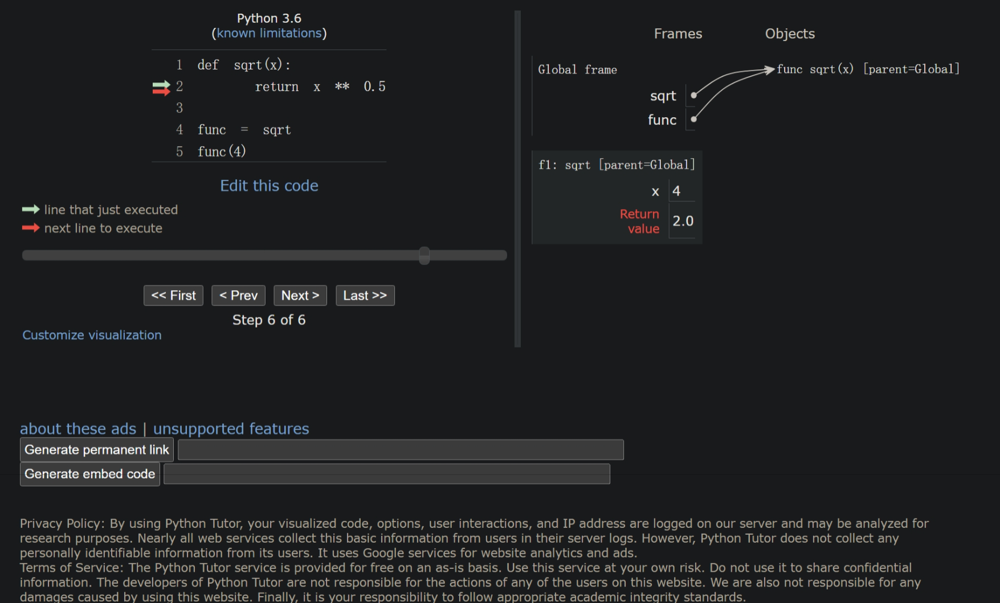{ loading=lazy }

### 4

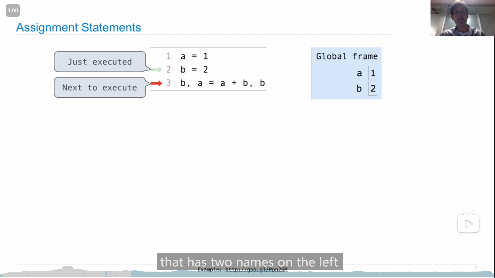{ loading=lazy }

python中，赋值可以同时对两个变量进行，会使交换变量的值等操作更方便，如

```python
a, b = b, a
```

## Lecture 2 Q&A

### 1

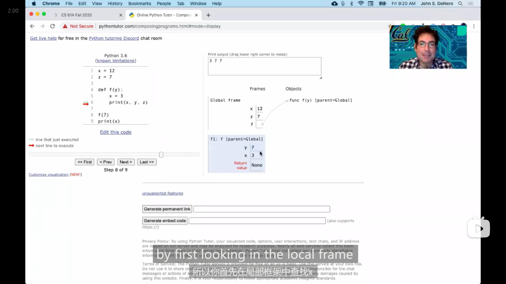{ loading=lazy }

在哪个frame中定义(define)的函数，其parent就是哪个frame，除了Global frame其他都有parent

## HW 01

### 1

Q3，可以用总的减去最大的，得到最小的两个

??? note "code"

    ```python
    def two_of_three(x, y, z):
        return x * x + y * y + z * z - max(x, y, z) ** 2
    ```

### 2

Q5

```python
def with_if_function():
    """
    >>> result = with_if_function()
    42
    47
    >>> print(result)
    None
    """
    return if_function(cond(), true_func(), false_func())
```

由于在 `return` 语句中，填入的时调用的函数( `true_func()` 和 `false_func()` )，运行的顺序是 先进行 `true_func()` 和 `false_func()` 两个函数的调用，再将他们的返回值传递给 `if_function()` 中，所以(由于两个函数被调用了) 42和47都会输出

```python
def with_if_statement():
    """
    >>> result = with_if_statement()
    47
    >>> print(result)
    None
    """
    if cond():
        return true_func()
    else:
        return false_func()
```

而在这个函数中，则只会调用 `true_func()` 和 `false_func()` 其中一个函数，因此只会输出一个数字

??? note "code"

    ```python
    def if_function(condition, true_result, false_result):
        """Return true_result if condition is a true value, and
        false_result otherwise.
    
        >>> if_function(True, 2, 3)
        2
        >>> if_function(False, 2, 3)
        3
        >>> if_function(3==2, 3+2, 3-2)
        1
        >>> if_function(3>2, 3+2, 3-2)
        5
        """
        if condition:
            return true_result
        else:
            return false_result


​    
​    def with_if_statement():
​        """
​        >>> result = with_if_statement()
​        47
​        >>> print(result)
​        None
​        """
​        if cond():
​            return true_func()
​        else:
​            return false_func()


​    
​    def with_if_function():
​        """
​        >>> result = with_if_function()
​        42
​        47
​        >>> print(result)
​        None
​        """
​        return if_function(cond(), true_func(), false_func())


​    
​    def cond():
​        "*** YOUR CODE HERE ***"
​        return False


​    
​    def true_func():
​        "*** YOUR CODE HERE ***"
​        print(42)


​    
​    def false_func():
​        "*** YOUR CODE HERE ***"
​        print(47)
​    ```

## Homework 1 Hints

### 1

Q3 的两种思路：

1.   全部的结果取最小
2.   全部平方和减去最大平方

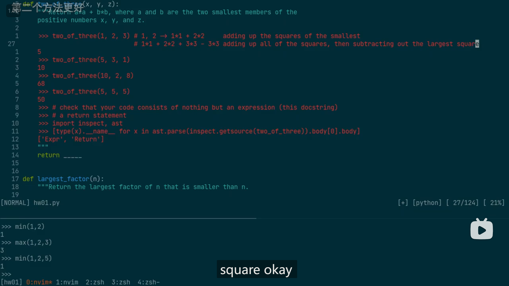

## Lecture 3 Control

### 1

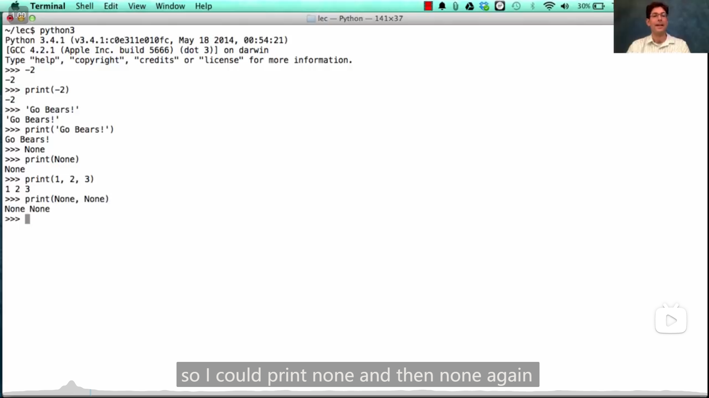{ loading=lazy }

`print()` 可以传入多个参数，打印时每个参数之间会空一个空格

### 2

{ loading=lazy }

-   在 a函数 参数调用的位置填入 被调用的b函数 ，实际上使先运行 b函数 ，再将b的返回值传入 a函数

-   `print()` 的返回值是 `None` 

补充：

{ loading=lazy }

### 3

!!! quote

    An environment is a sequence of frames.
    
    -   The global frame alone
    -   A local, then the global frame

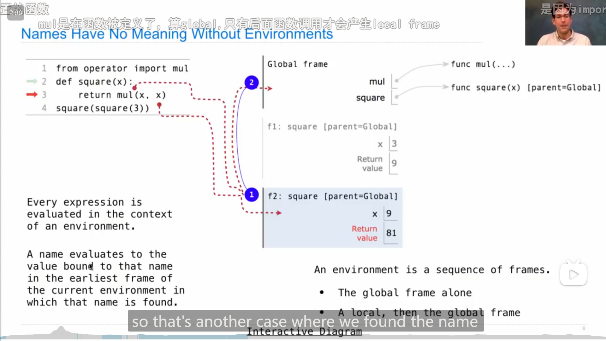{ loading=lazy }

{ loading=lazy }

变量名在查找对应的值的时候，会从当前的 frame 依次向上(parent frame) 查找值，并绑定最早找到的值，如图中的 `square` 先在f1中查找(如果f1没有再在Global frame中查找)，并绑定了4 (如果f1中没有 `square` 对应的值，则会绑定到global frame中的func square)

==此外==，

图中也可以发现，frame的parent是根据代码的结构来确定的，而不是根据调用的关系来确定的，如 第一张图中 `square(square(3))` 里面和外面的 `square` 的 parent 都是 global frame

>   跟 Lecture 2 Q&A 中一样

### 4

{ loading=lazy }

-   ```bash
    python -i xxx.py
    ```

    可以将 `xxx.py` 文件中的代码引入命令行或者终端

-   命令行/终端中使用python时，++ctrl+d++ `^D` 可以清空界面

{ loading=lazy }

-   ```bash
    python -m doctest [-v] xxx.py
    ```

    可以运行 `xxx.py` 中函数说明语句部分的代码(用于测试函数能否输入正确预期结果)，如果报错会显示出报错信息，如果不报错则不显示信息 而正常显示下一行(如果死循环就一直不显示下一行)，

    `-v` 选项是不报错也能显示每个输入的测试结果，如上图

### 5

真值为**假**的值： `False` , `0` , `''` , `None` 等等

其余其他值基本上都为真

### 6

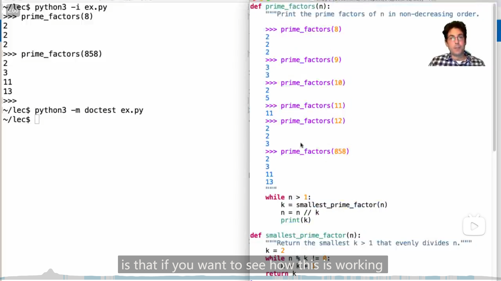{ loading=lazy }

老师写分解质因数的思路值得学习：

将问题分解成两步：

1.   一个数的最小因数(因为要求要升序)
2.   再循环找最小因数，从而获得升序的分解质因数

并且将找最小的因数这个功能单独写成一个函数，这样看起来就很清晰

```python
def prime_factors(n):
    """Print the prime factors of n in non-decreasing order.
    
    >>> prime_factors(8)
    2
    2
    2
    >>> prime_factors(9)
    3
    3
    >>> prime_factors(10)
    2
    5
    >>> prime_factors(11)
    11
    >>> prime_factors(12)
    2
    2
    3
    >>> prime_factors(858)
    2
    3
    11
    13
    """
    while n > 1:
        k = smallest_prime_factor(n)
        n = n // k
        print(k)
        
def smallest_prime_factor(n):
    """Return the smallest k > 1 that evenly divides n."""
    k = 2
    while n % k != 0:
        k = k + 1
    return k
```

## Lecture 3 Q&A

### 1

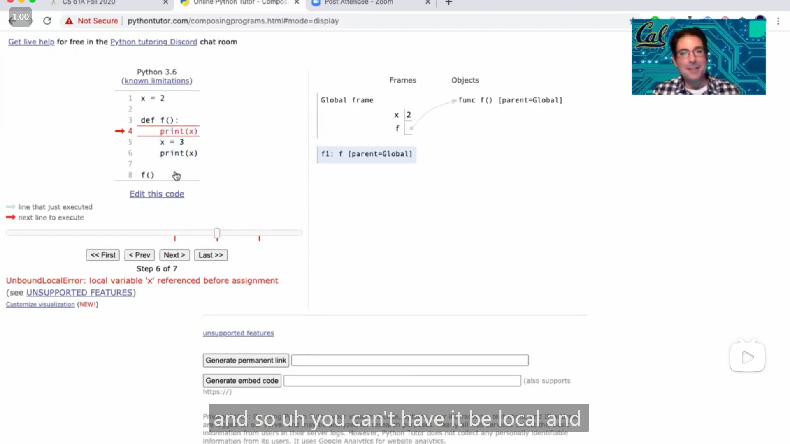{ loading=lazy }

由于**同一个函数内的同一个变量名必须指向同一个框架下的东西**，所以

```python
x = 2

def f():
    print(x)
    x = 3
    print(x)
    
f()
```

`x = 3` 这行已经对local框架下的x赋值，所以 f 函数内的x就都只能绑定local框架下的值，不能绑定母框架下的值

而第一个 `print(x)` 在执行时，(local框架下的)变量x还并未赋值，所以会报错，

如果去掉 `x = 3` 那么程序就不会报错

==[Lecture 16](https://ronaldln.github.io/MyPamphlet/Notes%20of%20Courses/CS61A/#3_12)中也说到了这一点==

## Lecture 4 Higher-Order Functions


## Lecture 10 Containers

### 1

`exec()` 函数可以执行字符串中的语句，如

```python
exec("curry = lambda f: lambda x: lambda y: f(x, y)")
```

可以让 `curry` 变量指向一个匿名函数

{ loading=lazy }

### 2

例

```python
for _ in range(3):
    ...
```

可以用 `_` 变量表示 `for` 循环中执行的语句与迭代的变量无关

### 3

string字符串的元素也是字符串，list的元素就是元素，即有

```python
>>> str = "hello"
>>> str[3][0][0]
'l'
```

### 4

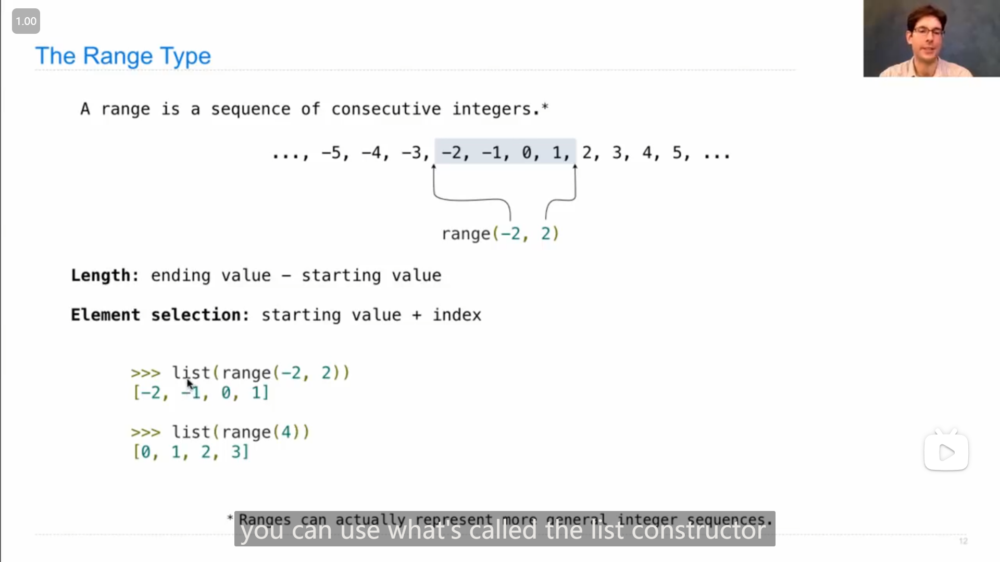{ loading=lazy }

记忆技巧 *“下标”* 对应元素之前，

对有序结构切片也适用，其中的负数也适用，如

```python
>>> l = list(range(5))
>>> l
[0, 1, 2, 3, 4]
>>> l[1:-1]
[1, 2, 3]
```

### 5

列表推导式(list comprehension)可以用 `if` ：

```python
>>> l2 = [x for x in [0, 1, 2, 5, 6] if x % 3 == 0]
>>> l2
[0, 6]
```

### 6

如果列表有子列表，且元素个数都固定，那么 `for` 可以直接获取子列表的元素/unpack子列表，如子列表都含两个元素：

{ loading=lazy }

## Lecture 10 Q&A

### 1

递增的递归写阶乘：

```python
def fact(n):
    return fact_helper(n, 1, 1)

def fact_helper(n, k, result):
    """Computes k * (k + 1) * (k + 2) * ... * n
    by accumulating the result
    """
    if n == k:
        return k * result
    else:
        return fact_helper(n, k + 1, k * result)
```

{ loading=lazy }

>   or
>
>   ```python
>   def fact(n, k=1, result=1):
>       """Computes k * (k + 1) * (k + 2) * ... * n
>       by accumulating the result
>       """
>       if n == k:
>           return k * result
>       else:
>           return fact(n, k + 1, k * result)
>   ```

这种(递增的递归)更像循环语句

(也可以将helper写入函数内部)

```python
def fact(n):
    def helper(k, result):
        if k == n:
            return k * result
        else:
            return helper(k + 1, k * result)
    return helper(1, 1)
```

or

```python
def fact(n):
    def helper(k):
        if k == n:
            return k
        else:
            return k * helper(k + 1)
    return helper(1)
```

## Lab 04

lab04中的Q4-Q6 在掌握了 *假想函数能返回所需要返回的东西(即假想返回的东西是已知的)* 的诀窍(在lecture12中)之后，做的很顺畅。

1.   先假想函数能返回所需的东西/值
2.   再想如何把情况分解成另一个或几个差不多(形式一样)但简单了一点的情况(有点类似于动态规划的找递推式)，如Q4中一般情况可以分成两个行/列减一的情况(即向上或向右走一步)
3.   再想 “基本情况” (最简单/特殊的情况(作为递归的终止情况))
4.   最后调整一般情况的返回的值

??? note "code"

    Q4
    
    ```python
    def paths(m, n):
        """Return the number of paths from one corner of an
        M by N grid to the opposite corner.
    
        >>> paths(2, 2)
        2
        >>> paths(5, 7)
        210
        >>> paths(117, 1)
        1
        >>> paths(1, 157)
        1
        """
        "*** YOUR CODE HERE ***"
        if m == 1 or n == 1:
            return 1
        else:
            return paths(m - 1, n) + paths(m, n - 1)
    ```
    
    Q5
    
    ```python
    def max_subseq(n, t):
        """
        Return the maximum subsequence of length at most t that can be found in the given number n.
        For example, for n = 20125 and t = 3, we have that the subsequences are
            2
            0
            1
            2
            5
            20
            21
            22
            25
            01
            02
            05
            12
            15
            25
            201
            202
            205
            212
            215
            225
            012
            015
            025
            125
        and of these, the maxumum number is 225, so our answer is 225.
    
        >>> max_subseq(20125, 3)
        225
        >>> max_subseq(20125, 5)
        20125
        >>> max_subseq(20125, 6) # note that 20125 == 020125
        20125
        >>> max_subseq(12345, 3)
        345
        >>> max_subseq(12345, 0) # 0 is of length 0
        0
        >>> max_subseq(12345, 1)
        5
        """
        "*** YOUR CODE HERE ***"
        if t == 0:
            return 0
        elif n < 10:
            return n
        else:
            return max(max_subseq(n // 10, t - 1) * 10 + n % 10, max_subseq(n // 10, t))
    ```
    
    Q6
    
    ```python
    def add_chars(w1, w2):
        """
        Return a string containing the characters you need to add to w1 to get w2.
    
        You may assume that w1 is a subsequence of w2.
    
        >>> add_chars("owl", "howl")
        'h'
        >>> add_chars("want", "wanton")
        'on'
        >>> add_chars("rat", "radiate")
        'diae'
        >>> add_chars("a", "prepare")
        'prepre'
        >>> add_chars("resin", "recursion")
        'curo'
        >>> add_chars("fin", "effusion")
        'efuso'
        >>> add_chars("coy", "cacophony")
        'acphon'
        >>> from construct_check import check
        >>> # ban iteration and sets
        >>> check(LAB_SOURCE_FILE, 'add_chars',
        ...       ['For', 'While', 'Set', 'SetComp']) # Must use recursion
        True
        """
        "*** YOUR CODE HERE ***"
        if not w1:
            return w2
        elif w1[0] == w2[0]:
            return add_chars(w1[1:], w2[1:])
        else:
            return w2[0] + add_chars(w1, w2[1:])
    ```

## Lecture 11 Data Abstraction

### 1

**"Unpacking" a list**

{ loading=lazy }

### 2

抽象思想

{ loading=lazy }

{ loading=lazy }

>   **==... you should know that when you're writing one part of a large program, that it should use the level abstraction appropriate to what you're trying to do,==**
>
>   **==and the higher you stay up, without crossing of these boundaries, the easier it will be to change your program==**

要 *向下解构*，和 *向上抽象*

### 3

{ loading=lazy }

字典可以通过特定的列表构造( 二元元组 组成的列表)

### 4

字典也有推导式

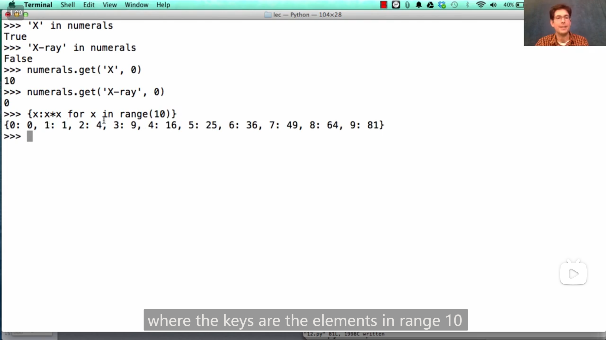{ loading=lazy }

## Lecture 11 Q&A

### 1

抽象可以使得修改某一层(layer)代码时带来的冲击/影响被隔离(isolate the impact)，有时可以使得修改所产生的影响只在这一层上。

冲击被隔离的例子：python dictionary的底层代码经常改变，但并不影响python中的使用

### 2

添加判断功能可以这样设计

{ loading=lazy }

## Project Cats

!!! info

    需要了解 Lec 12 Trees 中的数据抽象(data abstraction)部分的内容

### 1

Problem 5 中使用 `min()` (序列聚合函数)会很方便，

但要注意 使用 `key` 参数传入判断函数时，需要写上 `key=` 

### 2

Problem 9 中尝试了列表推导式的嵌套使用

```python
def time_per_word(times_per_player, words):
    """Given timing data, return a game data abstraction, which contains a list
    of words and the amount of time each player took to type each word.

    Arguments:
        times_per_player: A list of lists of timestamps including the time
                          the player started typing, followed by the time
                          the player finished typing each word.
        words: a list of words, in the order they are typed.
    """
    # BEGIN PROBLEM 9
    "*** YOUR CODE HERE ***"
    times = [[timestamp[i + 1] - timestamp[i] for i in range(len(timestamp) - 1)] for timestamp in times_per_player]
    return game(words, times)
    # END PROBLEM 9
```

### 3

Problem 10 中如果要把一个string加入(使用 `+` 运算符)到list中，不能直接*加*string (否则会把只含有单个字母的string作为元素加入到列表中)，应该 `+ [str]` 或 `+= [str]` (创建一个含该字符串的列表)

### 4

Problem 6

看了hint视频后，将原本需要借助内部helper函数的写法改成了不需要helper的，关键之处在于 想到了limit可以用于计数(拿来减)

```python
def shifty_shifts(start, goal, limit):
    """A diff function for autocorrect that determines how many letters
    in START need to be substituted to create GOAL, then adds the difference in
    their lengths.
    """
    # BEGIN PROBLEM 6
    # assert False, 'Remove this line'
    # def helper(start, goal, count):
    #     if count > limit:
    #         return count
    #     # elif not start:
    #     #     return count + len(goal)
    #     # elif not goal:
    #     #     return count + len(start)
    #     elif not start or not goal:
    #         return count + len(start + goal)
    #     else:
    #         return helper(start[1:], goal[1:], count if start[0] == goal[0] else count + 1)
    # return helper(start, goal, 0)

    # if limit == 0:
    #     return 1
    if limit < 0:
        return 0
    elif not start or not goal:
        return len(start + goal)
    elif start[0] == goal[0]:
        return shifty_shifts(start[1:], goal[1:], limit)
    else:
        return 1 + shifty_shifts(start[1:], goal[1:], limit - 1)
    # END PROBLEM 6
```

>   下图有一点启发作用(对problem 7如何找到*降解*的方法也有一定帮助)
>
>   { loading=lazy }

### 5

Problem 7

由提示视频中problem 6中的，助教*降解* **替换** 操作的方法如下：

```python
#   "range", "rungs"  2
#    "ange",  "ungs"  2
#     "nge",   "ngs"  1
#      "ge",    "gs"  1
#       "e",     "s"  1
#        "",      ""  0
```

>   { loading=lazy }

即*降解*的关键一步为：

```python
#   "range", "rungs"  1 + x
#    "ange",  "ungs"  1 + x
#     "nge",   "ngs"  x
#       ...,     ...  ...
```

那么，类似的， **添加** 操作的降解，拿 `cats` 作为start 以及 `scat` 作为goal 举例，可理解为：

cats在开头添加一个s，变成scats (添加的字母一定是goal的第一个字母)，

**那么需要判断的部分，就从 ==cats== 、 ==scat==，变成了 s ==cats== 、 s ==cat==**

则降解的关键一步就应该是：

```python
#       ...,     ...  ...
#    "cats",  "scat"  1 + x
#    "cats",   "cat"  x
#       ...,     ...  ...
```

则同理，**删除** 操作的降解，拿 ckiteus 、 kittens 举例，

操作前后，**需要判断的部分，从 ==ckiteus== 、 ==kittens==，变成了 ==kiteus== 、 ==kittens==**

则降解的关键一步就应该是：

```python
#          ...,        ...  ...
#    "ckiteus",  "kittens"  1 + x
#     "kiteus",  "kittens"  x
#          ...,        ...  ...
```

则最后根据模板修改的代码为：

```python
def pawssible_patches(start, goal, limit):
    """A diff function that computes the edit distance from START to GOAL."""
    # assert False, 'Remove this line'

    if limit < 0: # Fill in the condition
        # BEGIN
        "*** YOUR CODE HERE ***"
        return 0
        # END

    elif not start or not goal: # Feel free to remove or add additional cases
        # BEGIN
        "*** YOUR CODE HERE ***"
        return len(start + goal)
        # END

    elif start[0] == goal[0]:
        return pawssible_patches(start[1:], goal[1:], limit)
    else:
        add_diff = 1 + pawssible_patches(start, goal[1:], limit - 1) # ... # Fill in these lines
        remove_diff = 1 + pawssible_patches(start[1:], goal, limit - 1) # ...
        substitute_diff = 1 + pawssible_patches(start[1:], goal[1:], limit - 1) # ...
        # BEGIN
        "*** YOUR CODE HERE ***"
        return min(add_diff, remove_diff, substitute_diff)
        # END
```

>   最后发现思路与助教提示的一样
>
>   { loading=lazy }

!!! quote

    ...("ats" and "cats") we see thats adding one letter to the front, is actually the exact same as just chopping off letter from the front of the second word. so what do I mean by that, this is what I mean, I mean if I add one letter to the front, I might as well just be taking off one letter from the back, so instead of adding C to this word I can just say, well I'm just going to take off the first letter of whatever this word is, because I know that, if I add that letter to this word, then I know that it's going to be the correct letter, so I don't even need to add it, I can just go ahead and chop off the letter from the second word, and I know that it'll be okay. right, so doing comparing cats and cats, is the exact same thing as comparing ats and ats, there will be no more difference. so that's the add example right there...
    
    ...the last is the substitute example("hello" and "mello"). so this should be pretty familiar from our previous problem. remember for the previous problem we just took out the first letter of both, so it said that if they were different, then we're just gonna take them all out, and say that we had one edit distance, we had one substitution needed. and so you see that, substituting the first letter to an M to make it match the second, is the exact same thing as just taking out both letters. we don't care what they are, we see that they're different, we're just gonna take out both and call it a day. and so we see that we end with ello and ello, and then we're done...

### 6

字典可以这样写，更清晰

```python
report = {
    "id": user_id,
    "progress": progress,
}
```

(最后一个逗号有没有不影响)

>   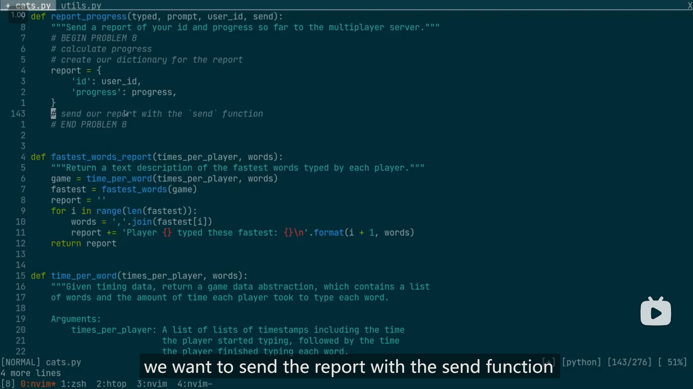{ loading=lazy }

### 7

一个小发现

`...` 可以赋值给变量，如

```python
a = 
```

会报错，

而

```python
a = ...
```

则不会报错

## Lecture 12 Trees

### 1

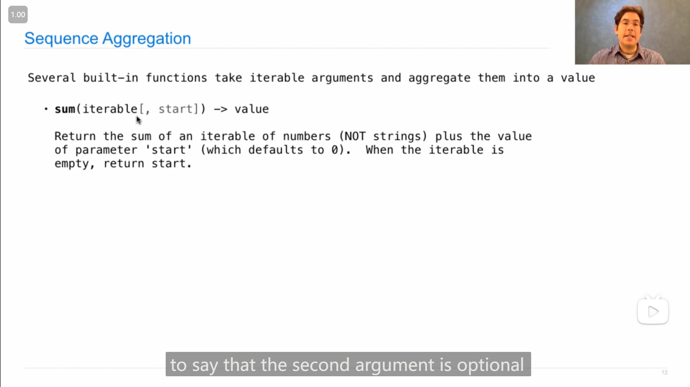{ loading=lazy }

`[...]` 中括号/方括号(square brackets)中的内容表示为可选的(optional)

### 2

序列聚合函数(Sequence Aggregation)

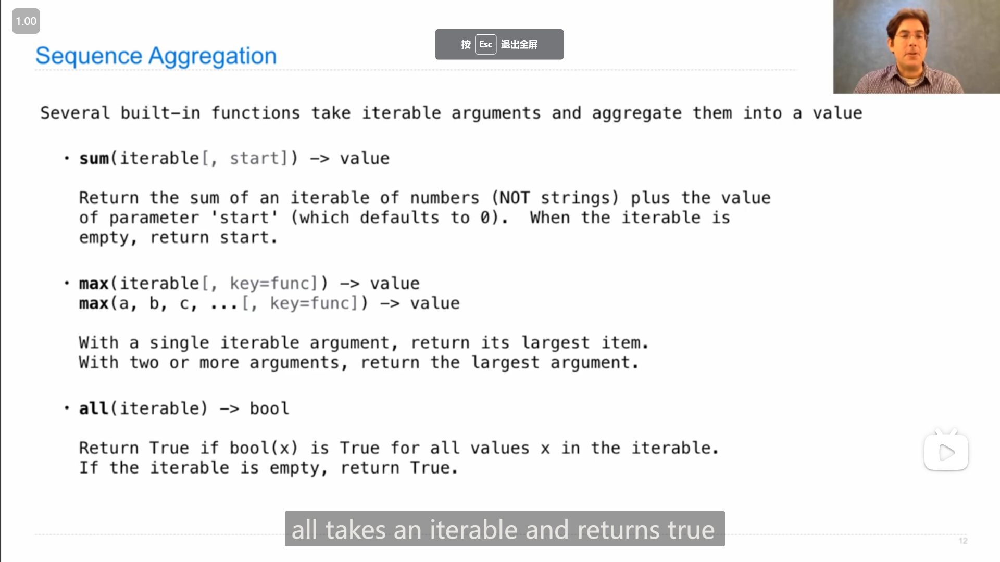{ loading=lazy }

`sum()` 函数，可以用于除字符串以外的序表，将序表中的元素以其对应的 `+` 法求和并返回(默认初始值为0，如果是其他类型，需要设置初始值，如列表需要传入空列表 `[]` 座位 `start` 参数)

{ loading=lazy }

`max()` 函数，可以返回最大值，或者是使key函数返回值最大的值(自变量)

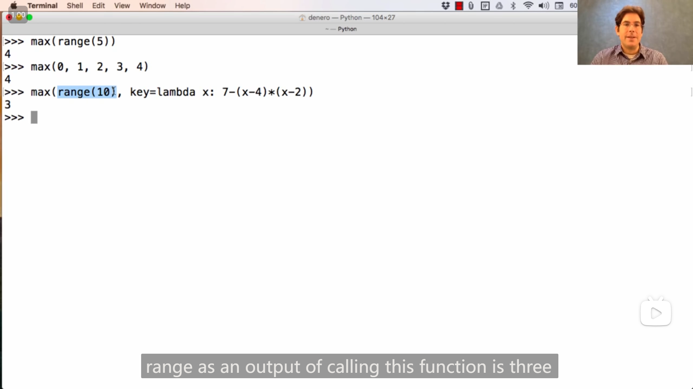{ loading=lazy }

>   对应的还有 `min()` 和 `any()`

### 3

**树抽象(Tree Abstaction)的实现**

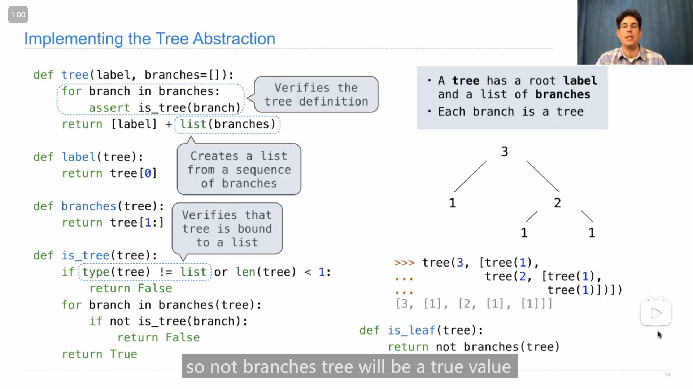{ loading=lazy }

### 4

递归在树中的运用，

要**==直接假想函数能返回所需要返回的东西(即假想返回的东西是已知的)==**，然后直接在函数内部去**直接使用**这个返回的东西，

并且需要记住树的孩子也是树。

例如

```python
def count_leaves(t):
    """Count the leaves of a tree."""
    if is_leaf(t):
        return 1
    else:
        branch_counts = [count_leaves(b) for b in branches(t)]
        return sum(branch_counts)
```

>   Hint: 假想该函数一定能返回树的叶子数(即假想已知子树叶子数)，然后对子树的叶子数和即得到本树的叶子数

```python
def leaves(tree):
    """Return a list containing the leaves labels of tree.
    
    >>> leaves(fib_tree(5))
    [1, 0, 1, 0, 1, 1, 0, 1]
    """
    if is_leaf(tree):
        return [label(tree)]
    else:
        return sum([leaves(b) for b in branches(tree)], [])
```

>   Hint: 假想该函数能返回 一个含 *树的所有叶子的值/标签* 的list 

```python
def increment_leaves(t):
    """Return a tree like t but with leaf labels incremented."""
    if is_leaf(t):
        return tree(label(t) + 1)
    else:
        bs = [increment_leaves(b) for b in branches(t)]
        return tree(label(t), bs)
```

```python
def increment(t):
    """Return a tree like t but with all labels incremented"""
    return tree(label(t) + 1, [increment(b) for b in branches(t)])
```

>   Hint: 假想能返回一个 ... 的树

```python
def fib_tree(n):
    if n <= 1:
        return tree(n)
    else:
        left, right = fib_tree(n - 2), fib_tree(n - 1)
        return tree(label(left) + label(right), [left, right])
```

>   Hint同上

### 5

还有另一种**不使用函数本身返回的值**的递归函数

{ loading=lazy }

```python
def fact(n):
    return fact_times(n, 1)

def fact_times(n, k):
    """Return k * n * (n - 1) * ... * 1"""
    if n == 0:
        return k
    else:
        return fact_times(n - 1, k * n)
```

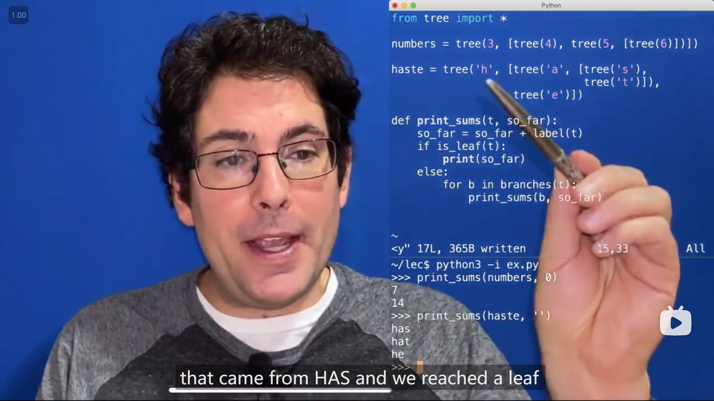{ loading=lazy }

(打印每个叶子(从根开始)的路径)

```python
def print_sums(t, so_far):
    so_far = so_far + label(t)
    if is_leaf(t):
        print(so_far)
    else:
        for b in branches(t):
            print_sums(b, so_far)
```

>   应该是将要迭代的变量作为参数传入函数中

## Lecture 12 Q&A

### 1

11:06

关于lab04 Q6

!!! quote

    ...by the way this is this is sort of a classic recursion problem, where you can see, you know, you think about the problem as what if i have a, you know, just there's one letter in each, and those match, what do i do, right, and then what do you do otherwise. it's, it's that classic recursion where you, you sort of simplify the problem to the simplest possible cases. the base case, one of them is empty, and then here there's there's sort of like two base cases almost, not quite because that second one is a recursion but it's that really really simple case, and then you build in the complexity after that. um, so that i, that's what's sort of really cool about these recursive solutions...
    
    ---
    
    ...顺便说一句，这是一个经典的递归问题，你可以看到，你知道，你认为这个问题是，如果我有一个，你知道的，每个只有一个字母，这些匹配，我该怎么做，对吧，然后你该怎么做。这是一个经典的递归，你可以将问题简化为最简单的情况。基本情况，其中一个是空的，然后这里几乎有两个基本情况，不完全是因为第二个是递归，但这是一个非常简单的情况，然后你构建复杂度。嗯，所以我，这就是这些递归解决方案真正酷的地方...

### 2

18:16

关于hw02 Q5，匿名函数的递归

!!! quote

    **John**:
    
    ```python
    lambda n: 1 if n == 1 else n * fact(n - 1)
    ```
    
    ...uh how would we give this thing a different name, well, instead of assigning we could have it be fact, 
    
    ```python
    lambda fact: lambda n: 1 if n == 1 else n * fact(n - 1)
    ```
    
    but then, how would we like, pass that in, i guess instead of putting it here, maybe, maybe the best place to put it is here,
    
    ```python
    lambda n, fact: 1 if n == 1 else n * fact(n - 1)
    ```
    
    so, basically in order to run this, we need an n and we need factorial. i'll just let that sink in, if factorial is not already defined, then somebody needs to pass it in, in order for us to call it. i'm gonna need a little bit more space than this i'm afraid. now, that we have a function that takes n and factorial. we need to be a little bit careful, we want this to be our factorial function, but it takes two arguments, and here we're calling it with only one argument, so that seems like a mismatch. what should be the second argument every time we call fact, well it should be the same function again, that's kind of how we get that recursive structure,
    
    ```python
    lambda n, fact: 1 if n == 1 else n * fact(n - 1, fact)
    ```
    
    is that every time we call this thing that takes in a number and the function that we're going to call recursively, it needs to be called on a new number and the function that we're going to call recursively. so we've actually made some progress even though all we've done is kind of like move a name in here, and uh, pass it around. the last part is that we need to figure out, how to write a function, that takes only n, and somehow uh, calls this one instead,
    
    ```python
    lambda n: (lambda n, fact: 1 if n == 1 else n * fact(n - 1, fact))
    ```
    
    and that's actually not so bad, this says, uh, give me a function, and call that function, on both n and itself.
    
    ```python
    lambda n: (lambda f: f(n, f))(lambda n, fact: 1 if n == 1 else n * fact(n - 1, fact))
    ```
    
    so if i have a function, and i call it on n and itself, where n comes from here, now i just need to know which function i'm supposed to be calling on n in itself. and the answer is, this guy (`(lambda n, fact: 1 if n == 1 else n * fact(n - 1, fact))`).
    
    ```python
    g = lambda n: (lambda f: f(n, f))(lambda n, fact: 1 if n == 1 else n * fact(n - 1, fact))
    ```
    
    so let's see what g does now. g computes n factorial, if we really wanted to get rid of that assignment statement, 
    
    ```python
    print((lambda n: (lambda f: f(n, f))(lambda n, fact: 1 if n == 1 else n * fact(n - 1, fact)))(4))
    ```
    
    then we could compute four factorial this way, by taking this function and calling it on four, and then, hopefully, if everything went right, we will have printed four factorial, or five factorial, or whatever. ==so, what was the key moments in figuring this out, one was, if we can't have fact defined already, then we have to pass it in as an argument, and the second was, if we have a function that takes two arguments, and we really want a function that takes one argument, then we should write a function that takes one argument, and calls the function that takes two arguments. and, then, the last part really is kind of a trick, which is to say like if you had a function and an argument, you would then call the function on the argument in itself, this is basically how you create recursion, without using assignment statements== is this little part right here...
    
    **Hany**:
    
    ...i i think john's right here. by the way, look there's a couple of things that you've seen before, ==essentially there's the helper function in here. you have a function that, uh, only takes one parameter and, you really need to pass two, so you put a helper function in==, that's basically what you have here with the lambda. um, you've got sort of the notion of recursion and then there's just that little trick there, um, which you see with, uh, this, uh, lambda f of f of nf. so don't, don't get too worried if you didn't see that obvi, it obvious, i don't think it's at all obvious actually.
    
    **John**:
    
    one thing that's exciting about this while it's not obvious at all, is that it allows you to create iteration out of just functions, like of course there's no assignment here, there's also no while statement or for statement here. but we are doing something repetitively, and, so, um, this is kind of, uh, this idea right here, is a building block for the claim, that once you can define functions you can kind of write any program that you want, you can perform any computation, and you might wonder was that really true, like don't i need a while statement or a for statement. it turns out technically you don't, that does not mean we should get rid of while statements and for statements, they're a lot more readable than this i think, but, um, they're not strictly necessary in order to perform interesting computations.
    
    **Hany**:
    
    yes, and some in the chat just pointed out scheme and lisp is this is sort of the premise of these functional programming languages, that don't have looping, explicit looping constructs as you do everything, with these types of constructs, and it's a little bit mind-bending, but, it turns out it's expressive enough...
    
    ---
    
    **John**:
    
    ```python
    lambda n: 1 if n == 1 else n * fact(n - 1)
    ```
    
    ...呃，我们怎么给这个东西取一个不同的名字呢，好吧，与其指定，我们可以让它成为fact，
    
    ```python
    lambda fact: lambda n: 1 if n == 1 else n * fact(n - 1)
    ```
    
    但是，我们会怎么想，把它传进来，我想与其把它放在这里，也许，也许最好的地方放在这里，
    
    ```python
    lambda n, fact: 1 if n == 1 else n * fact(n - 1)
    ```
    
    所以，基本上，为了运行这个，我们需要一个n，我们需要fact。我会让它沉下去，如果fact还没有定义，那么需要有人把它传进来，这样我们才能调用它。恐怕我需要更多的空间。现在，我们有一个函数，它取n和fact。我们需要小心一点，我们希望这是我们的阶乘函数，但它需要两个参数，而这里我们只用一个参数来调用它，所以这看起来不匹配。每次我们调用fact时，第二个参数应该是什么，它应该是同一个函数，这就是我们得到递归结构的方式，
    
    ```python
    lambda n, fact: 1 if n == 1 else n * fact(n - 1, fact)
    ```
    
    每次我们调用这个包含一个数字和我们要递归调用的函数的东西时，都需要对一个新的数字和我们将递归调用的功能进行调用。所以我们实际上已经取得了一些进展，尽管我们所做的只是把一个名字移到这里，然后把它传来传去。最后一部分是，我们需要弄清楚，如何编写一个只需要n的函数，并以某种方式调用这个函数，
    
    ```python
    lambda n: (lambda n, fact: 1 if n == 1 else n * fact(n - 1, fact))
    ```
    
    这其实还不错，这说，给我一个函数，并调用这个函数，对n和它本身。
    
    ```python
    lambda n: (lambda f: f(n, f))(lambda n, fact: 1 if n == 1 else n * fact(n - 1, fact))
    ```
    
    如果我有一个函数，我在n和它本身上调用它，n来自这里，现在我只需要知道我应该在n本身上调用哪个函数。答案是，这家伙 (`(lambda n, fact: 1 if n == 1 else n * fact(n - 1, fact))`)。
    
    ```python
    g = lambda n: (lambda f: f(n, f))(lambda n, fact: 1 if n == 1 else n * fact(n - 1, fact))
    ```
    
    让我们看看g现在做什么。g计算n阶乘，如果我们真的想去掉赋值语句，
    
    ```python
    print((lambda n: (lambda f: f(n, f))(lambda n, fact: 1 if n == 1 else n * fact(n - 1, fact)))(4))
    ```
    
    然后我们可以用这种方式计算4的阶乘，通过取这个函数并在4上调用它，然后，如果一切顺利，我们将打印出4的阶乘，或5的阶乘，或其他什么。==那么，弄清楚这一点的关键时刻是什么，一个是，如果我们还不能定义fact，那么我们必须将其作为一个参数传递，第二个是，我们有一个接受两个参数的函数，我们真的想要一个接受一个参数的函式，那么我们应该写一个接受了一个参数，并调用接受两个变量的函数。然后，最后一部分实际上是一种技巧，也就是说，如果你有一个函数和一个参数，你会在参数本身上调用函数，这基本上就是你创建递归的方法，而不使用赋值语句==，这就是这个小部分...
    
    **Hany**:
    
    ...我觉得约翰是对的。顺便说一下，这里有你以前见到过一些东西，最基本地 ==这里有helper函数。你有一个函数，呃，只接受一个参数，你需要传递两个，所以你在里面放了一个辅助函数==，这基本上就是lambda。嗯，你已经有了递归的概念，然后有一个小技巧，你可以看到，这个，这个，lambda f of f of nf。所以不要，不要太担心，如果你没有清楚地看到，我认为它实际上一点也不明显。
    
    **John**:
    
    虽然这一点并不明显，但有一点令人兴奋，那就是它允许你仅从函数中创建迭代，当然这里没有赋值，这里也没有while语句或for语句。但我们在重复地做一些事情，这是一种，嗯，这个想法，是这个主张的一个构建块，一旦你定义了函数，你就可以编写任何你想要的程序，你可以执行任何计算，你可能会想，这真的是真的吗，比如我不需要while语句或for语句。事实证明，从技术上讲，你没有，这并不意味着我们应该去掉while语句，对于语句，它们比这更可读，但是，嗯，为了执行有趣的计算，它们并不是严格必要的。
    
    **Hany**:
    
    是的，聊天中的一些人刚刚指出scheme和lisp，这是这些函数式编程语言的前提，它们在做任何事情时都没有循环、显式的循环结构，有这些类型的结构，这有点让人费解，但事实证明它足够有表达力...

我的理解是，匿名函数的递归，由于无法声明变量和给变量赋值，所以需要将函数作为参数传入匿名函数，然后再在内部调用，而由于此时匿名函数测参数中有一个函数参数，所以在调用以参数传入的函数时，参数也要与自身相匹配(即加上该函数自身)，如

```python
lambda n, f: 1 if n == 1 else f(n, f)
```

下一步我的理解是，由于需要去调用匿名函数自身，而又不能赋值，那么就智能将函数作为参数传入另一个函数，再在后者内部调用前者，即

```python
(lambda f: f(n, f))(lambda n, f: 1 if n == 1 else f(n, f))
```

最后，由于n是最终想要设置的参数，所以在最外面最后包上一层

```python
lambda n: (lambda f: f(n, f))(lambda n, f: 1 if n == 1 else f(n, f))
```

### 3

23:52

关于lecture 12最后提及的递归函数的构建方式

!!! quote

    { loading=lazy }
    
    ```python
    def fact(n):
        if n == 0:
            return 1
        else:
            return n * fact(n - 1)
    
    def fact_times(n, k):
        """Return k times n factorial
                  k *     n * (n-1) * ... * 1
        """
        if n == 0:
            return k
        else:
            return fact_times(n - 1, k * n)
    ```
    
    **John**:
    
    ...yeah, so the reason we did something a little bit different here, was so that we could show an example, of a recursive function, that just called itself, without doing anything with it, so there kind of wasn't anything outside of the call, everything happened inside the call, where we subtracted one from n and we multiplied k by n. but we didn't like add anything or multiply anything afterwards, which was different than the original version of factorial, which did multiply the result of the recursive call by n. the original one looked like this, right, it was like if n equals zero return one, else return n times fact n minus one. so here we make the recursive call and then we like do some work afterwards, and that means the recursive call doesn't really know where it came from. it doesn't know anything about which factorial result you're constructing, whereas this one does. at the end, when you hit the base case, you have computed k times n factorial for whatever n in k you started with, and that is now named k, which is a little confusing, but that's how it goes sometimes with recursion. but the point is that the whole answer is, uh, built up by the time you hit the base
    case, at which point you just have to return return return return, all the work is done.
    
    **Hany**:
    
    and notice, by the way, ==in that first one== that's not true, as you're doing recursion, ==there is a delayed gratification of the evaluation of that product, so when you hit the base case in the first fact, you then have to go back and now multiply all those numbers between n and one==. yeah because you built an expression, whereas ==in the fact times==, you basically have an assignment operator, it's that you're, you're just ==using the parameters as the assignment operator==, and so ==when you hit that base case, done, i've got the answer==. so, so you're right, ==of course, we could have done it differently, we didn't have to do it this way, but you see that the structurally the recursion is subtly different here==, and it turns out this has a real implication too by the way, downstream, and i think, i think we'll eventually do that, right john.
    
    **John**:
    
    yeah so ==this is called, uh, tail recursion==, and this is not, and we'll talk about this later when we talk about interpreters. um, so the goal here wasn't to implement fact times, it was actually to re-implement fact. but ==in order to re-implement fact you'd have to have a helper function, that's what fact times is. that keeps track of two arguments instead of one. the thing you're trying to compute the factorial of, and the result the answer of computing n.==
    
    ---
    
    **John**：
    
    ...是的，我们在这里做了一些不同的事情，是为了展示一个递归函数的示例，它只是调用了自己，而没有对它做任何事情，所以在调用之外几乎没有什么东西，所有事情都发生在调用内部，我们从n中减去了1并将k乘以n。但是我们没有添加或乘以任何其他东西，这与阶乘的原始版本不同，原始版本通过乘以递归调用的结果来计算。原始版本看起来像这样，如果n等于零，则返回1，否则返回n乘以fact（n-1）。所以在这里，我们进行递归调用，然后在之后进行一些工作，这意味着递归调用不知道它来自哪里。它不知道你正在构建哪个阶乘结果，而这个版本知道。最后，当你到达基本情况时，你已经计算出了对于任何以k为n开始的n，k乘以n的阶乘，现在它被命名为k，这有点令人困惑，但有时就是这样递归。但是重点是整个答案在达到基本情况时就已经构建完成，此时你只需要返回，返回，返回，所有的工作都已完成。
    
    **Hany**：
    
    顺便提一下，==在第一个函数中==，当你进行递归时，==有一个乘积的评估延迟，所以当你在第一个fact中达到基本情况时，你需要回去现在乘以n和1之间的所有数字==。是的，因为你构建了一个表达式，而 ==在fact times中==，你基本上有一个赋值运算符，你只是 ==将参数用作赋值运算符==，所以当你 ==到达基本情况时，完成了，我得到了答案==。所以，当然，你是对的，==我们本来可以用不同的方式做这个，但你可以看到，递归的结构在这里是微妙不同的==，这在下游也有实际影响，我认为我们最终会做，对吧，John。
    
    **John**：
    
    是的，所以 ==这被称为尾递归==，而这不是尾递归，我们将在讨论解释器时再谈论这个问题。所以这里的目标不是实现fact times，而是重新实现fact。但是 ==为了重新实现fact，您必须有一个辅助函数，即fact times。与一个参数不同，它保留了要计算阶乘的元素和计算n结果的答案这两个参数。==

## Lab 05

### 1

Q6 中，借鉴了 `lab05.py` 文件底部 `Tree ADT` 中最后一个函数 `copy_tree()` 的函数构造思路

>   ```python
>   def copy_tree(t):
>       """Returns a copy of t. Only for testing purposes.
>   
>       >>> t = tree(5)
>       >>> copy = copy_tree(t)
>       >>> t = tree(6)
>       >>> print_tree(copy)
>       5
>       """
>       return tree(label(t), [copy_tree(b) for b in branches(t)])
>   ```

由于Q6中是需要返回一个新的树，所以直接用树的构造函数根据原树去**递归地**(参考 `copy_tree()` )构造一个新树

>   (先构建好基本的递归，再考虑基本情况(basic situation)下如何处理)
>
>   1.   ```python
>        def sprout_leaves(t, leaves):
>            return tree(label(t), [... sprout_leaves(branch, leaves) for branch in branches(t)])
>        ```
>
>   2.   ```python
>        def sprout_leaves(t, leaves):
>            return tree(label(t), [... if is_leaf(branch) else sprout_leaves(branch, leaves) for branch in branches(t)])
>        ```
>
>   3.   ```python
>        def sprout_leaves(t, leaves):
>            return tree(label(t), [tree(label(branch), [...]) if is_leaf(branch) else sprout_leaves(branch, leaves) for branch in branches(t)])
>        ```
>
>   4.   ```python
>        def sprout_leaves(t, leaves):
>            return tree(label(t), [tree(label(branch), [tree(leaf) for leaf in leaves]) if is_leaf(branch) else sprout_leaves(branch, leaves) for branch in branches(t)])
>        ```

### 2

Q9

(可以利用下标来构建推导式)

!!! quote

    ==*Hint:* To write this as a single comprehension, you may find the expression `k%2`, which evaluates to 0 on even numbers and 1 on odd numbers, to be useful. Consider how you can use the 0 or 1 returned by `k%2` to alternatively access the beginning and the middle of the list.==

??? note "code"

    ```python
    def riffle(deck):
    """Produces a single, perfect riffle shuffle of DECK, consisting of
    DECK[0], DECK[M], DECK[1], DECK[M+1], ... where M is position of the
    second half of the deck.  Assume that len(DECK) is even.
    >>> riffle([3, 4, 5, 6])
    [3, 5, 4, 6]
    >>> riffle(range(20))
    [0, 10, 1, 11, 2, 12, 3, 13, 4, 14, 5, 15, 6, 16, 7, 17, 8, 18, 9, 19]
    """
    "*** YOUR CODE HERE ***"
    return [deck[i // 2] if i % 2 == 0 else deck[(len(deck) + i) // 2] for i in range(len(deck))]
    ```

### 3

在 [Lecture 14 Q&A](#Lecture 14 Q&A) 中 John 有提到此题的解法，在看了一部分(使用下标的方法)之后，用列表推导式写出了一个可用的方法(结构有点类似于Q6)：

```python
def add_trees(t1, t2):
    return tree(label(t1) + label(t2), [add_trees(branches(t1)[i] if i < len(branches(t1)) else tree(0), branches(t2)[i] if i < len(branches(t2)) else tree(0)) for i in range(max(len(branches(t1)), len(branches(t2))))])
```

### 4

Q11中

```python
def build_successors_table(tokens):
    """Return a dictionary: keys are words; values are lists of successors.

    >>> text = ['We', 'came', 'to', 'investigate', ',', 'catch', 'bad', 'guys', 'and', 'to', 'eat', 'pie', '.']
    >>> table = build_successors_table(text)
    >>> sorted(table)
    [',', '.', 'We', 'and', 'bad', 'came', 'catch', 'eat', 'guys', 'investigate', 'pie', 'to']
    >>> table['to']
    ['investigate', 'eat']
    >>> table['pie']
    ['.']
    >>> table['.']
    ['We']
    """
    table = {}
    prev = '.'
    for word in tokens:
        if prev not in table:
            "*** YOUR CODE HERE ***"
        "*** YOUR CODE HERE ***"
        prev = word
    return table
```

中的 `sorted()` 函数如果以字典为传入参数，输出的 应该 是一个含有所有key并且排序好的列表

## Lecture 13 Q&A

### 1

John关于 `min()` 和 `max()` 的 `key` 参数的一些解释和说明

!!! qoute

    ...what's going on with the min function and its optional argument called key. sometimes what you want is to find the smallest number among a list, and min will do that for you. but **sometimes what you want is to find a particular number that's extreme in another way, like it's not the smallest, it's not the largest, but it's the closest to five or it's the, it's the thing that when you square it is closest to 24, or you know you could imagine any kind of description, where there's like a some value, that would do this the best**, and min allows you to find that element for any possible condition, and that's the point of that key function. **so the way you do it is that, you start out with your same set of values, of which one is the one that you're looking for, and then you provide a function, and this function is going to be called on every single one of these values**, and yeah, let's use that example of, uh, the square is as close as possible to 24. i don't know why you would want this, but maybe you would for some reason.
    
    ```python
    >>> min([3, 2, 5, 6], key=lambda x: abs(x * x - 24))
    ```
    
    so what's going to happen here, is that it's going to square, and then subtract 24 from each of these, and then take the absolute value in order to get some measurement of how close is the square of this x to 24. and it tells us 5 is among these numbers the one that when you square it gets you pretty close to 24. **in fact there's like an important property about this computation that's not shown, which is that 5 squared minus 24 is 1, and there's no 1 in this output, that's all hidden**. what is happening is that, that 1 is computed along with the result of, squaring 3 and subtracting 24, and squaring 6 and subtracting 24. **so it's done it for all of them, and then it has found the one, for which the result of calling this function is the smallest**. why the smallest, because it's min. **so in this way you can use min in order to find the, kind of extreme value for any notion of extreme that you want, but you always get one of these values**. and if there's a tie, then you'll get an arbitrary one i think. you get the first one but i'm not actually sure...
    
    ---
    
    ...min函数及其名为key的可选参数发生了什么。有时，你想要的是在一个列表中找到最小的数字，min会为你做到这一点。**有时，你想要的是找到一个以另一种方式极端的特定数字，比如它不是最小的，也不是最大的，但它最接近5，或者它是，当你把它平方时，它最接近24，或者你知道你可以想象任何一种描述，其中有一个值，这将是最好的**，min允许你找到任何可能条件下的元素，这就是关键函数的意义所在。**这样做的方法是，你从一组相同的值开始，其中一个是你正在寻找的值，然后你提供一个函数，这个函数将对这些值中的每一个调用**，是的，让我们用这个例子，呃，平方尽可能接近24。我不知道你为什么想要这个，但也许出于某种原因你会想要。
    
    ```python
    >>> min([3, 2, 5, 6], key=lambda x: abs(x * x - 24))
    ```
    
    这里要做的是，它要平方，然后从每一个中减去24，然后取绝对值，得到x和24的平方有多接近。它告诉我们，5是这些数字中的一个，当你平方时，它会非常接近24**事实上，这个计算有一个重要的性质没有显示，那就是5的平方减去24是1，而这个输出中没有1，这都是隐藏的**。现在的情况是，1与平方3和减法24、平方6和减法24的结果一起计算。**因此，它对所有这些函数都进行了处理，然后找到了一个函数，调用该函数的结果是最小的**。为什么是最小的，因为它是最小的。**通过这种方式，你可以使用min来找到，任何你想要的极值概念的极值，但你总是得到其中一个值**。如果打成平手，我想你会得到一个任意的平手。你得到了第一个，但我实际上不确定...

### 2

{ loading=lazy }

两个列表在比较大小时，会比较第一个元素的大小( `min()` 函数也类似)，

测试了一下，应该是像字符串一样的规则，即前一个元素能比较出就按照该结果，若相等则比较下一个元素...

```python
>>> [3, 4, 5] > [3, 3]
True
>>> [3, 4, 5] > [4, 3]
False
>>> [3, 4, 5] > [3, 4]
True
>>> [3, 4, 5] > [3, 5]
False
```

## Lecture 14 Circuits

### 1

Hany讲设计电路(Design Circuits)的内容中，构建命题逻辑公式的思路(step 1-3)值得学习

>   1.   step 1. build truth-table for all possible input/output values
>   2.   step 2. build sub-expressions with *and/not* for each output column
>   3.   step 3. combine, two at a time, sub-expressions with an *or*
>   4.   step 4. draw circuit diagram

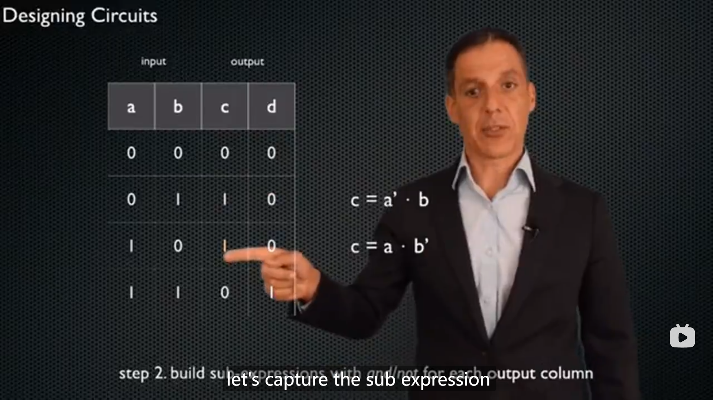{ loading=lazy }

1.   先根据真值表写出子表达式
2.   再将子表达式析取(or)到一起

|  a   |  b   |   c   |  d   |
| :--: | :--: | :---: | :--: |
|  0   |  0   |   0   |  0   |
|  0   |  1   | ==1== |  0   |
|  1   |  0   |   1   |  0   |
|  1   |  1   |   0   |  1   |

上面真值表中高亮的c的1的输出值，需要的子表达式应为 `c = a' · b` (非a且b)

|  a   |  b   |   c   |  d   |
| :--: | :--: | :---: | :--: |
|  0   |  0   |   0   |  0   |
|  0   |  1   |   1   |  0   |
|  1   |  0   | ==1== |  0   |
|  1   |  1   |   0   |  1   |

同理，这个高亮的输出值，对应的子表达式应为 `c = a · b'` 

最后，再析取两个子表达式，即得到

`c = (a' · b) + (a · b') ` 

### 2

二进制数的加法需要构建出有3个输入值和2个输出值的电路

{ loading=lazy }

{ loading=lazy }

### 3

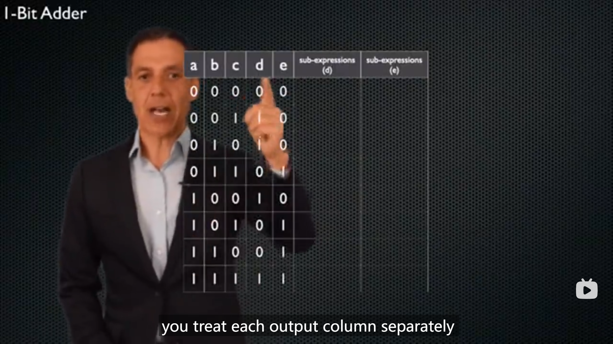{ loading=lazy }

>   ...okay, remember how the sub expressions work, **you treat each output column separately**, the d and the e. **output column are completely independent of each other**. we're going to identify **wherever there's a one**, and then here here here and here. we're going to build a sub expression **using only and and not**, and then we're going to **combine those sub expressions using the or operator**. and then once we have the final expression, of course we're going to draw some circuitry...
>

感觉有点类似与写出主析取范式

### 4

{ loading=lazy }

写命题逻辑公式的技巧：

1.   变元多的时候可以多个变元合成一组，然后结合表格展示真值
2.   写子表达式时的技巧，如由上图灰色区域，可以发现与a的取值无关，故可以写出子表达式 `b·c·d'`

## Lecture 14 Q&A

### 1

Lab 05 的 Q10

**不使用 built-in zip function:**

{ loading=lazy }

John的方法我认为关键之处在于，用下标去联系两颗树对应的树枝/分支

>   ```python
>   def add_trees(t1, t2):
>       result_label = label(t1) + label(t2)
>       result_branches = []
>       i = 0
>       while i < min(len(branches(t1)), len(branches(t1))):
>           b1, b2 = branches(t1)[i], branches(t2)[i]
>           new_branch = add_trees(b1, b2)
>           result_branches = result_branches + [new_branch]
>           i = i + 1
>       result_branches = result_branches + branches(t1)[i:]
>       result_branches = result_branches + branches(t2)[i:]
>       return tree(result_label, result_branches)
>   ```

**使用 built-in zip function:**

{ loading=lazy }

`zip()` 可以将多个序列中的元素同时提取出来，比如，a列表有5个元素，b列表有8个元素，则 将两者输入到 `zip()` 中，会得到一个含有a列表全部元素和b列表前5个元素的*序列*，序列中每个元素为a b列表中下标对应的元素(像上图中的一样)

**重要的是**可以使用 序列推导式，或者 `for` 语句(利用 `zip()` )**将多个序列中的元素一起提取出来**，如

```python
>>> l1 = [1, 2, 3]
>>> l2 = ["a", "b", "c"]
>>> [[x, y] for x, y in zip(l1, l2)]
[[1, 'a'], [2, 'b'], [3, 'c']]
```

那么使用 `zip` 的代码可以写成：

```python
def add_trees(t1, t2):
    result_label = label(t1) + label(t2)
    result_branches = [add_trees(b1, b2) for b1, b2 in zip(branches(t1), branches(t2))]
    result_branches += branches(t1)[len(result_branches):] + branches(t2)[len(result_branches):]
    return tree(result_label, result_branches)
```

## Lecture 15 Mutable Values

### 1


!!! quote

    ...so objects represent information, **they consist of data and behavior bundled together to create abstractions. objects can represent things, but also properties of things, or interactions, or processes, they're an extremely general concept, anything that has attributes can be represented as an object**. a type of object is called a class, classes are first class values in python, they can be passed in as arguments to functions. and objects are the heart of object oriented programming, which is an approached programming, that allows us to organize large programs using a central metaphor, that a large program is just one big thing, it's a bunch of individual objects, communicating with each other by sending messages back and forth.
    
    ---
    
    ...所以对象表示信息，**它们由捆绑在一起的数据和行为组成，以创建抽象。对象可以表示事物，也可以表示事物的属性、交互或过程，它们是一个非常通用的概念，任何具有属性的东西都可以表示为对象**。一种类型的对象被称为类，类是python中的第一个类值，它们可以作为参数传递给函数。对象是面向对象编程的核心，这是一种接近编程，它允许我们使用一个中心隐喻来组织大型程序，大型程序只是一件大事，它是一堆单独的对象，通过来回发送消息来相互通信。

### 2

`str` 的几个方法(每种数据类型下的数据都是一个对象，如 `int` 、 `str` )

{ loading=lazy }

### 3

我认为这是一个适合记忆的ascii码表

{ loading=lazy }

这是16进制的ascii码表：

```python
>>> a = 'A'
>>> ord(a)
65
>>> hex(ord(a))
'0x41'
```

### 4

{ loading=lazy }

-   一些 `list` 的方法 
-   列表可以同时修改多个值，如图中 `suit[0:2] = ['heart', 'diamond']`

-   如果将值为一个列表的变量赋值给另一个变量，那么两个变量其实上都指向同一个列表对象，通过二者之一进行改动，都是对对象本身改动(显示另外一个变量的值时会发现也改变了)

>   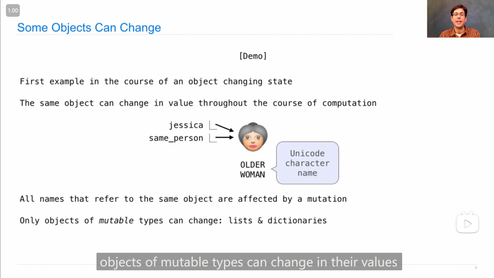{ loading=lazy }
>
>   从环境图中也可以看到，两个变量指向的时通过一个列表，修改都是对于列表对象本身进行修改

### 5

{ loading=lazy }

所有指向同一个对象的变量(的值，即指向的对象)都会被**一个改变(==mutation==)**影响

并且，只有*可变的*类型才能这样：list 和 dictionary

>   All name thar refer to the same object are affected by a mutation
>
>   Only objects of *mutable* types can change: lists & dictionaries

### 6

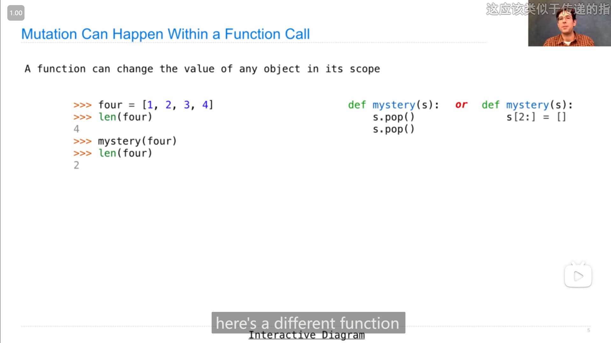

可以使用*列表切片*去来 增添 或 删减 或 替换 列表中的元素

```python
>>> list = [1, 2]
>>> list[4:6] = [4, 5]
>>> list
[1, 2, 4, 5]
>>> list[3:] = [6, 7, 8]
>>> list
[1, 2, 4, 6, 7, 8]
>>> list[2:] = []
>>> list
[1, 2]
```

### 7

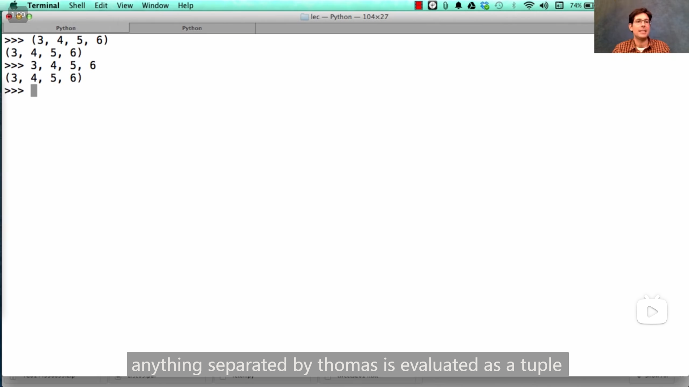{ loading=lazy }

-   被逗号分隔的几个数据也会被认为元组(tuple) (可认为是省略了括号的元组)
-   用一个列表来调用 tuple 的构造函数，会得到含有相同顺序的相同元素的元组
-   逗号 `,` 可以位于元组的最后(应该也可以位于列表和字典的最后，之前有试过)
-   第三点和第一点结合起来可以得到：`2,` 和 `2` 是不一样的(前者是一个元素，后者是一个整数)

### 8

元组能作为字典的 key:

```python
>>> {(1, 2): 3}
{(1, 2): 3}
```

但元组中也不能含有列表:

```python
>>> {(1, [2]): 3}
Traceback (most recent call last):
  File "<stdin>", line 1, in <module>
TypeError: unhashable type: 'list'
```

### 9

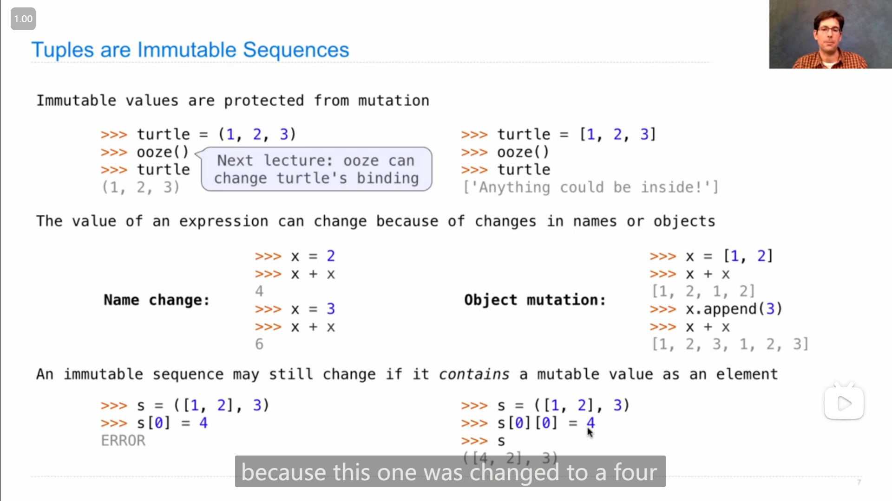{ loading=lazy }

-   可变对象可以通过 *对象突变(Object mutation)* 来改变值，也可以通过 *Name change* 来改变(应该是直接改变指向的对象)，而不可变对象(如元组等)只能通过 *Name change* 来改变
-   如果不可变对象含有可变对象的元素，这个可变对象可以改变(个人认为，可以类比成c中的指针常量，指针本身不改变，但指向的值能改变)

### 10

**恒等运算符(Identity Operators) `is`**

用于判断两个变量是否指向同一个对象

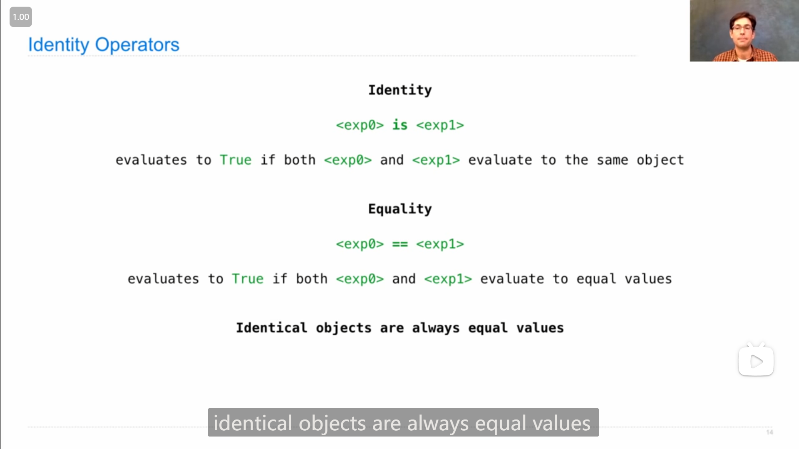{ loading=lazy }

{ loading=lazy }

### 11

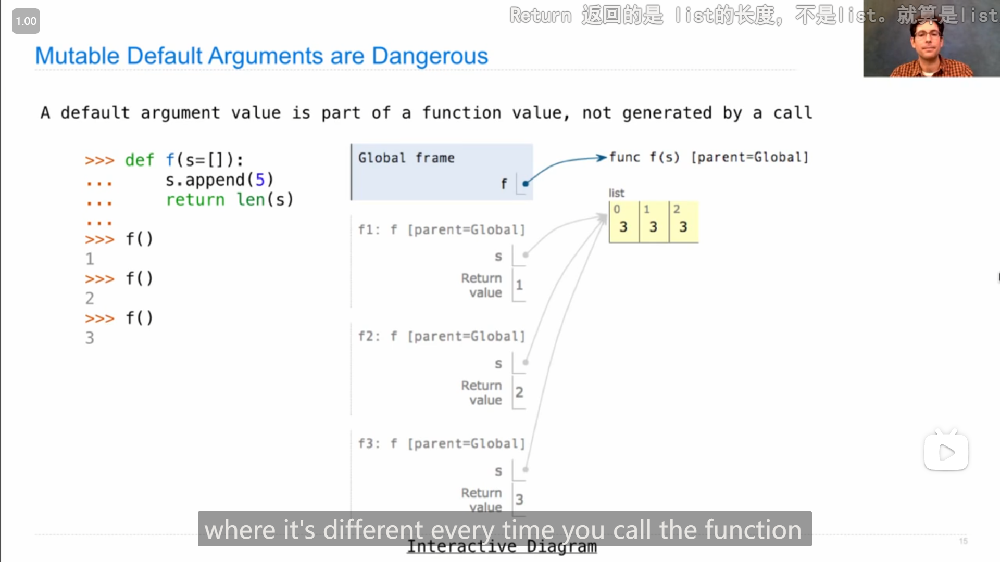{ loading=lazy }

同一个函数的默认参数是同一个对象，即使多次调用函数，使用默认参数时使用的都是同一个对象

因此如果是可变对象类型，要注意==修改这个对象会导致之后调用函数时(如果使用的话)默认参数会与之前不一样

### 12

list的各种运算

-   `.append()` 方法，将传入的参数添加道列表尾部(如果传入的是一个列表，就将该列表(同一对象)存入尾部)

    { loading=lazy }

-   `.extend()` 方法，应该是传入一个列表(元组或许也可以？(试了，可以))，将列表中的元素依次添加到原列表尾部

    { loading=lazy }

-   **加法** 和 **切片** ，**两者都会创建出一个新的列表**，因此下图中 `a[1] = 9` 并没有使 列表s 的元素改变，但由于 列表a 的第三个元素是列表，同时也是 列表b 的第二个元素，因此通过 列表b 修改时，也会让原本的 列表t 改变

    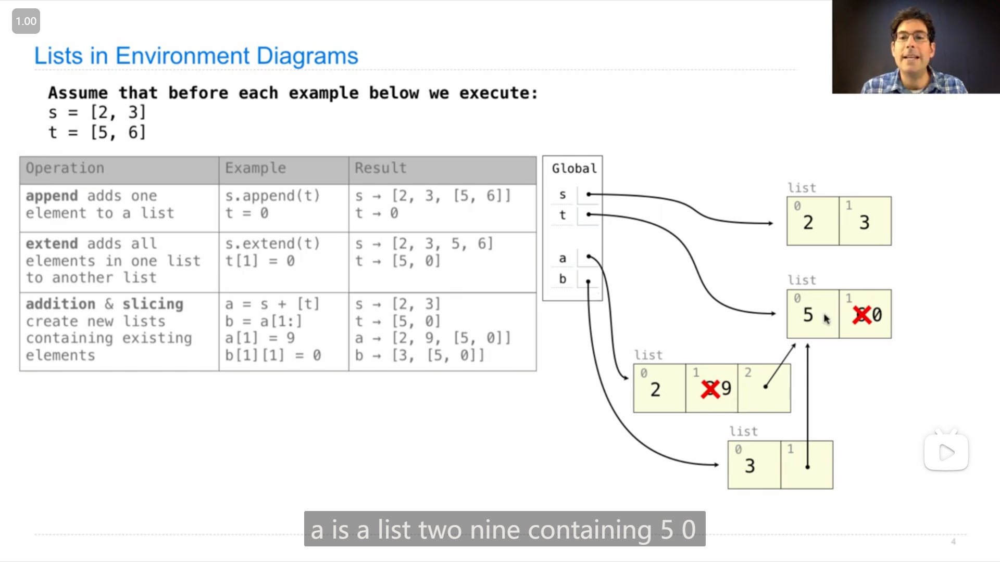{ loading=lazy }

-   `list()` 列表的构造方法，可以传入一个列表(元组和 `range()` 也可以)，(如果传入的是一个列表)会构建出一个与原列表一样的**新**列表

    { loading=lazy }

-   **列表切片的赋值**，可以对列表进行 **添加(添的比删的多)** / **替换(添的删的一样多)** / **删减(添的比删的少)** 操作，如下图中

    -   `s[0:0] = t` 将t中元素加到(==塞入==)s的头部(0号位置)
    -   `s[3:] = t` 将4号元素删去，并在该位置 塞入 t中的元素

    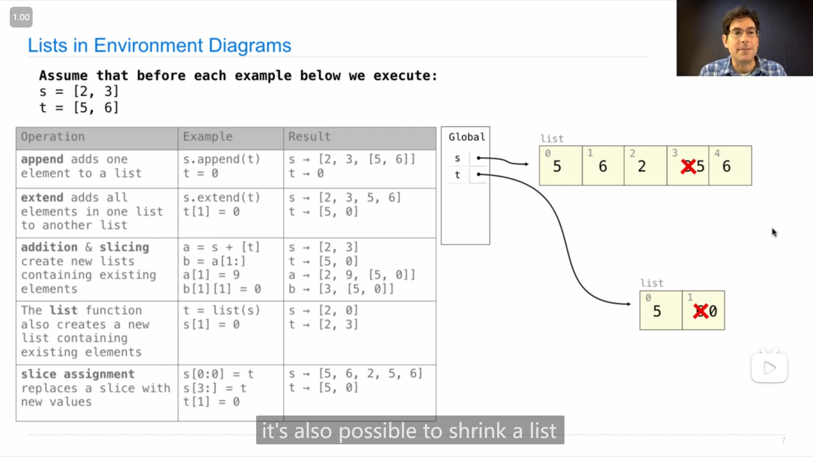{ loading=lazy }

-   -   `.pop()` 方法，从列表中**拿出**并**返回**最后一个元素
    -   `.remove()` 方法，传入一个参数，在列表中删去第一个跟传入参数相同的元素
    -   用切片赋值的方法去删除列表中的元素

    { loading=lazy }


### 13

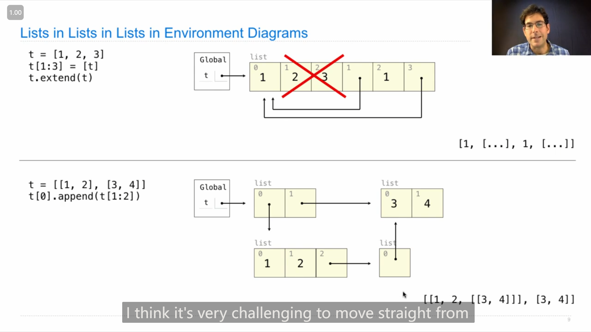{ loading=lazy }

```python
t = [1, 2, 3]
t[1:3] = [t]
t.extend(t)
```

最终得到 `t = [1, [...], 1, [...]]` 的结果的原因，个人的理解：由上图中的环境图可以看到，列表中会有 *无穷循环的指向* 会一直后指向前再从前走到后，因此会得到 `...` 的东西

## Lecture 15 Q&A

### 1

{ loading=lazy }

*切片赋值*需要是一个列表(可能元组或者字符串 或其他*容器(container)*也行？)，如上图中 `s[0:0] = 5` 会报错，应该写成 `s[0:0] = [5]`

###  2

(可以作为上一点的补充)

!!! quote

    good question. so why isn't it that t becomes an element of s, and the reason is that's just how slice assignment works. it's that it takes a container full of elements and **it doesn't put that whole container in s, instead of puts the elements of that container in s**.
    
    ---
    
    好问题。为什么t不成为s的一个元素，原因是切片赋值就是这样工作的。它取一个装满元素的容器，**不是将整个容器放在s中，而是将该容器的元素放在s**。

### 3

{ loading=lazy }

下标选择(*selector*)不会改变列表的长度

而切片赋值会改变列表的长度

!!! quote

    ...there's only t and this used to be three elements long, it's still three elements long, element assignment never changes the length of the list, it just changes what's in it. slice assignment is different, it changes the length of the list, it replaces an existing slice with some new elements.
    
    ---
    
    ...只有t，它过去有三个元素长，现在仍然有三个元件长，元素赋值永远不会改变列表的长度，它只是改变其中的内容。切片赋值不同，它改变了列表的长度。它用一些新元素替换了现有的切片。

### 4

Hany关于切片的比喻

!!! quote

    ...what you're going to do, is think about it this way, so on the left hand side with the slicing you say, grab those elements, throw them out, and then take whatever's on the right hand side, and shove them into the position, so they can be longer, shorter, it doesn't matter.
    
    ---
    
    ...你要做的是这样想，所以在切片的左手边，抓住这些元素，把它们扔出去，然后拿走右手边的任何东西，把它们推到这个位置，这样它们就可以更长、更短，这无关紧要。

### 5

关于元组tuple存在和被使用的原因

!!! quote

    **John**:
    
    ...but the more common reason is that, people are designing their programs so that they don't have to think about mutation back, when you could just describe every function by its domain range and behavior, life was easier. i'm not saying it was easy, there were plenty of like tricky recursion problems and stuff like that, but at least you knew that, if you called a function, the only thing you really have to worry about is what does it return, not what does it change. and if you use tuples everywhere, since they can't be changed, you kind of don't have to think about what does it change, you just have to think about what it returns, whereas if you're using lists everywhere, if you're not careful, the consequence of calling a function will be not only that it changes something, or that it returns something but also that it changes something, and that's like twice as many things to keep track of when you're writing a big program, and trying to understand how all the parts work, so that's like the main reason to have some immutable version of a sequence, is just to like make sure you write programs in such a way, that nothing can change anything else, except by passing in arguments and returning them.
    
    **Hany**:
    
    it's it's called side effects, the thing that's scary when you call a function is there some side effect, that it that goes beyond just what was passed and what was returned it modified a list, and i, how did i, how do i know that, that how do i control that, and so the tuples are nice...so the tools are nice, because it's essentially like you're locking your data, right, it's giving you data security yeah.
    
    ---
    
    **John**:
    
    ...但更常见的原因是，人们正在设计他们的程序，这样他们就不必再考虑突变了，当你可以通过每个函数的域范围和行为来描述它时，生活就更容易了。我并不是说这很容易，有很多类似棘手的递归问题和类似的东西，但至少你知道，如果你调用一个函数，你真正需要担心的是它会返回什么，而不是改变什么。如果你在任何地方都使用元组，因为它们是不可更改的，你不必考虑它会改变什么，你只需要考虑它会返回什么，而如果你在所有地方都使用列表，如果你不小心，调用一个函数的后果不仅是它会改变一些东西，或者它会返回一些东西，当你在写一个大程序，并试图了解所有部分是如何工作的时候，这就像是需要跟踪的事情的两倍，所以这就像是拥有一个不可变版本的序列的主要原因，就是要确保你以这样的方式写程序，除了传递参数并返回它们之外，没有什么能改变其他任何事情。
    
    **Hany**:
    
    它被称为副作用，当你调用一个函数时，可怕的是有一些副作用，它超出了传递和返回的内容，它修改了一个列表，我，我是怎么知道的，我是如何控制的，所以元组很好...所以这些工具很好，因为它本质上就像你在锁定你的数据，对吧，它给了你数据安全性。

### 6

Hany和John关于 *类(Class)* 和 *对象(Object)* 的区别的解释

(将 *类* 比作 *蓝图* ，将 *对象* 比作 *依据蓝图修建好的具体的房子*)

!!! quote

    **Hany**:
    
    so the question is what is the difference between a class and an object. the class is, so here's how i think about
    it, think about a blueprint for a house, is the class, and the house is the thing you build from the blueprint. okay so i can have a class date, um that is the sort of the definition of the data i'm storing, and the functionality of it, and then i can instantiate, i can create as many of those objects as i want, so they're essentially realizations of the thing that you've created, so the class is, just it's sort of like a definition, nothing exists, and then when you create an object, well now i can sort of do things with it. so there's a class of type list, and then i can define lists, i can define one list, two lists, 50 lists whatever i want, yeah.
    
    **John**:
    
    yeah, and that analogy is nice because you can live in a house, but you can't live in a blueprint, like if you just have the class, you can't really do anything with it, until you construct one of the things that it describes, build the house and then you can go live.
    
    **Hany**:
    
    and you can go live in it, right. and it's sort of like a function definition, right, you define a function, but doesn't do anything, it's just a definition, it just hangs out in the global frame somewhere, but then when you call it, ah now we're actually doing something.
    
    ---
    
    **Hany**:
    
    所以问题是类和对象之间的区别是什么。课堂是这样的，所以我是这样想的
    想想房子的蓝图，它就是阶级，房子就是你根据蓝图建造的东西。好的，我可以有一个类的日期，嗯，这是我存储的数据的定义，以及它的功能，然后我可以实例化，我可以创建我想要的任意多的对象，所以它们本质上是你创建的东西的实现，所以类是，它有点像一个定义，什么都不存在，然后当你创建一个对象时，现在我可以用它做一些事情了，所以有一类类型列表，然后我可以定义列表，我可以定义一个列表，两个列表，50个列表，我想要的，是的。
    
    **John**:
    
    是的，这个比喻很好，因为你可以住在房子里，但你不能住在蓝图里，就像你只有课，你真的不能用它做任何事情，直到你建造了它描述的东西之一，建造了房子，然后你就可以生活了。
    
    **Hany**:
    
    你可以住在里面，对吧。这有点像函数定义，对吧，你定义了一个函数，但什么都不做，它只是一个定义，它只是挂在全局框架的某个地方，但当你调用它时，啊，现在我们实际上在做一些事情。

## HW 03

### 1

**减少递归中的冗余部分**

!!! quote

    **Arms-length recursion (sidenote)**
    
    Before we get started, a quick comment on recursion with tree data structures. Consider the following function.
    
    ```python
    def min_depth(t):
        """A simple function to return the distance between t's root and its closest leaf"""
        if is_leaf(t):
            return 0 # Base case---the distance between a node and itself is zero
        h = float('inf') # Python's version of infinity
        for b in branches(t):
            if is_leaf(b): return 1 # !!!
            h = min(h, 1 + min_depth(b))
        return h
    ```
    
    The line flagged with `!!!` is an "arms-length" recursion violation. Although our code works correctly when it is present, by performing this check we are doing work that should be done by the next level of recursion—we already have an if-statement that handles any inputs to `min_depth` that are leaves, so we should not include this line to eliminate redundancy in our code.
    
    ```python
    def min_depth(t):
        """A simple function to return the distance between t's root and its closest leaf"""
        if is_leaf(t):
            return 0
        h = float('inf')
        for b in branches(t):
            # Still works fine!
            h = min(h, 1 + min_depth(b))
        return h
    ```
    
    Arms-length recursion is not only redundant but often complicates our code and obscures the functionality of recursive functions, making writing recursive functions much more difficult. We always want our recursive case to be handling one and only one recursive level.
    
    ---
    
    **臂长递归 (旁注)**
    
    在我们开始之前，先简要介绍一下树数据结构的递归。考虑以下函数。
    
    ```python
    def min_depth(t):
        """A simple function to return the distance between t's root and its closest leaf"""
        if is_leaf(t):
            return 0 # Base case---the distance between a node and itself is zero
        h = float('inf') # Python's version of infinity
        for b in branches(t):
            if is_leaf(b): return 1 # !!!
            h = min(h, 1 + min_depth(b))
        return h
    ```
    
    该行标记为 `!!!` 是一种“臂长”递归冲突。尽管我们的代码在存在时可以正常工作，但通过执行此检查，我们正在做下一级递归应该做的工作——我们已经有了一个if语句，它处理 `min_depth` 的任何叶子输入，所以我们不应该包括这一行来消除代码中的冗余。
    
    ```python
    def min_depth(t):
        """A simple function to return the distance between t's root and its closest leaf"""
        if is_leaf(t):
            return 0
        h = float('inf')
        for b in branches(t):
            # Still works fine!
            h = min(h, 1 + min_depth(b))
        return h
    ```
    
    臂长递归不仅是多余的，而且经常使我们的代码复杂化，并模糊递归函数的功能，使编写递归函数变得更加困难。我们总是希望我们的递归情况是处理一个并且只有一个递归级别。

### 2

Q2 中我将计算力矩的代码独立成了一个函数

```python
def balanced(m):
    ...
    def torque(s):
        assert is_arm(s), "must call torque on a arm"
        return length(s) * total_weight(end(s))
    ...
```

??? note "code"

    ```python
    def balanced(m):
        """Return whether m is balanced.
    
        >>> t, u, v = examples()
        >>> balanced(t)
        True
        >>> balanced(v)
        True
        >>> w = mobile(arm(3, t), arm(2, u))
        >>> balanced(w)
        False
        >>> balanced(mobile(arm(1, v), arm(1, w)))
        False
        >>> balanced(mobile(arm(1, w), arm(1, v)))
        False
        >>> from construct_check import check
        >>> # checking for abstraction barrier violations by banning indexing
        >>> check(HW_SOURCE_FILE, 'balanced', ['Index'])
        True
        """
        "*** YOUR CODE HERE ***"
        def torque(s):
            assert is_arm(s), "must call torque on a arm"
            return length(s) * total_weight(end(s))
    
        if is_planet(m):
            return True
        else:
            if torque(left(m)) != torque(right(m)):
                return False
            else:
                return balanced(end(left(m))) and balanced(end(right(m)))
    ```

### 3

Q5中，使用构造一个helper函数来传递结果列表

```python
def preorder(t):
    ...
    def preorder_helper(t, res):
        res += [label(t)]
        for branch in branches(t):
            res += preorder_helper(branch, [])
        return res
    ...
```

??? note "code"

    ```python
    def preorder(t):
        """Return a list of the entries in this tree in the order that they
        would be visited by a preorder traversal (see problem description).
    
        >>> numbers = tree(1, [tree(2), tree(3, [tree(4), tree(5)]), tree(6, [tree(7)])])
        >>> preorder(numbers)
        [1, 2, 3, 4, 5, 6, 7]
        >>> preorder(tree(2, [tree(4, [tree(6)])]))
        [2, 4, 6]
        """
        "*** YOUR CODE HERE ***"
        def preorder_helper(t, res):
            res += [label(t)]
            # if is_leaf(t):
            #     return res
            # else:
            #     for branch in branches(t):
            #         res += preorder_helper(branch, res)
            #     return res
    
            for branch in branches(t):
                res += preorder_helper(branch, [])
            return res
        return preorder_helper(t, [])
    ```

### 4

Q6

(居然能只用一行)

```python
def has_path(t, word):
    assert len(word) > 0, 'no path for empty word.'
    "*** YOUR CODE HERE ***"
    return word[0] == label(t) and True if len(word) == 1 else True in [has_path(b, word[1:]) for b in branches(t)]
```

### 5

Q8

题目是需要求x和y的差值的范围

方法就是将y取负数，上/下界的负值作为新下/上界，然后使用之前的加法函数

(由于没理解题目意思被卡了很久...)

```python
def sub_interval(x, y):
    """Return the interval that contains the difference between any value in x
    and any value in y."""
    "*** YOUR CODE HERE ***"
    return add_interval(x, interval(-upper_bound(y), -lower_bound(y)))
```

## Lecture 16 Mutable Functions

### 1

{ loading=lazy }

**函数中的赋值语句，只能影响到函数所在的frame**，不能影响到母框架里的变量

### 2

{ loading=lazy }

**==`nonlocal` 语句==**

感觉是能在一个函数中声明要使用 ***非当前框架内的变量(名)***，从而之后在使用的时候，就不会在当前的框架内创建这个变量，而是在上级框架中寻找

### 3

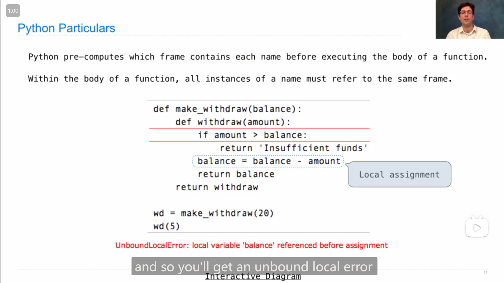{ loading=lazy }

**在函数体中，名称的所有实例都必须引用同一框架**

所以不能像图里面一样，一开始使用了母框架中的值--绑定了母框架中的变量，而后又在**未使用 `nonlocal` 语句**的情况下，进行赋值

### 4

另一种实现使用并更改母框架中的数据并且**不使用 `nonlocal` 语句**的方法

{ loading=lazy }

在母框架中使用可改变的数据类型，如列表或字典，然后在子函数中对其的元素进行更改，以达到需求

### 5

*参考透明度 (Referential Transparency)*

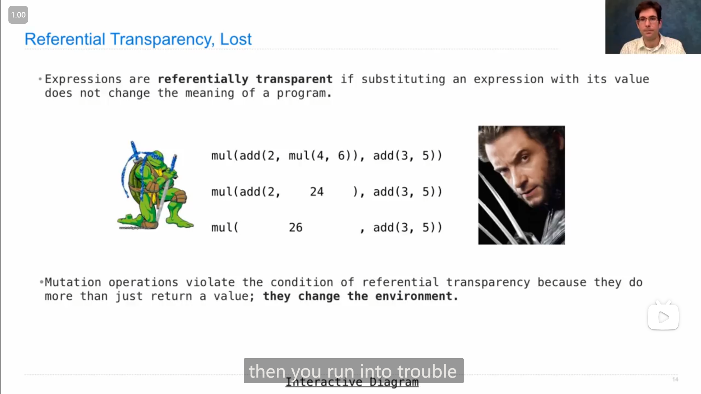{ loading=lazy }

这个概念好像是指，如果表达式是*参考透明(referentially transparent)*的，那么在**直接用与返回值相同的值替换表达式中的函数**后，能**得到和原来一样的结果**，即**不改变程序的意义(not change the meaning of a program)**

而*突变(mutation)*可能会破坏表达式的参考透明，因为**突变可以改变环境(中的属性/值)**，

比如

```python
def f(x):
    x = 4
    def g(y):
        def h(z):
            nonlocal x
            x = x + 1
            return x + y + z
        return h
    return g
a = f(1)
b = a(2)
total = b(3) + b(4)
```

运行出来，`total` 结果是22(10+12)

但如果将 `b(3)` 替换成 `10`

```python
def f(x):
    x = 4
    def g(y):
        def h(z):
            nonlocal x
            x = x + 1
            return x + y + z
        return h
    return g
a = f(1)
b = a(2)
total = 10 + b(4)
```

`total` 结果就变成了21(10+11)

这是由于，前者 `b(3)` 在调用 `h` 函数的时候，改动了母框架中的 `x` 的值，使得两处代码中 `b(4)` 在调用 `h` 函数时，使用的值不一样，因此`total` 结果就不一样

### 6

这节课最后，教授提到的一题

{ loading=lazy }

教授提到，在开始做这题时，可以寻找base cases是什么，

然后从输入示例中可以得到，base case是当其中一个为零的时候

---

开始写代码时，我是先注意到最后的 `return` 的语句的形式，再联想到教授说到的 *tree recursion* ，所以我感觉括号外应该是一个 `min` ，然后括号里面是比较两种递归返回的值哪个更小，所以我就暂且填上：

```python
def combo(a, b):
    if a == 0 or b == 0:
        return a + b
    elif ...:
        return combo(...)
    return min(combo(a // 10, b) * 10 + a % 10, combo(a, b // 10) * 10 + b % 10)
```

但是 `elif` 之后填什么一直没想到，(因为不知道有相同数字还有不同的数字要怎么分割怎么处理，以及a只剩一种数字的情况下，怎么判断放在b前面还是后面，感觉要分非常多种情况特别复杂，之后发现其实情况很简单...)

直到三天之后

开始继续思考这题时，我开始思考到达 base case 的最后一种情况，即 a 是个一位数，而 b 是 321，想到如果a和b某个数位相同，那么可以想*快速排序*一样将b分成两边去递归(但是好像对数字分割很难操作起来)，然后由分割就进一步开始想a和b的最后一位去比较(将b分割成前面和最后一位)，那么(要使得结果最小)应该是将大的那个放在最后，所以开始尝试编写代码

但是发现 `elif` 后填不上东西，所以打算先不按它提供的结构自己写：

```python
def combo(a, b):
    if a == 0 or b == 0:
        return a + b
    else:
        if a % 10 < b % 10:
            ...
        else:
            ...
    # elif ...:
    #     return combo(...)
    # return min(combo(a // 10, b) * 10 + a % 10, combo(a, b // 10) * 10 + b % 10)
```

==然后发现 `...` 处的代码就是最后 `return` 中之前写的代码，并且能实现对应的处理功能==，所以 `elif` 后应该考虑的是a b最后一位相同的情况，故

```python
def combo(a, b):
    """Return the smallest integer with all of the digits of a and b (in order).

    >>> combo(531, 432)    # 45312 contains both _531_ and 4_3_2.
    45312
    >>> combo(531, 4321)   # 45321 contains both _531_ and 4_321.
    45321
    >>> combo(1234, 9123)  # 91234 contains both _1234 and 9123_.
    91234
    >>> combo(0, 321)      # The number 0 has no digits, so 0 is not in the result.
    321
    """
    if a == 0 or b == 0:
        return a + b
    elif a % 10 == b % 10:
        return combo(a // 10, b // 10) * 10 + a % 10
    return min(combo(a // 10, b) * 10 + a % 10, combo(a, b // 10) * 10 + b % 10)
```

然后半信半疑地进行了测试，发现这竟然就是答案

最后总结反思了一下，递归还是**得牢记要假设函数能返回所需要的东西**(我感觉这样可能就更好能想到分割出最后一位)

## Lecture 16 Q&A

### 1

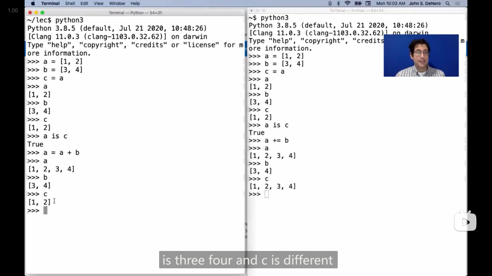{ loading=lazy }

列表的 `+=` 和 `=` 的一些区别，

图中左侧，`a = a + b` 可以理解成，**先是 `a + b` 得到一个新的列表，然后将变量名 `a` 绑定到这个新的列表上**，所以 `c` 绑定的原列表没有被改变

而右侧，`a += b` 可以类比成 `a.extend(b)` ，是**对 `a` 指向的列表本身进行了修改**，所以通过 `c` 也能看到列表改变了

## Lecture 17 Iterations

### 1

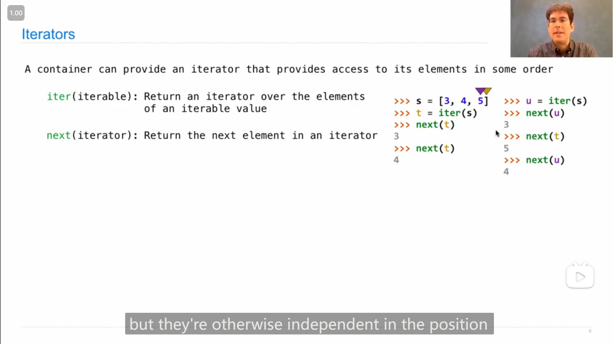{ loading=lazy }

-   `iter()` 传入一个可以迭代的数据(比如列表)，然后返回一个对应的迭代器(我感觉应该是一个 `iter` 类型的构造函数)，并且迭代器的初始的位置位于数据(如列表)的起始端(第一个元素之前)，并且如果两次对同一个列表调用 `iter()` 函数，返回的是两个不同的迭代器，即

    ```python
    >>> s = [3, 4, 5]
    >>> t = iter(s)
    >>> next(t)
    3
    >>> next(t)
    4
    >>> u = iter(s)
    >>> next(u)
    3
    >>> next(t)
    5
    >>> next(u)
    4
    ```

-   `next()` **传入一个迭代器**(传入可迭代数据会报错)，返回迭代器的后一个元素，并向前移动一个位置，即下次再调用 `next()` 并传入同一个迭代器，返回的会是另一个元素

### 2

如果用 `list()` 去传入一个迭代器，那么会返回一个列表包含迭代器之后的所有元素，**不包含之前的，并且会将迭代器的位置移动到列表的末端**

```python
>>> s = [[1, 2], 3, 4, 5]
>>> s
[[1, 2], 3, 4, 5]
>>> t = iter(s)
>>> next(t)
[1, 2]
>>> next(t)
3
>>> list(t)
[4, 5]
>>> next(t)
Traceback (most recent call last):
  File "<stdin>", line 1, in <module>
StopIteration
```

### 3

>   A dictionary, its keys, its values, and its items are all iterable values

`dict.keys` `dict.values` `dict.items` 都是可以迭代的对象

-   如果对 `iter()` 直接传入一个字典，返回的迭代器对应的是keys的迭代器
-   对 `next()` 传入 `dict.items` 对应的迭代器，返回的是由字典的key和对应的value组成的二元元组

```python
>>> d = {'one': 1, 'two': 2, 'three': 3}
>>> d['zero'] = 0
>>> k = iter(d.keys())  # or iter(d)
>>> next(k)
'one'
>>> next(k)
'two'
>>> next(k)
'three'
>>> next(k)
'zero'
>>> v = iter(d.values())
>>> next(v)
1
>>> next(v)
2
>>> next(v)
3
>>> next(v)
0
>>> i = iter(d.items())
>>> next(i)
('one', 1)
>>> next(i)
('two', 2)
>>> next(i)
('three', 3)
>>> next(i)
('zero', 0)
```

### 4

如果改变一个**字典**的大小(经过测试，给字典添加元素，不会使得之前构建的迭代器失效)，比如添加一组新的键值对，或者删去，会使得之前构建的迭代器不能使用(keys, values, items都不能)

```python
>>> d = {'one': 1, 'two': 2}
>>> k = iter(d)
>>> next(k)
'one'
>>> d['zero'] = 0
>>> next(k)
Traceback (most recent call last):
  File "<stdin>", line 1, in <module>
RuntimeError: dictionary changed size during iteration
>>> d
{'one': 1, 'two': 2, 'zero': 0}
>>> k = iter(d)
>>> next(k)
'one'
>>> next(k)
'two'
>>> d['zero'] = 5
>>> next(k)
'zero'
```

而如果只是**修改已存在的键值对的值**，不会使得之前构建的迭代器失效(values, items对应的迭代器在修改了字典之后连接的会是修改之后的值)

### 5

`for` 语句也可以使用迭代器，但只是从迭代器当前的位置开始，并且会将迭代器的位置移动到最后，(感觉跟第二点很相像)

```python
>>> r = range(3, 6)
>>> ri = iter(r)
>>> next(ri)
3
>>> for i in ri:
...     print(i)
...
4
5
>>> for i in ri:
...     print(i)
...
>>> next(ri)
Traceback (most recent call last):
  File "<stdin>", line 1, in <module>
StopIteration
```

### 6

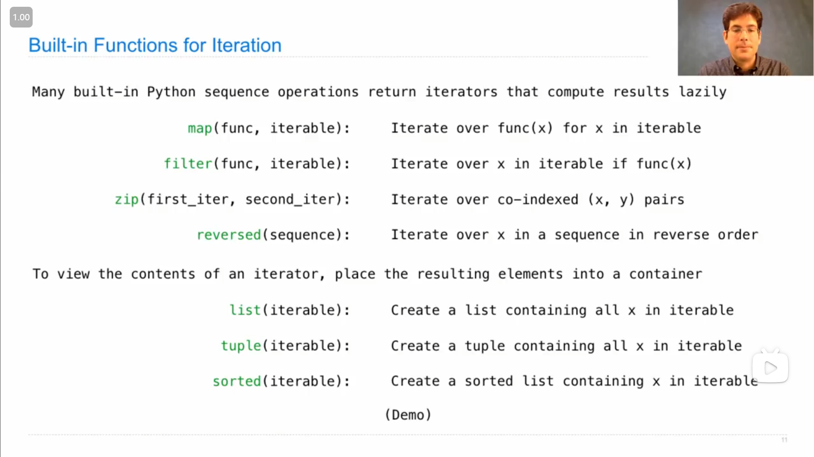{ loading=lazy }

一些会返回迭代器的 built-in functions

**==上图中的 `iterable` 也包括迭代器，所以迭代器也算作可迭代对象==**

**John的个Demo**

1.   >   ```python
     >   >>> bcd = ['b', 'c', 'd']
     >   >>> [x.upper() for x in bcd]
     >   ['B', 'C', 'D']
     >   >>> map(lambda x: x.upper(), bcd)
     >   <map object at 0x000002597B19F730>
     >   >>> m = map(lambda x: x.upper(), bcd)
     >   >>> next(m)
     >   'B'
     >   >>> next(m)
     >   'C'
     >   >>> next(m)
     >   'D'
     >   >>> next(m)
     >   Traceback (most recent call last):
     >     File "<stdin>", line 1, in <module>
     >   StopIteration
     >   >>>
     >   ```

     这是一个简单展示的利用 `map` 来获取 一个将传入函数套用在迭代出来的数据的迭代器 的例子

2.   >   >   ```python
     >   >   def double(x):
     >   >       print('**', x, '=>', 2 * x, '**')
     >   >       return 2 * x
     >   >   ```
     >
     >   ```python
     >   >>> m = map(double, [3, 5, 7])
     >   >>> next(m)
     >   ** 3 => 6 **
     >   6
     >   >>> next(m)
     >   ** 5 => 10 **
     >   10
     >   >>> next(m)
     >   ** 7 => 14 **
     >   14
     >   >>>
     >   ```

     在这个例子中，可以注意到，map返回的迭代器，**并不是直接把 传入的函数对可迭代对象的每个数据的返回值存在迭代器中，而是将可迭代对象和传入的函数绑定在同一个迭代器里，在迭代时就用==迭代器迭代返回的数据==去调用函数**(所以才会运行 `print` 函数，即打印出东西)

3.   >   ```python
     >   >>> m = map(double, range(3, 7))
     >   >>> f = lambda y: y >= 10
     >   >>> t = filter(f, m)
     >   >>> next(t)
     >   ** 3 => 6 **
     >   ** 4 => 8 **
     >   ** 5 => 10 **
     >   10
     >   >>> next(t)
     >   ** 6 => 12 **
     >   12
     >   >>> list(t)
     >   []
     >   >>> list(filter(f, map(double, range(3, 7))))
     >   ** 3 => 6 **
     >   ** 4 => 8 **
     >   ** 5 => 10 **
     >   ** 6 => 12 **
     >   [10, 12]
     >   >>>
     >   ```

     **==这个例子==**中，展示了 `filter` ，和 `map` 很类似，也是**将迭代对象和函数绑定到一起(而不是直接取目标的返回值，也没有保存迭代对象的值)**，所以在迭代 ==`filter` 返回的迭代器==时，是==先迭代它的迭代对象==，==再将迭代返回值放入函数判断(不符合就继续迭代)==(所以 `double` 内部的print语句才会执行)，==然后返回符合(判断)函数的值==。从这个例子中可以很清晰地看到这一点

4.   >   ```python
     >   >>> t = [1, 2, 3, 2, 1]
     >   >>> t
     >   [1, 2, 3, 2, 1]
     >   >>> reversed(t)
     >   <list_reverseiterator object at 0x000002597B1D12D0>
     >   >>> reversed(t) == t
     >   False
     >   >>> list(reversed(t))
     >   [1, 2, 3, 2, 1]
     >   >>> list(reversed(t)) == t
     >   True
     >   >>>
     >   ```

     这个例子展现了 `reversed` 返回的是一个迭代器(所以不会等于原来的列表)

5.   >   ```python
     >   >>> d = {'a': 1, 'b': 2}
     >   >>> d
     >   {'a': 1, 'b': 2}
     >   >>> items = iter(d.items())
     >   >>> next(items)
     >   ('a', 1)
     >   >>> next(items)
     >   ('b', 2)
     >   >>> items = zip(d.keys(), d.values())
     >   >>> next(items)
     >   ('a', 1)
     >   >>> next(items)
     >   ('b', 2)
     >   >>>
     >   ```
     >
     >   { loading=lazy }

     这个例子中，字典键值对的顺序和John的demo有点不一样，应该是由于python版本不同的原因

### 7

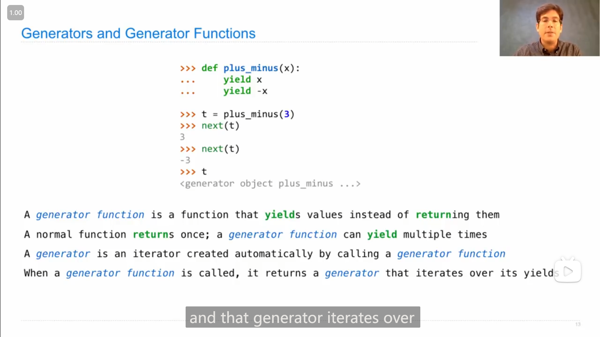{ loading=lazy }

*生成器和生成器函数 Generators and Generator Functions*

使用 `yield` 而不是 `return` 关键字来返回值的函数，就是*生成器函数*，而*生成器函数*会返回一个*生成器*，*生成器*是一个迭代器，迭代时会按照函数中 `yield` 语句的顺序来返回值，参考上图

John的一个demo

>   >   ```python
>   >   def evens(start, end):
>   >       even = start + (start % 2)
>   >       while even < end:
>   >           yield even
>   >           even += 2
>   >   ```
>
>   ```python
>   >>> t = evens(2, 10)
>   >>> t
>   <generator object evens at 0x000002597B170580>
>   >>> next(t)
>   2
>   >>> next(t)
>   4
>   >>> next(t)
>   6
>   >>> next(t)
>   8
>   >>> next(t)
>   Traceback (most recent call last):
>     File "<stdin>", line 1, in <module>
>   StopIteration
>   >>> list(evens(1, 10))
>   [2, 4, 6, 8]
>   >>>
>   ```

John的解释是，当一个 *Generator Function* 被调用时，函数里面的语句不会被立即执行，而是直接返回一个 *Generator* ，而在 *generator* 每次迭代时，函数内的语句才会被执行，且只执行到下一个 `yield` 处就暂停执行，并返回值

### 8

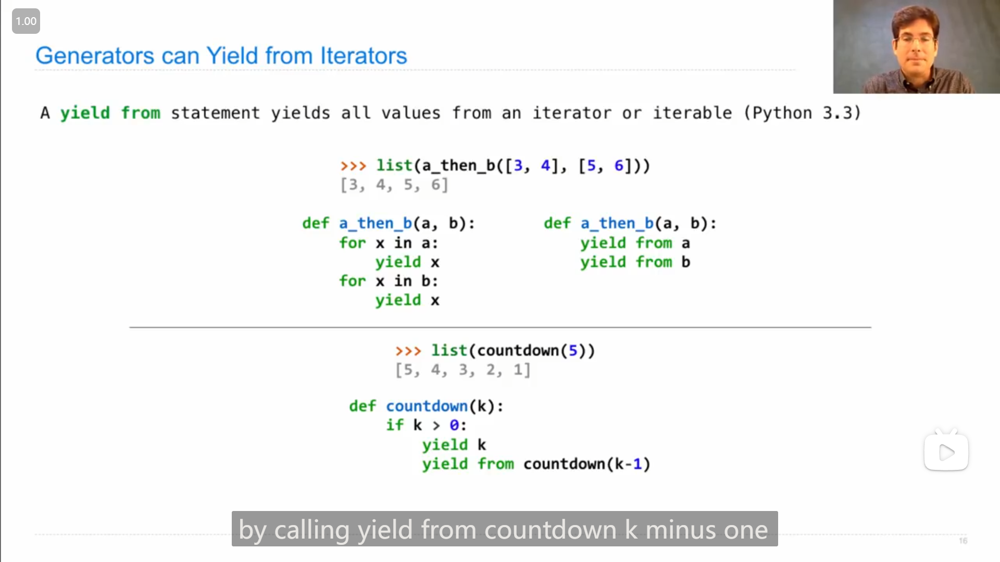{ loading=lazy }

**`yield from` 语句**，后面可以是 迭代器 或者 可迭代对象 (如果是迭代器估计会修改迭代器的位置)

上图中还展示了生成器函数的一种类似于递归的写法

>   ```python
>   def countdown(k):
>       if k > 0:
>           yield k
>           for x in countdown(k - 1):
>               yield x
>   ```
>
>   更简洁的写法就是
>
>   ```python
>   def countdown(k):
>       if k > 0:
>           yield k
>           yield from countdown(k - 1)
>   ```

### 9

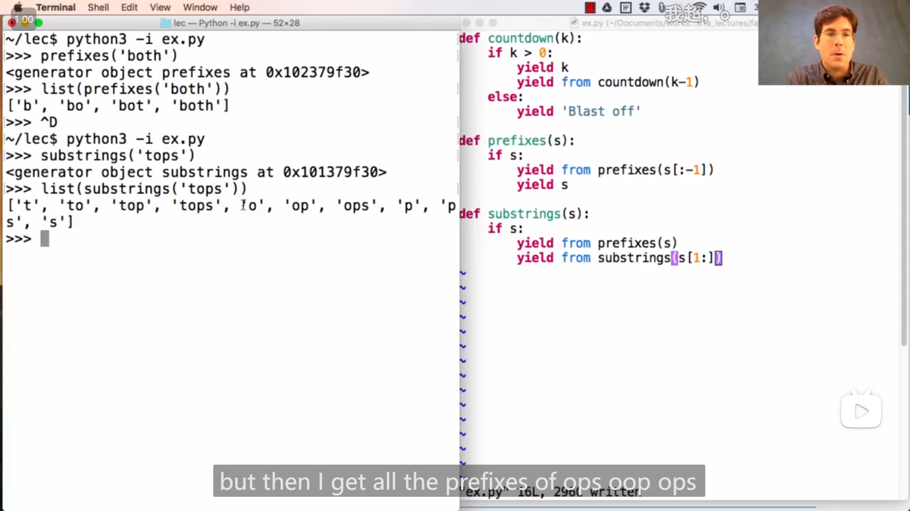{ loading=lazy }

John的一个神奇的生成器函数的demo，感觉很像递归的感觉，并且多个生成器函数组合使用可以产生神奇的效果

## Lecture 17 Q&A

