>   *Notes of Courses* on gitee.io
>
>   [CS61A - My Pamphlet (gitee.io)](https://ronald-luo.gitee.io/my-pamphlet_-notes-of-courses/Notes of Courses/CS61A/)

!!! info

    [CS 61A Fall 2020 (berkeley.edu)](https://inst.eecs.berkeley.edu/~cs61a/fa20/)

## Lab 0

### 1

è¿è¡Œhw或者lab任务的对应命令时，都加上 `--local` ，就åªåœ¨æœ¬åœ°è¿è¡Œï¼Œä¸ä¼šä¸Šä¼ ç„¶åè¦æ±‚输入邮箱，如

```bash
python ok [-q xxx] [-u] --local
```

## Lecture 2 Functions

### 1

å˜é‡å¯ä»¥ “指呆一个函数

{ loading=lazy }

### 2

cs61a中使用的å¯ä»¥æ˜¾ç¤ºpython程åºä¸­ environment 〠frame 等信æ¯çš„在线网站：

[Online Python Tutor - Composing Programs - Python 3](https://pythontutor.com/cp/composingprograms.html#mode=edit)

>   John DeNero 编写的cs61açš„é…套英文åŸç‰ˆæ•™æ：
>
>   [Composing Programs](https://www.composingprograms.com/)
>
>   在github上å‘ç°çš„其对应仓库：
>
>   [DestructHub/composing-programs: Annotation and code about SICP Python (github.com)](https://github.com/DestructHub/composing-programs)
>
>   github上å‘ç°çš„é官方的还在翻译(23/7/21å‘ç°)的中文版的仓库：
>
>   [csfive/composing-programs-zh: 🚧 CS61A æ•™æ《Composing Programs》å³ã€Šè®¡ç®—机程åºçš„æ„造ä¸è§£é‡Šã€‹Python 版本的中文翻译 (github.com)](https://github.com/csfive/composing-programs-zh)
>
>   其对应网页：
>
>   [CSfive | CSfive](https://sicp.csfive.works/)

### 3

调用函数时，会创建一个新的frame，且frameçš„å字为函数本身的åå­—(å³åˆ›å»ºæ—¶çš„åå­— (如æœæ˜¯lambda匿å函数则 没有åå­—/å字为lambda))，

{ loading=lazy }

å³å¦‚æœç”¨æŸä¸ªå˜é‡æŒ‡å‘了函数，在用å˜é‡è°ƒç”¨å‡½æ•°çš„时，创建的frameåå­—ä»ä¸ºåŸå‡½æ•°å

{ loading=lazy }

### 4

{ loading=lazy }

python中，赋值å¯ä»¥åŒæ—¶å¯¹ä¸¤ä¸ªå˜é‡è¿›è¡Œï¼Œä¼šä½¿äº¤æ¢å˜é‡çš„值等æ“作更方便，如

```python
a, b = b, a
```

## Lecture 2 Q&A

### 1

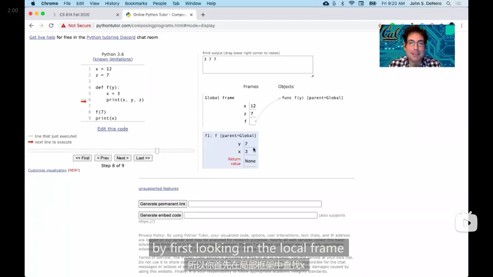{ loading=lazy }

在哪个frame中定义(define)的函数，其parent就是哪个frame，除了Global frame其他都有parent

## HW 01

### 1

Q3，å¯ä»¥ç”¨æ€»çš„å‡å»æœ€å¤§çš„，得到最å°çš„两个

??? note "code"

    ```python
    def two_of_three(x, y, z):
        return x * x + y * y + z * z - max(x, y, z) ** 2
    ```

### 2

Q5

```python
def with_if_function():
    """
    >>> result = with_if_function()
    42
    47
    >>> print(result)
    None
    """
    return if_function(cond(), true_func(), false_func())
```

ç”±äºåœ¨ `return` 语å¥ä¸­ï¼Œå¡«å…¥çš„时调用的函数( `true_func()` å’Œ `false_func()` )，è¿è¡Œçš„顺åºæ˜¯ 先进行 `true_func()` å’Œ `false_func()` 两个函数的调用，å†å°†ä»–们的返å›å€¼ä¼ é€’ç»™ `if_function()` 中，所以(ç”±äºä¸¤ä¸ªå‡½æ•°è¢«è°ƒç”¨äº†) 42å’Œ47都会输出

```python
def with_if_statement():
    """
    >>> result = with_if_statement()
    47
    >>> print(result)
    None
    """
    if cond():
        return true_func()
    else:
        return false_func()
```

而在这个函数中，则åªä¼šè°ƒç”¨ `true_func()` å’Œ `false_func()` 其中一个函数，因此åªä¼šè¾“出一个数字

??? note "code"

    ```python
    def if_function(condition, true_result, false_result):
        """Return true_result if condition is a true value, and
        false_result otherwise.
    
        >>> if_function(True, 2, 3)
        2
        >>> if_function(False, 2, 3)
        3
        >>> if_function(3==2, 3+2, 3-2)
        1
        >>> if_function(3>2, 3+2, 3-2)
        5
        """
        if condition:
            return true_result
        else:
            return false_result


​    
​    def with_if_statement():
​        """
​        >>> result = with_if_statement()
​        47
​        >>> print(result)
​        None
​        """
​        if cond():
​            return true_func()
​        else:
​            return false_func()


​    
​    def with_if_function():
​        """
​        >>> result = with_if_function()
​        42
​        47
​        >>> print(result)
​        None
​        """
​        return if_function(cond(), true_func(), false_func())


​    
​    def cond():
​        "*** YOUR CODE HERE ***"
​        return False


​    
​    def true_func():
​        "*** YOUR CODE HERE ***"
​        print(42)


​    
​    def false_func():
​        "*** YOUR CODE HERE ***"
​        print(47)
​    ```

## Homework 1 Hints

### 1

Q3 的两ç§æ€è·¯ï¼š

1.   全部的结æœå–最å°
2.   全部平方和å‡å»æœ€å¤§å¹³æ–¹

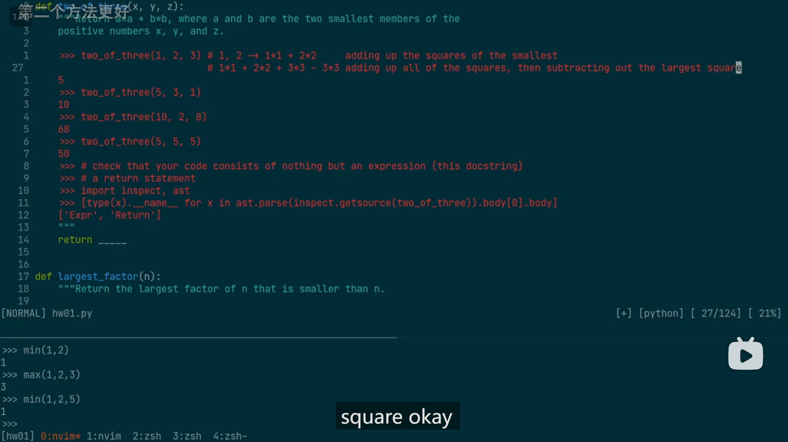

## Lecture 3 Control

### 1

{ loading=lazy }

`print()` å¯ä»¥ä¼ å…¥å¤šä¸ªå‚数，打å°æ—¶æ¯ä¸ªå‚数之间会空一个空格

### 2

{ loading=lazy }

-   在 a函数 å‚数调用的ä½ç½®å¡«å…¥ 被调用的b函数 ，å®é™…上使先è¿è¡Œ b函数 ，å†å°†bçš„è¿”å›å€¼ä¼ å…¥ a函数

-   `print()` çš„è¿”å›å€¼æ˜¯ `None` 

补充：

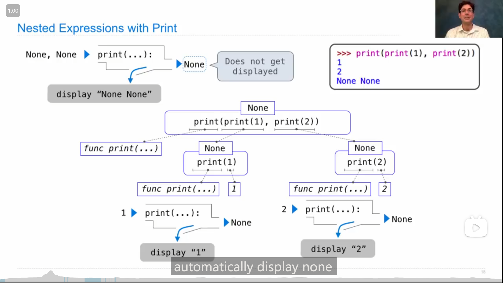{ loading=lazy }

### 3

!!! quote

    An environment is a sequence of frames.
    
    -   The global frame alone
    -   A local, then the global frame

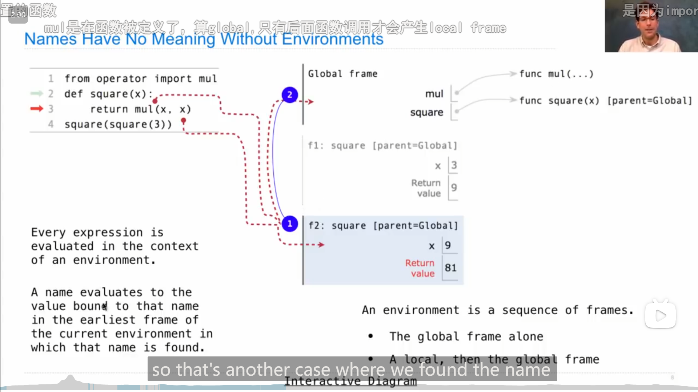{ loading=lazy }

{ loading=lazy }

å˜é‡å在查找对应的值的时候，会ä»å½“å‰çš„ frame ä¾æ¬¡å‘上(parent frame) 查找值，并绑定最早找到的值，如图中的 `square` 先在f1中查找(如æœf1没有å†åœ¨Global frame中查找)，并绑定了4 (如æœf1中没有 `square` 对应的值，则会绑定到global frame中的func square)

==此外==，

图中也å¯ä»¥å‘ç°ï¼Œframeçš„parent是根æ®ä»£ç çš„结æ„æ¥ç¡®å®šçš„，而ä¸æ˜¯æ ¹æ®è°ƒç”¨çš„关系æ¥ç¡®å®šçš„，如 第一张图中 `square(square(3))` 里é¢å’Œå¤–é¢çš„ `square` çš„ parent 都是 global frame

>   跟 Lecture 2 Q&A 中一样

### 4

{ loading=lazy }

-   ```bash
    python -i xxx.py
    ```

    å¯ä»¥å°† `xxx.py` 文件中的代ç å¼•å…¥å‘½ä»¤è¡Œæˆ–者终端

-   命令行/终端中使用python时，++ctrl+d++ `^D` å¯ä»¥æ¸…空界é¢

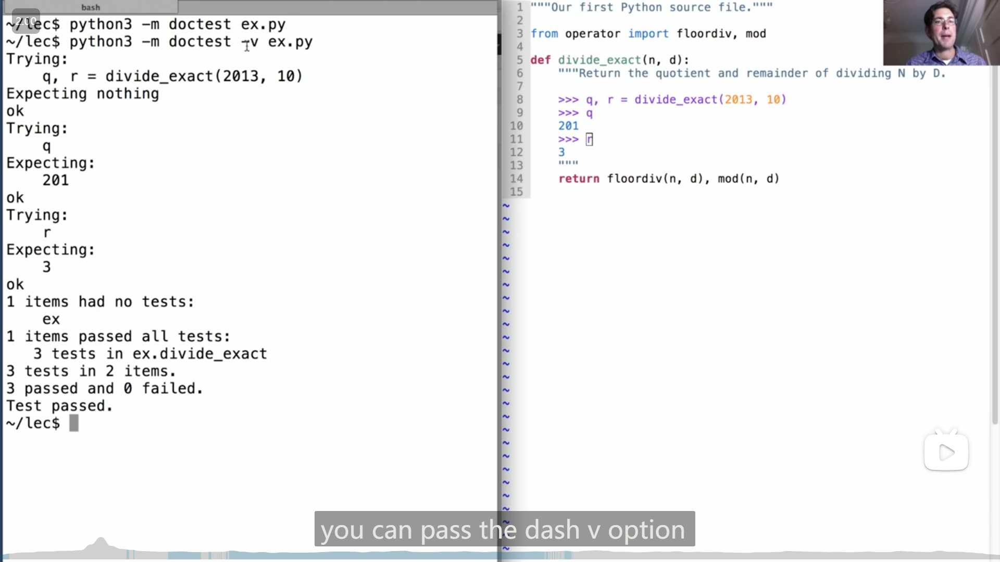{ loading=lazy }

-   ```bash
    python -m doctest [-v] xxx.py
    ```

    å¯ä»¥è¿è¡Œ `xxx.py` 中函数说æ˜è¯­å¥éƒ¨åˆ†çš„代ç (用äºæµ‹è¯•å‡½æ•°èƒ½å¦è¾“入正确预期结æœ)，如æœæŠ¥é”™ä¼šæ˜¾ç¤ºå‡ºæŠ¥é”™ä¿¡æ¯ï¼Œå¦‚æœä¸æŠ¥é”™åˆ™ä¸æ˜¾ç¤ºä¿¡æ¯ 而正常显示下一行(如æœæ­»å¾ªç¯å°±ä¸€ç›´ä¸æ˜¾ç¤ºä¸‹ä¸€è¡Œ)，

    `-v` 选项是ä¸æŠ¥é”™ä¹Ÿèƒ½æ˜¾ç¤ºæ¯ä¸ªè¾“入的测试结æœï¼Œå¦‚上图

### 5

真值为**å‡**的值： `False` , `0` , `''` , `None` 等等

其余其他值基本上都为真

### 6

{ loading=lazy }

è€å¸ˆå†™åˆ†è§£è´¨å› æ•°çš„æ€è·¯å€¼å¾—学习：

将问题分解æˆä¸¤æ­¥ï¼š

1.   一个数的最å°å› æ•°(因为è¦æ±‚è¦å‡åº)
2.   å†å¾ªç¯æ‰¾æœ€å°å› æ•°ï¼Œä»è€Œè·å¾—å‡åºçš„分解质因数

并且将找最å°çš„因数这个功能å•ç‹¬å†™æˆä¸€ä¸ªå‡½æ•°ï¼Œè¿™æ ·çœ‹èµ·æ¥å°±å¾ˆæ¸…æ™°

```python
def prime_factors(n):
    """Print the prime factors of n in non-decreasing order.
    
    >>> prime_factors(8)
    2
    2
    2
    >>> prime_factors(9)
    3
    3
    >>> prime_factors(10)
    2
    5
    >>> prime_factors(11)
    11
    >>> prime_factors(12)
    2
    2
    3
    >>> prime_factors(858)
    2
    3
    11
    13
    """
    while n > 1:
        k = smallest_prime_factor(n)
        n = n // k
        print(k)
        
def smallest_prime_factor(n):
    """Return the smallest k > 1 that evenly divides n."""
    k = 2
    while n % k != 0:
        k = k + 1
    return k
```

## Lecture 3 Q&A

### 1

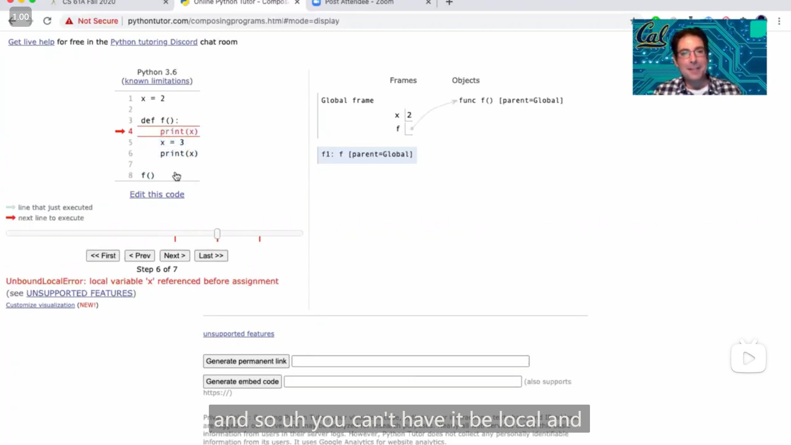{ loading=lazy }

ç”±äº**åŒä¸€ä¸ªå‡½æ•°å†…çš„åŒä¸€ä¸ªå˜é‡å必须指å‘åŒä¸€ä¸ªæ¡†æ¶ä¸‹çš„东西**，所以

```python
x = 2

def f():
    print(x)
    x = 3
    print(x)
    
f()
```

`x = 3` 这行已ç»å¯¹local框æ¶ä¸‹çš„x赋值，所以 f 函数内的x就都åªèƒ½ç»‘定local框æ¶ä¸‹çš„值，ä¸èƒ½ç»‘定æ¯æ¡†æ¶ä¸‹çš„值

而第一个 `print(x)` 在执行时，(local框æ¶ä¸‹çš„)å˜é‡x还并未赋值，所以会报错，

如æœå»æ‰ `x = 3` 那么程åºå°±ä¸ä¼šæŠ¥é”™

==[Lecture 16](https://ronaldln.github.io/MyPamphlet/Notes%20of%20Courses/CS61A/#3_12)中也说到了这一点==

## Lecture 4 Higher-Order Functions


## Lecture 10 Containers

### 1

`exec()` 函数å¯ä»¥æ‰§è¡Œå­—符串中的语å¥ï¼Œå¦‚

```python
exec("curry = lambda f: lambda x: lambda y: f(x, y)")
```

å¯ä»¥è®© `curry` å˜é‡æŒ‡å‘一个匿å函数

{ loading=lazy }

### 2

例

```python
for _ in range(3):
    ...
```

å¯ä»¥ç”¨ `_` å˜é‡è¡¨ç¤º `for` 循ç¯ä¸­æ‰§è¡Œçš„语å¥ä¸è¿­ä»£çš„å˜é‡æ— å…³

### 3

string字符串的元素也是字符串，list的元素就是元素，å³æœ‰

```python
>>> str = "hello"
>>> str[3][0][0]
'l'
```

### 4

{ loading=lazy }

记忆技巧 *“下标â€* 对应元素之å‰ï¼Œ

对有åºç»“æ„切片也适用，其中的负数也适用，如

```python
>>> l = list(range(5))
>>> l
[0, 1, 2, 3, 4]
>>> l[1:-1]
[1, 2, 3]
```

### 5

列表æ¨å¯¼å¼(list comprehension)å¯ä»¥ç”¨ `if` ：

```python
>>> l2 = [x for x in [0, 1, 2, 5, 6] if x % 3 == 0]
>>> l2
[0, 6]
```

### 6

如æœåˆ—表有å­åˆ—表，且元素个数都固定，那么 `for` å¯ä»¥ç›´æ¥è·å–å­åˆ—表的元素/unpackå­åˆ—表，如å­åˆ—表都å«ä¸¤ä¸ªå…ƒç´ ï¼š

{ loading=lazy }

## Lecture 10 Q&A

### 1

递å¢çš„递归写阶乘：

```python
def fact(n):
    return fact_helper(n, 1, 1)

def fact_helper(n, k, result):
    """Computes k * (k + 1) * (k + 2) * ... * n
    by accumulating the result
    """
    if n == k:
        return k * result
    else:
        return fact_helper(n, k + 1, k * result)
```

{ loading=lazy }

>   or
>
>   ```python
>   def fact(n, k=1, result=1):
>       """Computes k * (k + 1) * (k + 2) * ... * n
>       by accumulating the result
>       """
>       if n == k:
>           return k * result
>       else:
>           return fact(n, k + 1, k * result)
>   ```

è¿™ç§(递å¢çš„递归)æ›´åƒå¾ªç¯è¯­å¥

(也å¯ä»¥å°†helper写入函数内部)

```python
def fact(n):
    def helper(k, result):
        if k == n:
            return k * result
        else:
            return helper(k + 1, k * result)
    return helper(1, 1)
```

or

```python
def fact(n):
    def helper(k):
        if k == n:
            return k
        else:
            return k * helper(k + 1)
    return helper(1)
```

## Lab 04

lab04中的Q4-Q6 在æŒæ¡äº† *å‡æƒ³å‡½æ•°èƒ½è¿”å›æ‰€éœ€è¦è¿”å›çš„东西(å³å‡æƒ³è¿”å›çš„东西是已知的)* 的诀çª(在lecture12中)之å，åšçš„很顺畅。

1.   å…ˆå‡æƒ³å‡½æ•°èƒ½è¿”å›æ‰€éœ€çš„东西/值
2.   å†æƒ³å¦‚何把情况分解æˆå¦ä¸€ä¸ªæˆ–几个差ä¸å¤š(å½¢å¼ä¸€æ ·)但简å•äº†ä¸€ç‚¹çš„情况(有点类似äºåŠ¨æ€è§„划的找递æ¨å¼)，如Q4中一般情况å¯ä»¥åˆ†æˆä¸¤ä¸ªè¡Œ/列å‡ä¸€çš„情况(å³å‘上或å‘å³èµ°ä¸€æ­¥)
3.   å†æƒ³ “基本情况†(最简å•/特殊的情况(作为递归的终止情况))
4.   最å调整一般情况的返å›çš„值

??? note "code"

    Q4
    
    ```python
    def paths(m, n):
        """Return the number of paths from one corner of an
        M by N grid to the opposite corner.
    
        >>> paths(2, 2)
        2
        >>> paths(5, 7)
        210
        >>> paths(117, 1)
        1
        >>> paths(1, 157)
        1
        """
        "*** YOUR CODE HERE ***"
        if m == 1 or n == 1:
            return 1
        else:
            return paths(m - 1, n) + paths(m, n - 1)
    ```
    
    Q5
    
    ```python
    def max_subseq(n, t):
        """
        Return the maximum subsequence of length at most t that can be found in the given number n.
        For example, for n = 20125 and t = 3, we have that the subsequences are
            2
            0
            1
            2
            5
            20
            21
            22
            25
            01
            02
            05
            12
            15
            25
            201
            202
            205
            212
            215
            225
            012
            015
            025
            125
        and of these, the maxumum number is 225, so our answer is 225.
    
        >>> max_subseq(20125, 3)
        225
        >>> max_subseq(20125, 5)
        20125
        >>> max_subseq(20125, 6) # note that 20125 == 020125
        20125
        >>> max_subseq(12345, 3)
        345
        >>> max_subseq(12345, 0) # 0 is of length 0
        0
        >>> max_subseq(12345, 1)
        5
        """
        "*** YOUR CODE HERE ***"
        if t == 0:
            return 0
        elif n < 10:
            return n
        else:
            return max(max_subseq(n // 10, t - 1) * 10 + n % 10, max_subseq(n // 10, t))
    ```
    
    Q6
    
    ```python
    def add_chars(w1, w2):
        """
        Return a string containing the characters you need to add to w1 to get w2.
    
        You may assume that w1 is a subsequence of w2.
    
        >>> add_chars("owl", "howl")
        'h'
        >>> add_chars("want", "wanton")
        'on'
        >>> add_chars("rat", "radiate")
        'diae'
        >>> add_chars("a", "prepare")
        'prepre'
        >>> add_chars("resin", "recursion")
        'curo'
        >>> add_chars("fin", "effusion")
        'efuso'
        >>> add_chars("coy", "cacophony")
        'acphon'
        >>> from construct_check import check
        >>> # ban iteration and sets
        >>> check(LAB_SOURCE_FILE, 'add_chars',
        ...       ['For', 'While', 'Set', 'SetComp']) # Must use recursion
        True
        """
        "*** YOUR CODE HERE ***"
        if not w1:
            return w2
        elif w1[0] == w2[0]:
            return add_chars(w1[1:], w2[1:])
        else:
            return w2[0] + add_chars(w1, w2[1:])
    ```

## Lecture 11 Data Abstraction

### 1

**"Unpacking" a list**

{ loading=lazy }

### 2

抽象æ€æƒ³

{ loading=lazy }

{ loading=lazy }

>   **==... you should know that when you're writing one part of a large program, that it should use the level abstraction appropriate to what you're trying to do,==**
>
>   **==and the higher you stay up, without crossing of these boundaries, the easier it will be to change your program==**

è¦ *å‘下解æ„*，和 *å‘上抽象*

### 3

{ loading=lazy }

å­—å…¸å¯ä»¥é€šè¿‡ç‰¹å®šçš„列表æ„造( 二元元组 组æˆçš„列表)

### 4

字典也有æ¨å¯¼å¼

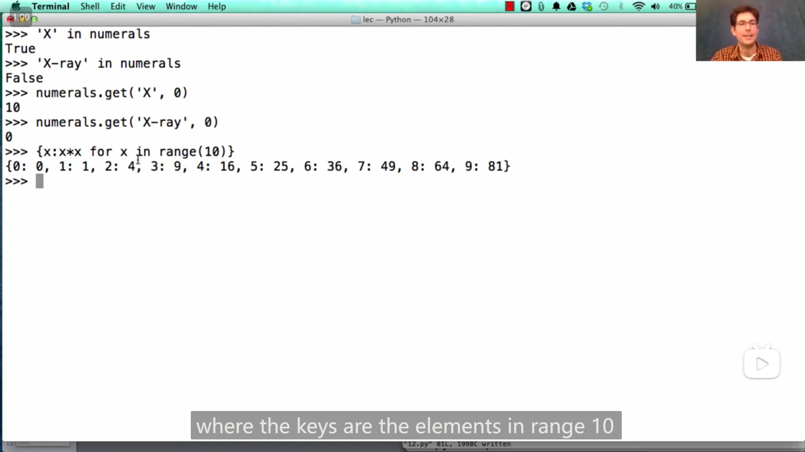{ loading=lazy }

## Lecture 11 Q&A

### 1

抽象å¯ä»¥ä½¿å¾—修改æŸä¸€å±‚(layer)代ç æ—¶å¸¦æ¥çš„冲击/å½±å“被隔离(isolate the impact)，有时å¯ä»¥ä½¿å¾—修改所产生的影å“åªåœ¨è¿™ä¸€å±‚上。

冲击被隔离的例å­ï¼špython dictionary的底层代ç ç»å¸¸æ”¹å˜ï¼Œä½†å¹¶ä¸å½±å“python中的使用

### 2

添加判断功能å¯ä»¥è¿™æ ·è®¾è®¡

{ loading=lazy }

## Project Cats

!!! info

    需è¦äº†è§£ Lec 12 Trees 中的数æ®æŠ½è±¡(data abstraction)部分的内容

### 1

Problem 5 中使用 `min()` (åºåˆ—èšåˆå‡½æ•°)会很方便，

但è¦æ³¨æ„ 使用 `key` å‚数传入判断函数时，需è¦å†™ä¸Š `key=` 

### 2

Problem 9 中å°è¯•äº†åˆ—表æ¨å¯¼å¼çš„嵌套使用

```python
def time_per_word(times_per_player, words):
    """Given timing data, return a game data abstraction, which contains a list
    of words and the amount of time each player took to type each word.

    Arguments:
        times_per_player: A list of lists of timestamps including the time
                          the player started typing, followed by the time
                          the player finished typing each word.
        words: a list of words, in the order they are typed.
    """
    # BEGIN PROBLEM 9
    "*** YOUR CODE HERE ***"
    times = [[timestamp[i + 1] - timestamp[i] for i in range(len(timestamp) - 1)] for timestamp in times_per_player]
    return game(words, times)
    # END PROBLEM 9
```

### 3

Problem 10 中如æœè¦æŠŠä¸€ä¸ªstring加入(使用 `+` è¿ç®—符)到list中，ä¸èƒ½ç›´æ¥*加*string (å¦åˆ™ä¼šæŠŠåªå«æœ‰å•ä¸ªå­—æ¯çš„string作为元素加入到列表中)，应该 `+ [str]` 或 `+= [str]` (创建一个å«è¯¥å­—符串的列表)

### 4

Problem 6

看了hint视频å，将åŸæœ¬éœ€è¦å€ŸåŠ©å†…部helper函数的写法改æˆäº†ä¸éœ€è¦helperçš„ï¼Œå…³é”®ä¹‹å¤„åœ¨äº æƒ³åˆ°äº†limitå¯ä»¥ç”¨äºè®¡æ•°(æ‹¿æ¥å‡)

```python
def shifty_shifts(start, goal, limit):
    """A diff function for autocorrect that determines how many letters
    in START need to be substituted to create GOAL, then adds the difference in
    their lengths.
    """
    # BEGIN PROBLEM 6
    # assert False, 'Remove this line'
    # def helper(start, goal, count):
    #     if count > limit:
    #         return count
    #     # elif not start:
    #     #     return count + len(goal)
    #     # elif not goal:
    #     #     return count + len(start)
    #     elif not start or not goal:
    #         return count + len(start + goal)
    #     else:
    #         return helper(start[1:], goal[1:], count if start[0] == goal[0] else count + 1)
    # return helper(start, goal, 0)

    # if limit == 0:
    #     return 1
    if limit < 0:
        return 0
    elif not start or not goal:
        return len(start + goal)
    elif start[0] == goal[0]:
        return shifty_shifts(start[1:], goal[1:], limit)
    else:
        return 1 + shifty_shifts(start[1:], goal[1:], limit - 1)
    # END PROBLEM 6
```

>   下图有一点å¯å‘作用(对problem 7如何找到*é™è§£*的方法也有一定帮助)
>
>   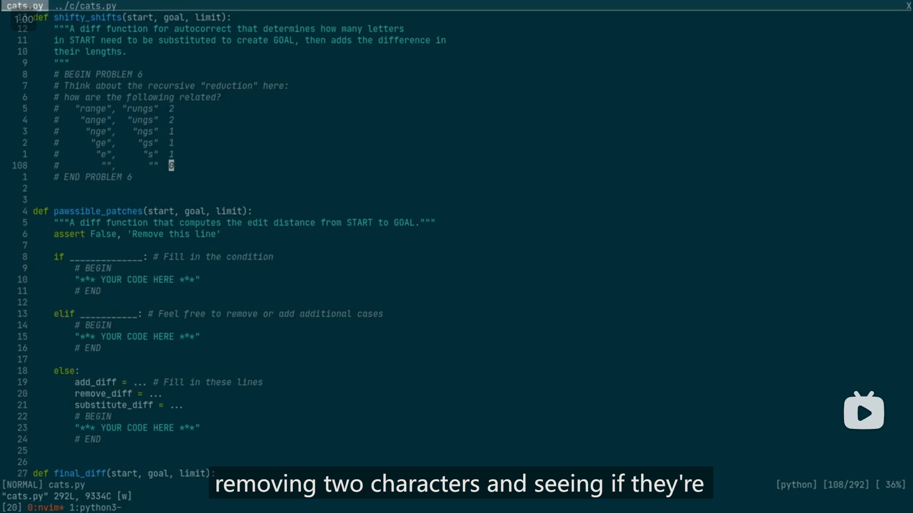{ loading=lazy }

### 5

Problem 7

ç”±æ示视频中problem 6中的，助教*é™è§£* **替æ¢** æ“作的方法如下：

```python
#   "range", "rungs"  2
#    "ange",  "ungs"  2
#     "nge",   "ngs"  1
#      "ge",    "gs"  1
#       "e",     "s"  1
#        "",      ""  0
```

>   { loading=lazy }

å³*é™è§£*的关键一步为：

```python
#   "range", "rungs"  1 + x
#    "ange",  "ungs"  1 + x
#     "nge",   "ngs"  x
#       ...,     ...  ...
```

那么，类似的， **添加** æ“作的é™è§£ï¼Œæ‹¿ `cats` 作为start ä»¥åŠ `scat` 作为goal 举例，å¯ç†è§£ä¸ºï¼š

cats在开头添加一个s，å˜æˆscats (添加的字æ¯ä¸€å®šæ˜¯goal的第一个字æ¯)，

**那么需è¦åˆ¤æ–­çš„éƒ¨åˆ†ï¼Œå°±ä» ==cats== 〠==scat==，å˜æˆäº† s ==cats== 〠s ==cat==**

则é™è§£çš„关键一步就应该是：

```python
#       ...,     ...  ...
#    "cats",  "scat"  1 + x
#    "cats",   "cat"  x
#       ...,     ...  ...
```

则åŒç†ï¼Œ**删除** æ“作的é™è§£ï¼Œæ‹¿ ckiteus 〠kittens 举例，

æ“作å‰å，**需è¦åˆ¤æ–­çš„éƒ¨åˆ†ï¼Œä» ==ckiteus== 〠==kittens==，å˜æˆäº† ==kiteus== 〠==kittens==**

则é™è§£çš„关键一步就应该是：

```python
#          ...,        ...  ...
#    "ckiteus",  "kittens"  1 + x
#     "kiteus",  "kittens"  x
#          ...,        ...  ...
```

则最åæ ¹æ®æ¨¡æ¿ä¿®æ”¹çš„代ç ä¸ºï¼š

```python
def pawssible_patches(start, goal, limit):
    """A diff function that computes the edit distance from START to GOAL."""
    # assert False, 'Remove this line'

    if limit < 0: # Fill in the condition
        # BEGIN
        "*** YOUR CODE HERE ***"
        return 0
        # END

    elif not start or not goal: # Feel free to remove or add additional cases
        # BEGIN
        "*** YOUR CODE HERE ***"
        return len(start + goal)
        # END

    elif start[0] == goal[0]:
        return pawssible_patches(start[1:], goal[1:], limit)
    else:
        add_diff = 1 + pawssible_patches(start, goal[1:], limit - 1) # ... # Fill in these lines
        remove_diff = 1 + pawssible_patches(start[1:], goal, limit - 1) # ...
        substitute_diff = 1 + pawssible_patches(start[1:], goal[1:], limit - 1) # ...
        # BEGIN
        "*** YOUR CODE HERE ***"
        return min(add_diff, remove_diff, substitute_diff)
        # END
```

>   最åå‘ç°æ€è·¯ä¸åŠ©æ•™æ示的一样
>
>   { loading=lazy }

!!! quote

    ...("ats" and "cats") we see thats adding one letter to the front, is actually the exact same as just chopping off letter from the front of the second word. so what do I mean by that, this is what I mean, I mean if I add one letter to the front, I might as well just be taking off one letter from the back, so instead of adding C to this word I can just say, well I'm just going to take off the first letter of whatever this word is, because I know that, if I add that letter to this word, then I know that it's going to be the correct letter, so I don't even need to add it, I can just go ahead and chop off the letter from the second word, and I know that it'll be okay. right, so doing comparing cats and cats, is the exact same thing as comparing ats and ats, there will be no more difference. so that's the add example right there...
    
    ...the last is the substitute example("hello" and "mello"). so this should be pretty familiar from our previous problem. remember for the previous problem we just took out the first letter of both, so it said that if they were different, then we're just gonna take them all out, and say that we had one edit distance, we had one substitution needed. and so you see that, substituting the first letter to an M to make it match the second, is the exact same thing as just taking out both letters. we don't care what they are, we see that they're different, we're just gonna take out both and call it a day. and so we see that we end with ello and ello, and then we're done...

### 6

å­—å…¸å¯ä»¥è¿™æ ·å†™ï¼Œæ›´æ¸…æ™°

```python
report = {
    "id": user_id,
    "progress": progress,
}
```

(最å一个逗å·æœ‰æ²¡æœ‰ä¸å½±å“)

>   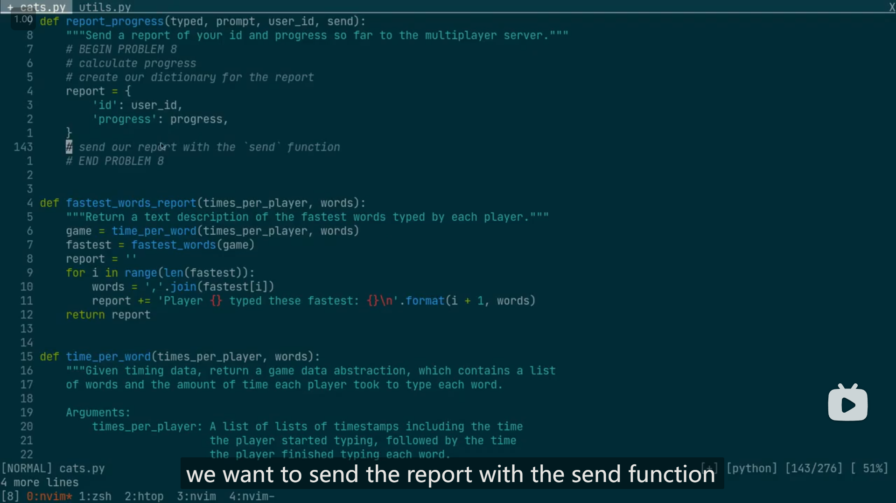{ loading=lazy }

### 7

一个å°å‘ç°

`...` å¯ä»¥èµ‹å€¼ç»™å˜é‡ï¼Œå¦‚

```python
a = 
```

会报错，

而

```python
a = ...
```

则ä¸ä¼šæŠ¥é”™

## Lecture 12 Trees

### 1

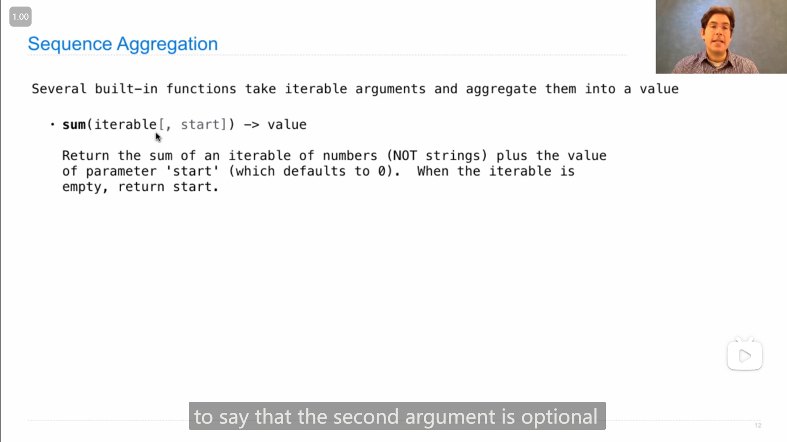{ loading=lazy }

`[...]` 中括å·/方括å·(square brackets)中的内容表示为å¯é€‰çš„(optional)

### 2

åºåˆ—èšåˆå‡½æ•°(Sequence Aggregation)

{ loading=lazy }

`sum()` 函数，å¯ä»¥ç”¨äºé™¤å­—符串以外的åºè¡¨ï¼Œå°†åºè¡¨ä¸­çš„元素以其对应的 `+` 法求和并返å›(默认åˆå§‹å€¼ä¸º0，如æœæ˜¯å…¶ä»–ç±»å‹ï¼Œéœ€è¦è®¾ç½®åˆå§‹å€¼ï¼Œå¦‚列表需è¦ä¼ å…¥ç©ºåˆ—表 `[]` åº§ä½ `start` å‚æ•°)

{ loading=lazy }

`max()` 函数，å¯ä»¥è¿”å›æœ€å¤§å€¼ï¼Œæˆ–者是使key函数返å›å€¼æœ€å¤§çš„值(自å˜é‡)

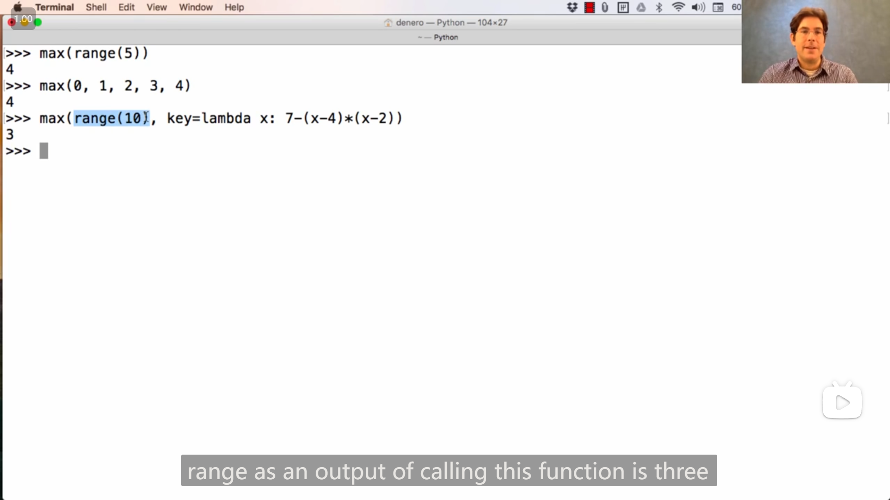{ loading=lazy }

>   对应的还有 `min()` 和 `any()`

### 3

**树抽象(Tree Abstaction)çš„å®ç°**

{ loading=lazy }

### 4

递归在树中的è¿ç”¨ï¼Œ

è¦**==ç›´æ¥å‡æƒ³å‡½æ•°èƒ½è¿”å›æ‰€éœ€è¦è¿”å›çš„东西(å³å‡æƒ³è¿”å›çš„东西是已知的)==**，然åç›´æ¥åœ¨å‡½æ•°å†…部å»**ç›´æ¥ä½¿ç”¨**这个返å›çš„东西，

并且需è¦è®°ä½æ ‘çš„å­©å­ä¹Ÿæ˜¯æ ‘。

例如

```python
def count_leaves(t):
    """Count the leaves of a tree."""
    if is_leaf(t):
        return 1
    else:
        branch_counts = [count_leaves(b) for b in branches(t)]
        return sum(branch_counts)
```

>   Hint: å‡æƒ³è¯¥å‡½æ•°ä¸€å®šèƒ½è¿”å›æ ‘çš„å¶å­æ•°(å³å‡æƒ³å·²çŸ¥å­æ ‘å¶å­æ•°)，然å对å­æ ‘çš„å¶å­æ•°å’Œå³å¾—到本树的å¶å­æ•°

```python
def leaves(tree):
    """Return a list containing the leaves labels of tree.
    
    >>> leaves(fib_tree(5))
    [1, 0, 1, 0, 1, 1, 0, 1]
    """
    if is_leaf(tree):
        return [label(tree)]
    else:
        return sum([leaves(b) for b in branches(tree)], [])
```

>   Hint: å‡æƒ³è¯¥å‡½æ•°èƒ½è¿”å› ä¸€ä¸ªå« *树的所有å¶å­çš„值/标签* çš„list 

```python
def increment_leaves(t):
    """Return a tree like t but with leaf labels incremented."""
    if is_leaf(t):
        return tree(label(t) + 1)
    else:
        bs = [increment_leaves(b) for b in branches(t)]
        return tree(label(t), bs)
```

```python
def increment(t):
    """Return a tree like t but with all labels incremented"""
    return tree(label(t) + 1, [increment(b) for b in branches(t)])
```

>   Hint: å‡æƒ³èƒ½è¿”å›ä¸€ä¸ª ... çš„æ ‘

```python
def fib_tree(n):
    if n <= 1:
        return tree(n)
    else:
        left, right = fib_tree(n - 2), fib_tree(n - 1)
        return tree(label(left) + label(right), [left, right])
```

>   HintåŒä¸Š

### 5

还有å¦ä¸€ç§**ä¸ä½¿ç”¨å‡½æ•°æœ¬èº«è¿”å›çš„值**的递归函数

{ loading=lazy }

```python
def fact(n):
    return fact_times(n, 1)

def fact_times(n, k):
    """Return k * n * (n - 1) * ... * 1"""
    if n == 0:
        return k
    else:
        return fact_times(n - 1, k * n)
```

{ loading=lazy }

(打å°æ¯ä¸ªå¶å­(ä»æ ¹å¼€å§‹)的路径)

```python
def print_sums(t, so_far):
    so_far = so_far + label(t)
    if is_leaf(t):
        print(so_far)
    else:
        for b in branches(t):
            print_sums(b, so_far)
```

>   应该是将è¦è¿­ä»£çš„å˜é‡ä½œä¸ºå‚数传入函数中

## Lecture 12 Q&A

### 1

11:06

å…³äºlab04 Q6

!!! quote

    ...by the way this is this is sort of a classic recursion problem, where you can see, you know, you think about the problem as what if i have a, you know, just there's one letter in each, and those match, what do i do, right, and then what do you do otherwise. it's, it's that classic recursion where you, you sort of simplify the problem to the simplest possible cases. the base case, one of them is empty, and then here there's there's sort of like two base cases almost, not quite because that second one is a recursion but it's that really really simple case, and then you build in the complexity after that. um, so that i, that's what's sort of really cool about these recursive solutions...
    
    ---
    
    ...顺便说一å¥ï¼Œè¿™æ˜¯ä¸€ä¸ªç»å…¸çš„递归问题，你å¯ä»¥çœ‹åˆ°ï¼Œä½ çŸ¥é“，你认为这个问题是，如æœæˆ‘有一个，你知é“的，æ¯ä¸ªåªæœ‰ä¸€ä¸ªå­—æ¯ï¼Œè¿™äº›åŒ¹é…，我该æ€ä¹ˆåšï¼Œå¯¹å§ï¼Œç„¶å你该æ€ä¹ˆåšã€‚这是一个ç»å…¸çš„递归，你å¯ä»¥å°†é—®é¢˜ç®€åŒ–为最简å•çš„情况。基本情况，其中一个是空的，然å这里几ä¹æœ‰ä¸¤ä¸ªåŸºæœ¬æƒ…况，ä¸å®Œå…¨æ˜¯å› ä¸ºç¬¬äºŒä¸ªæ˜¯é€’归，但这是一个é常简å•çš„情况，然åä½ æ„建å¤æ‚度。嗯，所以我，这就是这些递归解决方案真正酷的地方...

### 2

18:16

å…³äºhw02 Q5，匿å函数的递归

!!! quote

    **John**:
    
    ```python
    lambda n: 1 if n == 1 else n * fact(n - 1)
    ```
    
    ...uh how would we give this thing a different name, well, instead of assigning we could have it be fact, 
    
    ```python
    lambda fact: lambda n: 1 if n == 1 else n * fact(n - 1)
    ```
    
    but then, how would we like, pass that in, i guess instead of putting it here, maybe, maybe the best place to put it is here,
    
    ```python
    lambda n, fact: 1 if n == 1 else n * fact(n - 1)
    ```
    
    so, basically in order to run this, we need an n and we need factorial. i'll just let that sink in, if factorial is not already defined, then somebody needs to pass it in, in order for us to call it. i'm gonna need a little bit more space than this i'm afraid. now, that we have a function that takes n and factorial. we need to be a little bit careful, we want this to be our factorial function, but it takes two arguments, and here we're calling it with only one argument, so that seems like a mismatch. what should be the second argument every time we call fact, well it should be the same function again, that's kind of how we get that recursive structure,
    
    ```python
    lambda n, fact: 1 if n == 1 else n * fact(n - 1, fact)
    ```
    
    is that every time we call this thing that takes in a number and the function that we're going to call recursively, it needs to be called on a new number and the function that we're going to call recursively. so we've actually made some progress even though all we've done is kind of like move a name in here, and uh, pass it around. the last part is that we need to figure out, how to write a function, that takes only n, and somehow uh, calls this one instead,
    
    ```python
    lambda n: (lambda n, fact: 1 if n == 1 else n * fact(n - 1, fact))
    ```
    
    and that's actually not so bad, this says, uh, give me a function, and call that function, on both n and itself.
    
    ```python
    lambda n: (lambda f: f(n, f))(lambda n, fact: 1 if n == 1 else n * fact(n - 1, fact))
    ```
    
    so if i have a function, and i call it on n and itself, where n comes from here, now i just need to know which function i'm supposed to be calling on n in itself. and the answer is, this guy (`(lambda n, fact: 1 if n == 1 else n * fact(n - 1, fact))`).
    
    ```python
    g = lambda n: (lambda f: f(n, f))(lambda n, fact: 1 if n == 1 else n * fact(n - 1, fact))
    ```
    
    so let's see what g does now. g computes n factorial, if we really wanted to get rid of that assignment statement, 
    
    ```python
    print((lambda n: (lambda f: f(n, f))(lambda n, fact: 1 if n == 1 else n * fact(n - 1, fact)))(4))
    ```
    
    then we could compute four factorial this way, by taking this function and calling it on four, and then, hopefully, if everything went right, we will have printed four factorial, or five factorial, or whatever. ==so, what was the key moments in figuring this out, one was, if we can't have fact defined already, then we have to pass it in as an argument, and the second was, if we have a function that takes two arguments, and we really want a function that takes one argument, then we should write a function that takes one argument, and calls the function that takes two arguments. and, then, the last part really is kind of a trick, which is to say like if you had a function and an argument, you would then call the function on the argument in itself, this is basically how you create recursion, without using assignment statements== is this little part right here...
    
    **Hany**:
    
    ...i i think john's right here. by the way, look there's a couple of things that you've seen before, ==essentially there's the helper function in here. you have a function that, uh, only takes one parameter and, you really need to pass two, so you put a helper function in==, that's basically what you have here with the lambda. um, you've got sort of the notion of recursion and then there's just that little trick there, um, which you see with, uh, this, uh, lambda f of f of nf. so don't, don't get too worried if you didn't see that obvi, it obvious, i don't think it's at all obvious actually.
    
    **John**:
    
    one thing that's exciting about this while it's not obvious at all, is that it allows you to create iteration out of just functions, like of course there's no assignment here, there's also no while statement or for statement here. but we are doing something repetitively, and, so, um, this is kind of, uh, this idea right here, is a building block for the claim, that once you can define functions you can kind of write any program that you want, you can perform any computation, and you might wonder was that really true, like don't i need a while statement or a for statement. it turns out technically you don't, that does not mean we should get rid of while statements and for statements, they're a lot more readable than this i think, but, um, they're not strictly necessary in order to perform interesting computations.
    
    **Hany**:
    
    yes, and some in the chat just pointed out scheme and lisp is this is sort of the premise of these functional programming languages, that don't have looping, explicit looping constructs as you do everything, with these types of constructs, and it's a little bit mind-bending, but, it turns out it's expressive enough...
    
    ---
    
    **John**:
    
    ```python
    lambda n: 1 if n == 1 else n * fact(n - 1)
    ```
    
    ...呃，我们æ€ä¹ˆç»™è¿™ä¸ªä¸œè¥¿å–一个ä¸åŒçš„å字呢，好å§ï¼Œä¸å…¶æŒ‡å®šï¼Œæˆ‘们å¯ä»¥è®©å®ƒæˆä¸ºfact，
    
    ```python
    lambda fact: lambda n: 1 if n == 1 else n * fact(n - 1)
    ```
    
    但是，我们会æ€ä¹ˆæƒ³ï¼ŒæŠŠå®ƒä¼ è¿›æ¥ï¼Œæˆ‘想ä¸å…¶æŠŠå®ƒæ”¾åœ¨è¿™é‡Œï¼Œä¹Ÿè®¸ï¼Œä¹Ÿè®¸æœ€å¥½çš„地方放在这里，
    
    ```python
    lambda n, fact: 1 if n == 1 else n * fact(n - 1)
    ```
    
    所以，基本上，为了è¿è¡Œè¿™ä¸ªï¼Œæˆ‘们需è¦ä¸€ä¸ªn，我们需è¦fact。我会让它沉下å»ï¼Œå¦‚æœfact还没有定义，那么需è¦æœ‰äººæŠŠå®ƒä¼ è¿›æ¥ï¼Œè¿™æ ·æˆ‘们æ‰èƒ½è°ƒç”¨å®ƒã€‚æ怕我需è¦æ›´å¤šçš„空间。ç°åœ¨ï¼Œæˆ‘们有一个函数，它å–nå’Œfact。我们需è¦å°å¿ƒä¸€ç‚¹ï¼Œæˆ‘们希望这是我们的阶乘函数，但它需è¦ä¸¤ä¸ªå‚数，而这里我们åªç”¨ä¸€ä¸ªå‚æ•°æ¥è°ƒç”¨å®ƒï¼Œæ‰€ä»¥è¿™çœ‹èµ·æ¥ä¸åŒ¹é…。æ¯æ¬¡æˆ‘们调用fact时，第二个å‚数应该是什么，它应该是åŒä¸€ä¸ªå‡½æ•°ï¼Œè¿™å°±æ˜¯æˆ‘们得到递归结æ„çš„æ–¹å¼ï¼Œ
    
    ```python
    lambda n, fact: 1 if n == 1 else n * fact(n - 1, fact)
    ```
    
    æ¯æ¬¡æˆ‘们调用这个包å«ä¸€ä¸ªæ•°å­—和我们è¦é€’归调用的函数的东西时，都需è¦å¯¹ä¸€ä¸ªæ–°çš„数字和我们将递归调用的功能进行调用。所以我们å®é™…上已ç»å–得了一些进展，尽管我们所åšçš„åªæ˜¯æŠŠä¸€ä¸ªå字移到这里，然å把它传æ¥ä¼ å»ã€‚最å一部分是，我们需è¦å¼„清楚，如何编写一个åªéœ€è¦n的函数，并以æŸç§æ–¹å¼è°ƒç”¨è¿™ä¸ªå‡½æ•°ï¼Œ
    
    ```python
    lambda n: (lambda n, fact: 1 if n == 1 else n * fact(n - 1, fact))
    ```
    
    这其å®è¿˜ä¸é”™ï¼Œè¿™è¯´ï¼Œç»™æˆ‘一个函数，并调用这个函数，对n和它本身。
    
    ```python
    lambda n: (lambda f: f(n, f))(lambda n, fact: 1 if n == 1 else n * fact(n - 1, fact))
    ```
    
    如æœæˆ‘有一个函数，我在n和它本身上调用它，næ¥è‡ªè¿™é‡Œï¼Œç°åœ¨æˆ‘åªéœ€è¦çŸ¥é“我应该在n本身上调用哪个函数。答案是，这家伙 (`(lambda n, fact: 1 if n == 1 else n * fact(n - 1, fact))`)。
    
    ```python
    g = lambda n: (lambda f: f(n, f))(lambda n, fact: 1 if n == 1 else n * fact(n - 1, fact))
    ```
    
    让我们看看gç°åœ¨åšä»€ä¹ˆã€‚g计算n阶乘，如æœæˆ‘们真的想å»æ‰èµ‹å€¼è¯­å¥ï¼Œ
    
    ```python
    print((lambda n: (lambda f: f(n, f))(lambda n, fact: 1 if n == 1 else n * fact(n - 1, fact)))(4))
    ```
    
    然å我们å¯ä»¥ç”¨è¿™ç§æ–¹å¼è®¡ç®—4的阶乘，通过å–这个函数并在4上调用它，然å，如æœä¸€åˆ‡é¡ºåˆ©ï¼Œæˆ‘们将打å°å‡º4的阶乘，或5的阶乘，或其他什么。==那么，弄清楚这一点的关键时刻是什么，一个是，如æœæˆ‘们还ä¸èƒ½å®šä¹‰fact，那么我们必须将其作为一个å‚数传递，第二个是，我们有一个æ¥å—两个å‚数的函数，我们真的想è¦ä¸€ä¸ªæ¥å—一个å‚数的函å¼ï¼Œé‚£ä¹ˆæˆ‘们应该写一个æ¥å—了一个å‚数，并调用æ¥å—两个å˜é‡çš„函数。然å，最å一部分å®é™…上是一ç§æŠ€å·§ï¼Œä¹Ÿå°±æ˜¯è¯´ï¼Œå¦‚æœä½ æœ‰ä¸€ä¸ªå‡½æ•°å’Œä¸€ä¸ªå‚数，你会在å‚数本身上调用函数，这基本上就是你创建递归的方法，而ä¸ä½¿ç”¨èµ‹å€¼è¯­å¥==，这就是这个å°éƒ¨åˆ†...
    
    **Hany**:
    
    ...我觉得约翰是对的。顺便说一下，这里有你以å‰è§åˆ°è¿‡ä¸€äº›ä¸œè¥¿ï¼Œæœ€åŸºæœ¬åœ° ==这里有helper函数。你有一个函数，呃，åªæ¥å—一个å‚数，你需è¦ä¼ é€’两个，所以你在里é¢æ”¾äº†ä¸€ä¸ªè¾…助函数==，这基本上就是lambda。嗯，你已ç»æœ‰äº†é€’归的概念，然å有一个å°æŠ€å·§ï¼Œä½ å¯ä»¥çœ‹åˆ°ï¼Œè¿™ä¸ªï¼Œè¿™ä¸ªï¼Œlambda f of f of nf。所以ä¸è¦ï¼Œä¸è¦å¤ªæ‹…心，如æœä½ æ²¡æœ‰æ¸…楚地看到，我认为它å®é™…上一点也ä¸æ˜æ˜¾ã€‚
    
    **John**:
    
    虽然这一点并ä¸æ˜æ˜¾ï¼Œä½†æœ‰ä¸€ç‚¹ä»¤äººå…´å¥‹ï¼Œé‚£å°±æ˜¯å®ƒå…许你仅ä»å‡½æ•°ä¸­åˆ›å»ºè¿­ä»£ï¼Œå½“然这里没有赋值，这里也没有while语å¥æˆ–for语å¥ã€‚但我们在é‡å¤åœ°åšä¸€äº›äº‹æƒ…，这是一ç§ï¼Œå—¯ï¼Œè¿™ä¸ªæƒ³æ³•ï¼Œæ˜¯è¿™ä¸ªä¸»å¼ çš„一个æ„建å—，一旦你定义了函数，你就å¯ä»¥ç¼–写任何你想è¦çš„程åºï¼Œä½ å¯ä»¥æ‰§è¡Œä»»ä½•è®¡ç®—，你å¯èƒ½ä¼šæƒ³ï¼Œè¿™çœŸçš„是真的å—，比如我ä¸éœ€è¦while语å¥æˆ–for语å¥ã€‚事å®è¯æ˜ï¼Œä»æŠ€æœ¯ä¸Šè®²ï¼Œä½ æ²¡æœ‰ï¼Œè¿™å¹¶ä¸æ„味ç€æˆ‘们应该å»æ‰while语å¥ï¼Œå¯¹äºè¯­å¥ï¼Œå®ƒä»¬æ¯”这更å¯è¯»ï¼Œä½†æ˜¯ï¼Œå—¯ï¼Œä¸ºäº†æ‰§è¡Œæœ‰è¶£çš„计算，它们并ä¸æ˜¯ä¸¥æ ¼å¿…è¦çš„。
    
    **Hany**:
    
    是的，èŠå¤©ä¸­çš„一些人刚刚指出schemeå’Œlisp，这是这些函数å¼ç¼–程语言的å‰æ，它们在åšä»»ä½•äº‹æƒ…时都没有循ç¯ã€æ˜¾å¼çš„循ç¯ç»“æ„，有这些类å‹çš„结æ„，这有点让人费解，但事å®è¯æ˜å®ƒè¶³å¤Ÿæœ‰è¡¨è¾¾åŠ›...

我的ç†è§£æ˜¯ï¼ŒåŒ¿å函数的递归，由äºæ— æ³•å£°æ˜å˜é‡å’Œç»™å˜é‡èµ‹å€¼ï¼Œæ‰€ä»¥éœ€è¦å°†å‡½æ•°ä½œä¸ºå‚数传入匿å函数，然åå†åœ¨å†…部调用，而由äºæ­¤æ—¶åŒ¿å函数测å‚数中有一个函数å‚数，所以在调用以å‚数传入的函数时，å‚数也è¦ä¸è‡ªèº«ç›¸åŒ¹é…(å³åŠ ä¸Šè¯¥å‡½æ•°è‡ªèº«)，如

```python
lambda n, f: 1 if n == 1 else f(n, f)
```

下一步我的ç†è§£æ˜¯ï¼Œç”±äºéœ€è¦å»è°ƒç”¨åŒ¿å函数自身，而åˆä¸èƒ½èµ‹å€¼ï¼Œé‚£ä¹ˆå°±æ™ºèƒ½å°†å‡½æ•°ä½œä¸ºå‚æ•°ä¼ å…¥å¦ä¸€ä¸ªå‡½æ•°ï¼Œå†åœ¨å者内部调用å‰è€…，å³

```python
(lambda f: f(n, f))(lambda n, f: 1 if n == 1 else f(n, f))
```

最å，由äºn是最终想è¦è®¾ç½®çš„å‚数，所以在最外é¢æœ€å包上一层

```python
lambda n: (lambda f: f(n, f))(lambda n, f: 1 if n == 1 else f(n, f))
```

### 3

23:52

å…³äºlecture 12最åæåŠçš„递归函数的æ„建方å¼

!!! quote

    { loading=lazy }
    
    ```python
    def fact(n):
        if n == 0:
            return 1
        else:
            return n * fact(n - 1)
    
    def fact_times(n, k):
        """Return k times n factorial
                  k *     n * (n-1) * ... * 1
        """
        if n == 0:
            return k
        else:
            return fact_times(n - 1, k * n)
    ```
    
    **John**:
    
    ...yeah, so the reason we did something a little bit different here, was so that we could show an example, of a recursive function, that just called itself, without doing anything with it, so there kind of wasn't anything outside of the call, everything happened inside the call, where we subtracted one from n and we multiplied k by n. but we didn't like add anything or multiply anything afterwards, which was different than the original version of factorial, which did multiply the result of the recursive call by n. the original one looked like this, right, it was like if n equals zero return one, else return n times fact n minus one. so here we make the recursive call and then we like do some work afterwards, and that means the recursive call doesn't really know where it came from. it doesn't know anything about which factorial result you're constructing, whereas this one does. at the end, when you hit the base case, you have computed k times n factorial for whatever n in k you started with, and that is now named k, which is a little confusing, but that's how it goes sometimes with recursion. but the point is that the whole answer is, uh, built up by the time you hit the base
    case, at which point you just have to return return return return, all the work is done.
    
    **Hany**:
    
    and notice, by the way, ==in that first one== that's not true, as you're doing recursion, ==there is a delayed gratification of the evaluation of that product, so when you hit the base case in the first fact, you then have to go back and now multiply all those numbers between n and one==. yeah because you built an expression, whereas ==in the fact times==, you basically have an assignment operator, it's that you're, you're just ==using the parameters as the assignment operator==, and so ==when you hit that base case, done, i've got the answer==. so, so you're right, ==of course, we could have done it differently, we didn't have to do it this way, but you see that the structurally the recursion is subtly different here==, and it turns out this has a real implication too by the way, downstream, and i think, i think we'll eventually do that, right john.
    
    **John**:
    
    yeah so ==this is called, uh, tail recursion==, and this is not, and we'll talk about this later when we talk about interpreters. um, so the goal here wasn't to implement fact times, it was actually to re-implement fact. but ==in order to re-implement fact you'd have to have a helper function, that's what fact times is. that keeps track of two arguments instead of one. the thing you're trying to compute the factorial of, and the result the answer of computing n.==
    
    ---
    
    **John**：
    
    ...是的，我们在这里åšäº†ä¸€äº›ä¸åŒçš„事情，是为了展示一个递归函数的示例，它åªæ˜¯è°ƒç”¨äº†è‡ªå·±ï¼Œè€Œæ²¡æœ‰å¯¹å®ƒåšä»»ä½•äº‹æƒ…，所以在调用之外几ä¹æ²¡æœ‰ä»€ä¹ˆä¸œè¥¿ï¼Œæ‰€æœ‰äº‹æƒ…都å‘生在调用内部，我们ä»n中å‡å»äº†1并将k乘以n。但是我们没有添加或乘以任何其他东西，这ä¸é˜¶ä¹˜çš„åŸå§‹ç‰ˆæœ¬ä¸åŒï¼ŒåŸå§‹ç‰ˆæœ¬é€šè¿‡ä¹˜ä»¥é€’归调用的结æœæ¥è®¡ç®—。åŸå§‹ç‰ˆæœ¬çœ‹èµ·æ¥åƒè¿™æ ·ï¼Œå¦‚æœnç­‰äºé›¶ï¼Œåˆ™è¿”å›1，å¦åˆ™è¿”å›n乘以fact（n-1）。所以在这里，我们进行递归调用，然å在之å进行一些工作，这æ„味ç€é€’归调用ä¸çŸ¥é“它æ¥è‡ªå“ªé‡Œã€‚它ä¸çŸ¥é“你正在æ„建哪个阶乘结æœï¼Œè€Œè¿™ä¸ªç‰ˆæœ¬çŸ¥é“。最å，当你到达基本情况时，你已ç»è®¡ç®—出了对äºä»»ä½•ä»¥k为n开始的n，k乘以n的阶乘，ç°åœ¨å®ƒè¢«å‘½å为k，这有点令人困惑，但有时就是这样递归。但是é‡ç‚¹æ˜¯æ•´ä¸ªç­”案在达到基本情况时就已ç»æ„建完æˆï¼Œæ­¤æ—¶ä½ åªéœ€è¦è¿”å›ï¼Œè¿”å›ï¼Œè¿”å›ï¼Œæ‰€æœ‰çš„工作都已完æˆã€‚
    
    **Hany**：
    
    顺便æ一下，==在第一个函数中==，当你进行递归时，==有一个乘积的评估延迟，所以当你在第一个fact中达到基本情况时，你需è¦å›å»ç°åœ¨ä¹˜ä»¥nå’Œ1之间的所有数字==。是的，因为你æ„建了一个表达å¼ï¼Œè€Œ ==在fact times中==，你基本上有一个赋值è¿ç®—符，你åªæ˜¯ ==å°†å‚数用作赋值è¿ç®—符==，所以当你 ==到达基本情况时，完æˆäº†ï¼Œæˆ‘得到了答案==。所以，当然，你是对的，==我们本æ¥å¯ä»¥ç”¨ä¸åŒçš„æ–¹å¼åšè¿™ä¸ªï¼Œä½†ä½ å¯ä»¥çœ‹åˆ°ï¼Œé€’归的结æ„在这里是微妙ä¸åŒçš„==，这在下游也有å®é™…å½±å“，我认为我们最终会åšï¼Œå¯¹å§ï¼ŒJohn。
    
    **John**：
    
    是的，所以 ==这被称为尾递归==，而这ä¸æ˜¯å°¾é€’归，我们将在讨论解释器时å†è°ˆè®ºè¿™ä¸ªé—®é¢˜ã€‚所以这里的目标ä¸æ˜¯å®ç°fact times，而是é‡æ–°å®ç°fact。但是 ==为了é‡æ–°å®ç°fact，您必须有一个辅助函数，å³fact times。ä¸ä¸€ä¸ªå‚æ•°ä¸åŒï¼Œå®ƒä¿ç•™äº†è¦è®¡ç®—阶乘的元素和计算n结æœçš„答案这两个å‚数。==

## Lab 05

### 1

Q6 中，借鉴了 `lab05.py` 文件底部 `Tree ADT` 中最å一个函数 `copy_tree()` 的函数æ„造æ€è·¯

>   ```python
>   def copy_tree(t):
>       """Returns a copy of t. Only for testing purposes.
>   
>       >>> t = tree(5)
>       >>> copy = copy_tree(t)
>       >>> t = tree(6)
>       >>> print_tree(copy)
>       5
>       """
>       return tree(label(t), [copy_tree(b) for b in branches(t)])
>   ```

ç”±äºQ6中是需è¦è¿”å›ä¸€ä¸ªæ–°çš„树，所以直æ¥ç”¨æ ‘çš„æ„造函数根æ®åŸæ ‘å»**递归地**(å‚考 `copy_tree()` )æ„造一个新树

>   (å…ˆæ„建好基本的递归，å†è€ƒè™‘基本情况(basic situation)下如何处ç†)
>
>   1.   ```python
>        def sprout_leaves(t, leaves):
>            return tree(label(t), [... sprout_leaves(branch, leaves) for branch in branches(t)])
>        ```
>
>   2.   ```python
>        def sprout_leaves(t, leaves):
>            return tree(label(t), [... if is_leaf(branch) else sprout_leaves(branch, leaves) for branch in branches(t)])
>        ```
>
>   3.   ```python
>        def sprout_leaves(t, leaves):
>            return tree(label(t), [tree(label(branch), [...]) if is_leaf(branch) else sprout_leaves(branch, leaves) for branch in branches(t)])
>        ```
>
>   4.   ```python
>        def sprout_leaves(t, leaves):
>            return tree(label(t), [tree(label(branch), [tree(leaf) for leaf in leaves]) if is_leaf(branch) else sprout_leaves(branch, leaves) for branch in branches(t)])
>        ```

### 2

Q9

(å¯ä»¥åˆ©ç”¨ä¸‹æ ‡æ¥æ„建æ¨å¯¼å¼)

!!! quote

    ==*Hint:* To write this as a single comprehension, you may find the expression `k%2`, which evaluates to 0 on even numbers and 1 on odd numbers, to be useful. Consider how you can use the 0 or 1 returned by `k%2` to alternatively access the beginning and the middle of the list.==

??? note "code"

    ```python
    def riffle(deck):
    """Produces a single, perfect riffle shuffle of DECK, consisting of
    DECK[0], DECK[M], DECK[1], DECK[M+1], ... where M is position of the
    second half of the deck.  Assume that len(DECK) is even.
    >>> riffle([3, 4, 5, 6])
    [3, 5, 4, 6]
    >>> riffle(range(20))
    [0, 10, 1, 11, 2, 12, 3, 13, 4, 14, 5, 15, 6, 16, 7, 17, 8, 18, 9, 19]
    """
    "*** YOUR CODE HERE ***"
    return [deck[i // 2] if i % 2 == 0 else deck[(len(deck) + i) // 2] for i in range(len(deck))]
    ```

### 3

在 [Lecture 14 Q&A](#Lecture 14 Q&A) 中 John 有æ到此题的解法，在看了一部分(使用下标的方法)之å，用列表æ¨å¯¼å¼å†™å‡ºäº†ä¸€ä¸ªå¯ç”¨çš„方法(结æ„有点类似äºQ6)：

```python
def add_trees(t1, t2):
    return tree(label(t1) + label(t2), [add_trees(branches(t1)[i] if i < len(branches(t1)) else tree(0), branches(t2)[i] if i < len(branches(t2)) else tree(0)) for i in range(max(len(branches(t1)), len(branches(t2))))])
```

### 4

Q11中

```python
def build_successors_table(tokens):
    """Return a dictionary: keys are words; values are lists of successors.

    >>> text = ['We', 'came', 'to', 'investigate', ',', 'catch', 'bad', 'guys', 'and', 'to', 'eat', 'pie', '.']
    >>> table = build_successors_table(text)
    >>> sorted(table)
    [',', '.', 'We', 'and', 'bad', 'came', 'catch', 'eat', 'guys', 'investigate', 'pie', 'to']
    >>> table['to']
    ['investigate', 'eat']
    >>> table['pie']
    ['.']
    >>> table['.']
    ['We']
    """
    table = {}
    prev = '.'
    for word in tokens:
        if prev not in table:
            "*** YOUR CODE HERE ***"
        "*** YOUR CODE HERE ***"
        prev = word
    return table
```

中的 `sorted()` 函数如æœä»¥å­—典为传入å‚数，输出的 应该 是一个å«æœ‰æ‰€æœ‰key并且æ’åºå¥½çš„列表

## Lecture 13 Q&A

### 1

Johnå…³äº `min()` å’Œ `max()` çš„ `key` å‚数的一些解释和说æ˜

!!! qoute

    ...what's going on with the min function and its optional argument called key. sometimes what you want is to find the smallest number among a list, and min will do that for you. but **sometimes what you want is to find a particular number that's extreme in another way, like it's not the smallest, it's not the largest, but it's the closest to five or it's the, it's the thing that when you square it is closest to 24, or you know you could imagine any kind of description, where there's like a some value, that would do this the best**, and min allows you to find that element for any possible condition, and that's the point of that key function. **so the way you do it is that, you start out with your same set of values, of which one is the one that you're looking for, and then you provide a function, and this function is going to be called on every single one of these values**, and yeah, let's use that example of, uh, the square is as close as possible to 24. i don't know why you would want this, but maybe you would for some reason.
    
    ```python
    >>> min([3, 2, 5, 6], key=lambda x: abs(x * x - 24))
    ```
    
    so what's going to happen here, is that it's going to square, and then subtract 24 from each of these, and then take the absolute value in order to get some measurement of how close is the square of this x to 24. and it tells us 5 is among these numbers the one that when you square it gets you pretty close to 24. **in fact there's like an important property about this computation that's not shown, which is that 5 squared minus 24 is 1, and there's no 1 in this output, that's all hidden**. what is happening is that, that 1 is computed along with the result of, squaring 3 and subtracting 24, and squaring 6 and subtracting 24. **so it's done it for all of them, and then it has found the one, for which the result of calling this function is the smallest**. why the smallest, because it's min. **so in this way you can use min in order to find the, kind of extreme value for any notion of extreme that you want, but you always get one of these values**. and if there's a tie, then you'll get an arbitrary one i think. you get the first one but i'm not actually sure...
    
    ---
    
    ...min函数åŠå…¶å为keyçš„å¯é€‰å‚æ•°å‘生了什么。有时，你想è¦çš„是在一个列表中找到最å°çš„数字，min会为你åšåˆ°è¿™ä¸€ç‚¹ã€‚**有时，你想è¦çš„是找到一个以å¦ä¸€ç§æ–¹å¼æ端的特定数字，比如它ä¸æ˜¯æœ€å°çš„，也ä¸æ˜¯æœ€å¤§çš„，但它最æ¥è¿‘5，或者它是，当你把它平方时，它最æ¥è¿‘24，或者你知é“ä½ å¯ä»¥æƒ³è±¡ä»»ä½•ä¸€ç§æ述，其中有一个值，这将是最好的**，minå…许你找到任何å¯èƒ½æ¡ä»¶ä¸‹çš„元素，这就是关键函数的æ„义所在。**这样åšçš„方法是，你ä»ä¸€ç»„相åŒçš„值开始，其中一个是你正在寻找的值，然åä½ æ供一个函数，这个函数将对这些值中的æ¯ä¸€ä¸ªè°ƒç”¨**，是的，让我们用这个例å­ï¼Œå‘ƒï¼Œå¹³æ–¹å°½å¯èƒ½æ¥è¿‘24。我ä¸çŸ¥é“你为什么想è¦è¿™ä¸ªï¼Œä½†ä¹Ÿè®¸å‡ºäºæŸç§åŸå› ä½ ä¼šæƒ³è¦ã€‚
    
    ```python
    >>> min([3, 2, 5, 6], key=lambda x: abs(x * x - 24))
    ```
    
    这里è¦åšçš„是，它è¦å¹³æ–¹ï¼Œç„¶åä»æ¯ä¸€ä¸ªä¸­å‡å»24，然åå–ç»å¯¹å€¼ï¼Œå¾—到xå’Œ24的平方有多æ¥è¿‘。它告诉我们，5是这些数字中的一个，当你平方时，它会é常æ¥è¿‘24**事å®ä¸Šï¼Œè¿™ä¸ªè®¡ç®—有一个é‡è¦çš„性质没有显示，那就是5的平方å‡å»24是1，而这个输出中没有1，这都是éšè—çš„**。ç°åœ¨çš„情况是，1ä¸å¹³æ–¹3å’Œå‡æ³•24ã€å¹³æ–¹6å’Œå‡æ³•24的结æœä¸€èµ·è®¡ç®—。**因此，它对所有这些函数都进行了处ç†ï¼Œç„¶å找到了一个函数，调用该函数的结æœæ˜¯æœ€å°çš„**。为什么是最å°çš„，因为它是最å°çš„。**通过这ç§æ–¹å¼ï¼Œä½ å¯ä»¥ä½¿ç”¨minæ¥æ‰¾åˆ°ï¼Œä»»ä½•ä½ æƒ³è¦çš„æ值概念的æ值，但你总是得到其中一个值**。如æœæ‰“æˆå¹³æ‰‹ï¼Œæˆ‘想你会得到一个任æ„的平手。你得到了第一个，但我å®é™…上ä¸ç¡®å®š...

### 2

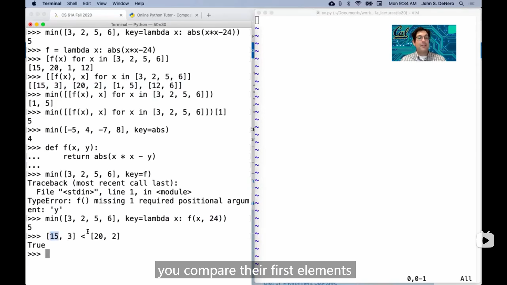{ loading=lazy }

两个列表在比较大å°æ—¶ï¼Œä¼šæ¯”较第一个元素的大å°( `min()` 函数也类似)，

测试了一下，应该是åƒå­—符串一样的规则，å³å‰ä¸€ä¸ªå…ƒç´ èƒ½æ¯”较出就按照该结æœï¼Œè‹¥ç›¸ç­‰åˆ™æ¯”较下一个元素...

```python
>>> [3, 4, 5] > [3, 3]
True
>>> [3, 4, 5] > [4, 3]
False
>>> [3, 4, 5] > [3, 4]
True
>>> [3, 4, 5] > [3, 5]
False
```

## Lecture 14 Circuits

### 1

Hany讲设计电路(Design Circuits)的内容中，æ„建命题逻辑公å¼çš„æ€è·¯(step 1-3)值得学习

>   1.   step 1. build truth-table for all possible input/output values
>   2.   step 2. build sub-expressions with *and/not* for each output column
>   3.   step 3. combine, two at a time, sub-expressions with an *or*
>   4.   step 4. draw circuit diagram

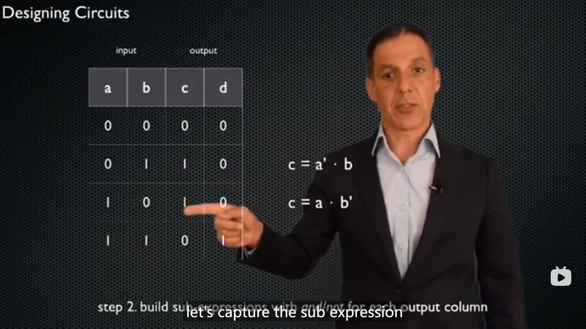{ loading=lazy }

1.   先根æ®çœŸå€¼è¡¨å†™å‡ºå­è¡¨è¾¾å¼
2.   å†å°†å­è¡¨è¾¾å¼æå–(or)到一起

|  a   |  b   |   c   |  d   |
| :--: | :--: | :---: | :--: |
|  0   |  0   |   0   |  0   |
|  0   |  1   | ==1== |  0   |
|  1   |  0   |   1   |  0   |
|  1   |  1   |   0   |  1   |

上é¢çœŸå€¼è¡¨ä¸­é«˜äº®çš„cçš„1的输出值，需è¦çš„å­è¡¨è¾¾å¼åº”为 `c = a' · b` (éa且b)

|  a   |  b   |   c   |  d   |
| :--: | :--: | :---: | :--: |
|  0   |  0   |   0   |  0   |
|  0   |  1   |   1   |  0   |
|  1   |  0   | ==1== |  0   |
|  1   |  1   |   0   |  1   |

åŒç†ï¼Œè¿™ä¸ªé«˜äº®çš„输出值，对应的å­è¡¨è¾¾å¼åº”为 `c = a · b'` 

最å，å†æå–两个å­è¡¨è¾¾å¼ï¼Œå³å¾—到

`c = (a' · b) + (a · b') ` 

### 2

二进制数的加法需è¦æ„建出有3个输入值和2个输出值的电路

{ loading=lazy }

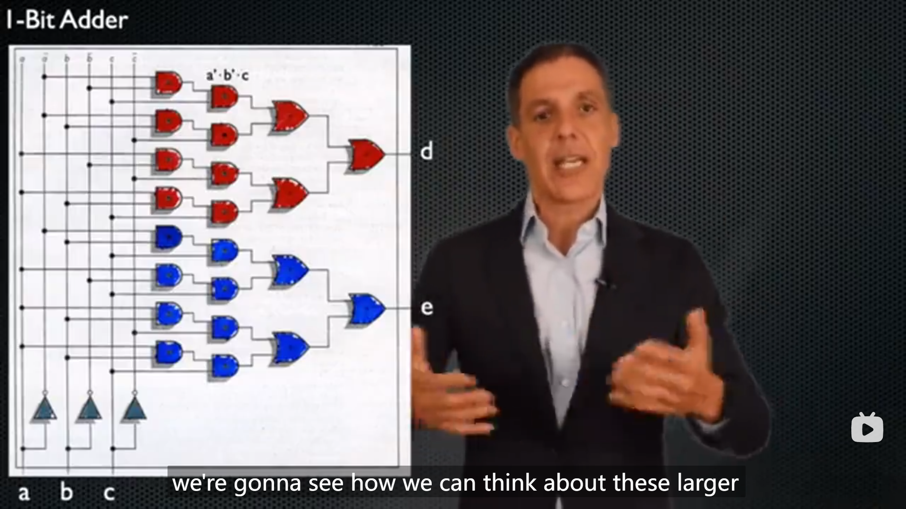{ loading=lazy }

### 3

{ loading=lazy }

>   ...okay, remember how the sub expressions work, **you treat each output column separately**, the d and the e. **output column are completely independent of each other**. we're going to identify **wherever there's a one**, and then here here here and here. we're going to build a sub expression **using only and and not**, and then we're going to **combine those sub expressions using the or operator**. and then once we have the final expression, of course we're going to draw some circuitry...
>

感觉有点类似ä¸å†™å‡ºä¸»æå–范å¼

### 4

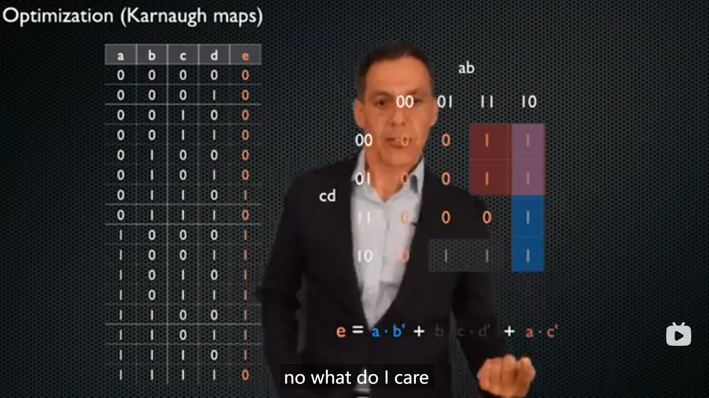{ loading=lazy }

写命题逻辑公å¼çš„技巧：

1.   å˜å…ƒå¤šçš„时候å¯ä»¥å¤šä¸ªå˜å…ƒåˆæˆä¸€ç»„，然å结åˆè¡¨æ ¼å±•ç¤ºçœŸå€¼
2.   写å­è¡¨è¾¾å¼æ—¶çš„技巧，如由上图ç°è‰²åŒºåŸŸï¼Œå¯ä»¥å‘ç°ä¸açš„å–值无关，故å¯ä»¥å†™å‡ºå­è¡¨è¾¾å¼ `b·c·d'`

## Lecture 14 Q&A

### 1

Lab 05 çš„ Q10

**ä¸ä½¿ç”¨ built-in zip function:**

{ loading=lazy }

John的方法我认为关键之处在äºï¼Œç”¨ä¸‹æ ‡å»è”系两颗树对应的树æ/分支

>   ```python
>   def add_trees(t1, t2):
>       result_label = label(t1) + label(t2)
>       result_branches = []
>       i = 0
>       while i < min(len(branches(t1)), len(branches(t1))):
>           b1, b2 = branches(t1)[i], branches(t2)[i]
>           new_branch = add_trees(b1, b2)
>           result_branches = result_branches + [new_branch]
>           i = i + 1
>       result_branches = result_branches + branches(t1)[i:]
>       result_branches = result_branches + branches(t2)[i:]
>       return tree(result_label, result_branches)
>   ```

**使用 built-in zip function:**

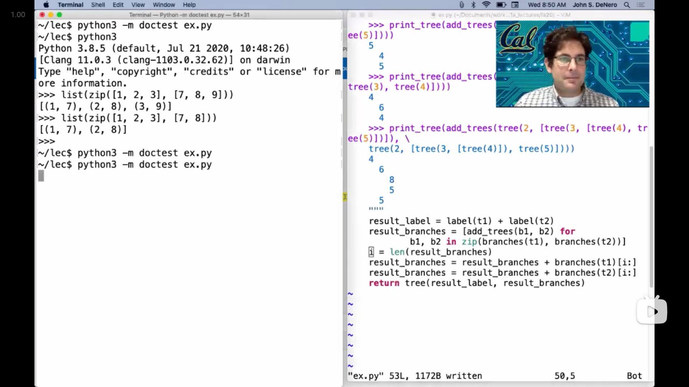{ loading=lazy }

`zip()` å¯ä»¥å°†å¤šä¸ªåºåˆ—中的元素åŒæ—¶æå–出æ¥ï¼Œæ¯”如，a列表有5个元素，b列表有8个元素，则 将两者输入到 `zip()` 中，会得到一个å«æœ‰a列表全部元素和b列表å‰5个元素的*åºåˆ—*，åºåˆ—中æ¯ä¸ªå…ƒç´ ä¸ºa b列表中下标对应的元素(åƒä¸Šå›¾ä¸­çš„一样)

**é‡è¦çš„是**å¯ä»¥ä½¿ç”¨ åºåˆ—æ¨å¯¼å¼ï¼Œæˆ–者 `for` 语å¥(利用 `zip()` )**将多个åºåˆ—中的元素一起æå–出æ¥**，如

```python
>>> l1 = [1, 2, 3]
>>> l2 = ["a", "b", "c"]
>>> [[x, y] for x, y in zip(l1, l2)]
[[1, 'a'], [2, 'b'], [3, 'c']]
```

那么使用 `zip` 的代ç å¯ä»¥å†™æˆï¼š

```python
def add_trees(t1, t2):
    result_label = label(t1) + label(t2)
    result_branches = [add_trees(b1, b2) for b1, b2 in zip(branches(t1), branches(t2))]
    result_branches += branches(t1)[len(result_branches):] + branches(t2)[len(result_branches):]
    return tree(result_label, result_branches)
```

## Lecture 15 Mutable Values

### 1

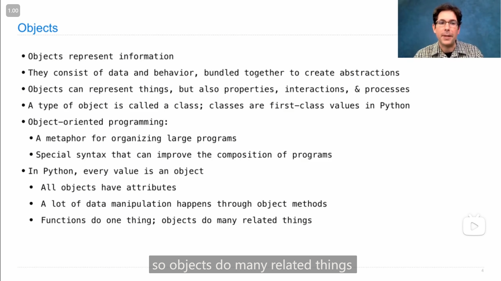

!!! quote

    ...so objects represent information, **they consist of data and behavior bundled together to create abstractions. objects can represent things, but also properties of things, or interactions, or processes, they're an extremely general concept, anything that has attributes can be represented as an object**. a type of object is called a class, classes are first class values in python, they can be passed in as arguments to functions. and objects are the heart of object oriented programming, which is an approached programming, that allows us to organize large programs using a central metaphor, that a large program is just one big thing, it's a bunch of individual objects, communicating with each other by sending messages back and forth.
    
    ---
    
    ...所以对象表示信æ¯ï¼Œ**它们由æ†ç»‘在一起的数æ®å’Œè¡Œä¸ºç»„æˆï¼Œä»¥åˆ›å»ºæŠ½è±¡ã€‚对象å¯ä»¥è¡¨ç¤ºäº‹ç‰©ï¼Œä¹Ÿå¯ä»¥è¡¨ç¤ºäº‹ç‰©çš„å±æ€§ã€äº¤äº’或过程，它们是一个é常通用的概念，任何具有å±æ€§çš„东西都å¯ä»¥è¡¨ç¤ºä¸ºå¯¹è±¡**。一ç§ç±»å‹çš„对象被称为类，类是python中的第一个类值，它们å¯ä»¥ä½œä¸ºå‚数传递给函数。对象是é¢å‘对象编程的核心，这是一ç§æ¥è¿‘编程，它å…许我们使用一个中心éšå–»æ¥ç»„织大å‹ç¨‹åºï¼Œå¤§å‹ç¨‹åºåªæ˜¯ä¸€ä»¶å¤§äº‹ï¼Œå®ƒæ˜¯ä¸€å †å•ç‹¬çš„对象，通过æ¥å›å‘é€æ¶ˆæ¯æ¥ç›¸äº’通信。

### 2

`str` 的几个方法(æ¯ç§æ•°æ®ç±»å‹ä¸‹çš„æ•°æ®éƒ½æ˜¯ä¸€ä¸ªå¯¹è±¡ï¼Œå¦‚ `int` 〠`str` )

{ loading=lazy }

### 3

我认为这是一个适åˆè®°å¿†çš„asciiç è¡¨

{ loading=lazy }

这是16进制的asciiç è¡¨ï¼š

```python
>>> a = 'A'
>>> ord(a)
65
>>> hex(ord(a))
'0x41'
```

### 4

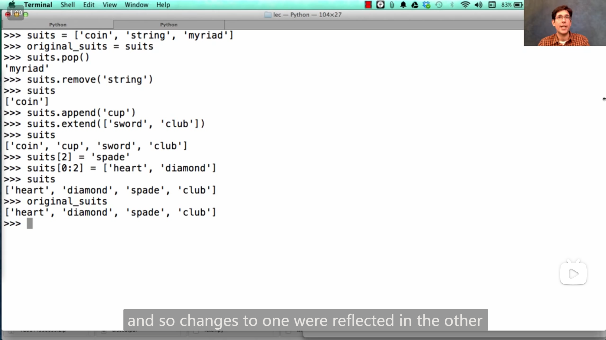{ loading=lazy }

-   一些 `list` 的方法 
-   列表å¯ä»¥åŒæ—¶ä¿®æ”¹å¤šä¸ªå€¼ï¼Œå¦‚图中 `suit[0:2] = ['heart', 'diamond']`

-   如æœå°†å€¼ä¸ºä¸€ä¸ªåˆ—表的å˜é‡èµ‹å€¼ç»™å¦ä¸€ä¸ªå˜é‡ï¼Œé‚£ä¹ˆä¸¤ä¸ªå˜é‡å…¶å®ä¸Šéƒ½æŒ‡å‘åŒä¸€ä¸ªåˆ—表对象，通过二者之一进行改动，都是对对象本身改动(显示å¦å¤–一个å˜é‡çš„值时会å‘ç°ä¹Ÿæ”¹å˜äº†)

>   { loading=lazy }
>
>   ä»ç¯å¢ƒå›¾ä¸­ä¹Ÿå¯ä»¥çœ‹åˆ°ï¼Œä¸¤ä¸ªå˜é‡æŒ‡å‘的时通过一个列表，修改都是对äºåˆ—表对象本身进行修改

### 5

{ loading=lazy }

所有指å‘åŒä¸€ä¸ªå¯¹è±¡çš„å˜é‡(的值，å³æŒ‡å‘的对象)都会被**一个改å˜(==mutation==)**å½±å“

并且，åªæœ‰*å¯å˜çš„*ç±»å‹æ‰èƒ½è¿™æ ·ï¼šlist å’Œ dictionary

>   All name thar refer to the same object are affected by a mutation
>
>   Only objects of *mutable* types can change: lists & dictionaries

### 6


å¯ä»¥ä½¿ç”¨*列表切片*å»æ¥ å¢æ·» 或 åˆ å‡ æˆ– æ›¿æ¢ åˆ—è¡¨ä¸­çš„å…ƒç´ 

```python
>>> list = [1, 2]
>>> list[4:6] = [4, 5]
>>> list
[1, 2, 4, 5]
>>> list[3:] = [6, 7, 8]
>>> list
[1, 2, 4, 6, 7, 8]
>>> list[2:] = []
>>> list
[1, 2]
```

### 7

{ loading=lazy }

-   被逗å·åˆ†éš”的几个数æ®ä¹Ÿä¼šè¢«è®¤ä¸ºå…ƒç»„(tuple) (å¯è®¤ä¸ºæ˜¯çœç•¥äº†æ‹¬å·çš„元组)
-   用一个列表æ¥è°ƒç”¨ tuple çš„æ„造函数，会得到å«æœ‰ç›¸åŒé¡ºåºçš„相åŒå…ƒç´ çš„元组
-   é€—å· `,` å¯ä»¥ä½äºå…ƒç»„的最å(应该也å¯ä»¥ä½äºåˆ—表和字典的最å，之å‰æœ‰è¯•è¿‡)
-   第三点和第一点结åˆèµ·æ¥å¯ä»¥å¾—到：`2,` å’Œ `2` 是ä¸ä¸€æ ·çš„(å‰è€…是一个元素，å者是一个整数)

### 8

元组能作为字典的 key:

```python
>>> {(1, 2): 3}
{(1, 2): 3}
```

但元组中也ä¸èƒ½å«æœ‰åˆ—表:

```python
>>> {(1, [2]): 3}
Traceback (most recent call last):
  File "<stdin>", line 1, in <module>
TypeError: unhashable type: 'list'
```

### 9

{ loading=lazy }

-   å¯å˜å¯¹è±¡å¯ä»¥é€šè¿‡ *对象çªå˜(Object mutation)* æ¥æ”¹å˜å€¼ï¼Œä¹Ÿå¯ä»¥é€šè¿‡ *Name change* æ¥æ”¹å˜(应该是直æ¥æ”¹å˜æŒ‡å‘的对象)，而ä¸å¯å˜å¯¹è±¡(如元组等)åªèƒ½é€šè¿‡ *Name change* æ¥æ”¹å˜
-   如æœä¸å¯å˜å¯¹è±¡å«æœ‰å¯å˜å¯¹è±¡çš„元素，这个å¯å˜å¯¹è±¡å¯ä»¥æ”¹å˜(个人认为，å¯ä»¥ç±»æ¯”æˆc中的指针常é‡ï¼ŒæŒ‡é’ˆæœ¬èº«ä¸æ”¹å˜ï¼Œä½†æŒ‡å‘的值能改å˜)

### 10

**æ’ç­‰è¿ç®—符(Identity Operators) `is`**

用äºåˆ¤æ–­ä¸¤ä¸ªå˜é‡æ˜¯å¦æŒ‡å‘åŒä¸€ä¸ªå¯¹è±¡

{ loading=lazy }

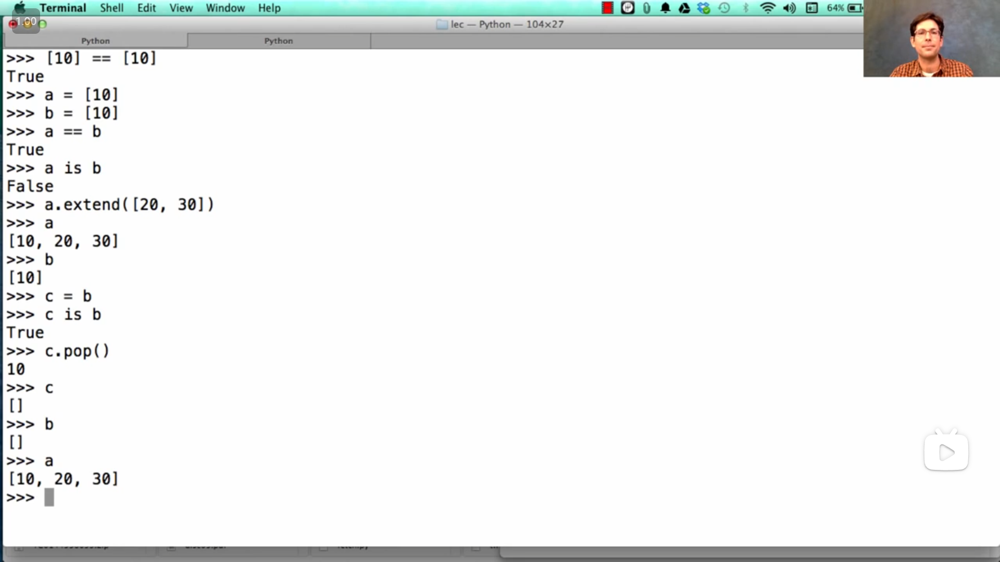{ loading=lazy }

### 11

{ loading=lazy }

åŒä¸€ä¸ªå‡½æ•°çš„默认å‚数是åŒä¸€ä¸ªå¯¹è±¡ï¼Œå³ä½¿å¤šæ¬¡è°ƒç”¨å‡½æ•°ï¼Œä½¿ç”¨é»˜è®¤å‚数时使用的都是åŒä¸€ä¸ªå¯¹è±¡

因此如æœæ˜¯å¯å˜å¯¹è±¡ç±»å‹ï¼Œè¦æ³¨æ„==修改这个对象会导致之å调用函数时(如æœä½¿ç”¨çš„è¯)默认å‚数会ä¸ä¹‹å‰ä¸ä¸€æ ·

### 12

listçš„å„ç§è¿ç®—

-   `.append()` 方法，将传入的å‚数添加é“列表尾部(如æœä¼ å…¥çš„是一个列表，就将该列表(åŒä¸€å¯¹è±¡)存入尾部)

    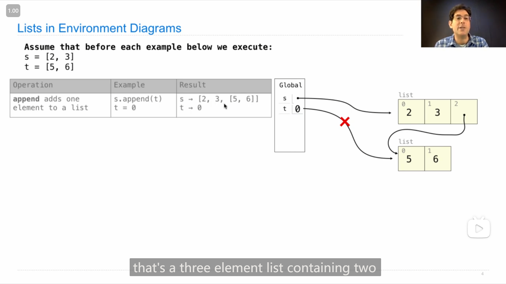{ loading=lazy }

-   `.extend()` 方法，应该是传入一个列表(元组或许也å¯ä»¥ï¼Ÿ(试了，å¯ä»¥))，将列表中的元素ä¾æ¬¡æ·»åŠ åˆ°åŸåˆ—表尾部

    { loading=lazy }

-   **加法** å’Œ **切片** ，**两者都会创建出一个新的列表**，因此下图中 `a[1] = 9` 并没有使 列表s 的元素改å˜ï¼Œä½†ç”±äº 列表a 的第三个元素是列表，åŒæ—¶ä¹Ÿæ˜¯ 列表b 的第二个元素，因此通过 列表b 修改时，也会让åŸæœ¬çš„ 列表t 改å˜

    { loading=lazy }

-   `list()` 列表的æ„造方法，å¯ä»¥ä¼ å…¥ä¸€ä¸ªåˆ—表(元组和 `range()` 也å¯ä»¥)，(如æœä¼ å…¥çš„是一个列表)会æ„建出一个ä¸åŸåˆ—表一样的**æ–°**列表

    { loading=lazy }

-   **列表切片的赋值**，å¯ä»¥å¯¹åˆ—表进行 **添加(添的比删的多)** / **替æ¢(添的删的一样多)** / **删å‡(添的比删的少)** æ“作，如下图中

    -   `s[0:0] = t` å°†t中元素加到(==å¡å…¥==)s的头部(0å·ä½ç½®)
    -   `s[3:] = t` å°†4å·å…ƒç´ åˆ å»ï¼Œå¹¶åœ¨è¯¥ä½ç½® å¡å…¥ t中的元素

    { loading=lazy }

-   -   `.pop()` 方法，ä»åˆ—表中**拿出**并**è¿”å›**最å一个元素
    -   `.remove()` 方法，传入一个å‚数，在列表中删å»ç¬¬ä¸€ä¸ªè·Ÿä¼ å…¥å‚数相åŒçš„元素
    -   用切片赋值的方法å»åˆ é™¤åˆ—表中的元素

    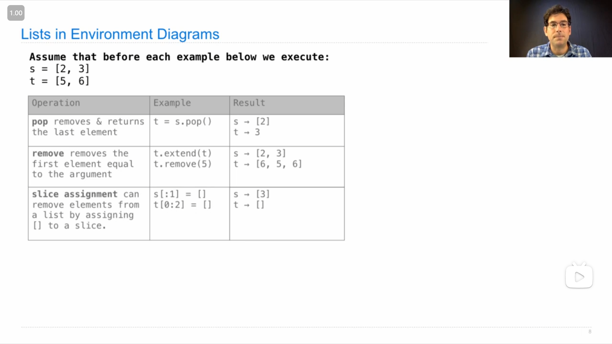{ loading=lazy }


### 13

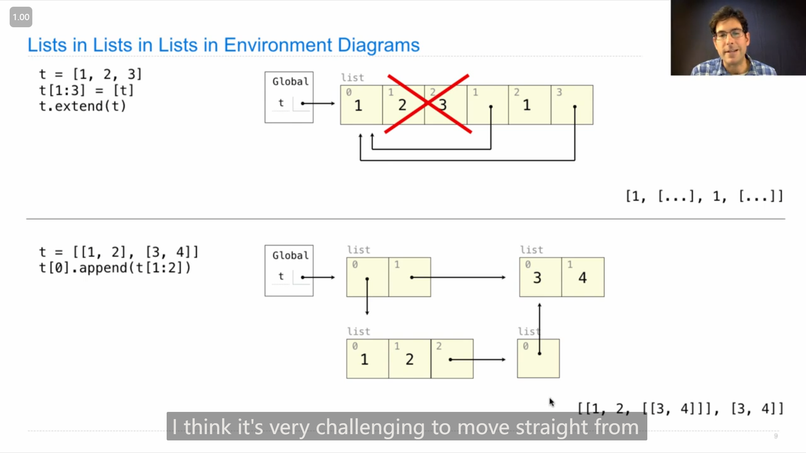{ loading=lazy }

```python
t = [1, 2, 3]
t[1:3] = [t]
t.extend(t)
```

最终得到 `t = [1, [...], 1, [...]]` 的结æœçš„åŸå› ï¼Œä¸ªäººçš„ç†è§£ï¼šç”±ä¸Šå›¾ä¸­çš„ç¯å¢ƒå›¾å¯ä»¥çœ‹åˆ°ï¼Œåˆ—表中会有 *无穷循ç¯çš„指å‘* 会一直å指å‘å‰å†ä»å‰èµ°åˆ°å，因此会得到 `...` 的东西

## Lecture 15 Q&A

### 1

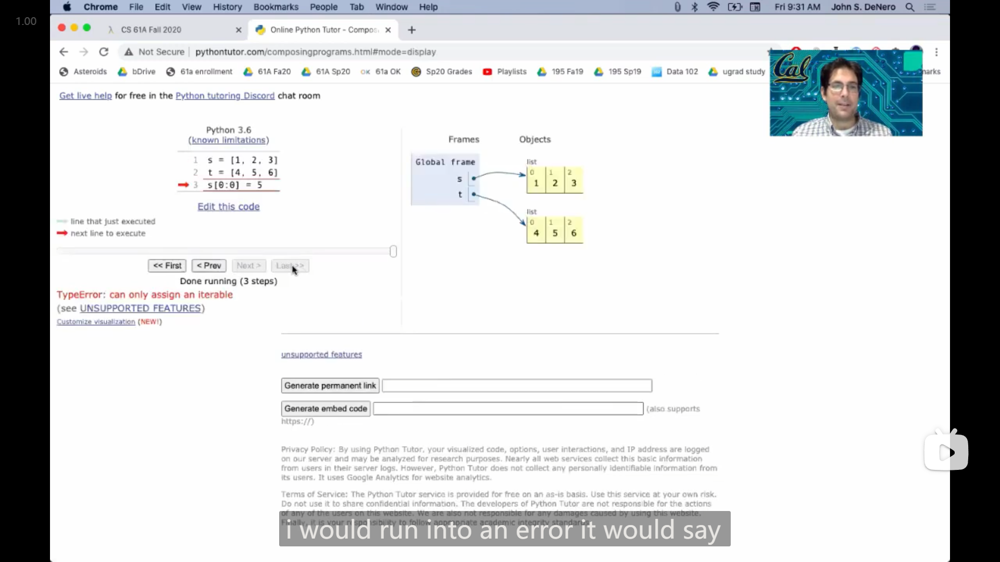{ loading=lazy }

*切片赋值*需è¦æ˜¯ä¸€ä¸ªåˆ—表(å¯èƒ½å…ƒç»„或者字符串 或其他*容器(container)*也行？)，如上图中 `s[0:0] = 5` ä¼šæŠ¥é”™ï¼Œåº”è¯¥å†™æˆ `s[0:0] = [5]`

###  2

(å¯ä»¥ä½œä¸ºä¸Šä¸€ç‚¹çš„补充)

!!! quote

    good question. so why isn't it that t becomes an element of s, and the reason is that's just how slice assignment works. it's that it takes a container full of elements and **it doesn't put that whole container in s, instead of puts the elements of that container in s**.
    
    ---
    
    好问题。为什么tä¸æˆä¸ºs的一个元素，åŸå› æ˜¯åˆ‡ç‰‡èµ‹å€¼å°±æ˜¯è¿™æ ·å·¥ä½œçš„。它å–一个装满元素的容器，**ä¸æ˜¯å°†æ•´ä¸ªå®¹å™¨æ”¾åœ¨s中，而是将该容器的元素放在s**。

### 3

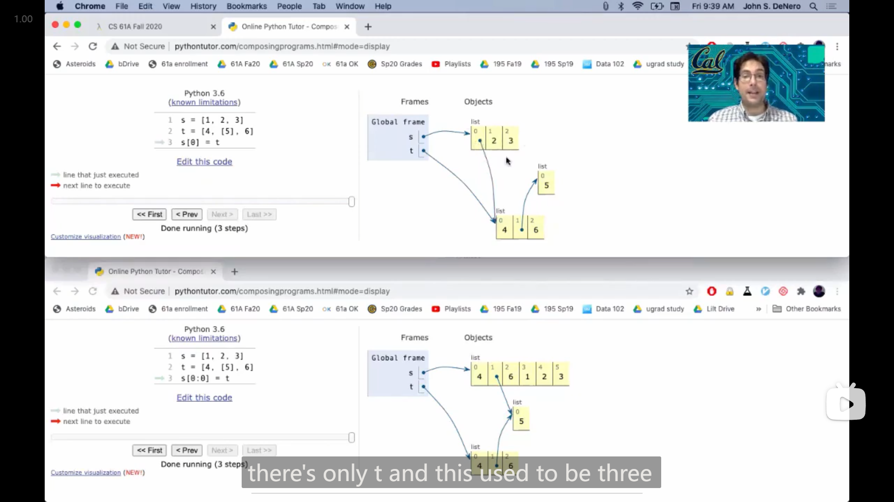{ loading=lazy }

下标选择(*selector*)ä¸ä¼šæ”¹å˜åˆ—表的长度

而切片赋值会改å˜åˆ—表的长度

!!! quote

    ...there's only t and this used to be three elements long, it's still three elements long, element assignment never changes the length of the list, it just changes what's in it. slice assignment is different, it changes the length of the list, it replaces an existing slice with some new elements.
    
    ---
    
    ...åªæœ‰t，它过å»æœ‰ä¸‰ä¸ªå…ƒç´ é•¿ï¼Œç°åœ¨ä»ç„¶æœ‰ä¸‰ä¸ªå…ƒä»¶é•¿ï¼Œå…ƒç´ èµ‹å€¼æ°¸è¿œä¸ä¼šæ”¹å˜åˆ—表的长度，它åªæ˜¯æ”¹å˜å…¶ä¸­çš„内容。切片赋值ä¸åŒï¼Œå®ƒæ”¹å˜äº†åˆ—表的长度。它用一些新元素替æ¢äº†ç°æœ‰çš„切片。

### 4

Hanyå…³äºåˆ‡ç‰‡çš„比喻

!!! quote

    ...what you're going to do, is think about it this way, so on the left hand side with the slicing you say, grab those elements, throw them out, and then take whatever's on the right hand side, and shove them into the position, so they can be longer, shorter, it doesn't matter.
    
    ---
    
    ...ä½ è¦åšçš„是这样想，所以在切片的左手边，抓ä½è¿™äº›å…ƒç´ ï¼ŒæŠŠå®ƒä»¬æ‰”出å»ï¼Œç„¶åæ‹¿èµ°å³æ‰‹è¾¹çš„任何东西，把它们æ¨åˆ°è¿™ä¸ªä½ç½®ï¼Œè¿™æ ·å®ƒä»¬å°±å¯ä»¥æ›´é•¿ã€æ›´çŸ­ï¼Œè¿™æ— å…³ç´§è¦ã€‚

### 5

å…³äºå…ƒç»„tuple存在和被使用的åŸå› 

!!! quote

    **John**:
    
    ...but the more common reason is that, people are designing their programs so that they don't have to think about mutation back, when you could just describe every function by its domain range and behavior, life was easier. i'm not saying it was easy, there were plenty of like tricky recursion problems and stuff like that, but at least you knew that, if you called a function, the only thing you really have to worry about is what does it return, not what does it change. and if you use tuples everywhere, since they can't be changed, you kind of don't have to think about what does it change, you just have to think about what it returns, whereas if you're using lists everywhere, if you're not careful, the consequence of calling a function will be not only that it changes something, or that it returns something but also that it changes something, and that's like twice as many things to keep track of when you're writing a big program, and trying to understand how all the parts work, so that's like the main reason to have some immutable version of a sequence, is just to like make sure you write programs in such a way, that nothing can change anything else, except by passing in arguments and returning them.
    
    **Hany**:
    
    it's it's called side effects, the thing that's scary when you call a function is there some side effect, that it that goes beyond just what was passed and what was returned it modified a list, and i, how did i, how do i know that, that how do i control that, and so the tuples are nice...so the tools are nice, because it's essentially like you're locking your data, right, it's giving you data security yeah.
    
    ---
    
    **John**:
    
    ...但更常è§çš„åŸå› æ˜¯ï¼Œäººä»¬æ­£åœ¨è®¾è®¡ä»–们的程åºï¼Œè¿™æ ·ä»–们就ä¸å¿…å†è€ƒè™‘çªå˜äº†ï¼Œå½“ä½ å¯ä»¥é€šè¿‡æ¯ä¸ªå‡½æ•°çš„域范围和行为æ¥æ述它时，生活就更容易了。我并ä¸æ˜¯è¯´è¿™å¾ˆå®¹æ˜“，有很多类似棘手的递归问题和类似的东西，但至少你知é“，如æœä½ è°ƒç”¨ä¸€ä¸ªå‡½æ•°ï¼Œä½ çœŸæ­£éœ€è¦æ‹…心的是它会返å›ä»€ä¹ˆï¼Œè€Œä¸æ˜¯æ”¹å˜ä»€ä¹ˆã€‚如æœä½ åœ¨ä»»ä½•åœ°æ–¹éƒ½ä½¿ç”¨å…ƒç»„，因为它们是ä¸å¯æ›´æ”¹çš„，你ä¸å¿…考虑它会改å˜ä»€ä¹ˆï¼Œä½ åªéœ€è¦è€ƒè™‘它会返å›ä»€ä¹ˆï¼Œè€Œå¦‚æœä½ åœ¨æ‰€æœ‰åœ°æ–¹éƒ½ä½¿ç”¨åˆ—表，如æœä½ ä¸å°å¿ƒï¼Œè°ƒç”¨ä¸€ä¸ªå‡½æ•°çš„åæœä¸ä»…是它会改å˜ä¸€äº›ä¸œè¥¿ï¼Œæˆ–者它会返å›ä¸€äº›ä¸œè¥¿ï¼Œå½“你在写一个大程åºï¼Œå¹¶è¯•å›¾äº†è§£æ‰€æœ‰éƒ¨åˆ†æ˜¯å¦‚何工作的时候，这就åƒæ˜¯éœ€è¦è·Ÿè¸ªçš„事情的两å€ï¼Œæ‰€ä»¥è¿™å°±åƒæ˜¯æ‹¥æœ‰ä¸€ä¸ªä¸å¯å˜ç‰ˆæœ¬çš„åºåˆ—的主è¦åŸå› ï¼Œå°±æ˜¯è¦ç¡®ä¿ä½ ä»¥è¿™æ ·çš„æ–¹å¼å†™ç¨‹åºï¼Œé™¤äº†ä¼ é€’å‚数并返å›å®ƒä»¬ä¹‹å¤–，没有什么能改å˜å…¶ä»–任何事情。
    
    **Hany**:
    
    它被称为副作用，当你调用一个函数时，å¯æ€•çš„是有一些副作用，它超出了传递和返å›çš„内容，它修改了一个列表，我，我是æ€ä¹ˆçŸ¥é“的，我是如何æ§åˆ¶çš„，所以元组很好...所以这些工具很好，因为它本质上就åƒä½ åœ¨é”定你的数æ®ï¼Œå¯¹å§ï¼Œå®ƒç»™äº†ä½ æ•°æ®å®‰å…¨æ€§ã€‚

### 6

Hanyå’ŒJohnå…³äº *ç±»(Class)* å’Œ *对象(Object)* 的区别的解释

(å°† *ç±»* 比作 *è“图* ，将 *对象* 比作 *ä¾æ®è“图修建好的具体的房å­*)

!!! quote

    **Hany**:
    
    so the question is what is the difference between a class and an object. the class is, so here's how i think about
    it, think about a blueprint for a house, is the class, and the house is the thing you build from the blueprint. okay so i can have a class date, um that is the sort of the definition of the data i'm storing, and the functionality of it, and then i can instantiate, i can create as many of those objects as i want, so they're essentially realizations of the thing that you've created, so the class is, just it's sort of like a definition, nothing exists, and then when you create an object, well now i can sort of do things with it. so there's a class of type list, and then i can define lists, i can define one list, two lists, 50 lists whatever i want, yeah.
    
    **John**:
    
    yeah, and that analogy is nice because you can live in a house, but you can't live in a blueprint, like if you just have the class, you can't really do anything with it, until you construct one of the things that it describes, build the house and then you can go live.
    
    **Hany**:
    
    and you can go live in it, right. and it's sort of like a function definition, right, you define a function, but doesn't do anything, it's just a definition, it just hangs out in the global frame somewhere, but then when you call it, ah now we're actually doing something.
    
    ---
    
    **Hany**:
    
    所以问题是类和对象之间的区别是什么。课堂是这样的，所以我是这样想的
    想想房å­çš„è“图，它就是阶级，房å­å°±æ˜¯ä½ æ ¹æ®è“图建造的东西。好的，我å¯ä»¥æœ‰ä¸€ä¸ªç±»çš„日期，嗯，这是我存储的数æ®çš„定义，以åŠå®ƒçš„功能，然å我å¯ä»¥å®ä¾‹åŒ–，我å¯ä»¥åˆ›å»ºæˆ‘想è¦çš„ä»»æ„多的对象，所以它们本质上是你创建的东西的å®ç°ï¼Œæ‰€ä»¥ç±»æ˜¯ï¼Œå®ƒæœ‰ç‚¹åƒä¸€ä¸ªå®šä¹‰ï¼Œä»€ä¹ˆéƒ½ä¸å­˜åœ¨ï¼Œç„¶å当你创建一个对象时，ç°åœ¨æˆ‘å¯ä»¥ç”¨å®ƒåšä¸€äº›äº‹æƒ…了，所以有一类类å‹åˆ—表，然å我å¯ä»¥å®šä¹‰åˆ—表，我å¯ä»¥å®šä¹‰ä¸€ä¸ªåˆ—表，两个列表，50个列表，我想è¦çš„，是的。
    
    **John**:
    
    是的，这个比喻很好，因为你å¯ä»¥ä½åœ¨æˆ¿å­é‡Œï¼Œä½†ä½ ä¸èƒ½ä½åœ¨è“图里，就åƒä½ åªæœ‰è¯¾ï¼Œä½ çœŸçš„ä¸èƒ½ç”¨å®ƒåšä»»ä½•äº‹æƒ…，直到你建造了它æ述的东西之一，建造了房å­ï¼Œç„¶åä½ å°±å¯ä»¥ç”Ÿæ´»äº†ã€‚
    
    **Hany**:
    
    ä½ å¯ä»¥ä½åœ¨é‡Œé¢ï¼Œå¯¹å§ã€‚这有点åƒå‡½æ•°å®šä¹‰ï¼Œå¯¹å§ï¼Œä½ å®šä¹‰äº†ä¸€ä¸ªå‡½æ•°ï¼Œä½†ä»€ä¹ˆéƒ½ä¸åšï¼Œå®ƒåªæ˜¯ä¸€ä¸ªå®šä¹‰ï¼Œå®ƒåªæ˜¯æŒ‚在全局框æ¶çš„æŸä¸ªåœ°æ–¹ï¼Œä½†å½“你调用它时，啊，ç°åœ¨æˆ‘们å®é™…上在åšä¸€äº›äº‹æƒ…。

## HW 03

### 1

**å‡å°‘递归中的冗余部分**

!!! quote

    **Arms-length recursion (sidenote)**
    
    Before we get started, a quick comment on recursion with tree data structures. Consider the following function.
    
    ```python
    def min_depth(t):
        """A simple function to return the distance between t's root and its closest leaf"""
        if is_leaf(t):
            return 0 # Base case---the distance between a node and itself is zero
        h = float('inf') # Python's version of infinity
        for b in branches(t):
            if is_leaf(b): return 1 # !!!
            h = min(h, 1 + min_depth(b))
        return h
    ```
    
    The line flagged with `!!!` is an "arms-length" recursion violation. Although our code works correctly when it is present, by performing this check we are doing work that should be done by the next level of recursion—we already have an if-statement that handles any inputs to `min_depth` that are leaves, so we should not include this line to eliminate redundancy in our code.
    
    ```python
    def min_depth(t):
        """A simple function to return the distance between t's root and its closest leaf"""
        if is_leaf(t):
            return 0
        h = float('inf')
        for b in branches(t):
            # Still works fine!
            h = min(h, 1 + min_depth(b))
        return h
    ```
    
    Arms-length recursion is not only redundant but often complicates our code and obscures the functionality of recursive functions, making writing recursive functions much more difficult. We always want our recursive case to be handling one and only one recursive level.
    
    ---
    
    **臂长递归 (æ—注)**
    
    在我们开始之å‰ï¼Œå…ˆç®€è¦ä»‹ç»ä¸€ä¸‹æ ‘æ•°æ®ç»“æ„的递归。考虑以下函数。
    
    ```python
    def min_depth(t):
        """A simple function to return the distance between t's root and its closest leaf"""
        if is_leaf(t):
            return 0 # Base case---the distance between a node and itself is zero
        h = float('inf') # Python's version of infinity
        for b in branches(t):
            if is_leaf(b): return 1 # !!!
            h = min(h, 1 + min_depth(b))
        return h
    ```
    
    该行标记为 `!!!` 是一ç§â€œè‡‚é•¿â€é€’归冲çªã€‚尽管我们的代ç åœ¨å­˜åœ¨æ—¶å¯ä»¥æ­£å¸¸å·¥ä½œï¼Œä½†é€šè¿‡æ‰§è¡Œæ­¤æ£€æŸ¥ï¼Œæˆ‘们正在åšä¸‹ä¸€çº§é€’归应该åšçš„工作——我们已ç»æœ‰äº†ä¸€ä¸ªif语å¥ï¼Œå®ƒå¤„ç† `min_depth` 的任何å¶å­è¾“入，所以我们ä¸åº”该包括这一行æ¥æ¶ˆé™¤ä»£ç ä¸­çš„冗余。
    
    ```python
    def min_depth(t):
        """A simple function to return the distance between t's root and its closest leaf"""
        if is_leaf(t):
            return 0
        h = float('inf')
        for b in branches(t):
            # Still works fine!
            h = min(h, 1 + min_depth(b))
        return h
    ```
    
    臂长递归ä¸ä»…是多余的，而且ç»å¸¸ä½¿æˆ‘们的代ç å¤æ‚化，并模糊递归函数的功能，使编写递归函数å˜å¾—更加困难。我们总是希望我们的递归情况是处ç†ä¸€ä¸ªå¹¶ä¸”åªæœ‰ä¸€ä¸ªé€’归级别。

### 2

Q2 中我将计算力矩的代ç ç‹¬ç«‹æˆäº†ä¸€ä¸ªå‡½æ•°

```python
def balanced(m):
    ...
    def torque(s):
        assert is_arm(s), "must call torque on a arm"
        return length(s) * total_weight(end(s))
    ...
```

??? note "code"

    ```python
    def balanced(m):
        """Return whether m is balanced.
    
        >>> t, u, v = examples()
        >>> balanced(t)
        True
        >>> balanced(v)
        True
        >>> w = mobile(arm(3, t), arm(2, u))
        >>> balanced(w)
        False
        >>> balanced(mobile(arm(1, v), arm(1, w)))
        False
        >>> balanced(mobile(arm(1, w), arm(1, v)))
        False
        >>> from construct_check import check
        >>> # checking for abstraction barrier violations by banning indexing
        >>> check(HW_SOURCE_FILE, 'balanced', ['Index'])
        True
        """
        "*** YOUR CODE HERE ***"
        def torque(s):
            assert is_arm(s), "must call torque on a arm"
            return length(s) * total_weight(end(s))
    
        if is_planet(m):
            return True
        else:
            if torque(left(m)) != torque(right(m)):
                return False
            else:
                return balanced(end(left(m))) and balanced(end(right(m)))
    ```

### 3

Q5中，使用æ„造一个helper函数æ¥ä¼ é€’结æœåˆ—表

```python
def preorder(t):
    ...
    def preorder_helper(t, res):
        res += [label(t)]
        for branch in branches(t):
            res += preorder_helper(branch, [])
        return res
    ...
```

??? note "code"

    ```python
    def preorder(t):
        """Return a list of the entries in this tree in the order that they
        would be visited by a preorder traversal (see problem description).
    
        >>> numbers = tree(1, [tree(2), tree(3, [tree(4), tree(5)]), tree(6, [tree(7)])])
        >>> preorder(numbers)
        [1, 2, 3, 4, 5, 6, 7]
        >>> preorder(tree(2, [tree(4, [tree(6)])]))
        [2, 4, 6]
        """
        "*** YOUR CODE HERE ***"
        def preorder_helper(t, res):
            res += [label(t)]
            # if is_leaf(t):
            #     return res
            # else:
            #     for branch in branches(t):
            #         res += preorder_helper(branch, res)
            #     return res
    
            for branch in branches(t):
                res += preorder_helper(branch, [])
            return res
        return preorder_helper(t, [])
    ```

### 4

Q6

(居然能åªç”¨ä¸€è¡Œ)

```python
def has_path(t, word):
    assert len(word) > 0, 'no path for empty word.'
    "*** YOUR CODE HERE ***"
    return word[0] == label(t) and True if len(word) == 1 else True in [has_path(b, word[1:]) for b in branches(t)]
```

### 5

Q8

题目是需è¦æ±‚xå’Œy的差值的范围

方法就是将yå–负数，上/下界的负值作为新下/上界，然å使用之å‰çš„加法函数

(ç”±äºæ²¡ç†è§£é¢˜ç›®æ„æ€è¢«å¡äº†å¾ˆä¹…...)

```python
def sub_interval(x, y):
    """Return the interval that contains the difference between any value in x
    and any value in y."""
    "*** YOUR CODE HERE ***"
    return add_interval(x, interval(-upper_bound(y), -lower_bound(y)))
```

## Homework 3 Hints

### 1

助教在æ示Q5时，也说到了，**è¦å‡è®¾/å‡æƒ³é€’归能返å›æ­£ç¡®çš„结æœ**

!!! quote

    so when we look at this problem. we see that the preordering of any tree always starts at the root, so it makes sense to make this our starting point, we want to add the current label to our pre ordering. so we want to maintain a list of the pre order, and we want to add our current label to the first element in our pre ordering. after we do that, we want to go through all of our children, so remember that we always go down the left most child, all the way to the right most child, in order. so we do pre order of this child, and then we do pre order of this left child, and then we do pre order the right child. so it makes sense to recurs down each child from left most to right most. and think about what you want to do with the recursive result, **remember that by the cursive leap of faith, we, remember that the pre ordering of any child, is assumed to return the correct value**. so think about what you expect the pre ordering of any child to be, and think about what you want to do with our result, and just a hint, that the call of pre order on any child is going to return a list, because pre ordering returns a list, based on the numbers there. so think about what you want to do the recursive result, and then maybe appending them or extending them, you want to return the pre ordering. so first you add the current label, then you add the results from each pre order on each child, and then we return the pre ordering of all of them. after you do all of this think about your base case, is there a base case you need to handle, maybe when the tree is a leaf, or maybe something similar to that. and I think that's enough for this problem good luck.
    
    ---
    
    在解决这个问题时，我们å¯ä»¥çœ‹åˆ°ï¼Œä»»ä½•æ ‘çš„å‰åºéå†å§‹ç»ˆä»æ ¹èŠ‚点开始，因此将根节点作为我们的起始点是有æ„义的。我们希望将当å‰èŠ‚点的标签添加到我们的å‰åºéå†åˆ—表中，所以我们需è¦ç»´æŠ¤ä¸€ä¸ªå‰åºéå†çš„列表，并将当å‰èŠ‚点的标签添加到å‰åºéå†åˆ—表的第一个ä½ç½®ã€‚在这之å，我们需è¦éå†æ‰€æœ‰çš„å­èŠ‚点。请记ä½ï¼Œæˆ‘们总是ä»æœ€å·¦è¾¹çš„å­èŠ‚点开始，一直éå†åˆ°æœ€å³è¾¹çš„å­èŠ‚点，按顺åºè¿›è¡Œã€‚因此，我们首先对最左边的å­èŠ‚点进行å‰åºéå†ï¼Œç„¶å对左å­èŠ‚点进行å‰åºéå†ï¼Œæ¥ç€å¯¹å³å­èŠ‚点进行å‰åºéå†ã€‚这样，ä»æœ€å·¦è¾¹åˆ°æœ€å³è¾¹çš„å­èŠ‚点递归调用是有æ„义的。æ¥ä¸‹æ¥ï¼Œè€ƒè™‘如何处ç†é€’归结æœã€‚**请记ä½ï¼ŒæŒ‰ç…§é€’归的“跳跃信仰â€ï¼Œæˆ‘们å‡å®šä»»ä½•å­èŠ‚点的å‰åºéå†éƒ½è¿”å›äº†æ­£ç¡®çš„值**。因此，需è¦æ€è€ƒå¯¹é€’归结æœè¦åšä»€ä¹ˆï¼Œè®°ä½è°ƒç”¨å­èŠ‚点的å‰åºéå†ä¼šè¿”å›ä¸€ä¸ªåˆ—表，根æ®è¿™ä¸€ç‚¹æ€è€ƒå¦‚何处ç†é€’归结æœã€‚一ç§å¯èƒ½çš„æ–¹å¼æ˜¯å°†å®ƒä»¬æ·»åŠ æˆ–扩展到当å‰å‰åºéå†åˆ—表中。最终，我们需è¦è¿”å›å‰åºéå†çš„结æœã€‚具体æ¥è¯´ï¼Œæ“作顺åºæ˜¯ï¼šé¦–先添加当å‰æ ‡ç­¾ï¼Œç„¶å添加æ¯ä¸ªå­èŠ‚点的å‰åºéå†ç»“æœï¼Œæœ€åè¿”å›æ‰€æœ‰å­èŠ‚点的å‰åºéå†ç»“æœã€‚在解决这个问题时，还需è¦è€ƒè™‘基本情况。是å¦æœ‰éœ€è¦å¤„ç†çš„基本情况，例如当树是å¶å­èŠ‚点时，或者类似情况。在考虑完所有这些方é¢å，就å¯ä»¥ç€æ‰‹è§£å†³é—®é¢˜äº†ã€‚ç¥ä½ å¥½è¿ï¼

## Lecture 16 Mutable Functions

### 1

{ loading=lazy }

**函数中的赋值语å¥ï¼Œåªèƒ½å½±å“到函数所在的frame**，ä¸èƒ½å½±å“到æ¯æ¡†æ¶é‡Œçš„å˜é‡

### 2

{ loading=lazy }

**==`nonlocal` 语å¥==**

感觉是能在一个函数中声æ˜è¦ä½¿ç”¨ ***é当å‰æ¡†æ¶å†…çš„å˜é‡(å)***，ä»è€Œä¹‹å在使用的时候，就ä¸ä¼šåœ¨å½“å‰çš„框æ¶å†…创建这个å˜é‡ï¼Œè€Œæ˜¯åœ¨ä¸Šçº§æ¡†æ¶ä¸­å¯»æ‰¾

### 3

{ loading=lazy }

**在函数体中，å称的所有å®ä¾‹éƒ½å¿…须引用åŒä¸€æ¡†æ¶**

所以ä¸èƒ½åƒå›¾é‡Œé¢ä¸€æ ·ï¼Œä¸€å¼€å§‹ä½¿ç”¨äº†æ¯æ¡†æ¶ä¸­çš„值--绑定了æ¯æ¡†æ¶ä¸­çš„å˜é‡ï¼Œè€Œååˆåœ¨**未使用 `nonlocal` 语å¥**的情况下，进行赋值

### 4

å¦ä¸€ç§å®ç°ä½¿ç”¨å¹¶æ›´æ”¹æ¯æ¡†æ¶ä¸­çš„æ•°æ®å¹¶ä¸”**ä¸ä½¿ç”¨ `nonlocal` 语å¥**的方法

{ loading=lazy }

在æ¯æ¡†æ¶ä¸­ä½¿ç”¨å¯æ”¹å˜çš„æ•°æ®ç±»å‹ï¼Œå¦‚列表或字典，然å在å­å‡½æ•°ä¸­å¯¹å…¶çš„元素进行更改，以达到需求

### 5

*å‚考é€æ˜åº¦ (Referential Transparency)*

{ loading=lazy }

这个概念好åƒæ˜¯æŒ‡ï¼Œå¦‚æœè¡¨è¾¾å¼æ˜¯*å‚考é€æ˜(referentially transparent)*的，那么在**ç›´æ¥ç”¨ä¸è¿”å›å€¼ç›¸åŒçš„值替æ¢è¡¨è¾¾å¼ä¸­çš„函数**å，能**得到和åŸæ¥ä¸€æ ·çš„结æœ**，å³**ä¸æ”¹å˜ç¨‹åºçš„æ„义(not change the meaning of a program)**

而*çªå˜(mutation)*å¯èƒ½ä¼šç ´å表达å¼çš„å‚考é€æ˜ï¼Œå› ä¸º**çªå˜å¯ä»¥æ”¹å˜ç¯å¢ƒ(中的å±æ€§/值)**，

比如

```python
def f(x):
    x = 4
    def g(y):
        def h(z):
            nonlocal x
            x = x + 1
            return x + y + z
        return h
    return g
a = f(1)
b = a(2)
total = b(3) + b(4)
```

è¿è¡Œå‡ºæ¥ï¼Œ`total` 结æœæ˜¯22(10+12)

但如æœå°† `b(3)` 替æ¢æˆ `10`

```python
def f(x):
    x = 4
    def g(y):
        def h(z):
            nonlocal x
            x = x + 1
            return x + y + z
        return h
    return g
a = f(1)
b = a(2)
total = 10 + b(4)
```

`total` 结æœå°±å˜æˆäº†21(10+11)

这是由äºï¼Œå‰è€… `b(3)` 在调用 `h` 函数的时候，改动了æ¯æ¡†æ¶ä¸­çš„ `x` 的值，使得两处代ç ä¸­ `b(4)` 在调用 `h` 函数时，使用的值ä¸ä¸€æ ·ï¼Œå› æ­¤`total` 结æœå°±ä¸ä¸€æ ·

### 6

这节课最å，教æˆæ到的一题

{ loading=lazy }

æ•™æˆæ到，在开始åšè¿™é¢˜æ—¶ï¼Œå¯ä»¥å¯»æ‰¾base cases是什么，

然åä»è¾“入示例中å¯ä»¥å¾—到，base case是当其中一个为零的时候

---

开始写代ç æ—¶ï¼Œæˆ‘是先注æ„到最åçš„ `return` 的语å¥çš„å½¢å¼ï¼Œå†è”想到教æˆè¯´åˆ°çš„ *tree recursion* ，所以我感觉括å·å¤–应该是一个 `min` ，然å括å·é‡Œé¢æ˜¯æ¯”较两ç§é€’å½’è¿”å›çš„值哪个更å°ï¼Œæ‰€ä»¥æˆ‘就暂且填上：

```python
def combo(a, b):
    if a == 0 or b == 0:
        return a + b
    elif ...:
        return combo(...)
    return min(combo(a // 10, b) * 10 + a % 10, combo(a, b // 10) * 10 + b % 10)
```

但是 `elif` 之å填什么一直没想到，(因为ä¸çŸ¥é“有相åŒæ•°å­—还有ä¸åŒçš„æ•°å­—è¦æ€ä¹ˆåˆ†å‰²æ€ä¹ˆå¤„ç†ï¼Œä»¥åŠaåªå‰©ä¸€ç§æ•°å­—的情况下，æ€ä¹ˆåˆ¤æ–­æ”¾åœ¨bå‰é¢è¿˜æ˜¯åé¢ï¼Œæ„Ÿè§‰è¦åˆ†é常多ç§æƒ…况特别å¤æ‚，之åå‘ç°å…¶å®æƒ…况很简å•...)

直到三天之å

开始继续æ€è€ƒè¿™é¢˜æ—¶ï¼Œæˆ‘开始æ€è€ƒåˆ°è¾¾ base case 的最å一ç§æƒ…å†µï¼Œå³ a 是个一ä½æ•°ï¼Œè€Œ b 是 321，想到如æœaå’ŒbæŸä¸ªæ•°ä½ç›¸åŒï¼Œé‚£ä¹ˆå¯ä»¥æƒ³*快速æ’åº*一样将b分æˆä¸¤è¾¹å»é€’å½’(但是好åƒå¯¹æ•°å­—分割很难æ“作起æ¥)，然å由分割就进一步开始想aå’Œb的最å一ä½å»æ¯”较(å°†b分割æˆå‰é¢å’Œæœ€å一ä½)，那么(è¦ä½¿å¾—结æœæœ€å°)应该是将大的那个放在最å，所以开始å°è¯•ç¼–写代ç 

但是å‘ç° `elif` åå¡«ä¸ä¸Šä¸œè¥¿ï¼Œæ‰€ä»¥æ‰“ç®—å…ˆä¸æŒ‰å®ƒæ供的结æ„自己写：

```python
def combo(a, b):
    if a == 0 or b == 0:
        return a + b
    else:
        if a % 10 < b % 10:
            ...
        else:
            ...
    # elif ...:
    #     return combo(...)
    # return min(combo(a // 10, b) * 10 + a % 10, combo(a, b // 10) * 10 + b % 10)
```

==然åå‘ç° `...` 处的代ç å°±æ˜¯æœ€å `return` 中之å‰å†™çš„代ç ï¼Œå¹¶ä¸”能å®ç°å¯¹åº”的处ç†åŠŸèƒ½==，所以 `elif` å应该考虑的是a b最å一ä½ç›¸åŒçš„情况，故

```python
def combo(a, b):
    """Return the smallest integer with all of the digits of a and b (in order).

    >>> combo(531, 432)    # 45312 contains both _531_ and 4_3_2.
    45312
    >>> combo(531, 4321)   # 45321 contains both _531_ and 4_321.
    45321
    >>> combo(1234, 9123)  # 91234 contains both _1234 and 9123_.
    91234
    >>> combo(0, 321)      # The number 0 has no digits, so 0 is not in the result.
    321
    """
    if a == 0 or b == 0:
        return a + b
    elif a % 10 == b % 10:
        return combo(a // 10, b // 10) * 10 + a % 10
    return min(combo(a // 10, b) * 10 + a % 10, combo(a, b // 10) * 10 + b % 10)
```

然ååŠä¿¡åŠç–‘地进行了测试，å‘ç°è¿™ç«Ÿç„¶å°±æ˜¯ç­”案

最å总结åæ€äº†ä¸€ä¸‹ï¼Œé€’归还是**得牢记è¦å‡è®¾å‡½æ•°èƒ½è¿”å›æ‰€éœ€è¦çš„东西**(我感觉这样å¯èƒ½å°±æ›´å¥½èƒ½æƒ³åˆ°åˆ†å‰²å‡ºæœ€å一ä½)

## Lecture 16 Q&A

### 1

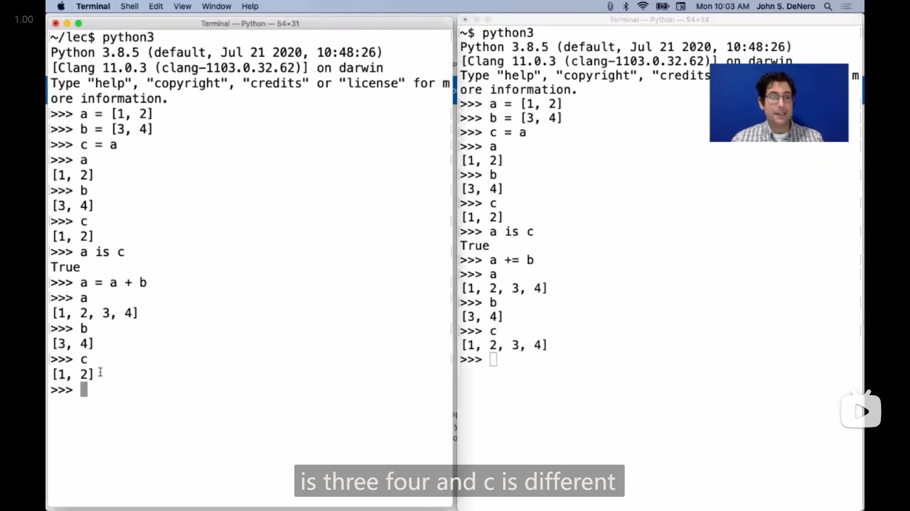{ loading=lazy }

列表的 `+=` 和 `=` 的一些区别，

图中左侧，`a = a + b` å¯ä»¥ç†è§£æˆï¼Œ**先是 `a + b` 得到一个新的列表，然åå°†å˜é‡å `a` 绑定到这个新的列表上**，所以 `c` 绑定的åŸåˆ—表没有被改å˜

而å³ä¾§ï¼Œ`a += b` å¯ä»¥ç±»æ¯”æˆ `a.extend(b)` ，是**对 `a` 指å‘的列表本身进行了修改**，所以通过 `c` 也能看到列表改å˜äº†

## Lab 06

### 1

Q4，我采用先å–出和 `entry` 相åŒçš„元素的下标存在一个列表中，å†å°†è¿™äº›ä¸‹æ ‡åº”用到 `insert` 方法上

```python
def insert_items(lst, entry, elem):
    entries_indices = [i for i in range(len(lst)) if lst[i] == entry]
    for index in entries_indices:
        lst.insert(index, elem)
    return lst
```

但是å‘ç°æœ‰ä¸¤ä¸ªåœ°æ–¹éœ€è¦ä¿®æ­£ï¼š

-   æ’入时，由äºæ˜¯åœ¨ç›¸åº”的元素之åæ’入，所以 `index` 需è¦æ”¹æˆ `index + 1` 

-   ç”±äºå¦‚æœæŒ‰ç…§ä»å‰åˆ°åæ’入新的元素，那么在å‰é¢æ’入时，会引起åé¢çš„元素的下标的改å˜ï¼Œæ‰€ä»¥æˆ‘改æˆä»åå¾€å‰æ’入，å³æŠŠå­˜å‚¨ä¸‹æ ‡çš„列表顺åºå过æ¥

    ```python
        entries_indices = entries_indices[::-1]
    ```

??? note "code"

    ```python
    def insert_items(lst, entry, elem):
        """
        >>> test_lst = [1, 5, 8, 5, 2, 3]
        >>> new_lst = insert_items(test_lst, 5, 7)
        >>> new_lst
        [1, 5, 7, 8, 5, 7, 2, 3]
        >>> large_lst = [1, 4, 8]
        >>> large_lst2 = insert_items(large_lst, 4, 4)
        >>> large_lst2
        [1, 4, 4, 8]
        >>> large_lst3 = insert_items(large_lst2, 4, 6)
        >>> large_lst3
        [1, 4, 6, 4, 6, 8]
        >>> large_lst3 is large_lst
        True
        """
        "*** YOUR CODE HERE ***"
        entries_indices = [i for i in range(len(lst)) if lst[i] == entry]
        entries_indices = entries_indices[::-1]
        for index in entries_indices:
            lst.insert(index + 1, elem)
        return lst
    ```

## Lecture 17 Iterations

### 1

{ loading=lazy }

-   `iter()` 传入一个å¯ä»¥è¿­ä»£çš„æ•°æ®(比如列表)，然åè¿”å›ä¸€ä¸ªå¯¹åº”的迭代器(我感觉应该是一个 `iter` ç±»å‹çš„æ„造函数)，并且迭代器的åˆå§‹çš„ä½ç½®ä½äºæ•°æ®(如列表)的起始端(第一个元素之å‰)，并且如æœä¸¤æ¬¡å¯¹åŒä¸€ä¸ªåˆ—表调用 `iter()` 函数，返å›çš„是两个ä¸åŒçš„迭代器，å³

    ```python
    >>> s = [3, 4, 5]
    >>> t = iter(s)
    >>> next(t)
    3
    >>> next(t)
    4
    >>> u = iter(s)
    >>> next(u)
    3
    >>> next(t)
    5
    >>> next(u)
    4
    ```

-   `next()` **传入一个迭代器**(ä¼ å…¥å¯è¿­ä»£æ•°æ®ä¼šæŠ¥é”™)，返å›è¿­ä»£å™¨çš„å一个元素，并å‘å‰ç§»åŠ¨ä¸€ä¸ªä½ç½®ï¼Œå³ä¸‹æ¬¡å†è°ƒç”¨ `next()` 并传入åŒä¸€ä¸ªè¿­ä»£å™¨ï¼Œè¿”å›çš„会是å¦ä¸€ä¸ªå…ƒç´ 

### 2

如æœç”¨ `list()` å»ä¼ å…¥ä¸€ä¸ªè¿­ä»£å™¨ï¼Œé‚£ä¹ˆä¼šè¿”å›ä¸€ä¸ªåˆ—表包å«è¿­ä»£å™¨ä¹‹å的所有元素，**ä¸åŒ…å«ä¹‹å‰çš„，并且会将迭代器的ä½ç½®ç§»åŠ¨åˆ°åˆ—表的末端**

```python
>>> s = [[1, 2], 3, 4, 5]
>>> s
[[1, 2], 3, 4, 5]
>>> t = iter(s)
>>> next(t)
[1, 2]
>>> next(t)
3
>>> list(t)
[4, 5]
>>> next(t)
Traceback (most recent call last):
  File "<stdin>", line 1, in <module>
StopIteration
```

### 3

>   A dictionary, its keys, its values, and its items are all iterable values

`dict.keys` `dict.values` `dict.items` 都是å¯ä»¥è¿­ä»£çš„对象

-   如æœå¯¹ `iter()` ç›´æ¥ä¼ å…¥ä¸€ä¸ªå­—典，返å›çš„迭代器对应的是keys的迭代器
-   对 `next()` ä¼ å…¥ `dict.items` 对应的迭代器，返å›çš„是由字典的key和对应的value组æˆçš„二元元组

```python
>>> d = {'one': 1, 'two': 2, 'three': 3}
>>> d['zero'] = 0
>>> k = iter(d.keys())  # or iter(d)
>>> next(k)
'one'
>>> next(k)
'two'
>>> next(k)
'three'
>>> next(k)
'zero'
>>> v = iter(d.values())
>>> next(v)
1
>>> next(v)
2
>>> next(v)
3
>>> next(v)
0
>>> i = iter(d.items())
>>> next(i)
('one', 1)
>>> next(i)
('two', 2)
>>> next(i)
('three', 3)
>>> next(i)
('zero', 0)
```

### 4

如æœæ”¹å˜ä¸€ä¸ª**å­—å…¸**的大å°(ç»è¿‡æµ‹è¯•ï¼Œç»™å­—典添加元素，ä¸ä¼šä½¿å¾—之å‰æ„建的迭代器失效)，比如添加一组新的键值对，或者删å»ï¼Œä¼šä½¿å¾—之å‰æ„建的迭代器ä¸èƒ½ä½¿ç”¨(keys, values, items都ä¸èƒ½)

```python
>>> d = {'one': 1, 'two': 2}
>>> k = iter(d)
>>> next(k)
'one'
>>> d['zero'] = 0
>>> next(k)
Traceback (most recent call last):
  File "<stdin>", line 1, in <module>
RuntimeError: dictionary changed size during iteration
>>> d
{'one': 1, 'two': 2, 'zero': 0}
>>> k = iter(d)
>>> next(k)
'one'
>>> next(k)
'two'
>>> d['zero'] = 5
>>> next(k)
'zero'
```

而如æœåªæ˜¯**修改已存在的键值对的值**，ä¸ä¼šä½¿å¾—之å‰æ„建的迭代器失效(values, items对应的迭代器在修改了字典之åè¿æ¥çš„会是修改之å的值)

### 5

`for` 语å¥ä¹Ÿå¯ä»¥ä½¿ç”¨è¿­ä»£å™¨ï¼Œä½†åªæ˜¯ä»è¿­ä»£å™¨å½“å‰çš„ä½ç½®å¼€å§‹ï¼Œå¹¶ä¸”会将迭代器的ä½ç½®ç§»åŠ¨åˆ°æœ€å，(感觉跟第二点很相åƒ)

```python
>>> r = range(3, 6)
>>> ri = iter(r)
>>> next(ri)
3
>>> for i in ri:
...     print(i)
...
4
5
>>> for i in ri:
...     print(i)
...
>>> next(ri)
Traceback (most recent call last):
  File "<stdin>", line 1, in <module>
StopIteration
```

### 6

{ loading=lazy }

一些会返å›è¿­ä»£å™¨çš„ built-in functions

**==上图中的 `iterable` 也包括迭代器，所以迭代器也算作å¯è¿­ä»£å¯¹è±¡==**

**John的个Demo**

1.   >   ```python
     >   >>> bcd = ['b', 'c', 'd']
     >   >>> [x.upper() for x in bcd]
     >   ['B', 'C', 'D']
     >   >>> map(lambda x: x.upper(), bcd)
     >   <map object at 0x000002597B19F730>
     >   >>> m = map(lambda x: x.upper(), bcd)
     >   >>> next(m)
     >   'B'
     >   >>> next(m)
     >   'C'
     >   >>> next(m)
     >   'D'
     >   >>> next(m)
     >   Traceback (most recent call last):
     >     File "<stdin>", line 1, in <module>
     >   StopIteration
     >   >>>
     >   ```

     这是一个简å•å±•ç¤ºçš„利用 `map` æ¥è·å– 一个将传入函数套用在迭代出æ¥çš„æ•°æ®çš„迭代器 的例å­

2.   >   >   ```python
     >   >   def double(x):
     >   >       print('**', x, '=>', 2 * x, '**')
     >   >       return 2 * x
     >   >   ```
     >
     >   ```python
     >   >>> m = map(double, [3, 5, 7])
     >   >>> next(m)
     >   ** 3 => 6 **
     >   6
     >   >>> next(m)
     >   ** 5 => 10 **
     >   10
     >   >>> next(m)
     >   ** 7 => 14 **
     >   14
     >   >>>
     >   ```

     在这个例å­ä¸­ï¼Œå¯ä»¥æ³¨æ„到，mapè¿”å›çš„迭代器，**并ä¸æ˜¯ç›´æ¥æŠŠ 传入的函数对å¯è¿­ä»£å¯¹è±¡çš„æ¯ä¸ªæ•°æ®çš„è¿”å›å€¼å­˜åœ¨è¿­ä»£å™¨ä¸­ï¼Œè€Œæ˜¯å°†å¯è¿­ä»£å¯¹è±¡å’Œä¼ å…¥çš„函数绑定在åŒä¸€ä¸ªè¿­ä»£å™¨é‡Œï¼Œåœ¨è¿­ä»£æ—¶å°±ç”¨==迭代器迭代返å›çš„æ•°æ®==å»è°ƒç”¨å‡½æ•°**(所以æ‰ä¼šè¿è¡Œ `print` 函数，å³æ‰“å°å‡ºä¸œè¥¿)

3.   >   ```python
     >   >>> m = map(double, range(3, 7))
     >   >>> f = lambda y: y >= 10
     >   >>> t = filter(f, m)
     >   >>> next(t)
     >   ** 3 => 6 **
     >   ** 4 => 8 **
     >   ** 5 => 10 **
     >   10
     >   >>> next(t)
     >   ** 6 => 12 **
     >   12
     >   >>> list(t)
     >   []
     >   >>> list(filter(f, map(double, range(3, 7))))
     >   ** 3 => 6 **
     >   ** 4 => 8 **
     >   ** 5 => 10 **
     >   ** 6 => 12 **
     >   [10, 12]
     >   >>>
     >   ```

     **==这个例å­==**中，展示了 `filter` ，和 `map` 很类似，也是**将迭代对象和函数绑定到一起(而ä¸æ˜¯ç›´æ¥å–目标的返å›å€¼ï¼Œä¹Ÿæ²¡æœ‰ä¿å­˜è¿­ä»£å¯¹è±¡çš„值)**，所以在迭代 ==`filter` è¿”å›çš„迭代器==时，是==先迭代它的迭代对象==，==å†å°†è¿­ä»£è¿”å›å€¼æ”¾å…¥å‡½æ•°åˆ¤æ–­(ä¸ç¬¦åˆå°±ç»§ç»­è¿­ä»£)==(所以 `double` 内部的print语å¥æ‰ä¼šæ‰§è¡Œ)，==然åè¿”å›ç¬¦åˆ(判断)函数的值==。ä»è¿™ä¸ªä¾‹å­ä¸­å¯ä»¥å¾ˆæ¸…晰地看到这一点

4.   >   ```python
     >   >>> t = [1, 2, 3, 2, 1]
     >   >>> t
     >   [1, 2, 3, 2, 1]
     >   >>> reversed(t)
     >   <list_reverseiterator object at 0x000002597B1D12D0>
     >   >>> reversed(t) == t
     >   False
     >   >>> list(reversed(t))
     >   [1, 2, 3, 2, 1]
     >   >>> list(reversed(t)) == t
     >   True
     >   >>>
     >   ```

     这个例å­å±•ç°äº† `reversed` è¿”å›çš„是一个迭代器(所以ä¸ä¼šç­‰äºåŸæ¥çš„列表)

5.   >   ```python
     >   >>> d = {'a': 1, 'b': 2}
     >   >>> d
     >   {'a': 1, 'b': 2}
     >   >>> items = iter(d.items())
     >   >>> next(items)
     >   ('a', 1)
     >   >>> next(items)
     >   ('b', 2)
     >   >>> items = zip(d.keys(), d.values())
     >   >>> next(items)
     >   ('a', 1)
     >   >>> next(items)
     >   ('b', 2)
     >   >>>
     >   ```
     >
     >   { loading=lazy }

     这个例å­ä¸­ï¼Œå­—典键值对的顺åºå’ŒJohnçš„demo有点ä¸ä¸€æ ·ï¼Œåº”该是由äºpython版本ä¸åŒçš„åŸå› 

### 7

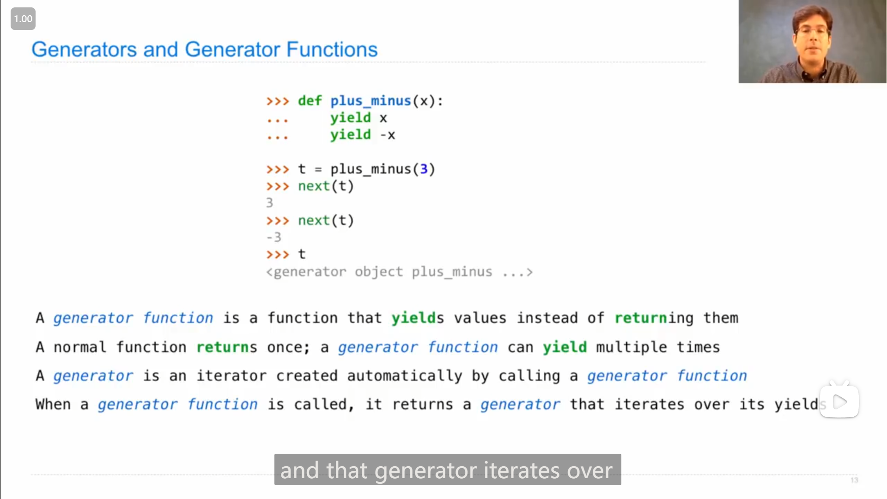{ loading=lazy }

*生æˆå™¨å’Œç”Ÿæˆå™¨å‡½æ•° Generators and Generator Functions*

使用 `yield` 而ä¸æ˜¯ `return` 关键字æ¥è¿”å›å€¼çš„函数，就是*生æˆå™¨å‡½æ•°*，而*生æˆå™¨å‡½æ•°*会返å›ä¸€ä¸ª*生æˆå™¨*，*生æˆå™¨*是一个迭代器，迭代时会按照函数中 `yield` 语å¥çš„顺åºæ¥è¿”å›å€¼ï¼Œå‚考上图

John的一个demo

>   >   ```python
>   >   def evens(start, end):
>   >       even = start + (start % 2)
>   >       while even < end:
>   >           yield even
>   >           even += 2
>   >   ```
>
>   ```python
>   >>> t = evens(2, 10)
>   >>> t
>   <generator object evens at 0x000002597B170580>
>   >>> next(t)
>   2
>   >>> next(t)
>   4
>   >>> next(t)
>   6
>   >>> next(t)
>   8
>   >>> next(t)
>   Traceback (most recent call last):
>     File "<stdin>", line 1, in <module>
>   StopIteration
>   >>> list(evens(1, 10))
>   [2, 4, 6, 8]
>   >>>
>   ```

John的解释是，当一个 *Generator Function* 被调用时，函数里é¢çš„语å¥ä¸ä¼šè¢«ç«‹å³æ‰§è¡Œï¼Œè€Œæ˜¯ç›´æ¥è¿”å›ä¸€ä¸ª *Generator* ，而在 *generator* æ¯æ¬¡è¿­ä»£æ—¶ï¼Œå‡½æ•°å†…的语å¥æ‰ä¼šè¢«æ‰§è¡Œï¼Œä¸”åªæ‰§è¡Œåˆ°ä¸‹ä¸€ä¸ª `yield` 处就暂åœæ‰§è¡Œï¼Œå¹¶è¿”å›å€¼

### 8

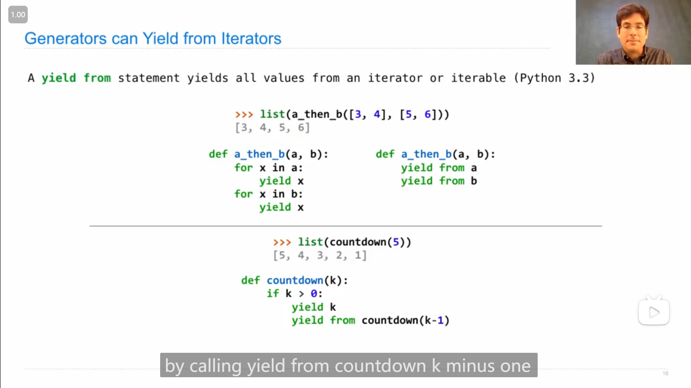{ loading=lazy }

**`yield from` 语å¥**，åé¢å¯ä»¥æ˜¯ 迭代器 或者 å¯è¿­ä»£å¯¹è±¡ (如æœæ˜¯è¿­ä»£å™¨ä¼°è®¡ä¼šä¿®æ”¹è¿­ä»£å™¨çš„ä½ç½®)

上图中还展示了生æˆå™¨å‡½æ•°çš„一ç§ç±»ä¼¼äºé€’归的写法

>   ```python
>   def countdown(k):
>       if k > 0:
>           yield k
>           for x in countdown(k - 1):
>               yield x
>   ```
>
>   更简æ´çš„写法就是
>
>   ```python
>   def countdown(k):
>       if k > 0:
>           yield k
>           yield from countdown(k - 1)
>   ```

### 9

{ loading=lazy }

John的一个ç¥å¥‡çš„生æˆå™¨å‡½æ•°çš„demo，感觉很åƒé€’归的感觉，并且多个生æˆå™¨å‡½æ•°ç»„åˆä½¿ç”¨å¯ä»¥äº§ç”Ÿç¥å¥‡çš„效æœ

## Lecture 17 Q&A

### 1

John å…³äºè¿­ä»£å™¨çš„解释

!!! quote

    yeah good question, so if an iterator is not a list, what is it. um, there are lots of different kinds of, uh, iterators, so you know it more by its behavior than its, like what it's constituted of. an iterator is something that you can call next on, and get more elements. in the case of a list, the iterator for a list, is more than just a list, it's kind of a reference to the list along with a position in that list that tells you where you are, so that if you call the next thing the iterator advances, meaning that if you called next again you'd get something else than you did the first time. so in that sense, it's, it has different behavior than a list, because it's both a list and like a marker for where you are. but list iterators are not the only kind of iterators, you could have an iterator through the labels in a tree, you could have an iterator through the prefixes in a string, you could have an iterator kind of through anything, and it's just a description of something that lets you go through multiple elements in some order by calling next on the iterator and getting the next value, and you can do that over and over again. so it's quite an abstract thing as opposed to, feeling quite as concrete as for example a list.
    
    ---
    
    好问题，如æœè¿­ä»£å™¨ä¸æ˜¯ä¸€ä¸ªåˆ—表，它是什么。嗯，有很多ä¸åŒç±»å‹çš„迭代器，所以你更多地通过它的行为而ä¸æ˜¯å®ƒçš„行为æ¥äº†è§£å®ƒï¼Œæ¯”如它是由什么组æˆçš„。迭代器是您æ¥ä¸‹æ¥å¯ä»¥è°ƒç”¨å¹¶è·å–更多元素的东西。在列表的情况下，列表的迭代器ä¸ä»…仅是一个列表，它是对列表的引用，以åŠåˆ—表中的一个ä½ç½®ï¼Œå‘Šè¯‰ä½ åœ¨å“ªé‡Œï¼Œæ‰€ä»¥å¦‚æœä½ è°ƒç”¨ä¸‹ä¸€ä¸ªä¸œè¥¿ï¼Œè¿­ä»£å™¨ä¼šå‰è¿›ï¼Œè¿™æ„味ç€å¦‚æœä½ å†æ¬¡è°ƒç”¨next，你会得到比第一次ä¸åŒçš„东西。ä»è¿™ä¸ªæ„义上说，它的行为ä¸åˆ—表ä¸åŒï¼Œå› ä¸ºå®ƒæ—¢æ˜¯ä¸€ä¸ªåˆ—表，åˆåƒæ˜¯ä¸€ä¸ªä½ æ‰€åœ¨ä½ç½®çš„标记。但列表迭代器并ä¸æ˜¯å”¯ä¸€ä¸€ç§è¿­ä»£å™¨ï¼Œä½ å¯ä»¥é€šè¿‡æ ‘中的标签有一个迭代器。你å¯ä»¥é€šè¿‡å­—符串中的å‰ç¼€æœ‰ä¸€ä¸ªè¿­ä»£å™¨ã€‚你也å¯ä»¥é€šè¿‡ä»»ä½•ä¸œè¥¿æœ‰ä¸€ä¸ªiterator。它åªæ˜¯ä¸€ä¸ªä¸œè¥¿çš„æ述，让你通过在迭代器上调用next并è·å¾—下一个值æ¥æŒ‰æŸç§é¡ºåºéå†å¤šä¸ªå…ƒç´ ï¼Œä½ å¯ä»¥ä¸€æ¬¡åˆä¸€æ¬¡åœ°è¿™æ ·åšã€‚所以这是一件é常抽象的事情，而ä¸æ˜¯åƒåˆ—表一样具体。

### 2

{ loading=lazy }

John展示了一ç§ä¸ä½¿ç”¨ `yield` 关键字也å¯ä»¥å®ç°ç›¸åŒåŠŸèƒ½çš„写法：

```python
def prefixes(s):
    result = []
    if s:
        for x in prefixes(s[:-1]):
            result.append(x)
    return result

print(list(prefixes('doges')))
```

>   åŸæœ¬çš„使用 `yield` 的写法
>
>   ```python
>   def prefixes(s):
>       if s:
>           for x in prefixes(s[:-1]):
>               yield x
>           yield s
>   
>   print(list(prefixes('doges')))
>   ```

### 3

John å’Œ Hany 解释关äºè¿­ä»£å™¨æ¯æ¬¡è¿­ä»£æ—¶å°±ä¼šè¢«*更改*的特点(一次性使用的特点)

!!! quote
    
    ```python
    s = [1, 2, 3]
    t = iter(s)
    
    len(list(t)) #-> returns 3
    len(list(t)) #-> returns 0?
    ```
    
    **John**:
    
    yeah good question, so the questions about this example and why is it the case that when you get the length of, uh, the result of listing out the contents of an iterator twice you get a different thing each time, first time you got three things, next time you got zero things. this isn't something having to do with len, this is having to do with how list interacts with an iterator. when you call list on an iterator, you end up building a list of all the contents of that iterator, but the iterator is used up as a side effect of calling list on it. so, if i have an iterator over these values, um, i can get one thing out of it, but then if i get another thing i get a different thing. list is kind of like calling next over and over again, and putting all the results in a list. so as soon as you call list on t, you're going to get everything that's left over in the iterator, that hasn't been used up or returned already. so we've already seen the one, we've seen the two, therefore calling list on t will just show us the three. and now t is used up, i can't get the next thing in t, because we're already at the end, and so if i try to list everything that's left and t, i'll get an empty list. so your version was start with this, get all the contents of that, which is a list containing one two and three. if i do this, i'm changing t. this is, uh, every time you get elements from an iterator, you're changing that iterator, which means you can't really use it again. so if you get the length of this you get three, you get the length of this you get zero.
    
    **Hany**:
    
    **so think of these iterators as one use disposable operators, once you've gone through the list, either next next next next, or the list of it is you're essentially enumerating the list, it's gone**. right, so by the way you could have implemented this yourself, you could have written a function that every time you access an element, the next element, you delete that element from the list, that's essentially what's going on here. yeah. and so once you, it's a funny thing about iterators by the way, is that once you look at the list, it's, it's sort of like, uh, what is it, **it's like snapchat, right, the image comes in, you look at it, and then it vanishes, it's gone**.
    
    **John**:
    
    that is beautiful.
    
    **Hany**:
    
    yeah, you got to be impressed by somebody my age, making a snapchat reference, that's, that's i think you know, you have a little credit for that.
    
    **John**:
    
    perfect snapchat analogy.
    
    ---
    
    ```python
    s = [1, 2, 3]
    t = iter(s)
    
    len(list(t)) #-> returns 3
    len(list(t)) #-> returns 0?
    ```
    
    **John**:
    
    是的，这是一个很好的问题。关äºè¿™ä¸ªç¤ºä¾‹çš„问题是，为什么在两次è·å–迭代器的内容的长度时，æ¯æ¬¡éƒ½ä¼šå¾—到ä¸åŒçš„结æœï¼Ÿç¬¬ä¸€æ¬¡å¾—到三个元素，下一次å´å¾—åˆ°é›¶ä¸ªå…ƒç´ ï¼Ÿè¿™ä¸ `len` å‡½æ•°æ— å…³ï¼Œè€Œä¸ `list` 如何ä¸è¿­ä»£å™¨äº¤äº’有关。当你在迭代器上调用 `list` 时，你å®é™…上正在æ„建一个包å«è¯¥è¿­ä»£å™¨çš„所有内容的列表，但调用 `list` 会消耗迭代器，这是一个副作用。因此，如æœæˆ‘有一个迭代器éå†è¿™äº›å€¼ï¼Œæˆ‘å¯ä»¥ä»ä¸­è·å–一个元素，但如æœæˆ‘å†æ¬¡è·å–一个元素，我将得到ä¸åŒçš„结æœã€‚ `list` å°±åƒä¸€æ¬¡åˆä¸€æ¬¡åœ°è°ƒç”¨ `next` ，然å将所有结æœæ”¾å…¥åˆ—表中。因此，一旦在 `t` 上调用 `list` ，你将è·å¾—迭代器中剩余的所有内容，这些内容尚未被使用或返å›ã€‚所以我们已ç»çœ‹åˆ°äº†1å’Œ2，因此在 `t` 上调用 `list` å°†åªæ˜¾ç¤º3。ç°åœ¨ `t` å·²ç»è¢«ç”¨å®Œäº†ï¼Œæˆ‘无法å†è·å– `t` 中的下一个元素，因为我们已ç»åˆ°è¾¾æœ«å°¾ï¼Œæ‰€ä»¥å¦‚æœæˆ‘å°è¯•åˆ—出 `t` 中剩下的所有内容，我将得到一个空列表。所以你的版本是ä»è¿™ä¸ªå¼€å§‹ï¼Œè·å–了包å«1ã€2å’Œ3的列表。如æœæˆ‘åšè¿™ä¸ªï¼Œæˆ‘就改å˜äº† `t` 。æ¯å½“ä»è¿­ä»£å™¨ä¸­è·å–元素时，你都会改å˜è¯¥è¿­ä»£å™¨ï¼Œè¿™æ„味ç€ä½ ä¸èƒ½å†æ¬¡ä½¿ç”¨å®ƒã€‚因此，如æœä½ è·å–这个的长度，你会得到3，如æœä½ è·å–这个的长度，你会得到0。
    
    **Hany**:
    
    **所以把这些迭代器看作是一次性的æ“作符，一旦你éå†äº†åˆ—表，无论是通过è¿ç»­è°ƒç”¨ `next` 还是通过调用 `list` ，它们都消失了**。对，顺便说一å¥ï¼Œä½ å…¶å®å¯ä»¥è‡ªå·±å®ç°è¿™ä¸ªï¼Œä½ å¯ä»¥ç¼–写一个函数，æ¯æ¬¡è®¿é—®ä¸€ä¸ªå…ƒç´ ï¼Œéƒ½ä»åˆ—表中删除那个元素，这本质上就是这里å‘生的事情。是的，所以一旦你看过列表，**è¿™æœ‰ç‚¹åƒ Snapchat，对å§ï¼Ÿå›¾åƒè¿›æ¥ï¼Œä½ çœ‹äº†ä¸€çœ¼ï¼Œç„¶å它就消失了，没有了**。
    
    **John**:
    
    这太精彩了。
    
    **Hany**:
    
    是的，你得对我这个年龄的人能够æ到 Snapchat 感到å°è±¡æ·±åˆ»ï¼Œæˆ‘想你应该给我点信用。
    
    **John**:
    
    完ç¾çš„ Snapchat 比喻。

## Lecture 18 Objects

### 1

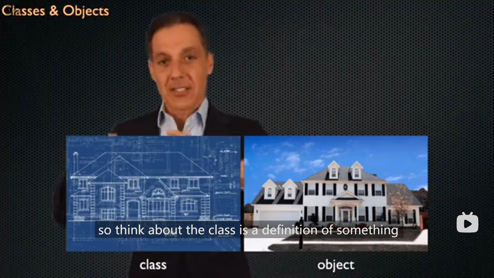{ loading=lazy }

å…³äº class å’Œ object 之间的关系的形容

!!! quote

    å…³äº class å’Œ object 的解释：
    
    -   **class**: A class combines (and abstracts) data and functions
    -   **object**: An object is an instantiation of a class

### 2

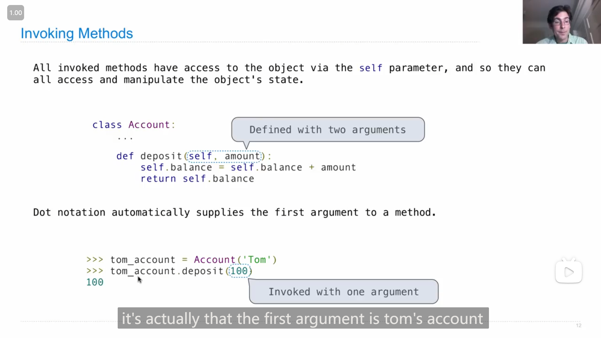{ loading=lazy }

类内的方法在编写是，第一个å‚数须是 `self` ，

但类内方法在被调用的时候，ä¸éœ€è¦ä¼ å…¥ `self` 的值，或者说 `self` 就是调用方法的å®ä¾‹ï¼Œæ‰€ä»¥åªéœ€è¦ä¼ å…¥ä¹‹åçš„å‚æ•°

### 3

{ loadind=lazy }

python有内置函数å¯ä»¥æŸ¥è¯¢/访问类的å®ä¾‹çš„*å±æ€§(attribute)*，或者是类的å±æ€§ (**==类内的方法算作是类本身的å±æ€§ï¼Œè€Œä¸æ˜¯å…·ä½“å®ä¾‹çš„å±æ€§==**)

`getattr()` å¯ä»¥è®¿é—®å±æ€§ï¼Œè·å–对应的值

`hasatrr()` å¯ä»¥çœ‹æ˜¯å¦æœ‰æŸä¸ªå±æ€§

**函数的第一个å‚数需è¦ä¼ å…¥å®ä¾‹ï¼Œç¬¬äºŒä¸ªå‚数需è¦ä¼ å…¥è¦æŸ¥è¯¢çš„å±æ€§çš„å±æ€§å(以字符串传入)**

### 4

{ loading=lazy }

如上图，`ç±»å.方法å` 是一个函数，并且 `self` å‚数需è¦ä¼ å…¥ä¸œè¥¿ï¼Œè€Œ `对象.方法å` 是一个方法，`self` ä¸ç”¨ä¼ 

### 5

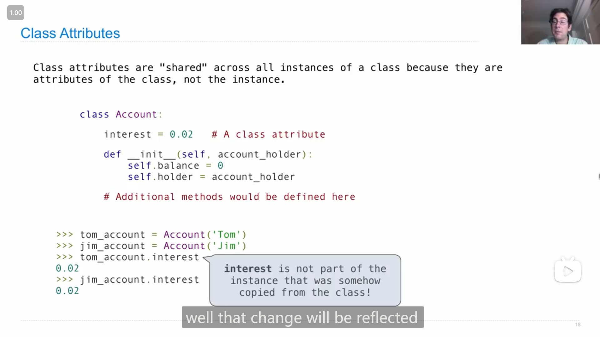{ loading=lazy }

**ç±»å±æ€§**

如上图，在类中赋值的å˜é‡ï¼Œ(应该)就是类的å±æ€§(类内的方法也算是类的å±æ€§ï¼Œç¬¬3点有æ到过)，

**==ç±»å±æ€§ä¸æ˜¯å¯¹è±¡/å®ä¾‹çš„一部分，而是类的一部分==。æ¯æ¬¡é€šè¿‡å¯¹è±¡æ¥è®¿é—®ç±»å±æ€§ï¼Œè®¿é—®çš„是类中的å±æ€§ï¼Œè€Œé€šè¿‡ `对象.å±æ€§å` 赋值/更改å±æ€§ï¼Œå…¶å®æ˜¯åœ¨å¯¹è±¡ä¸­åˆ›å»º/更改对应的å±æ€§(所以通过对象修改“类å±æ€§â€ä¸ä¼šæ›´æ”¹å®é™…çš„ç±»å±æ€§)**

## Lecture 18 Q&A

### 1

ç±»å±æ€§é™¤äº†å¯ä»¥åœ¨ç±»å†…定义，也å¯ä»¥åœ¨ç±»ä»¥å¤–，通过 `ç±»å.å±æ€§å` çš„å½¢å¼èµ‹å€¼å»å®šä¹‰ï¼Œå¦‚

```python
class Account:
    ...
    
Account.interest = 0.03
```

>   ```python
>   >>> Account.interest  0.03
>   >>> a = Account('John')
>   >>> a.interest
>   0.03
>   >>> a.interest = 0.05
>   >>> a.interest
>   0.05
>   >>> b = Account('Hany')
>   >>> b.interest
>   0.03
>   >>> a.interest
>   0.05
>   >>> a.interest = Account.interest
>   >>> a.interest
>   0.03
>   >>> Account.interest = 0.04
>   >>> a.interest
>   0.03
>   >>>
>   ```

John的这段代ç æ¼”示，显示了通过对象æ¥ä¿®æ”¹â€œç±»å±æ€§â€(指相åŒçš„åå­—)时，其å®æ˜¯ä¿®æ”¹çš„是具体对象中的å±æ€§

类和对象**两者å„自的修改都ä¸ä¼šå½±å“到对方的å±æ€§**

**`del` 语å¥**，ç»è¿‡æµ‹è¯•ï¼Œæ˜¯å¯ä»¥å°†å¯¹è±¡ä¸­å·²æœ‰çš„å±æ€§æ¸…除æ‰ï¼Œä»è€Œå†æ¬¡è®¿é—®ç›¸åŒçš„å±æ€§å时，è·å–到的是类å±æ€§çš„值

```python
>>> class Account:
...     def __init__(self):
...         return
...
>>> Account.interest = 5
>>> p1 = Account()
>>> p1.interest
5
>>> del p1.interest
Traceback (most recent call last):
  File "<stdin>", line 1, in <module>
AttributeError: interest
>>> p1.interest += 2
>>> p1.interest
7
>>> Account.interest
5
>>> del p1.interest
>>> p1.interest
5
>>> del p1.interest
Traceback (most recent call last):
  File "<stdin>", line 1, in <module>
AttributeError: interest
>>>
```

### 2

{ loading=lazy }

`del` 也å¯ä»¥åˆ é™¤åˆ—表中的元素，

但是John说 `del` ä¸å¸¸ç”¨

## HW 04

### 1

Q4

!!! info

    *Hint:* If you had the permutations of all the elements in `seq` not including the first element, how could you use that to generate the permutations of the full `seq`?

这个æ示很有用：考虑æ¯æ¬¡æŠ½å»å…¶ä¸­ä¸€ä¸ªå…ƒç´ çš„情况，然åä¾æ¬¡é€’å½’...

一开始感觉能用æ¨å¯¼å¼å†™æˆä¸€è¡Œ

```python
def permutations(seq):
    yield from [[seq[i]] + p for p in permutations(seq[:i] + seq[i + 1:]) for i in range(len(seq))]
```

然åå‘ç°ï¼Œ`i` åªå¯¹ `permutations(seq[:i] + seq[i + 1:])` 生效，`[seq[i]]` 中 `i` 显示未定义

然å改æˆ

```python
def permutations(seq):
    for i in range(len(seq))
        yield from [[seq[i]] + p for p in permutations(seq[:i] + seq[i + 1:])]
```

然å在测试文档的一个测试用例中，用 `next()` 使用函数返å›çš„生æˆå™¨ï¼Œæ˜¾ç¤º `StopIteration` ，

æ€è€ƒäº†å¾ˆä¹…，å‘ç°æ˜¯å› ä¸ºï¼Œé€’归到了最å， `permutations(seq[:i] + seq[i + 1:])` 传入的是空列表，那么就ä¸èƒ½*解å‹*出 `p` ，那么æ¨å¯¼å¼çš„结æœå°±ä¼šæ˜¯ç©ºçš„列表，å†ä¸€å±‚层返å›ï¼Œæ‰€ä»¥æœ€å整体的函数返å›çš„生æˆå™¨ä¸­æ²¡æœ‰å¯ä»¥è¿­ä»£çš„元素

所以需è¦è®¾ç½® base case ，(一开始以为ä¸éœ€è¦è®¾ç½®ï¼Œæˆ–者说以为空列表就å¯ä»¥ä½œä¸º base case)

```python
def permutations(seq):
    if len(seq) == 1:
        yield seq
    else:
        yield from [[seq[i]] + p for p in permutations(seq[:i] + seq[i + 1:])]
```

然åå‘ç°ï¼Œæµ‹è¯•æ–‡æ¡£ä¸­ï¼Œæœ‰ä¸€ä¸ªä¼ å…¥äº†å…ƒç»„，所以我ç¨åŠ äº†ä¿®æ”¹

```python
def permutations(seq):
    seq = list(seq)
    if len(seq) == 1:
        yield seq
    else:
        yield from [[seq[i]] + p for p in permutations(seq[:i] + seq[i + 1:])]
```

>   åé¢å‘ç°ï¼Œå…¶å®è¿™æ ·æ”¹ä¹Ÿå¯ä»¥ï¼š
>
>   ```python
>   def permutations(seq):
>       if len(seq) == 1:
>           yield [seq[0]]
>       else:
>           yield from [[seq[i]] + p for p in permutations(seq[:i] + seq[i + 1:])]
>   ```

在æ€ç´¢åˆ°åº•ä¸€è¡Œè¯­å¥å®ç°åŠŸèƒ½æ˜¯å¦å¯è¡Œæ—¶ï¼Œæƒ³åˆ°äº† `sum()` 函数，想到å¯ä»¥ç”¨å®ƒæ¥æŠŠç»“æœåˆå¹¶åœ¨ä¸€ä¸ªåˆ—表中

```python
def permutations(seq):
    yield from sum([[... for p in permutations(seq[:i] + seq[i + 1:])] for i in range(len(seq))], start=[])
```

然å想到å¯ä»¥æŠŠ base case 放在 `sum` 函数外é¢

```python
def permutations(seq):
    yield from [[seq[0]]] if len(seq) == 1 else sum([[[seq[i]] + p for p in permutations(seq[:i] + seq[i + 1:])] for i in range(len(seq))], start=[])    
```

??? note "code"

    ```python
    def permutations(seq):
        """Generates all permutations of the given sequence. Each permutation is a
        list of the elements in SEQ in a different order. The permutations may be
        yielded in any order.
    
        >>> perms = permutations([100])
        >>> type(perms)
        <class 'generator'>
        >>> next(perms)
        [100]
        >>> try: #this piece of code prints "No more permutations!" if calling next would cause an error
        ...     next(perms)
        ... except StopIteration:
        ...     print('No more permutations!')
        No more permutations!
        >>> sorted(permutations([1, 2, 3])) # Returns a sorted list containing elements of the generator
        [[1, 2, 3], [1, 3, 2], [2, 1, 3], [2, 3, 1], [3, 1, 2], [3, 2, 1]]
        >>> sorted(permutations((10, 20, 30)))
        [[10, 20, 30], [10, 30, 20], [20, 10, 30], [20, 30, 10], [30, 10, 20], [30, 20, 10]]
        >>> sorted(permutations("ab"))
        [['a', 'b'], ['b', 'a']]
        """
        "*** YOUR CODE HERE ***"
        # seq = list(seq)
        # if len(seq) == 1:
        #     yield seq
        # else:
        #     for i in range(len(seq)):
        #         yield from [[seq[i]] + p for p in permutations(seq[:i] + seq[i + 1:])]
        yield from [[seq[0]]] if len(seq) == 1 else sum([[[seq[i]] + p for p in permutations(seq[:i] + seq[i + 1:])] for i in range(len(seq))], start=[])
    ```

### 2

Q5

>   Use `type(value) == str` to test if some `value` is a string

å¯ä»¥ä½¿ç”¨ `type(value) == str` æ¥åˆ¤æ–­ä¸€ä¸ªä¸œè¥¿æ˜¯å¦æ˜¯å­—符串

感觉我最å答案中的这一行是关键的地方：

```python
def make_joint(with_draw, old_pass, new_pass):
    def joint(amount, pw_input):
        ...
        return withdraw(amount, pw_input)  # key point
    ...
    return joint
```

??? note "code"

    ```python
    def make_joint(withdraw, old_pass, new_pass):
        """Return a password-protected withdraw function that has joint access to
        the balance of withdraw.
    
        >>> w = make_withdraw(100, 'hax0r')
        >>> w(25, 'hax0r')
        75
        >>> make_joint(w, 'my', 'secret')
        'Incorrect password'
        >>> j = make_joint(w, 'hax0r', 'secret')
        >>> w(25, 'secret')
        'Incorrect password'
        >>> j(25, 'secret')
        50
        >>> j(25, 'hax0r')
        25
        >>> j(100, 'secret')
        'Insufficient funds'
    
        >>> j2 = make_joint(j, 'secret', 'code')
        >>> j2(5, 'code')
        20
        >>> j2(5, 'secret')
        15
        >>> j2(5, 'hax0r')
        10
    
        >>> j2(25, 'password')
        'Incorrect password'
        >>> j2(5, 'secret')
        "Frozen account. Attempts: ['my', 'secret', 'password']"
        >>> j(5, 'secret')
        "Frozen account. Attempts: ['my', 'secret', 'password']"
        >>> w(5, 'hax0r')
        "Frozen account. Attempts: ['my', 'secret', 'password']"
        >>> make_joint(w, 'hax0r', 'hello')
        "Frozen account. Attempts: ['my', 'secret', 'password']"
        """
        "*** YOUR CODE HERE ***"
        def joint(amount, pw_input):
            if pw_input == new_pass:
                return withdraw(amount, old_pass)
            else:
                return withdraw(amount, pw_input)
        old_result = withdraw(0, old_pass)
        if type(old_result) == str:
            return old_result
        return joint
    ```

### 3

Q6

??? note "code"

    ```python
    def remainders_generator(m):
        """
        Yields m generators. The ith yielded generator yields natural numbers whose
        remainder is i when divided by m.
    
        >>> import types
        >>> [isinstance(gen, types.GeneratorType) for gen in remainders_generator(5)]
        [True, True, True, True, True]
        >>> remainders_four = remainders_generator(4)
        >>> for i in range(4):
        ...     print("First 3 natural numbers with remainder {0} when divided by 4:".format(i))
        ...     gen = next(remainders_four)
        ...     for _ in range(3):
        ...         print(next(gen))
        First 3 natural numbers with remainder 0 when divided by 4:
        4
        8
        12
        First 3 natural numbers with remainder 1 when divided by 4:
        1
        5
        9
        First 3 natural numbers with remainder 2 when divided by 4:
        2
        6
        10
        First 3 natural numbers with remainder 3 when divided by 4:
        3
        7
        11
        """
        "*** YOUR CODE HERE ***"
        def helper(i):
            # yield from [n * m + i for n in naturals()]
            if i != 0:
                yield i
            for n in naturals():
                yield n * m + i
        yield from [helper(i) for i in range(m)]
    ```

## Lecture 19 Inheritance

### 1

{ loading=lazy }

用 *ç‚¹è¡¨è¾¾å¼ dot expression* ç»™å±æ€§èµ‹å€¼

==如æœ*点 `.`* 左边的对象是å®ä¾‹ï¼Œé‚£ä¹ˆèµ‹å€¼çš„就是å®ä¾‹çš„å±æ€§ï¼Œ==

==而如æœ*点 `.`* 左边的对象是类，那么赋值的就是类的å±æ€§==

>   这就解释了上节课 Q&A 中的第一点

并且，由äº

>   Attribute assignment statement adds or modifies the attribute named ...

所以，å±æ€§èµ‹å€¼å°±æ˜¯ï¼Œå¦‚æœå®ä¾‹/ç±»**还没有**对应åå­—çš„å±æ€§ï¼Œé‚£ä¹ˆèµ‹å€¼å°±ä¼šæ·»åŠ ä¸€ä¸ªç›¸å¯¹åº”çš„å±æ€§ï¼Œè€Œå¦‚æœå·²ç»å­˜åœ¨å¯¹åº”åå­—çš„å±æ€§ï¼Œé‚£ä¹ˆå°±ä¼šä¿®æ”¹è¿™ä¸ªå±æ€§çš„值

### 2

{ loading=lazy }

通过 `å®ä¾‹.å±æ€§` ，å®é™…上是先在å®ä¾‹ä¸­å…ˆæŸ¥çœ‹æ˜¯å¦æœ‰å¯¹åº”çš„å±æ€§ï¼Œå¦‚æœæœ‰å°±è¿”å›ï¼Œå¦‚æœæ²¡æœ‰å°±åˆ°ç±»ä¸­å»æŸ¥çœ‹æ˜¯å¦æœ‰å¯¹åº”çš„å±æ€§

{ loading=lazy }

### 3

继承的语法：

```python
class <name>(<base class>):
    <suite>
```

### 4

{ loading=lazy }

一个使用继承的例å­ï¼Œæ²¡æƒ³åˆ°å±…然å¯ä»¥è¿™æ ·ä½¿ç”¨çˆ¶ç±»çš„方法 æ¥ä¿®æ”¹æˆä¸ºè‡ªå·±çš„方法(惊奇地å‘ç° `self` å‚æ•°åŸæ¥æ˜¯è¿™ä¹ˆç”¨çš„)

### 5

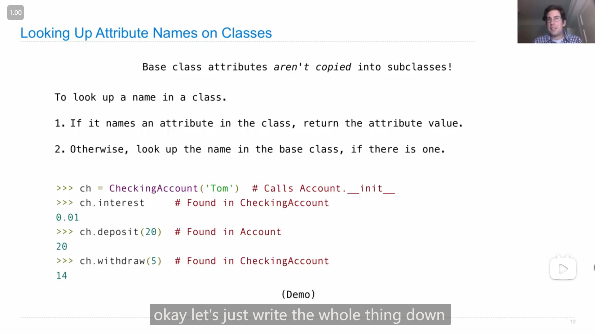{ loading=lazy }

å­ç±»ä¸çˆ¶ç±»çš„å±æ€§çš„使用关系感觉也是和å®ä¾‹ä¸ç±»çš„å±æ€§ä½¿ç”¨å…³ç³»å¾ˆåƒï¼Œå³**父类的å±æ€§å¹¶æ²¡æœ‰å¤åˆ¶å¹¶ç»‘定到å­ç±»ä¸­ï¼Œè€Œæ˜¯åœ¨ä½¿ç”¨å±æ€§æ—¶ï¼Œç°åœ¨å­ç±»ä¸­æŸ¥çœ‹ï¼Œå¦‚æœæ²¡æœ‰å°±åˆ°çˆ¶ç±»ä¸­æŸ¥çœ‹**(如æœçˆ¶ç±»ä¸­æ²¡æœ‰å°±ç»§ç»­åˆ°çˆ¶ç±»çš„父类...)

### 6

John在demo中展示了 `CheckingAccount` çš„ `withdraw` 方法的两ç§å†™æ³•ï¼š

-   ```python
    class CheckingAccount(Account):
        ...
        def withdraw(self, amount):
            amount = amount + 1
            if amount > self.balance:
                return 'Insufficient funds'
            self.balance = self.balance - amount
            return self.balance
    ```

-   ```python
    class CheckingAccount(Account):
        ...
        withdraw_fee = 1
        def withdraw(self, amount):
            return Account.withdraw(self, amount + self.withdraw_fee)
    ```

å‰è€…相比äºå者有个类似äº(之å‰æ•°æ®æŠ½è±¡ç›¸å…³çš„课程中æ到的)打破抽象的界é™çš„问题，会存在一个éšæ‚£ï¼Œå³å¦‚æœå¯¹çˆ¶ç±»çš„方法进行修改，那么å­ç±»çš„方法还会是åŸæ¥çš„æ ·å­ï¼Œè€Œå者如æœçˆ¶ç±»è¢«ä¿®æ”¹äº†ï¼Œå­ç±»ä¹Ÿä¼šè·Ÿç€ä¸€èµ·ä¿®æ”¹

### 7

å…³äºè®¾è®¡ç»§æ‰¿çš„时候John的几个**==建议==**：

-   **Don't repeat yourself; use existing implementations.**

    >   **try to avoid copying and pasting code**

    è¦é¿å…ç›´æ¥å¤åˆ¶ä»£ç ï¼Œè€Œæ˜¯ä½¿ç”¨å·²ç»å®ç°äº†çš„(父类的)方法或函数

-   **Attributes that have been overridden are still accessible via class objects.**

    æ„æ€å°±æ˜¯ï¼Œçˆ¶ç±»ä¸­è¢«å­ç±»*覆写*了的å±æ€§ï¼Œå¯ä»¥é€šè¿‡ç±»åå»è®¿é—®

-   **Look up attributes on instances whenever possible.**

    æ„æ€æ˜¯ï¼Œå°½å¯èƒ½ä½¿ç”¨å®ä¾‹çš„å±æ€§(值或者方法)，(而ä¸æ˜¯ç±»çš„)

### 8

!!! quote

    **Inheritance and Composition**
    
    Object-oriented programming shines when we adopt the metaphor
    
    -   Inheritance is best for representing *is-a* relationships.
    
        E.g., a checking account **is a** specific type of account.
    
        So, CheckingAccount inherits from Account.
    
    -   Composition is best for representing *has-a* relationships.
    
        E.g., a bank **has a** collection of bank accounts it manages.
    
        So, A bank has a list of accounts as an attribute.

*继承*å’Œ*æ„æˆ* (*Inheritance and Composition*)

==é¢å‘对象编程(çš„æ€æƒ³/概念)很适åˆç±»æ¯”ç°å®ä¸­çš„事物==

-   **继承**适åˆè¡¨ç¤º **是/å±äº** 的关系，比如：支票账户**是**银行账户的一ç§

    所以 支票账户 ä» é“¶è¡Œè´¦æˆ· 继承

-   **æ„æˆ**适åˆè¡¨ç¤º **有** 的关系，比如：银行**有**很多银行账户

    所以，银行 有 一系列 银行账户 作为它的å±æ€§

### 9

{ loading=lazy }

å…³äºç¬¬ä¸€ä¸ªè¯­å¥ `>>> C(2).n` 创建出的å³ä¸‹è§’çš„ `C` 类的å®ä¾‹ä¸­ä¼šå­˜åœ¨ `z` 的疑惑和ç†è§£

ç”±äº**在创建 `C` 类的时候，会调用*åˆå§‹åŒ–函数* `__init__()` ，而 `C` 类本身类中åˆæ²¡æœ‰*åˆå§‹åŒ–函数*，所以==会调用父类中的*åˆå§‹åŒ–函数*==**，故会调用 `B` 中的 `__init__()` ，**而值得注æ„的一点，由äºæ˜¯ `C` çš„å®ä¾‹è°ƒç”¨*åˆå§‹åŒ–函数*，所以 ==`self` 被传入的是 `C` çš„å®ä¾‹æœ¬èº«ï¼Œå› æ­¤ `self.z = self.f(y)` 这一行语å¥ä¸­ï¼Œæ‰§è¡Œçš„ `f()` 函数是 `C` 类中的 `f()` 方法==，所以最å的结æœæ˜¯ï¼Œé‚£ä¸ªå®ä¾‹ä¸­ä¼šå­˜åœ¨ä¸€ä¸ª 值为2çš„ `z`** 

所以对äºpython中的 `self` å‚数有了新的认知，å³**å¯ä»¥ä½¿ç”¨çˆ¶ç±»çš„方法，而 `self` å‚数传入的å´æ˜¯å­ç±»çš„å®ä¾‹(所以è¦æ³¨æ„ç”±äºæ˜¯å­ç±»çš„å®ä¾‹ï¼Œæœ‰å¯èƒ½ `self.xxx` 之类的selfçš„*点表达å¼*代ç ï¼Œå¾—到的效æœä¼šå’Œä¸€èˆ¬çš„父类å®ä¾‹ä¸ä¸€æ ·ï¼Œæ¯”如上图中 `B` çš„*åˆå§‹åŒ–函数*如æœä¼ å…¥çš„是 `B` 类的å®ä¾‹ï¼Œé‚£ä¹ˆå¾ˆå¯èƒ½ `self.f(y)` 调用的是 `A` 类中的方法)**

>   在第三个语å¥ä¸­ä¹Ÿå‡ºç°äº†ç±»ä¼¼çš„情况(但是这第三个语å¥æ其地绕)
>
>   `b = B(1)` 中，å®ä¾‹ä¸­çš„ `z` ç”±äºè°ƒç”¨äº† `A` 中的 `f` 方法，所以指å‘了å¦ä¸€ä¸ª `B` ç±»å®ä¾‹ï¼Œè€Œæ–°çš„å®ä¾‹*åˆå§‹åŒ–函数*中 `z` åˆæŒ‡å‘的是一个 `C` 类的å®ä¾‹ï¼Œè€Œ `C` ç±»å®ä¾‹åœ¨åˆå§‹åŒ–时，åˆéœ€è¦è°ƒç”¨ `B` çš„ `__init__()` ，然å就调用了 `C` 类的 `f` 方法(我本æ¥ä»¥ä¸ºä¼šä¸€ç›´ `B` ç±» `C` ç±»æ¥å›ä¸€ç›´æŒ‡ä¸‹å»)

### 10

一个类å¯ä»¥ç»§æ‰¿å¤šä¸ªçˆ¶ç±»ï¼Œå¦‚

```python
class AsSeenOnTVAccount(CheckingAccount, SavingsAccount):
    def __init__(self, account_holder):
        self.holder = account_holder
        self.balance = 1
```

### 11

>   now it's hard for me to show you why this (multiple inheritance tends to make programs complicated) is the case, so instead I'll just show you an analogy about human inheritance.

{ loading=lazy }

在使用多é‡ç»§æ‰¿çš„时候，除é是真的很é‡è¦çš„关系，或者å分必须，在使用时è¦å¾ˆæ³¨æ„，因为多é‡ç»§æ‰¿ä¼šä½¿ç¨‹åºå˜å¾—å¤æ‚，虽然很难举出例å­ï¼Œä½†æ˜¯å¯ä»¥å‚考ç°å®ä¸­(生物上)的继承

## Lecture 19 Q&A

### 1

{ loading=lazy }

`type()` 函数如æœè¿”å›ç±»ï¼Œå¯ä»¥é€šè¿‡å®ƒçš„è¿”å›å€¼æ¥è®¿é—®ç±»å†…çš„å±æ€§ï¼Œå¦‚

>   ```python
>   class Account:
>       def __init__(self, account_holder):
>           self.holderr = account_holder
>           self.balance = 0
>           
>       def deposit(self, amount):
>           self.balance = self.balance = amount
>           return self.balance
>   ```

```python
>>> a = Account('John')
>>> type(a).deposit(a, 100)
100
```

但是 Hany 说应该é¿å…使用这ç§å†™æ³•ï¼Œå› ä¸ºå¤§å¤šæ•°äººä¸ä¼šæ€ä¹ˆå†™

### 2

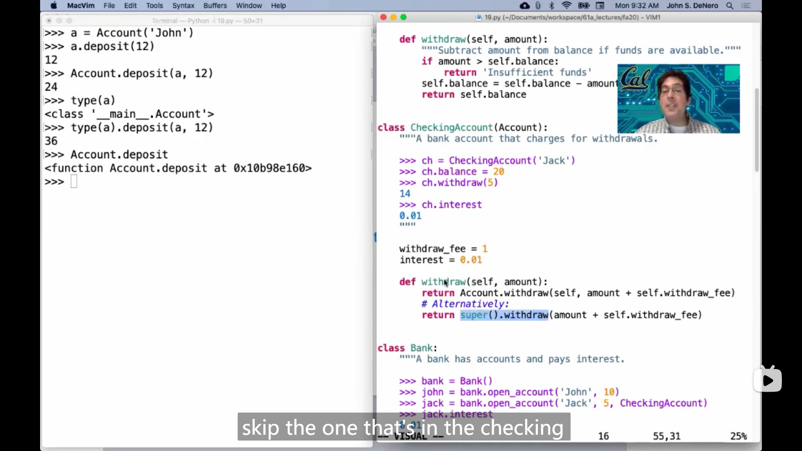{ loading=lazy }

æ ¹æ® John 的解释，`super()` 的作用是，ä¸åœ¨æœ¬ç±»ä¸­å¯»æ‰¾ `.` 之å的东西，而是在上一级父类中寻找

并且在使用父类的*方法*时，会将å®ä¾‹è‡ªåŠ¨ä¼ å…¥ `self` å‚æ•°ï¼Œå’Œç›´æ¥ `父类å.方法` 的使用形å¼ç•¥æœ‰ä¸åŒ

### 3

{ loading=lazy }

有多继承的类在使用本类中没有的方法时，是先在**上一级父类**中**按顺åº**寻找，比如上图，如æœåœ¨ `CheckingAccount` 中没找到对应的方法，那么ä¸ä¼šåœ¨ `CheckingAccount` 的父类( `Acount` ç±»)中寻找，而是在 `SavingAccount` 类中寻找，**如æœæ‰€æœ‰çš„上一级父类中都没找到对应的方法，那么æ‰ä¼šåœ¨ä¸Šä¸¤çº§çˆ¶ç±»ä¸­å¯»æ‰¾(å³çˆ¶ç±»çš„父类)**

### 4

??? quote

    **John**:
    
    well i'd say at the outset that it's often the case that tracing through, uh, tree recursion is not something that humans can tolerate, like it's, it's just really messy sometimes, um, so the right answer is to shift the way in which you approach understanding, uh, implementation to get away from tracing, and instead just treat the recursive calls as abstractions, they do the thing that they're supposed to do, but how they do them is not your problem, and then like you can put it together. but this is not, not like obvious or easy so, um, so maybe we can talk about that with a particular example. so maybe while i read this maybe hany can, uh, say whether that makes sense to him.
    
    **Hany**:
    
    i i'll add one more thing to it, so john's absolutely right that tracing tree recursion is very hard, you have to hold a lot in your memory. um, so one way to fix it is as he just said, is to just think differently about it. it's not about tracing, it's about thinking about the fundamental nature of, um, the, the functions and they just do what you want them to do, and the other is to just use toy examples.
    
    ---
    
    **John**：
    
    嗯，我首先è¦è¯´çš„是，往往情况是，追踪树形递归对人类æ¥è¯´æ˜¯æ— æ³•å¿å—的，就åƒæœ‰æ—¶å€™é常混乱一样。所以正确的答案是改å˜ä½ ç†è§£å®ç°çš„æ–¹å¼ï¼Œæ‘†è„±è¿½è¸ªï¼Œè€Œæ˜¯å°†é€’归调用视为抽象，它们执行它们应该执行的任务，但它们如何执行ä¸æ˜¯ä½ çš„问题，然åä½ å¯ä»¥å°†å®ƒä»¬ç»„åˆèµ·æ¥ã€‚但这并ä¸æ˜æ˜¾æˆ–容易，所以也许我们å¯ä»¥ç”¨ä¸€ä¸ªå…·ä½“的例å­æ¥è®¨è®ºä¸€ä¸‹ã€‚所以也许在我阅读这个的时候，Hanyå¯ä»¥è¯´ä¸€ä¸‹è¿™æ˜¯å¦æœ‰æ„义。
    
    **Hany**：
    
    我è¦è¡¥å……一点，John说得对，追踪树形递归é常困难，你必须记ä½å¾ˆå¤šä¸œè¥¿ã€‚所以解决的一ç§æ–¹æ³•å°±åƒä»–刚æ‰è¯´çš„那样，åªæ˜¯ä»¥ä¸åŒçš„æ–¹å¼æ€è€ƒã€‚è¿™ä¸æ˜¯å…³äºè¿½è¸ªï¼Œè€Œæ˜¯æ€è€ƒå‡½æ•°çš„基本性质，它们åªæ˜¯æ‰§è¡Œä½ æƒ³è¦å®ƒä»¬æ‰§è¡Œçš„任务，å¦ä¸€ç§æ–¹æ³•æ˜¯ä½¿ç”¨ç®€å•çš„示例。

John å’Œ Hany 说到**对树形递归追踪很难，所以ä¸åº”该å»è¿½è¸ªé€’å½’(我认为这里å¯ä»¥ç†è§£ä¸ºï¼Œå¼„清楚递归的æ¯ä¸€æ­¥çš„具体效æœ)，而是æ¢ä¸€ç§æƒ³æ³•å»æ€è€ƒ(å³ä¹‹å‰æ€»ç»“çš„å‡å®šå‡½æ•°èƒ½è¿”å›æ­£ç¡®/所需的值)**

### 5

{ loading=lazy }

John 解答 Lab04 中的 Q5 ，

æ到，在解答/æ„建递归时，å¯ä»¥å…ˆæ‹¿ç®€å•çš„例å­æ¥è¿›è¡Œæ€è€ƒï¼Œæ¯”如 `n = 123 ; t = 2` (而ä¸è¦ä¸Šæ¥å°±å°è¯•å¼„清楚 5 ä½æ•°)，然å通过分æ简å•çš„例å­ï¼Œæ€è·¯å°±ä¼šå¾ˆæ¸…æ™°

## Project Ants

### 1

Problem 4 中，有一点值得注æ„

!!! quote

    A good way to approach the implementation to `ShortThrower` and `LongThrower` is to have it inherit the `nearest_bee` method from the base `ThrowerAnt` class. The logic of choosing which bee a thrower ant will attack is essentially the same, except the `ShortThrower` and `LongThrower` ants have maximum and minimum ranges, respectively.
    
    To implement these behaviors, you will need to modify the `nearest_bee` method to reference `min_range` and `max_range` attributes, and only return a bee that is in range.

这题中è¦æ±‚å®ç°ä¸¤ä¸ª *èš‚èšå°„手* çš„å­ç±»çš„寻找射击目标的方法，我本æ¥å·®ç‚¹å°±æ˜¯æƒ³çš„在åŸæœ‰çš„代ç ä¸Šè¿›è¡Œä¿®æ”¹ï¼Œçœ‹åˆ°ä¸Šé¢è¿™æ®µè¯ï¼Œæˆ‘æ‰æƒ³åˆ°æœ‰æ›´å¥½çš„方法--å»**使用父类的方法**，

**教程中建议的方法是**，在父类中添加å±æ€§ï¼Œå†åœ¨å­ç±»ä¸­(有需è¦çš„è¯)进行覆写

>   最åå‘ç°é‡‡ç”¨æ•™ç¨‹ä¸­çš„æ€è·¯ï¼Œå±…然å¯ä»¥åœ¨å­ç±»ä¸­ä¸ç”¨é‡æ–°å®ç°æ–¹æ³•ï¼Œç›´æ¥ä½¿ç”¨çˆ¶ç±»ä¸­çš„方法å³å¯
>
>   所以说，**==能用父类的å±æ€§(值或者方法)，就用父类的，尽å¯èƒ½çš„ä¸è¦å»é‡æ–°å®ç°==**
>

??? note "code"

    class ThrowerAnt(Ant):
        ...
        # ADD/OVERRIDE CLASS ATTRIBUTES HERE
        food_cost = 3
        min_range = 0
        max_range = float('inf')
        
        def nearest_bee(self, beehive):
            """Return the nearest Bee in a Place that is not the HIVE (beehive), connected to
            the ThrowerAnt's Place by following entrances.
    
            This method returns None if there is no such Bee (or none in range).
            """
            # BEGIN Problem 3 and 4
            # return rANTdom_else_none(self.place.bees) # REPLACE THIS LINE
            place = self.place
            dist = 0
            while place is not beehive:
                if place.bees and dist >= self.min_range and dist <= self.max_range:
                    return rANTdom_else_none(place.bees)
                place = place.entrance
                dist += 1
            return None
            # END Problem 3 and 4
        
        ...
    
    class ShortThrower(ThrowerAnt):
        """A ThrowerAnt that only throws leaves at Bees at most 3 places away."""
    
        name = 'Short'
        food_cost = 2
        # OVERRIDE CLASS ATTRIBUTES HERE
        # BEGIN Problem 4
        max_range = 3
        # implemented = False   # Change to True to view in the GUI
        implemented = True
        # END Problem 4
    
    class LongThrower(ThrowerAnt):
        """A ThrowerAnt that only throws leaves at Bees at least 5 places away."""
    
        name = 'Long'
        food_cost = 2
        # OVERRIDE CLASS ATTRIBUTES HERE
        # BEGIN Problem 4
        min_range = 5
        # implemented = False   # Change to True to view in the GUI
        implemented = True
        # END Problem 4

### 2

Problem 4 中有一点æ示，

å¯ä»¥ä½¿ç”¨ `float('inf')` æ¥è·å¾—一个*无穷大*的值

### 3

在 Extra Credit 中，

>   Some hints:
>
>   All instances of the same class share the same class attributes. How can you use this information to tell whether a QueenAnt instance is the true QueenAnt?
>
>   ...

基äºè¿™ä¸€ç‚¹æ示，所以我采å–的方法是，在 `Ant` 类中设置一个类å±æ€§ `true_queen = None` 默认值是 `None` ，当第一个/真èšå被创建时(通过判断 `true_queen` 是å¦ä¸º `None` æ¥ç¡®å®šæ˜¯å¦æ˜¯çœŸèšå)， `true_queen` 就会指å‘它，而之åçš„èšåå°±å¯ä»¥ä¾æ®è¿™ä¸ªå±æ€§æ¥åˆ¤æ–­å‡ºæ˜¯*å‡èšå*(impostor)

??? note "code"

    ```python
    class Ant(Insect):
        ...
        # ADD CLASS ATTRIBUTES HERE
        true_queen = None
        
        ...
        def remove_from(self, place):
            if self == self.true_queen:
                return
                    if place.ant is self:
                place.ant = None
            elif place.ant is None:
                assert False, '{0} is not in {1}'.format(self, place)
            else:
                # queen or container (optional) or other situation
                place.ant.remove_ant(self)
            Insect.remove_from(self, place)
            
    ...
    
    # BEGIN Problem EC
    # class QueenAnt(Ant):  # You should change this line
    class QueenAnt(ScubaThrower):
    # END Problem EC
        """The Queen of the colony. The game is over if a bee enters her place."""
    
        name = 'Queen'
        food_cost = 7
        # OVERRIDE CLASS ATTRIBUTES HERE
        # BEGIN Problem EC
        # implemented = False   # Change to True to view in the GUI
        implemented = True
        # END Problem EC
    
        def __init__(self, armor=1):
            # BEGIN Problem EC
            "*** YOUR CODE HERE ***"
            ScubaThrower.__init__(self, armor)
            self.buffed_ants = []
            if not Ant.true_queen:
                Ant.true_queen = self
            # END Problem EC
    
        def action(self, gamestate):
            """A queen ant throws a leaf, but also doubles the damage of ants
            in her tunnel.
    
            Impostor queens do only one thing: reduce their own armor to 0.
            """
            # BEGIN Problem EC
            "*** YOUR CODE HERE ***"
            if self is not self.true_queen:
                Ant.reduce_armor(self, self.armor)
                return
            ScubaThrower.action(self, gamestate)
            place = self.place.exit
            while place:
                if place.ant and place.ant not in self.buffed_ants:
                    place.ant.damage *= 2
                    self.buffed_ants += [place.ant]
                place = place.exit
            # END Problem EC
    
        def reduce_armor(self, amount):
            """Reduce armor by AMOUNT, and if the True QueenAnt has no armor
            remaining, signal the end of the game.
            """
            # BEGIN Problem EC
            "*** YOUR CODE HERE ***"
            ScubaThrower.reduce_armor(self, amount)
            if self == self.true_queen and self.armor <= 0:
                bees_win()
            # END Problem EC
    ```

### 4

Optional Problem 2 中

>   Hint: You may find the `isinstance` function useful for checking if an object is an instance of a given class. For example:
>
>   ```python
>       >>> a = Foo()
>       >>> isinstance(a, Foo)
>       True
>   ```

å¯ä»¥ç”¨ `isinstance()` 的函数æ¥åˆ¤æ–­æŸä¸ªå®ä¾‹æ˜¯å¦æ˜¯æŸä¸ªç±»

### 5

Optional Problem 2 中

>   Note: the constructor of `ContainerAnt.__init__` is implemented as such
>
>   ```python
>       def __init__(self, *args, **kwargs):
>           Ant.__init__(self, *args, **kwargs)
>           self.contained_ant = None
>   ```
>
>   As we saw in Hog, we have that `args` is bound to all positional arguments (that is all arguments not passed not with keywords, and `kwargs` is bound to all the keyword arguments. This ensures that both sets of arguments are passed to the Ant constructor).

`args` 是所有没有 *关键字* (比如 `key=` 〠`base=` 就是关键字) çš„å‚数，而 `kwargs` 是所有有 *关键字* çš„å‚æ•°

### 6

Optional Problem 2 有点难，debug都debug了10多次，æˆåŠŸå®ç°çš„代ç åœ¨ä¸‹é¢

??? note "code"

    ```python
    class Ant(Insect):
        ...
        
        def add_to(self, place):
            if place.ant is None:
                place.ant = self
            else:
                # BEGIN Problem Optional 2
                # if not (isinstance(self, ContainerAnt) and self.can_contain(place.ant)) and not (isinstance(place.ant, ContainerAnt) and place.ant.can_contain(self)):
                if isinstance(self, ContainerAnt) and self.can_contain(place.ant):
                    self.contain_ant(place.ant)
                    place.ant = self
                elif isinstance(place.ant, ContainerAnt) and place.ant.can_contain(self):
                    place.ant.contain_ant(self)
                else:
                    assert place.ant is None, 'Two ants in {0}'.format(place)
                # END Problem Optional 2
            Insect.add_to(self, place)
        
        ...
        
    ...
    
    class ContainerAnt(Ant):
        def __init__(self, *args, **kwargs):
            Ant.__init__(self, *args, **kwargs)
            self.contained_ant = None
    
        def can_contain(self, other):
            # BEGIN Problem Optional 2
            "*** YOUR CODE HERE ***"
            return not self.contained_ant and not isinstance(other, ContainerAnt)
            # END Problem Optional 2
    
        def contain_ant(self, ant):
            # BEGIN Problem Optional 2
            "*** YOUR CODE HERE ***"
            if self.can_contain(ant):
                self.contained_ant = ant
                # self.place.ant = self
            # END Problem Optional 2
    
        def remove_ant(self, ant):
            if self.contained_ant is not ant:
                assert False, "{} does not contain {}".format(self, ant)
            self.contained_ant = None
    
        def remove_from(self, place):
            # Special handling for container ants (this is optional)
            if place.ant is self:
                # Container was removed. Contained ant should remain in the game
                place.ant = place.ant.contained_ant
                Insect.remove_from(self, place)
            else:
                # default to normal behavior
                Ant.remove_from(self, place)
    
        def action(self, gamestate):
            # BEGIN Optional 2
            "*** YOUR CODE HERE ***"
            if self.contained_ant:
                self.contained_ant.action(gamestate)
            # END Optional 2
    
    class BodyguardAnt(ContainerAnt):
        """BodyguardAnt provides protection to other Ants."""
    
        name = 'Bodyguard'
        food_cost = 4
        # OVERRIDE CLASS ATTRIBUTES HERE
        # BEGIN Optional 2
        # implemented = False   # Change to True to view in the GUI
        implemented = True
    
        def __init__(self, armor=2):
            ContainerAnt.__init__(self, armor)
        # END Optional 2
    ```

### 7

Optional Problem 4

这题我认为很难(看完题目è¦æ±‚时就已ç»å¤´å¤§äº†)，应该算是所有题目里é¢æœ€éš¾çš„一题，修修改改了很久æ‰åˆæ­¥å†™å®Œï¼Œç„¶å还debug了很多次

---

刚开始时没什么头绪，所以打算 在教程的è¦æ±‚(主è¦è¦å®ç°ä¸‰ä¸ªå‡½æ•°)中 **å…ˆä»æœ€ç®€å•çš„问题开始解决(最åå‘ç°è¿™å¾ˆæœ‰ç”¨ï¼Œå› ä¸ºæŠŠç®€å•çš„问题解决了，最å难的问题就å˜å¾—清晰æ˜äº†äº†)**，

`make_slow` å’Œ `make_scare` ，这两个基本上差ä¸å¤šï¼Œä»–们都是è¦è¿”å›ä¸€ä¸ªæ–°çš„方法

>   ```python
>   def make_slow(action, bee):
>       """Return a new action method that calls ACTION every other turn.
>   
>       action -- An action method of some Bee
>       """
>       # BEGIN Problem Optional 4
>       "*** YOUR CODE HERE ***"
>       # END Problem Optional 4
>   
>   def make_scare(action, bee):
>       """Return a new action method that makes the bee go backwards.
>   
>       action -- An action method of some Bee
>       """
>       # BEGIN Problem Optional 4
>       "*** YOUR CODE HERE ***"
>       # END Problem Optional 4
>   ```

但我一开始没有ç†è§£ *è¿”å›æ–¹æ³•* 应该æ„味ç€ä»€ä¹ˆï¼Œç„¶å注æ„到了 **教程中的æ示** ，å³**==å®ä¾‹çš„方法是å¯ä»¥é€šè¿‡èµ‹å€¼å»è¦†ç›–æ‰çš„==**

>   *Hint:* You will need to rebind a method in one of the functions. Note that when assigning to an instance, the self parameter isn't bound.
>
>   ```python
>     class X: pass
>     def f(x): return x ** 3
>     x = X()
>     x.f = f
>     print(x.f(2)) # prints 8
>   ```

所以我这时的想法是，在 `make_slow` 函数里é¢åˆ›å»ºä¸€ä¸ª 用æ¥å½“作方法 的函数，然å绑定到 `bee` 中，所以

```python
def make_slow(action, bee):
    def new_action(gamestate):
        if gamestate.time % 2 == 0:
            action(bee, gamestate)
    bee.action = new_action
    
...
```

但是çªç„¶æ„Ÿè§‰ï¼Œæ–¹æ³•åº”该是有 `self` å‚数的，

ä»¥åŠ å¥½åƒè¦æ±‚说的是è¦è¿”å›ï¼Œæ‰€ä»¥æˆ‘这时认为，应该è¦åœ¨å‡½æ•°ä¸­å°†è¿™ä¸ª 用作方法的函数 è¿”å›ï¼Œç„¶å在 `apply_status` 中å†å°†å®ƒç»‘定到对象中，所以

```python
def make_slow(action, bee):
    def new_action(self, gamestate):
        if gamestate.time % 2 == 0:
            action(self, gamestate)
    return new_action
    
def make_scare(action, bee):
    def new_action(self, gamestate):
        bee.direction = self.place if self.place.entrance is gamestate.beehive else self.place.entrance
        action(self, gamestate)
    return new_action
```

`.direction` å±æ€§æ˜¯ç”±äºï¼Œæ•™ç¨‹ä¸­æ示到

>   *Hint:* to make a bee go backwards, consider adding an instance variable indicating its current direction. Where should you change the bee's direction? Once the direction is known, how can you modify the `action` method of `Bee` to move appropriately?

所以我对 `Bee.action` 进行了修改

```python
class Bee(Insect):
    ...
    
    def action(self, gamestate):
        """A Bee's action stings the Ant that blocks its exit if it is blocked,
        or moves to the exit of its current place otherwise.

        gamestate -- The GameState, used to access game state information.
        """
        destination = self.place.exit
        # Extra credit: Special handling for bee direction
        # BEGIN EC
        "*** YOUR CODE HERE ***"
        destination = self.direction
        # END EC
        if self.blocked():
            self.sting(self.place.ant)
        elif self.armor > 0 and destination is not None:
            self.move_to(destination)
```

---

然å就开始写 `apply_status` 函数

一开始我没想好æ€ä¹ˆè®¾ç½® æŒç»­æ—¶é—´ï¼Œæ‰€ä»¥å°±åªæ˜¯è¿™æ ·

```python
def apply_status(status, bee, length):
    """Apply a status to a BEE that lasts for LENGTH turns."""
    # BEGIN Problem Optional 4
    "*** YOUR CODE HERE ***"
    bee.action = status(bee.action, bee)
    # END Problem Optional 4
```

然åç”±äº å‰©ä½™æ—¶é—´ 需è¦è¢«è®°å½•ä¸‹æ¥ï¼Œè€Œä¸”我想到调用一次 action 函数就å‡å°‘一次剩余时间，所以想到了在函数中å†æ„建一个嵌套函数，然å使用 `nonlocal` 语å¥æ¥å‡å°‘ `length` 的值，并且在剩余时间为0的时候把方法æ¢å›åŸæœ¬çš„方法，所以

```python
def apply_status(status, bee, length):
    old_action = bee.action
    def new_action(gamestate):
        nonlocal length
        length -= 1
        status(old_action, bee)(self, gamestate)
        if length == 0:
            bee.action = old_action
            bee.direction = None
    bee.action = new_action
```

最å教程中还有一点，就是 **多状æ€** 的问题，

>   `apply_status` takes a `status` (either `make_slow` or `make_scare`), a `Bee`, and a `length`. The way it works is as so: imagine that a `Bee` has a bunch of statuses, each of which modifies `action` in sequence. When a status's length is up, it removes itself from the list. `apply_status` adds the given status to the end of the list, so that it is applied latest. Note that you don't necessarily need to make a literal list of statuses - it is just helpful to think of statuses in this way.
>
>   ---
>
>   As an example of what "previous behavior" means, take the example of a bee that has been slowed twice (say by two separate `SlowThrower`s). It will have the following behavior:
>
>   -   on time 1, it will do nothing. The outer slow has 2 turns to go, the inner one still has 3 turns
>   -   on time 2, it moves forward. The outer slow has 1 turn to go, the inner one has 2 turns
>   -   on time 3, it will do nothing. The outer slow has no turns left, the inner one has 2 turns
>   -   on time 4, it moves forward. The inner slow has 1 turn left
>   -   on time 5, it does nothing. The inner slow has no turns left

æ„æ€æ˜¯è¦æ±‚，存在多个状æ€æ—¶ï¼Œå‰©ä½™æ—¶é—´ä¼šä¸€èµ·å‡å°‘，但是应用的效æœæ˜¯æŒ‰ä»æ—©(最先生效)到晚(å产生)的顺åºåº”用的，具体å¯ä»¥çœ‹æ•™ç¨‹ä¸­çš„解释

ç”±äºè¿™ä¸ªç‚¹æˆ‘没有弄清楚应该如何å®ç°ï¼Œäºæ˜¯æ²¡æœ‰åŠæ³•ï¼Œæˆ‘åªèƒ½å°è¯•å…ˆè¿›è¡Œæµ‹è¯•

---

测试出ç°çš„第一个问题

```python
>>> from ants import *
>>> beehive, layout = Hive(AssaultPlan()), dry_layout
>>> dimensions = (1, 9)
>>> gamestate = GameState(None, beehive, ant_types(), layout, dimensions)
>>> # Testing Slow
>>> slow = SlowThrower()
>>> bee = Bee(3)
>>> gamestate.places["tunnel_0_0"].add_insect(slow)
>>> gamestate.places["tunnel_0_4"].add_insect(bee)
>>> slow.action(gamestate)
>>> gamestate.time = 1
>>> bee.action(gamestate)
TypeError: apply_status.<locals>.new_action() missing 1 required positional argument: 'gamestate'

# Error: expected

# but got
#     Traceback (most recent call last):
#       ...
#     TypeError: apply_status.<locals>.new_action() missing 1 required positional argument: 'gamestate'
```

是指 `apply_status` 函数中的嵌套函数 `new_action` 在被使用时，第二个 `gamestate` å‚数没有被传入值(一开始我的ç†è§£è¿˜æœ‰äº›å差，ç»è¿‡äº†ä¸€äº›æµ‹è¯•å’Œè¯•é”™æ‰æœ€ç»ˆç¡®å®šæ˜¯è¿™ä¸ªåŸå› )

这就æ„味ç€ï¼Œ `bee.action(gamestate)` 处，在调用新的方法时，åªä¼ å…¥äº†ä¸€ä¸ªå‚æ•°(所以第二个å‚数没有被传入)，所以这似ä¹å‘Šè¯‰æˆ‘，在编写新的方法时，并ä¸éœ€è¦ä½¿ç”¨ `self` å‚æ•°

为了求è¯ï¼Œæˆ‘é‡æ–°å»æŸ¥çœ‹å’Œç†è§£æ•™ç¨‹ä¸­ç»™å‡ºçš„示例

>   *Hint:* You will need to rebind a method in one of the functions. Note that when assigning to an instance, the self parameter isn't bound.
>
>   ```python
>     class X: pass
>     def f(x): return x ** 3
>     x = X()
>     x.f = f
>     print(x.f(2)) # prints 8
>   ```

如何å‘ç°ï¼Œè¿™é‡Œé¢çš„ 新方法 就是没有 `self` å‚数，并且在调用时，这个å®ä¾‹ä¹Ÿæ²¡æœ‰å°†è‡ªèº«ä½œä¸ºå‚数传入其中(调用自身或父类的方法时，会把自身 **éšå¼åœ°** ä¼ å…¥ `self` å‚æ•°)，所以得到结论，**==如æœä¸€ä¸ªåœ¨ç±»å¤–定义的函数，被绑定æˆä¸ºäº†æŸä¸ªå®ä¾‹çš„å±æ€§ï¼Œæˆ–者æŸç§ç¨‹åº¦ä¸Šå¯ä»¥è¯´æ—¶æˆä¸ºäº†è¿™ä¸ªå®ä¾‹çš„一个方法，在通过 `å®ä¾‹.å±æ€§å` çš„æ–¹å¼ä½¿ç”¨è¿™ä¸ªå‡½æ•°/方法时，是ä¸ä¼šå°†å®ä¾‹ä¼ å…¥å‡½æ•°/方法的==**

所以对åŸæœ‰ä»£ç è¿›è¡Œäº†ä¿®æ”¹

```python
def make_slow(action, bee):
    def new_action(gamestate):
        if gamestate.time % 2 == 0:
            action(bee gamestate)
    return new_action

def make_scare(action, bee):
    def new_action(gamestate):
        bee.direction = bee.place if bee.place.entrance is gamestate.beehive else bee.place.entrance
        action(bee, gamestate)
    return new_action

def apply_status(status, bee, length):
    old_action = bee.action
    def new_action(gamestate):
        nonlocal length
        length -= 1
        status(old_action, bee)(gamestate)
        if length == 0:
            bee.action = old_action
            bee.direction = None
    bee.action = new_action
```

然å在测试修改好的代ç æ—¶ï¼Œå‘ç°

```python
>>> from ants import *
>>> beehive, layout = Hive(AssaultPlan()), dry_layout
>>> dimensions = (1, 9)
>>> gamestate = GameState(None, beehive, ant_types(), layout, dimensions)
>>> # Testing Slow
>>> slow = SlowThrower()
>>> bee = Bee(3)
>>> gamestate.places["tunnel_0_0"].add_insect(slow)
>>> gamestate.places["tunnel_0_4"].add_insect(bee)
>>> slow.action(gamestate)
>>> gamestate.time = 1
>>> bee.action(gamestate)
Traceback (most recent call last):
  File "E:\Courses\cs61a\projects\ants\ants.py", line 606, in new_action
    action(gamestate)
  File "E:\Courses\cs61a\projects\ants\ants.py", line 470, in action
    destination = self.direction
AttributeError: 'Bee' object has no attribute 'direction'

# Error: expected

# but got
#     Traceback (most recent call last):
#       ...
#     AttributeError: 'Bee' object has no attribute 'direction'
```

ç”±äº `bee.direction` 没有åˆå§‹å€¼/默认值，所以有å¯èƒ½å‡ºç°å±æ€§ä¸å­˜åœ¨çš„情况，所以进行修改

```python
class Bee(Insect):
    ...
    direction = None
    ...
    
    def action(self, gamestate):
        destination = self.place.exit
        # Extra credit: Special handling for bee direction
        # BEGIN EC
        "*** YOUR CODE HERE ***"
        if self.direction:
            destination = self.direction
        # END EC
        if self.blocked():
            self.sting(self.place.ant)
        elif self.armor > 0 and destination is not None:
            self.move_to(destination)
```

然ååˆå‡ºç°äº†ä¸€ä¸ªé—®é¢˜ï¼Œ

```python
>>> from ants import *
>>> beehive, layout = Hive(AssaultPlan()), dry_layout
>>> dimensions = (1, 9)
>>> gamestate = GameState(None, beehive, ant_types(), layout, dimensions)
>>> # Testing Slow
>>> slow = SlowThrower()
>>> bee = Bee(3)
>>> gamestate.places["tunnel_0_0"].add_insect(slow)
>>> gamestate.places["tunnel_0_4"].add_insect(bee)
>>> slow.action(gamestate)
>>> gamestate.time = 1
>>> bee.action(gamestate)
Traceback (most recent call last):
  File "E:\Courses\cs61a\projects\ants\ants.py", line 606, in new_action
    action(bee, gamestate)
TypeError: Bee.action() takes 2 positional arguments but 3 were given

# Error: expected

# but got
#     Traceback (most recent call last):
#       ...
#     TypeError: Bee.action() takes 2 positional arguments but 3 were given
```

`bee` åŸæœ¬çš„方法传入了一个å‚数，所以å¯ä»¥å‘ç°ï¼Œ**==å®ä¾‹çš„方法本身已ç»å°†å®ä¾‹æœ¬èº«ä¼ å…¥äº† `self` å‚æ•°==**，比如 `old_action = bee.action` ，`bee.action` å·²ç»ç»™ `Bee.action` 中的 `self` å‚数传入了自身(å³ `bee` å®ä¾‹)，而如æœä½¿ç”¨ `old_action` ，比如 `old_action(gs)` ，那么 `gs` 会被传入 `Bee.action` çš„ `gamestate` (第二个å‚æ•°)而ä¸æ˜¯ `self` 

所以进行修改

```python
def make_slow(action, bee):
    def new_action(gamestate):
        if gamestate.time % 2 == 0:
            action(gamestate)
    return new_action

def make_scare(action, bee):
    def new_action(gamestate):
        bee.direction = bee.place if bee.place.entrance is gamestate.beehive else bee.place.entrance
        action(gamestate)
    return new_action

def apply_status(status, bee, length):
    old_action = bee.action
    def new_action(gamestate):
        nonlocal length
        length -= 1
        status(old_action, bee)(gamestate)
        if length == 0:
            bee.action = old_action
            bee.direction = None
    bee.action = new_action
```

---

测试出ç°çš„第二个问题

```python
>>> from ants import *
>>> beehive, layout = Hive(AssaultPlan()), dry_layout
>>> dimensions = (1, 9)
>>> gamestate = GameState(None, beehive, ant_types(), layout, dimensions)
>>> scare = ScaryThrower()
>>> bee = Bee(3)
>>> gamestate.places["tunnel_0_0"].add_insect(scare)
>>> gamestate.places["tunnel_0_1"].add_insect(bee)
>>> scare.action(gamestate)
>>> bee.action(gamestate)
>>> bee.place.name
'tunnel_0_2'
>>> bee.action(gamestate)
>>> bee.place.name
'tunnel_0_3'
>>> #
>>> # Same bee should not be scared more than once
>>> scare.action(gamestate)
>>> bee.action(gamestate)
>>> bee.place.name
'tunnel_0_4'

# Error: expected
#     'tunnel_0_2'
# but got
#     'tunnel_0_4'
```

åŒä¸€ä¸ªèœœèœ‚åªèƒ½è¢«*æå“*一次，所以对åŸæœ‰ä»£ç è¿›è¡Œä¿®æ”¹

```python
class Bee(Insect):
    ...
    direction = None
    has_been_scared = False
    ...

...
def make_scare(action, bee):
    def new_action(gamestate):
        if not bee.has_been_scared:
            bee.direction = bee.place if bee.place.entrance is gamestate.beehive else bee.place.entrance
        action(gamestate)
    return new_action

def apply_status(status, bee, length):
    old_action = bee.action
    def new_action(gamestate):
        nonlocal length
        length -= 1
        status(old_action, bee)(gamestate)
        if length == 0:
            bee.action = old_action
            bee.direction = None
            if status is make_scare:
                bee.has_been_scared = True
    bee.action = new_action
```

---

测试出ç°çš„第三个问题

```python
>>> from ants import *
>>> beehive, layout = Hive(AssaultPlan()), dry_layout
>>> dimensions = (1, 9)
>>> gamestate = GameState(None, beehive, ant_types(), layout, dimensions)
>>> # Testing long status stack
>>> scary = ScaryThrower()
>>> slow = SlowThrower()
>>> bee = Bee(3)
>>> gamestate.places["tunnel_0_0"].add_insect(scary)
>>> gamestate.places["tunnel_0_1"].add_insect(slow)
>>> gamestate.places["tunnel_0_3"].add_insect(bee)
>>> scary.action(gamestate) # scare bee once
>>> gamestate.time = 0
>>> bee.action(gamestate) # scared
>>> bee.place.name
'tunnel_0_4'
>>> for _ in range(3): # slow bee three times
...    slow.action(gamestate)
>>> gamestate.time = 1
>>> bee.action(gamestate) # scared, but also slowed thrice
>>> bee.place.name
'tunnel_0_4'
>>> gamestate.time = 2
>>> bee.action(gamestate) # scared and slowed thrice
>>> bee.place.name
'tunnel_0_5'
>>> gamestate.time = 3
>>> bee.action(gamestate) # slowed thrice
>>> bee.place.name
'tunnel_0_4'

# Error: expected
#     'tunnel_0_5'
# but got
#     'tunnel_0_4'
```

我判断这个就是由äºæ²¡æœ‰å¤„ç†å¤šçŠ¶æ€çš„情况而产生的问题

然å开始观察测试的代ç (因为å‰å‡ ä¸ªè¾“出都没有报错)，ç»è¿‡æ€è€ƒä»¥åŠæ¢³ç†ä»£ç çš„具体æµç¨‹ï¼Œæˆ‘大概æ˜ç™½äº†å‡ºç°è¿™ç§æƒ…况的åŸå› (å‰é¢è®¡ä¸­æƒ…况没错而åé¢é”™äº†)，问题å¯èƒ½æ˜¯å‡ºåœ¨ï¼Œå¤šçŠ¶æ€ä¸‹ï¼Œ*æå“*状æ€ç»“æŸæ—¶ï¼Œ(我写的åŸæœ¬çš„代ç ä¸­)会把å®ä¾‹çš„ `.action` 方法赋值æˆåŸæ¥çš„ `action` 方法，就应该会导致æŸç§çŸ›ç›¾

而å‰é¢æ²¡æœ‰å‡ºé”™çš„ 是因为 ***==æå“==*==之åçš„*å‡é€Ÿ*状æ€ï¼Œæ˜¯å°†*æå“*åçš„æ–° `action` 方法设置æˆäº†æ—§ `action` 方法，所以会有ç§ç±»ä¼¼äº hw04 çš„ Q5 Joint Account 一样的感觉(å³è”åˆè´¦æˆ·åœ¨å–钱时，会调用åŸè´¦æˆ·çš„方法，然å如æœåŸè´¦æˆ·ä¹Ÿæ˜¯ä¸€ä¸ªè”åˆè´¦æˆ·ï¼Œé‚£ä¹ˆå°±ä¼šç»§ç»­è°ƒç”¨åŸè´¦æˆ·çš„åŸè´¦æˆ·çš„方法...)==**，所以我的ç†è§£æ˜¯è¿™æ ·

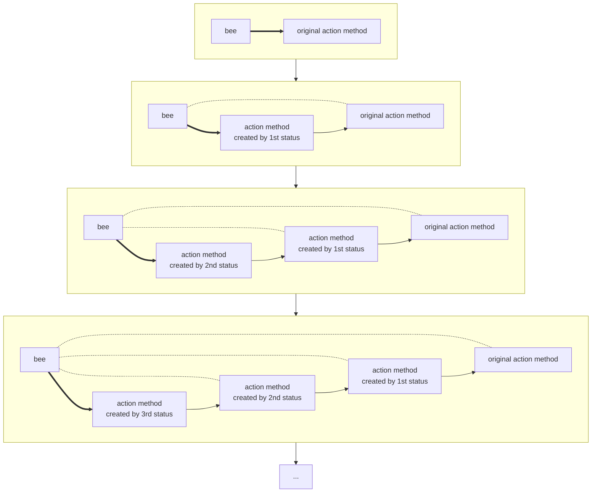
```mermaid
flowchart TD
subgraph g1[" "]
a1["bee"] ==> b1["original action method"]
end
subgraph g2[" "]
a2["bee"] -.- b2["original action method"]
a2 ==> c2["action method \n created by 1st status"]
c2 --> b2
end
subgraph g3[" "]
a3["bee"] -.- b3["original action method"]
a3 -.- c3["action method \n created by 1st status"]
a3 ==> d3["action method \n created by 2nd status"]
d3 --> c3
c3 --> b3
end
subgraph g4[" "]
a4["bee"] -.- b4["original action method"]
a4 -.- c4["action method \n created by 1st status"]
a4 -.- d4["action method \n created by 2nd status"]
a4 ==> e4["action method \n created by 3rd status"]
e4 --> d4
d4 --> c4
c4 --> b4
end
g1 --> g2 --> g3 --> g4 --> ...
```

ç”±äºåœ¨çŠ¶æ€å‰©ä½™æ—¶é—´å‡ä¸º0之å，想ä¸åˆ°å¦‚何把 `old_action` ç»™åé¢çš„ æ–°action方法

所以将æ€è·¯æ”¹å˜æˆï¼Œåœ¨å‰©ä½™æ—¶é—´å‡ä¸º0之å，ä¸ç»“æŸå‡½æ•°ï¼Œè€Œæ˜¯ç»§ç»­ä¿ç•™å‡½æ•°ï¼Œå¹¶ä¸”剩余时间å‡ä¸º0之å就直æ¥æ‰§è¡ŒåŸæœ¬çš„ `old_action` 方法å³å¯ï¼Œæ‰€ä»¥

```python
def apply_status(status, bee, length):
    old_action = bee.action
    def new_action(gamestate):
        nonlocal length
        if length > 0:
            length -= 1
            status(old_action, bee)(gamestate)
            if length == 0:
                bee.direction = None
                if status is make_scare:
                    bee.has_been_scared = True
        else:
            old_action(gamestate)
    bee.action = new_action
```

最终终äºæˆåŠŸè§£å†³è¿™ä¸ªé—®é¢˜

```bash
$ python ok -q optional4 --local
=====================================================================
Assignment: Project 3: Ants Vs. SomeBees
OK, version v1.18.1
=====================================================================

~~~~~~~~~~~~~~~~~~~~~~~~~~~~~~~~~~~~~~~~~~~~~~~~~~~~~~~~~~~~~~~~~~~~~
Running tests

---------------------------------------------------------------------
Test summary
    10 test cases passed! No cases failed.
```

??? note "code"

    ```python
    class Bee(Insect):
        ...
        # OVERRIDE CLASS ATTRIBUTES HERE
        ...
        direction = None
        has_been_scared = False


​    
​        ...
​    
        def action(self, gamestate):
            """A Bee's action stings the Ant that blocks its exit if it is blocked,
            or moves to the exit of its current place otherwise.
    
            gamestate -- The GameState, used to access game state information.
            """
            destination = self.place.exit
            # Extra credit: Special handling for bee direction
            # BEGIN EC
            "*** YOUR CODE HERE ***"
            if self.direction:
                destination = self.direction
            # END EC
            if self.blocked():
                self.sting(self.place.ant)
            elif self.armor > 0 and destination is not None:
                self.move_to(destination)
    
        ...
    
    ...
    
    ############
    # Statuses #
    ############
    
    def make_slow(action, bee):
        """Return a new action method that calls ACTION every other turn.
    
        action -- An action method of some Bee
        """
        # BEGIN Problem Optional 4
        "*** YOUR CODE HERE ***"
        # def new_action(gamestate):
        #     if gamestate.time % 2 == 1:
        #         action(bee, gamestate)
        def new_action(gamestate):
            if gamestate.time % 2 == 0:
                action(gamestate)
        # bee.action = new_action
        return new_action
        # END Problem Optional 4
    
    def make_scare(action, bee):
        """Return a new action method that makes the bee go backwards.
    
        action -- An action method of some Bee
        """
        # BEGIN Problem Optional 4
        "*** YOUR CODE HERE ***"
        # bee.direction = bee.place.exit
        # def new_action(gamestate):
        #     bee.direction = bee.place if bee.place.entrance is gamestate.beehive else bee.place.entrance
        #     action(bee, gamestate)
        def new_action(gamestate):
            if not bee.has_been_scared:
                bee.direction = bee.place if bee.place.entrance is gamestate.beehive else bee.place.entrance
            action(gamestate)
        # bee.action = new_action
        return new_action
        # END Problem Optional 4
    
    def apply_status(status, bee, length):
        """Apply a status to a BEE that lasts for LENGTH turns."""
        # BEGIN Problem Optional 4
        "*** YOUR CODE HERE ***"
        old_action = bee.action
        def new_action(gamestate):
            nonlocal length
            if length > 0:
                length -= 1
                status(old_action, bee)(gamestate)
                if length == 0:
                    # bee.action = old_action
                    bee.direction = None
                    if status is make_scare:
                        bee.has_been_scared = True
            else:
                old_action(gamestate)
        # bee.action = status(bee.action, bee)
        bee.action = new_action
        # END Problem Optional 4


​    
​    class SlowThrower(ThrowerAnt):
​        """ThrowerAnt that causes Slow on Bees."""
​    
        name = 'Slow'
        food_cost = 4
        # BEGIN Problem Optional 4
        # implemented = False   # Change to True to view in the GUI
        implemented = True
        # END Problem Optional 4
    
        def throw_at(self, target):
            if target:
                apply_status(make_slow, target, 3)


​    
​    class ScaryThrower(ThrowerAnt):
​        """ThrowerAnt that intimidates Bees, making them back away instead of advancing."""
​    
        name = 'Scary'
        food_cost = 6
        # BEGIN Problem Optional 4
        # implemented = False   # Change to True to view in the GUI
        implemented = True
        # END Problem Optional 4
    
        def throw_at(self, target):
            # BEGIN Problem Optional 4
            "*** YOUR CODE HERE ***"
            if target:
                apply_status(make_scare, target, 2)
            # END Problem Optional 4
    ```

## Lecture 20 Representation

