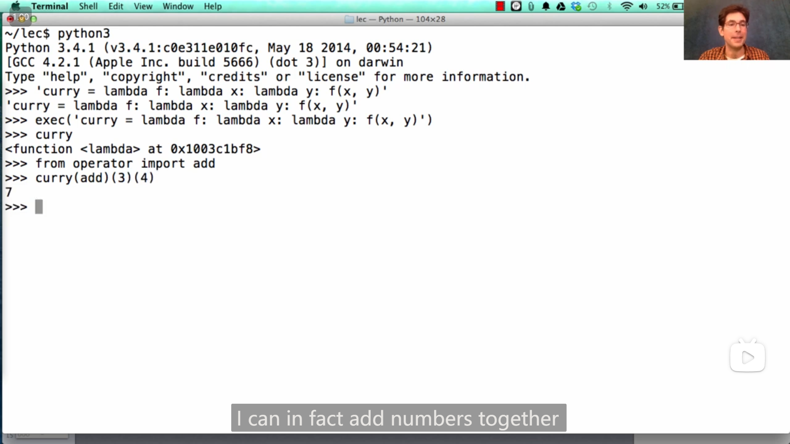
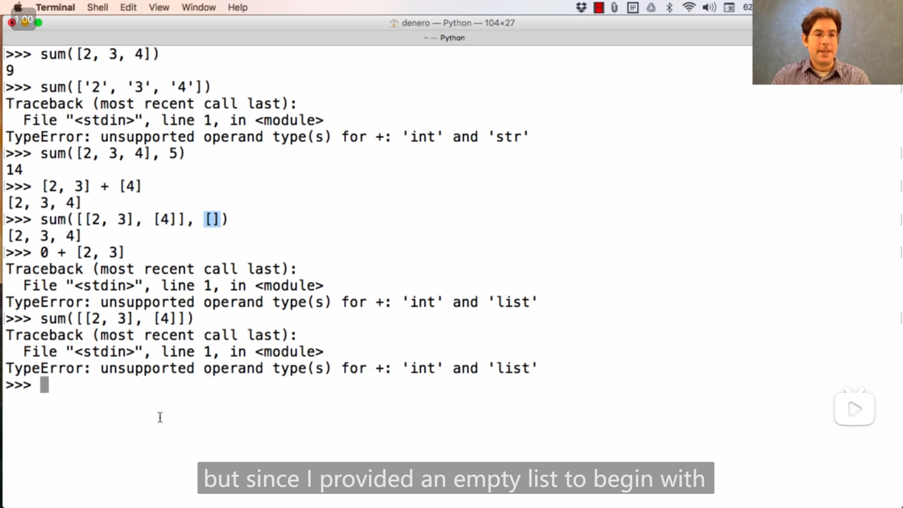

## Lab 0

### 1

运行hw或者lab任务的对应命令时，都加上 `--local` ，就只在本地运行，不会上传然后要求输入邮箱，如

```bash
python ok [-q xxx] --local
```

## Lecture 2 Functions

### 1

变量可以 “指向” 一个函数

{ loading=lazy }

### 2

cs61a中使用的可以显示python程序中 environment 、 frame 等信息的在线网站：

[Online Python Tutor - Composing Programs - Python 3](https://pythontutor.com/cp/composingprograms.html#mode=edit)

>   John DeNero 编写的cs61a的配套英文原版教材：
>
>   [Composing Programs](https://www.composingprograms.com/)
>
>   在github上发现的其对应仓库：
>
>   [DestructHub/composing-programs: Annotation and code about SICP Python (github.com)](https://github.com/DestructHub/composing-programs)
>
>   github上发现的非官方的还在翻译(23/7/21发现)的中文版的仓库：
>
>   [csfive/composing-programs-zh: 🚧 CS61A 教材《Composing Programs》即《计算机程序的构造与解释》Python 版本的中文翻译 (github.com)](https://github.com/csfive/composing-programs-zh)
>
>   其对应网页：
>
>   [CSfive | CSfive](https://sicp.csfive.works/)

### 3

调用函数时，会创建一个新的frame，且frame的名字为函数本身的名字(即创建时的名字 (如果是lambda匿名函数则 没有名字/名字为lambda))，

{ loading=lazy }

即如果用某个变量指向了函数，在用变量调用函数的时，创建的frame名字仍为原函数名

{ loading=lazy }

## Lecture 2 Q&A

### 1

{ loading=lazy }

在哪个frame中定义(define)的函数，其parent就是哪个frame，除了Global frame其他都有parent，

在frame中使用变量时，都会先在所在的frame中查找其对应的值，如果没有，则在上级parent中查找，如果还没有，则在parent的parent中查找(如果有parent)...

如上图中f函数要打印z的值，z在f1 frame中没有，则来到f1的parent在Global frame中查找z的值，于是获得z的值(此时)为7，则打印7

## Lecture 10 Containers

### 1

`exec()` 函数可以执行字符串中的语句，如

```python
exec("curry = lambda f: lambda x: lambda y: f(x, y)")
```

可以让 `curry` 变量指向一个匿名函数

{ loading=lazy }

### 2

例

```python
for _ in range(3):
    ...
```

可以用 `_` 变量表示 `for` 循环中执行的语句与迭代的变量无关

### 3

string字符串的元素也是字符串，list的元素就是元素，即有

```python
>>> str = "hello"
>>> str[3][0][0]
'l'
```

### 4

{ loading=lazy }

记忆技巧 *“下标”* 对应元素之前，

对有序结构切片也适用，其中的负数也适用，如

```python
>>> l = list(range(5))
>>> l
[0, 1, 2, 3, 4]
>>> l[1:-1]
[1, 2, 3]
```

### 5

列表推导式(list comprehension)可以用 `if` ：

```python
>>> l2 = [x for x in [0, 1, 2, 5, 6] if x % 3 == 0]
>>> l2
[0, 6]
```

### 6

如果列表有子列表，且元素个数都固定，那么 `for` 可以直接获取子列表的元素/unpack子列表，如子列表都含两个元素：

{ loading=lazy }

## Lecture 10 Q&A

### 1

递增的递归写阶乘：

```python
def fact(n):
    return fact_helper(n, 1, 1)

def fact_helper(n, k, result):
    """Computes k * (k + 1) * (k + 2) * ... * n
    by accumulating the result
    """
    if n == k:
        return k * result
    else:
        return fact_helper(n, k + 1, k * result)
```

{ loading=lazy }

>   or
>
>   ```python
>   def fact(n, k=1, result=1):
>       """Computes k * (k + 1) * (k + 2) * ... * n
>       by accumulating the result
>       """
>       if n == k:
>           return k * result
>       else:
>           return fact(n, k + 1, k * result)
>   ```

这种(递增的递归)更像循环语句

(也可以将helper写入函数内部)

```python
def fact(n):
    def helper(k, result):
        if k == n:
            return k * result
        else:
            return helper(k + 1, k * result)
    return helper(1, 1)
```

or

```python
def fact(n):
    def helper(k):
        if k == n:
            return k
        else:
            return k * helper(k + 1)
    return helper(1)
```

## Lecture 11 Data Abstraction

### 1

**"Unpacking" a list**

{ loading=lazy }

### 2

抽象思想

{ loading=lazy }

{ loading=lazy }

>   **==... you should know that when you're writing one part of a large program, that it should use the level abstraction appropriate to what you're trying to do,==**
>
>   **==and the higher you stay up, without crossing of these boundaries, the easier it will be to change your program==**

要 *向下解构*，和 *向上抽象*

### 3

{ loading=lazy }

字典可以通过特定的列表构造( 二元元组 组成的列表)

### 4

字典也有推导式

{ loading=lazy }

## Lecture 11 Q&A

### 1

抽象可以使得修改某一层(layer)代码时带来的冲击/影响被隔离(isolate the impact)，有时可以使得修改所产生的影响只在这一层上。

冲击被隔离的例子：python dictionary的底层代码经常改变，但并不影响python中的使用

### 2

添加判断功能可以这样设计

{ loading=lazy }

## Lecture 12 Trees

### 1

{ loading=lazy }

`[...]` 中括号/方括号(square brackets)中的内容表示为可选的(optional)

### 2

{ loading=lazy }
