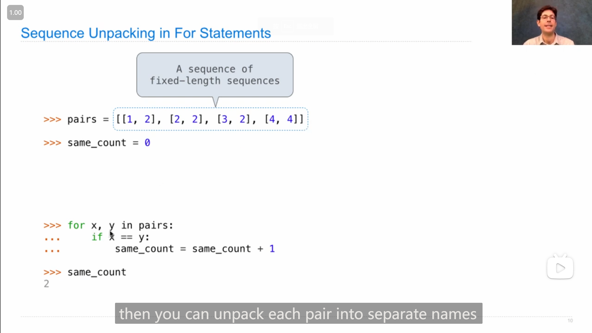
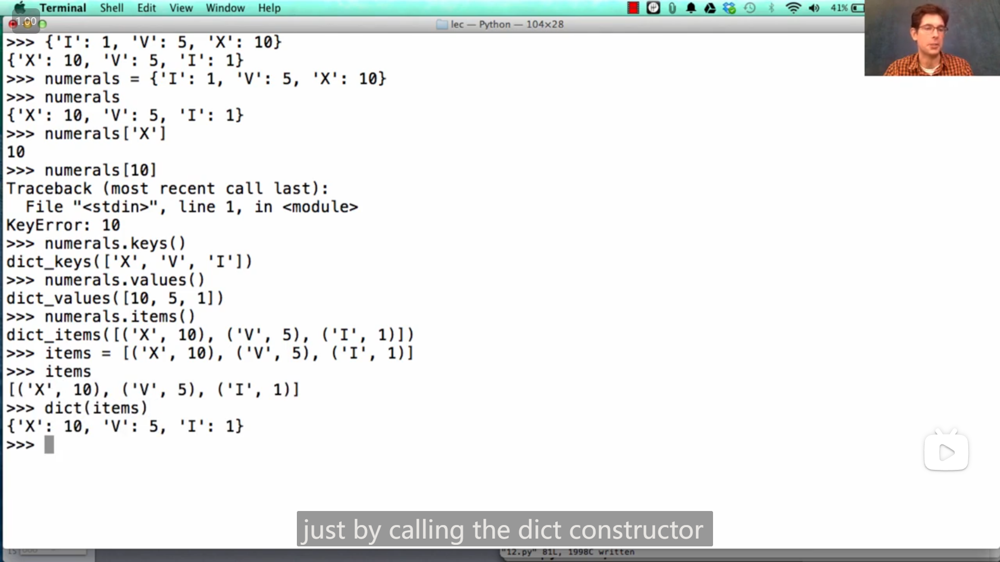

>   *Notes of Courses* on gitee.io
>
>   [CS61A - My Pamphlet (gitee.io)](https://ronald-luo.gitee.io/my-pamphlet_-notes-of-courses/Notes of Courses/CS61A/)

## Lab 0

### 1

运行hw或者lab任务的对应命令时，都加上 `--local` ，就只在本地运行，不会上传然后要求输入邮箱，如

```bash
python ok [-q xxx] --local
```

## Lecture 2 Functions

### 1

变量可以 “指向” 一个函数

{ loading=lazy }

### 2

cs61a中使用的可以显示python程序中 environment 、 frame 等信息的在线网站：

[Online Python Tutor - Composing Programs - Python 3](https://pythontutor.com/cp/composingprograms.html#mode=edit)

>   John DeNero 编写的cs61a的配套英文原版教材：
>
>   [Composing Programs](https://www.composingprograms.com/)
>
>   在github上发现的其对应仓库：
>
>   [DestructHub/composing-programs: Annotation and code about SICP Python (github.com)](https://github.com/DestructHub/composing-programs)
>
>   github上发现的非官方的还在翻译(23/7/21发现)的中文版的仓库：
>
>   [csfive/composing-programs-zh: 🚧 CS61A 教材《Composing Programs》即《计算机程序的构造与解释》Python 版本的中文翻译 (github.com)](https://github.com/csfive/composing-programs-zh)
>
>   其对应网页：
>
>   [CSfive | CSfive](https://sicp.csfive.works/)

### 3

调用函数时，会创建一个新的frame，且frame的名字为函数本身的名字(即创建时的名字 (如果是lambda匿名函数则 没有名字/名字为lambda))，

{ loading=lazy }

即如果用某个变量指向了函数，在用变量调用函数的时，创建的frame名字仍为原函数名

{ loading=lazy }

## Lecture 2 Q&A

### 1

{ loading=lazy }

在哪个frame中定义(define)的函数，其parent就是哪个frame，除了Global frame其他都有parent，

在frame中使用变量时，都会先在所在的frame中查找其对应的值，如果没有，则在上级parent中查找，如果还没有，则在parent的parent中查找(如果有parent)...

如上图中f函数要打印z的值，z在f1 frame中没有，则来到f1的parent在Global frame中查找z的值，于是获得z的值(此时)为7，则打印7

## Lecture 10 Containers

### 1

`exec()` 函数可以执行字符串中的语句，如

```python
exec("curry = lambda f: lambda x: lambda y: f(x, y)")
```

可以让 `curry` 变量指向一个匿名函数

{ loading=lazy }

### 2

例

```python
for _ in range(3):
    ...
```

可以用 `_` 变量表示 `for` 循环中执行的语句与迭代的变量无关

### 3

string字符串的元素也是字符串，list的元素就是元素，即有

```python
>>> str = "hello"
>>> str[3][0][0]
'l'
```

### 4

{ loading=lazy }

记忆技巧 *“下标”* 对应元素之前，

对有序结构切片也适用，其中的负数也适用，如

```python
>>> l = list(range(5))
>>> l
[0, 1, 2, 3, 4]
>>> l[1:-1]
[1, 2, 3]
```

### 5

列表推导式(list comprehension)可以用 `if` ：

```python
>>> l2 = [x for x in [0, 1, 2, 5, 6] if x % 3 == 0]
>>> l2
[0, 6]
```

### 6

如果列表有子列表，且元素个数都固定，那么 `for` 可以直接获取子列表的元素/unpack子列表，如子列表都含两个元素：

{ loading=lazy }

## Lecture 10 Q&A

### 1

递增的递归写阶乘：

```python
def fact(n):
    return fact_helper(n, 1, 1)

def fact_helper(n, k, result):
    """Computes k * (k + 1) * (k + 2) * ... * n
    by accumulating the result
    """
    if n == k:
        return k * result
    else:
        return fact_helper(n, k + 1, k * result)
```

{ loading=lazy }

>   or
>
>   ```python
>   def fact(n, k=1, result=1):
>       """Computes k * (k + 1) * (k + 2) * ... * n
>       by accumulating the result
>       """
>       if n == k:
>           return k * result
>       else:
>           return fact(n, k + 1, k * result)
>   ```

这种(递增的递归)更像循环语句

(也可以将helper写入函数内部)

```python
def fact(n):
    def helper(k, result):
        if k == n:
            return k * result
        else:
            return helper(k + 1, k * result)
    return helper(1, 1)
```

or

```python
def fact(n):
    def helper(k):
        if k == n:
            return k
        else:
            return k * helper(k + 1)
    return helper(1)
```

## Lab 04

lab04中的Q4-Q6 在掌握了 *假想函数能返回所需要返回的东西(即假想返回的东西是已知的)* 的诀窍(在lecture12中)之后，做的很顺畅。

1.   先假想函数能返回所需的东西/值
2.   再想如何把情况分解成另一个或几个差不多(形式一样)但简单了一点的情况(有点类似于动态规划的找递推式)，如Q4中一般情况可以分成两个行/列减一的情况(即向上或向右走一步)
3.   再想 “基本情况” (最简单/特殊的情况(作为递归的终止情况))
4.   最后调整一般情况的返回的值

??? note "code"

    Q4
    
    ```python
    def paths(m, n):
        """Return the number of paths from one corner of an
        M by N grid to the opposite corner.
    
        >>> paths(2, 2)
        2
        >>> paths(5, 7)
        210
        >>> paths(117, 1)
        1
        >>> paths(1, 157)
        1
        """
        "*** YOUR CODE HERE ***"
        if m == 1 or n == 1:
            return 1
        else:
            return paths(m - 1, n) + paths(m, n - 1)
    ```
    
    Q5
    
    ```python
    def max_subseq(n, t):
        """
        Return the maximum subsequence of length at most t that can be found in the given number n.
        For example, for n = 20125 and t = 3, we have that the subsequences are
            2
            0
            1
            2
            5
            20
            21
            22
            25
            01
            02
            05
            12
            15
            25
            201
            202
            205
            212
            215
            225
            012
            015
            025
            125
        and of these, the maxumum number is 225, so our answer is 225.
    
        >>> max_subseq(20125, 3)
        225
        >>> max_subseq(20125, 5)
        20125
        >>> max_subseq(20125, 6) # note that 20125 == 020125
        20125
        >>> max_subseq(12345, 3)
        345
        >>> max_subseq(12345, 0) # 0 is of length 0
        0
        >>> max_subseq(12345, 1)
        5
        """
        "*** YOUR CODE HERE ***"
        if t == 0:
            return 0
        elif n < 10:
            return n
        else:
            return max(max_subseq(n // 10, t - 1) * 10 + n % 10, max_subseq(n // 10, t))
    ```
    
    Q6
    
    ```python
    def add_chars(w1, w2):
        """
        Return a string containing the characters you need to add to w1 to get w2.
    
        You may assume that w1 is a subsequence of w2.
    
        >>> add_chars("owl", "howl")
        'h'
        >>> add_chars("want", "wanton")
        'on'
        >>> add_chars("rat", "radiate")
        'diae'
        >>> add_chars("a", "prepare")
        'prepre'
        >>> add_chars("resin", "recursion")
        'curo'
        >>> add_chars("fin", "effusion")
        'efuso'
        >>> add_chars("coy", "cacophony")
        'acphon'
        >>> from construct_check import check
        >>> # ban iteration and sets
        >>> check(LAB_SOURCE_FILE, 'add_chars',
        ...       ['For', 'While', 'Set', 'SetComp']) # Must use recursion
        True
        """
        "*** YOUR CODE HERE ***"
        if not w1:
            return w2
        elif w1[0] == w2[0]:
            return add_chars(w1[1:], w2[1:])
        else:
            return w2[0] + add_chars(w1, w2[1:])
    ```

## Lecture 11 Data Abstraction

### 1

**"Unpacking" a list**

{ loading=lazy }

### 2

抽象思想

{ loading=lazy }

{ loading=lazy }

>   **==... you should know that when you're writing one part of a large program, that it should use the level abstraction appropriate to what you're trying to do,==**
>
>   **==and the higher you stay up, without crossing of these boundaries, the easier it will be to change your program==**

要 *向下解构*，和 *向上抽象*

### 3

{ loading=lazy }

字典可以通过特定的列表构造( 二元元组 组成的列表)

### 4

字典也有推导式

{ loading=lazy }

## Lecture 11 Q&A

### 1

抽象可以使得修改某一层(layer)代码时带来的冲击/影响被隔离(isolate the impact)，有时可以使得修改所产生的影响只在这一层上。

冲击被隔离的例子：python dictionary的底层代码经常改变，但并不影响python中的使用

### 2

添加判断功能可以这样设计

{ loading=lazy }

## Lecture 12 Trees

### 1

{ loading=lazy }

`[...]` 中括号/方括号(square brackets)中的内容表示为可选的(optional)

### 2

序列聚合函数(Sequence Aggregation)

{ loading=lazy }

`sum()` 函数，可以用于除字符串以外的序表，将序表中的元素以其对应的 `+` 法求和并返回(默认初始值为0，如果是其他类型，需要设置初始值，如列表需要传入空列表 `[]` 座位 `start` 参数)

{ loading=lazy }

`max()` 函数，可以返回最大值，或者是使key函数返回值最大的值(自变量)

{ loading=lazy }

>   对应的还有 `min()` 和 `any()`

### 3

**树抽象(Tree Abstaction)的实现**

{ loading=lazy }

### 4

递归在树中的运用，

要**==直接假想函数能返回所需要返回的东西(即假想返回的东西是已知的)==**，然后直接在函数内部去**直接使用**这个返回的东西，

并且需要记住树的孩子也是树。

例如

```python
def count_leaves(t):
    """Count the leaves of a tree."""
    if is_leaf(t):
        return 1
    else:
        branch_counts = [count_leaves(b) for b in branches(t)]
        return sum(branch_counts)
```

>   Hint: 假想该函数一定能返回树的叶子数(即假想已知子树叶子数)，然后对子树的叶子数和即得到本树的叶子数

```python
def leaves(tree):
    """Return a list containing the leaves labels of tree.
    
    >>> leaves(fib_tree(5))
    [1, 0, 1, 0, 1, 1, 0, 1]
    """
    if is_leaf(tree):
        return [label(tree)]
    else:
        return sum([leaves(b) for b in branches(tree)], [])
```

>   Hint: 假想该函数能返回 一个含 *树的所有叶子的值/标签* 的list 

```python
def increment_leaves(t):
    """Return a tree like t but with leaf labels incremented."""
    if is_leaf(t):
        return tree(label(t) + 1)
    else:
        bs = [increment_leaves(b) for b in branches(t)]
        return tree(label(t), bs)
```

```python
def increment(t):
    """Return a tree like t but with all labels incremented"""
    return tree(label(t) + 1, [increment(b) for b in branches(t)])
```

>   Hint: 假想能返回一个 ... 的树

```python
def fib_tree(n):
    if n <= 1:
        return tree(n)
    else:
        left, right = fib_tree(n - 2), fib_tree(n - 1)
        return tree(label(left) + label(right), [left, right])
```

>   Hint同上

### 5

还有另一种**不使用函数本身返回的值**的递归函数

{ loading=lazy }

```python
def fact(n):
    return fact_times(n, 1)

def fact_times(n, k):
    """Return k * n * (n - 1) * ... * 1"""
    if n == 0:
        return k
    else:
        return fact_times(n - 1, k * n)
```

{ loading=lazy }

(打印每个叶子(从根开始)的路径)

```python
def print_sums(t, so_far):
    so_far = so_far + label(t)
    if is_leaf(t):
        print(so_far)
    else:
        for b in branches(t):
            print_sums(b, so_far)
```

>   应该是将要迭代的变量作为参数传入函数中
