# CS61A Part 2

??? info "目录"

    -   [Lecture 18 Objects](#lecture-18-objects)
    -   [Lecture 18 Q&A](#lecture-18-qa)
    -   [HW 04](#hw-04)
    -   [Lecture 19 Inheritance](#lecture-19-inheritance)
    -   [Lecture 19 Q&A](#lecture-19-qa)
    -   [Lab 07](#lab-07)
    -   [Project Ants](#project-ants)
    -   [Lecture 20 Representation](#lecture-20-representation)
    -   [Lecture 20 Q&A](#lecture-20-qa)
    -   [Lecture 21 Composition](#lecture-21-composition)
    -   [HW 05](#hw-05)
    -   [Lecture 22 Efficiency](#lecture-22-efficiency)
    -   [Lab 08](#lab-08)
    -   [Lecture 23 Decomposition](#lecture-23-decomposition)
    -   [Lecture 23 Q&A](#lecture-23-qa)
    -   [Lecture 24 Data Example](#lecture-24-data-example)
    -   [Lecture 24 Q&A](#lecture-24-qa)
    -   [Lab 09](#lab-09)
    -   [Lecture 25 Users](#lecture-25-users)
    -   [Lecture 25 Q&A](#lecture-25-qa)
    -   [Lecture 26 Ethical AI & Data](#lecture-26-ethical-ai-data)
    -   [Lecture 27 Scheme](#lecture-27-scheme)
    -   [Lecture 27  Q&A](#lecture-27--qa)
    -   [Lab 10](#lab-10)
    -   [HW 06](#hw-06)
    -   [Lecture 28 Exception](#lecture-28-exception)
    -   [Lecture 28 Q&A](#lecture-28-qa)
    -   [Lecture 29 Calculater](#lecture-29-calculater)
    -   [Lecture 29 Q&A](#lecture-29-qa)
    -   [HW 07](#hw-07)
    -   [Lab 11](#lab-11)
    -   [Project Scheme](#project-scheme)

## Lecture 18 Objects

### 1

{ loading=lazy }

关于 class 和 object 之间的关系的形容

!!! quote

    关于 class 和 object 的解释：
    
    -   **class**: A class combines (and abstracts) data and functions
    -   **object**: An object is an instantiation of a class

### 2

{ loading=lazy }

类内的方法在编写是，第一个参数须是 `self` ，

但类内方法在被调用的时候，不需要传入 `self` 的值，或者说 `self` 就是调用方法的实例，所以只需要传入之后的参数

### 3

{ loading=lazy }

python有内置函数可以查询/访问类的实例的*属性(attribute)*，或者是类的属性 (**==类内的方法算作是类本身的属性，而不是具体实例的属性==**)

`getattr()` 可以访问属性，获取对应的值

`hasatrr()` 可以看是否有某个属性

**函数的第一个参数需要传入实例，第二个参数需要传入要查询的属性的属性名(以字符串传入)**

### 4

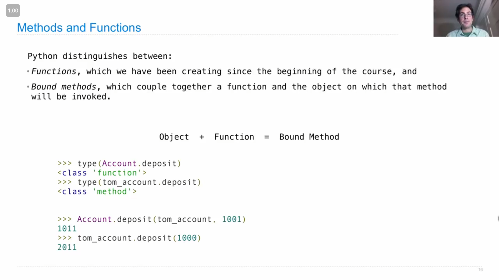{ loading=lazy }

如上图，`类名.方法名` 是一个函数，并且 `self` 参数需要传入东西，而 `对象.方法名` 是一个方法，`self` 不用传

### 5

{ loading=lazy }

**类属性**

如上图，在类中赋值的变量，(应该)就是类的属性(类内的方法也算是类的属性，第3点有提到过)，

**==类属性不是对象/实例的一部分，而是类的一部分==。每次通过对象来访问类属性，访问的是类中的属性，而通过 `对象.属性名` 赋值/更改属性，其实是在对象中创建/更改对应的属性(所以通过对象修改“类属性”不会更改实际的类属性)**

## Lecture 18 Q&A

### 1

类属性除了可以在类内定义，也可以在类以外，通过 `类名.属性名` 的形式赋值去定义，如

```python
class Account:
    ...
    
Account.interest = 0.03
```

>   ```python
>   >>> Account.interest  0.03
>   >>> a = Account('John')
>   >>> a.interest
>   0.03
>   >>> a.interest = 0.05
>   >>> a.interest
>   0.05
>   >>> b = Account('Hany')
>   >>> b.interest
>   0.03
>   >>> a.interest
>   0.05
>   >>> a.interest = Account.interest
>   >>> a.interest
>   0.03
>   >>> Account.interest = 0.04
>   >>> a.interest
>   0.03
>   >>>
>   ```

John的这段代码演示，显示了通过对象来修改“类属性”(指相同的名字)时，其实是修改的是具体对象中的属性

类和对象**两者各自的修改都不会影响到对方的属性**

**`del` 语句**，经过测试，是可以将对象中已有的属性清除掉，从而再次访问相同的属性名时，获取到的是类属性的值

```python
>>> class Account:
...     def __init__(self):
...         return
...
>>> Account.interest = 5
>>> p1 = Account()
>>> p1.interest
5
>>> del p1.interest
Traceback (most recent call last):
  File "<stdin>", line 1, in <module>
AttributeError: interest
>>> p1.interest += 2
>>> p1.interest
7
>>> Account.interest
5
>>> del p1.interest
>>> p1.interest
5
>>> del p1.interest
Traceback (most recent call last):
  File "<stdin>", line 1, in <module>
AttributeError: interest
>>>
```

### 2

{ loading=lazy }

`del` 也可以删除列表中的元素，

但是John说 `del` 不常用

## HW 04

### 1

Q4

!!! info

    *Hint:* If you had the permutations of all the elements in `seq` not including the first element, how could you use that to generate the permutations of the full `seq`?

这个提示很有用：考虑每次抽去其中一个元素的情况，然后依次递归...

一开始感觉能用推导式写成一行

```python
def permutations(seq):
    yield from [[seq[i]] + p for p in permutations(seq[:i] + seq[i + 1:]) for i in range(len(seq))]
```

然后发现，`i` 只对 `permutations(seq[:i] + seq[i + 1:])` 生效，`[seq[i]]` 中 `i` 显示未定义

然后改成

```python
def permutations(seq):
    for i in range(len(seq))
        yield from [[seq[i]] + p for p in permutations(seq[:i] + seq[i + 1:])]
```

然后在测试文档的一个测试用例中，用 `next()` 使用函数返回的生成器，显示 `StopIteration` ，

思考了很久，发现是因为，递归到了最后， `permutations(seq[:i] + seq[i + 1:])` 传入的是空列表，那么就不能*解压*出 `p` ，那么推导式的结果就会是空的列表，再一层层返回，所以最后整体的函数返回的生成器中没有可以迭代的元素

所以需要设置 base case ，(一开始以为不需要设置，或者说以为空列表就可以作为 base case)

```python
def permutations(seq):
    if len(seq) == 1:
        yield seq
    else:
        yield from [[seq[i]] + p for p in permutations(seq[:i] + seq[i + 1:])]
```

然后发现，测试文档中，有一个传入了元组，所以我稍加了修改

```python
def permutations(seq):
    seq = list(seq)
    if len(seq) == 1:
        yield seq
    else:
        yield from [[seq[i]] + p for p in permutations(seq[:i] + seq[i + 1:])]
```

>   后面发现，其实这样改也可以：
>
>   ```python
>   def permutations(seq):
>       if len(seq) == 1:
>           yield [seq[0]]
>       else:
>           yield from [[seq[i]] + p for p in permutations(seq[:i] + seq[i + 1:])]
>   ```

在思索到底一行语句实现功能是否可行时，想到了 `sum()` 函数，想到可以用它来把结果合并在一个列表中

```python
def permutations(seq):
    yield from sum([[... for p in permutations(seq[:i] + seq[i + 1:])] for i in range(len(seq))], start=[])
```

然后想到可以把 base case 放在 `sum` 函数外面

```python
def permutations(seq):
    yield from [[seq[0]]] if len(seq) == 1 else sum([[[seq[i]] + p for p in permutations(seq[:i] + seq[i + 1:])] for i in range(len(seq))], start=[])    
```

??? note "code"

    ```python
    def permutations(seq):
        """Generates all permutations of the given sequence. Each permutation is a
        list of the elements in SEQ in a different order. The permutations may be
        yielded in any order.
    
        >>> perms = permutations([100])
        >>> type(perms)
        <class 'generator'>
        >>> next(perms)
        [100]
        >>> try: #this piece of code prints "No more permutations!" if calling next would cause an error
        ...     next(perms)
        ... except StopIteration:
        ...     print('No more permutations!')
        No more permutations!
        >>> sorted(permutations([1, 2, 3])) # Returns a sorted list containing elements of the generator
        [[1, 2, 3], [1, 3, 2], [2, 1, 3], [2, 3, 1], [3, 1, 2], [3, 2, 1]]
        >>> sorted(permutations((10, 20, 30)))
        [[10, 20, 30], [10, 30, 20], [20, 10, 30], [20, 30, 10], [30, 10, 20], [30, 20, 10]]
        >>> sorted(permutations("ab"))
        [['a', 'b'], ['b', 'a']]
        """
        "*** YOUR CODE HERE ***"
        # seq = list(seq)
        # if len(seq) == 1:
        #     yield seq
        # else:
        #     for i in range(len(seq)):
        #         yield from [[seq[i]] + p for p in permutations(seq[:i] + seq[i + 1:])]
        yield from [[seq[0]]] if len(seq) == 1 else sum([[[seq[i]] + p for p in permutations(seq[:i] + seq[i + 1:])] for i in range(len(seq))], start=[])
    ```

### 2

Q5

>   Use `type(value) == str` to test if some `value` is a string

可以使用 `type(value) == str` 来判断一个东西是否是字符串

感觉我最后答案中的这一行是关键的地方：

```python
def make_joint(with_draw, old_pass, new_pass):
    def joint(amount, pw_input):
        ...
        return withdraw(amount, pw_input)  # key point
    ...
    return joint
```

??? note "code"

    ```python
    def make_joint(withdraw, old_pass, new_pass):
        """Return a password-protected withdraw function that has joint access to
        the balance of withdraw.
    
        >>> w = make_withdraw(100, 'hax0r')
        >>> w(25, 'hax0r')
        75
        >>> make_joint(w, 'my', 'secret')
        'Incorrect password'
        >>> j = make_joint(w, 'hax0r', 'secret')
        >>> w(25, 'secret')
        'Incorrect password'
        >>> j(25, 'secret')
        50
        >>> j(25, 'hax0r')
        25
        >>> j(100, 'secret')
        'Insufficient funds'
    
        >>> j2 = make_joint(j, 'secret', 'code')
        >>> j2(5, 'code')
        20
        >>> j2(5, 'secret')
        15
        >>> j2(5, 'hax0r')
        10
    
        >>> j2(25, 'password')
        'Incorrect password'
        >>> j2(5, 'secret')
        "Frozen account. Attempts: ['my', 'secret', 'password']"
        >>> j(5, 'secret')
        "Frozen account. Attempts: ['my', 'secret', 'password']"
        >>> w(5, 'hax0r')
        "Frozen account. Attempts: ['my', 'secret', 'password']"
        >>> make_joint(w, 'hax0r', 'hello')
        "Frozen account. Attempts: ['my', 'secret', 'password']"
        """
        "*** YOUR CODE HERE ***"
        def joint(amount, pw_input):
            if pw_input == new_pass:
                return withdraw(amount, old_pass)
            else:
                return withdraw(amount, pw_input)
        old_result = withdraw(0, old_pass)
        if type(old_result) == str:
            return old_result
        return joint
    ```

### 3

Q6

??? note "code"

    ```python
    def remainders_generator(m):
        """
        Yields m generators. The ith yielded generator yields natural numbers whose
        remainder is i when divided by m.
    
        >>> import types
        >>> [isinstance(gen, types.GeneratorType) for gen in remainders_generator(5)]
        [True, True, True, True, True]
        >>> remainders_four = remainders_generator(4)
        >>> for i in range(4):
        ...     print("First 3 natural numbers with remainder {0} when divided by 4:".format(i))
        ...     gen = next(remainders_four)
        ...     for _ in range(3):
        ...         print(next(gen))
        First 3 natural numbers with remainder 0 when divided by 4:
        4
        8
        12
        First 3 natural numbers with remainder 1 when divided by 4:
        1
        5
        9
        First 3 natural numbers with remainder 2 when divided by 4:
        2
        6
        10
        First 3 natural numbers with remainder 3 when divided by 4:
        3
        7
        11
        """
        "*** YOUR CODE HERE ***"
        def helper(i):
            # yield from [n * m + i for n in naturals()]
            if i != 0:
                yield i
            for n in naturals():
                yield n * m + i
        yield from [helper(i) for i in range(m)]
    ```

## Lecture 19 Inheritance

### 1

{ loading=lazy }

用 *点表达式 dot expression* 给属性赋值

==如果*点 `.`* 左边的对象是实例，那么赋值的就是实例的属性，==

==而如果*点 `.`* 左边的对象是类，那么赋值的就是类的属性==

>   这就解释了上节课 Q&A 中的第一点

并且，由于

>   Attribute assignment statement adds or modifies the attribute named ...

所以，属性赋值就是，如果实例/类**还没有**对应名字的属性，那么赋值就会添加一个相对应的属性，而如果已经存在对应名字的属性，那么就会修改这个属性的值

### 2

{ loading=lazy }

通过 `实例.属性` ，实际上是先在实例中先查看是否有对应的属性，如果有就返回，如果没有就到类中去查看是否有对应的属性

{ loading=lazy }

### 3

继承的语法：

```python
class <name>(<base class>):
    <suite>
```

### 4

{ loading=lazy }

一个使用继承的例子，没想到居然可以这样使用父类的方法 来修改成为自己的方法(惊奇地发现 `self` 参数原来是这么用的)

### 5

{ loading=lazy }

子类与父类的属性的使用关系感觉也是和实例与类的属性使用关系很像，即**父类的属性并没有复制并绑定到子类中，而是在使用属性时，现在子类中查看，如果没有就到父类中查看**(如果父类中没有就继续到父类的父类...)

### 6

John在demo中展示了 `CheckingAccount` 的 `withdraw` 方法的两种写法：

-   1

    ```python
    class CheckingAccount(Account):
        ...
        def withdraw(self, amount):
            amount = amount + 1
            if amount > self.balance:
                return 'Insufficient funds'
            self.balance = self.balance - amount
            return self.balance
    ```

-   2

    ```python
    class CheckingAccount(Account):
        ...
        withdraw_fee = 1
        def withdraw(self, amount):
            return Account.withdraw(self, amount + self.withdraw_fee)
    ```

前者相比于后者有个类似于(之前数据抽象相关的课程中提到的)打破抽象的界限的问题，会存在一个隐患，即如果对父类的方法进行修改，那么子类的方法还会是原来的样子，而后者如果父类被修改了，子类也会跟着一起修改

### 7

关于设计继承的时候John的几个**==建议==**：

-   **Don't repeat yourself; use existing implementations.**

    >   **try to avoid copying and pasting code**

    要避免直接复制代码，而是使用已经实现了的(父类的)方法或函数

-   **Attributes that have been overridden are still accessible via class objects.**

    意思就是，父类中被子类*覆写*了的属性，可以通过类名去访问

-   **Look up attributes on instances whenever possible.**

    意思是，尽可能使用实例的属性(值或者方法)，(而不是类的)

### 8

!!! quote

    **Inheritance and Composition**
    
    Object-oriented programming shines when we adopt the metaphor
    
    -   Inheritance is best for representing *is-a* relationships.
    
        E.g., a checking account **is a** specific type of account.
    
        So, CheckingAccount inherits from Account.
    
    -   Composition is best for representing *has-a* relationships.
    
        E.g., a bank **has a** collection of bank accounts it manages.
    
        So, A bank has a list of accounts as an attribute.

*继承*和*构成* (*Inheritance and Composition*)

==面向对象编程(的思想/概念)很适合类比现实中的事物==

-   **继承**适合表示 **是/属于** 的关系，比如：支票账户**是**银行账户的一种

    所以 支票账户 从 银行账户 继承

-   **构成**适合表示 **有** 的关系，比如：银行**有**很多银行账户

    所以，银行 有 一系列 银行账户 作为它的属性

### 9

{ loading=lazy }

关于第一个语句 `>>> C(2).n` 创建出的右下角的 `C` 类的实例中会存在 `z` 的疑惑和理解

由于**在创建 `C` 类的时候，会调用*初始化函数* `__init__()` ，而 `C` 类本身类中又没有*初始化函数*，所以==会调用父类中的*初始化函数*==**，故会调用 `B` 中的 `__init__()` ，**而值得注意的一点，由于是 `C` 的实例调用*初始化函数*，所以 ==`self` 被传入的是 `C` 的实例本身，因此 `self.z = self.f(y)` 这一行语句中，执行的 `f()` 函数是 `C` 类中的 `f()` 方法==，所以最后的结果是，那个实例中会存在一个 值为2的 `z`** 

所以对于python中的 `self` 参数有了新的认知，即**可以使用父类的方法，而 `self` 参数传入的却是子类的实例(所以要注意由于是子类的实例，有可能 `self.xxx` 之类的self的*点表达式*代码，得到的效果会和一般的父类实例不一样，比如上图中 `B` 的*初始化函数*如果传入的是 `B` 类的实例，那么很可能 `self.f(y)` 调用的是 `A` 类中的方法)**

>   在第三个语句中也出现了类似的情况(但是这第三个语句极其地绕)
>
>   `b = B(1)` 中，实例中的 `z` 由于调用了 `A` 中的 `f` 方法，所以指向了另一个 `B` 类实例，而新的实例*初始化函数*中 `z` 又指向的是一个 `C` 类的实例，而 `C` 类实例在初始化时，又需要调用 `B` 的 `__init__()` ，然后就调用了 `C` 类的 `f` 方法(我本来以为会一直 `B` 类 `C` 类来回一直指下去)

### 10

一个类可以继承多个父类，如

```python
class AsSeenOnTVAccount(CheckingAccount, SavingsAccount):
    def __init__(self, account_holder):
        self.holder = account_holder
        self.balance = 1
```

### 11

>   now it's hard for me to show you why this (multiple inheritance tends to make programs complicated) is the case, so instead I'll just show you an analogy about human inheritance.

{ loading=lazy }

在使用多重继承的时候，除非是真的很重要的关系，或者十分必须，在使用时要很注意，因为多重继承会使程序变得复杂，虽然很难举出例子，但是可以参考现实中(生物上)的继承

## Lecture 19 Q&A

### 1

{ loading=lazy }

`type()` 函数如果返回类，可以通过它的返回值来访问类内的属性，如

>   ```python
>   class Account:
>       def __init__(self, account_holder):
>           self.holderr = account_holder
>           self.balance = 0
>           
>       def deposit(self, amount):
>           self.balance = self.balance = amount
>           return self.balance
>   ```

```python
>>> a = Account('John')
>>> type(a).deposit(a, 100)
100
```

但是 Hany 说应该避免使用这种写法，因为大多数人不会怎么写

### 2

{ loading=lazy }

根据 John 的解释，`super()` 的作用是，不在本类中寻找 `.` 之后的东西，而是在上一级父类中寻找

并且在使用父类的*方法*时，会将实例自动传入 `self` 参数，和直接 `父类名.方法` 的使用形式略有不同

### 3

{ loading=lazy }

有多继承的类在使用本类中没有的方法时，是先在**上一级父类**中**按顺序**寻找，比如上图，如果在 `CheckingAccount` 中没找到对应的方法，那么不会在 `CheckingAccount` 的父类( `Acount` 类)中寻找，而是在 `SavingAccount` 类中寻找，**如果所有的上一级父类中都没找到对应的方法，那么才会在上两级父类中寻找(即父类的父类)**

### 4

!!! quote

    **John**:
    
    well i'd say at the outset that it's often the case that tracing through, uh, tree recursion is not something that humans can tolerate, like it's, it's just really messy sometimes, um, so the right answer is to shift the way in which you approach understanding, uh, implementation to get away from tracing, and instead just treat the recursive calls as abstractions, they do the thing that they're supposed to do, but how they do them is not your problem, and then like you can put it together. but this is not, not like obvious or easy so, um, so maybe we can talk about that with a particular example. so maybe while i read this maybe hany can, uh, say whether that makes sense to him.
        
    &nbsp;

    **Hany**:
    
    i i'll add one more thing to it, so john's absolutely right that tracing tree recursion is very hard, you have to hold a lot in your memory. um, so one way to fix it is as he just said, is to just think differently about it. it's not about tracing, it's about thinking about the fundamental nature of, um, the, the functions and they just do what you want them to do, and the other is to just use toy examples.
    
    ---
    
    **John**：
    
    嗯，我首先要说的是，往往情况是，追踪树形递归对人类来说是无法忍受的，就像有时候非常混乱一样。所以正确的答案是改变你理解实现的方式，摆脱追踪，而是将递归调用视为抽象，它们执行它们应该执行的任务，但它们如何执行不是你的问题，然后你可以将它们组合起来。但这并不明显或容易，所以也许我们可以用一个具体的例子来讨论一下。所以也许在我阅读这个的时候，Hany可以说一下这是否有意义。
        
    &nbsp;

    **Hany**：
    
    我要补充一点，John说得对，追踪树形递归非常困难，你必须记住很多东西。所以解决的一种方法就像他刚才说的那样，只是以不同的方式思考。这不是关于追踪，而是思考函数的基本性质，它们只是执行你想要它们执行的任务，另一种方法是使用简单的示例。

John 和 Hany 说到**对树形递归追踪很难，所以不应该去追踪递归(我认为这里可以理解为，弄清楚递归的每一步的具体效果)，而是换一种想法去思考(即之前总结的假定函数能返回正确/所需的值)**

### 5

{ loading=lazy }

John 解答 Lab04 中的 Q5 ，

提到，在解答/构建递归时，可以先拿简单的例子来进行思考，比如 `n = 123 ; t = 2` (而不要上来就尝试弄清楚 5 位数)，然后通过分析简单的例子，思路就会很清晰

## Lab 07

### 1

在做Q1时，本来使用

```python
yield from [x * multiplier for x in it]
```

但是当 `it` 是能无穷迭代的生成器时(如要测试的 `naturals()` )，就会超时，

但我询问 chatgpt ，它提供的代码与我上面的代码很像，只是把列表换成了元组，然后测试竟然不会超时，

**所以使用 `yield from` 时可以使用元组来避免可以无穷迭代的迭代器造成的超时**

下面是询问 chatgpt 为什么会这样的原因的记录

???+ example "chat log"

    **You**:
    
    Generators also allow us to represent infinite sequences, such as the sequence of natural numbers (1, 2, ...) shown in the function below!
    
    ```python
    def naturals():
        """A generator function that yields the infinite sequence of natural
        numbers, starting at 1.
    
        >>> m = naturals()
        >>> type(m)
        <class 'generator'>
        >>> [next(m) for _ in range(10)]
        [1, 2, 3, 4, 5, 6, 7, 8, 9, 10]
        """
        i = 1
        while True:
            yield i
            i += 1
    ```
    
    **Q1: Scale**
    
    Implement the generator function `scale(it, multiplier)`, which yields elements of the given iterable `it`, scaled by `multiplier`. As an extra challenge, try writing this function using a `yield from` statement!
    
    ```python
    def scale(it, multiplier):
        """Yield elements of the iterable it scaled by a number multiplier.
    
        >>> m = scale([1, 5, 2], 5)
        >>> type(m)
        <class 'generator'>
        >>> list(m)
        [5, 25, 10]
    
        >>> m = scale(naturals(), 2)
        >>> [next(m) for _ in range(5)]
        [2, 4, 6, 8, 10]
        """
        "*** YOUR CODE HERE ***"
    ```
    
    &nbsp;
    
    **ChatGPT**:
    
    Certainly! You can implement the `scale` generator function using a `yield from` statement. Here's one way to do it:
    
    ```python
    def scale(it, multiplier):
        """Yield elements of the iterable it scaled by a number multiplier."""
        yield from (element * multiplier for element in it)
    
    # Test cases
    m = scale([1, 5, 2], 5)
    print(type(m))  # <class 'generator'>
    print(list(m))  # [5, 25, 10]
    
    m = scale(naturals(), 2)
    print([next(m) for _ in range(5)])  # [2, 4, 6, 8, 10]
    ```
    
    In this implementation, the `scale` function uses a generator expression with `yield from` to yield elements of the iterable `it` scaled by the given `multiplier`. The generator expression `(element * multiplier for element in it)` generates scaled elements one by one, and `yield from` is used to yield each element from this expression.
    
    &nbsp;
    
    **You**:
    
    why timeout by using list type while not by using tuple type?
    
    &nbsp;
    
    **ChatGPT**:
    
    If you are experiencing a timeout when using a list type but not when using a tuple type, it might be due to the differences in how lists and tuples are handled in Python. Lists are mutable, meaning their elements can be changed after the list is created, while tuples are immutable, and their elements cannot be changed.
    
    When you use a list comprehension with a generator expression and `yield from`, the entire list needs to be generated in memory before any elements can be yielded. This might be problematic for an infinite generator, as attempting to generate an infinite list in memory can lead to a timeout.
    
    On the other hand, when using a tuple, it is immutable. Python can optimize and generate each element of the tuple on-the-fly without needing to create an entire list in memory. This can be more efficient, especially when dealing with infinite sequences.
    
    Here's an example to illustrate the difference:
    
    ```python
    # Using a list
    def scale_list(it, multiplier):
        yield from [x * multiplier for x in it]
    
    # Using a tuple
    def scale_tuple(it, multiplier):
        yield from (x * multiplier for x in it)
    
    # Test cases
    m_list = scale_list(naturals(), 2)
    # This may lead to a timeout because it attempts to generate an infinite list in memory.
    # print(list(m_list))
    
    m_tuple = scale_tuple(naturals(), 2)
    # This is more efficient because it generates each element on-the-fly without creating an entire list.
    print([next(m_tuple) for _ in range(5)])
    ```
    
    In the commented-out line for `scale_list`, attempting to convert an infinite list to a list object might cause the program to run out of memory or take a very long time, leading to a timeout. Using a tuple can avoid this issue because it doesn't try to create an entire list in memory.
    
    &nbsp;
    
    **You**:
    
    translate to chinese
    
    &nbsp;
    
    **ChatGPT**:
    
    如果你在使用列表类型时遇到超时问题，但在使用元组类型时却没有，这可能是由于 Python 处理列表和元组的方式不同。列表是可变的，意味着它们的元素在列表创建后可以被修改，而元组是不可变的，它们的元素不能被修改。
    
    当你使用列表解析与生成器表达式以及 `yield from` 时，在产生任何元素之前需要在内存中生成整个列表。对于无限生成器，尝试在内存中生成无限列表可能导致超时。
    
    另一方面，使用元组是不可变的。Python 可以优化并在需要时即时生成元组的每个元素，而无需创建整个列表在内存中。这可能更有效率，尤其是在处理无限序列时。
    
    以下是一个示例，用以说明这种差异：
    
    ```python
    # 使用列表
    def scale_list(it, multiplier):
        yield from [x * multiplier for x in it]
    
    # 使用元组
    def scale_tuple(it, multiplier):
        yield from (x * multiplier for x in it)
    
    # 测试案例
    m_list = scale_list(naturals(), 2)
    # 这可能导致超时，因为它试图在内存中生成一个无限列表。
    # print(list(m_list))
    
    m_tuple = scale_tuple(naturals(), 2)
    # 这更加有效，因为它在不创建整个列表的情况下即时生成每个元素。
    print([next(m_tuple) for _ in range(5)])
    ```
    
    在注释掉的 `scale_list` 的行中，试图将无限列表转换为列表对象可能导致程序耗尽内存或花费很长时间，从而导致超时。使用元组可以避免这个问题，因为它不会尝试在内存中创建整个列表。

### 2

Q5中，我利用列表的 `.pop()` 方法来实现 `Player.play()` 方法，

在之前课程视频里介绍列表的 `.pop()` 方法是只能移除并返回列表的最后一个元素，但上网查询发现 `.pop()` 方法只是默认最后一个，还可以传入下标指定要移除并返回的元素，例如

```python
>>> list = [1, 2, 3, 4, 5]
>>> list.pop()
5
>>> list
[1, 2, 3, 4]
>>> list.pop(1)
2
>>> list
[1, 3, 4]
```

## Project Ants

### 1

Problem 4 中，有一点值得注意

!!! quote

    A good way to approach the implementation to `ShortThrower` and `LongThrower` is to have it inherit the `nearest_bee` method from the base `ThrowerAnt` class. The logic of choosing which bee a thrower ant will attack is essentially the same, except the `ShortThrower` and `LongThrower` ants have maximum and minimum ranges, respectively.
    
    To implement these behaviors, you will need to modify the `nearest_bee` method to reference `min_range` and `max_range` attributes, and only return a bee that is in range.

这题中要求实现两个 *蚂蚁射手* 的子类的寻找射击目标的方法，我本来差点就是想的在原有的代码上进行修改，看到上面这段话，我才想到有更好的方法--去**使用父类的方法**，

**教程中建议的方法是**，在父类中添加属性，再在子类中(有需要的话)进行覆写

>   最后发现采用教程中的思路，居然可以在子类中不用重新实现方法，直接使用父类中的方法即可
>
>   所以说，**==能用父类的属性(值或者方法)，就用父类的，尽可能的不要去重新实现==**
>

??? note "code"

    ```python
    class ThrowerAnt(Ant):
        ...
        # ADD/OVERRIDE CLASS ATTRIBUTES HERE
        food_cost = 3
        min_range = 0
        max_range = float('inf')
        
        def nearest_bee(self, beehive):
            """Return the nearest Bee in a Place that is not the HIVE (beehive), connected to
            the ThrowerAnt's Place by following entrances.
    
            This method returns None if there is no such Bee (or none in range).
            """
            # BEGIN Problem 3 and 4
            # return rANTdom_else_none(self.place.bees) # REPLACE THIS LINE
            place = self.place
            dist = 0
            while place is not beehive:
                if place.bees and dist >= self.min_range and dist <= self.max_range:
                    return rANTdom_else_none(place.bees)
                place = place.entrance
                dist += 1
            return None
            # END Problem 3 and 4
        
        ...
    
    class ShortThrower(ThrowerAnt):
        """A ThrowerAnt that only throws leaves at Bees at most 3 places away."""
    
        name = 'Short'
        food_cost = 2
        # OVERRIDE CLASS ATTRIBUTES HERE
        # BEGIN Problem 4
        max_range = 3
        # implemented = False   # Change to True to view in the GUI
        implemented = True
        # END Problem 4
    
    class LongThrower(ThrowerAnt):
        """A ThrowerAnt that only throws leaves at Bees at least 5 places away."""
    
        name = 'Long'
        food_cost = 2
        # OVERRIDE CLASS ATTRIBUTES HERE
        # BEGIN Problem 4
        min_range = 5
        # implemented = False   # Change to True to view in the GUI
        implemented = True
        # END Problem 4
    ```

### 2

Problem 4 中有一点提示，

可以使用 `float('inf')` 来获得一个*无穷大*的值

### 3

在 Extra Credit 中，

>   Some hints:
>
>   All instances of the same class share the same class attributes. How can you use this information to tell whether a QueenAnt instance is the true QueenAnt?
>
>   ...

基于这一点提示，所以我采取的方法是，在 `Ant` 类中设置一个类属性 `true_queen = None` 默认值是 `None` ，当第一个/真蚁后被创建时(通过判断 `true_queen` 是否为 `None` 来确定是否是真蚁后)， `true_queen` 就会指向它，而之后的蚁后就可以依据这个属性来判断出是*假蚁后*(impostor)

??? note "code"

    ```python
    class Ant(Insect):
        ...
        # ADD CLASS ATTRIBUTES HERE
        true_queen = None
        
        ...
        def remove_from(self, place):
            if self == self.true_queen:
                return
                    if place.ant is self:
                place.ant = None
            elif place.ant is None:
                assert False, '{0} is not in {1}'.format(self, place)
            else:
                # queen or container (optional) or other situation
                place.ant.remove_ant(self)
            Insect.remove_from(self, place)
            
    ...
    
    # BEGIN Problem EC
    # class QueenAnt(Ant):  # You should change this line
    class QueenAnt(ScubaThrower):
    # END Problem EC
        """The Queen of the colony. The game is over if a bee enters her place."""
    
        name = 'Queen'
        food_cost = 7
        # OVERRIDE CLASS ATTRIBUTES HERE
        # BEGIN Problem EC
        # implemented = False   # Change to True to view in the GUI
        implemented = True
        # END Problem EC
    
        def __init__(self, armor=1):
            # BEGIN Problem EC
            "*** YOUR CODE HERE ***"
            ScubaThrower.__init__(self, armor)
            self.buffed_ants = []
            if not Ant.true_queen:
                Ant.true_queen = self
            # END Problem EC
    
        def action(self, gamestate):
            """A queen ant throws a leaf, but also doubles the damage of ants
            in her tunnel.
    
            Impostor queens do only one thing: reduce their own armor to 0.
            """
            # BEGIN Problem EC
            "*** YOUR CODE HERE ***"
            if self is not self.true_queen:
                Ant.reduce_armor(self, self.armor)
                return
            ScubaThrower.action(self, gamestate)
            place = self.place.exit
            while place:
                if place.ant and place.ant not in self.buffed_ants:
                    place.ant.damage *= 2
                    self.buffed_ants += [place.ant]
                place = place.exit
            # END Problem EC
    
        def reduce_armor(self, amount):
            """Reduce armor by AMOUNT, and if the True QueenAnt has no armor
            remaining, signal the end of the game.
            """
            # BEGIN Problem EC
            "*** YOUR CODE HERE ***"
            ScubaThrower.reduce_armor(self, amount)
            if self == self.true_queen and self.armor <= 0:
                bees_win()
            # END Problem EC
    ```

### 4

Optional Problem 2 中

>   Hint: You may find the `isinstance` function useful for checking if an object is an instance of a given class. For example:
>
>   ```python
>       >>> a = Foo()
>       >>> isinstance(a, Foo)
>       True
>   ```

可以用 `isinstance()` 的函数来判断某个实例是否是某个类

### 5

Optional Problem 2 中

>   Note: the constructor of `ContainerAnt.__init__` is implemented as such
>
>   ```python
>       def __init__(self, *args, **kwargs):
>           Ant.__init__(self, *args, **kwargs)
>           self.contained_ant = None
>   ```
>
>   As we saw in Hog, we have that `args` is bound to all positional arguments (that is all arguments not passed not with keywords, and `kwargs` is bound to all the keyword arguments. This ensures that both sets of arguments are passed to the Ant constructor).

`args` 是所有没有 *关键字* (比如 `key=` 、 `base=` 就是关键字) 的参数，而 `kwargs` 是所有有 *关键字* 的参数

### 6

Optional Problem 2 有点难，debug都debug了10多次，成功实现的代码在下面

??? note "code"

    ```python
    class Ant(Insect):
        ...
        
        def add_to(self, place):
            if place.ant is None:
                place.ant = self
            else:
                # BEGIN Problem Optional 2
                # if not (isinstance(self, ContainerAnt) and self.can_contain(place.ant)) and not (isinstance(place.ant, ContainerAnt) and place.ant.can_contain(self)):
                if isinstance(self, ContainerAnt) and self.can_contain(place.ant):
                    self.contain_ant(place.ant)
                    place.ant = self
                elif isinstance(place.ant, ContainerAnt) and place.ant.can_contain(self):
                    place.ant.contain_ant(self)
                else:
                    assert place.ant is None, 'Two ants in {0}'.format(place)
                # END Problem Optional 2
            Insect.add_to(self, place)
        
        ...
        
    ...
    
    class ContainerAnt(Ant):
        def __init__(self, *args, **kwargs):
            Ant.__init__(self, *args, **kwargs)
            self.contained_ant = None
    
        def can_contain(self, other):
            # BEGIN Problem Optional 2
            "*** YOUR CODE HERE ***"
            return not self.contained_ant and not isinstance(other, ContainerAnt)
            # END Problem Optional 2
    
        def contain_ant(self, ant):
            # BEGIN Problem Optional 2
            "*** YOUR CODE HERE ***"
            if self.can_contain(ant):
                self.contained_ant = ant
                # self.place.ant = self
            # END Problem Optional 2
    
        def remove_ant(self, ant):
            if self.contained_ant is not ant:
                assert False, "{} does not contain {}".format(self, ant)
            self.contained_ant = None
    
        def remove_from(self, place):
            # Special handling for container ants (this is optional)
            if place.ant is self:
                # Container was removed. Contained ant should remain in the game
                place.ant = place.ant.contained_ant
                Insect.remove_from(self, place)
            else:
                # default to normal behavior
                Ant.remove_from(self, place)
    
        def action(self, gamestate):
            # BEGIN Optional 2
            "*** YOUR CODE HERE ***"
            if self.contained_ant:
                self.contained_ant.action(gamestate)
            # END Optional 2
    
    class BodyguardAnt(ContainerAnt):
        """BodyguardAnt provides protection to other Ants."""
    
        name = 'Bodyguard'
        food_cost = 4
        # OVERRIDE CLASS ATTRIBUTES HERE
        # BEGIN Optional 2
        # implemented = False   # Change to True to view in the GUI
        implemented = True
    
        def __init__(self, armor=2):
            ContainerAnt.__init__(self, armor)
        # END Optional 2
    ```

### 7

Optional Problem 4

这题我认为很难(看完题目要求时就已经头大了)，应该算是所有题目里面最难的一题，修修改改了很久才初步写完，然后还debug了很多次

---

刚开始时没什么头绪，所以打算 在教程的要求(主要要实现三个函数)中 **先从最简单的问题开始解决(最后发现这很有用，因为把简单的问题解决了，最后难的问题就变得清晰明了了)**，

`make_slow` 和 `make_scare` ，这两个基本上差不多，他们都是要返回一个新的方法

>   ```python
>   def make_slow(action, bee):
>       """Return a new action method that calls ACTION every other turn.
>   
>       action -- An action method of some Bee
>       """
>       # BEGIN Problem Optional 4
>       "*** YOUR CODE HERE ***"
>       # END Problem Optional 4
>   
>   def make_scare(action, bee):
>       """Return a new action method that makes the bee go backwards.
>   
>       action -- An action method of some Bee
>       """
>       # BEGIN Problem Optional 4
>       "*** YOUR CODE HERE ***"
>       # END Problem Optional 4
>   ```

但我一开始没有理解 *返回方法* 应该意味着什么，然后注意到了 **教程中的提示** ，即**==实例的方法是可以通过赋值去覆盖掉的==**

>   *Hint:* You will need to rebind a method in one of the functions. Note that when assigning to an instance, the self parameter isn't bound.
>
>   ```python
>     class X: pass
>     def f(x): return x ** 3
>     x = X()
>     x.f = f
>     print(x.f(2)) # prints 8
>   ```

所以我这时的想法是，在 `make_slow` 函数里面创建一个 用来当作方法 的函数，然后绑定到 `bee` 中，所以

```python
def make_slow(action, bee):
    def new_action(gamestate):
        if gamestate.time % 2 == 0:
            action(bee, gamestate)
    bee.action = new_action
    
...
```

但是突然感觉，方法应该是有 `self` 参数的，

以及 好像要求说的是要返回，所以我这时认为，应该要在函数中将这个 用作方法的函数 返回，然后在 `apply_status` 中再将它绑定到对象中，所以

```python
def make_slow(action, bee):
    def new_action(self, gamestate):
        if gamestate.time % 2 == 0:
            action(self, gamestate)
    return new_action
    
def make_scare(action, bee):
    def new_action(self, gamestate):
        bee.direction = self.place if self.place.entrance is gamestate.beehive else self.place.entrance
        action(self, gamestate)
    return new_action
```

`.direction` 属性是由于，教程中提示到

>   *Hint:* to make a bee go backwards, consider adding an instance variable indicating its current direction. Where should you change the bee's direction? Once the direction is known, how can you modify the `action` method of `Bee` to move appropriately?

所以我对 `Bee.action` 进行了修改

```python
class Bee(Insect):
    ...
    
    def action(self, gamestate):
        """A Bee's action stings the Ant that blocks its exit if it is blocked,
        or moves to the exit of its current place otherwise.

        gamestate -- The GameState, used to access game state information.
        """
        destination = self.place.exit
        # Extra credit: Special handling for bee direction
        # BEGIN EC
        "*** YOUR CODE HERE ***"
        destination = self.direction
        # END EC
        if self.blocked():
            self.sting(self.place.ant)
        elif self.armor > 0 and destination is not None:
            self.move_to(destination)
```

---

然后就开始写 `apply_status` 函数

一开始我没想好怎么设置 持续时间，所以就只是这样

```python
def apply_status(status, bee, length):
    """Apply a status to a BEE that lasts for LENGTH turns."""
    # BEGIN Problem Optional 4
    "*** YOUR CODE HERE ***"
    bee.action = status(bee.action, bee)
    # END Problem Optional 4
```

然后由于 剩余时间 需要被记录下来，而且我想到调用一次 action 函数就减少一次剩余时间，所以想到了在函数中再构建一个嵌套函数，然后使用 `nonlocal` 语句来减少 `length` 的值，并且在剩余时间为0的时候把方法换回原本的方法，所以

```python
def apply_status(status, bee, length):
    old_action = bee.action
    def new_action(gamestate):
        nonlocal length
        length -= 1
        status(old_action, bee)(self, gamestate)
        if length == 0:
            bee.action = old_action
            bee.direction = None
    bee.action = new_action
```

最后教程中还有一点，就是 **多状态** 的问题，

>   `apply_status` takes a `status` (either `make_slow` or `make_scare`), a `Bee`, and a `length`. The way it works is as so: imagine that a `Bee` has a bunch of statuses, each of which modifies `action` in sequence. When a status's length is up, it removes itself from the list. `apply_status` adds the given status to the end of the list, so that it is applied latest. Note that you don't necessarily need to make a literal list of statuses - it is just helpful to think of statuses in this way.
>
>   ---
>
>   As an example of what "previous behavior" means, take the example of a bee that has been slowed twice (say by two separate `SlowThrower`s). It will have the following behavior:
>
>   -   on time 1, it will do nothing. The outer slow has 2 turns to go, the inner one still has 3 turns
>   -   on time 2, it moves forward. The outer slow has 1 turn to go, the inner one has 2 turns
>   -   on time 3, it will do nothing. The outer slow has no turns left, the inner one has 2 turns
>   -   on time 4, it moves forward. The inner slow has 1 turn left
>   -   on time 5, it does nothing. The inner slow has no turns left

意思是要求，存在多个状态时，剩余时间会一起减少，但是应用的效果是按从早(最先生效)到晚(后产生)的顺序应用的，具体可以看教程中的解释

由于这个点我没有弄清楚应该如何实现，于是没有办法，我只能尝试先进行测试

---

测试出现的第一个问题

```python
>>> from ants import *
>>> beehive, layout = Hive(AssaultPlan()), dry_layout
>>> dimensions = (1, 9)
>>> gamestate = GameState(None, beehive, ant_types(), layout, dimensions)
>>> # Testing Slow
>>> slow = SlowThrower()
>>> bee = Bee(3)
>>> gamestate.places["tunnel_0_0"].add_insect(slow)
>>> gamestate.places["tunnel_0_4"].add_insect(bee)
>>> slow.action(gamestate)
>>> gamestate.time = 1
>>> bee.action(gamestate)
TypeError: apply_status.<locals>.new_action() missing 1 required positional argument: 'gamestate'

# Error: expected

# but got
#     Traceback (most recent call last):
#       ...
#     TypeError: apply_status.<locals>.new_action() missing 1 required positional argument: 'gamestate'
```

是指 `apply_status` 函数中的嵌套函数 `new_action` 在被使用时，第二个 `gamestate` 参数没有被传入值(一开始我的理解还有些偏差，经过了一些测试和试错才最终确定是这个原因)

这就意味着， `bee.action(gamestate)` 处，在调用新的方法时，只传入了一个参数(所以第二个参数没有被传入)，所以这似乎告诉我，在编写新的方法时，并不需要使用 `self` 参数

为了求证，我重新去查看和理解教程中给出的示例

>   *Hint:* You will need to rebind a method in one of the functions. Note that when assigning to an instance, the self parameter isn't bound.
>
>   ```python
>     class X: pass
>     def f(x): return x ** 3
>     x = X()
>     x.f = f
>     print(x.f(2)) # prints 8
>   ```

如何发现，这里面的 新方法 就是没有 `self` 参数，并且在调用时，这个实例也没有将自身作为参数传入其中(调用自身或父类的方法时，会把自身 **隐式地** 传入 `self` 参数)，所以得到结论，**==如果一个在类外定义的函数，被绑定成为了某个实例的属性，或者某种程度上可以说时成为了这个实例的一个方法，在通过 `实例.属性名` 的方式使用这个函数/方法时，是不会将实例传入函数/方法的==**

所以对原有代码进行了修改

```python
def make_slow(action, bee):
    def new_action(gamestate):
        if gamestate.time % 2 == 0:
            action(bee gamestate)
    return new_action

def make_scare(action, bee):
    def new_action(gamestate):
        bee.direction = bee.place if bee.place.entrance is gamestate.beehive else bee.place.entrance
        action(bee, gamestate)
    return new_action

def apply_status(status, bee, length):
    old_action = bee.action
    def new_action(gamestate):
        nonlocal length
        length -= 1
        status(old_action, bee)(gamestate)
        if length == 0:
            bee.action = old_action
            bee.direction = None
    bee.action = new_action
```

然后在测试修改好的代码时，发现

```python
>>> from ants import *
>>> beehive, layout = Hive(AssaultPlan()), dry_layout
>>> dimensions = (1, 9)
>>> gamestate = GameState(None, beehive, ant_types(), layout, dimensions)
>>> # Testing Slow
>>> slow = SlowThrower()
>>> bee = Bee(3)
>>> gamestate.places["tunnel_0_0"].add_insect(slow)
>>> gamestate.places["tunnel_0_4"].add_insect(bee)
>>> slow.action(gamestate)
>>> gamestate.time = 1
>>> bee.action(gamestate)
Traceback (most recent call last):
  File "E:\Courses\cs61a\projects\ants\ants.py", line 606, in new_action
    action(gamestate)
  File "E:\Courses\cs61a\projects\ants\ants.py", line 470, in action
    destination = self.direction
AttributeError: 'Bee' object has no attribute 'direction'

# Error: expected

# but got
#     Traceback (most recent call last):
#       ...
#     AttributeError: 'Bee' object has no attribute 'direction'
```

由于 `bee.direction` 没有初始值/默认值，所以有可能出现属性不存在的情况，所以进行修改

```python
class Bee(Insect):
    ...
    direction = None
    ...
    
    def action(self, gamestate):
        destination = self.place.exit
        # Extra credit: Special handling for bee direction
        # BEGIN EC
        "*** YOUR CODE HERE ***"
        if self.direction:
            destination = self.direction
        # END EC
        if self.blocked():
            self.sting(self.place.ant)
        elif self.armor > 0 and destination is not None:
            self.move_to(destination)
```

然后又出现了一个问题，

```python
>>> from ants import *
>>> beehive, layout = Hive(AssaultPlan()), dry_layout
>>> dimensions = (1, 9)
>>> gamestate = GameState(None, beehive, ant_types(), layout, dimensions)
>>> # Testing Slow
>>> slow = SlowThrower()
>>> bee = Bee(3)
>>> gamestate.places["tunnel_0_0"].add_insect(slow)
>>> gamestate.places["tunnel_0_4"].add_insect(bee)
>>> slow.action(gamestate)
>>> gamestate.time = 1
>>> bee.action(gamestate)
Traceback (most recent call last):
  File "E:\Courses\cs61a\projects\ants\ants.py", line 606, in new_action
    action(bee, gamestate)
TypeError: Bee.action() takes 2 positional arguments but 3 were given

# Error: expected

# but got
#     Traceback (most recent call last):
#       ...
#     TypeError: Bee.action() takes 2 positional arguments but 3 were given
```

`bee` 原本的方法传入了一个参数，所以可以发现，**==实例的方法本身已经将实例本身传入了 `self` 参数==**，比如 `old_action = bee.action` ，`bee.action` 已经给 `Bee.action` 中的 `self` 参数传入了自身(即 `bee` 实例)，而如果使用 `old_action` ，比如 `old_action(gs)` ，那么 `gs` 会被传入 `Bee.action` 的 `gamestate` (第二个参数)而不是 `self` 

所以进行修改

```python
def make_slow(action, bee):
    def new_action(gamestate):
        if gamestate.time % 2 == 0:
            action(gamestate)
    return new_action

def make_scare(action, bee):
    def new_action(gamestate):
        bee.direction = bee.place if bee.place.entrance is gamestate.beehive else bee.place.entrance
        action(gamestate)
    return new_action

def apply_status(status, bee, length):
    old_action = bee.action
    def new_action(gamestate):
        nonlocal length
        length -= 1
        status(old_action, bee)(gamestate)
        if length == 0:
            bee.action = old_action
            bee.direction = None
    bee.action = new_action
```

---

测试出现的第二个问题

```python
>>> from ants import *
>>> beehive, layout = Hive(AssaultPlan()), dry_layout
>>> dimensions = (1, 9)
>>> gamestate = GameState(None, beehive, ant_types(), layout, dimensions)
>>> scare = ScaryThrower()
>>> bee = Bee(3)
>>> gamestate.places["tunnel_0_0"].add_insect(scare)
>>> gamestate.places["tunnel_0_1"].add_insect(bee)
>>> scare.action(gamestate)
>>> bee.action(gamestate)
>>> bee.place.name
'tunnel_0_2'
>>> bee.action(gamestate)
>>> bee.place.name
'tunnel_0_3'
>>> #
>>> # Same bee should not be scared more than once
>>> scare.action(gamestate)
>>> bee.action(gamestate)
>>> bee.place.name
'tunnel_0_4'

# Error: expected
#     'tunnel_0_2'
# but got
#     'tunnel_0_4'
```

同一个蜜蜂只能被*恐吓*一次，所以对原有代码进行修改

```python
class Bee(Insect):
    ...
    direction = None
    has_been_scared = False
    ...

...
def make_scare(action, bee):
    def new_action(gamestate):
        if not bee.has_been_scared:
            bee.direction = bee.place if bee.place.entrance is gamestate.beehive else bee.place.entrance
        action(gamestate)
    return new_action

def apply_status(status, bee, length):
    old_action = bee.action
    def new_action(gamestate):
        nonlocal length
        length -= 1
        status(old_action, bee)(gamestate)
        if length == 0:
            bee.action = old_action
            bee.direction = None
            if status is make_scare:
                bee.has_been_scared = True
    bee.action = new_action
```

---

测试出现的第三个问题

```python
>>> from ants import *
>>> beehive, layout = Hive(AssaultPlan()), dry_layout
>>> dimensions = (1, 9)
>>> gamestate = GameState(None, beehive, ant_types(), layout, dimensions)
>>> # Testing long status stack
>>> scary = ScaryThrower()
>>> slow = SlowThrower()
>>> bee = Bee(3)
>>> gamestate.places["tunnel_0_0"].add_insect(scary)
>>> gamestate.places["tunnel_0_1"].add_insect(slow)
>>> gamestate.places["tunnel_0_3"].add_insect(bee)
>>> scary.action(gamestate) # scare bee once
>>> gamestate.time = 0
>>> bee.action(gamestate) # scared
>>> bee.place.name
'tunnel_0_4'
>>> for _ in range(3): # slow bee three times
...    slow.action(gamestate)
>>> gamestate.time = 1
>>> bee.action(gamestate) # scared, but also slowed thrice
>>> bee.place.name
'tunnel_0_4'
>>> gamestate.time = 2
>>> bee.action(gamestate) # scared and slowed thrice
>>> bee.place.name
'tunnel_0_5'
>>> gamestate.time = 3
>>> bee.action(gamestate) # slowed thrice
>>> bee.place.name
'tunnel_0_4'

# Error: expected
#     'tunnel_0_5'
# but got
#     'tunnel_0_4'
```

我判断这个就是由于没有处理多状态的情况而产生的问题

然后开始观察测试的代码(因为前几个输出都没有报错)，经过思考以及梳理代码的具体流程，我大概明白了出现这种情况的原因(前面计中情况没错而后面错了)，问题可能是出在，多状态下，*恐吓*状态结束时，(我写的原本的代码中)会把实例的 `.action` 方法赋值成原来的 `action` 方法，就应该会导致某种矛盾

而前面没有出错的 是因为 ***==恐吓==*==之后的*减速*状态，是将*恐吓*后的新 `action` 方法设置成了旧 `action` 方法，所以会有种类似于 hw04 的 Q5 Joint Account 一样的感觉(即联合账户在取钱时，会调用原账户的方法，然后如果原账户也是一个联合账户，那么就会继续调用原账户的原账户的方法...)==**，所以我的理解是这样


由于在状态剩余时间减为0之后，想不到如何把 `old_action` 给后面的 新action方法

所以将思路改变成，在剩余时间减为0之后，不结束函数，而是继续保留函数，并且剩余时间减为0之后就直接执行原本的 `old_action` 方法即可，所以

```python
def apply_status(status, bee, length):
    old_action = bee.action
    def new_action(gamestate):
        nonlocal length
        if length > 0:
            length -= 1
            status(old_action, bee)(gamestate)
            if length == 0:
                bee.direction = None
                if status is make_scare:
                    bee.has_been_scared = True
        else:
            old_action(gamestate)
    bee.action = new_action
```

最终终于成功解决这个问题

```bash
$ python ok -q optional4 --local
=====================================================================
Assignment: Project 3: Ants Vs. SomeBees
OK, version v1.18.1
=====================================================================

~~~~~~~~~~~~~~~~~~~~~~~~~~~~~~~~~~~~~~~~~~~~~~~~~~~~~~~~~~~~~~~~~~~~~
Running tests

---------------------------------------------------------------------
Test summary
    10 test cases passed! No cases failed.
```

??? note "code"

    ```python
    class Bee(Insect):
        ...
        # OVERRIDE CLASS ATTRIBUTES HERE
        ...
        direction = None
        has_been_scared = False
    
    
        ...
    
        def action(self, gamestate):
            """A Bee's action stings the Ant that blocks its exit if it is blocked,
            or moves to the exit of its current place otherwise.
    
            gamestate -- The GameState, used to access game state information.
            """
            destination = self.place.exit
            # Extra credit: Special handling for bee direction
            # BEGIN EC
            "*** YOUR CODE HERE ***"
            if self.direction:
                destination = self.direction
            # END EC
            if self.blocked():
                self.sting(self.place.ant)
            elif self.armor > 0 and destination is not None:
                self.move_to(destination)
    
        ...
    
    ...
    
    ############
    # Statuses #
    ############
    
    def make_slow(action, bee):
        """Return a new action method that calls ACTION every other turn.
    
        action -- An action method of some Bee
        """
        # BEGIN Problem Optional 4
        "*** YOUR CODE HERE ***"
        # def new_action(gamestate):
        #     if gamestate.time % 2 == 1:
        #         action(bee, gamestate)
        def new_action(gamestate):
            if gamestate.time % 2 == 0:
                action(gamestate)
        # bee.action = new_action
        return new_action
        # END Problem Optional 4
    
    def make_scare(action, bee):
        """Return a new action method that makes the bee go backwards.
    
        action -- An action method of some Bee
        """
        # BEGIN Problem Optional 4
        "*** YOUR CODE HERE ***"
        # bee.direction = bee.place.exit
        # def new_action(gamestate):
        #     bee.direction = bee.place if bee.place.entrance is gamestate.beehive else bee.place.entrance
        #     action(bee, gamestate)
        def new_action(gamestate):
            if not bee.has_been_scared:
                bee.direction = bee.place if bee.place.entrance is gamestate.beehive else bee.place.entrance
            action(gamestate)
        # bee.action = new_action
        return new_action
        # END Problem Optional 4
    
    def apply_status(status, bee, length):
        """Apply a status to a BEE that lasts for LENGTH turns."""
        # BEGIN Problem Optional 4
        "*** YOUR CODE HERE ***"
        old_action = bee.action
        def new_action(gamestate):
            nonlocal length
            if length > 0:
                length -= 1
                status(old_action, bee)(gamestate)
                if length == 0:
                    # bee.action = old_action
                    bee.direction = None
                    if status is make_scare:
                        bee.has_been_scared = True
            else:
                old_action(gamestate)
        # bee.action = status(bee.action, bee)
        bee.action = new_action
        # END Problem Optional 4
    
    
    class SlowThrower(ThrowerAnt):
        """ThrowerAnt that causes Slow on Bees."""
    
        name = 'Slow'
        food_cost = 4
        # BEGIN Problem Optional 4
        # implemented = False   # Change to True to view in the GUI
        implemented = True
        # END Problem Optional 4
    
        def throw_at(self, target):
            if target:
                apply_status(make_slow, target, 3)
    
    
    class ScaryThrower(ThrowerAnt):
        """ThrowerAnt that intimidates Bees, making them back away instead of advancing."""
    
        name = 'Scary'
        food_cost = 6
        # BEGIN Problem Optional 4
        # implemented = False   # Change to True to view in the GUI
        implemented = True
        # END Problem Optional 4
    
        def throw_at(self, target):
            # BEGIN Problem Optional 4
            "*** YOUR CODE HERE ***"
            if target:
                apply_status(make_scare, target, 2)
            # END Problem Optional 4
    ```

## Lecture 20 Representation

### 1

{ loading=lazy }

`repr()` 函数能把python表达式转换成在自然语言中*规范*的字符串，

返回的字符串和在终端中使用交互式的python，输入表达式时显示的结果一样(即如上图，`12e12` 和 `print(repr(12e12))` 显示的一样)

{ loading=lazy }

`str()` (类)可以将对象转换成(其对应的)字符串(感觉有点类似于 c++ 中 左移运算符 `<<` 的重载)，这个字符串和 使用 `print` 函数 显示的结果是相应的(或者说使用 `print` 函数会隐式地调用 `__str__` 方法)

上图中可以看到 `repr()` 和 `str()` 的不同之处

### 2

`repr()` 和 `str()` 都是通过调用传入参数的方法来实现功能

`repr()` 会调用 `__repr__` 方法，

>   ```python
>   def repr(x):
>       return type(x).__repr__(x)
>   ```
>
>   使用类内方法可以避免在实例中修改了方法

`str()` 会调用 `__str__` 方法

>   如果没有 `__str__` 方法，则调用 `__repr__` 方法
>
>   ```python
>   def str(x):
>       t = type(x)
>       if hasattr(t, '__str__'):
>           return t.__str__(x)
>       else:
>           return t.__repr__(x)
>   ```

### 3

如果一个类没有 `__str__` 方法，在直接调用 `__str__` 方法时，会改为调用 `__repr__` 方法

>   ```python
>   class Bear:
>       """A Bear."""
>       
>       def __repr__(self):
>           return 'Bear()'
>       
>   oski = Bear()
>   print(oski)
>   print(str(oski))
>   print(repr(oski))
>   print(oski.__str__())
>   print(oski.__repr__())
>   ```
>
>   运行以上代码，会显示
>
>   ```bash
>   Bear()
>   Bear()
>   Bear()
>   Bear()
>   Bear()
>   ```

### 4

字符串可以使用 `.format()` 来填入参数(需要注意序号/下标与传入顺序对应)

```python
>>> x = 5
>>> y = 6
>>> "x + y = {0}".format(x + y)
'x + y = 11'
>>> "x + y = {1}".format(x + y, y)
'x + y = 6'
```

或者也可以使用

```python
>>> f"x + y = {x + y}"
'x + y = 11'
```

### 5

{ loading=lazy }

python的一些特殊方法名(前后都有两个下划线的方法)

### 6

{ loading=lazy }

`__add__` 方法是实例在加号左边时使用， `__radd__` 方法是实例在加号右边时使用，

>   John 直接添加了一行代码
>
>   ```python
>   __radd__ = __add__
>   ```

## Lecture 20 Q&A

### 1

{ loading=lazy }

`type` 和 `isinstance` 的区别

-   `isinstance` 会判断一个实例是否是某个类或它的子类们
-   `type` 只会返回实例具体的类

### 2

{ loading=lazy }

John 使用递归和 `yield` 语句来实现输出树的所有根到叶子的路径的方法

```python
def print_all_paths(t):
    """Print all the paths from the root to a leaf.
    
    >>> t = tree(1, [tree(2, [tree(3), tree(5)]), tree(4)])
    >>> print_all_paths(t)
    [1, 2, 3]
    [1, 2, 5]
    [1, 4]
    """
    for path in all_paths(t):
        print(path)

def all_paths(t):
    if is_leaf(t):
        yield [label(t)]
    for b in branches(t):
        for path in all_paths(b):   # path might be [2, 3]
            yield [label(t)] + path # yielding [1, 2, 3]
```

## Lecture 21 Composition

### 1

John 为自定义的 *链表 Linked List* 类 用递归的方式编写了类似于python内置的 `range` `map` `filter` 函数

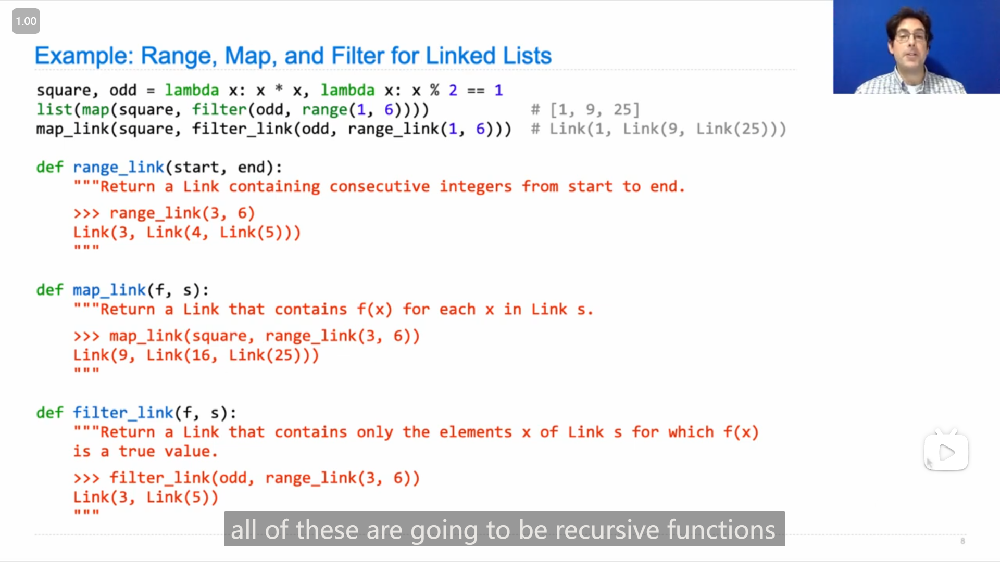{ loading=lazy }

>   ```python
>   class Link:
>       empty = ()
>       
>       def __init__(self, first, rest=empty):
>           assert rest is Link.empty or isinstance(rest, Link)
>           self.first = first
>           self.rest = rest
>           
>       def __repr__(self):
>           if self.rest:
>               rest_repr = ', ' + repr(self.rest)
>           else:
>               rest_repr = ''
>           return 'Link()' + repr(self.first) + rest_repr + ')'
>       
>       def __str__(self):
>           string = '<'
>           while self.rest is not Link.empty:
>               string += str(self.first) + ' '
>               slef = self.rest
>           return string + str(self.first) + '>'
>   ```

```python
def range_link(start, end):
    """Return a Link containing consecutive integers from start to end.
    
    >>> range_link(3, 6)
    Link(e, Link(4, Link(5)))
    """
    if start >= end:
        return Link.empty
    else:
        return Link(start, range_link(start + 1, end))
```

```python
def map_link(f, s):
    """Return a link that contains f(x) for each x in Link s.
    
    >>> map_link(square, range_link(3, 6))
    Link(9, Link(16, Link(25)))
    """
    if s is Link.empty:
        return s
    else:
        return Link(f(s.first), map_link(f, s.rest))
```

```python
def filter_link(f, s):
    """Return a Link that contains only the elements x of Link s for which f(x) is a true value.
    
    >>> filter_link(odd, range_link(3, 6))
    Link(3, Link(5))
    """
    if s is Link.empty:
        return s
    filtered_rest = filter_link(f, s.rest)
    if f(s.first):
        return Link(s.first, filtered_rest)
    else:
        return filtered_rest
```

### 2

{ loading=lazy }

John 用递归的方式写的 自定义链表结构 的 `add` 函数(让我觉得看起来很简洁)

```python
def add(s, v):
    """Add v to s, returning modified s.
    
    >>> s = Link(1, Link(3, Link(5)))
    >>> add(s, 0)
    Link(0, Link(1, Link(3, Link(5))))
    >>> add(s, 3)
    Link(0, Link(1, Link(3, Link(5))))
    >>> add(s, 4)
    Link(0, Link(1, Link(3, Link(4, Link(5)))))
    >>> add(s, 6)
    Link(0, Link(1, Link(3, Link(4, Link(5, Link(6))))))
    """
    assert s is not Link.empty
    if s.first > v:
        s.first, s.rest = v, Link(s.first, s.rest)
    elif s.first < v and empty(s.rest):
        s.rest = Link(v)
    elif s.first < v:
        add(s.rest, v)
    return s
```

### 3

John 展示的 `Tree` 类的实现代码

```python
class Tree:
    """A tree is a label and a list of branches."""
    def __init__(self, label, branches=[]):
        self.label = label
        for branch in branches:
            assert isinstance(branch, Tree)
        self.branches = list(branches)
        
    def __repr__(self):
        if self.branches:
            branch_str = ', ' + repr(self.branches)
        else:
            branch_str = ''
        return 'Tree({0}{1})'.format(repr(self.label), branch_str)
    
    def __str__(self):
        return '\n'.join(self.indented())
    
    def indented(self):
        lines = []
        for b in self.branches:
            for line in b.indented():
                lines.append('  ' + line)
        return [str(self.label)] + lines
    
    def is_leaf(self):
        return not self.branches
```

## HW 05

### 1

Q5 中，本来我以为

```python
return [t.label].extend([preorder(b) for b in t.branches])
```

能实现，但是显示没有返回的值，然后进行测试发现，**列表的 `.append()` 和 `.extend()` 方法没有返回值**

### 2

Q6，我的两种实现方式

-   按照原本提供的框架

    ??? note "code"

        ```python
        def path_yielder(t, value):
            "*** YOUR CODE HERE ***"
            
            if t.label == value:
                yield [t.label]
            for b in t.branches:
                for path in path_yielder(b, value):
            
                    "*** YOUR CODE HERE ***"
                    yield [t.label] + path
        ```
    
-   我整合成一行代码

    ??? note "code"

        ```python
        def path_yielder(t, value):
            yield from (([[t.label]] if t.label == value else []) +
                        sum([[[t.label] + path for path in path_yielder(b, value)] for b in t.branches], start=[]))
        ```

### 3

Q3中，原本我是用递归的方式来实现，但是会稍微麻烦一些，

```python
def store_digits(n):
    if n // 10 == 0:
        return Link(n)
    else:
        pre_digits = store_digits(n // 10)
        last_digits = pre_digits
        while last_digits.rest != Link.empty:
            last_digits = last_digits.rest
        last_digits.rest = Link(n % 10)
        return pre_digits
```

然后在提示视频中看到助教老师说**一般链表会使用递归和迭代的方式来实现功能**，这题使用迭代比较方便，然后我将我的代码改成了用迭代来实现

??? note "code"

    ```python
    def store_digits(n):
        link = Link(n % 10)
        while n // 10:
            n //= 10
            link = Link(n % 10, link)
        return link
    ```

## Lecture 22 Efficiency

### 1

{ loading=lazy }

从John的demo演示中可以看到， `def` 定义出的函数似乎也可以像类一样拥有*属性 Attribute* (可以使用 `.` 来访问)

### 2

**函数内部的变量具体指向的对象 取决于 ==调用时== 的情况**，

例如

```python
>>> def f(n):
...     return f(n-1) if n else n
...
>>> ori_f = f
>>> f = 6
>>> ori_f(4)
Traceback (most recent call last):
  File "<stdin>", line 1, in <module>
  File "<stdin>", line 2, in f
TypeError: 'int' object is not callable
>>>
```

在定义好 `f` 函数之后，将 `f` 修改为 `6` ，那么之后调用**原本的函数 `f`** 时，在进行递归调用(访问 `f` 变量)时，获取到的是整型 `6` ，所以会显示

```python
TypeError: 'int' object is not callable
```

所以，下面图中 John 演示的 demo 我觉得应该这样理解

{ loading=lazy }

```python
def fib(n):
    if n == 0 or n == 1:
        return n
    else:
        return fib(n-2) + fib(n-1)
    
def count(f):
    def counted(n):
        counted.call_count += 1
        return f(n)
    counted.call_count = 0
    return counted

def memo(f):
    cache = {}
    def memoized(n):
        if n not in cache:
            cache[n] = f(n)
        return cache[n]
    return memoized
```

-   第一步

    ```python
    >>> fib = count(fib)
    >>> counted_fib = fib
    ```

    将 `fib` 函数传入 `count` 函数中，获得 第一个 `counted` (与之后第二个 `counted` 作区分)

    ```mermaid
    flowchart LR
    变量名fib --> 第一个counted函数 --"f"--> fib函数
    counted_fib --> 第一个counted函数
    ```

-   第二步

    ```python
    >>> fib = memo(fib)
    ```

    这里 `fib` 指向的是 第一个 `counted` ，所以传入 `memo` 的是 第一个 `counted` ，

    然后获得 `memoized` 函数

    ```mermaid
    flowchart LR
    counted_fib --> 第一个counted函数 --"f"--> fib函数
    变量名fib --> memoized函数 --"f"--> 第一个counted函数
    ```

-   第三步

    ```python
    >>> fib = count(fib)
    ```

    和刚才类似，这里是将 `memoized` 函数传入 `count` ，然后获得 第二个 `counted` 函数

    ```mermaid
    flowchart LR
    counted_fib --> 第一个counted函数 --"f"--> fib函数
    memoized函数 --"f"--> 第一个counted函数
    变量名fib --> 第二个counted函数 --"f"--> memoized函数
    ```

-   而 `fib` 函数内部在递归时，会访问 变量名 `fib` ，所以关系可以进一步理解为

    ```mermaid
    flowchart LR
    变量名fib --> 第二个counted函数 --"f"--> memoized函数
    counted_fib --> 第一个counted函数 --"f"--> fib函数
    memoized函数 --"f"--> 第一个counted函数
    fib函数 -.-> 变量名fib
    ```

    所以，每次调用(原本的) `fib` 函数时，递归调用的是 第二个 `counted` 函数，并且由于是 *树形递归*，所以 第二个 `counted` 函数的 `call_count` 大约为 `n` (30)的两倍，

    而 第一个 `counted` 函数，只有 `memoized` 函数中传入未被记录结果的 `n` 时，才会被调用，因此 第一个 `counted` 函数 的 `call_count` 为 `31` ，刚好对应 0 到 30

### 3

{ loading=lazy }

John 给出了一种利用平方来加速 幂运算 的方法：

$$
b^n = \begin{cases}
1 & \mathrm{if} \ n = 0 \\
(b^{\frac{1}{2}n})^2 & \mathrm{if} \ n \ \mathrm{is \ even} \\
b \cdot b^{n-1} & \mathrm{if} \ n \ \mathrm{is \ odd} \\
\end{cases}
$$

```python
def exp(b, n):
    if n == 0:
        return 1
    elif n % 2 == 0:
        return square(exp(b, n // 2))
    else:
        return b * exp(b, n - 1)
    
def square(x):
    return x * x
```

### 4

John 展示了一下 Jupyter Notebook 的使用

!!! quote

    John:
    
    ...this environment is called a jupiter notebook, you can read about them online. it's a common way that people use in order to execute python code when the output is a graph or a chart.
    
    ---
    
    John:
    
    ...这个环境被称为Jupyter笔记本，你可以在网上了解更多相关信息。这是人们在执行输出为图表或图表的Python代码时常用的一种方式。

{ loading=lazy }

{ loading=lazy }

感觉用来画图会很方便

## Lab 08

### 1

Q5 的额外挑战 extra challenge，实现检测链表是否带有循环，但是只能使用固定大小的/恒定的空间

我一开始没想出来，第二天重新思考的时候，想到有循环就意味着会来到曾经来过的节点，那么就意味着 这个节点可以用比当前更少的步数从链表头到达，所以，我打算使用恒定空间来记录当前走过的步数，

最后成功实现了功能

??? note "code"

    ```python
    def has_cycle_constant(link):
        head = link
        count = 0
        while link.rest:
            link = link.rest
            count += 1
            sublist = head
            for _ in range(count):
                if sublist is link:
                    return True
                sublist = sublist.rest
        return False
    ```

## Lecture 23 Decomposition

### 1

{ loading=lazy }

一个之前没怎么使用过的python的数据类型 **set** ，它的特性

-   只能包含不同的元素，如果创建时有多个相同的元素，则只会保留一个
-   元素的顺序是无序的
-   John介绍说，使用 `in` 语句查询某个元素是否在一个 set 中，所需的时间是常数级的，不会随着 set 的长度增长(像列表就会随着长度增长，是线性级的)
-   `.union()` 和 `.intersection()` 分别是 set 取**并集**和**交集**的方法，并且 John 说道，这两个方法并不会对原本的 set 进行修改，而是会创建出一个新的 set

## Lecture 23 Q&A

### 1

有人提问的一道考试题目

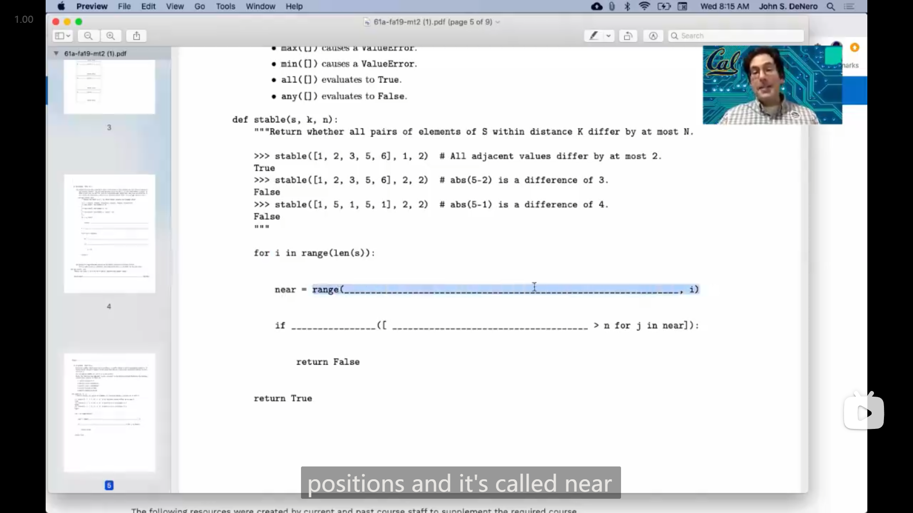{ loading=lazy }

我感觉还蛮有意思，于是我就暂停尝试了一下

```python
def stable(s, k, n):
    """Return whether all pairs of elements of S within distance K differ by at most N.
    
    >>> stable([1, 2, 3, 5, 6], 1, 2)  # All adjacent values differ by at most 2.
    True
    >>> stable([1, 2, 3, 5, 6], 2, 2)  # abs(5-2) is a difference of 3.
    False
    >>> stable([1, 5, 1, 5, 1], 2, 2)  # abs(5-1) is a difference of 4.
    False
    """
    for i in range(len(s)):
        near = range(max(i - k, 0), i)
        if any([abs(s[j] - s[i]) > n for j in near]):
            return False
    return True
```

运行进行测试，成功通过

```bash
> python -m doctest -v .\test.py
Trying:
    stable([1, 2, 3, 5, 6], 1, 2)  # All adjacent values differ by at most 2.
Expecting:
    True
ok
Trying:
    stable([1, 2, 3, 5, 6], 2, 2)  # abs(5-2) is a difference of 3.
Expecting:
    False
ok
Trying:
    stable([1, 5, 1, 5, 1], 2, 2)  # abs(5-1) is a difference of 4.
Expecting:
    False
ok
1 items had no tests:
    test
1 items passed all tests:
   3 tests in test.stable
3 tests in 2 items.
3 passed and 0 failed.
Test passed.
```

### 2

{ loading=lazy }

!!! quote

    ```python
    """A: (3 pts) Implement is_power, which takes a positive integer base and a
    non-negative integer s. It returns whether s is power of base, meaning that there
    is some non-negative integer n such that pow(base, n) equals s.
    
    IMPORTANT: You may not call pow, use the ** operator, or import any function
    (such as math.log). Your solution must be recursive.
    
    Check the doctests with: python3 -q a
    """
    def is_power(base, s):
        """Return whether s is a power of base.
        
        >>> is_power(5, 625)  # pow(5, 4) = 5 * 5 * 5 * 5 = 625
        True
        >>> is_power(5, 1)    # pow(5, 0) = 1
        True
        >>> is_power(5, 5)    # pow(5, 1) = 5
        True
        >>> is_power(5, 15)   # 15 is not a power of 5 (it's multiple)
        False
        >>> is_power(3, 9)
        True
        >>> is_power(3, 8)
        False
        >>> is_power(3, 10)
        False
        >>> is_power(1, 8)
        False
        >>> is_power(2, 0)    # 0 is not a power of any positive base.
        False
        
        >>> is_power(4, 16)
        True
        >>> is_power(4, 64)
        True
        >>> is_power(4, 63)
        False
        >>> is_power(4, 65)
        False
        >>> is_power(4, 32)
        False
        """
        assert base > 0 and s >= 0
        assert type(base) is int and type(s) is int
        if ______:
            return True
        elif ______:
            return False
        else:
            return ______
    
    
    curry2 = lambda f: lambda x: lambda y: f(x, y)
    
    """B: (5 pts) Implement powers, a generator function which takes positive
    integers n and k. It yields all integers m that are both powers of k and whose
    digits appear in order in n.
    
    Assume thar is_power is implemented correctly.
    
    Note: powers may yield its results in any order. The doctests below check what
    is yielded, but not the order. The built-in sorted funcion used in the doctests
    takes in an iterable object and returns a list containing the elements of the
    iterable in non-decreasing order.
    
    Check the doctests with: python3 ok -q b"""
    def powers(n, k):
        """Yield all powers of k whose digits appear in order in n.
        
        >>> sorted(powers(12345, 5))
        [1, 5, 25, 125]
        >>> sorted(powers(54321, 5))  # 25 and 125 are not in order
        [1, 5]
        >>> sorted(powers(2493, 3))
        [3, 9, 243]
        
        >>> sorted(powers(2493, 2))
        [2, 4]
        >>> sorted(powers(164352, 2))
        [1, 2, 4, 16, 32, 64]
        """
        def build(seed):
            """Yield all non-negetive integers whose digits appear in order in seed.
            0 is yielded because 0 has no digits, so all its digits are in seed.
            """
            if seed == 0:
                yield 0
            else:
                for x in ______:
                    ______
                    ______
        yield from filter(curry2(______)(______), build(n))
    ```

有人提问的一道题目，我有点想尝试一下，

本来只是想做一下第二题/第二部分，但是看题目要求好像第二题需要用到第一题的函数，于是就连第一题一起做完了😂

```python
def is_power(base, s):
    """Return whether s is a power of base.
    
    >>> is_power(5, 625)  # pow(5, 4) = 5 * 5 * 5 * 5 = 625
    True
    >>> is_power(5, 1)    # pow(5, 0) = 1
    True
    >>> is_power(5, 5)    # pow(5, 1) = 5
    True
    >>> is_power(5, 15)   # 15 is not a power of 5 (it's multiple)
    False
    >>> is_power(3, 9)
    True
    >>> is_power(3, 8)
    False
    >>> is_power(3, 10)
    False
    >>> is_power(1, 8)
    False
    >>> is_power(2, 0)    # 0 is not a power of any positive base.
    False
    
    >>> is_power(4, 16)
    True
    >>> is_power(4, 64)
    True
    >>> is_power(4, 63)
    False
    >>> is_power(4, 65)
    False
    >>> is_power(4, 32)
    False
    """
    assert base > 0 and s >= 0
    assert type(base) is int and type(s) is int
    if s == 1:
        return True
    elif base == 0 or base == 1 or s == 0 or s % base != 0:
        return False
    else:
        return is_power(base, s // base)
    
    
curry2 = lambda f: lambda x: lambda y: f(x, y)

def powers(n, k):
    """Yield all powers of k whose digits appear in order in n.
    
    >>> sorted(powers(12345, 5))
    [1, 5, 25, 125]
    >>> sorted(powers(54321, 5))  # 25 and 125 are not in order
    [1, 5]
    >>> sorted(powers(2493, 3))
    [3, 9, 243]
    
    >>> sorted(powers(2493, 2))
    [2, 4]
    >>> sorted(powers(164352, 2))
    [1, 2, 4, 16, 32, 64]
    """
    def build(seed):
        """Yield all non-negetive integers whose digits appear in order in seed.
        0 is yielded because 0 has no digits, so all its digits are in seed.
        """
        if seed == 0:
            yield 0
        else:
            for x in build(seed // 10):
                yield x
                yield x * 10 + seed % 10
    yield from filter(curry2(is_power)(k), build(n))
```

### 3

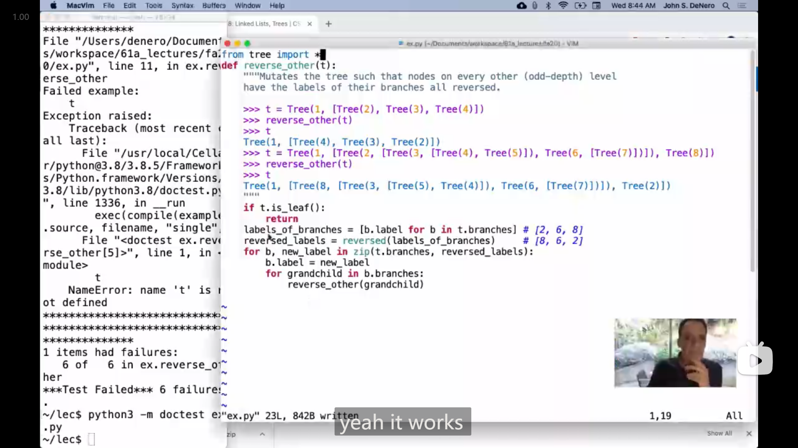{ loading=lazy }

John 提到了 lab 08 的 Q6 `reverse_other` 这题，基本的思路和之前我做的时候的思路感觉差不多，但是在具体处理上，我觉得老师的一些处理值得学习，

首先就是，用到了之前的练习中也有提到的 `zip` 函数，利用了 `zip` 感觉就比我之前的写法更加简洁，

然后是处理 **隔一层反转** 的操作上，是直接在子节点的循环中再次循环，就刚好能拿到 孙子节点，我之前的做法就稍微麻烦，还需要一个 `helper` 函数来辅助计数

{ loading=lazy }

John又展示了不使用 `zip` 的实现方法，而他这次利用了**负的下标**来实现翻转

```python
for i in range(len(t.branches)):
    t.branches[i].label = labels_of_branches[-i - 1]
    ...
```

### 4

有人提问，如果一个类继承自两个不同的类，那么它使用 `super` 时会怎样

!!! quote

    John:
    
    so if you use super on a class that inherits from two different classes, what have you built, you built something very strange, but basically whay you've built is the same object except for, it's gonna not look up things is its class, it's gonna look at them up in one of the base classes, and which one, well, it looks at them in the order that you inherit, so if have a class that inherits from both b and c, it's gonna look in b first and then it's gonna look at c, to find the corresponding attribute that you're looking at.
    
    ---
    
    John:
    
    当你在一个从两个不同类继承的类上使用 super 时，你构建了一些非常奇怪的东西，但基本上你构建的是相同的对象，只是它不会在其类中查找属性，而是会在其中一个基类中查找。而具体是哪一个基类呢？它会按照你继承的顺序查找，所以如果有一个类同时继承自类B和类C，它会首先在B中查找，然后再在C中查找相应的属性。

## Lecture 24 Data Example

### 1

{ loading=lazy }

尝试自己做了一下这四题，下面是我写的

```python
def indices_of_min_abs(s):
    """
    >>> indices_of_min_abs([-4, -3, -2, 3, 2, 4])
    [2, 4]
    >>> indices_of_min_abs([1, 2, 3, 4, 5])
    [0]
    """
    min_abs = min([abs(x) for x in s])
    return [i for i in range(len(s)) if abs(s[i]) == min_abs]

def largest_sum_of_adjacency(s):
    """
    >>> largest_sum_of_adjacency([-4, -3, -2, 3, 2, 4])
    6
    >>> largest_sum_of_adjacency([-4, 3, -2, -3, 2, -4])
    1
    """
    return max([s[i] + s[i + 1] for i in range(len(s) - 1)])

def map_digit_to_element(s):
    """
    >>> map_digit_to_element([5, 8, 13, 21, 34, 55, 89])
    {1: [21], 3: [13], 4: [34], 5: [5, 55], 8: [8], 9: [89]}
    """
    result = {}
    for x in s:
        d = x % 10
        if d not in result:
            result[d] = [x]
        else:
            result[d] += [x]
    return {d: result[d] for d in sorted(result)}

def every_element_has_equal_value(s):
    """
    >>> every_element_has_equal_value([-4, -3, -2, 3, 2, 4])
    False
    >>> every_element_has_equal_value([4, 3, 2, 3, 2, 4])
    True
    """
    for i in range(len(s)):
        if all([i == j or s[i] != s[j] for j in range(len(s))]):
            return False
    return True
```

---

在做第三个问题时，发现了如果 `sorted` 函数传入的是一个字典，那么会返回以键为元素排好序的列表

### 2

John 第一个问题中运用了 `map` 函数来获取 `min_abs` ，感觉比我的代码看起来更简洁些

```python
min_abs = min(map(abs, s))
```

John `return` 的那一行代码，提供了使用 `filter` 函数的另一种写法(由于 `filter` 返回的是一个迭代器，所以需要转换成列表)，

```python
return list(filter(lambda i: abs(s[i]) == min_abs, range(len(s))))
```

{ loading=lazy }

---

John 在第二个问题中又提供了第二种方法，利用 `zip` 函数，并且**利用切片来获取相邻元素**(感觉太强了😲，完全没想到能这样用 `zip` )

```python
return max([a + b for a, b in zip(s[:-1], s[1:])])
```

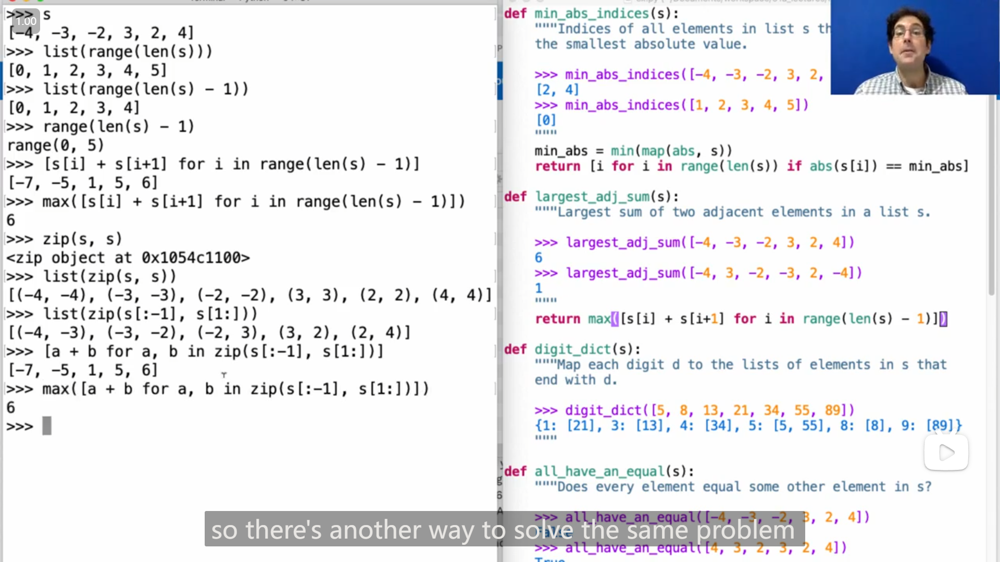{ loading=lazy }

---

第三个问题 John 用了跟我的思路不同的另一种思路来实现

```python
return {d: [x for x in s if x % 10 == d] for d in range(10) if any([x % 10 == d for x in s])}
```

{ loading=lazy }

---

第四个问题，John 一开始的思路感觉感觉和我的差不多，但是也比我的代码要简洁，

```python
return all([s[i] in s[:i] + s[i + 1:] for i in range(len(s))])
```

但是 John 提供了第二种思路，**==如果列表中有两个相同的数，那么意味着这个数的个数大于等于2==**，

{ loading=lazy }

因此可以这样写

```python
return all([sum([1 for y in s if y == x]) > 1 for x in s])
```

而进一步，可以借助 `min` 来判断最小的结果大于 1 就可以了，

而然后，列表有一个 `.count()` 方法，计算某个元素的个数，因此得到(应该是)最简洁的写法(真给我看得全程惊呆了😲)

```python
return min([s.count(x) for x in s]) > 1
```

{ loading=lazy }

### 3

{ loading=lazy }

这里的第三和第四个问题感觉有点意思，第四个问题我一开始想没有想出来，最后看了 John 的编写才想明白

{ loading=lazy }

```python
def merge(s, t):
    """Return a sorted Link with the elements of sorted s & t.
    
    >>> a = Link(1, Link(5))
    >>> b = Link(1, Link(4))
    >>> merge(a, b)
    Link(1, Link(1, Link(4, Link(5))))
    >>> a
    Link(1, Link(5))
    >>> b
    Link(1, Link(4))
    """
    if s is Link.empty:
        return t
    elif t is Link.empty:
        return s
    elif s.first <= t.first:
        return Link(s.first, merge(s.rest, t))
    else:
        return Link(t.first, merge(s, t.rest))
    
def merge_in_place(s, t):
    """Return a sorted Link with the elements of sorted s & t.
    
    >>> a = Link(1, Link(5))
    >>> b = Link(1, Link(4))
    >>> merge(a, b)
    Link(1, Link(1, Link(4, Link(5))))
    >>> a
    Link(1, Link(1, Link(4, Link(5))))
    >>> b
    Link(1, Link(4, Link(5)))
    """
    if s is Link.empty:
        return t
    elif t is Link.empty:
        return s
    elif s.first <= t.first:
        # return Link(s.first, merge(s.rest, t))
        s.rest = merge_in_place(s.rest, t)
        return s
    else:
        # return Link(t.first, merge(s, t.rest))
        t.rest = merge_in_place(s, t.rest)
        return t
```

## Lecture 24 Q&A

### 1

提到的17春(第二次期中模拟考)的一个题目

!!! quote

    **Perfect Engine!**
    
    You are in an apocalyptic society and have been charged with making an n-gen, or a generator that computes all of the n-perfect numbers. However, in this apocalyptic society, **built-in AND user-defined Python multiplication is forbidden** in any form!
    
    You have a blueprint for building a few n-gins from a natural number generator:
    
    ```txt
    A 2-gen:
    1 2 3 4 5 6 7 8 9 ...
    1 4 9 16 25 ...
    ```

    ```txt
    A 3-gen:
    1 2 3 4 5 6 7 8 9 ...
    1 3 7 12 19 27 ...
    1 8 27 ...
    ```
    
    Hint: Here is how `yield from` works. When used inside an iterable `yield from` will issue each element from another iterable as though it was issued from the first iterable. The following code is equivalent:
    
    ```python
    def generator1 ():
        for item in generator2 ():
            yield item
        # do more things in this generator
    ```

    ```python
    def generator1 ():
        yield from generator2 ()
        # more things on this generator
    ```
    
    Now its your job to build the perfect n-gen and power society out of the apocalypse! Good luck!
    
    ```python
    def nats():
        """
        A generator that yields
        all natural numbers.
        Might be helpful!
        """
        curr = 0
        while True:
            curr += 1
            yield curr
            
    def create_skip(n, gen):
        if n == 1:
            yield from ____________
        curr , skip = ________, ________
        for elem in ____________:
            if skip == n:
                ___________________
            else:
                curr = __________________
                skip = _________________
                yield _________________
            
    def perfect_ngen(n):
        """
        >>> two_gen = perfect_ngen(2)
        >>> next(two_gen)
        1
        >>> next(two_gen)
        4
        >>> next(two_gen)
        9
        >>> three_gen = perfect_ngen(3)
        >>> next(three_gen)
        1
        >>> next(three_gen)
        8
        >>> next(three_gen)
        27
        """
        gen = create_skip(____, _______)
        while _________________:
            n = _________________
            gen = create_skip(____, _______)
        return gen
    ```

感觉这题有点好玩，用到了一些数学上的结论，看了好一会才看懂题目，

大概是，要实现一个能返回 自然数的 n 次方生成器 的函数，而且不能使用乘法，

从给出的两个例子看，输出平方数列的方法是，将自然数列中的偶数(2的倍数)跳过，再将数列中之前的其他数加起来，和就刚好是平方，

而对于立方数列，与平方类似，先是将自然数列中 3的倍数跳过，然后将之前的其他数加起来，得到一个数列，再将这个数列再进行一次同样的操作(即跳过 3的倍数，取之前数的和，看到这里会发现 **自然数列中，3的倍数刚好间隔为3，而新数列中刚好间隔为2**，这一点会在给出的代码框架中被用上)，最后得到的数列就是立方数列(感觉好神奇😲)，

所以我就尝试了一下这个题目

```python
def nats():
    """
    A generator that yields
    all natural numbers.
    Might be helpful!
    """
    curr = 0
    while True:
        curr += 1
        yield curr
        
def create_skip(n, gen):
    if n == 1:
        yield from gen
    curr , skip = 0, 1
    for elem in gen:
        if skip == n:
            skip = 1
        else:
            curr = curr + elem
            skip = skip + 1
            yield curr
        
def perfect_ngen(n):
    """
    >>> two_gen = perfect_ngen(2)
    >>> next(two_gen)
    1
    >>> next(two_gen)
    4
    >>> next(two_gen)
    9
    >>> three_gen = perfect_ngen(3)
    >>> next(three_gen)
    1
    >>> next(three_gen)
    8
    >>> next(three_gen)
    27
    """
    gen = create_skip(n, nats())
    while n != 1:
        n = n - 1
        gen = create_skip(n, gen)
    return gen
```

{ loading=lazy }

### 2

{ loading=lazy }

!!! quote

    ```python
    def close(n, smallest=10, d=10):
        """ A sequence is near increasing if each element but the last two is smaller than all elements
        following its subsequent element. That is, element i must be smaller than elements i + 2, i + 3, i + 4 etc.
        Implement close, which takes a non-negative integer n and returns the largest near increasing sequence
        of digits within n as an integer. The arguments smallest and d are part of the implementation; you must
        determine their purpose. The only values you may use are integers and booleans (True and False) (no lists, strings, etc.).
        Return the longest sequence of near-increasing digits in n.
        >>> close(123)
        123
        >>> close(153)
        153
        >>> close(1523)
        153
        >>> close(15123)
        1123
        >>> close(11111111)
        11
        >>> close(985357)
        557
        >>> close(14735476)
        143576
        >>> close(812348567)
        1234567
        >>> close(45671) # with a 1 is 71; without a 1 is 4567
        4567
        """
        if n == 0:
            return 0
        no = close(n // 10, smallest, d)
        if smallest > ______:
            yes = ______
            return ______(yes, no)
        return ______
    ```

这道题有点难想，一开始看完了 John 写出答案的整个过程但还是没想明白，

然后 John 换了一个简单的例子来讲解，实现获得最大的递增子序列函数

{ loading=lazy }

!!! quote

    John:
    
    ...let's let's solve a simpler one, more complicated than this, but less complicated than this, let's get rid of this notion of near increasing, and just, uh, look for the longest increasing sequence within n. we would need to keep track of some notion of what's the smallest thing i've done so far, um, so what does this do, return the sequence of digits within n, sorry, the largest sequence of digits within n that is increasing. so how might it work, if i call increasing on here's some digits, let's see what we got we could have two, then four, then seven and eight, that's pretty long try one more, uh we could have three four five six seven, that's pretty long. i didn't check too carefully but it's about right.
    
    ```python
    def increasing(n, smallest=10):
        """Return the largest sequence of digits within n that is increasing.
        
        >>> increasing(87247861)
        2478
        >>> increasing(367456751)
        34567
        """
    ```
    
    how will we do this one, if n equals zero, return zero. otherwise, if um the last digit of n is less than whatever is the smallest thing i've seen so far, then i might want to include it. so i'm going to just write this as, maybe i'll use n percent 10 in the result, or maybe not.
    
    ```python
    def increasing(n, smallest=10):
        """Return the largest sequence of digits within n that is increasing.
        
        >>> increasing(87247861)
        2478
        >>> increasing(367456751)
        34567
        """
        if n == 0:
            return 0
        elif n % 10 < smallest:
            # Maybe I'll use n % 10 in the result or maybe not
        else:
    ```
    
    if n if the last digit is not allowed because it's bigger, than something that i've already decided i'm going to use, then i just can't use it. so that means the best i can do, is find the biggest increasing number within n divided by 10. okay so now we're going to have this notion of no and yes. no says i ignore n percent ten.
    
    ```python
    def increasing(n, smallest=10):
        """Return the largest sequence of digits within n that is increasing.
        
        >>> increasing(87247861)
        2478
        >>> increasing(367456751)
        34567
        """
        if n == 0:
            return 0
        elif n % 10 < smallest:
            # Maybe I'll use n % 10 in the result or maybe not
            no = increasing(n // 10)
            yes
        else:
            return increasing(n // 10)
    ```
    
    this is the same as that, which is why this had kind of a funny structure, we'll talk about that later. it is important that when you're looking for the smallest thing within, and ignoring the last digit you still respect, how whatever digits you've decided to keep already along the way, so you have to pass in this notion of what's the smallest thing i've already decided to use. and then if you decide to use n percent 10, which is smaller than the smallest, now you can still find more digits, but they're not allowed to just be smaller than the smallest thing you had previously seen, now they have to be smaller than n percent 10. it turns out that this could be simplified, because we know that this is smaller than that, so i could trim this down, and i'd get the same result. but i'm going to leave it like this just so we can compare it with the other thing in a minute. and then here i would say, well, maybe i found the best thing without using this digit.
    
    ```python
    def increasing(n, smallest=10):
        """Return the largest sequence of digits within n that is increasing.
        
        >>> increasing(87247861)
        2478
        >>> increasing(367456751)
        34567
        """
        if n == 0:
            return 0
        elif n % 10 < smallest:
            # Maybe I'll use n % 10 in the result or maybe not
            no = increasing(n // 10, smallest)
            yes = increasing(n // 10, min(n % 10, smallest)) * 10 + n % 10
            return max(no, yes)
        else:
            return increasing(n // 10, smallest)
    ```
    
    ...so uh so what now, if you can understand this, then you can eventually understand this, but i agree that like close is just a much, like a considerably more complicated version of increasing. so i would focus on understanding this first what's going on here. let's just look at the mechanics, we either use one or we don't, in the in the choice where we don't, we just kind of pretend it's not there, and then we either use six or we don't, and in the choice where we don't we just pretend it's not there, and then we either use eight or we don't, in the choice that we do now, we have to make sure that everything else that we choose from here is smaller than eight. so we're going to have eight in the end, but we make a recursive call, that is i want the longest increasing sequence within eight seven two four seven, you know everything that's left over, except for all of the digits there have to be smaller than eight, and that's how i got this number. so if that makes sense then look at the difference between this, and that the difference between this and that is that, like we're just tucking away the most recent digit, and we're gonna include it in this notion of smallest, one step later than we otherwise would. so you're allowed to ignore the five, when you're checking to make sure that one is small enough, because that's just the rules of how this works.
    
    ---
    
    John:
    
    ...让我们解决一个更简单的问题，比这个复杂，但比这个简单，让我们摆脱近似递增的概念，只是寻找n中最长的递增序列。我们需要保持某种关于到目前为止我做过的最小的概念，那么这个函数是干什么的，返回n中递增的最大数字序列。所以它可能是怎么工作的，如果我在这里的一些数字上调用increasing，让我们看看我们得到了什么，我们可能有2，然后4，然后7和8，这很长，再试一次，我们可能有3，4，5，6，7，这也很长。我没有仔细检查，但大致是对的。
    
    ```python
    def increasing(n, smallest=10):
        """Return the largest sequence of digits within n that is increasing.
        
        >>> increasing(87247861)
        2478
        >>> increasing(367456751)
        34567
        """
    ```
    
    我们要如何解决这个问题，如果n等于零，返回零。否则，如果n的最后一位数字小于到目前为止我看到的最小值，那么我可能想要包含它。所以我将写成这样，也许我会在结果中使用n % 10，或者也许不会。
    
    ```python
    def increasing(n, smallest=10):
        """Return the largest sequence of digits within n that is increasing.
        
        >>> increasing(87247861)
        2478
        >>> increasing(367456751)
        34567
        """
        if n == 0:
            return 0
        elif n % 10 < smallest:
            # Maybe I'll use n % 10 in the result or maybe not
        else:
    ```
    
    如果n的最后一位不允许，因为它比我已经决定要使用的某个东西要大，那么我就不能使用它。所以这意味着我能做的最好的事情是，在n除以10的范围内找到最大的递增数。好的，现在我们将有no和yes的概念。no表示我忽略n除以10的余数。
    
    ```python
    def increasing(n, smallest=10):
        """Return the largest sequence of digits within n that is increasing.
        
        >>> increasing(87247861)
        2478
        >>> increasing(367456751)
        34567
        """
        if n == 0:
            return 0
        elif n % 10 < smallest:
            # Maybe I'll use n % 10 in the result or maybe not
            no = increasing(n // 10)
            yes
        else:
            return increasing(n // 10)
    ```
    
    这与那个相同，这就是为什么这个有点奇怪的结构，我们稍后会讨论的原因。在查找最小值时，忽略最后一位数字时，仍然要尊重沿途已经决定要保留的任何数字的规则，因此您必须传递这个已经决定使用的最小值的概念。然后，如果决定使用n % 10，这小于最小值，现在仍然可以找到更多的数字，但它们不能仅仅小于之前已经看到的最小值，现在它们必须小于n % 10。事实证明，这可以简化，因为我们知道这小于那，所以我可以缩短这个，然后得到相同的结果。但我会保留它，只是为了在一分钟内与另一种情况进行比较。然后在这里我会说，嗯，也许我已经找到了不使用这个数字的最好的结果。
    
    ```python
    def increasing(n, smallest=10):
        """Return the largest sequence of digits within n that is increasing.
        
        >>> increasing(87247861)
        2478
        >>> increasing(367456751)
        34567
        """
        if n == 0:
            return 0
        elif n % 10 < smallest:
            # Maybe I'll use n % 10 in the result or maybe not
            no = increasing(n // 10, smallest)
            yes = increasing(n // 10, min(n % 10, smallest)) * 10 + n % 10
            return max(no, yes)
        else:
            return increasing(n // 10, smallest)
    ```
    
    ...所以，如果您能理解这一点，那么最终您就能理解这一点，但我同意close只是increasing的一个更复杂的版本。所以我建议先理解这个，这里发生了什么。让我们只看看机制，我们要么使用数字1，要么不使用，在我们不使用的选择中，我们只是假装它不存在，然后我们要么使用6，要么不使用，在我们不使用的选择中，我们只是假装它不存在，然后我们要么使用8，要么不使用，在我们使用的选择中，我们必须确保从这里选择的其他所有东西都小于8。所以最后我们会得到8，但是我们进行递归调用，也就是我要找到87247中最长的递增序列，你知道除了所有的数字之外，都必须小于8，这就是我得到这个数字的方式。所以如果这有意义，然后看看这个和那个之间的区别，这和那个之间的区别是，我们只是藏起了最近的数字，然后我们会在这个最小值的概念中包含它，比我们本来想的要晚一步。所以在检查1是否足够小时，您可以忽略5，因为这只是这个工作规则。

所以，如果拿 `increasing` 的例子来理解，就是先判断 `n` 的个位是否比 之前(之前即当前数位右边的数位，可以通过递归的方式来理解)浏览/判断过的位数的最小值 小，小就意味着是可以构成递增序列/满足递增条件的，那么再分出是否使用这个位数的两种情况，如果打算使用，就将最小值更新( `min(n % 10, smallest)` ，但由于 `elif` 已经判断过了，确实也可以直接使用 `n % 10` )，如果不打算使用就不改变最小值。而如果不满足递增条件，就刚好跟不打算使用的情况一样。

理解了 `increasing` 再去理解 `close` 就会好理解很多，除了 `d` 几乎都一样，而 `d` 的作用就是为了让位数晚传一位(满足 near increasing 的要求)

### 3

{ loading=lazy }

John 提到了一种使用 *同时赋值 Simultaneous Assignment* 的特殊情况，

John 说到在使用*同时赋值*时，会先计算等号右边的结果，再**按顺序**赋值给左边的，所以在这一行代码中

```python
L.rest, L = L.rest.rest, L.rest.rest
```

会先将 `L.rest` 指向 `L.rest.rest` ，然后再将变量名 `L` 指向 `L.rest.rest` ，所以会有如下图的改变

=== "前"

    { loading=lazy }

=== "后"

    { loading=lazy }

先是含有 `1` 的节点的 `rest` 指向含有 `3` 的节点(即 `L.rest.rest` )，再是 `L` 指向含有 `3` 的节点

## Lab 09

### 1

Q3，做的时候想了好一会，做完之后我感觉蛮有意思的，

这一题和上一题Q2很像，但是需要判断是否是(非严格)升序，所以提供的框架是构建一个 `subseq_helper` 函数，来记录前一个数的大小，

-   如果当前的数比前一个数小，就可以直接忽略这个数
-   如果大于等于，就需要分情况，当前这个数是否被使用(感觉算是Q2的升级版)

??? note "code"

    ```python
    def inc_subseqs(s):
        def subseq_helper(s, prev):
            if not s:
                return [[]]
            elif s[0] < prev:
                return subseq_helper(s[1:], prev)
            else:
                a = subseq_helper(s[1:], s[0])
                b = subseq_helper(s[1:], prev)
                return insert_into_all(s[0], a) + b
        return subseq_helper(s, 0)
    ```

### 2

Q4 这题也有点意思，我想到的递归的思路就是，把大的树分成两个小的，

然后一开始是把两个小的加起来，然后错了，捋了一下，发现应该是把两个小的 结果/可能 相乘，最后就对了

??? note "code"

    ```python
    def num_trees(n):
        if n == 1:
            return 1
        return sum([num_trees(i) * num_trees(n - i) for i in range(1, n)])
    ```

### 3

Q5，有点难想感觉(但是做完以后感觉这题又不是很复杂😂)

>   一开始 `for` 语句里 `g` 之后没写 `()` ，然后就发生了报错😅
>
>   ```python
>   Traceback (most recent call last):
>     File "E:\Courses\cs61a\lab\lab09\lab09.py", line 121, in make_generators_generator
>       for _ in g:
>   TypeError: 'function' object is not iterable
>   ```
>
>   之后这样类似的要注意

??? note "code"

    ```python
    def make_generators_generator(g):
        def gen(i):
            for e in g():
                if i == 0:
                    break
                yield e
                i -= 1
        count = 0
        for _ in g():
            count += 1
            yield gen(count)
    ```

### 4

Q12，感觉这题蛮有意思，定义了某种模板(可以从 doctest 中看出来)，感觉之后说不定能参考

```python
def make_to_string(front, mid, back, empty_repr):
    """ Returns a function that turns linked lists to strings.

    >>> kevins_to_string = make_to_string("[", "|-]-->", "", "[]")
    >>> jerrys_to_string = make_to_string("(", " . ", ")", "()")
    >>> lst = Link(1, Link(2, Link(3, Link(4))))
    >>> kevins_to_string(lst)
    '[1|-]-->[2|-]-->[3|-]-->[4|-]-->[]'
    >>> kevins_to_string(Link.empty)
    '[]'
    >>> jerrys_to_string(lst)
    '(1 . (2 . (3 . (4 . ()))))'
    >>> jerrys_to_string(Link.empty)
    '()'
    """
    def printer(lnk):
        if ______________:
            return _________________________
        else:
            return _________________________
    return printer
```

??? note "code"

    ```python
    def make_to_string(front, mid, back, empty_repr):
        def printer(lnk):
            if lnk is Link.empty:
                return empty_repr
            else:
                return front + str(lnk.first) + mid + printer(lnk.rest) + back
        return printer
    ```

### 5

Q13，给的代码框架感觉值得学习，而且一开始还没想明白要怎么编写😂

```python
def prune_small(t, n):
    while ___________________________:
        largest = max(_______________, key=____________________)
        _________________________
    for __ in _____________:
        ___________________
```

??? note "code"

    ```python
    def prune_small(t, n):
        while len(t.branches) > n:
            largest = max([b for b in t.branches], key=lambda t: t.label)
            t.branches.remove(largest)
        for b in t.branches:
            prune_small(b, n)
    ```

## Lecture 25 Users

### 1

!!! quote

    Alan Kay:
    
    ...We realized that was an incredibly important principle for user interface design. Why spend two weeks trying to read an MS-DOS manual to see how to copy a file or open up an application? What do you get from it? Much better to find a way of designing the user interface so that the person who uses it acts like an intermediate from the first time they sit down, and then they get into a process that is rewarding in itself.
    
    ---
    
    Alan Kay:
    
    ...我们意识到这是界面设计中非常重要的原则。为什么要花两周的时间阅读MS-DOS手册，看如何复制文件或打开应用程序呢？从中得到了什么？更好的方法是设计用户界面，使使用者从第一次坐下来就像一个中间人，然后他们进入一个本身就是有益的过程。

Alan Kay 借助一个实验，

>   让一个40多岁的大妈，通过简单的训练，短时间内上手网球的实验，
>
>   实验者通过教会这个大妈网球对打和发球的一些诀窍，而不是系统学习，来让她快速上手网球

提到了用户界面设计的一个重要的理念，用户界面应该要设计得能让用户快速学会并上手(而不是需要花大量的时间去查阅说明书来学习)，使用户感觉自己像一个 *中等水平的学生 intermediate* ，于是之后的学习就能得到积极的反馈(所以就会有兴趣去学习)

## Lecture 25 Q&A

### 1

提到的20春(第二次期中考试)的一题

{ loading=lazy }

!!! quote

    ```python
    """This question involves plucking the leaves off a tree one by one.
    
    Definitions:
    
    1) A "number tree" is a Tree whose labels are _unique_ positive integers.
       No repeated labels appear in a number tree.
       
    2) A "plucking order" for a number tree t is a sequence of unique positive
       integers that are all labels of t.
       
    3) A plucking order is "valid" if both of these conditions are true:
       (a) the plucking order contains all labels of t, and
       (b) in the plucking order contains all labels of t, and
           the labels of all its descendant nodes. Thus, leaves appear first.
           
    Note: redwood, pine, and cyprus are all kinds of trees.
    """
    
    """A: (3 pts) Implement order, which takes a number tree called rewood. It returns
    a valid plucking order as a list of numbers. If there is more than one valid
    plucking order for redwood, your order function can return any one of them.
    
    IMPORTANT: You do not need to return EVERY valid plucking order; just one.
    
    Check the doctests with: python3 ok -q a
    """
    def order(redwood):
        """Return a list containing a valid plucking order for the labels of t.
        
        >>> order(Tree(1, [Tree(2, [Tree(3, [Tree(4)])])]))               # The only valid plucking order.
        [4, 3, 2, 1]
        >>> order(Tree(1, [Tree(2), Tree(3)])) in [[2, 3, 1], [3, 2, 1]]  # Therre are 2 valid orders.
        True
        >>> o = order(Tree(1, [Tree(2, [Tree(3)]), Tree(4, [Tree(5)])]))  # There are many valid orders,
        >>> o.index(5) < o.index(4)                                       # but all have 5 before 4,
        True
        >>> o.index(3) < o.index(2)                                       # and 3 before 2,
        True
        >>> o[4:]                                                         # and 1 at the end.
        [1]
    
        >>> order(Tree(7, [Tree(4, [Tree(6)]), Tree(5)])) in [[6, 5, 4, 7], [5, 6, 4, 7], [6, 4, 5, 7]]
        True
        """
        plucking_order = []
        for b in ______:
            ______
        return plucking_order + [redwood.label]

    
    """B: (5 pts) Implement pluck, which takes a number tree called pine and returns
    a function that is called repeatedly on the elements of a plucking order. If that
    plucking order is valid, the final call returns 'success!'. Otherwise, if one of
    the repeated calls is on a number that is not part of a valid plucking order, the
    error string 'Hey, not valid!' is returned.
    
    Since pine is a number tree and the values passed to plucker form a plucking
    order, you can assume that:
    - The labels of pine are unique,
    - All values k passed to the plucker function are unique for a given pine, and
    - All values k are labels of pine.
    
    Check the doctests with: python3 ok -q b
    """
    def pluck(pine):
        """Return a function that returns whether a plucking order is valid
        for a number tree t when called repeatedly on elements of a plucking order.
    
        Calling the function returned by pluck should not mutate pine.
    
               +---+
               | 1 |
               +---+
               /   \----          /                 +---+         +---+
           | 2 |         | 6 |
           +---+         +---+
             |            /          |           /          +---+      +---+ +---+
           | 3 |      | 7 | | 8 |
           +---+      +---+ +---+
            / \               |
           /   \              |
        +---+ +---+         +---+
        | 4 | | 5 |         | 9 |
        +---+ +---+         +---+
    
        >>> b0 = Tree(2, [Tree(3, [Tree(4), Tree(5)])])
        >>> b1 = Tree(6, [Tree(7), Tree(8, [Tree(9)])])
        >>> t = Tree(1, [b0, b1])
        >>> pluck(t)(9)(8)(7)(6)(5)(4)(3)(2)(1)
        'success!'
        >>> pluck(t)(5)(9)(4)(7)(3)(8)(6)(2)(1)
        'success!'
        >>> pluck(t)(2)
        'Hey, not valid!'
        >>> pluck(t)(5)(9)(7)(6)
        'Hey, not valid!'
    
        >>> pluck(b0)(5)(2)
        'Hey, not valid!'
        >>> pluck(b0)(4)(5)(3)(2)
        'success!'
        """
        def plucker(k):
            def pluck_one_leaf(cyprus):
                """Return a copy of cyprus without leaf k and check that k is a
                leaf label, not an interior node label.
                """
                if ______:
                    ______
                plucked_branches = []
                for b in cyprus.branches:
                    skip_this_leaf = ______ and ______
                    if not skip_this_leaf:
                        plucked_branch_or_error = pluck_one_leaf(b)
                        if isinstance(plucked_branch_or_error, str):
                            return plucked_branch_or_error
                        else:
                            ______
                return Tree(______, plucked_branches)
            nonlocal pine
            if pine.is_leaf():
                assert k == pine.label, 'all k must appear in pine'
                return 'success!'
            ______
            if isinstance(pine, str):
                return pine
            return plucker
        return plucker
    ```

>   需要用到的 *树 Tree* 类
>
>   ```python
>   class Tree:
>       def __init__(self, label, branches=[]):
>           self.label = label
>           for branch in branches:
>               assert isinstance(branch, Tree)
>           self.branches = list(branches)
>           
>       def is_leaf(self):
>           return not self.branches
>   ```

于是尝试写了一下，

a题十分地简单

```python
def order(redwood):
        plucking_order = []
    for b in redwood.branches:
        plucking_order += order(b)
    return plucking_order + [redwood.label]
```

b题有点难度，但是照着框架去分析思考，最终也不难做出来

```python
def pluck(pine):
    def plucker(k):
        def pluck_one_leaf(cyprus):
            """Return a copy of cyprus without leaf k and check that k is a
            leaf label, not an interior node label.
            """
            if k == cyprus.label and not cyprus.is_leaf():
                return "Hey, not valid!"
            plucked_branches = []
            for b in cyprus.branches:
                skip_this_leaf = b.is_leaf() and b.label == k
                if not skip_this_leaf:
                    plucked_branch_or_error = pluck_one_leaf(b)
                    if isinstance(plucked_branch_or_error, str):
                        return plucked_branch_or_error
                    else:
                        plucked_branches += [plucked_branch_or_error]
            return Tree(cyprus.label, plucked_branches)
        nonlocal pine
        if pine.is_leaf():
            assert k == pine.label, 'all k must appear in pine'
            return 'success!'
        pine = pluck_one_leaf(pine)
        if isinstance(pine, str):
            return pine
        return plucker
    return plucker
```

### 2

提到了18秋第二次期中考试的一题

{ loading=lazy }

!!! quote

    **Trictionary or Treat**
    
    **Definition.** A *trictionary* is a pair of `Tree` instances `k` and `v` that have identical structure: each node in `k` has a corresponding node in `v` . The labels in `k` are called *keys*. Each key may be the label for multiple nodes in `k` , and the *values* for that key are the labels of all the corresponding nodes in `v` .
    
    A *lookup function* returns one of the values for a key. Specifically, a lookup function for a node in `k` is a function that takes `v` as an argument and returns the label for the corresponding node in `v` .
    
    Implement the generator function `lookups` , which takes a `Tree` instance `k` and some `key` . It yields all *lookup functions* for nodes in `k` that have `key` as their label. The `new_lookup` function is part of the implementation.
    
    -   `k` :
    
        ```txt
                5
              / | \
            7   8   5
          /   / |  / \
        2    3  4  4  2 
        ```
    
    -   `v` :
    
        ```txt
                'Go'
               / | \
            'C' 'A' 'L'
           /   / |  / \
        'C'  'S' 6  1 'A' 
        ```
    
    | <u>*key*</u> | <u>*values*</u> |
    | ------------ | --------------- |
    | 2            | 'C', 'A'        |
    | 3            | 'S'             |
    | 4            | 6, 1            |
    | 5            | 'Go', 'L'       |
    | 7            | 'C'             |
    | 8            | 'A'             |
    
    ```python
    k = Tree(5, [Tree(7, [Tree(2)]), Tree(8, [Tree(3), Tree(4)]), Tree(5, [Tree(4), Tree(2)])])
    v = Tree('Go', [Tree('C', [Tree('C')]), Tree('A', [Tree('S'), Tree(6)]), Tree('L', [Tree(1), Tree('A')])])
    
    def lookups(k, key):
        """Yield one lookup function for each node of k that has the label key.
        
        >>> [f(v) for f in lookups(k, 2)]
        ['c', 'A']
        >>> [f(v) for f in lookups(k, 3)]
        ['S']
        >>> [f(v) for f in lookups(k, 6)]
        []
        """
        if ______:
            yield lambda v: ______
        for i in range(len(k.branches)):
            ______:
                yield new_lookup(i, lookup)
            
    def new_lookup(i, f):
        def g(v):
            return ______
        return g
    ```

这题有点难度，首先使理解题目的意思，`lookups` 是需要生成能返回在(输入的) 树 `v` 中对应位置的值的函数。

题目给的框架也不是很容易看懂，我先是看到 `yield new_lookup(i, lookup)` 这行(看到 `lookup` )，所以猜上面一行是

```python
for lookup in lookups(k.branches[i], key):
```

这一行应该是用来递归，所以进而就很容易想到上面的 `if` 语句是 **base case** 即走到了叶子节点，于是，在最简单的情况下，就直接判断 树 `k` 的值和 `key` 是否相等就行了，所以

```python 
if k.is_leaf() and k.label == key:
    return lambda v: v.label
```

最后是 `new_lookup` 的部分(想了一会才想出来)，看到 `i` 所以想到 `i` 是用来传递路径相关的信息的(重点是需要理解传入的 `lookup` ，是子树的查找函数，所以 `new_lookup` 中需要的也是传入对应 `v` 的子树)，因此

```python
return f(v.branches[i])
```

>   完整代码
>
>   ```python
>   def lookups(k, key):
>       if k.is_leaf() and k.label == key:
>           yield lambda v: v.label
>       for i in range(len(k.branches)):
>           for lookup in lookups(k.branches[i], key):
>               yield new_lookup(i, lookup)
>           
>   def new_lookup(i, f):
>       def g(v):
>           return f(v.branches[i])
>       return g
>   ```

---

看了John的讲解，发现 `if` 那一行正确答案应该没有 `k.is_leaf()` ，上面的代码能通过只是因为刚好测试的值都在叶子节点，所以正确的代码应该是

```python
def lookups(k, key):
    if k.label == key:
        yield lambda v: v.label
    for i in range(len(k.branches)):
        for lookup in lookups(k.branches[i], key):
            yield new_lookup(i, lookup)
        
def new_lookup(i, f):
    def g(v):
        return f(v.branches[i])
    return g
```

{ loading=lazy }

## Lecture 26 Ethical AI & Data

### 1

{ loading=lazy }

Hany 在介绍 *监督学习 supervised learning* 时，提到了**线性**处理二维数据一种方法，通过找到一个投影面(线)，使得在投影面上，同类之间距离尽可能小，而异类之间的距离尽可能大，于是通过其法线就可以获得分割线

### 2

Hany在这节课的最后关于AI的使用的看法，我认为说的很好

!!! quote

    Hany:
    
    ...We just seem to be stuck at around 65% (accuracy).
    
    Okay, I posit I cannot prove, but I posit: I think that this is a fundamentally hard problem, and I am unconvinced that you can actually do better than this. Because think about what you're asking the algorithm to do. You're asking it to predict the future from a relatively small amount of data, and the future, two years in advance, of a fairly complex set of social, economic, personal, and just what is random dumb luck going to happen in somebody's life. And I don't think that's a stretch of imagination to say that this is really hard.
    
    So here's a question for you: should we even be doing this? Should we actually be trying to predict whether somebody's going to commit a crime in the future and then incarcerate them if we think that they are, if the accuracy is 65%? What if the accuracy is 75%? What if it's 85%? What if it's you? What if it's somebody you love? Do you want this algorithm being applied to somebody with this kind of error rate? What's an acceptable error rate? Are these things really better than humans? How do you deal with the bias? Nobody has good answers to these things.
    
    So here's a question. Now I come back to the title. right? Just because you can do something doesn't mean you should. And as you enter into what is undoubtedly an incredibly exciting time for us in terms of computation and AI and data, and the impact that we can have on the world, we have to start thinking about what are the negative aspects of what we are doing. Should we be trying to make these decisions? And if we do, the answer may be yes, but then are they accurate? Are they fair? Do they disproportionately affect women, people of color, LGBTQ community, people who are not born in this country, people who aren't native speakers, whatever it is? We have to think about the consequences of that.
    
    We have spent the last 20 years with the mantra of "move fast and break things," and while lots of good things have come from that, some really bad things have come from this. Bias in algorithms for hiring, bias in algorithms in healthcare, bias in algorithms in the financial sectors, bias in algorithms in the criminal justice system, bias in facial recognition. We've got to tread lightly here. And what that means is you can't come at this after the fact. You can't develop, deploy, and then debug on the fly. This isn't a word processing software. If you have a bug, somebody loses a document. This is the real world where you make a mistake and somebody sits in jail, or somebody doesn't get a home loan, or somebody doesn't get a small business loan, or somebody doesn't get a job or go to the university. We are impacting real people's lives with our algorithms and our data, and if we don't understand these things, we have the potential to do way more harm than we do good.
    
    And so the free-for-all of the last two decades, in my opinion, should be over. And I want to emphasize that I am not anti-technology. I'm not saying don't do things. I'm not saying don't innovate. But I'm saying think, think carefully about the consequences of what you are doing and make sure that there is transparency, there is fairness, and there is accuracy in how these technologies are being used. And more generally, making sure that you understand how your technologies can be misused as well because almost all technologies have benefits and drawbacks, and we have to start thinking about those things up front and simply try to mitigate the harm while harnessing the phenomenal power of technology and AI and data.
    
    All right, I'm done. I hope you enjoyed this and I hope you learned something from it. We'll see you soon.
    
    ---
    
    Hany:
    
    ...我们似乎卡在了65%左右（准确率）。
    
    好的，我假设我不能证明，但我假设：我认为这是一个基本上的难题，我不相信你能做得比这更好。因为想想你要算法做什么。你让它从相对较少的数据中预测未来，未来是两年后，涉及到一组相当复杂的社会、经济、个人因素，还有在某人生活中会发生的随机运气。我认为这并不是一种夸张，说这真的很难。
    
    那么这里有一个问题给你：我们甚至应该这样做吗？我们真的应该尝试预测某人将来是否会犯罪，然后如果我们认为他们会犯罪就监禁他们，即使准确率是65%吗？如果准确率是75%怎么办？如果是85%呢？如果是你呢？如果是你爱的人呢？你希望这种算法应用于有这种错误率的人吗？什么是可以接受的错误率？这些东西真的比人类更好吗？如何处理偏见？没有人对这些问题有好的答案。
    
    所以这里有一个问题。现在我回到标题，对吧？仅仅因为你能做某事并不意味着你应该这样做。当你进入计算、人工智能和数据方面无疑是一个非常激动人心的时刻，以及我们可以对世界产生的影响时，我们必须开始思考我们正在做的事情的负面方面。我们应该尝试做这些决定吗？如果是，答案可能是肯定的，但它们是否准确？是否公平？它们是否对女性、有色人种、LGBTQ社区、不在这个国家出生的人、不是本土说话者的人等产生不成比例的影响？我们必须考虑这些后果。
    
    在过去的20年里，我们一直奉行“迅速行动并打破一切”的口号，虽然从中获得了很多好处，但也从中产生了一些非常糟糕的事情。在招聘算法中存在的偏见，在医疗保健领域的算法中存在的偏见，在金融领域的算法中存在的偏见，在刑事司法系统的算法中存在的偏见，在面部识别中存在的偏见。我们必须小心行事。这意味着你不能在事后就这么做。你不能开发、部署，然后在飞行中调试。这不是文字处理软件。如果有一个错误，某人就会丢失一份文件。这是真实的世界，你犯了一个错误，有人坐在监狱里，或者有人没有获得房屋贷款，或者有人没有获得小额贷款，或者有人没有得到工作或上大学。我们正在影响真实人们的生活，用我们的算法和数据，如果我们不理解这些事情，我们可能会造成比做好事更多的伤害。
    
    因此，在我看来，过去20年的放任态度应该结束了。我想强调的是，我并不是反对技术。我并不是说不要做事情。我并不是说不要创新。但我说的是要考虑，要仔细考虑你正在做的事情的后果，并确保在使用这些技术的方式上有透明度、公平性和准确性。更一般地说，确保你了解你的技术如何被滥用，因为几乎所有技术都有利弊，我们必须开始从一开始就考虑这些事情，尽力减轻伤害，同时利用技术和人工智能和数据的巨大力量。
    
    好了，我说完了。希望你喜欢这个，希望你从中学到了一些东西。我们很快就会见面。

## Lecture 27 Scheme

### 1

{ loading=lazy }

感觉 scheme 这个表达式有点像逆波兰式😂

---

{ loading=lazy }

scheme 语言里的一些用法(看John的demo应该就可以看懂了)

---

{ loading=lazy }

scheme 中的一些语句

>   John 说到 scheme 使用的 *环境模型 model of environments* 和 python 的一样

### 2

{ loading=lazy }

John 演示scheme中的嵌套函数时，构造了一个求平方根的递归函数，

```scheme
(define (sqrt x)
  (define (update guess)
    (if (= (square guess) x)
        guess
        (update (average guess (/ x guess)))))
  (update 1))
```

> 翻译成 python 应该大致是这样
>
> ```python
> def sqrt(x):
>  def update(guess):
>      if guess ^ 2 == x:
>          return guess
>      else:
>          return update((x // guess + guess) // 2)
>  return update(1)
> ```

并且其中使用了
$$
guess = \frac{x}{guess} + guess
$$
的迭代方法，感觉很厉害

---

询问了同学之后，发现这就是(以前学过的)对勾函数，最后收敛于 $\sqrt{x}$ 😂

### 3

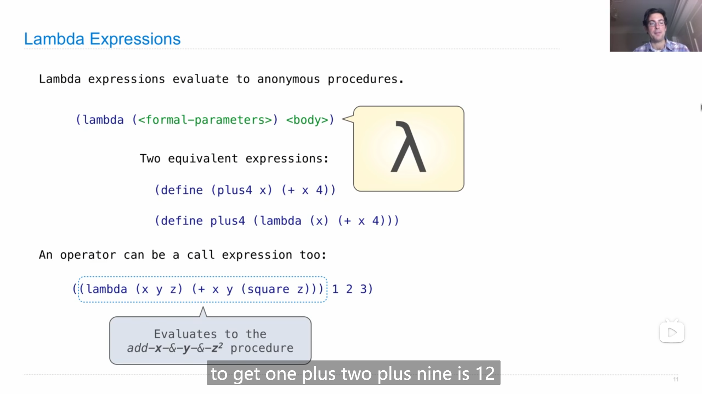{ loading=lazy }

scheme中的 lambda 匿名函数(类比 python 中的很好理解)

### 4

{ loading=lazy }

John 演示用 scheme 画 *谢尔宾斯基三角形 Sierpinski's Triangle* ，

用递归的方式画，每个大的三角形(的三条边)由(三个)小的三角形组成，因此

```scheme
(define (repeat k fn)
  (fn)
  (if (> k 1) (repeat (- k 1) fn)))
(define (tri fn)
  (repeat 3 (lambda () (fn) (lt 120))))
(define (sier d k)
  (tri (lambda () (if (= d 1) (fd k) (leg d k)))))
(define (leg d k)
  (sier (- d 1) (/ k 2))
  (penup) (fd k) (pendown))
```

代码大概是 `sier` 和 `leg` 相互调用的递归，

翻译成 python 大致是这样

```python
def repeat(k, fn):
    fn()
    if k > 1:
        repeat(k - 1, fn)

def tri(fn):
    repeat(3, lambda: fn() and turn_left(120))

def sier(d, k):
    tri(lambda: (move_forward(k) if d == 1 else leg(d, k)))

def leg(d, k):
    sier(d - 1, k // 2)
    pen_up()
    move_forward(k)
    pen_down()
```

>   其中 `turn_left` `move_forward` `pen_up` `pen_down` 
>
>   分别对应 scheme 中的内置函数 `lr` `fd` `penup` `pendown`

### 5

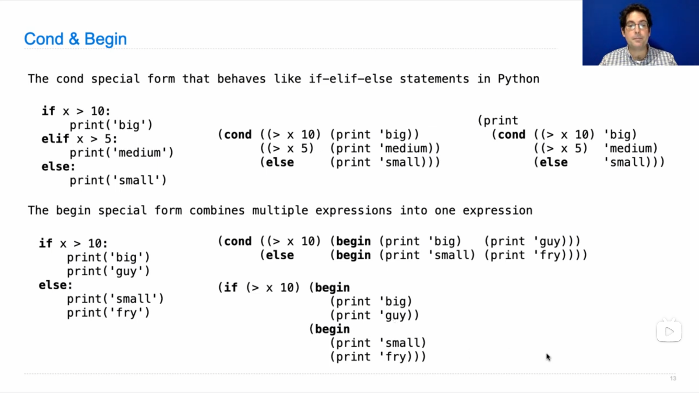{ loading=lazy }

`cond` 语句，可以类比 `if-elif-else` 语句，而且，可以理解为这个语句也可以返回值，所以可以像图中右上一样写

`begin` 语句，将多个语句合成一个( `begin` )语句

---

{ loading=lazy }

`let` 可以在其中定义临时的变量，格式是 `(let ((a 1) (b 2) ...) (...))` ，`let` 后第一个括号内是若干个定义临时变量的 *对 part* ，第二个括号是要执行的语句或者要返回的值

### 6

{ loading=lazy }

scheme 中 链表 list 相关内容

### 7

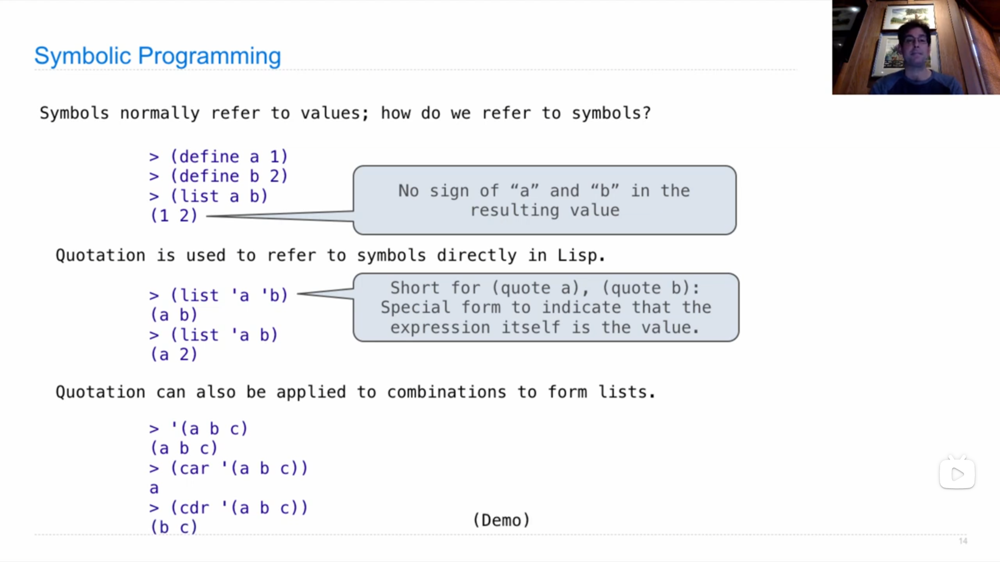{ loading=lazy }

***引用 quotation*** (感觉似乎理解了 c++ 中的引用)，可以将**符号本身**传入到表达式中

>   Special form to indicate that the expression itself is the value.
>
>   表示表达式本身就是值的特殊形式。

```scheme
scm> '(+ a b)
(+ a b)
scm> '(zero? a)
(zero? a)
```

也可以是在表达式前加 单引号 `'` ，那么表达式中的符号都会以*引用*的形式使用

---

John 的demo演示

```scheme
scm> '(1 2)
(1 2)
scm> '(1 a)
(1 a)
scm> (list 1 'a)
(1 a)
scm> (list 1 a)
Traceback (most recent call last):
  0     (list 1 a)
  1     a
Error: unknown identifier: a
```

!!! quote

    John:
    
    When quoting a list, you get a list, but all the expressions within it are quoted as well.
    
    ...I can't evaluate a until I've define it, but I can refer to a before I've defined it, because it's just a symbol. It could mean something in the future, it just hasn't been defined yet.
    
    ---
    
    John:
    
    引用列表时，你会得到一个列表，但其中的所有表达式也会被引用。
    
    ...在定义a之前，我无法评估它，但在定义之前，我可以参考a，因为它只是一个符号。它可能在未来有意义，只是还没有定义。

### 8

{ loading=lazy }

scheme 的内置函数 `eval` 可以计算引用形式的表达式(可见于上图) (感觉可以理解为 反向引用，或者说 解引用)

### 9

John 关于符号表达式的演示(看起来感觉很厉害😲)

{ loading=lazy }

>   ```scheme
>   (define (fact n)
>     (if (= n 1) 1 (* n (fact (- n 1)))))
>   
>   (define (fact-exp n)
>     (if (= n 1) 1 (list '* n (fact-exp (- n 1)))))
>   ```

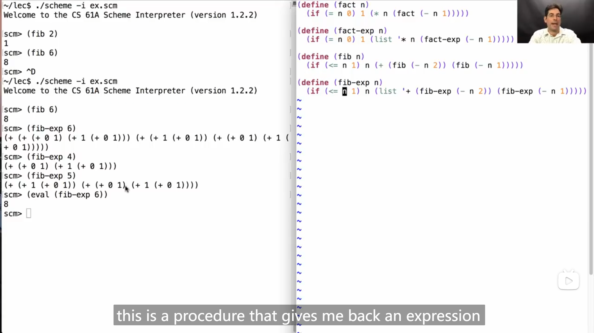{ loading=lazy }

>   ```scheme
>   (define (fib n)
>     (if (<= n 1) n (+ (fib (- n 2)) (fib (- n 1)))))
>   
>   (define (fib-exp n)
>     (if (<= n 1) n (list '+ (fib-exp (- n 2)) (fib-exp (- n 1)))))
>   ```

### 10

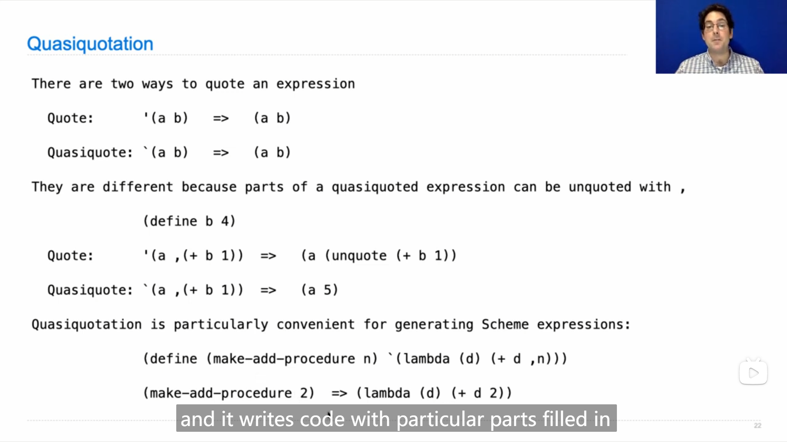{ loading=lazy }

*准引用 quasiquotation* ，可以被**中断**的引用

反引号 <code>\`</code> 的引用效果可以被 逗号 `,` 中断，即 `,` 后的括号以及更里面的括号取消引用效果，而其他地方还是有引用效果

```scheme
scm> `(a ,(+) b)
(a 0 b)
scm> `(a (+) b)
(a (+) b)
```

### 11

John 关于 *准引用 quasiquotation* 引用的演示，

用*准引用*构造了类似于 `while` 的(某种程度上)通用的循环结构(给我看傻了😲)

{ loading=lazy }

>   **分号 `;` 表示注释**

我的理解是，如果 `begin` 中的 `condition` `add-to-total` 等不加逗号 `,` 的话，返回的表达式中会直接就是 `condition` `add-to-total` 等**这些符号本身**，而加了逗号 `,` 之后，最后的表达式就会是 在使用 `sum-while` 时 具体传入的值，因此在使用 `sum-while` 时应该传入的是引用形式的表达式(即如 John 演示的一样，`(sum-while 1 '(< (* x x) 50) 'x '(+ x 1))` )

>   ```scheme
>   (define (sum-while initial-x condition       add-to-total update-x)
>     ;     (sum-while 1         '(< (* x x) 50) 'x           '(+ x 1))
>     `(begin
>        (define (f x total)
>          (if ,condition
>            (f ,update-x (+ total ,add-to-total))
>            total))
>        (f ,initial-x 0)))
>   ```

## Lecture 27  Q&A

### 1

{ loading=lazy }

有人向提问到 scheme 中的 `print` 的返回值是什么，于是 John 开始演示

```scheme
scm> (define s (print 1))
1
s
scm> s
scm> print(s)
undefined
```

John之后解释道，scheme 中的 `undefined` 和 python 中的 `None` 类似，但也有区别， `None` 还会用于一些比较，但 `undefined` 基本上不会被使用

!!! quote

    John:
    
    Well, we get this special value called "undefined." That's it. It's kind of close to Python's "None," except for here's the rule. This is more of a conventional rule than enforced by the language, but here's the rule: you're never supposed to do anything with the undefined value.
    
    Whereas in Python, people use "None" for all kinds of stuff. They compare whether something is "None," etc. That basically never shows up in Scheme code. So when you get this undefined value, which happens to exist, the idea is you should never do anything with it. You should never check to see if it's equal to another undefined. You should never check to see how many undefineds there are in a list or something like that. You should just stop.
    
    So basically, like this expression is legal, but it's a no-no. You should never take the value of "print" and do something else with it.
    
    ---
    
    John:
    
    嗯，我们有这个特殊的值叫做 "undefined"。就是这样，它有点类似于 Python 的 "None"，除了这里有一个规则。这更像是一种约定俗成的规则，而不是语言强制的，但这就是规则：你永远不应该对 "undefined" 值做任何事情。
    
    而在 Python 中，人们用 "None" 来处理各种事情。他们比较某个东西是否为 "None" 等等。这基本上在 Scheme 代码中几乎不会出现。所以当你得到这个存在的 "undefined" 值时，理念是你不应该对它做任何事情。你不应该检查它是否等于另一个 "undefined"，你不应该检查列表中有多少个 "undefined" 等等。你应该停止。
    
    所以基本上，像这个表达式是合法的，但是是不推荐的。你永远不应该获取 "print" 的值然后用它做其他事情。

### 2

{ loading=lazy }

有人问道 scheme 中有没有与 python 中 `non local` 类似的操作，

于是 John 演示了使用 `set!` 的一种方式

```scheme
(define (make-withdraw balance)
  (define (withdraw amount)
    (set! balance (- balance amount))
    balance)
  withdraw)
```

### 3

{ loading=lazy }

John 提到 scheme 中的 `=` 和 `equal?`

!!! quote

    John:
    
    So anyway, there's a bunch of different equals, and no, I don't think you need to know the difference between all of them. But if you want to know, like this ( `eq?` ), it is like `is` . This ( `=` ) is like nothing that exists in Python because it only works for numbers.
    
    This ( `equal?` ) is a lot like the equal sign. Yeah, in Python, I think that just like this will check, okay, so yeah, this ( `equal?` ) will check whether two things are generally equal, just like in Python, 2 equals 2 is true, and also a list containing 2 and a list containing 2 is true. So, um, yeah, this ( `equal?` ) is usually the one you want.
    
    But if you want to check for "is", it looks like that ( `eq?` ), and this ( `=` ) is some like weird thing that only works with numbers.
    
    ---
    
    John:
    
    总之，有很多不同的等号，我不认为你需要了解它们之间的区别。但是如果你想知道，比如这个( `eq?` )，就像 `is` 。这个( `=` )在Python中并不存在，因为它只适用于数字。
    
    这个( `equal?` )很像等号。是的，在Python中，我认为就像这个会检查，好的，所以是的，这个( `equal?` )将检查两个东西是否大致相等，就像在Python中，2等于2是真的，还有一个包含2的列表和一个包含2的列表也是真的。所以，嗯，这个( `equal?` )通常是你想要的。
    
    但是如果你想检查“is”，它看起来像这样( `eq?` )，而这个( `=` )是一些奇怪的东西，只对数字起作用。

## Lab 10

### 1

指导网页上有写如何使用提供的 scheme 解释器以及编辑器

!!! quote

    **Scheme**
    
    Scheme is a famous functional programming language from the 1970s. It is a dialect of Lisp (which stands for LISt Processing). The first observation most people make is the unique syntax, which uses a prefix notation and (often many) nested parentheses (see http://xkcd.com/297/). Scheme features first-class functions and optimized tail-recursion, which were relatively new features at the time.
    
    >   Our course uses a custom version of Scheme (which you will build for Project 4) included in the starter ZIP archive. To start the interpreter, type `python3 scheme`. To run a Scheme program interactively, type `python3 scheme -i <file.scm>`. To exit the Scheme interpreter, type `(exit)`.
    
    You may find it useful to try [code.cs61a.org/scheme](https://code.cs61a.org/scheme) when working through problems, as it can draw environment and box-and-pointer diagrams and it lets you walk your code step-by-step (similar to Python Tutor). Don't forget to submit your code through Ok though!
    
    **Scheme Editor**
    
    As you're writing your code, you can debug using the Scheme Editor. In your `scheme` folder you will find a new editor. To run this editor, run `python3 editor`. This should pop up a window in your browser; if it does not, please navigate to [localhost:31415](localhost:31415) and you should see it.
    
    Make sure to run `python3 ok` in a separate tab or window so that the editor keeps running.
    
    If you find that your code works in the online editor but not in your own interpreter, it's possible you have a bug in code from an earlier part that you'll have to track down. Every once in a while there's a bug that our tests don't catch, and if you find one you should let us know!

运行

```bash
python ./scheme [-i <file.scm>]
```

打开 scheme 解释器，以及加载文件并打开。

运行

```bash
python editor
```

打开 scheme 编辑器，在线编辑和测试(网址在 [http://127.0.0.1:31415](http://127.0.0.1:31415))

{ loading=lazy }

### 2

Q5中，需要将 `'YOUR-CODE-HERE` 这一行注释掉或者删去，否则会有如下报错

```scheme
Traceback (most recent call last):
  0     (define lst (quote your-code-here) 1)
Error: too many operands in form
```

### 3

Q6 中，本来以为很简单，一开始递归的 base case 是用 `(= lst nil)` 来判断，但是报错了

```bash
Error: operand 0 (()) is not a number
```

大概应该指的是， `lst` 和 `nil` 不是数，所以不能用 `=` 比较。

最后在在线终端解释器中，摸索了好一会，发现了一个函数 `length` ，能返回*链表*的长度，于是将判断条件改成

```scheme
(zero? (length lst))
```

最终解决

??? note "code"

    ```scheme
    (define (remove item lst)
      'YOUR-CODE-HERE
      (if (zero? (length lst))
          nil
          (if (= item (car lst))
              (remove item (cdr lst))
              (cons (car lst) (remove item (cdr lst)))))
    )
    ```

---

之后发现其实还可以用 `equal?` (或 `eq?` )函数，

```scheme
scm> (equal? () nil)
#t
scm> (equal? '() nil)
#t
```

---

写到 hw07 时发现，其实这题提示中说的 `filter-lst` 函数其实想说的是 `filter` ，之前输入 `filter-lst` 显示没有这个函数，

用上 `filter` 函数答案就会变得非常简单

```scheme
(define (remove item lst)
  'YOUR-CODE-HERE
  (filter (lambda (x) (not (= x item))) lst)
)
```

## HW 06

### 1

Q3中，在处理奇数情况时，一开始我写的是

```scheme
(* x (square (pow x (/ y 2))))
```

但是在跑第一个测试用例时，

```scheme
(pow 2 5)
```

显示递归溢出了

```bash
# Error: expected
#     32
# but got
#     Traceback (most recent call last):
#       ...
#     RecursionError: maximum recursion depth exceeded in __instancecheck__
```

猜测是因为除法的问题，于是去测试了一下，发现 `/` 不是整除

```scheme
scm> (/ 5 2)
2.5
scm> (/ 4 2)
2
```

于是将基数情况的代码修改成了

```scheme
(* x (square (pow x (/ (- y 1) 2))))
```

??? note "code"

    ```scheme
    (define (pow x y)
      'YOUR-CODE-HERE
      (if (= y 1)
          x
          (if (even? y)
              (square (pow x (/ y 2)))
              (* x (square (pow x (/ (- y 1) 2))))))
    )
    ```

## Lecture 28 Exception

### 1

{ loading=lazy }

在运行 `py` 文件时，可以使用 `-O` 选项来忽略 `assert` 语句来提高程序执行效率

```bash
python -O
```

---

{ loading=lazy }

`__debug__` 可以查看 `assert` 语句是否会被执行

```bash
C:\Users\Ronald>python
Python 3.10.9 (tags/v3.10.9:1dd9be6, Dec  6 2022, 19:43:38) [MSC v.1934 32 bit (Intel)] on win32
Type "help", "copyright", "credits" or "license" for more information.
>>> __debug__
True
>>> ^Z


C:\Users\Ronald>python -O
Python 3.10.9 (tags/v3.10.9:1dd9be6, Dec  6 2022, 19:43:38) [MSC v.1934 32 bit (Intel)] on win32
Type "help", "copyright", "credits" or "license" for more information.
>>> __debug__
False
>>>
```

### 2

{ loading=lazy }

*引发错误 raise error*

`raise` 后的表达式必须是 `BaseException` 的实例或者它的子类，

如上图，John 还介绍了中*错误*类型

---

John 的 demo 演示

{ loading=lazy }

### 3

{ loading=lazy }

`try` 语句的用法，如果在执行 `try` 之后的代码中引起了错误，并且错误是 `except` 后 `<exception class>` 的子类时，就会执行 `except` 中的语句(如果没有引起错误就不会执行)

John的demo演示

{ loading=lazy }

### 4

{ loading=lazy }

John提到了一个 `reduce` 函数(python没内置，scheme内置了)，在之后的demo演示中，分别用迭代和递归实现了 `reduce`

-   迭代
    
    ```python
    def reduce(f, s, initial):
        """Combine elements of s using f starting with initial.
        
        >>> reduce(mul, [2, 4, 8], 1)
        64
        >>> reduce(add, [1, 2, 3, 4], 0)
        10
        """
        for x in s:
            initial = f(initial, x)
        return initial
    ```

-   递归
    
    ```python
    def reduce(f, s, initial):
        """Combine elements of s using f starting with initial.
        
        >>> reduce(mul, [2, 4, 8], 1)
        64
        >>> reduce(add, [1, 2, 3, 4], 0)
        10
        """
        if not s:
            return initial
        else:
            first, rest = s[0], s[1:]
            return reduce(f, rest, f(initial, first))
    ```

## Lecture 28 Q&A

### 1

{ loading=lazy }

`try` 语句结构中的 `finally` 语句，

`finally` 中的代码无论 `try` 中是否引发错误最终都会被执行(从图上 John 的演示中可以看到)，所以 `finally` 中一般用来释放资源释放内存(如关闭在 `try` 中加载的文件，或者断开网络连接)

### 2

有人提问 `try` 中引发的错误是否存在于 `global` 框架中，John 进行演示

```python
>>> try:
...     1/0
... except ZeroDivisionError as n:
...     print("n is", n)
...
n is division by zero
>>> n
Traceback (most recent call last):
  File "<stdin>", line 1, in <module>
Nameerror: name 'n' is not defined
```

随后 John 又展示了一下错误实例

```python
def return_an_error():
    try:
        1/0
    except ZeroDivisionError as n:
        print("n is", n)
        return n
```

```python
>>> e = return_an_error()
n is division by zero
>>> e
ZeroDivisionError('division by zero')
>>> str(e)
'division by zero'
>>> repr(e)
"ZeroDivisionError('division by zero')"
>>> isinstance(e, Exception)
True
>>> isinstance(e, ZeroDivisionError)
True
```

### 3

有人提问19年秋季期末考试的这一题

!!! quote

    **Mull It Over**
    
    *Uh oh!* Someone evaluated `(define * +)` . Now `(* 3 2)` evaluates to 5 instead of 6! Let's fix it.
    
    **Important**: Answer all questions on this page without calling the built-in multiplication procedure.
    
    **(a)** Implement `mulxy` , which multiplies integers `x` and `y` . **Hint**: `(- 2)` evaluates to -2.
    
    ```scheme
    ;; multiply x by y (without using the * operator).
    ;; (mulxy 3 4) -> 12           ; 12 = 3 + 3 + 3 + 3
    ;; (mulxy (- 3) (- 4)) -> 12   ; 12 = - ( -3 + -3 + -3 + -3 )
    (define (mulxy x y)
      (cond ((< y 0) (- ______ ))
            ((= y 0) 0)
            (else ( ______ x (mulxy x ______)))))
    ```
    
    **(b)** Implement `mul-expr` , which takes an expression `e` that contains only calls to `*` and numbers. It returns the normal value of `e` under a Scheme interpreter with an unmodified `*` operator that multiplies.
    
    You may call the `mul` procedure defined below.
    
    **Important**: Fill each blank with only a single symbol.
    
    ```scheme
    ;; Multiply together a list of numbers.
    ;; (mul '(2 3 4 2)) -> 48
    (define (mul s) (reduce mulxy s))
    
    ;; Evaluate an expression with only calls to * and numbers.
    ;; (mul-expr '(* (* 1 2) (* 3 (* 4 1 1) 2))) -> 48
    (define (mul-expr e)
      (if (number? e) e
          (______ (______ ______ (______ e)))))
    ```
    
    **(c)** Implement `*-to-mul` , which takes any expression `e` . It returns an expression like `e` , but with all calls to `*` replaced with calls to `mul` . Note that `*` takes an arbitrary number of arguments, while `mul` always takes exactly one argument: a list of numbers. You should account for this difference.
    
    ```scheme
    ;; Convert all calls to * to calls to mul in expression e.
    ;; (eval (*-to-mul '(* 1 (+ 2 3) (+ 4 5 (* 6 1))))) -> 75
    (define (*-to-mul e)
      (if (not (list? e)) e
          (let ((op ______ ) (rest ______))
            (if (equal? op '*)
                (list ______)
                (cons op rest)))))
    ```

我先尝试自己做了一下，

第一题很简单

```scheme
(define (mulxy x y)
  (cond ((< y 0) (- (mulxy x (- y))))
        ((= y 0) 0)
        (else (+ x (mulxy x (- y 1))))))
```

第二题由于每一个空只能填一个 symbol，想了很久没想到可行的填法，感觉应该是需要使用一些特殊的函数。

John 使用了scheme内置的 `map` 函数

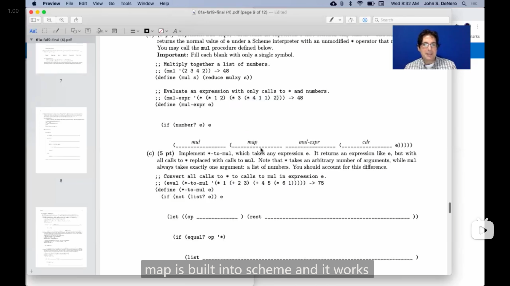{ loading=lazy }

scheme 中的 `map` 和 python 中的 `map` 效果差不多，都是传入一个函数和一个链表/序列，然后将函数应用到每一个元素上，

因此

```scheme
(define (mul-expr e)
  (if (number? e) e
      (mul (map mul-expr (cdr e)))))
```

第三题也比较难，先是根据我的理解写出了

```scheme
(define (*-to-mul e)
  (if (not (list? e)) e
      (let ((op (car e)) (rest (map *-to-mul (cdr e))))
        (if (equal? op '*)
            (list ______)
            (cons op rest)))))
```

`(list ______)` 这一行，一开始尝试 `(list mul rest)` ，但是测试时显示

```scheme
scm> (eval (*-to-mul '(* 1 (+ 2 3) (+ 4 5 (* 6 1)))))
Traceback (most recent call last):
  0     (eval (*-to-mul (quote (* 1 (+ 2 3) (+ 4 5 (* 6 1))))))
  1     ((lambda (s) (reduce mulxy s)) (1 (+ 2 3) (+ 4 5 ((lambda (s) (reduce mulxy s)) (6 1)))))
  2     (lambda (s) (reduce mulxy s))
Error: malformed list: (lambda (s) (reduce mulxy s))
scm> (*-to-mul '(* 1 (+ 2 3) (+ 4 5 (* 6 1))))
((lambda (s) (reduce mulxy s)) (1 (+ 2 3) (+ 4 5 ((lambda (s) (reduce mulxy s)) (6 1)))))
```

然后我意识到，应该把 `mul` 改成 `'mul` ，因为**需要返回的是一个表达式，表达式中的符号和函数应该是引用的形式**，

修改成 `(list 'mul rest)` 之后，测试显示

```scheme
scm> (eval (*-to-mul '(* 1 (+ 2 3) (+ 4 5 (* 6 1)))))
Traceback (most recent call last):
  0     (eval (*-to-mul (quote (* 1 (+ 2 3) (+ 4 5 (* 6 1))))))
  1     (mul (1 (+ 2 3) (+ 4 5 (mul (6 1)))))
  2     (1 (+ 2 3) (+ 4 5 (mul (6 1))))
Error: int is not callable: 1
```

>   本来看到上面的
>
>   ```scheme
>   ;; (mul '(2 3 4 2)) -> 48
>   ```
>
>   将代码尝试改成了
>
>   ```scheme
>   (list 'mul ('quote rest))
>   ```
>
>   但是测试时显示
>
>   ```scheme
>   Traceback (most recent call last):
>     ...   ...
>     4     (list (quote mul) ((quote quote) rest))
>     5     ((quote quote) rest)
>   Error: str is not callable: quote
>   ```

最后想不出答案。

{ loading=lazy }

John 利用一个例子来进行讲解，

```scheme
(*-to-mul '(* 1 2 (* 3 4)))
```

**应该得到的是**(感觉我之前做的时候是没想到这个关键的地方)

```scheme
(mul (list 1 2 (mul (list 3 4))))
```

>   Hany 期间问道为什么不是 `(mul (1 2 (mul (3 4))))`
>
>   John 说 因为 `1` 不是可调用的，如果这样写**就会调用 `1`**

所以最后正确的答案是(John 的代码有一些问题，递归应该发生在定义 `rest` 的时候(否则如果第一个是 `+` 就会不发生替换))

```scheme
(define (*-to-mul e)
  (if (not (list? e)) e
      (let ((op (car e)) (rest (map *-to-mul (cdr e))))
        (if (equal? op '*)
            (list 'mul (cons 'list rest))
            (cons op rest)))))
```

(这题是真的难想😱)

### 4

!!! quote

    John:
    
    You can think of a list as built from a bunch of `cons` . `cons` is like the most fundamental operation, and what it does is it just adds one element to the beginning of an existing list.
    
    ---
    
    John:
    
    你可以将列表看作是由一堆 `cons` 构建而成的。 `cons` 就像是最基本的操作，它的作用是在现有列表的开头添加一个元素。

我觉得 John 这个对 `cons` 函数的解释很好，把 `cons` 理解成 **一个在现有列表开头插入新元素的函数** 就更方便

### 5

{ loading=lazy }

John 又提到了scheme中的 `append` 函数，能将两个链表合并到一起

## Lecture 29 Calculater

### 1

John 讲解 *解析 parse* 一个语言的语句的过程

{ loading=lazy }

### 2

{ loading=lazy }

scheme 中的减法和除法稍微特殊一些，如果只有一个参数，就直接取相反数或者倒数，如果有多个参数，就是拿第一个去减或除之后剩余的数

### 3

用 python 实现 scheme 中(适用于数学运算表达式的) `eval` 函数

{ loading=lazy }

### 4

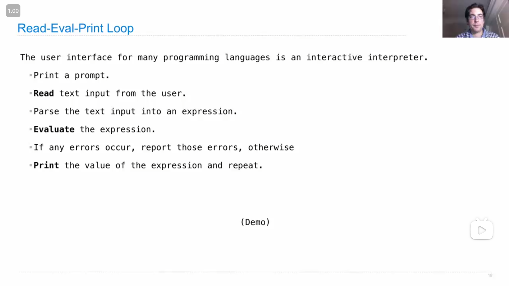{ loading=lazy }

***交互式解释器 interactive interpreter* 的工作流程 *读取-求值-输出循环 Read-Eval-Print Loop (REPL)*** 

- 从用户的文本输入中读取
- 将文本 *解析 parse* 为表达式
- 计算表达式
- 如果发生错误，报告错误
- 输出表达式计算结果的值，并重复上述过程

### 5

John 说到 *交互式解释器 interactive interpreter* 不能因为程序的错误就中断整个程序，所以需要进行 exception 的处理

!!! quote

    John:
    
    ...So, an interactive interpreter should print information about each error. So that when those errors occur, the programmer who generated them can figure out what to change in order to get rid of the error. And a well-designed interactive interpreter should never really halt; it should stop evaluating the current expression and print out the arrow, but then give the programmer a chance to revise what they've done. So, the user should have the opportunity to try again in the current environment, instead of having the whole program crash. And that's exactly what happens here.
    
    So, as you can see, I'm able to continue entering expressions. The only way I can quit out of this game calculator is by pressing in my system control "d," which says this is the end of the file. Then it will say, "Calculation is complete," and finally, the program will end.
    
    Now, how do we control for all this? Well, we put both the parsing and evaluation within a `try` statement,
    
    ```python
    @main
    def read_eval_print_loop():
        """Run a read-eval-print loop for Calculator."""
        while True:
            try:
                src = buffer_input()
                while src.more_on_line:
                    expression = scheme_read(src)
                    print(calc_eval(expression))
            except (SyntaxError, TypeError, ValueError, ZeroDivisionError) as err:
                print(type(err).__name__ + ':', err)
            except (KeyboardInterrupt, EOFError):  # <Control>-D, etc.
                print('Calculation completed.')
                return
    ```
    
    that knows to look for syntax, type, value, and zero division errors – all the things that can occur, and just prints those errors out. And then, since this is all embedded within the suite of a `while` statement, we'll go back and try again. So, the only way to stop is to reach the end of a file or a keyboard interrupt, at which point it will print "Calculation is complete."
    
    ---
    
    John:
    
    因此，交互式解释器应该打印有关每个错误的信息，以便当这些错误发生时，生成它们的程序员能够弄清楚要更改什么以消除错误。一个设计良好的交互式解释器实际上不应该停止；它应该停止评估当前表达式并打印出箭头，然后给程序员一个机会来修改他们所做的事情。因此，用户应该有机会在当前环境中再次尝试，而不是使整个程序崩溃。这正是这里发生的情况。
    
    所以，正如你所见，我能够继续输入表达式。退出这个游戏计算器的唯一方法是按下我的系统控制 “d”，这表示这是文件的结尾。然后它将显示 “Calculation is complete”，最后程序将结束。
    
    现在，我们如何控制所有这些呢？嗯，我们将解析和评估都放在一个 `try` 语句中， 
    
    ```python
    @main
    def read_eval_print_loop():
        """Run a read-eval-print loop for Calculator."""
        while True:
            try:
                src = buffer_input()
                while src.more_on_line:
                    expression = scheme_read(src)
                    print(calc_eval(expression))
            except (SyntaxError, TypeError, ValueError, ZeroDivisionError) as err:
                print(type(err).__name__ + ':', err)
            except (KeyboardInterrupt, EOFError):  # <Control>-D, etc.
                print('Calculation completed.')
                return
    ```
    
    该语句知道如何查找语法、类型、值和零除错误，即所有可能发生的事情，并只是打印出这些错误。然后，由于所有这些都嵌套在一个 `while` 语句的套件中，我们将回到并尝试再次执行。因此，唯一停止的方式是到达文件的末尾或键盘中断，此时它将打印 “Calculation is complete”。

## Lecture 29 Q&A

### 1

{ loading=lazy }

有人提问道(python)代码中的 `@main` 有什么作用，

!!! quote

    John:
    
    ...Yeah, so this main decorator is something that's specific to 61a. It just says if you run the file, this is the function that should be called. So if I run the whole `scalc.py` file, it's not going to call as scheme list instead, it's going to call `read_eval_print_loop` .
    
    ---
    
    John:
    
    ...是的，所以这个主装饰器是61a特有的东西。它只是说，如果你运行文件，这就是应该调用的函数。因此，如果我运行整个 `scalc.py` 文件，它不会调用scheme-list，而是调用 `read_eval_print_loop` 。

这个和

```python 
if __name__ = '__main__':
    ...
```

有点像，不过封装成函数再加上 `@main` 还有一点好处就是还可以再次进行调用

## HW 07

### 1

在 Q1 的题目说明中提到了 `filter` 函数，跟这题要实现的 `filter-lst` 用法一样(用于链表上)，也是需要一个 *谓词 predicate* (传入一个参数然后返回真假的函数) 和一个链表，然后就会筛选出为真的元素

```scheme
scm> (define (x y) (> y 1))
x
scm> (filter x '(1 2 3 4 5))
(2 3 4 5)
```

>   这题要求实现的函数叫做 `filter-lst` ，所以有可能 `filter` 函数还可以作用于其他的数据类型

---

??? note "code"

    ```scheme
    (define (filter-lst fn lst)
      'YOUR-CODE-HERE
      (if (eq? lst nil)
          nil
          (if (fn (car lst))
              (cons (car lst) (filter-lst fn (cdr lst)))
              (filter-lst fn (cdr lst))))
    )
    ```

### 2

Q4 这题有点难(主要是一直想用python中的 `in` 而scheme中用不了😅)，

最后写出来主要是题目中提示可以使用第一题中实现的 `filter-lst` 函数，然后我又猜测还是需要使用递归来实现，那么**传入 `filter-lst` 函数的链表应该就是 `(cdr lst)`** ，

进而， `filter-lst` 筛出来的链表应该还要递归地放入 `no-repeats` 中，最后再加上 base case 就成功实现了

??? note "code"

    ```scheme
    (define (no-repeats lst)
      'YOUR-CODE-HERE
      (if (equal? lst nil)
          nil
          (cons (car lst)
                (no-repeats (filter-lst (lambda (x) (not (= x (car lst))))
                                        (cdr lst)))))
    )
    ```

## Lab 11

### 1

Q3这题需要把题目意思理解清楚， `CallExpr` 实例中的 `operator` 和 `operands` 相当于变量名，需要调用它们的 `eval` 方法并传入环境来获取对应的值或者实例，

最后，操作符 `operator` 需要调用 `apply` 方法来进行使用

>   **Hint:** Since the operator and operands are all instances of `Expr`, you can evaluate them by calling their `eval` methods. Also, you can apply a function (an instance of `PrimitiveFunction` or `LambdaFunction`) by calling its `apply` method, which takes in a list of arguments (`Value` instances).

??? note "code"

    ```python
    class CallExpr(Expr):
        def eval(self, env):
            return self.operator.eval(env).apply([operand.eval(env) for operand in self.operands])
    ```

### 2

Q4中，需要更新以字典形式存储的环境，结合Q3的函数说明，可以知道可以使用字典的 `update` 方法，

> 在终端中试了一下
>
> ```python
> >>> dict
> <class 'dict'>
> >>> dict.update
> <method 'update' of 'dict' objects>
> >>> dict.extend
> Traceback (most recent call last):
> File "<stdin>", line 1, in <module>
> AttributeError: type object 'dict' has no attribute 'extend'
> >>> dict.append
> Traceback (most recent call last):
> File "<stdin>", line 1, in <module>
> AttributeError: type object 'dict' has no attribute 'append'
> ```

---

`dict.update()` 没有返回值(和列表的 `append` 和 `extend` 一样)，所以一开始我用

```python
new_env = self.parent.copy().update(dict(zip(self.parameters, arguments)))
```

然后报了 `NoneType` 的错误。

??? note "code"

    ```python
    class LambdaFunction(Value):
        def apply(self, arguments):
            if len(self.parameters) != len(arguments):
                raise TypeError("Oof! Cannot apply number {} to arguments {}".format(
                    comma_separated(self.parameters), comma_separated(arguments)))
            "*** YOUR CODE HERE ***"
            new_env = self.parent.copy()
            new_env.update(dict(zip(self.parameters, arguments)))
            return self.body.eval(new_env)
    ```

### 3

Q5没什么明确的要求，我直接在

```python
except (SyntaxError, NameError, TypeError, OverflowError, ZeroDivisionError) as err:
```

这一行添加了 `OverflowError` 和 `ZeroDivisionError`

## Project Scheme

### 1

Problem 1的前面某题我卡了一小会😅

```python
>>> from scheme_reader import *
>>> tokens = tokenize_lines(["(+ 1 ", "(23 4)) ("])
>>> src = Buffer(tokens)
>>> src.current()
? ...
-- OK! --

>>> src.pop_first()
? ...
-- OK! --

>>> src.current()
? ...
-- OK! --

>>> src.pop_first()
? ...
-- OK! --

>>> src.pop_first()
? ...
-- OK! --

>>> scheme_read(src)  # Removes the next complete expression in src and returns it as a Pair
? 
```

最后是看了 `scheme_reader.py` 中 `scheme_read` 的函数说明中

```python
def scheme_read(src):
    """Read the next expression from SRC, a Buffer of tokens.

    ...
    >>> scheme_read(Buffer(tokenize_lines(['(+ 1 2)'])))
    Pair('+', Pair(1, Pair(2, nil)))
    """
```

才明白 `returns it as a Pair` 具体返回是什么样子。

然后看到了题目说明中的

>   `scheme_read`:
>
>   -   If the current token is `(`, the expression is a pair or list. Call `read_tail` on the rest of `src` and return its result.
>
>   `read_tail`:
>
>   -   If the token is `)`, then we've reached the end of the list or pair. **Remove this token from the buffer** and return the `nil` object.

所以明白只会读取到第一个右括号 `)` ，因此最后正确答案是

```python
Pair(23, Pair(4, nil))
```

>   但是有个地方感觉有点小离谱😅，少了个空格居然显示错误
>
>   ```python
>   ? Pair(23, Pair(4,nil))
>   -- Not quite. Try again! --
>   
>   ? Pair(23, Pair(4, nil))
>   -- OK! --
>   ```

---

在实现 `read_tail` 时，意识到题目说明中的这句话

>   Both functions mutate the buffer, removing the tokens that have already been processed.

就是说，(比如被 `scheme_read` 调用的) `read_tail` 中需要*突变* `src` (移除已经使用过的*令牌*)，这样在 `read_tail` 中使用过的 *令牌 tokens* ，就不会被 `scheme_read` 或者上一层 `read_tail` 再次使用

---

没想到Problem 1就写了半小时(算上解锁花了一小时😇)。

这题主要是需要完全理解题目的意思，如果有bug就回去**重新理解题目(仔细阅读题目的说明)**就好了。

一开始我写的是

```python
def scheme_read(src):
    if src.current() is None:
        raise EOFError
    val = src.pop_first() # Get and remove the first token
    if val == 'nil':
        "*** YOUR CODE HERE ***"
        return nil
    elif val == '(':
        "*** YOUR CODE HERE ***"
        return read_tail(src)
    ...
def read_tail(src):
    try:
        if src.current() is None:
            raise SyntaxError('unexpected end of file')
        elif src.current() == ')':
            "*** YOUR CODE HERE ***"
            src.pop_first()
            return nil
        else:
            "*** YOUR CODE HERE ***"
            return Pair(src.pop_first(), read_tail(src))
    except EOFError:
        raise SyntaxError('unexpected end of file')
```

然后报了这样的错误

```python
>>> read_tail(Buffer(tokenize_lines(['(2)'])))
Pair('(', Pair(2, nil))

# Error: expected
#     SyntaxError
# but got
#     Pair('(', Pair(2, nil))
```

然后看到了题目中的

>   `read_tail`:
>
>   -   If none of the above cases apply, the next token is the operator in a combination, e.g. src contains `+ 2 3)`. To parse this:
>
>       1.  `scheme_read` the next complete expression in the buffer.
>
>           ...

于是明白如果在 `read_tail` 中读到左括号 `(` ，就意味着读到了嵌套的表达式，需要调用 `scheme_read` 来处理这个内层的表达式，因此改成了

```python
if src.current() == '(':
    return Pair(scheme_read(src), read_tail(src))
return Pair(src.pop_first(), read_tail(src))
```

再次测试，原来错误的地方通过了，但是出现了新的报错

```python
>>> read_line('(a)')
nil

# Error: expected
#     Pair('a', nil)
# but got
#     nil
```

进行分析，感觉上一个错误也和这个差不多，但是已经被解决，说明问题不在 `read_tail` 中，所以应该在 `scheme_read` 中，于是进行查看，发现这里已经弹出过*令牌*了

```python
val = src.pop_first() # Get and remove the first token
```

所以将之前的代码修改后，最后终于通过😭

??? note "code"

    ```python
    def scheme_read(src):
        if src.current() is None:
            raise EOFError
        val = src.pop_first() # Get and remove the first token
        if val == 'nil':
            # BEGIN PROBLEM 1
            "*** YOUR CODE HERE ***"
            return nil
            # END PROBLEM 1
        elif val == '(':
            # BEGIN PROBLEM 1
            "*** YOUR CODE HERE ***"
            return read_tail(src)
            # END PROBLEM 1
        elif val == "'":
            # BEGIN PROBLEM 6
            "*** YOUR CODE HERE ***"
            # END PROBLEM 6
        elif val not in DELIMITERS:
            return val
        else:
            raise SyntaxError('unexpected token: {0}'.format(val))
    def read_tail(src):
        try:
            if src.current() is None:
                raise SyntaxError('unexpected end of file')
            elif src.current() == ')':
                # BEGIN PROBLEM 1
                "*** YOUR CODE HERE ***"
                src.pop_first()
                return nil
                # END PROBLEM 1
            else:
                # BEGIN PROBLEM 1
                "*** YOUR CODE HERE ***"
                if src.current() == '(':
                    return Pair(scheme_read(src), read_tail(src))
                return Pair(src.pop_first(), read_tail(src))
                # END PROBLEM 1
        except EOFError:
            raise SyntaxError('unexpected end of file')
    ```

---

Problem 13中发现了 由于Problem 1中代码存在漏洞 而导致的错误，重新阅读题目后，将代码修改正确(具体可见于第7条Problem 13)

??? note "code"

    ```python
    def scheme_read(src):
        if src.current() is None:
            raise EOFError
        val = src.pop_first() # Get and remove the first token
        if val == 'nil':
            # BEGIN PROBLEM 1
            "*** YOUR CODE HERE ***"
            return nil
            # END PROBLEM 1
        elif val == '(':
            # BEGIN PROBLEM 1
            "*** YOUR CODE HERE ***"
            return read_tail(src)
            # END PROBLEM 1
        elif val == "'":
            # BEGIN PROBLEM 6
            "*** YOUR CODE HERE ***"
            # END PROBLEM 6
        elif val not in DELIMITERS:
            return val
        else:
            raise SyntaxError('unexpected token: {0}'.format(val))
    def read_tail(src):
        try:
            if src.current() is None:
                raise SyntaxError('unexpected end of file')
            elif src.current() == ')':
                # BEGIN PROBLEM 1
                "*** YOUR CODE HERE ***"
                src.pop_first()
                return nil
                # END PROBLEM 1
            else:
                # BEGIN PROBLEM 1
                "*** YOUR CODE HERE ***"
                return Pair(scheme_read(src), read_tail(src))
                # END PROBLEM 1
        except EOFError:
            raise SyntaxError('unexpected end of file')
    ```

### 2

Problem 4，一开始我写的是

```python
operator = env.lookup(first)
validate_procedure(operator)
operands = rest.map(lambda x: env.lookup(x))
return scheme_apply(operator, operands, env)
```

但是报了这样的错误

```python
>>> from scheme_reader import *
>>> from scheme import *
>>> expr = read_line('(+ 2 2)')
>>> scheme_eval(expr, create_global_frame()) # Type SchemeError if you think this errors
Traceback (most recent call last):
  ...
scheme_builtins.SchemeError: unknown identifier: 2

# Error: expected
#     4
# but got
#     Traceback (most recent call last):
#       ...
#     SchemeError: unknown identifier: 2
```

然后突然想到 `2` 并不是一个 *符号 symbol* ，所以 `env.lookup(2)` 应该是会报错，然后又会想起题目中的

>   You'll have to recursively call `scheme_eval` in the first two steps.

所以就知道需要如何修改了，最后修改后通过了测试

??? note "code"

    ```python
    def scheme_eval(expr, env, _=None): # Optional third argument is ignored
        # Evaluate atoms
        if scheme_symbolp(expr):
            return env.lookup(expr)
        elif self_evaluating(expr):
            return expr
    
        # All non-atomic expressions are lists (combinations)
        if not scheme_listp(expr):
            raise SchemeError('malformed list: {0}'.format(repl_str(expr)))
        first, rest = expr.first, expr.rest
        if scheme_symbolp(first) and first in SPECIAL_FORMS:
            return SPECIAL_FORMS[first](rest, env)
        else:
            # BEGIN PROBLEM 4
            "*** YOUR CODE HERE ***"
            operator = scheme_eval(first, env)
            validate_procedure(operator)
            operands = rest.map(lambda x: scheme_eval(x, env))
            return scheme_apply(operator, operands, env)
            # END PROBLEM 4
    ```

### 3

Problem 5，注意需要区分第二个操作数需要通过*求值*将符号或表达式变成对应值

??? note "code"

    ```python
    def do_define_form(expressions, env):
        validate_form(expressions, 2) # Checks that expressions is a list of length at least 2
        target = expressions.first
        if scheme_symbolp(target):
            validate_form(expressions, 2, 2) # Checks that expressions is a list of length exactly 2
            # BEGIN PROBLEM 5
            "*** YOUR CODE HERE ***"
            env.define(target, scheme_eval(expressions.rest.first, env))
            return target
            # END PROBLEM 5
        ...
    ```

### 4

Problem 6中，一开始在 `scheme_read` 中写的是

```python
return Pair("quote", scheme_read(src))
```

但是报错了

```python
scm> ''hello
hello str
# Error: cdr can only be a pair, nil, or a promise but was hello

# Error: expected
#     (quote hello)
# but got
#     Traceback (most recent call last):
#       ...
#     SchemeError: cdr can only be a pair, nil, or a promise but was hello
```

经过思考，大概理解了，我感觉 `'` 可以理解为**只会有一个参数/操作数的函数**(因为引号后只会有一个最外层的括号)，因此返回的结构就会是

```python
Pair("quote", Pair(..., nil))
```

`...` 就是被引用的部分，也就是那**唯一的参数**。

??? note "code"

    ```python title="scheme.py"
    def do_quote_form(expressions, env):
        validate_form(expressions, 1, 1)
        # BEGIN PROBLEM 6
        "*** YOUR CODE HERE ***"
        return expressions.first
        # END PROBLEM 6
    ```
    
    ```python title="scheme_reader.py"
    def scheme_read(src):
        ...
        elif val == "'":
            # BEGIN PROBLEM 6
            "*** YOUR CODE HERE ***"
            return Pair("quote", Pair(scheme_read(src), nil))
            # END PROBLEM 6
        ...
    def read_tail(src):
        try:
            ...
            else:
                # BEGIN PROBLEM 1
                "*** YOUR CODE HERE ***"
                # if src.current() == '(':
                if src.current() in ('(', "'"):
                    ...
                ...
                # END PROBLEM 1
        ...
    ```

### 5

解锁Problem 8的这题答案(参考 `do_lambda_form` 函数说明可以得知是 `Pair(...)` 的形式)有些难敲(主要是因为太长了😅)

```python
>>> from scheme_reader import *
>>> from scheme import *
>>> env = create_global_frame()
>>> lambda_line = read_line("(lambda (a b c) (+ a (* b c)))")
>>> lambda_proc = do_lambda_form(lambda_line.rest, env)
>>> lambda_proc.formals
? Pair('a', Pair('b', Pair('c', nil)))
-- OK! --

>>> lambda_proc.body # Remember that the body is a *list* of expressions!
? Pair(Pair('+', Pair('a', Pair(Pair('*', Pair('b', Pair('c', nil))), nil))), nil)
-- OK! --
```

### 6

Problem 10，这题不难，但我用循环迭代实现了之后，突然想到 `Pair` 有 `map` 方法，所以突发奇想想用 `map` 来实现(利用 `map` 来获取 `Pair` 中所有的元素)

??? note "code"

    === "实现一"
    
        ```python
        class Frame(object):
            ...
            def make_child_frame(self, formals, vals):
                if len(formals) != len(vals):
                    raise SchemeError('Incorrect number of arguments to function call')
                # BEGIN PROBLEM 10
                "*** YOUR CODE HERE ***"
                child = Frame(self)
                while formals is not nil:
                    child.define(formals.first, vals.first)
                    formals, vals = formals.rest, vals.rest
                return child
                # END PROBLEM 10
        ```
    
    === "实现二"
    
        ```python
        class Frame(object):
            ...
            def make_child_frame(self, formals, vals):
                if len(formals) != len(vals):
                    raise SchemeError('Incorrect number of arguments to function call')
                # BEGIN PROBLEM 10
                "*** YOUR CODE HERE ***"
                child = Frame(self)
                formals_list, vals_list = [], []
                formals.map(lambda x: formals_list.append(x))
                vals.map(lambda x: vals_list.append(x))
                for formal, val in zip(formals_list, vals_list):
                    child.define(formal, val)
                return child
                # END PROBLEM 10
        ```

### 7

Problem 13不算复杂，但我写出来之后，报了一个错误

```python
scm> (cond ((= 1 1) nil))
# Error: unknown identifier: nil

# Error: expected
#     ()
# but got
#     Traceback (most recent call last):
#       ...
#     SchemeError: unknown identifier: nil
```

经过修改代码来查看错误地方的相关信息，进行到错误发生的地方前，打印 `clause.rest` 显示 `Pair('nil', nil)` ，这意味着是**在读取的时候没有读取正确**，于是回头查看Problem 1的 `scheme_read` 和 `read_tail` ，

而 `scheme_read` 中是有处理 `'nil'` 的相关代码的

```python
if val == 'nil':
    # BEGIN PROBLEM 1
    "*** YOUR CODE HERE ***"
    return nil
    # END PROBLEM 1
```

尝试直接运行scheme解释器进行测试

```bash
python scheme.py
```

发现直接输入 `nil` 时，能正确输出成空链表 `()` ，而**当 `nil` 被嵌套包含时，就不能被正常转换**，所以错误发生在 `read_tail` 中，

```scheme
scm> nil
()
scm> (+ nil)
Error: unknown identifier: nil
```

于是重新回去理解题目的说明

!!! quote

    `read_tail`:
    
    -   If there are no more tokens, then the list is missing a close parenthesis and we should raise an error. **(provided)**
    -   If the token is `)`, then we've reached the end of the list or pair. **Remove this token from the buffer** and return the `nil` object.
    -   If none of the above cases apply, the next token is the operator in a combination, e.g. src contains `+ 2 3)`. To parse this:
        1.  `scheme_read` the next complete expression in the buffer.
        2.  Call `read_tail` to read the rest of the combination until the matching closing parenthesis.
        3.  Return the results as a `Pair` instance, where the first element is the next complete expression from (1) and the second element is the rest of the combination from (2).

三个情况刚好对应所给的代码框架中的 `if-elif-else` 的三块代码，因此，根据题目的意思， `else` 处的代码应该为

```python
return Pair(scheme_read(src), read_tail(src))
```

测试Problem 1通过，再测试Problem 13，终于通过了😇

??? note "code"

    ```python
    def do_cond_form(expressions, env):
        while expressions is not nil:
            clause = expressions.first
            validate_form(clause, 1)
            if clause.first == 'else':
                test = True
                if expressions.rest != nil:
                    raise SchemeError('else must be last')
            else:
                test = scheme_eval(clause.first, env)
            if is_true_primitive(test):
                # BEGIN PROBLEM 13
                "*** YOUR CODE HERE ***"
                if clause.rest is nil:
                    return test
                return eval_all(clause.rest, env)
                # END PROBLEM 13
            expressions = expressions.rest
    ```

### 8

Problem 14中，需要注意 有可能要被赋值的符号对应的是一个表达式，所以需要进行*求值*

??? note "code"

    ```python
    def make_let_frame(bindings, env):
        if not scheme_listp(bindings):
            raise SchemeError('bad bindings list in let form')
        names, values = nil, nil
        # BEGIN PROBLEM 14
        "*** YOUR CODE HERE ***"
        while bindings is not nil:
            binding = bindings.first
            validate_form(binding, 2, 2)
            names = Pair(binding.first, names)
            values = Pair(scheme_eval(binding.rest.first, env), values)
            bindings = bindings.rest
        validate_formals(names)
        # END PROBLEM 14
        return env.make_child_frame(names, values)
    ```

### 9

Problem 16感觉蛮有意思

??? note "code"

    ```scheme
    (define (merge comp list1 list2)
      ; BEGIN PROBLEM 16
      'replace-this-line
      (cond ((equal? list1 nil) list2)
            ((equal? list2 nil) list1)
            (else (let ((x (car list1)) (y (car list2)))
                       (if (comp x y)
                           (cons x (merge comp (cdr list1) list2))
                           (cons y (merge comp list1 (cdr list2)))))))
      )
      ; END PROBLEM 16
    ```

---

Problem 17代码有点绕(难写，debug起来也痛苦😅)

??? note "code"

    ```scheme
    (define (nondecreaselist s)
        ; BEGIN PROBLEM 17
        'replace-this-line
        (cond ((equal? s nil) nil)
              ((equal? (cdr s) nil) (list s))
              ((> (car s) (cadr s)) (cons (list (car s)) (nondecreaselist (cdr s))))
              (else (let ((rest (nondecreaselist (cdr s))))
                         (cons (cons (car s) (car rest)) (cdr rest)))))
        )
        ; END PROBLEM 17
    ```

### 10

Extra Credit，这题有点难度😅(依次修改了好几次最终才全部通过)，

一开始我写出来

```scheme
(define (let-to-lambda expr)
  (cond ((atom? expr)
         ; BEGIN PROBLEM EC
         'replace-this-line
         expr
         ; END PROBLEM EC
         )
        ((quoted? expr)
         ; BEGIN PROBLEM EC
         'replace-this-line
         (cons 'quote (cdr expr))
         ; END PROBLEM EC
         )
        ((or (lambda? expr)
             (define? expr))
         (let ((form   (car expr))
               (params (cadr expr))
               (body   (cddr expr)))
           ; BEGIN PROBLEM EC
           'replace-this-line
           (cons form (cons params body))
           ; END PROBLEM EC
           ))
        ((let? expr)
         (let ((values (cadr expr))
               (body   (cddr expr)))
           ; BEGIN PROBLEM EC
           'replace-this-line
           (let ((values (zip values)))
                (cons (cons 'lambda (cons (car values) body)) (cadr values)))
           ; END PROBLEM EC
           ))
        (else
         ; BEGIN PROBLEM EC
         'replace-this-line
         expr
         ; END PROBLEM EC
         )))
```

然后根据测试用例的错误，发现还需要递归地应用表达式，依次发现4个地方需要递归：

-   `(cons form (cons params body))` 的 `body` 
-   `(cons (cons 'lambda (cons (car values) body)) (cadr values)))` 的 `body` 和 `(cadr values)` 
-   最后的 `expr`

并且由于是很多个表达式，所以需要用到 `map` 函数

??? note "code"

    ```scheme
    (define (let-to-lambda expr)
      (cond ((atom? expr)
             ; BEGIN PROBLEM EC
             'replace-this-line
             expr
             ; END PROBLEM EC
             )
            ((quoted? expr)
             ; BEGIN PROBLEM EC
             'replace-this-line
             (cons 'quote (cdr expr))
             ; END PROBLEM EC
             )
            ((or (lambda? expr)
                 (define? expr))
             (let ((form   (car expr))
                   (params (cadr expr))
                   (body   (cddr expr)))
               ; BEGIN PROBLEM EC
               'replace-this-line
               (cons form (cons params (map let-to-lambda body)))
               ; END PROBLEM EC
               ))
            ((let? expr)
             (let ((values (cadr expr))
                   (body   (cddr expr)))
               ; BEGIN PROBLEM EC
               'replace-this-line
               (let ((values (zip values)))
                    (cons (cons 'lambda (cons (car values) (map let-to-lambda body))) (map let-to-lambda (cadr values))))
               ; END PROBLEM EC
               ))
            (else
             ; BEGIN PROBLEM EC
             'replace-this-line
             (map let-to-lambda expr)
             ; END PROBLEM EC
             )))
    ```

### 11

Problem 11，这题题目我理解了好几遍最后才感觉算是完全理解正确

!!! quote

    Complete the function `optimize_tail_calls` in `scheme.py`. It returns an alternative to `scheme_eval` that is properly tail recursive. That is, the interpreter will allow an unbounded number of active [tail calls](http://en.wikipedia.org/wiki/Tail_call) in constant space.
    
    The `Thunk` class represents a [thunk](http://en.wikipedia.org/wiki/Thunk), an expression that needs to be evaluated in an environment. When `scheme_optimized_eval` receives a non-atomic expression in a `tail` context, then it returns an `Thunk` instance. Otherwise, it should repeatedly call `prior_eval_function` until the result is a value, rather than a `Thunk`.
    
    **A successful implementation will require changes to several other functions, including some functions that we provided for you.** All expressions throughout your interpreter that are in a tail context should be evaluated by calling `scheme_eval` with `True` as a third argument. Your goal is to determine which expressions are in a tail context throughout your code.
    
    ---
    
    在 `scheme.py` 中完成 `optimize_tail_calls` 函数。它返回 `scheme_eval` 的一种替代方法，可以正确处理尾递归。也就是说，解释器将允许在常量空间内有无限数量的活动[尾调用](http://en.wikipedia.org/wiki/Tail_call)。
    
    `Thunk` 类表示一个[thunk](http://en.wikipedia.org/wiki/Thunk)，即需要在环境中求值的表达式。当 `scheme_optimized_eval` 在 `尾` 上下文中接收到一个非原子表达式时，它将返回一个 `Thunk` 实例。否则，它应该反复调用 `prior_eval_function`，直到结果是一个值，而不是一个 `Thunk`。
    
    **成功的实现将需要对其他几个函数进行更改，包括一些我们为您提供的函数。** 在整个解释器中，所有在尾上下文中的表达式都应通过调用带有 `True` 作为第三个参数的 `scheme_eval` 来进行求值。您的目标是确定代码中哪些表达式在尾上下文中。

这题大概意思是，需要优化处理*求值*部分，对于 *尾递归 tail recursive* 的情况。

>   The `Thunk` class represents a [thunk](http://en.wikipedia.org/wiki/Thunk), an expression that needs to be evaluated in an environment. When `scheme_optimized_eval` receives a non-atomic expression in a `tail` context, then it returns an `Thunk` instance. Otherwise, it should repeatedly call `prior_eval_function` until the result is a value, rather than a `Thunk`.

这一段其实上我认为对应的就是提供的代码中的这个部分(non-atomic 刚好对应 `not scheme_symbolp(expr) and not self_evaluating(expr)` )

```python
if tail and not scheme_symbolp(expr) and not self_evaluating(expr):
    return Thunk(expr, env)
```

>   All expressions throughout your interpreter that are in a tail context should be evaluated by calling `scheme_eval` with `True` as a third argument. Your goal is to determine which expressions are in a tail context throughout your code.

这句说的是，题目的关键就是需要找到/想到判断尾递归形式/格式的方法，并进行对应的处理。

最后就是这一句，

>   **A successful implementation will require changes to several other functions, including some functions that we provided for you.**

是说最终的实现还会需要修改一些函数，包括提供的函数，所以这意味着这题非常开放，很难，我尝试了很久也没有尝试出来。

最后看到 Lecture 35 和 36 刚好就是 Tail calls 和 Macros ，刚好分别对应19和20题，然后去看了一下lecture 35，发现课上有讲解这一题，所以就先跳过这一题了。(发现20题也需要用到tail call，所以也跳过了)

### 12

看完了所有课程之后继续尝试完成之前没有完成的题目，

Problem 20 *宏 macro*，这题不算特别复杂，按照题目中说的，实现 `do_define_macro` 函数创建一个 `MacroProcedure` 类，再修改一下 `scheme_eval` 就行了，

`do_define_macro` 中的代码基本上可以参考 `do_define_form` 的代码，

`scheme_eval` 中，需要调用 `MacroProcedure` 的 `apply_macro` 方法，并不先*求值*而是直接传入参数的原始表达式，一开始我写的是

```python
return operator.apply_macro(rest, env)
```

但测试时显示这里返回的是

```scheme
scm> (for i '(1 2 3)
....      (if (= i 1)
....          0
....          i))
(map (lambda (i) (if (= i 1) 0 i)) (quote (1 2 3)))

# Error: expected
#     (0 2 3)
# but got
#     (map (lambda (i) (if (= i 1) 0 i)) (quote (1 2 3)))
```

所以最后再添加一个 `scheme_eval` 函数就可以了

??? note "code"

    ```python
    def do_define_macro(expressions, env):
        # BEGIN Problem 20
        "*** YOUR CODE HERE ***"
        validate_form(expressions, 2)
        target = expressions.first
        if isinstance(target, Pair) and scheme_symbolp(target.first):
            name = target.first
            formals = target.rest
            validate_formals(formals)
            value = MacroProcedure(formals, expressions.rest, env)
            env.define(name, value)
            return name
        else:
            bad_target = target.first if isinstance(target, Pair) else target
            raise SchemeError("non-symbol: {0}".format(bad_target))
        # END Problem 20
    ```
    
    ```python
    def scheme_eval(expr, env, _=None): # Optional third argument is ignored
        ...
        else:
            ...
            validate_procedure(operator)
            if isinstance(operator, MacroProcedure):
                return scheme_eval(operator.apply_macro(rest, env), env)
            ...
    ```

### 13

Problem 19，做这题花了好久时间，也尝试了好多次。

>   需要注意的是，题目中有一处写的是 `prior_eval_function` ，这里可能是忘记进行修改(20年夏季的scheme project对应的代码是 `prior_eval_function` )，应该对应的是代码中的 `original_scheme_eval`

刚开始是觉得需要在 `optimized_eval` 中进行是否是尾(调用)格式(in tail context)的判断，于是在函数中编写

```python
def in_tail_context(expr):
    if isinstance(expr, Pair) and scheme_symbolp(expr.first):
        first = expr.first
        if first not in SPECIAL_FORMS and isinstance(env.lookup(first), LambdaProcedure):
            return True
        elif first == "if":
            sub_expr_2 = expr.rest.rest.first
            sub_expr_3 = expr.rest.rest.rest.first
            return in_tail_context(sub_expr_2) or in_tail_context(sub_expr_3)
        else:
            return False
    else:
        return False
```

因为在lecture 35 Tail Calls里，John说只需要注意 最后的表达式是调用lambda函数 和 `if` 表达式 这两种情况，

{ loading=lazy }

所以我就只对这两种情况进行了判断。

然后，我的想法是，如果不符合尾格式，就使用原始的eval函数，如果符合的话，那么就应该是会得到 `Thunk` 类实例，那么应该循环进行求值(就不会递归溢出)，于是

```python
def optimize_tail_calls(original_scheme_eval):
    def optimized_eval(expr, env, tail=False):
        if tail and not scheme_symbolp(expr) and not self_evaluating(expr):
            return Thunk(expr, env)

        result = Thunk(expr, env)
        # BEGIN PROBLEM 19
        "*** YOUR CODE HERE ***"
        def in_tail_context(expr):
            ...
        
        if not in_tail_context(expr):
            return original_scheme_eval(expr, env)
            
        while isinstance(result, Thunk):
            result = original_scheme_eval(result.expr, result.env)
        return result
        # END PROBLEM 19
    return optimized_eval
```

这里想到要用 `while` 循环，是因为原始的代码中有 `result = Thunk(expr, env)` 感觉很像是需要循环进行计算最后得到不是 `Thunk` 的 `result` 。

但测试发现不行，

然后捋了一下代码的流程，感觉应该是需要在**某个自定义的尾递归(或者说body符合尾格式)的函数返回body时返回 `Thunk`** (所以为了运行这个函数之前的调用的eval和apply等函数就可以返回这个 `Thunk` 因此就不会溢出)，然后这个 `Thunk` 在 `optimized_eval` 中被循环*求值*，

所以觉得判断尾格式应该是在 `scheme_apply` 调用的 `eval_all` 中，于是将代码修改成了

```python
def eval_all(expressions, env):
    def in_tail_context(expr):
        ...
    
    result = None
    while expressions.rest is not nil:
        result = scheme_eval(expressions.first, env)
        expressions = expressions.rest
    result = scheme_eval(expressions.first, env, tail=in_tail_context(expressions.first))
    return result
```

进行测试发现不行，

>   ```scheme
>   scm> (define (sum n total)
>   ....   (if (zero? n)
>   ....       total
>   ....       (sum (- n 1) (+ n total))))
>   sum
>   scm> (sum 1001 0)
>   ```

然后想到是由于每次进入最后的 `sum` 时，都会新调用一个eval，所以就会递归溢出，

于是想到了在 `optimized_eval` 中直接处理这两种情况，

```python
while isinstance(result, Thunk):
    if result.expr.first == "if":
        result = do_if_form(result.expr.rest, result.env, in_tail=True)
    else:
        result = original_scheme_eval(result.expr, result.env)
```

并且对 `do_if_form` 进行修改

```python
def do_if_form(expressions, env, in_tail=False):
    validate_form(expressions, 2, 3)
    if is_true_primitive(scheme_eval(expressions.first, env)):
        return scheme_eval(expressions.rest.first, env, tail=in_tail)
    elif len(expressions) == 3:
        return scheme_eval(expressions.rest.rest.first, env, tail=in_tail)
```

>   添加 `in_tail` 参数是因为，需要在这里就返回 `Thunk` 类，否则还是会形成递归

然后进行测试，发现竟然真的能通过几个测试用例😮，但没全部通过，

但是感觉这样的思路(在 `eval_all` 中进行尾格式的判断)应该可以通过测试，于是将 `optimized_eval` 改成了

```python
def optimized_eval(expr, env, tail=False):
    if tail and not scheme_symbolp(expr) and not self_evaluating(expr):
        return Thunk(expr, env)

    result = Thunk(expr, env)
    # BEGIN PROBLEM 19
    "*** YOUR CODE HERE ***"
    result = original_scheme_eval(expr, env)

    while isinstance(result, Thunk):
        rest_expr, env = result.expr.rest, result.env
        if result.expr.first == "if":
            result = do_if_form(rest_expr, env, in_tail=True)
        else:
            result = original_scheme_eval(result.expr, env)
    return result
    # END PROBLEM 19
```

然后测试发现只通过了两个例子，被卡在了第3个例子上，这个例子使用了 `cond` ，所以需要对这种情况进行处理，

于是修改 `eval_all` 中的 `in_tail_context` 

```python
def in_tail_context(expr):
    if not isinstance(expr, Pair):
        return True

    if isinstance(expr, Pair) and scheme_symbolp(expr.first):
        first = expr.first
        if first not in SPECIAL_FORMS and isinstance(env.lookup(first), LambdaProcedure):
            return True
        elif first == "if":
            sub_expr_2 = expr.rest.rest.first
            sub_expr_3 = expr.rest.rest.rest.first
            return in_tail_context(sub_expr_2) and in_tail_context(sub_expr_3)
        elif first == "cond":
            non_preds = []
            cond_expr = expr.rest
            while cond_expr is not nil:
                non_pred = True
                sub_expr = cond_expr.first
                while sub_expr.rest is not nil:
                    non_pred = sub_expr.rest.first
                    sub_expr = sub_expr.rest
                non_preds += [non_pred]
                cond_expr = cond_expr.rest
            return all([in_tail_context(x) for x in non_preds])
        else:
            return False
    else:
        return False
```

然后发现，可能是由于 `do_cond_form` 中最后调用的是 `eval_all` (其中有判断尾形式的代码)所以就可以使用原本的eval来处理 `cond` 的情况，

然后测试被第5个例子 `let` 语句卡住，于是继续在 `in_tail_context` 中添加判断的情况，

```python
def in_tail_context(expr):
    ...
    if isinstance(expr, Pair) and scheme_symbolp(expr.first):
        first = expr.first
        if first not in SPECIAL_FORMS and isinstance(env.lookup(first), LambdaProcedure):
            ...
        elif first == "let":
            # return True
            let_expr = expr.rest.rest
            while let_expr.rest is not nil:
                let_expr = let_expr.rest
            return in_tail_context(let_expr.first)
        else:
            return False
    else:
        return False
```

再测试，被第6个例子 `or` 和 `and` 卡住，

然后看了一下之前的ppt，`and` `or` `begin` 的情况差不多，所以就一起判断了

```python
def in_tail_context(expr):
    ...
    if ...:
        ...
        elif first in ("and", "or", "begin"):
            return True
        else:
            return False
    else:
        return False
```

然后对应在 `do_and_form` 和 `do_or_form` 中进行修改

>   `do_begin_form` 由于和之前的 `do_cond_form` 一样最后调用的是 `eval_all` 所以就不用修改

```python
def do_and_form(expressions, env, in_tail=False):
    result = "#t"
    while expressions is not nil:
        if not isinstance(expressions.first, Pair):
            result = scheme_eval(expressions.first, env)
        elif in_tail and scheme_symbolp(expressions.first.first):
            first = expressions.first.first
            if first not in SPECIAL_FORMS and isinstance(env.lookup(first), LambdaProcedure):
                result = scheme_eval(expressions.first, env, tail=True)
            else:
                result = scheme_eval(expressions.first, env)
        else:
            result = scheme_eval(expressions.first, env)

        if is_false_primitive(result) or isinstance(result, Thunk):
            break
        expressions = expressions.rest
    return result

def do_or_form(expressions, env, in_tail=False):
    result = "#f"
    while expressions is not nil:
        if not isinstance(expressions.first, Pair):
            result = scheme_eval(expressions.first, env)
        elif in_tail and scheme_symbolp(expressions.first.first):
            first = expressions.first.first
            if first not in SPECIAL_FORMS and isinstance(env.lookup(first), LambdaProcedure):
                result = scheme_eval(expressions.first, env, tail=True)
            else:
                result = scheme_eval(expressions.first, env)
        else:
            result = scheme_eval(expressions.first, env)

        if is_true_primitive(result) or isinstance(result, Thunk):
            break
        expressions = expressions.rest
    return result
```

最后在 `optimized_eval` 中

```python
def optimized_eval(expr, env, tail=False):
    ...
    # BEGIN PROBLEM 19
    "*** YOUR CODE HERE ***"
    result = original_scheme_eval(expr, env)
    while isinstance(result, Thunk):
        rest_expr, env = result.expr.rest, result.env
        if result.expr.first in ("if", "and", "or"):
            result = SPECIAL_FORMS[result.expr.first](rest_expr, env, in_tail=True)
        else:
            result = original_scheme_eval(result.expr, env)
    return result
```

最后测试，终于全部通过了😭，总算是全部完成了这个project

??? note "code"

    ```python
    def optimize_tail_calls(original_scheme_eval):
        def optimized_eval(expr, env, tail=False):
            if tail and not scheme_symbolp(expr) and not self_evaluating(expr):
                return Thunk(expr, env)
    
            result = Thunk(expr, env)
            # BEGIN PROBLEM 19
            "*** YOUR CODE HERE ***"
            result = original_scheme_eval(expr, env)
            while isinstance(result, Thunk):
                rest_expr, env = result.expr.rest, result.env
                if result.expr.first in ("if", "and", "or"):
                    result = SPECIAL_FORMS[result.expr.first](rest_expr, env, in_tail=True)
                else:
                    result = original_scheme_eval(result.expr, env)
            return result
            # END PROBLEM 19
        return optimized_eval
    ```
    
    ```python
    def eval_all(expressions, env):
        # BEGIN PROBLEM 7
        # return scheme_eval(expressions.first, env) # replace this with lines of your own code
    
        # result = None
        # while expressions is not nil:
        #     result = scheme_eval(expressions.first, env)
        #     expressions = expressions.rest
        # return result
    
        def in_tail_context(expr):
            if not isinstance(expr, Pair):
                return True
    
            if isinstance(expr, Pair) and scheme_symbolp(expr.first):
                first = expr.first
                if first not in SPECIAL_FORMS and isinstance(env.lookup(first), LambdaProcedure):
                    return True
                elif first == "if":
                    sub_expr_2 = expr.rest.rest.first
                    sub_expr_3 = expr.rest.rest.rest.first
                    return in_tail_context(sub_expr_2) and in_tail_context(sub_expr_3)
                elif first == "cond":
                    non_preds = []
                    cond_expr = expr.rest
                    while cond_expr is not nil:
                        non_pred = True
                        sub_expr = cond_expr.first
                        while sub_expr.rest is not nil:
                            non_pred = sub_expr.rest.first
                            sub_expr = sub_expr.rest
                        non_preds += [non_pred]
                        cond_expr = cond_expr.rest
                    return all([in_tail_context(x) for x in non_preds])
                elif first == "let":
                    let_expr = expr.rest.rest
                    while let_expr.rest is not nil:
                        let_expr = let_expr.rest
                    return in_tail_context(let_expr.first)
                elif first in ("and", "or", "begin"):
                    return True
                else:
                    return False
            else:
                return False
    
        if expressions is nil:
            return
        result = None
        while expressions.rest is not nil:
            result = scheme_eval(expressions.first, env)
            expressions = expressions.rest
        result = scheme_eval(expressions.first, env, tail=in_tail_context(expressions.first))
        return result
        # END PROBLEM 7
    ```
    
    ```python
    def do_if_form(expressions, env, in_tail=False):
        validate_form(expressions, 2, 3)
        if is_true_primitive(scheme_eval(expressions.first, env)):
            return scheme_eval(expressions.rest.first, env, tail=in_tail)
        elif len(expressions) == 3:
            return scheme_eval(expressions.rest.rest.first, env, tail=in_tail)
    ```
    
    ```python
    def do_and_form(expressions, env, in_tail=False):
        # BEGIN PROBLEM 12
        "*** YOUR CODE HERE ***"
        result = "#t"
        while expressions is not nil:
            # result = scheme_eval(expressions.first, env)
            # if is_false_primitive(result):
            #     return result
            # expressions = expressions.rest
    
            if not isinstance(expressions.first, Pair):
                result = scheme_eval(expressions.first, env)
            elif in_tail and scheme_symbolp(expressions.first.first):
                first = expressions.first.first
                if first not in SPECIAL_FORMS and isinstance(env.lookup(first), LambdaProcedure):
                    result = scheme_eval(expressions.first, env, tail=True)
                else:
                    result = scheme_eval(expressions.first, env)
            else:
                result = scheme_eval(expressions.first, env)
    
            if is_false_primitive(result) or isinstance(result, Thunk):
                break
            expressions = expressions.rest
        return result
        # END PROBLEM 12
    
    def do_or_form(expressions, env, in_tail=False):
        # BEGIN PROBLEM 12
        "*** YOUR CODE HERE ***"
        result = "#f"
        while expressions is not nil:
            # result = scheme_eval(expressions.first, env)
            # if is_true_primitive(result):
            #     return result
            # expressions = expressions.rest
    
            if not isinstance(expressions.first, Pair):
                result = scheme_eval(expressions.first, env)
            elif in_tail and scheme_symbolp(expressions.first.first):
                first = expressions.first.first
                if first not in SPECIAL_FORMS and isinstance(env.lookup(first), LambdaProcedure):
                    result = scheme_eval(expressions.first, env, tail=True)
                else:
                    result = scheme_eval(expressions.first, env)
            else:
                result = scheme_eval(expressions.first, env)
    
            if is_true_primitive(result) or isinstance(result, Thunk):
                break
            expressions = expressions.rest
        return result
        # END PROBLEM 12
    ```
