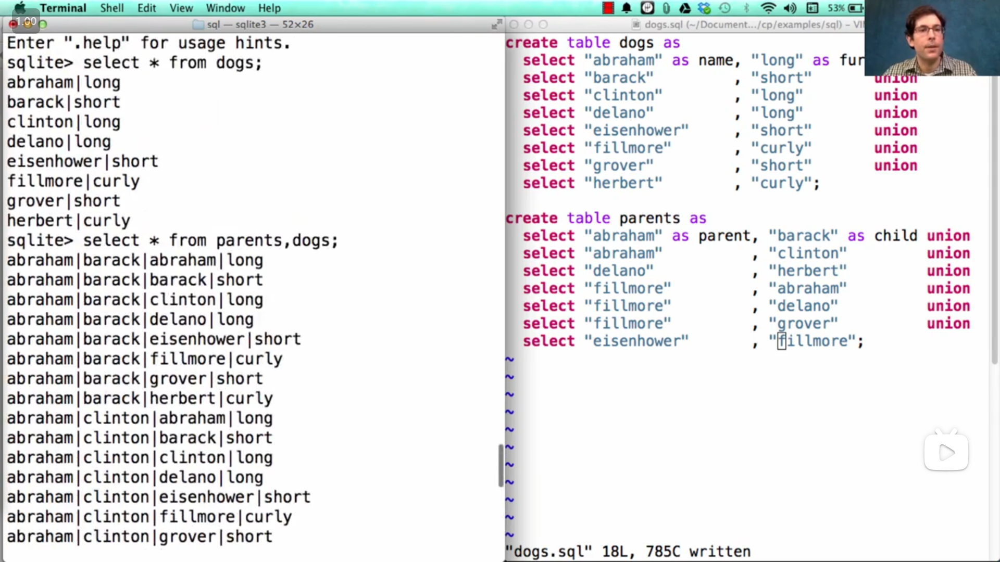
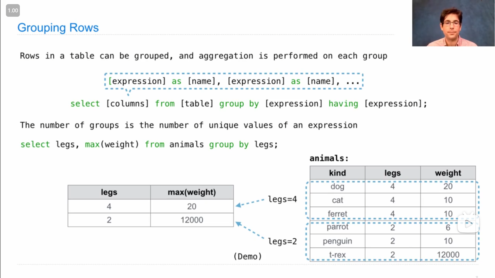
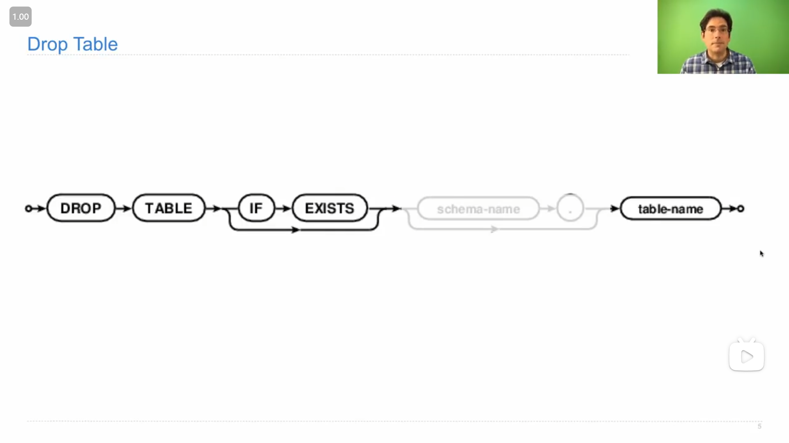
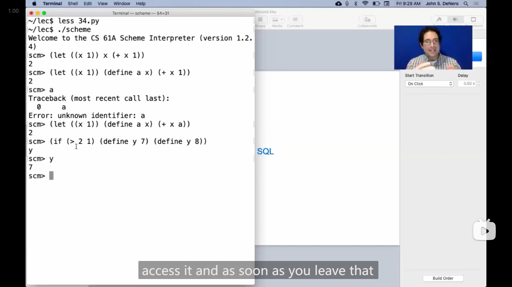
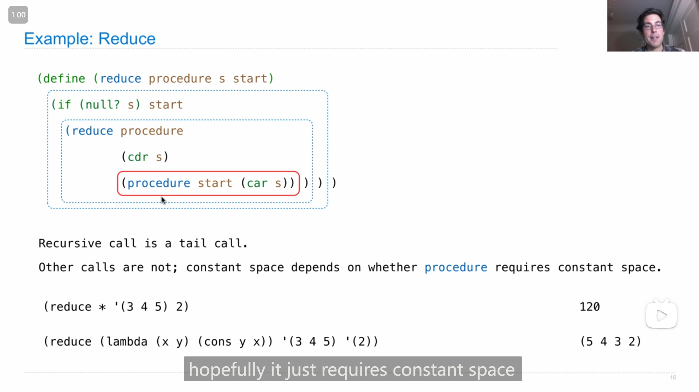
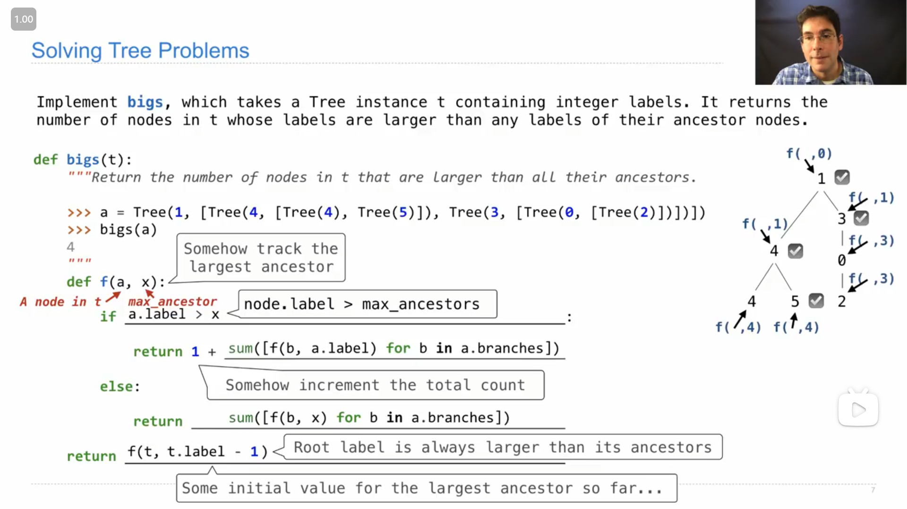
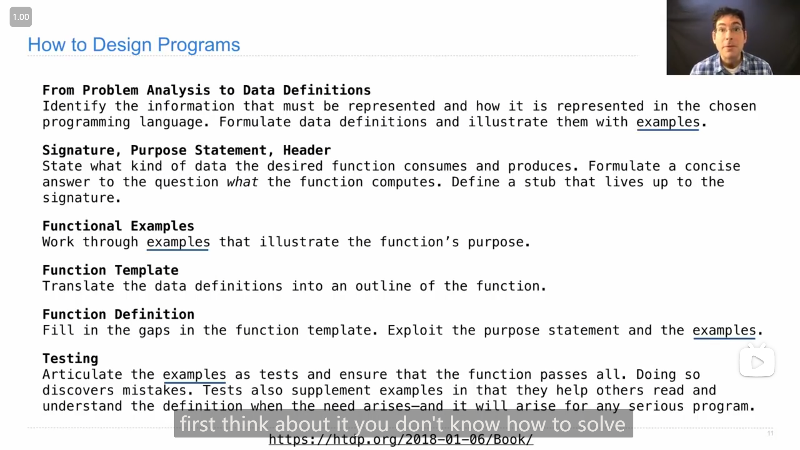

# CS61A Part 3

??? info "目录"

    -   [Lecture 31 Declarative Programming](#lecture-31-declarative-programming)
    -   [Lecture 32 Tables](#lecture-32-tables)
    -   [Lecture 32 Q&A](#lecture-32-qa)
    -   [Lab 12](#lab-12)
    -   [Lecture 33 Aggregation](#lecture-33-aggregation)
    -   [Lecture 33 Q&A](#lecture-33-qa)
    -   [Lecture 34 Database](#lecture-34-database)
    -   [Lecture 34 Q&A](#lecture-34-qa)
    -   [HW 09](#hw-09)
    -   [Lecture 35 Tail Calls](#lecture-35-tail-calls)
    -   [Lab 13](#lab-13)
    -   [Lecture 36 Macros](#lecture-36-macros)
    -   [Lab 14](#lab-14)
    -   [Lecture 36 Q&A](#lecture-36-qa)
    -   [Lecture 37 Final Examples](#lecture-37-final-examples)
    -   [Lecture 37 Q&A](#lecture-37-qa)
    -   [Lecture 38 Conclusion](#lecture-38-conclusion)

## Lecture 31 Declarative Programming

### 1

{ loading=lazy }

John解释什么是 *声明式语言 declarative language* ，以及和 *命令式语言 imperative language* 的区别，

主要在于，***命令式语言*只会固定地执行写好的程序，而*声明式语言*会根据需要处理的情况来自己选择合适的处理方法**

!!! quote

    John:
    
    SQL is a declarative programming language. What's that? Well, in a declarative language, SQL is the most common example, but there are many others such as Prolog. A program is a description of the desired result that you want your computer to generate. The interpreter's job is to figure out how to generate that result for you. That's different from an imperative language, such as Python or Scheme. In an imperative language, when you write a program in that language, it's a description of some computational process or processes that you want to be carried out. The job of an interpreter in an imperative language is to carry out the execution and evaluation rules in order to have a correctly interpreted program, and you've done this in your project.
    
    So, there's more flexibility in a declarative language interpreter. We'll see what I mean by that in time, but here's a place to start: in an imperative language, if you write a quadratic time algorithm by specifying that computational process, it's probably gonna run in quadratic time. But in a declarative language, you just say what you want, and if there are multiple ways to compute that, one of which runs in quadratic time and one of which runs in linear time, well, it's up to the interpreter to choose among those options in order to compute what you want as efficiently as possible.
    
    So, a lot of the interesting research in declarative languages is in making decisions about how to compute the desired result, given that there are many ways to compute it correctly, but some of them are faster than others.
    
    ---
    
    John:
    
    SQL是一种声明式编程语言。那是什么？嗯，在声明式语言中，SQL是最常见的例子，但还有许多其他语言，比如Prolog。程序是对你想让计算机生成的期望结果的描述。解释器的任务是弄清楚如何为你生成该结果。这与命令式语言不同，比如Python或Scheme。在命令式语言中，当你在该语言中编写程序时，它是对你想执行的一些计算过程或过程的描述。命令式语言中解释器的任务是执行执行和评估规则，以确保正确解释程序，而你在项目中已经做到了这一点。
    
    因此，在声明式语言解释器中有更多的灵活性。我们会在后面详细讨论这一点，但这里是一个起点：在命令式语言中，如果你通过指定计算过程来编写一个二次时间复杂度的算法，它可能会运行在二次时间复杂度。但在声明式语言中，你只需说明你想要的结果，如果有多种计算该结果的方式，其中一种是二次时间复杂度，另一种是线性时间复杂度，那么由解释器来在这些选项中选择，以尽可能高效地计算出你想要的结果。
    
    因此，在声明式语言中，关于如何计算期望结果的有趣研究很多，鉴于有许多正确计算结果的方式，但其中一些比其他方式更快。

### 2

{ loading=lazy }

SQL语言的一些基本语句，John说(除了 `select` `create table` )其他的语句对于理解SQL的核心不太重要

!!! quote

    John:
    
    ...They're important if you're actually going to use one of these systems in a large industrial application, but they're not too important for understanding the heart of how SQL works. Most of the important action is in the SELECT statement.
    
    ---
    
    John:
    
    ...它们在实际应用于大型工业应用程序时非常重要，但对于理解 SQL 工作的核心并不太重要。大部分重要的操作都在 SELECT 语句中。

### 3

{ loading=lazy }

`select` 语句的基本用法

```sql
select [expression] as [name], [expression] as [name], ... ;
```

分号 `;` 表示结束， `as [name]` 部分是可选的。

一个 `select` 语句只会生成一个一行的数据表，可以使用 `union` 将多个表合并，**合并要求两个表的列数是一样的**，使用第一个表的列名作为新表的列名(所以可以看到展示的代码中，之后 `select` 语句(即之后的表)都可以不用添加列名不用写 `as [name]` )

!!! quote

    John:
    
    ...If you `select` literals, which are expressions like the number `2` or the string `"Berkeley"` , that will create a one-row table. But if you want to create a multi-row table, you can union together two `select` statements. The union of two `select` statements is another table, but it contains the rows of both. You can only union together tables that have the same number of columns and the same type of information in each column. But the two `select` statements that you union together don't need to have the same names for the columns; it will just use the names of the first `select` statement in order to name the columns in the final result.
    
    ---
    
    John:
    
    ...如果你选择（ `select` ）字面量，这些表达式可以是像数字 `2` 或字符串 `"Berkeley"` 这样的表达式，那将创建一个一行的表。但如果你想创建一个多行的表，你可以将两个 `select` 语句联合在一起。两个 `select` 语句的联合是另一个表，但它包含了两者的行。你只能联合那些具有相同列数和每列相同类型信息的表。但你联合在一起的两个 `select` 语句的列名不需要相同；它将只使用第一个 `select` 语句的列名来命名最终结果中的列。

---

{ loading=lazy }

`select` 语句只会展示数据表，但并不会将数据表储存，所以如果需要储存数据表，可以使用 `create table` 语句(如上图)

### 4

**用 `select` 语句来 *投影 project* 现有数据表**

>   project官方的翻译是*投影*，但我觉得这里理解为 处理 也可以

{ loading=lazy }

可以用 `from` 来选择一个已有的表，可以用 `where` 来筛选符合条件的行(感觉有点像python列表推到式中的 `if` )，可以用 `order by` 来给新表设置排序规则

---

在John的demo演示中，使用 `*` 来选择所有列

```sql
select * from parents;
```

{ loading=lazy }

### 5

{ loading=lazy }

`select` 语句中也可以进行数学的处理(如上图)

### 6

{ loading=lazy }

在 sql 终端中，可以使用 `-init xxx.sql` 来加载 `.sql` 文件

---

John提到 `select * from ints` 后，新表与原表顺序不一致的现象

!!! quote

    John:
    
    Notice something quite interesting. These rows don't appear in the order that I wrote them out in the first place. When you union together a bunch of `select` statements, you get no guarantees about the order of the result. That's up to the declarative programming engine, which tries to compute the result efficiently.
    
    Now, one thing that `union` does is it discards repeats, and the way that it discards repeats in some cases is to sort all the rows to look for whether there's repetition. And that's exactly what happened here. So, you can see that it's written all of these in an alphabetical order according to the word, which is not what I asked for in the first place, but that's what I got.
    
    And this is one of the properties of declarative programming languages. There's no particular procedure that's defined in advance that tells me how to compute the result of unioning together a bunch of `select` statements. Instead, it's up to the system to create the correct result in whatever way it chooses, and that might involve building the table in a different order than you might expect.
    
    ---
    
    John:
    
    请注意一些相当有趣的事情。这些行并不按照我最初写出它们的顺序出现。当你联合一堆 `select` 语句时，你无法保证结果的顺序。这由声明性编程引擎决定，它试图有效地计算结果。
    
    现在， `union` 的一项功能是丢弃重复项，而在某些情况下丢弃重复项的方法是对所有行进行排序，以查看是否有重复。这正是这里发生的情况。所以你可以看到，它按照单词的字母顺序写出了所有这些，这不是我最初要求的，但这就是我得到的结果。
    
    这是声明性编程语言的一个特性。没有预先定义的特定过程告诉我如何计算联合一堆 `select` 语句的结果。相反，这取决于系统以任何它选择的方式创建正确的结果，这可能涉及以与你期望的不同的顺序构建表。

### 7

{ loading=lazy }

问题B，最后John用了一种我没想到的方法😂，

```sql
select word from ints
where one + two/2 + four/4 + eight/8 = 1;
```

即判断是否只有一个为正，

我想到的是，将1 2 4 8加起来(算自己的值)然后取模为零(但不知道sql中有没有取模运算，有的话应该就可行)

## Lecture 32 Tables

### 1

{ loading=lazy }

{ loading=lazy }

*联接 join* 两个表的方法，使用 逗号 `,` 来*联接*，结果是得到一个每个表的每一行与其他表的每一行组合的新的表(从上图John的demo演示中可以看到)

---

{ loading=lazy }

如果遇到不同的表有相同名字的列，或者需要使用同一个表(如上图)，就需要使用 *别名 alias* ( `from [table] as [alias]` )，然后使用 点表达式 `.` 来使用不同表/别名中的相同名字的列

---

John展示了*联接*‘多个表的应用，

{ loading=lazy }

筛选出祖父和孙子毛发类型一样的数据

```sql
select grandog from grandparents, dogs as c, dogs as d
  where grandog = c.name and
        granpup = d.name and
        c.fur = d.fur;
```

### 2

{ loading=lazy }

sql中的一些数学运算相关的表达式，

其中不等号有两种 `<>` 和 `!=` ，而等号是 `=` (和python中的 `==` 不一样)

### 3

{ loading=lazy }

John展示的sql中字符串string的一些用法，

-   字符串的 *连接 concatenation*，使用 `||` 可以将两个字符串*连接*，

-   子字符串 `substr` ，第一个位置是字符串，第二个位置是起始字符的位置(从1开始)，第三个位置是子串长度

    >   所以上图中， `substr(s, 4, 2)` 的结果是 `lo`

-   字符串中字符的位置 `instr` ，第一个位置是字符串，第二个位置是要找的字符(可能子字符串也可以)，然后返回第一个对应的位置

## Lecture 32 Q&A

### 1

有人提问到 *动态作用域 dynamic scope* ，John解释了这个概念一些相关信息

!!! quote

    John:
    
    ...Dynamic scope, which is different from lexical scope, is what you're used to. Lexical scope basically says that all of the variables within a function can be identified just by looking at the code. This is true in Python; if you have an inner function like the `adder` function within `make_adder`, you can see all the names within the `adder` function in the code. They might be part of the `adder` function; they might be part of the `make_adder` function, the enclosing scope, but they're all kind of there. That's what's called lexical scope. It's the most common way in which programming languages work.
    
    In other offerings of this course, we talk about an alternative called dynamic scope, which is hardly ever used. It's kind of interesting intellectually, and there are a few cases where it gets used, but mostly it doesn't exist in modern programming languages. So, for that reason, it's fine to just not know about it. But if you want to know about it, the story is basically that when you call a function, that function's environment inherits all of the names that already existed from wherever it was called. That means when you look at the body of the function, it might have names in it that you just can't see anywhere in the code because they're actually defined where that function is called, maybe in a different file or something like that.
    
    Dynamic scope allows you to set up your environment and then make a function call, which is pretty different from lexical scope where you have to pass in everything that's relevant. But for that reason, it can simplify some things where, instead of passing in several different arguments, you just kind of have them already, and you don't have to pass any of them in. So, that's kind of the story with dynamic scope. It's just the same as lexical scope, except for the parent of a frame is always the frame from which that function was called, as opposed to where that function was defined.
    
    ---
    
    John:
    
    ...动态作用域（dynamic scope）与词法作用域（lexical scope）不同，而你可能已经习惯了词法作用域。词法作用域基本上表示一个函数内的所有变量都可以通过查看代码来确定。在Python中是这样的；如果你有一个内部函数，比如在 `make_adder` 内的 `adder` 函数，你可以在代码中看到 `adder` 函数中的所有名称。它们可能是 `adder` 函数的一部分；它们可能是 `make_adder` 函数的一部分，即封闭作用域，但它们都在那里。这就是所谓的词法作用域，这是大多数编程语言工作的最常见方式。
    
    在本课程的其他部分，我们谈到了一种叫做动态作用域的替代方案，但它几乎从不被使用。从智力上讲，它有点有趣，而且有一些情况下会用到，但在现代编程语言中它基本不存在。因此，出于这个原因，你可以不了解它。但如果你想了解，故事基本上是，当你调用一个函数时，该函数的环境继承了从它被调用的任何地方已经存在的所有名称。这意味着当你查看函数的主体时，它可能包含在代码中你无法看到的名称，因为它们实际上是在调用该函数的地方定义的，可能在不同的文件中等。
    
    动态作用域允许你设置你的环境然后进行函数调用，这与词法作用域相当不同，在词法作用域中，你必须传入所有相关的内容。但因为这个原因，它可以简化一些事情，而不是传递多个不同的参数，你可以直接使用它们，而无需传递它们。因此，这就是动态作用域的故事，它与词法作用域基本相同，只是一个框架的父级始终是调用该函数的框架，而不是定义该函数的地方。

关于*动态作用域*，我觉得关键的地方在于，**==函数内部的参数是基于被调用时的环境的==**

### 2

John举例解释道scheme中表达式*求值*的顺序

```scheme
(if (= (+ 1 2) 3) (print 5) (print 6))

--------------------------------------
    -------------
     - ------- -
        - - -     
                  ---------
                   ----- -
                   
(define (cube x) (* x x x))

---------------------------

(cube (+ 1 2))

--------------
 ---- -------
       - - -
       
                 ---------
                  - - - -
```

可以看到是先进行表达式的*求值*，然后再去对表达式内部的字进行*求值*

## Lab 12

### 1

这个lab中需要运行命令

```bash
python sqlite_shell.py --init lab12.sql
```

来加载 `lab12.sql` 文件以及启动sql的终端，但是在2020年秋季课程网页(不知什么原因)给出的 `lab12.zip` 中， `sqlite_shell.py` 是个空文件，

然后我就去查看了lab网页中的 `Troubleshooting` ，这里提到了另一种替代方法

>   If running `python3 sqlite_shell.py` didn't work, you can download a precompiled sqlite directly by following the following instructions and then use `sqlite3` and `./sqlite3` instead of `python3 sqlite_shell.py` based on which is specified for your platform.

在SQLite官网下载已经编译好的可执行文件，于是我按照网页上的指示下载好了 `sqlite-tools-win-x64-3450100.zip` ，然后能在终端正常打开 `sqlite.exe` ，但是我在使用命令

```bash
./sqlite3 < lab12.sql
```

和

```bash
./sqlite3 --init lab12.sql
```

加载 `lab12.sql` 时，都显示相同的报错

```bash
-- Loading resources from lab12.sql
Parse error near line 4: no such column: 11/13/2020 14:28:25
   "Image 3", 129                   UNION    SELECT "11/13/2020 14:28:25"
                                      error here ---^
Parse error near line 401: no such column: 11/13/2020 14:28:25
  True" , "False", "False", "False" UNION    SELECT "11/13/2020 14:28:25"
                                      error here ---^
...
```

不知道是什么原因。

之后我分别去查看了23、21、19年秋季的对应的SQL的lab(lab12或lab13)，这几个学期的sql lab压缩包内的 `sqlite_shell.py` 文件都不是空文件，并且似乎三个学期的 `sqlite_shell.py` 文件哈希值都一样(说明是同一个文件)，于是我就将23秋季的 `sqlite_shell.py` 解压替换了原有的文件，最后可以运行最初的命令。

??? info "sqlite_shell.py"

    ```python title="sqlite_shell.py"
    #!/usr/bin/env python
    
    # Licensed under the MIT license
    
    # A simple SQLite shell that uses the built-in Python adapter.
    
    import codecs
    import io
    import os
    import sys
    import sqlite3
    import time
    import warnings
    
    try: FileNotFoundError
    except NameError: FileNotFoundError = OSError
    
    if str != bytes: buffer = bytes
    if str != bytes: unicode = str
    
    try: import msvcrt
    except ImportError: msvcrt = None
    
    CP_UTF8 = 65001
    pythonapi = None
    if msvcrt:
        import ctypes
        (BOOL, DWORD, HANDLE, UINT) = (ctypes.c_long, ctypes.c_ulong, ctypes.c_void_p, ctypes.c_uint)
        GetConsoleCP = ctypes.WINFUNCTYPE(UINT)(('GetConsoleCP', ctypes.windll.kernel32))
        SetConsoleCP = ctypes.WINFUNCTYPE(BOOL, UINT)(('SetConsoleCP', ctypes.windll.kernel32))
        GetConsoleOutputCP = ctypes.WINFUNCTYPE(UINT)(('GetConsoleOutputCP', ctypes.windll.kernel32))
        SetConsoleOutputCP = ctypes.WINFUNCTYPE(BOOL, UINT)(('SetConsoleOutputCP', ctypes.windll.kernel32))
        GetConsoleMode = ctypes.WINFUNCTYPE(BOOL, HANDLE, ctypes.POINTER(DWORD), use_last_error=True)(('GetConsoleMode', ctypes.windll.kernel32))
        GetNumberOfConsoleInputEvents = ctypes.WINFUNCTYPE(BOOL, HANDLE, ctypes.POINTER(DWORD), use_last_error=True)(('GetNumberOfConsoleInputEvents', ctypes.windll.kernel32))
        ReadConsoleW = ctypes.WINFUNCTYPE(BOOL, HANDLE, ctypes.c_void_p, DWORD, ctypes.POINTER(DWORD), ctypes.c_void_p, use_last_error=True)(('ReadConsoleW', ctypes.windll.kernel32))
        WriteConsoleW = ctypes.WINFUNCTYPE(BOOL, HANDLE, ctypes.c_void_p, DWORD, ctypes.POINTER(DWORD), ctypes.c_void_p, use_last_error=True)(('WriteConsoleW', ctypes.windll.kernel32))
        class Py_buffer(ctypes.Structure): _fields_ = [('buf', ctypes.c_void_p), ('obj', ctypes.py_object), ('len', ctypes.c_ssize_t), ('itemsize', ctypes.c_ssize_t), ('readonly', ctypes.c_int), ('ndim', ctypes.c_int), ('format', ctypes.c_char_p), ('shape', ctypes.POINTER(ctypes.c_ssize_t)), ('strides', ctypes.POINTER(ctypes.c_ssize_t)), ('suboffsets', ctypes.POINTER(ctypes.c_ssize_t))] + ([('smalltable', ctypes.c_ssize_t * 2)] if sys.version_info[0] <= 2 else []) + [('internal', ctypes.c_void_p)]
        try: from ctypes import pythonapi
        except ImportError: pass
    if pythonapi:
        def getbuffer(b, writable):
            arr = Py_buffer()
            pythonapi.PyObject_GetBuffer(ctypes.py_object(b), ctypes.byref(arr), ctypes.c_int(writable))
            try: buf = (ctypes.c_ubyte * arr.len).from_address(arr.buf)
            finally: pythonapi.PyBuffer_Release(ctypes.byref(arr))
            return buf
    
    ENCODING = 'utf-8'
    
    if sys.version_info[0] < 3:
        class NotASurrogateError(Exception): pass
        def surrogateescape_handler(exc):
            # Source: https://github.com/PythonCharmers/python-future/blob/aef57391c0cd58bf840dff5e2bc2c8c0f5b0a1b4/src/future/utils/surrogateescape.py
            mystring = exc.object[exc.start:exc.end]
            try:
                if isinstance(exc, UnicodeDecodeError):
                    decoded = []
                    for ch in mystring:
                        if isinstance(ch, int):
                            code = ch
                        else:
                            code = ord(ch)
                        if 0x80 <= code <= 0xFF:
                            decoded.append(unichr(0xDC00 + code))
                        elif code <= 0x7F:
                            decoded.append(unichr(code))
                        else:
                            raise NotASurrogateError()
                    decoded = str().join(decoded)
                elif isinstance(exc, UnicodeEncodeError):
                    decoded = []
                    for ch in mystring:
                        code = ord(ch)
                        if not 0xD800 <= code <= 0xDCFF:
                            raise NotASurrogateError()
                        if 0xDC00 <= code <= 0xDC7F:
                            decoded.append(unichr(code - 0xDC00))
                        elif code <= 0xDCFF:
                            decoded.append(unichr(code - 0xDC00))
                        else:
                            raise NotASurrogateError()
                    decoded = str().join(decoded)
                else:
                    raise exc
            except NotASurrogateError:
                raise exc
            return (decoded, exc.end)
        codecs.register_error('surrogateescape', surrogateescape_handler)
    
    def exception_encode(ex, codec):
        if str == bytes:
            reduced = ex.__reduce__()
            ex = reduced[0](*tuple(map(lambda arg: codec.decode(arg)[0] if isinstance(arg, bytes) else arg, reduced[1])))
        return ex
    
    def sql_commands(read_line):
        delims = ['"', "'", ';', '--']
        counter = 0
        in_string = None
        j = i = 0
        prev_line = None
        line = None
        concat = []
        while True:
            if line is None:
                while True:  # process preprocessor directives
                    counter += 1
                    not_in_the_middle_of_any_input = not in_string and i == j and all(map(lambda chunk_: len(chunk_) == 0, concat))
                    line = read_line(counter - 1, not_in_the_middle_of_any_input, prev_line)
                    empty_string = line[:0] if line is not None else line
                    prev_line = line
                    if not line:
                        break
                    if not_in_the_middle_of_any_input and line.startswith("."):
                        yield line
                        line = None
                    else:
                        break
                if not line:
                    break
                j = i = 0
            if j < len(line):
                (j, delim) = min(map(lambda pair: pair if pair[0] >= 0 else (len(line), pair[1]), map(lambda d: (line.find(d, j), d), in_string or delims if in_string != '--' else "\n")))
                if i < j: concat.append(line[i:j]); i = j
                if not in_string:
                    if j < len(line):
                        j += len(delim)
                        if delim == ';':
                            i = j
                            concat.append(line[j : j + len(delim)])    # ensure delimeter is the same type as the string (it may not be due to implicit conversion)
                            # Eat up any further spaces until a newline
                            while j < len(line):
                                delim = line[j:j+1]
                                if not delim.isspace(): break
                                j += 1
                                if delim == "\n": break
                            if i < j: concat.append(line[i:j]); i = j
                            yield empty_string.join(concat)
                            del concat[:]
                        else:
                            in_string = delim
                else:
                    if j < len(line):
                        ch = line[j:j+1]
                        assert ch == in_string or in_string == '--'
                        j += 1
                        i = j
                        concat.append(ch)
                        in_string = None
            else:
                if i < j: concat.append(line[i:j]); i = j
                line = None
    
    class WindowsConsoleIOMixin(object):
        # Ctrl+C handling with ReadFile() is messed up on Windows starting on Windows 8... here's some background reading:
        #   https://stackoverflow.com/a/43260436
        #   https://github.com/microsoft/terminal/issues/334
        # We use ReadConsole when we can, so it doesn't affect us, but it's good info to know regardless.
        def __init__(self, fd):
            assert isatty(fd), "file descriptor must refer to a console (note that on Windows, NUL satisfies isatty(), but is not a console)"
            self.fd = fd
            self.handle = msvcrt.get_osfhandle(fd)
        def fileno(self): return self.fd
        def isatty(self): return isatty(self.fd)
        def seekable(self): return False
        def readable(self): return GetNumberOfConsoleInputEvents(self.handle, ctypes.byref(DWORD(0))) != 0
        def writable(self): n = DWORD(0); return WriteConsoleW(self.handle, ctypes.c_void_p(), n, ctypes.byref(n), ctypes.c_void_p()) != 0
        def readwcharsinto(self, buf, n):
            nr = DWORD(n)
            old_error = ctypes.get_last_error()
            ctypes.set_last_error(0)
            success = ReadConsoleW(self.handle, buf, nr, ctypes.byref(nr), ctypes.c_void_p())
            error = ctypes.get_last_error()
            ctypes.set_last_error(old_error)
            if not success: raise ctypes.WinError(error)
            ERROR_OPERATION_ABORTED = 995
            if nr.value == 0 and error == ERROR_OPERATION_ABORTED:
                # Apparently this can trigger pending KeyboardInterrupts?
                time.sleep(1.0 / (1 << 64))
                raise KeyboardInterrupt()  # If Python doesn't raise it, we can
            return nr.value
        def writewchars(self, buf, n):
            nw = DWORD(n)
            if not WriteConsoleW(self.handle, buf, nw, ctypes.byref(nw), ctypes.c_void_p()):
                raise ctypes.WinError()
            return nw.value
    
    class WindowsConsoleRawIO(WindowsConsoleIOMixin, io.RawIOBase):
        def readinto(self, b):
            wordsize = ctypes.sizeof(ctypes.c_wchar)
            return self.readwcharsinto(getbuffer(b, True), len(b) // wordsize) * wordsize
        def write(self, b):
            wordsize = ctypes.sizeof(ctypes.c_wchar)
            return self.writewchars(getbuffer(b, False), len(b) // wordsize) * wordsize
    
    class WindowsConsoleTextIO(WindowsConsoleIOMixin, io.TextIOBase):
        buf = None
        buffered = unicode()
        translate = True
        def getbuf(self, ncodeunits):
            buf = self.buf
            if buf is None or len(buf) < ncodeunits:
                self.buf = buf = ctypes.create_unicode_buffer(ncodeunits)
            return buf
        @staticmethod  # Don't let classes override this... they can override the caller instead
        def do_read(self, nchars, translate_newlines):
            prenewline = os.linesep[:-1]
            newline = os.linesep[-1:]
            empty = os.linesep[:0]
            if nchars is None or nchars < -1: nchars = -1
            ncodeunits = nchars if nchars >= 0 else io.DEFAULT_BUFFER_SIZE  # Unit mismatch, but doesn't matter; we'll loop
            buf = None
            istart = 0
            while True:
                iend = self.buffered.find(newline, istart, min(istart + nchars, len(self.buffered)) if nchars >= 0 else None) if newline is not None else nchars
                if iend >= 0: iend += len(newline) if newline is not None else 0
                if 0 <= iend <= len(self.buffered):
                    break
                if buf is None: buf = self.getbuf(ncodeunits)
                istart = len(self.buffered)
                chunk = buf[:self.readwcharsinto(buf, ncodeunits)]
                if translate_newlines: chunk = chunk.replace(prenewline, empty)
                if chunk.startswith('\x1A'):  # EOF on Windows (Ctrl+Z) at the beginning of a line results in the entire rest of the buffer being discarded
                    iend = istart
                    break
                # Python 2 and Python 3 behaviors differ on Windows... Python 2's sys.stdin.readline() just deletes the next character if it sees EOF in the middle of a string! I won't emulate that here.
                self.buffered += chunk  # We're relying on Python's concatenation optimization here... we don't do it ourselves, since we want self.buffered to be valid every iteration in case there is an exception raised
            result = self.buffered[:iend]
            self.buffered = self.buffered[iend:]
            return result
        def read(self, nchars=-1): return WindowsConsoleTextIO.do_read(self, nchars, None, self.translate)
        def readline(self, nchars=-1): return WindowsConsoleTextIO.do_read(self, nchars, self.translate)
        def write(self, text): buf = ctypes.create_unicode_buffer(text); return self.writewchars(buf, max(len(buf) - 1, 0))
    
    def wrap_windows_console_io(stream, is_output):
        fd = None
        if stream is not None and sys.version_info[0] < 3 and msvcrt and (is_output or pythonapi) and isatty(stream):
            try: fd = stream.fileno()
            except io.UnsupportedOperation: pass
        result = stream
        if fd is not None:
            f = GetConsoleOutputCP if is_output else GetConsoleCP
            if not f or f() != CP_UTF8:
                try:
                    if True or is_output:
                        result = WindowsConsoleTextIO(fd)
                    else:
                        result = io.TextIOWrapper((io.BufferedWriter if is_output else io.BufferedReader)(WindowsConsoleRawIO(fd)), 'utf-16-le', 'strict', line_buffering=True)
                except IOError: pass
        return result
    
    class NonOwningTextIOWrapper(io.TextIOWrapper):
        def __init__(self, base_textiowrapper, **kwargs):
            assert isinstance(base_textiowrapper, io.TextIOWrapper)
            self.base = base_textiowrapper  # must keep a reference to this alive so it doesn't get closed
            super(NonOwningTextIOWrapper, self).__init__(base_textiowrapper.buffer, **kwargs)
        def close(self):
            super(NonOwningTextIOWrapper, self).flush()
    
    def wrap_unicode_stdio(stream, is_writer, encoding):  # The underlying stream must NOT be used directly until the stream returned by this function is disposed of
        if isinstance(stream, io.TextIOWrapper):
            stream.flush()  # Make sure nothing is left in the buffer before we re-wrap it
            none = object()
            kwargs = {}
            for key in ['encoding', 'errors', 'newline', 'line_buffering', 'write_through']:
                value = getattr(stream, 'newlines' if key == 'newline' else key, none)
                if value is not none:
                    kwargs[key] = value
            kwargs['encoding'] = encoding
            result = NonOwningTextIOWrapper(stream, **kwargs)
        elif 'PYTHONIOENCODING' not in os.environ and str == bytes and stream in (sys.stdin, sys.stdout, sys.stderr):
            result = (codecs.getwriter if is_writer else codecs.getreader)(encoding)(stream)
        else:
            result = stream
        return result
    
    class StringEscapeParser(object):
        def __init__(self):
            import re
            self.pattern = re.compile("\"((?:[^\"\\n]+|\\\\.)*)(?:\"|$)|\'([^\'\\n]*)(?:\'|$)|(\\S+)")
            self.escape_pattern = re.compile("\\\\(.)", re.DOTALL)
        @staticmethod
        def escape_replacement(m):
            text = m.group(1)
            if text == "\\": text = "\\"
            elif text == "/": text = "\n"
            elif text == "n": text = "\n"
            elif text == "r": text = "\r"
            elif text == "t": text = "\t"
            elif text == "v": text = "\v"
            elif text == "f": text = "\f"
            elif text == "a": text = "\a"
            elif text == "b": text = "\b"
            return text
        def __call__(self, s):
            escape_pattern = self.escape_pattern
            escape_replacement = self.escape_replacement
            result = []
            for match in self.pattern.finditer(s):
                [m1, m2, m3] = match.groups()
                if m1 is not None: result.append(escape_pattern.sub(escape_replacement, m1))
                if m2 is not None: result.append(m2)
                if m3 is not None: result.append(escape_pattern.sub(escape_replacement, m3))
            return result
    
    class Database(object):
        def __init__(self, name, *args, **kwargs):
            self.connection = sqlite3.connect(name, *args, **kwargs)
            self.cursor = self.connection.cursor()
            self.name = name  # assign name only AFTER cursor is created
    
    def isatty(file_or_fd):
        result = True
        method = getattr(file_or_fd, 'isatty', None) if not isinstance(file_or_fd, int) else None  # this check is just an optimization
        if method is not None:
            try: tty = method()
            except io.UnsupportedOperation: tty = None
            result = result and tty is not None and tty
        method = getattr(file_or_fd, 'fileno', None) if not isinstance(file_or_fd, int) else None  # this check is just an optimization
        if method is not None:
            try: fd = method()
            except io.UnsupportedOperation: fd = None
            result = result and fd is not None and os.isatty(fd) and (not msvcrt or GetConsoleMode(msvcrt.get_osfhandle(fd), ctypes.byref(DWORD(0))) != 0)
        return result
    
    def can_call_input_for_stdio(stream):
        return stream == sys.stdin and sys.version_info[0] >= 3
    
    class StdIOProxy(object):
        # Maybe useful later: codecs.StreamRecoder(bytesIO, codec.decode, codec.encode, codec.streamwriter, codec.streamreader, errors='surrogateescape')
        def __init__(self, stdin, stdout, stderr, codec, allow_set_code_page):
            self.codec = codec
            streams = (stdin, stdout, stderr)
            for stream in streams:
                assert isinstance(stream, io.IOBase) or sys.version_info[0] < 3 and isinstance(stream, file) or hasattr(stream, 'mode'), "unable to determine stream type"
                assert not isinstance(stream, io.RawIOBase), "RAW I/O APIs are different and not supported"
            self.streaminfos = tuple(map(lambda stream:
                (
                    stream,
                    isinstance(stream, io.BufferedIOBase) or isinstance(stream, io.RawIOBase) or not isinstance(stream, io.TextIOBase) and 'b' in stream.mode,
                    isinstance(stream, io.TextIOBase) or not (isinstance(stream, io.BufferedIOBase) or isinstance(stream, io.RawIOBase)) and 'b' not in stream.mode,
                    allow_set_code_page
                ),
                streams))
        @property
        def stdin(self): return self.streaminfos[0][0]
        @property
        def stdout(self): return self.streaminfos[1][0]
        @property
        def stderr(self): return self.streaminfos[2][0]
        def _coerce(self, streaminfo, codec, arg):
            stream = streaminfo[0]
            can_binary = streaminfo[1]
            can_text = streaminfo[2]
            if not isinstance(arg, bytes) and not isinstance(arg, buffer) and not isinstance(arg, unicode):
                arg = unicode(arg)
            if isinstance(arg, bytes) or isinstance(arg, buffer):
                if not can_binary:
                    arg = codec.decode(arg, 'surrogateescape')[0]
            elif isinstance(arg, unicode):
                if not can_text:
                    arg = codec.encode(unicode(arg), 'strict')[0]
            return arg
        @staticmethod
        def _do_readline(stream, allow_set_code_page, *args):
            new_code_page = CP_UTF8
            old_code_page = GetConsoleCP() if msvcrt and GetConsoleCP and isatty(stream) else None
            if old_code_page == new_code_page: old_code_page = None  # Don't change code page if it's already correct...
            if old_code_page is not None:
                if not SetConsoleCP(new_code_page):
                    old_code_page = None
            try:
                result = stream.readline(*args)
            finally:
                if old_code_page is not None:
                    SetConsoleCP(old_code_page)
            return result
        @staticmethod
        def _do_write(stream, allow_set_code_page, *args):
            new_code_page = CP_UTF8
            old_code_page = GetConsoleOutputCP() if msvcrt and GetConsoleOutputCP and isatty(stream) else None
            if old_code_page == new_code_page: old_code_page = None  # Don't change code page if it's already correct...
            if old_code_page is not None:
                if not SetConsoleOutputCP(new_code_page):
                    old_code_page = None
            try:
                result = stream.write(*args)
            finally:
                if old_code_page is not None:
                    SetConsoleCP(old_code_page)
            return result
        def _readln(self, streaminfo, codec, prompt):
            stream = streaminfo[0]
            can_binary = streaminfo[1]
            allow_set_code_page = streaminfo[3]
            if can_call_input_for_stdio(stream) and not can_binary:  # input() can't work with binary data
                result = self._coerce(streaminfo, codec, "")
                try:
                    result = input(*((self._coerce(streaminfo, codec, prompt),) if prompt is not None else ()))
                    result += self._coerce(streaminfo, codec, "\n")
                except EOFError: pass
            else:
                self.output(*((prompt,) if prompt is not None else ()))
                self.error()
                result = StdIOProxy._do_readline(stream, allow_set_code_page)
            return result
        def _writeln(self, streaminfo, codec, *args, **kwargs):
            stream = streaminfo[0]
            allow_set_code_page = streaminfo[3]
            flush = kwargs.pop('flush', True)
            kwargs.setdefault('end', '\n')
            kwargs.setdefault('sep', ' ')
            end = kwargs.get('end')
            sep = kwargs.get('sep')
            first = True
            for arg in args:
                if first: first = False
                elif sep is not None:
                    StdIOProxy._do_write(stream, allow_set_code_page, self._coerce(streaminfo, codec, sep))
                StdIOProxy._do_write(stream, allow_set_code_page, self._coerce(streaminfo, codec, arg))
            if end is not None:
                StdIOProxy._do_write(stream, allow_set_code_page, self._coerce(streaminfo, codec, end))
            if flush: stream.flush()
        def inputln(self, prompt=None): return self._readln(self.streaminfos[0], self.codec, prompt)
        def output(self, *args, **kwargs): kwargs.setdefault('end', None); return self._writeln(self.streaminfos[1], self.codec, *args, **kwargs)
        def outputln(self, *args, **kwargs): return self._writeln(self.streaminfos[1], self.codec, *args, **kwargs)
        def error(self, *args, **kwargs): kwargs.setdefault('end', None); return self._writeln(self.streaminfos[2], self.codec, *args, **kwargs)
        def errorln(self, *args, **kwargs): return self._writeln(self.streaminfos[2], self.codec, *args, **kwargs)
    
    class bytes_comparable_with_unicode(bytes):  # For Python 2/3 compatibility, to allow implicit conversion between strings and bytes when it is safe. (Used for strings like literals which we know be safe.)
        codec = codecs.lookup('ascii')  # MUST be a safe encoding
        @classmethod
        def coerce(cls, other, for_output=False):
            return cls.codec.encode(other)[0] if not isinstance(other, bytes) else bytes_comparable_with_unicode(other) if for_output else other
        @classmethod
        def translate_if_bytes(cls, value):
            if value is not None and isinstance(value, bytes): value = cls(value)
            return value
        def __hash__(self): return super(bytes_comparable_with_unicode, self).__hash__()  # To avoid warning
        def __eq__(self, other): return super(bytes_comparable_with_unicode, self).__eq__(self.coerce(other))
        def __ne__(self, other): return super(bytes_comparable_with_unicode, self).__ne__(self.coerce(other))
        def __lt__(self, other): return super(bytes_comparable_with_unicode, self).__lt__(self.coerce(other))
        def __gt__(self, other): return super(bytes_comparable_with_unicode, self).__gt__(self.coerce(other))
        def __le__(self, other): return super(bytes_comparable_with_unicode, self).__le__(self.coerce(other))
        def __ge__(self, other): return super(bytes_comparable_with_unicode, self).__ge__(self.coerce(other))
        def __getitem__(self, index): return self.coerce(super(bytes_comparable_with_unicode, self).__getitem__(index), True)
        def __add__(self, other): return self.coerce(super(bytes_comparable_with_unicode, self).__add__(self.coerce(other)), True)
        def __iadd__(self, other): return self.coerce(super(bytes_comparable_with_unicode, self).__iadd__(self.coerce(other)), True)
        def __radd__(self, other): return self.coerce(self.coerce(other).__add__(self), True)
        def find(self, other, *args): return super(bytes_comparable_with_unicode, self).find(self.coerce(other), *args)
        def join(self, others): return self.coerce(super(bytes_comparable_with_unicode, self).join(map(self.coerce, others)), True)
        def startswith(self, other): return super(bytes_comparable_with_unicode, self).startswith(self.coerce(other))
        def __str__(self): return self.codec.decode(self)[0]
        if str == bytes:
            __unicode__ = __str__
            def __str__(self): raise NotImplementedError()
    
    def wrap_bytes_comparable_with_unicode_readline(readline):
        def callback(*args):
            line = readline(*args)
            line = bytes_comparable_with_unicode.translate_if_bytes(line)
            return line
        return callback
    
    def main(program, *args, **kwargs):  # **kwargs = dict(stdin=file, stdout=file, stderr=file); useful for callers who import this module
        import argparse  # slow import (compiles regexes etc.), so don't import it until needed
        argparser = argparse.ArgumentParser(
            prog=os.path.basename(program),
            usage=None,
            description=None,
            epilog=None,
            parents=[],
            formatter_class=argparse.RawTextHelpFormatter)
        argparser.add_argument('-version', '--version', action='store_true', help="show SQLite version")
        argparser.add_argument('-batch', '--batch', action='store_true', help="force batch I/O")
        argparser.add_argument('-init', '--init', metavar="FILE", help="read/process named file")
        argparser.add_argument('filename', nargs='?', metavar="FILENAME", help="is the name of an SQLite database.\nA new database is created if the file does not previously exist.")
        argparser.add_argument('sql', nargs='*', metavar="SQL", help="SQL commnds to execute after opening database")
        argparser.add_argument('--readline', action='store', metavar="(true|false)", default="true", choices=("true", "false"), help="whether to import readline if available (default: %(default)s)")
        argparser.add_argument('--self-test', action='store_true', help="perform a basic self-test")
        argparser.add_argument('--cross-test', action='store_true', help="perform a basic test against the official executable")
        argparser.add_argument('--unicode-stdio', action='store', metavar="(true|false)", default="true", choices=("true", "false"), help="whether to enable Unicode wrapper for standard I/O (default: %(default)s)")
        argparser.add_argument('--console', action='store', metavar="(true|false)", default="true", choices=("true", "false"), help="whether to auto-detect and use console window APIs (default: %(default)s)")
        argparser.add_argument('--encoding', default=ENCODING, help="the default encoding to use (default: %(default)s)")
        (stdin, stdout, stderr) = (kwargs.pop('stdin', sys.stdin), kwargs.pop('stdout', sys.stdout), kwargs.pop('stderr', sys.stderr))
        parsed_args = argparser.parse_args(args)
        codec = codecs.lookup(parsed_args.encoding or argparser.get_default('encoding'))
        if parsed_args.self_test: self_test(codec)
        if parsed_args.cross_test: cross_test("sqlite3", codec)
        parse_escaped_strings = StringEscapeParser()
        if parsed_args.unicode_stdio == "true":
            stdin = wrap_unicode_stdio(stdin, False, codec.name)
            stdout = wrap_unicode_stdio(stdout, True, codec.name)
            stderr = wrap_unicode_stdio(stderr, True, codec.name)
        if parsed_args.console == "true":
            stdin = wrap_windows_console_io(stdin, False)
            stdout = wrap_windows_console_io(stdout, True)
            stderr = wrap_windows_console_io(stderr, True)
        allow_set_code_page = sys.version_info[0] < 3 and False  # This is only necessary on Python 2 if we use the default I/O functions instead of bypassing to ReadConsole()/WriteConsole()
        stdio = StdIOProxy(stdin, stdout, stderr, codec, allow_set_code_page)
        db = None
        no_args = len(args) == 0
        init_sql = parsed_args.sql
        is_nonpipe_input = stdin.isatty()  # NOT the same thing as TTY! (NUL and /dev/null are the difference)
        init_show_prompt = not parsed_args.batch and is_nonpipe_input
        if not parsed_args.batch and isatty(stdin) and (parsed_args.readline == "true" or __name__ == '__main__') and parsed_args.readline != "false":
            try:
                with warnings.catch_warnings():
                    warnings.filterwarnings('ignore', category=DeprecationWarning)
                    import readline
            except ImportError: pass
        if parsed_args and parsed_args.version:
            stdio.outputln(sqlite3.sqlite_version);
        else:
            filename = parsed_args.filename
            if filename is None: filename = ":memory:"
            db = Database(filename, isolation_level=None)
        def exec_script(db, filename, ignore_io_errors):
            try:
                with io.open(filename, 'r', encoding=codec.name) as f:  # Assume .sql files are text -- any binary data inside them should be X'' encoded, not embedded directly
                    for command in sql_commands(wrap_bytes_comparable_with_unicode_readline(lambda *args: (lambda s: (s) or None)(f.readline()))):
                        result = exec_command(db, command, False and ignore_io_errors)
                        if result is not None:
                            return result
            except IOError as ex:
                stdio.errorln(ex)
                if not ignore_io_errors: return ex.errno
        def raise_invalid_command_error(command):
            if isinstance(command, bytes): command = codec.decode(command)[0]
            if command.startswith("."): command = command[1:]
            raise RuntimeError("Error: unknown command or invalid arguments:  \"%s\". Enter \".help\" for help" % (command.rstrip().replace("\\", "\\\\").replace("\"", "\\\""),))
        def exec_command(db, command, ignore_io_errors):
            results = None
            query = None
            query_parameters = {}
            try:
                if command.startswith("."):
                    args = list(parse_escaped_strings(command))
                    if args[0] in (".quit", ".exit"):
                        return 0
                    elif args[0] == ".help":
                        stdio.error("""
    .cd DIRECTORY          Change the working directory to DIRECTORY
    .dump                  Dump the database in an SQL text format
    .exit                  Exit this program
    .help                  Show this message
    .open FILE             Close existing database and reopen FILE
    .print STRING...       Print literal STRING
    .quit                  Exit this program
    .read FILENAME         Execute SQL in FILENAME
    .schema ?PATTERN?      Show the CREATE statements matching PATTERN
    .show                  Show the current values for various settings
    .tables ?TABLE?        List names of tables
    """.lstrip())
                    elif args[0] == ".cd":
                        if len(args) != 2: raise_invalid_command_error(command)
                        os.chdir(args[1])
                    elif args[0] == ".dump":
                        if len(args) != 1: raise_invalid_command_error(command)
                        foreign_keys = db.cursor.execute("PRAGMA foreign_keys;").fetchone()[0]
                        if foreign_keys in (0, "0", "off", "OFF"):
                            stdio.outputln("PRAGMA foreign_keys=OFF;", flush=False)
                        for line in db.connection.iterdump():
                            stdio.outputln(line, flush=False)
                        stdio.output()
                    elif args[0] == ".open":
                        if len(args) <= 1: raise_invalid_command_error(command)
                        filename = args[-1]
                        for option in args[+1:-1]:
                            raise ValueError("option %s not supported" % (repr(option),))
                        try: db.__init__(filename)
                        except sqlite3.OperationalError as ex:
                            ex.args = ex.args[:0] + ("Error: unable to open database \"%s\": %s" % (filename, ex.args[0]),) + ex.args[1:]
                            raise
                    elif args[0] == ".print":
                        stdio.outputln(*args[1:])
                    elif args[0] == ".read":
                        if len(args) != 2: raise_invalid_command_error(command)
                        exec_script(db, args[1], ignore_io_errors)
                    elif args[0] == ".schema":
                        if len(args) > 2: raise_invalid_command_error(command)
                        pattern = args[1] if len(args) > 1 else None
                        query_parameters['type'] = 'table'
                        if pattern is not None:
                            query_parameters['pattern'] = pattern
                        query = "SELECT sql || ';' FROM sqlite_master WHERE type = :type" + (" AND name LIKE :pattern" if pattern is not None else "") + ";"
                    elif args[0] == ".show":
                        if len(args) > 2: raise_invalid_command_error(command)
                        stdio.errorln("    filename:", db.name)
                    elif args[0] == ".tables":
                        if len(args) > 2: raise_invalid_command_error(command)
                        pattern = args[1] if len(args) > 1 else None
                        query_parameters['type'] = 'table'
                        if pattern is not None:
                            query_parameters['pattern'] = pattern
                        query = "SELECT name FROM sqlite_master WHERE type = :type" + (" AND name LIKE :pattern" if pattern is not None else "") + ";"
                    else:
                        raise_invalid_command_error(args[0])
                else:
                    query = command
                if query is not None:
                    results = db.cursor.execute(query if isinstance(query, unicode) else codec.decode(query, 'surrogatereplace')[0], query_parameters)
            except (RuntimeError, OSError, FileNotFoundError, sqlite3.OperationalError) as ex:
                stdio.errorln(exception_encode(ex, codec))
            if results is not None:
                for row in results:
                    stdio.outputln(*tuple(map(lambda item: item if item is not None else "", row)), sep="|", flush=False)
                stdio.output()
        if db:
            if parsed_args and parsed_args.init:
                if is_nonpipe_input: stdio.errorln("-- Loading resources from", parsed_args.init)
                exec_script(db, parsed_args.init, False)
            def read_stdin(index, not_in_the_middle_of_any_input, prev_line):
                show_prompt = init_show_prompt
                to_write = []
                if index < len(init_sql):
                    line = init_sql[index]
                    if not line.startswith(".") and not line.rstrip().endswith(";"):
                        line += ";"
                elif index == len(init_sql) and len(init_sql) > 0:
                    line = None
                else:
                    if show_prompt:
                        if not_in_the_middle_of_any_input:
                            show_prompt = False
                            if index == 0:
                                to_write.append("SQLite version %s (adapter version %s)\nEnter \".help\" for usage hints.\n" % (sqlite3.sqlite_version, sqlite3.version))
                                if no_args:
                                    to_write.append("Connected to a transient in-memory database.\nUse \".open FILENAME\" to reopen on a persistent database.\n")
                        if index > 0 and not prev_line:
                            to_write.append("\n")
                        to_write.append("%7s " % ("sqlite%s>" % ("",) if not_in_the_middle_of_any_input else "...>",))
                    try:
                        line = stdio.inputln("".join(to_write))
                    except KeyboardInterrupt:
                        line = ""
                        raise  # just kidding, don't handle it for now...
                return line
            for command in sql_commands(wrap_bytes_comparable_with_unicode_readline(read_stdin)):
                result = exec_command(db, command, True)
                if result is not None:
                    return result
            if init_show_prompt and len(init_sql) == 0:
                stdio.outputln()
    
    def call_program(cmdline, input_text):
        import subprocess
        return subprocess.Popen(cmdline, bufsize=0, stdin=subprocess.PIPE, stdout=subprocess.PIPE, stderr=subprocess.PIPE, universal_newlines=False).communicate(input_text)
    
    def test_query():
        hexcodec = codecs.lookup('hex_codec')
        ascii = 'ascii'
        data1 = b"\xD8\xA2"
        data2 = b"\x01\x02\xFF\x01\xFF\xFE\xFD"
        values = [data1, data2]
        query_bytes = b'SELECT %s;' % (b", ".join(map(lambda b: b"X'%s'" % (hexcodec.encode(b)[0].upper(),), values)),)
        expected_bytes = b"%s\n" % (b"|".join(values),)
        return query_bytes, expected_bytes
    
    def cross_test(sqlite_cmdline, codec):
        (query_bytes, expected_bytes) = test_query()
        (official_output, official_error) = call_program(sqlite_cmdline, query_bytes)
        # We can't use os.linesep here since binaries may belong to different platforms (Win32/MinGW vs. MSYS/Cygwin vs. WSL...)
        official_output = official_output.replace(b"\r\n", b"\n")
        official_error = official_error.replace(b"\r\n", b"\n")
        if official_output != expected_bytes:
            raise sqlite3.ProgrammingError("expected bytes are wrong: official %s != expected %s" % (repr(official_output), repr(expected_bytes)))
        if official_error:
            raise sqlite3.ProgrammingError("did not expect errors from official binary")
    
    def self_test(codec):
        (query_bytes, expected_bytes) = test_query()
        if not (lambda stdin, stdout, stderr: not main(sys.argv[0], stdin=stdin, stdout=stdout, stderr=stderr) and stdout.getvalue() == expected_bytes)(io.BytesIO(query_bytes), io.BytesIO(), io.BytesIO()):
            raise sqlite3.ProgrammingError("byte I/O is broken")
        if not (lambda stdin, stdout, stderr: not main(sys.argv[0], stdin=stdin, stdout=stdout, stderr=stderr) and stdout.getvalue() == codec.decode(expected_bytes, 'surrogateescape'))(io.StringIO(query_bytes.decode(ascii)), io.StringIO(), io.StringIO()):
            raise sqlite3.ProgrammingError("string I/O is broken")
    
    if __name__ == '__main__':
        import sys
        exit_code = main(*sys.argv)
        if exit_code not in (None, 0): raise SystemExit(exit_code)
    
    ```

### 2

Q4中，我本来写的是

```sql
CREATE TABLE matchmaker AS
  select pet, song, a.color, b.color from students as a, students as b
  where a.pet = b.pet and a.song = b.song and a.time < b.time;
```

但是显示了这样的报错

```bash
ambiguous column name: pet
no such table: matchmaker
```

分析应该是用表*联接*自身并加上了*别名*时，列的名称也需要加上*别名*，修改后最后通过

??? note "code"

    ```sql
    CREATE TABLE matchmaker AS
      select a.pet, a.song, a.color, b.color from students as a, students as b
      where a.pet = b.pet and a.song = b.song and a.time < b.time;
    ```

### 3

在做Q5时发现，**如果*联接*了多个表，每个表的列名需要使用 `.` 来使用**，即使这个列名在其他表中不存在，例如

```sql
select * from students, numbers where '7' = 'True';
```

这行语句运行后没有结果，或者说没有匹配的行，

```sql
select * from students, numbers where students.'7' = 'True';
```

但这一行语句就会有结果

??? note "code"

    ```sql
    CREATE TABLE sevens AS
      select a.seven from students as a, numbers as b where a.time = b.time and a.number = 7 and b.'7' = 'True';
    ```

## Lecture 33 Aggregation

### 1

{ loading=lazy }

sql中的*聚合函数 Aggregation function* ，可以使用多行的数据进行处理，比如

-   `max` `min` 取最大/最小
-   `sum` 取所有数据的和
-   `avg` 取所有数据的平均值
-   `count` 获取数据的个数

在传入参数(列名)时，还可以在参数前添加 `distinct` ，表示这一列中重复的元素只取用一个，可以参考下图

{ loading=lazy }

---

{ loading=lazy }

{ loading=lazy }

*聚合函数*也可以和其他普通的表达式一起混合使用，来获取其他有用的信息(同一行数据的其他信息)，如上图中John的演示，

但有些*聚合函数*结果不会是某行数据中的数值，

!!! quote

    John:
    
    ...So, you have to be careful about selecting single values in conjunction with aggregations. Some aggregations give you a meaningful value, like `min` and `max` ; others don't, like `avg` .
    
    ---
    
    John:
    
    ...当你与聚合函数一起选择单一值时，你必须小心。有些聚合函数会给你一个有意义的值，比如 `min` 和 `max` ，而其他一些却不会，比如 `avg` 。

并且，从John的demo演示中可以看到，在使用 `min` 或 `max` 时，即使有多行数据都是最小/大值，但是却只是返回了一个结果

>   ```sql
>   sqlite> select max(legs), kind from animals;
>   4|cat
>   ```

### 2

{ loading=lazy }

{ loading=lazy }

*分组 group*

可以使用 `group by` 进行分组，在 `group by` 后写**(单个或多个)列名或表达式**，就会把每个相同的值对应的那一行分到同一个组，而如果使用*聚合函数*就会分别作用于每个组(而不是作用于整个表所有行的数据)，可以参考上图中John的demo演示

---

{ loading=lazy }

在*分组*时，还可以使用 `having` 来**对组进行筛选**(区别于 `where` 是对单行数据进行筛选)

## Lecture 33 Q&A

### 1

有人向John提问的mentor13(在网站上没找到)的一题，

!!! quote

    Fill in `skip-list` , which takes in a potentially nested list `lst` and a single-argument filter function `filter-fn` that returns a boolean when called, and goes through each element in order. It returns a new list that contains all elements that return true when passed into `filter-fn` . The returned list is *not nested*.
    
    ```scheme
    ;Doctests
    scm> (skip-list '(1 (3)) even?)
    ()
    scm> (skip-list'(1 (2 (3 4) 5) 6 (7) 8 9) odd?)
    (1 3 5 7 9)
    ```
    
    ```scheme
    (define (skip-list lst filter-fn)
        (define (helper lst lst-so-far next)
            (cond
                ((null? lst)
                    (if (null? ______)
                        ______
                        ______)
                )
                ((pair? ______)
                    (______))
                ((filter-fn (car lst))
                    ______)
                (else
                    ______)
            )
        )
        (helper ______)
    )
    ```

于是自己写了一下，

由于不清楚 `null?` 和 `pair?` 的作用，于是先试了一下，发现 `null?` 只在传入空列表 `nil` 或者 `()` 时才返回 `true` ，而 `pair?` 只在传入东西为列表，且列表不为空时返回 `true` (传入 `(())` 时也返回 `true` )。

最后写了好一会才写出来，这题有点复杂，因为需要把嵌套的列表给展开，

所以为了处理这样的情况，在进入更深层的列表时，就需要通过 `next` 参数来标记之前的位置(一开始还以为 `next` 指的是列表的之后的部分，但是想到这样的情况一般使用 `rest` 来命名)，

最好想的就是 `(filter-fn (car lst)` 和 `else` 两行，因为这两行就对应普通的情况，即列表不是嵌套的，那么就大概可以得到

```scheme
((filter-fn (car lst))
    (helper (cdr lst) (append lst-so-far (list (car lst))) next))
(else
    (helper (cdr lst) lst-so-far next))
```

>   这里我使用了scheme中的 `append` 函数，因为需要将符合筛选条件的元素拼接到 `lst-so-far` 的尾部，
>
>   `append` 函数的用法是传入**多个列表**，将他们按顺序拼到一起，所以这里的代码就写成了 `(list (car lst))` 
>
>   >   一开始写的是
>   >
>   >   ```scheme
>   >   (append lst-so-far (car lst))
>   >   ```
>   >
>   >   然后运行测试时就报错了😅
>   >
>   >   ```scheme
>   >   scm> (skip-list '(1 (3)) even?)
>   >   ()
>   >   scm> (skip-list '(1 (2 (3 4) 5) 6 (7) 8 9) odd?)
>   >   Traceback (most recent call last):
>   >     1     (append lst-so-far (car lst))
>   >   Error: argument 0 of append has wrong type (int)
>   >   ```

接着来处理 `pair?` 这个情况，根据刚才的两种情况大概就能猜到这里应该就是判断第一个元素是不是列表，所以 `(pair? (car lst))` ，

于是如果是第一个元素是列表，那么肯定需要向内继续走，可以猜到这种情况下递归调用的 `helper` 的第一个参数会是 `(car lst)` ，

然后最关键的地方在于，需要记住 `lst` 之后的元素，一开始我以为 `helper` 第三个参数就是 `(cdr lst)` ，但想到如果再有一层嵌套的列表，原本的 `next` 就会被覆盖丢失，

最后想了好久终于想到应该是把两者合并到一起(这样两者的信息都包含了)，所以

```scheme
((pair? (car lst))
    (helper (car lst) lst-so-far (cons (cdr lst) next)))
```

于是base case的情况就不难想了，结束递归时返回 `lst-so-far` 即可，

```scheme
((null? lst)

    (if (null? next)
        lst-so-far
        (helper (car next) lst-so-far (cdr next)))
)
```

所以 `skip-list` 中的那一行就是

```scheme
(helper lst nil nil)
```

完整的答案为

```scheme
(define (skip-list lst filter-fn)
    (define (helper lst lst-so-far next)
        (cond
            ((null? lst)
                (if (null? next)
                    lst-so-far
                    (helper (car next) lst-so-far (cdr next)))
            )
            ((pair? (car lst))
                (helper (car lst) lst-so-far (cons (cdr lst) next)))
            ((filter-fn (car lst))
                (helper (cdr lst) (append lst-so-far (list (car lst))) next))
            (else
                (helper (cdr lst) lst-so-far next))
        )
    )
    (helper lst nil nil)
)
```

---

John最后的答案和我的有些区别，他是使用了 `append` 来连接 `(cdr lst)` 和 `next` ，

```scheme
(helper (car lst) lst-so-far (append (cdr lst) next))
```

而base case中就是

```scheme
(if (null? next)
    lst-so-far
    (helper next lst-so-far nil))
```

??? note "code"

    ```scheme
    (define (skip-list lst filter-fn)
        (define (helper lst lst-so-far next)
            (cond
                ((null? lst)
                    (if (null? next)
                        lst-so-far
                        (helper next lst-so-far nil))
                )
                ((pair? (car lst))
                    (helper (car lst) lst-so-far (append (cdr lst) next))
                ((filter-fn (car lst))
                    (helper (cdr lst) (append lst-so-far (list (car lst))) next))
                (else
                    (helper (cdr lst) lst-so-far next))
            )
        )
        (helper lst nil nil)
    )
    ```

---

而John又说到这题提供的代码框架中的 `helper` 函数，其实让这题变得复杂了， `lst-so-far` 对应着从头(左边)加载结果，而如果按照以往的思路，从末尾(右边)加载结果，会更简单，代码是

```scheme
(define (skip-list s f)
  (cond ((null? s) nil)
        ((list? (car s)) (append (skip-list (car s) f) (skip-list (cdr s) f)))
        ((f (car s)) (cons (car s) (skip-list (cdr s) f)))
        (else (skip-list (cdr s) f))))
```

### 2

有人提问的17年秋季的期末考试第6题

!!! quote

    **Simplify! Simplify!** For this problem, consider a very small subset of Scheme containing only **if** expression, `(if pred then=part else part)` , and atoms including symbols, `#t` for true, and `#f` for false. Such expressions can be simplified according to the following transformation rules. Here, `P` , `E1` , and `E2` are Scheme expressions in the subset, and `P'` , `E1'` , and `E2'` are their simplified versions.
    
    -   The expression `(if P E1 E2)` simplified to
        -   `E1'` if `P'` is `#t` .
        -   `E2'` if `P'` is `#f` .
        -   `E1'` if `E1'` equals `E2`‘ .
        -   Otherwise, an `if` expression with `P'` , `E1'` , and `E2'` as the predicate, then-part, and else-part.
    -   Any expression, `E` , simplies to `#t` if `E` is *known to be true* (see below); or to `#f` if it is *known to be false*.
    -   Finally, in the expression `(if P E1 E2)` , `P'` is known to be true while simplifying `E1` and is known to be false while simplifying `E2` . Initially, only `#t` is known to be true and only `#f` is known to be false.
    
    Fill in the blanks on the next page so that `(simp E)` returns the simplied version of `E` according to these rules, and the helper function `(simp-ontext E known-t known-f)` returns the simpliation of `E` given that `known-t` is a list of expressions known to be true, and `known-f` is a list of expressions known to be false.
    
    For convenience, assume that `(nth k L)` is defined to return element *k* of list `L` (where 0 is the first), and that `(in? E L)` is defined to return true if and only if *E* is `equal?` to a member of the list *L*.
    
    ```scheme
    scm> (simp '(if a b c))
    (if a b c)
    scm> (simp '(if a b b))
    b
    scm> (simp '(if #t (if #f a b) c))
    b
    scm> (simp '(if a (if a b c) (if a d e)))
    (if a b e)
    scm> (simp '(if (if #t a b) (if a d e) f))
    (if a d f)
    scm> (simp '(if (if a b b) (if b c d) (if e f f)))
    (if b c f)
    scm> (simp '(if (if a b c) (if (if a b c) x y) (if (if a b c) y z)))
    (if (if a b c) x z)
    scm> (simp '(if (if a b c) (if (if a (if a b b) c) d e) f))
    (if (if a b c) d f)
    ```
    
    ```scheme
    (define (simp expr)
      (simp-context expr ______ ______))
    
    (define (simp-context expr known-t known-f)
      (define simp-expr (if (pair? expr)
                            (simp-if (nth 1 expr) (nth 2 expr) (nth 3 expr) known-t known-f)
                            expr))
      (cond (______ #t)
            (______ #f)
            (else ______)))
    
    (define (simp-if pred then-part else-part known-t known-f)
      (let ((simp-pred (simp-context pred ______)))
        (define simp-then
          ______)
        (define simp-else
          ______)
        (cond ((equal? simp-pred #t) simp-then)
              (______ simp-else)
              (______ simp-then)
              (else ______))))
    ```

于是自己写了一下

>   题目中提到但解释器中并没有的两个函数 `nth` 和 `in?` ，于是我自己用代码实现
>
>   ```scheme
>   (define (nth k L)
>    (if (= k 0)
>        (car L)
>        (nth (- k 1) (cdr L))))
>   
>   (define (in? E L)
>    (cond ((null? L) false)
>          ((equal? E (car L)) true)
>          (else (in? E (cdr L)))))
>   ```
>

看完了题目感觉没明白需要干什么😅，但看到提供的例子就明白了。

题目是要实现化简 `if` 表达式的函数，

```scheme
scm> (simp '(if a b b))
b
scm> (simp '(if #t (if #f a b) c))
b
```

这两个例子展示了最简单的能化简的情况，

-   如果满足和不满足条件，返回的两种结果是一样的，那么直接表达式可以化简成这个结果
-   如果条件**可以确定为真**，那么就返回 满足时的表达式的**简化版** ，而如果**可以确定为假**，就返回 不满足时的表达式的**简化版**

而更复杂的情况可以参考第4个例子

```scheme
scm> (simp '(if a (if a b c) (if a d e)))
(if a b e)
```

>   一开始看到这个例子没想明白要如何实现这样的操作，但之后看到了代码就明白了

在这个例子中，需要理解一个**关键之处**， `(if a b c)` 能转变成 `b` ，是因为如果已经进入到需要运算 `(if a b c)` 表达式时，**说明 `a` 已经确定为真了**(因为联系到题目中说到 `known-t` 和 `known-f` 是 确定为真/假的表达式的列表)

然后看代码，核心的部分是 `simp-if` 再是 `simp-context` ，看到 `simp-if` 中的这一行，

```scheme
(let ((simp-pred (simp-context pred ______))) ...)
```

我就明白了，`simp-context` 是用来**化简单个表达式**，继而明白 `simp-if` 是用来化简 `if` 表达式的，

因此大概可以猜出，这一行的空应该就是最简单的 `known-t known-f` ，继而又很容易可以想到 `simp-then` 和 `simp-else` 也需要调用 `simp-context` 并各自把 `pred` 加上

```scheme
(define simp-then
  (simp-context then-part (cons simp-pred known-t) known-f))
(define simp-else
  (simp-context else-part known-t (cons simp-pred known-f)))
```

于是最后的 `cond` 中，就对应题目中的四个情况，不难写出代码，但需要注意均要使用化简之后的表达式，其中最后一种情况对应不能化简的情况，则需要把各个部分重新(用 `list` )拼成 `if` 表达式，

```scheme
(cond ((equal? simp-pred #t) simp-then)
      ((equal? simp-pred #f) simp-else)
      ((equal? simp-then simp-else) simp-then)
      (else (list 'if simp-pred simp-then simp-else)))))
```

然后 `simp-context` 中，就是需要判断化简后的表达式 `simp-expr` (给了肯定有用肯定是要用上的😅)是不是在 `known-t` 或者 `known-f` 中，

```scheme
(cond ((in? simp-expr known-t) #t)
      ((in? simp-expr known-f) #f)
      (else simp-expr)))
```

最后的 `simp` 中就很容易了，

所以完整的代码是这样

```scheme
(define (simp expr)
  (simp-context expr '(#t) '(#f)))

(define (simp-context expr known-t known-f)
  (define simp-expr (if (pair? expr)
                        (simp-if (nth 1 expr) (nth 2 expr) (nth 3 expr) known-t known-f)
                        expr))
  (cond ((in? simp-expr known-t) #t)
        ((in? simp-expr known-f) #f)
        (else simp-expr)))

(define (simp-if pred then-part else-part known-t known-f)
  (let ((simp-pred (simp-context pred known-t known-f)))
    (define simp-then
      (simp-context then-part (cons simp-pred known-t) known-f))
    (define simp-else
      (simp-context else-part known-t (cons simp-pred known-f)))
    (cond ((equal? simp-pred #t) simp-then)
          ((equal? simp-pred #f) simp-else)
          ((equal? simp-then simp-else) simp-then)
          (else (list 'if simp-pred simp-then simp-else)))))
```

感觉这题还是挺有意思的

### 3

在测试scheme代码时发现，课程(之前lhw和lab中)提供的scheme解释器中内置了加载 `.scm` 文件的函数 `load` ，

发现了几种加载的方式，

-   1

    ```scheme
    (load "文件名")
    ```

-   2

    ```scheme
    (load '文件名)
    ```

以及，如果不添加文件后缀名，会默认认为是scm文件，即会自动添加 `.scm`

```scheme
scm> (load "a")
Traceback (most recent call last):
  0     (load "a")
Error: [Errno 2] No such file or directory: 'a.scm' 
scm> (load '../a)  
Traceback (most recent call last):
  0     (load (quote ../a))
Error: [Errno 2] No such file or directory: '../a.scm' 
```

## Lecture 34 Database

### 1

{ loading=lazy }

sql中创建数据表的操作，

John说到，只需要掌握部分即可(图中黑色的部分)

---

{ loading=lazy }

删除表的操作

---

{ loading=lazy }

在表上的插入的操作

---

John的demo演示

```sql
sqlite> create table primes(n, prime);
sqlite> drop table if exists primes;
sqlite> select * from primes;
Error: no such table: primes
sqlite> create table primes(n UNIQUE, prime DEFAULT 1);
sqlite> select * from primes;
sqlite> INSERT INTO primes VALUES (2, 1), (3, 1);
sqlite> select * from primes;
2|1
3|1
sqlite> INSERT INTO primes(n) VALUES (4), (5), (6), (7);
sqlite> select * from primes;
2|1
3|1
4|1
5|1
6|1
7|1
sqlite> INSERT INTO primes(n) SELECT n+6 FROM primes;
sqlite> select * from primes;
2|1
3|1
4|1
5|1
6|1
7|1
8|1
9|1
10|1
11|1
12|1
13|1
sqlite> INSERT INTO primes(n) SELECT n+12 FROM primes;
sqlite> select * from primes;
2|1
3|1
4|1
5|1
6|1
7|1
8|1
9|1
10|1
11|1
12|1
13|1
14|1
15|1
16|1
17|1
18|1
19|1
20|1
21|1
22|1
23|1
24|1
25|1
```

---

{ loading=lazy }

更新表中列的数据的操作 `update`

John的demo演示

```sql
sqlite> UPDATE primes SET prime=0 WHERE n>2 AND n%2=0;
sqlite> select * from primes;
2|1
3|1
4|0
5|1
6|0
7|1
8|0
9|1
10|0
11|1
12|0
13|1
14|0
15|1
16|0
17|1
18|0
19|1
20|0
21|1
22|0
23|1
24|0
25|1
sqlite> UPDATE primes SET prime=0 WHERE n>3 AND n%3=0;
sqlite> UPDATE primes SET prime=0 WHERE n>5 AND n%5=0;
sqlite> select * from primes;
2|1
3|1
4|0
5|1
6|0
7|1
8|0
9|0
10|0
11|1
12|0
13|1
14|0
15|0
16|0
17|1
18|0
19|1
20|0
21|0
22|0
23|1
24|0
25|0
```

---

{ loading=lazy }

表中删除的操作

John的demo演示

```sql
sqlite> DELETE FROM primes WHERE prime=0;
sqlite> select * from primes;
2|1
3|1
5|1
7|1
11|1
13|1
17|1
19|1
23|1
```

### 2

John demo演示了如何在python中使用sql

{ loading=lazy }

-   使用 `sqlite3.Connection("xxx.db")` 来加载db文件，然后会返回一个 `Connection` 类的实例

    >   db文件是*数据库 database*文件

-   使用 `execute` 方法可以执行sql的命令/语句

    并且，可以有如上图中的这样的操作

    ```python
    db.execute("INSERT INTO nums VALUES (?), (?), (?);", range(4, 7))
    ```

-   调用 `execute` 方法，方法的返回值有 `fetchall` 方法，可以将本来应该显示的数据转换成元组，如上图中的

    ```python
    print(db.execute("SELECT * FROM nums;").fetchall())
    ```

    ```bash
    ~/lec$ python3 ex.py
    [(2,), (3,), (4,), (5,), (6,)]
    ```

-   使用 `commit` 方法可以将数据储存到对应的db文件中，如果没有这个文件会新建一个文件，上图John的demo演示中，运行 `python3 ex.py` 前已经运行 `rm n.db` 命令

### 3

{ loading=lazy }

John说道，为了避免在python中使用sql，插入某些特殊的名字而引发的一些错误，要(如上图)使用 `execute` 方法来插入名字，

而不是使用python的字符串拼接和 `executescript` 方法( `executescript` 方法会执行多行sql语句)

## Lecture 34 Q&A

### 1

{ loading=lazy }

John解释之前课上用python和sql模拟*赌场21点 Casino Blackjack*游戏的代码中的 `sqlite3.Connection` 类的具体作用

!!! quote

    John:
    
    The question is, here are some demos from today's lecture. There's this line that's like "build a connection" to some database,
    
    ```python
    db = sqlite3.Connection('number.db')
    ```
    
    and then, you know, we give it a name – give it any name you want, "db" or "n" or something like that. What would happen if you evaluated this same expression a second time? Would that give you a new database or the same database, or would it erase the old one? Like, what's the story?
    
    And the story is that this name, which describes the name of a file on your file system, is a database that won't ever just get erased. Instead, it's persistent. Even if you quit Python and start Python again, it will retain whatever information was in it before. If you evaluate this expression multiple times, then you just get multiple connections to the same database with the same data in it, and that's okay. Actually, databases are designed to have multiple connections.
    
    And what do these connections mean? That means different programs might all be changing the database or querying the database at the same time. But that doesn't mean that the database is going to get refreshed or changed or something like that. It basically just stays there and accumulates information over time. If one program changes it and then another program queries it, that second program is going to see the changes from the first program.
    
    So, I think within a particular Python program, there really isn't a good reason to have multiple connections. Usually, those multiple connections come from multiple Python programs, or maybe they're not all Python, but you certainly could do it, and I don't think anything would break.
    
    ---
    
    John:
    
    问题是，这里有今天讲座中的一些演示。有这样一行代码，类似于“建立一个连接”到某个数据库，
    
    ```python
    db = sqlite3.Connection('number.db')
    ```
    
    然后，你知道，我们给它一个名字 - 随便取个名字，比如“db”或“n”之类的。如果你多次评估相同的表达式会发生什么？这会给你一个新的数据库还是相同的数据库，或者会擦除旧的数据库？这是什么情况？
    
    故事是，这个描述你文件系统上文件名的名称是一个数据库，它不会被轻易擦除。相反，它是持久的。即使你退出 Python 并重新启动 Python，它将保留之前的所有信息。如果你多次评估这个表达式，那么你只是得到对同一个数据库的多个连接，其中包含相同的数据，这是可以的。实际上，数据库被设计为具有多个连接。
    
    那么这些连接意味着什么？这意味着不同的程序可能会同时更改数据库或查询数据库。但这并不意味着数据库会被刷新、更改或类似的事情。它基本上就在那里，并随着时间累积信息。如果一个程序更改了它，然后另一个程序查询它，那么第二个程序将看到第一个程序的更改。
    
    因此，我认为在一个特定的 Python 程序中，没有真正需要有多个连接的好理由。通常，这些多个连接来自多个 Python 程序，或者它们并非全部都是 Python，但你当然可以这样做，我认为不会有什么问题。

### 2

{ loading=lazy }

有人提问scheme中在 `let` 中的 `define` 是否会影响到全局框架，

John进行演示，发现 **`let` 语句中嵌套的 `define` 语句并不会修改上一层框架，而只会修改 `let` 的框架**

```scheme
scm> (let ((x 1)) (define a x) (+ x 1))
2
scm> a
Traceback (most recent call last):
  0     a
Error: unknown identifier: a
scm> (let ((x 1)) (define a x) (+ x a))
2
```

### 3

{ loading=lazy }

有人提问sql中 `select` 能不能嵌套在 `where` 中，于是John演示了一种用法

```sql
sqlite> CREATE TABLE numbers AS SELECT 1 AS n UNION SELECT 2 UNION SELECT 3 UNION SELECT 5;
sqlite> SELECT * FROM numbers;
1
2
3
5
sqlite> SELECT * FROM numbers WHERE (SELECT MAX(n) FROM NUMBERS) > n;
1
2
3
```

一开始还没理解这是什么意思😅，看了一会之后才明白，括号内的 `select` 语句大概是从原来的表创建了一行新的数据，然后用这行新的数据在 `where` 中进行筛选，所以这里 `MAX(n)` 最后获得的是5，而小于5的只有1 2 3

但是觉得这种用法确实如同John说的一样没什么太大的作用😅

## HW 09

### 1

Q2中，一开始想的是判断父母在不在 `parents` 中，但最后发现排序需要按照父母的身高来排序，所以发现只能判断子女在不在 `parents` 中，

并且需要注意的是，是从高到矮排序，所以需要乘一个 `-1` (一开始没注意结果刚好反过来了😅)

??? note "code"

    ```sql
    CREATE TABLE by_parent_height AS
      select a.child from parents as a, dogs as b
      where b.name = a.parent order by b.height*-1;
    ```

### 2

Q3题目的提示中提到sql中连接字符串要使用 `||`

>   **Hint**: In order to concatenate two strings into one, use the `||` operator.

??? note "code"

    ```sql
    CREATE TABLE siblings AS
      select a.child as first_child, b.child as second_child from parents as a, parents as b
      where a.child < b.child and a.parent = b.parent;
    
    CREATE TABLE sentences AS
      select "The two siblings, "||a.first_child||" plus "||a.second_child||" have the same size: "||b.size 
      from siblings as a, size_of_dogs as b, size_of_dogs as c 
      where a.first_child = b.name and a.second_child = c.name and b.size = c.size;
    ```

## Lecture 35 Tail Calls

### 1

John介绍了一下 *函数式编程 Functional Programming*

{ loading=lazy }

>   所有的函数都是纯函数。
>
>   没有重新赋值，也没有可变的数据类型。
>
>   名称-值的绑定是永久的。
>
>   函数式编程的优势：
>
>   -   表达式的值与子表达式求值的顺序无关。
>   -   子表达式可以安全地并行或按需(惰性地)进行求值。
>   -   **引用透明性**：当我们用子表达式的值替换该子表达式的值时，表达式的值不会改变。

### 2

John提到了区分出尾调用的一种方法，

!!! quote

    John:
    
    ...It's a distinction that figures out whether, when one procedure is calling another procedure, is there more work to do when that called procedure is finished or not. If there isn't anything else to do, besides just return the value of the expression you call, well then that's a tail call.
    
    ---
    
    John:
    
    ...这是一种区分的方法，用于确定当一个过程调用另一个过程时，调用的过程完成后是否还有其他工作要做。如果除了返回你调用的表达式的值之外没有其他事情要做，那么这就是一个尾调用。

然后又介绍了尾调用的一些特征

{ loading=lazy }

### 3

{ loading=lazy }

John说道 是*线性递归 linear recursion*但不是/不满足尾调用格式的函数，可以被改写成尾递归/尾调用的形式，并用求链表长度的函数来说明

### 4

John举了几个例子说明**是尾递归**的函数是什么样的

{ loading=lazy }

### 5

{ loading=lazy }

John在用 `reduce` 函数讲解尾调用，说在 `reduce` 的实现中，除了 `(procedure start (car s))` 都是尾调用，而最终 `reduce` 是否只需使用固定大小的空间 取决于 `procedure` 是否使用固定大小的空间

### 6

{ loading=lazy }

John讲解如何将 `map` 函数改写成尾递归的形式，

大致的思路是，先将应用函数到目标链表上，得到一个倒序的链表(因为要尾递归的话就只能从尾部开始)，然后再将倒序的链表的顺序转换回来( `reverse` 函数)，而这个过程也是尾递归的，所以整个 `map` 就实现了尾递归的形式

## Lab 13

### 1

发现这个lab的zip中的 `sqlite_shell.py` 文件和lab12中一样是**空的**

### 2

在写Q3时，发现 `where` 放在 `group by` 之后会报错，

```sql
near "where": syntax error
```

然后调整了一下顺序之后就好了

??? note "code"

    ```sql
    create table helper as
      select a.name as name, min(a.MSRP/a.rating), b.store as store 
      from products as a, lowest_prices as b where a.name = b.item group by category;
    
    CREATE TABLE shopping_list AS
      -- SELECT "REPLACE THIS LINE WITH YOUR SOLUTION";
      select name, store from helper;
    ```

## Lecture 36 Macros

### 1

{ loading=lazy }

关于 *宏 Macro* 的一些说明

>   宏调用表达式的求值过程:
>
>   -   计算操作符子表达式，其结果为一个宏
>   -   对操作数表达式进行调用，<u>*而不先对它们进行求值*</u>
>   -   计算从宏过程返回的表达式

### 2

{ loading=lazy }

John演示了如果不使用*宏*，就无法实现 `twice` 函数，

### 3

John演示了使用 `define-macro` 和 `define` 应用于同样的代码的不同效果

{ loading=lazy }

{ loading=lazy }

## Lab 14

### 1

Q1，需要注意没有返回值(从测试文档中可以得知)

??? note "code"

    ```python
    def prune_min(t):
        "*** YOUR CODE HERE ***"
        if t.is_leaf():
            return
        min_b = min(t.branches, key=lambda t: t.label)
        prune_min(min_b)
        t.branches = [min_b]
    ```

### 2

Q2这题没有给例子，所以导致我一开始没理解准确题目的意思😅，理解准确了就不是很难了，

这是两个测试的例子

```scheme
scm> (car (split-at '(1 2 3 4 5) 3))
(1 2 3)
scm> (cdr (split-at '(1 2 3 4 5) 3))
(4 5)
```

??? note "code"

    ```scheme
    (define (split-at lst n)
      'YOUR-CODE-HERE
      (if (or (null? lst) (= n 0))
          (cons nil lst)
          (let ((rest (split-at (cdr lst) (- n 1))))
               (cons (cons (car lst) (car rest)) (cdr rest))))
    )
    ```

### 3

Q3这题有点难想，我想了一会才想出代码

??? note "code"

    ```scheme
    (define (compose-all funcs)
      'YOUR-CODE-HERE
      (if (null? funcs)
          (lambda (x) x)
          (lambda (x) ((compose-all (cdr funcs)) ((car funcs) x))))
    )
    ```

### 4

Q4这题挺难的，想了好久才想出来

一开始以为，需要将列表中的元素一个一个递归地去除来判断(可能是scheme写多了的原因😅)，然后尝试了很久都没有思路，

在重新理解这个例子时，

```python
>>> num_splits([1, 5, 4], 0)  # splits to [1, 4] and [5]
1
```

突然想到 `1 - 5 + 4 = 0` ，然后就想到了可以**通过给数字加上正负号来判断分到哪一边**，于是写了一个辅助函数

```python
def spliter(s, d, current_diff):
    if s == []:
        return 1 if current_diff >= 0 and current_diff <= d else 0
    else:
        return spliter(s[1:], d, current_diff + s[0]) + spliter(s[1:], d, current_diff - s[0])
```

判断 `current_diff >= 0` 本来是想通过这样来去掉相反顺序/边的一半(顺序相反的话最后的差值应该刚好是相反数)，但是就在 `num_splits([1, 5, 4], 0)` 这个例子中，重复的另一半**差值也刚好是0**，于是最后得到了2

然后思考了一会后，修改成了直接算出包含重复的所有的情况，再除2就好了

??? note "code"

    ```python
    def num_splits(s, d):
        "*** YOUR CODE HERE ***"
        def spliter(s, d, current_diff):
            if s == []:
                return 1 if abs(current_diff) <= d else 0
            else:
                return spliter(s[1:], d, current_diff + s[0]) + spliter(s[1:], d, current_diff - s[0])
        return spliter(s, d, 0) // 2
    ```

### 4

Q6，这题题目看着比较复杂，但其实大概的代码框架基本上都已经写好了，需要填充的部分思路和之前的一题大致上是类似的，所以最后写起来还是比较好写的

写的过程中发现，**python中字符串不能用 切片赋值**

```python
>>> align_skeleton(skeleton="i", code="i")
Traceback (most recent call last):
  File "C:\Courses\cs61a\lab\lab14\lab14.py", line 189, in align_skeleton
    result, cost = helper_align(0, 0)
  File "C:\Courses\cs61a\lab\lab14\lab14.py", line 178, in helper_align
    match_match[0:0] = skel_char
TypeError: 'str' object does not support item assignment
```

??? note "code"

    ```python
    def align_skeleton(skeleton, code):
        """
        Aligns the given skeleton with the given code, minimizing the edit distance between
        the two. Both skeleton and code are assumed to be valid one-line strings of code. 
    
        >>> align_skeleton(skeleton="", code="")
        ''
        >>> align_skeleton(skeleton="", code="i")
        '+[i]'
        >>> align_skeleton(skeleton="i", code="")
        '-[i]'
        >>> align_skeleton(skeleton="i", code="i")
        'i'
        >>> align_skeleton(skeleton="i", code="j")
        '+[j]-[i]'
        >>> align_skeleton(skeleton="x=5", code="x=6")
        'x=+[6]-[5]'
        >>> align_skeleton(skeleton="return x", code="return x+1")
        'returnx+[+]+[1]'
        >>> align_skeleton(skeleton="while x<y", code="for x<y")
        '+[f]+[o]+[r]-[w]-[h]-[i]-[l]-[e]x<y'
        >>> align_skeleton(skeleton="def f(x):", code="def g(x):")
        'def+[g]-[f](x):'
        """
        skeleton, code = skeleton.replace(" ", ""), code.replace(" ", "")
    
        def helper_align(skeleton_idx, code_idx):
            """
            Aligns the given skeletal segment with the code.
            Returns (match, cost)
                match: the sequence of corrections as a string
                cost: the cost of the corrections, in edits
            """
            if skeleton_idx == len(skeleton) and code_idx == len(code):
                return "", 0
            if skeleton_idx < len(skeleton) and code_idx == len(code):
                edits = "".join(["-[" + c + "]" for c in skeleton[skeleton_idx:]])
                return edits, len(skeleton) - skeleton_idx
            if skeleton_idx == len(skeleton) and code_idx < len(code):
                edits = "".join(["+[" + c + "]" for c in code[code_idx:]])
                return edits, len(code) - code_idx
    
            possibilities = []
            skel_char, code_char = skeleton[skeleton_idx], code[code_idx]
            # Match
            if skel_char == code_char:
                match_match, cost_match = helper_align(skeleton_idx + 1, code_idx + 1)
                match_match = skel_char + match_match
                possibilities .append((match_match, cost_match))
            # Insert
            match_insert, cost_insert = helper_align(skeleton_idx, code_idx + 1)
            # match_insert[0:0] = "+[" + code_char + "]"
            match_insert = "+[" + code_char + "]" + match_insert
            possibilities.append((match_insert, cost_insert + 1))
            # Delete
            match_delete, cost_delete = helper_align(skeleton_idx + 1, code_idx)
            # match_delete[0:0] = "-[" + skel_char + "]"
            match_delete = "-[" + skel_char + "]" + match_delete
            possibilities.append((match_delete, cost_delete + 1))
            return min(possibilities, key=lambda x: x[1])
        result, cost = helper_align(0, 0)
        return result
    ```

### 5

Q8，这题一开始没看见需要用 `foldl` 或者 `foldr` 来实现，所以直接写出来了

```python
def filterl(lst, pred):
    "*** YOUR CODE HERE ***"
    if lst is Link.empty:
        return lst
    elif pred(lst.first):
        return Link(lst.first, filterl(lst.rest, pred))
    else:
        return filterl(lst.rest, pred)
```

之后用 `foldl` 实现了，但是感觉用了 `foldl` 的我的代码并没有比之前简单😅

```python
def filterl(lst, pred):
    "*** YOUR CODE HERE ***"
    def fn_pred(r, v):
        if not pred(v):
            return r
        elif r is Link.empty:
            return Link(v, r)
        else:
            r.rest = Link(v)
            return r
    return foldl(lst, fn_pred, Link.empty)
```

然后想了想，按照题目的意思，使用 `foldl` 或者 `foldr` 应该是能简化代码，又想到 `foldl` 中是将链表中的元素**从左到右**应用到 `fn` 中，所以 `foldr` 函数就应该(刚好相反)是**从右到左**应用链表中的元素，于是用代码实现了 `foldr` 

```python
def foldr(link, fn, z):
    """ Right fold """
    if link is Link.empty:
        return z
    return fn(foldr(link.rest, fn, z), link.first)
```

然后用 `foldr` 实现了这题(这样就简单多了😊)

```python
def filterl(lst, pred):
    "*** YOUR CODE HERE ***"
    return foldr(lst, lambda r, v: Link(v, r) if pred(v) else r, Link.empty)
```

---

之后去[21年秋季学期的lab14](https://inst.eecs.berkeley.edu/~cs61a/fa21/lab/lab14/)中，看到了实现 `foldr` 函数的题目[Fold Right](https://inst.eecs.berkeley.edu/~cs61a/fa21/lab/lab14/#q12-fold-right)

```python
def foldr(link, fn, z):
    """ Right fold
    >>> lst = Link(3, Link(2, Link(1)))
    >>> foldr(lst, sub, 0) # (3 - (2 - (1 - 0)))
    2
    >>> foldr(lst, add, 0) # (3 + (2 + (1 + 0)))
    6
    >>> foldr(lst, mul, 1) # (3 * (2 * (1 * 1)))
    6
    """
    "*** YOUR CODE HERE ***"
```

发现就跟我刚才想的一样，

不过需要注意的是， **`fn` 的两个参数的位置和我之前的实现是反过来的**，因此最后 `foldr` 和 `filterl` **正确的实现代码**应该是

```python
def foldr(link, fn, z):
    """ Right fold """
    if link is Link.empty:
        return z
    return fn(link.first, foldr(link.rest, fn, z))
```

```python
def filterl(lst, pred):
    "*** YOUR CODE HERE ***"
    return foldr(lst, lambda v, r: Link(v, r) if pred(v) else r, Link.empty)
```

### 6

Q9，这题有点意思，题目中说需要用到之前实现的 `foldl` 函数，并且只需要一行代码就可以实现了，

一开始我写的是

```python
return foldl(lst, lambda l, r: Link(l.first, r), Link.empty)
```

然后发生了报错

```python
Traceback (most recent call last):
  ...
  File "C:\Courses\cs61a\lab\lab14\lab14.py", line 237, in <lambda>
    return foldl(lst, lambda l, r: Link(l.first, r), Link.empty)
AttributeError: 'tuple' object has no attribute 'first'
```

然后意识到传入的 `fn` 应该原始的值在第一个参数位，于是修改了一下顺序

```python
return foldl(lst, lambda r, l: Link(l.first, r), Link.empty)
```

但是还是报错了

```python
AttributeError: 'int' object has no attribute 'first'
```

然后我意识到 `foldl` 函数中拿到的应该是 `lst` 的元素，于是最后就改好了

??? note "code"

    ```python
    def reverse(lst):
        "*** YOUR CODE HERE ***"
        return foldl(lst, lambda r, l: Link(l.first, r), Link.empty)
    ```

---

写完Q10之后尝试了一下 Extra for experience，即不适用 `Link` 构造函数来实现 `reverse` (可以不使用 `foldl` 和 `foldr` )，感觉还行，写了一个辅助函数就能实现了

??? note "code"

    ```python
    def reverse(lst):
        "*** YOUR CODE HERE ***"
        def reverse_helper(lst, rest):
            if lst is Link.empty:
                return rest
            else:
                old_rest, lst.rest = lst.rest, rest
                return reverse_helper(old_rest, lst)
        return reverse_helper(lst, Link.empty)
    ```

### 7

Q10，这题题目不难理解，但是代码的实现思路有点绕，我想了好一会才捋清楚(因为要把顺序反过来😅)

我最后是借助第一个测试用例来理解的，

```python
>>> lst = Link(3, Link(2, Link(1)))
>>> foldr(lst, sub, 0) # (3 - (2 - (1 - 0)))
```

>   把这个测试用例中的 `-` 看成是 `fn`

和

```python
>>> list = Link(3, Link(2, Link(1)))
>>> foldl2(list, sub, 0) # (((0 - 3) - 2) - 1)
```

在 `foldr` 中，到达链表的末尾时，就会直接返回初始值 `z` ，即 `identity` 函数，然后 `step` 就会接收到 `1` 和 `identity` (分别对应 `x` 和 `g` )，而在 `foldl2` 中，是需要把 `1` **==套在最外面==**，所以这里的 `step` 是需要返回一个 `f(?) = (? - 1)` 函数的函数，

而最后返回到了最开始时， `x` 对应 `3` ， `g` 就应该对应的是一个 `f(?) = ((? - 2) - 1)` 的函数，而这时会被传入 `foldl2` 的 `z` 和 `3` ，所以 `?` 对应的就是 `fn(z, x)` ，即 `step` 中应该是 `g(fn(z, x))` ，最后差不多就做出来了

??? note "code"

    ```python
    def foldl2(link, fn, z):
        def step(x, g):
            "*** YOUR CODE HERE ***"
            return lambda z: g(fn(z, x))
        return foldr(link, step, identity)(z)
    ```

## Lecture 36 Q&A

### 1

有人提问19年秋季期末考试第6题c题，

!!! quote

    **(20 points) Palindromes**
    
    **Definition.** A palindrome is a sequence that has the same elements in normal and reverse order.
    
    **(a) (3 pt)** Implement `pal` , which takes a positive integer `n` and returns a positive integer with the digits of `n` followed by the digits of `n` in reverse order.
    
    **Important:** You may not write `str` , `repr` , `list` , `tuple` , `[` , or `]` .
    
    ```python
    def pal(n):
        """Return a palindrome starting with n.
    
        >>> pal(12430)
        1243003421
        """
        m = n
        while m:
            n, m = ____________________________________ , ____________________________________
        return n
    ```
    
    **(b) (4 pt)** Implement `contains` , which takes non-negative integers `a` and `b` . It returns whether all of the digits of a also appear in order among the digits of `b` .
    
    **Important:** You may not write `str` , `repr` , `list` , `tuple` , `[` , or `]` .
    
    ```python
    def contains(a, b):
        """Return whether the digits of a are contained in the digits of b.
    
        >>> contains(357, 12345678)
        True
        >>> contains(753, 12345678)
        False
        >>> contains(357, 37)
        False
        """
        if a == b:
            return True
        if ________________________________________ > _________________________________________:
            return False
        if ________________________________________ == ________________________________________:
            return contains( _______________________________ , _______________________________ )
        else:
            return contains( _______________________________ , _______________________________ )
    ```
    
    **(c) (6 pt)** Implement `big` , a helper function for `biggest_palindrome` . The `biggest_palindrome` function takes a non-negative integer `n` and returns the largest palindrome integer with an even number of digits that appear among the digits of `n` in order. If there is no even-length palindrome among the digits of `n` , then `biggest_palindrome(n)` returns 0. You may call `pal` and `contains` . 
    
    **Important:** You may not write `str` , `repr` , `list` , `tuple` , `[` , or `]` .
    
    ```python
    def biggest_palindrome(n):
        """Return the largest even-length palindrome in n.
    
        >>> biggest_palindrome(3425534)
        4554
        >>> biggest_palindrome(126130450234125)
        21300312
        """
        return big(n, 0)
    
    def big(n, k):
        """A helper function for biggest_palindrome."""
        if n == 0:
            return 0
        choices = [big( _________________ , k) , big( _________________ , _________________ )]
        if contains(k, ______________________________________________________________________):
            __________________________________________________________________________________
        return max(choices)
    ```
    
    **(d) (1 pt)** Circle the term that fills in the blank: the `is_palindrome` function defined below runs in \_\_\_\_ time in the length of its input.
    
    -   Constant
    -   Logarithmic
    -   Linear
    -   Quadratic
    -   Exponential
    -   None of these
    
    ```python
    def is_palindrome(s):
        """Return whether a list of numbers s is a palindrome."""
        return all([s[i] == s[len(s) - i - 1] for i in range(len(s))])
    ```
    
    Assume that `len` runs in constant time and `all` runs in linear time in the length of its input. Selecting an element of a list by its index requires constant time. Constructing a `range` requires constant time.
    
    **(e) (6 pt)** Implement `outer` , a helper function for `palinkdrome` . The `palinkdrome` function takes a positive integer `n` and returns a one-argument function that, when called repeatedly `n` times, returns a `Link` containing the sequence of arguments to the repeated calls followed by that sequence in reverse order. The `Link` class appears on Page 2 (left column) of the Midterm 2 study guide.
    
    ```python
    def palinkdrome(n):
        """Return a function that returns a palindrome starting with the args of n repeated calls.
        >>> print(palinkdrome(3)(5)(6)(7))
        <5 6 7 7 6 5>
        >>> print(palinkdrome(1)(4))
        <4 4>
        """
        return outer(Link.empty, n)
    
    def outer(r, n):
        def inner(k):
            s = Link(k, ______________________________________________________________)
            if n == 1:
                t = __________________________________________________________________
                while s is not Link.empty:
                    t, s = Link(________________, ________________) , ________________
                return t
            else:
                return ____________________________________________________________
        return ________________________________________________________________________
    ```

>   ```python
>   class Link:
>       """A linked list.
>   
>       >>> s = Link(1)
>       >>> s.first
>       1
>       >>> s.rest is Link.empty
>       True
>       >>> s = Link(2, Link(3, Link(4)))
>       >>> s.first = 5
>       >>> s.rest.first = 6
>       >>> s.rest.rest = Link.empty
>       >>> s                                    # Displays the contents of repr(s)
>       Link(5, Link(6))
>       >>> s.rest = Link(7, Link(Link(8, Link(9))))
>       >>> s
>       Link(5, Link(7, Link(Link(8, Link(9)))))
>       >>> print(s)                             # Prints str(s)
>       <5 7 <8 9>>
>       """
>       empty = ()
>   
>       def __init__(self, first, rest=empty):
>           assert rest is Link.empty or isinstance(rest, Link)
>           self.first = first
>           self.rest = rest
>   
>       def __repr__(self):
>           if self.rest is not Link.empty:
>               rest_repr = ', ' + repr(self.rest)
>           else:
>               rest_repr = ''
>           return 'Link(' + repr(self.first) + rest_repr + ')'
>   
>       def __str__(self):
>           string = '<'
>           while self.rest is not Link.empty:
>               string += str(self.first) + ' '
>               self = self.rest
>           return string + str(self.first) + '>'
>   ```

于是尝试自己写一下，发现确实c题难想😅，

我看到代码的时候，大概能想到他的大致想法/思路，但是不知到要如何用代码实现(跟他给的代码框架对不上)。

一开始看完了代码之后，我最先猜到的是 `choices` 这行的作用

```python
choices = [big(_________________, k), big(_________________, _________________ )]
```

我想到应该是**考虑最后一位是否算入回文数中/是否取用最后一位**，

>   比如 213123 这个数字，如果取用3，那么结果只能是33，如果不取用3的话，结果应是2112

并且将两种情况的结果都放到 `choices` 中，最后再选其中的最大值(对应 `return max(choices)` 这行代码)，

然后又注意到这是个递归的结构，所以应该是要将 `n // 10` 传入，所以大概猜测这行代码是这样

```python
choices = [big(n // 10, k), big(n // 10, k * 10 + n % 10)]
```

而在 `if` 中，感觉应该是满足一个什么条件，会把一个结果加到 `choices` 中，然后又根据之前写的代码中 `k` 只是回文的一半，所以感觉这行可能是

```python
choices += [pal(k)]
```

而由于我忽略了 `k * 10 + n % 10` 这里刚好**会 ==以倒过来的顺序== 把原始数字的数位放到 `k` 上**，所以一开始在 `if` 的判断条件中，我写的是

```python
if contains(k, pal(n)):
```

但是测试时与正确结果不对

```python
Failed example:
    biggest_palindrome(126130450234125)
Expected:
    21300312
Got:
    2143223412
```

本来已经想不出要如何修改了，但随便尝试修改了一下

```python
if contains(k, n):
```

然后惊奇地发现通过测试了😮，于是之后就想明白了原因

```python
def biggest_palindrome(n):
    """Return the largest even-length palindrome in n.

    >>> biggest_palindrome(3425534)
    4554
    >>> biggest_palindrome(126130450234125)
    21300312
    """
    return big(n, 0)

def big(n, k):
    """A helper function for biggest_palindrome."""
    if n == 0:
        return 0
    choices = [big(n // 10, k), big(n // 10, k * 10 + n % 10)]
    if contains(k, n):
        choices += [pal(k)]
    return max(choices)
```

所有的题目的代码

=== "(a)"

    ```python
    def pal(n):
        """Return a palindrome starting with n.
    
        >>> pal(12430)
        1243003421
        """
        m = n
        while m:
            n, m = n * 10 + m % 10, m // 10
        return n
    ```

=== "(b)"

    ```python
    def contains(a, b):
        """Return whether the digits of a are contained in the digits of b.
    
        >>> contains(357, 12345678)
        True
        >>> contains(753, 12345678)
        False
        >>> contains(357, 37)
        False
        """
        if a == b:
            return True
        if a > b:
            return False
        if a % 10 == b % 10:
            return contains(a // 10, b // 10)
        else:
            return contains(a, b // 10)
    ```

=== "(c)"

    ```python
    def biggest_palindrome(n):
        """Return the largest even-length palindrome in n.
    
        >>> biggest_palindrome(3425534)
        4554
        >>> biggest_palindrome(126130450234125)
        21300312
        """
        return big(n, 0)
    
    def big(n, k):
        """A helper function for biggest_palindrome."""
        if n == 0:
            return 0
        choices = [big(n // 10, k), big(n // 10, k * 10 + n % 10)]
        if contains(k, n):
            choices += [pal(k)]
        return max(choices)
    ```

=== "(e)"

    ```python
    def palinkdrome(n):
        """Return a function that returns a palindrome starting with the args of n repeated calls.
        >>> print(palinkdrome(3)(5)(6)(7))
        <5 6 7 7 6 5>
        >>> print(palinkdrome(1)(4))
        <4 4>
        """
        return outer(Link.empty, n)
    
    def outer(r, n):
        def inner(k):
            s = Link(k, r)
            if n == 1:
                t = s
                while s is not Link.empty:
                    t, s = Link(s.first, t), s.rest
                return t
            else:
                return outer(s, n - 1)
        return inner
    ```

---

有人问道John是如何处理这个问题的，下面是John的解释

!!! quote

    John:
    
    Yeah, great question. So how do you approach this problem? What are the steps? Um, one is to recognize that there's a tree recursion problem. You could do that from the syntax because there are two calls to `big` , or you could do that from the kind of nature of the problem, which is they were doing some search among all the possible subsets of digits in here. Which one's the biggest looks like a tree recursion problem. Um, so you have to look for a way to distill that into a sequence of choices.
    
    And, uh, a common sequence of choices that you have is to keep the last digit or you don't. I mean, we've seen that in a few different examples. Um, but and so it happens to apply here. Sometimes it's not clear what kind of sequence of choices you need to make, but that is a big part of solving a tree recursion problem. So, um, yeah, how you figure out what that choice is is to think about all the different possibilities that you need to consider. So, all the different palindromes within here, and how would I enumerate that set? Well, all the ones that have a four at the end and all the ones that don't is a way of partitioning that set using an operation that I could repeat over and over again. So, that's how you kind of figure out what choice you're going to be making.
    
    I guess that got us as far as thinking probably what we're going to do is call `big` where we keep the last digit and `big` where we don't. Now is the hard part, which is how are we going to represent this notion of keeping the last digit? It's not like we have a list called digits where we're appending the last digit to. Instead, what we're doing is we're effectively reassigning k. Here, k either stays the same or k includes one more digit than it was before. So, whenever you make a recursive call, a good way to think about what you're doing is that you're assigning these formal parameters to new values.
    
    So, I guess that starts to explain what's going on here. The last piece is very problem-specific. How would you know that you've found a palindrome and therefore you want to consider that as one of the choices? You know, these two lines wouldn't show up in any other tree recursion problems. They're really just about palindromes because it happens to be that one way of describing a palindrome is that you find some digits within half the number, and then you make sure those digits also appear in the other half of the number in reverse order. How would you discover this? I guess, um, hopefully, the definition of the palindrome would get you there. Like, how do you describe a palindrome? It's like some digits, and then those digits also have to be contained in the other half of the number in reverse order.
    
    ---
    
    John:
    
    是的，这是一个很好的问题。那么你如何解决这个问题？有哪些步骤？嗯，首先要认识到这是一个树递归问题。你可以从语法上看出来，因为有两次对 `big` 的调用，或者你可以从问题的性质上看出来，他们在这里进行了一些搜索，搜索所有可能的数字子集，找出其中最大的一个，看起来像一个树递归问题。那么，你必须寻找一种将其归纳为一系列选择的方法。
    
    而且，你通常会有一系列共同的选择，比如保留最后一位数字或者不保留。我的意思是，我们在几个不同的例子中都看到过。但是在某些情况下，不清楚需要做出什么样的选择，但这是解决树递归问题的一个重要部分。所以，嗯，你如何确定这个选择是什么，就是考虑你需要考虑的所有不同可能性。
    
    所以，在这里面的所有不同回文数，我该如何枚举这个集合呢？嗯，所有以四结尾的回文数和所有不以四结尾的回文数是一种划分这个集合的方法，使用一个可以一遍又一遍重复的操作。所以，这就是你如何想出你将要做出的选择的方式。
    
    我想，这让我们想到，我们可能要做的事情是调用保留最后一位数字的 `big` ，和不保留的 `big` 。现在，困难的部分来了，就是我们如何表示保留最后一位数字的这个概念呢？这不像我们有一个名为digits的列表，我们在其中添加最后一位数字。相反，我们正在有效地重新分配k。在这里，k要么保持不变，要么比以前多包含一位数字。所以，每当你进行递归调用时，思考你正在做的事情的一个好方法是，你正在将这些形式参数赋予新的值。
    
    所以，我想这开始解释这里发生了什么。最后一块是非常特定于问题的。你如何知道找到了一个回文数，因此你想把它视为选择之一？你知道，这两行不会出现在任何其他树递归问题中。它们实际上只涉及回文数，因为碰巧描述回文数的一种方式是，在数字的一半中找到一些数字，然后确保这些数字也以相反的顺序出现在数字的另一半中。你如何发现这一点呢？我想，希望回文数的定义会让你明白。就像，你如何描述一个回文数，就是一些数字，然后这些数字也必须包含在数字的另一半中，并且是相反的顺序。

### 2

有人提问19年夏季期末考试的第8题

!!! quote

    **(10 points) The Big SQL**
    
    The `ingredients` table describes the `dish` and `part` for each part of each dish at a restaurant. The `shops` table describes the `food` , `shop` , and `price` for each part of a dish sold at each of two shops. All ingredients (parts) are sold by both shops, and each ingredient will only appear once for each shop. Write your SQL statements so that they would still be correct if table contents changed. You can assume the shops table will only ever contain two shops ( `A` and `B` ).
    
    ```sql
    CREATE TABLE ingredients AS
      SELECT "chili" AS dish, "beans" AS part UNION
      SELECT "chili"        , "onions"        UNION
      SELECT "soup"         , "broth"         UNION
      SELECT "soup"         , "onions"        UNION
      SELECT "beans"        , "beans";
    
    CREATE TABLE shops AS
      SELECT "beans" AS food, "A" AS shop, 2 AS price UNION
      SELECT "beans"        , "B"        , 2 AS price UNION
      SELECT "onions"       , "A"        , 3          UNION
      SELECT "onions"       , "B"        , 2          UNION
      SELECT "broth"        , "A"        , 3          UNION
      SELECT "broth"        , "B"        , 5;
    ```
    
    **(a) (2 pt)**  Select a two-column table with one row per food that describes the lowest price for each food.
    
    ```sql
    SELECT food, _________________ FROM shops ________________________;
    ```
    
    ```sql
    beans|2
    broth|3
    onions|2
    ```
    
    **(b) (4 pt)** Select a two-column table with one row per dish that describes the total cost of each dish if all parts are purchased from shop A.
    
    ```sql
    SELECT ________________________ FROM _____________________________
      WHERE __________________________________________________________;
    ```
    
    ```sql
    beans|2
    chili|5
    soup|6
    ```
    
    **(c) (4 pt)** In two different ways, select a one-column table of all foods that have a different price at each store.
    
    ```sql
    SELECT _________ FROM __________________________________, __________________________________
      WHERE ____________________________________________________________________________________;
    SELECT _________ FROM shops GROUP BY _______________________________________________________;
    ```
    
    ```sql
    onions
    broth
    ```

自己做了一下这题，最后感觉除了c题中要实现的第二种方法，其他都不是很难

>   ```bash
>   python sqlite_shell.py -i test.sql
>   ```

=== "(a)"

    ```sql
    SELECT food, min(price) FROM shops GROUP BY food;
    ```

=== "(b)"

    ```sql
    SELECT a.dish, sum(b.price) FROM ingredients AS a, shops AS b
      WHERE a.part = b.food AND b.shop = "A" GROUP BY a.dish;
    ```

=== "(c)"

    ```sql
    SELECT a.food FROM shops AS a, shops AS b
      WHERE a.food = b.food AND a.shop < b.shop AND a.price != b.price;
    SELECT food FROM shops GROUP BY food HAVING min(price) != max(price);
    ```

---

看了John的解答，发现他c题的第二种写法比我更简洁一些

```sql
SELECT food FROM shops GROUP BY food HAVING MIN(price) != MAX(price);
```

## Lecture 37 Final Examples

### 1

{ loading=lazy }

尝试实现课上的这题

>   ```python
>   class Tree:
>       """
>       >>> t = Tree(3, [Tree(2, [Tree(5)]), Tree(4)])
>       >>> t.label
>       3
>       >>> t.branches[0].label
>       2
>       >>> t.branches[1].is_leaf()
>       True
>       """
>       def __init__(self, label, branches=[]):
>           for b in branches:
>               assert isinstance(b, Tree)
>           self.label = label
>           self.branches = list(branches)
>   
>       def is_leaf(self):
>           return not self.branches
>   
>       def map(self, fn):
>           """
>           Apply a function `fn` to each node in the tree and mutate the tree.
>   
>           >>> t1 = Tree(1)
>           >>> t1.map(lambda x: x + 2)
>           >>> t1.map(lambda x : x * 4)
>           >>> t1.label
>           12
>           >>> t2 = Tree(3, [Tree(2, [Tree(5)]), Tree(4)])
>           >>> t2.map(lambda x: x * x)
>           >>> t2
>           Tree(9, [Tree(4, [Tree(25)]), Tree(16)])
>           """
>           self.label = fn(self.label)
>           for b in self.branches:
>               b.map(fn)
>   
>       def __contains__(self, e):
>           """
>           Determine whether an element exists in the tree.
>   
>           >>> t1 = Tree(1)
>           >>> 1 in t1
>           True
>           >>> 8 in t1
>           False
>           >>> t2 = Tree(3, [Tree(2, [Tree(5)]), Tree(4)])
>           >>> 6 in t2
>           False
>           >>> 5 in t2
>           True
>           """
>           if self.label == e:
>               return True
>           for b in self.branches:
>               if e in b:
>                   return True
>           return False
>   
>       def __repr__(self):
>           if self.branches:
>               branch_str = ', ' + repr(self.branches)
>           else:
>               branch_str = ''
>           return 'Tree({0}{1})'.format(self.label, branch_str)
>   
>       def __str__(self):
>           def print_tree(t, indent=0):
>               tree_str = '  ' * indent + str(t.label) + "\n"
>               for b in t.branches:
>                   tree_str += print_tree(b, indent + 1)
>               return tree_str
>           return print_tree(self).rstrip()
>   ```

```python
def bigs(t):
    """Return the number of nodes in t that are larger than all their ancestor nodes.
    
    >>> a = Tree(1, [Tree(4, [Tree(4), Tree(5)], Tree(3, [Tree(0, [Tree(2)])])])
    >>> bigs(a)
    4
    """
    def f(a, x):
        if ____________________________________________________:
            return 1 + ________________________________________
        else:
            return ____________________________________________
    return ____________________________________________________
```

感觉不算难

```python
def bigs(t):
    def f(a, x):
        if a.label > x:
            return 1 + sum([f(b, a.label) for b in a.branches])
        else:
            return sum([f(b, x) for b in a.branches])
    return 1 + sum([f(b, t.label) for b in t.branches])
```

---

{ loading=lazy }

John最后展示了如何一步步得到最后的答案/代码

---

{ loading=lazy }

John展示了另一种使用 `nonlocal` 语句来实现的递归的方法

### 2

{ loading=lazy }

John展示了一种编写程序解决问题的步骤，他认为这虽然不是一个完美的方法，但是是一个比较有用和考虑周到的方法，可以在第一眼不知道问题如何解决时想想这样的方法

>   **从问题分析到数据定义**
>
>   确定必须表示的信息以及在选择的编程语言中如何表示这些信息。制定数据定义并用<u>例子</u>加以说明。
>
>   **签名、目的语句、头部**
>
>   说明所需函数消耗和产生的数据类型。对问题“函数计算*什么*”提出简明的回答。定义一个符合签名的存根。
>
>   **功能示例**
>
>   通过<u>例子</u>演示函数的目的。
>
>   **函数模板**
>
>   将数据定义转化为函数的大纲。
>
>   **测试**
>
>   将<u>例子</u>表达为测试，并确保函数通过所有测试。这样做有助于发现错误。测试也可以作为例子的补充，帮助他人在需要时阅读和理解定义-而对于任何严肃的程序，这是必要的。
>

### 3

{ loading=lazy }

尝试实现这一题

```python
def smalls(t):
    """Return the non-leaf nodes in t that are smaller than all their descendants.
    
    >>> a = Tree(1, [Tree(2, [Tree(4), Tree(5)]), Tree(3, [Tree(0, [Tree(6)])])])
    >>> sorted([t.label for t in smalls(a)])
    [0, 2]
    """
    result = []
    def process(t):
        if t.is_leaf():
            return __________________________________________
        else:
            smallest = ______________________________________
            if ______________________________________________:
                _____________________________________________
            return min(smallest, t.label)
    process(t)
    return result
```

我的实现

```python
def smalls(t):
    result = []
    def process(t):
        if t.is_leaf():
            return t.label
        else:
            smallest = min([process(b) for b in t.branches])
            if t.label < smallest:
                result.append(t)
            return min(smallest, t.label)
    process(t)
    return result
```

---

{ loading=lazy }

## Lecture 37 Q&A

### 1

课上提到的18年春季期末考试的第5题

**(12 points) Function As Expected**

**Definition**. For $n > 1$ , an *order n function* takes one argument and returns an onder $n - 1$ function.

An order 1 function is any function that takes one argument.

**(a) (6 pt)** Implement `scurry` , which takes a function `f` and a positive integers `n` . `f` must be a function that takes a list as its argument. `scurry` returns an order *n* function that, when called successively *n* times on a sequence of values $x_1, x_2, ... x_n$ , returns the result of calling `f` on a list containing $x_1, x_2, ... x_n$ .

```python
def scurry(f, n):
    """Return a function that calls f on a list of arguments after being called n times.
    
    >>> scurry(sum, 4)(1)(1)(3)(2)  # equivalent to sum([1, 1, 3, 2])
    7
    >>> scurry(len, 3)(7)([8])(-9)  # equivalent to len([7, [8], -9])
    3
    """
    def h(k, args_so_far):
        if k == 0:
            return ________________________________________________________________________
        return ____________________________________________________________________________
    return ________________________________________________________________________________
```

**(b) (6 pt)** Implement `factorize` , which takes two integers `n` and `k` , both larger than 1. It returns the number of ways that `n` can be expressed as a product of non-decreasing integers greater than or equal to `k` .

```python
def factorize(n, k=2):
    """Return the number of ways to factorize positive integer n.
    
    >>> factorize(7)  # 7
    1
    >>> factorize(12) # 2*2*3, 2*6, 3*4, 12
    4
    >>> factorize(36) # 2*2*3*3, 2*2*9, 2*3*6, 2*18, 3*3*4, 3*12, 4*9, 6*6, 36
    9
    """
    if _____________________________________________________________________________________:
        return 1
    elif ___________________________________________________________________________________:
        return 0
    elif ___________________________________________________________________________________:
        return factorize(_________________________________, ________________________________)
    return _________________________________________________________________________________
```

自己尝试做了一下，感觉还蛮有意思，

感觉是因为已经做过很多类似的题目，所以做b题时，很快就想到了 `if` 的几种情况，分别是 刚好相等整除得1，无法除，能整除，不能整除

=== "(a)"

    ```python
    def scurry(f, n):
        def h(k, args_so_far):
            if k == 0:
                return f(args_so_far)
            return lambda x: h(k - 1, args_so_far + [x])
        return h(n, [])
    ```

=== "(b)"

    ```python
    def factorize(n, k=2):
        if k == n:
            return 1
        elif k > n:
            return 0
        elif n % k != 0:
            return factorize(n, k + 1)
        return factorize(n // k, k) + factorize(n, k + 1)
    ```

---

John解答这题时说到b题第一种情况中 `n == k` 和 `n == 1` 两个判断条件都可以，然后试了一下发现真的能通过

### 2

John提到scheme中也有类似python中 `*args` 的传入不定个数参数的方法，在定义函数时，可以使用 `. args` 的形式来获取所有的参数(可见于下图)，然后 `args` 就会是一个链表

{ loading=lazy }

## Lecture 38 Conclusion

### 1

John和Hany提到的一些关于技术的思考(的其中一部分)

!!! quote

    John:
    
    ...Yeah, and so the one thing I'd love to leave you all with is the idea that you don't just decide, "I'm gonna become a software engineer for life" or, "Oh, I'm gonna become a regulator for life." That's just not how it is. I mean, so many people take meandering paths in their lives where they do some of both. They understand the technology well enough that they realize, "Oh, their impact should be figuring out how to collaborate with government to regulate it in a way that has the right sorts of trade-offs."
    
    &nbsp;

    Hany:
    
    Yeah, let me add one more thing too, John, and this is something you need to practice from a very young age, like right now, which is how do you talk to people who are not technical about technical things? There's always this language barrier between us computer scientists and our regulators and our lawyers. It's really good to get in the habit of thinking about how do you take these, in some cases, very complex things and explain them in honest and clear ways so that people can understand them, process them, and then reason about them properly.
    
    ---
    
    John:
    
    ...是的，所以我想留给大家的一个想法是，你不只是决定“我要成为一名终身软件工程师”或“哦，我要终身成为监管者”。情况并非如此。我意味着很多人在他们的生活中走过曲折的道路，既涉足技术，又理解得足够深刻，以至于意识到他们的影响应该是弄清楚如何与政府合作，以一种具有正确权衡的方式进行监管。
    
    &nbsp;

    Hany:
    
    是的，约翰，再补充一点，这是你需要从很小的时候就开始练习的事情，就像现在这样，那就是如何与不懂技术的人谈论技术问题？我们计算机科学家、监管者和律师之间总是存在这种语言障碍。养成一个习惯，思考如何以真实而清晰的方式解释这些，有时是非常复杂的事情，以便人们能够理解、处理，并正确地进行推理。

### 2

John和Hany谈到人生/生活(life)

!!! quote

    John:
    
    Here's my spiel about life. You know, I'm not going to tell you how to live your life, but I wanted to remind you of a few things.
    
    One is about freedom, which is that when you learn how to write software, then your skills are going to be in demand. There's no question about that. Lots of people are going to work with you. In fact, there are so many different problems to solve that we can't solve them all with the people that we've trained to do this kind of thing. So, that means that what you decide to work on actually influences what gets built in the world.
    
    What you decide to work on will also influence your own experience. I think I've known a lot of people now in the tech industry, and the ones who make the most money are not the ones that seem most fulfilled or most happy to me. The ones that seem like they're very comfortable with their life usually have found something that they're good at, something that they enjoy, and it also happens to be something that matters to the world in some way. You know, if you find that combination, then great. So, when I say freedom, I mean you can choose what you work on. You don't have to just take the internship from the company that's got the flashiest website or the best reputation. There are lots of cool things to do out there, and you should be selective and search for something that is a good fit for you.
    
    &nbsp;

    Hany:
    
    Yeah, I think that's exactly right, John. I think one of the greatest gifts in life is being able to wake up every day and do the things that you find fulfilling, that you're good at, that you're excited about. And, by the way, to boot, somebody's willing to pay you to do them. It's an incredible gift.
    
    Thinking about what are you prioritizing? For some people, the priority is they want to make a lot of money. That's fine, that's a different choice. But think about what's going to be important to you. And here's the rub, by the way: What's important to you when you're 20, and when you're 30, 40, 50, and 60, it's going to be different. And I will tell you, I have a lot of friends who left grad school, made a lot of money on Wall Street, but when they turned 40 and started looking down the line at what's their legacy, it wasn't quite as good.
    
    Whereas I can look at my legacy as an academic and interact with smart young people, trying to inspire and motivate them. You can feel really good about that. So try to think not just about what's today but also, you know, 10, 20, 30 years from now.
    
    &nbsp;

    John:
    
    Yeah, exactly. And you might change course. You know, I didn't discover that I liked teaching until I tried it, which was when I went to grad school. I didn't do any of that in undergrad. So, if you haven't figured out the perfect thing for you yet, don't worry. But, make sure that you think about the kind of long-term implications of whatever you do commit to.
    
    ---
    
    John:
    
    关于人生，我想说的一些话。我不会告诉你如何过你的人生，但我想提醒你一些事情。
    
    首先是关于自由的问题，学会写软件后，你的技能将会受到需求，毫无疑问。很多人会和你一起工作。事实上，有很多不同的问题需要解决，而我们无法仅凭我们培训出来的人来解决所有问题。所以，这意味着你决定工作的实际上会影响在世界上构建什么。
    
    你决定从事什么工作也将影响你自己的经验。我认识了很多科技行业的人，最赚钱的人并不是我认为最充实或最幸福的人。那些看起来非常舒适的人通常找到了自己擅长的事情，喜欢做的事情，而且这事情恰好对世界有意义。你知道，如果你找到了这种组合，那就太好了。所以，当我说自由时，我是指你可以选择你要从事的工作。你不必只是选择那家网站最炫或声誉最好的公司的实习机会。有很多有趣的事情等着你去做，你应该有选择地寻找适合你的东西。
        
    &nbsp;
    
    Hany:
    
    是的，我认为约翰说得对。我认为人生中最伟大的礼物之一是每天醒来，做你觉得充实、擅长并且感到兴奋的事情。而且，顺便说一下，还有人愿意为你付钱来做这些事情。这是一份难以置信的礼物。
    
    考虑一下你正在优先考虑什么？对于一些人来说，优先考虑的是他们想赚很多钱。那没问题，这是一个不同的选择。但要考虑对你来说什么才重要。而且顺便说一下，现在是关键：当你20岁、30岁、40岁、50岁和60岁时，对你重要的东西会有所不同。我告诉你，我有很多朋友离开研究生学校，在华尔街赚了很多钱，但当他们40岁时开始思考自己的遗产时，情况就不那么理想了。
    
    而我作为一名学者，可以看待我的遗产，与聪明的年轻人互动，试图激发和激励他们。你可以因此感到非常自豪。因此，试着不只考虑今天，还要考虑，你知道，未来10、20、30年。
    
    &nbsp;
    
    John:
    
    是的，确实。而且你可能会改变方向。你知道，我直到尝试才发现我喜欢教学，那是我上研究生学校时。在本科时我没有尝试过这些。所以，如果你还没找到完全适合你的事情，不用担心。但是，请确保你考虑你所承诺的事情的长远影响。

### 3

John和Hany提到不只要专精于计算机专业的技术，学习其他领域的知识会更好

!!! quote

    Hany:
    
    Ah, what would be a good career path if someone were to want to go into law and policy regarding tech? Since, as John mentioned, they need someone who understands the law and tech side of things.
    
    Yeah, that's a good question. A lot of the big companies these days are hiring people to work on policy. For example, there are people who are responsible for global policy, domestic policy. They often are lawyers, which is good in some ways, but I would like to see some more technologists there.
    
    For me, I like people who, maybe instead of a CS major, they're a CS minor or, in addition to a CS major, they've also studied politics or economics or something in the social sciences where they can think about the implications of policies. I find historians really fascinating in this regard, political scientists who think about laws, for example, understanding that. But typically, it's that kind of dual career that is very useful.
    
    &nbsp;
    
    John:
    
    Yeah, a lot of people I know who are really interesting and really effective, they know something really well, and then they know something else quite well. And by quite well, I mean not just like they've read a lot of New York Times articles about it, but like, you know, they've gone pretty deep.
    
    So yeah, whether it's, you know, the software really well and the policy issues pretty well, or vice versa, you can be extraordinarily effective in either way, much more so than being like, "Yeah, just even more deep into policy but you don't understand the technology."
    
    ---
    
    Hany:
    
    啊，如果有人想要从事与科技相关的法律和政策工作，什么样的职业道路会是一个不错的选择呢？正如John所提到的，他们需要了解法律和技术方面的人才。
    
    是的，这是一个很好的问题。如今，很多大公司都在招聘负责政策方面工作的人员。例如，有人负责全球政策、国内政策。他们通常是律师，从某些方面来说是好的，但我希望能看到更多的技术人才加入。
    
    对我来说，我喜欢那些可能不是计算机科学专业主修的人，而是计算机科学专业辅修或者同时学习政治、经济或社会科学等方面的人，他们能够思考政策的影响。在这方面，我觉得历史学家在这方面非常迷人，政治科学家也在思考法律等方面的问题，理解这些是很有帮助的。但通常来说，这种双重职业背景是非常有用的。
    
    &nbsp;
    
    John:
    
    是的，我认识的许多非常有趣且非常有效的人，他们擅长某个领域，然后又对另一个领域了解得相当透彻。当我说相当透彻时，我指的不仅仅是读了很多《纽约时报》的文章，而是深入了解了许多。
    
    所以，是的，无论是对软件了解得很透彻，对政策问题也了解得相当透彻，还是相反，你都可以在任一方面取得非凡的成就，远比只是深入了解政策而对技术一无所知更为有效。

### 4

有人提问居家上学感到与学校脱离，Hany进行回答，并提到处于低谷中的建议

!!! quote

    Hany:
    
    What, um, yeah, god, this is a tough question. I don't know that I have an answer, but I want to answer the question anyway. Um, what advice would you have for someone living at home for this year and feeling kind of detached from the university and academia?
    
    Oh man, I gotta tell you, that question just breaks my heart because I know a lot of people are going through that. So I don't know if I have a good answer for you, but let me try a few things. Um, this will end. We will come out at the other end of this. And the one thing that I've learned, having been around for a few decades now, is when you're in the middle of a hard time like this, whether it's something like this global pandemic or it's family or it's work or it's a relationship or it's personal or it's health, when you're in the middle of it, it feels really bad. And it is, but you always come out the other end.
    
    And in all of these cases, I will look back at it and will say to myself, you know what, I've come back from this, better, stronger, more mature. Um, and there will be positives that come from this. So for me, what I do is I try to think down the line, six months, nine months from now, we're going to be back, and will we be better for this? We will be, hopefully, better human beings, better societies, and we will learn how to work through hardships. It's a shitty answer, by the way, for what to do right now, but it's a more hopeful answer for what's downstream for you.
    
    ---
    
    Hany:
    
    嗯，嗯，天哪，这是一个棘手的问题。我不知道我是否有一个答案，但我还是想回答这个问题。嗯，对于那些今年留在家里并感到有点脱离大学和学术界的人，你有什么建议？
    
    哦，天啊，我得告诉你，这个问题真的让我心碎，因为我知道很多人都经历了这种情况。所以我不知道我是否有一个好的答案给你，但让我试试几个方法。嗯，这会结束的。我们会度过难关的。而我学到的一件事是，经历了几十年，当你处于这样的艰难时刻，无论是像这样的全球大流行，还是家庭、工作、人际关系、个人问题或健康问题，当你正处于其中时，感觉真的很糟糕。确实如此，但你总会走出困境。
    
    在所有这些情况下，我会回顾一下，对自己说，你知道吗，我从中走了出来，变得更好、更强大、更成熟。嗯，会有一些积极的方面。所以对我来说，我做的是尽量往前看，六个月、九个月后，我们会回来的，我们会因此变得更好吗？我们会，希望成为更好的人类，更好的社会，我们会学会如何克服困境。这对于现在该怎么办来说是一个糟糕的答案，但对于你未来的情况而言，这是一个更有希望的答案。

### 5

John提到不要与他人比较，而是注重自我的提升

!!! quote

    John:
    
    Yeah, we've got two minutes left. Maybe, um, since I started by talking about the final exam, I'll end with something related, which is a piece of advice that I got when I was getting married. So, I was a Ph.D. student at the time, and my mom pulled me aside on my wedding day and said, "John, I want to give you some advice." And I was like, "Oh, great. She's going to tell me to listen to my wife or whatever." But she didn't. She said only two words that have stuck with me for a long time. She said, "Don't compare." And then she was like, "Okay, you can go back to doing whatever you're doing."
    
    At the time, this was very hard for me to process because I was in a university, which is all about comparing people based on, like, what their exam score was. And, you know, it turns out that out there in the world, there are no exams that everybody takes that are standardized anymore. All that matters is what you go and get done on your own particular path. So, comparing yourselves to other people becomes meaningless rapidly, as what really matters is what you can do yourself, like what you're capable of and what you bother to do and how you choose to spend your time.
    
    But it took years of this two-word phrase, "Don't compare," to marinate inside of me, and for me to realize that my self-worth really has nothing to do with what other people can do and whether I can do it better than them or worse than them, and it has everything to do with what I've done and what I'm gonna do next, and how I spend my time to better myself. So, I should just focus on improving myself and forget about what everybody else is doing.
    
    So, um, you're gonna go take a final, and a bunch of other people are gonna take this final exam too. But who cares? This course is not graded on a curve; it's just you doing your best work. So, I do hope you prepare, I do hope you get some good sleep and all of that, but at the same time, I don't think you need to worry about the histogram and how your friends are doing. Just help each other out and focus on yourself in the end.
    
    &nbsp;
    
    Hany:
    
    That's incredibly beautiful, John. I want to say two things. First of all, I'm gonna go talk to my mother because I didn't get nearly such good advice growing up, so I'm gonna have a word with her. I want to re-emphasize this because this is something that took me a long time in life to understand - not to compare. There's a trap too that we fall into, which is that we compare, for example, how big our house is to that one friend, how much money we make to another friend, the kind of clothes we have to this friend, and how smart we are to that friend. We pick and choose these things, and that's, first of all, even doing that individually is meaningless. But also, it's a trap, and this is the problem with social media - you see these curated worlds of other people, and it's a trap. One of the great things about getting older (and you will get there, I promise you) is that you will realize it's a trap and it means absolutely nothing. It really is a very internal thing. What are you doing? Who do you want to be? How do you want to go through this world? How do you want to treat other people? At the end of the day, that, and almost nothing else, is going to matter. And you've got to just trust that it's going to be there.
    
    ---
    
    John:
    
    是的，我们还有两分钟左右，也许，由于我一开始谈到期末考试，我会以与之相关的事情结束。这与我结婚时获得的一些建议有关。那时，我还是一名博士生，我妈妈在我婚礼那天拉着我一边说：“John，我想给你一些建议。”我当时觉得：“哦，太好了，她会告诉我听从妻子的话或其他什么的。”但她没有。她只说了两个词，这两个词一直在我心中。她说：“不要比较。”然后她说：“好吧，你可以回去做你正在做的事情了。”
    
    当时，这对我来说很难理解，因为我身处一个大学，那里一切都是关于根据考试成绩比较人们的地方。你知道，事实证明，在这个世界上，没有人再接受标准化的考试了。真正重要的是你按照自己的特定路径所做的事情。因此，与其他人比较变得迅速变得毫无意义，因为真正重要的是你自己能做什么，你有什么本领，以及你选择如何度过时间。
    
    但是，“不要比较”这两个词在我内心发酵了好多年，我才意识到我的自我价值实际上与其他人能做什么无关，我是否能做得比他们好或差，而与我已经做了什么以及我将来会做什么，以及我如何花时间来提升自己有关。所以，我应该专注于改善自己，忘记其他人在做什么。
    
    所以，你要去参加期末考试，其他很多人也会参加这个期末考试。但谁在乎呢？这门课不是按照曲线评分的，这只是你尽力而为。所以，我希望你做好准备，也希望你有充足的睡眠等等，但与此同时，我认为你无需担心直方图和你的朋友们的情况。互相帮助，最终专注于自己。
    
    &nbsp;
    
    Hany:
    
    这真的非常美好，约翰。我想说两件事。首先，我要去找我妈妈聊聊，因为我在成长过程中没有得到这么好的建议，所以我要和她谈谈。我想重申一下，因为这是我很长时间才明白的事情——不要比较。我们也会陷入一个陷阱，比如我们会比较我们的房子有多大，与朋友相比我们挣多少钱，与另一个朋友相比我们有什么样的衣服，甚至与那位朋友相比我们有多聪明。我们选择这些事情，首先，单独做这些是毫无意义的。但同样，这是一个陷阱，这就是社交媒体的问题——你看到其他人经过精心策划的世界，这是一个陷阱。变老的一个好处（你会到达那里的，我向你保证）是你会意识到这是一个陷阱，它毫无意义。这确实是一种非常内在的东西。你在做什么？你想成为谁？你想如何度过这个世界？你想如何对待其他人？在一天结束时，那几乎是唯一重要的事情。你只需相信它会在那里。
