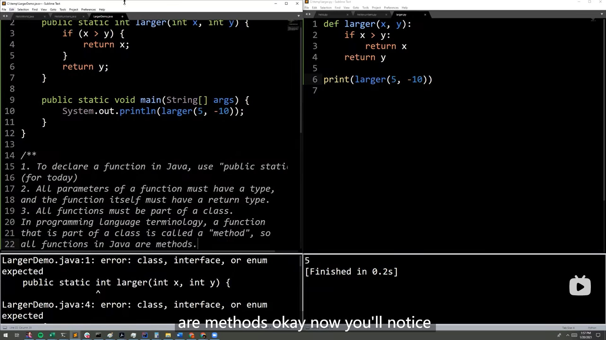
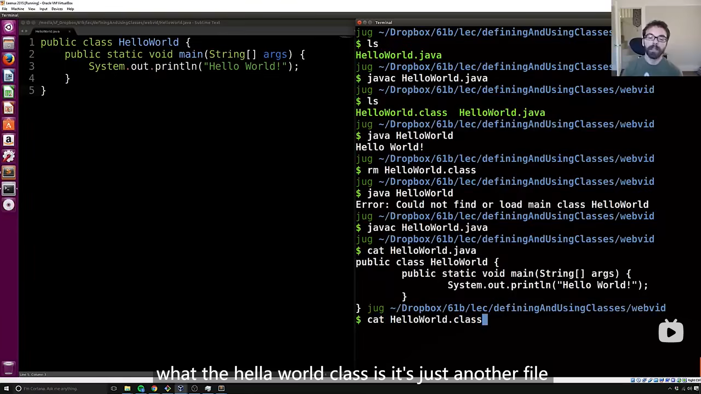
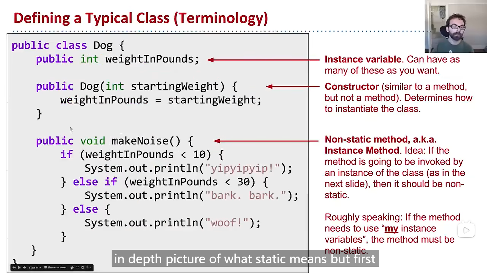
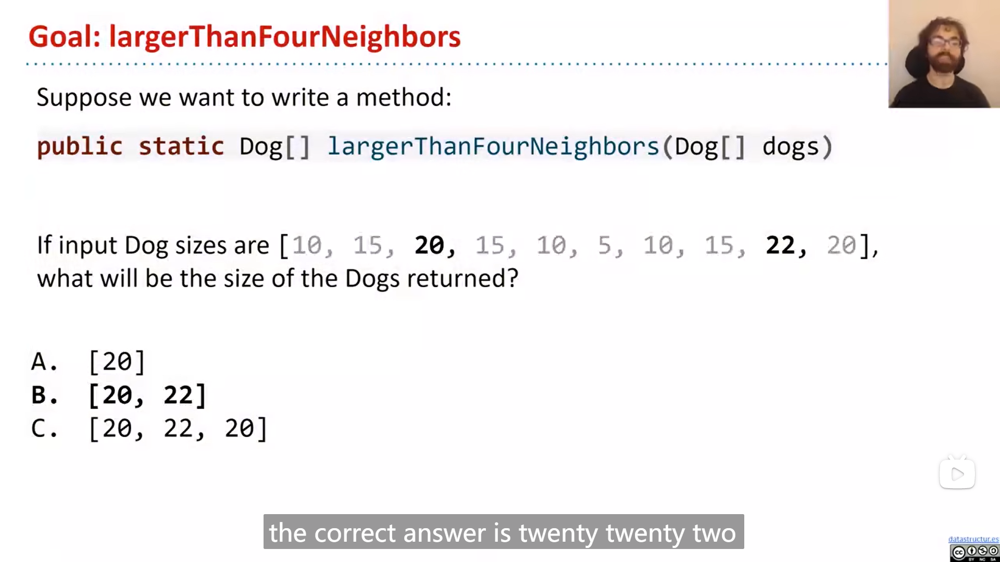
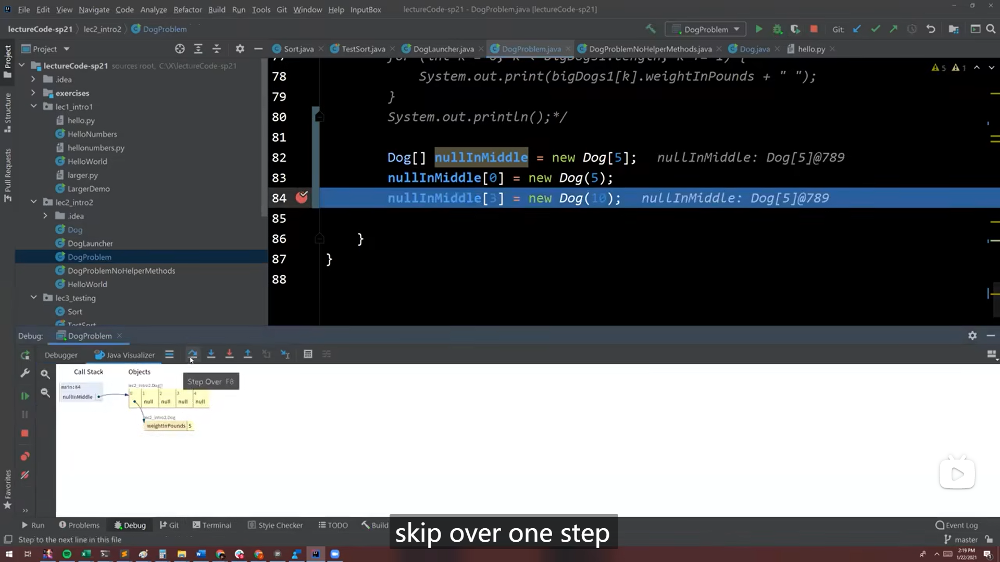
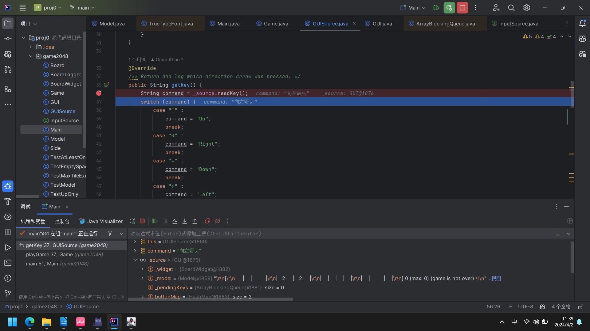
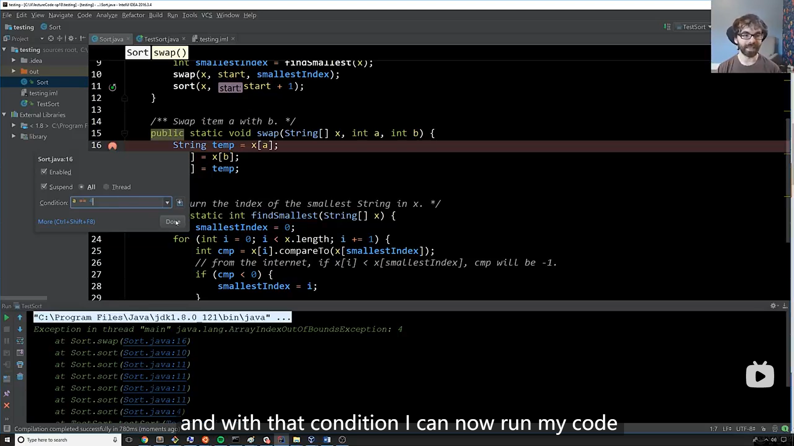
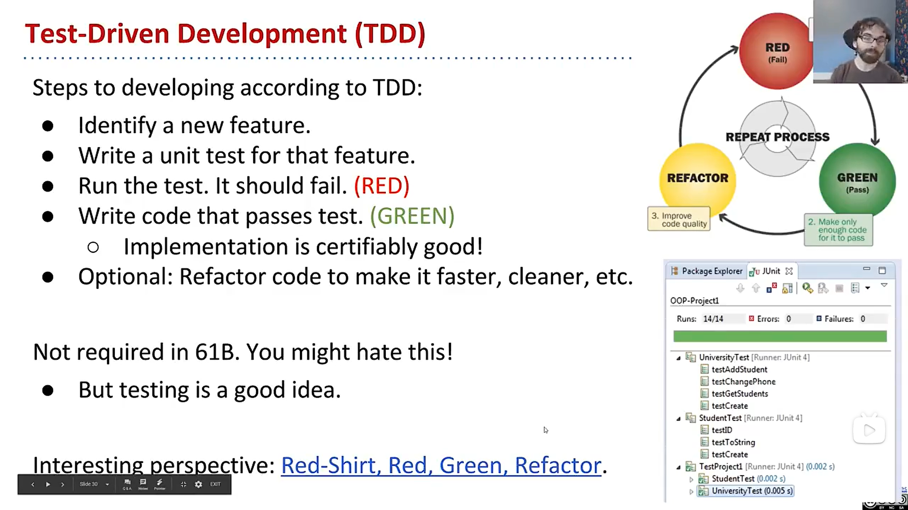

## Lecture 0 Intro, Hello World Java

### 1

{ loading=lazy }

java中所有函数都应该存在于类中，因此java中所有的函数都是*方法 method*

## HW 0

### 1

java中数组的使用方法

```java
int[] numbers = new int[3];
numbers[0] = 4;
numbers[1] = 7;
numbers[2] = 10;
System.out.println(numbers[1]);
```

或者

```java
int[] numbers = new int[]{4, 7, 10};
System.out.println(numbers[1]);
```

可以使用 `.length` 来获取数组的长度，例如

```java
int[] numbers = new int[]{4, 7, 10};
System.out.println(numbers.length);
```

### 2

>   In Java, the [`for` keyword](https://docs.oracle.com/javase/tutorial/java/nutsandbolts/for.html) has the syntax below:
>
>   ```java
>   for (initialization; termination; increment) {
>       statement(s)
>   }
>   ```
>
>   The initialization, termination, and increment must be semicolon separated. Each of these three can feature multiple comma-separated statements, e.g.
>
>   ```java
>   for (int i = 0, j = 10; i < j; i += 1) {
>       System.out.println(i + j);
>   }
>   ```
>
>   Comma separated `for` loops should be used sparingly.

java中 `for` 的使用方法(跟c中差不多)

### 3

Exercise 4

??? note "code"

    ```java
    public class BreakContinue {
        public static void windowPosSum(int[] a, int n) {
            /** your code here */ 
            for (int i = 0; i < a.length; i += 1) {
                if (a[i] < 0) {
                    continue;
                }
    
                int sum = 0;
                for (int j = 0; j <= n; j += 1) {
                    if (i + j >= a.length) {
                        break;
                    }
                    sum += a[i + j];
                }
    
                a[i] = sum;
            }
        }
    
        public static void main(String[] args) {
            int[] a = {1, 2, -3, 4, 5, 4};
            int n = 3;
            windowPosSum(a, n);
    
            // Should print 4, 8, -3, 13, 9, 4
            System.out.println(java.util.Arrays.toString(a));
        }
    }
    ```

### 4

`for` 循环语句的增强

java中 `for` 可以有相似于python中列表推导式的用法(把数组中的元素解压出来)

```java
public class EnhancedForBreakDemo {
    public static void main(String[] args) {
        String[] a = {"cat", "dog", "laser horse", "ketchup", "horse", "horbse"};

        for (String s : a) {
            for (int j = 0; j < 3; j += 1) {
                System.out.println(s);
                if (s.contains("horse")) {
                    break;
                }                
            }
        }
    }
}
```

>   注意到，java中，字符串String有 `contain` 方法，可以**判断是否包含某个子字符串**

## Lecture 2 Defining and Using Classes

### 1

{ loading=lazy }

Josh演示了在终端中运行java文件的方法，

需要先使用 `javac` 来编译java文件，然后会生成class文件，

再使用 `java` 文件来运行class文件(输入命令时可以忽略 `.class` 后缀)

>   `cat` 命令可以在终端中输出/显示文件的内容

---

Josh提到运行java程序的两步步骤

>   ```mermaid
>   flowchart LR
>   a(Hello.java) --> b[Compiler<br><code>javac</code>] --> c(Hello.class) --> d[Interpreter<br><code>java</code>] --> e([stuff<br>happens])
>   ```

但Josh也提到这不是唯一(运行java程序)的方法

### 2

Josh演示了调用其他java文件中的函数

=== "DogLauncher.java"

    ```java
    public class DogLauncher {
        public static void main(String[] args) {
            Dog.makeNoise();
        }
    }
    ```

=== "Dog.java"

    ```java
    public class Dog {
        public static void makeNoise() {
            System.out.println("Bark!");
        }
    }
    ```

然后发现，同一目录下的java文件之间可以(像Josh演示的一样)直接相互调用函数(而不需要 `import` ，不同目录下不能这样直接调用)

### 3

直接通过 `类名.方法` 的方法只能调用 `static` 属性的函数(感觉有点类似于python中的类属性和实例属性的区别)，没有 `static` 的函数只能通过实例去调用

>   ```java
>   public class Dog {
>       public int weightInPounds;
>   
>       public void makeNoise() {
>           if (weightInPounds < 10) {
>               System.out.println("yip!");
>           } else if (weightInPounds < 30) {
>               System.out.println("bark.");
>           } else {
>               System.out.println("woooof!");
>           }
>       }
>   }
>   ```
>
>   如果直接使用类名去调用，
>
>   ```java
>   public class DogLauncher {
>       public static void main(String[] args) {
>           Dog.makeNoise();
>       }
>   }
>   ```
>
>   会有如下报错
>
>   ```java
>   DogLauncher.java:3 error: non-static method makeNoise() cannot be referenced from a static context:
>           Dog.makeNoise();
>   1 error
>   ```
>
>   如果修改成
>
>   ```java
>   public class DogLauncher {
>       public static void main(String[] args) {
>           Dog d = new Dog();
>           d.weightInPounds = 20;
>           d.makeNoise();
>       }
>   }
>   ```
>
>   就能正常编译

### 4

定义一个类的大概代码结构

{ loading=lazy }

### 5

在使用自定义的类来创建数组时，数组在创建时并**不会创建**类的对象，即

```java
Dog[] dogs = new Dog[2];
```

只会创建一个数组，并不会创建两个Dog实例

### 6

`static` 的函数不能调用实例的变量

### 7

在不是 `static` 的函数中，可以使用 `this` 来获得自身这个实例(与c中的 `this` 略有不同，c中 `this` 是指针，java中 `this` 不是指针)

### 8

Josh建议，对于类中的 `static` 的属性，使用类名去获取这个属性，而不要使用实例去获取这个属性

### 9

`static` 的函数中如果想要访问 非 `static` 的属性(即实例属性)，需要传入实例并通过实例来访问

### 10

Josh在课上提到了一个网站，和cs61a中的python tutor类似的网站，但是是java语言

[Java Visualizer (uwaterloo.ca)](https://cscircles.cemc.uwaterloo.ca/java_visualize/)

### 11

Josh提到，使用helper函数来把大问题分解成小问题，

并且这样做有几点好处

-   more narratively clear
-   easier to get right when you write it
-   easier to debug

---

然后Josh通过一个具体例子演示，

{ loading=lazy }

Josh展示如果代码写在一个函数中，大概是这样

```java
public static Dog[] largerThanFourNeighbors(Dog[] dogs) {
    for (int i = 0; i < dogs.length; i += 1) {
        boolean largest = true;

        for (int j = -2; j <= 2; j += 1) {
            if (i + j < 0) {
                continue;
            }
            if (i + j >= dogs.length) {
                break;
            }
            if (j == 0) {
                continue;
            }

            Dog neighbor = dogs[i + j];
            if (neighbor.weightInPounds > dogs[i].weightInPounds) {
                largest = false;
            }
        }
        ...
    }
}
```

而分成不同的函数去编写，就会看起来结构更加清晰，debug也会更方便

```java
public static Dog[] largerThanFourNeighbors(Dog[] dogs) {
    Dog[] returnDogs = new Dog[dogs.length];
    int cnt = 0;

    for (int i = 0; i < dogs.length; i += 1) {
        if (isBiggestOfFour(dogs, i)) {
            returnDogs[cnt] = dogs[i];
            cnt = cnt + 1;
        }
    }

    returnDogs = arrayWithNoNulls(returnDogs, cnt);
    return returnDogs;
}

/** cnt is the number of non-null items */
public static Dog[] arrayWithNoNulls(Dog[] dogs, int cnt) {
    Dog[] noNullDogs = new Dog[cnt];
    for (int i = 0; i < cnt; i += 1) {
        noNullDogs[i] = dogs[i];
    }
    return noNullDogs;
}

/** Return true if dogs[i] is larger than its four neighbors */
public static boolean isBiggestOfFour(Dog[] dogs, int i) {
    boolean isBiggest = true;
    for (int j = -2; j <= 2; j += 1) {
        int compareIndex = i + j;

        /* avoid comparing ourself to ourself */
        if (j == 0) {
            continue;
        }

        if (validIndex(dogs, i + j)) {
            if (dogs[compareIndex].weightInPounds > dogs[i].weightInPounds) {
                isBiggest = false;
            }
        }
    }
    return isBiggest;
}

public static boolean validIndex(Dog[] dogs, int i) {
    if (i < 0) {
        return false;
    }
    if (i >= dogs.length) {
        return false;
    }
    return true;
}
```

>   ```java
>   public static void main(String[] args) {
>       Dog[] dogs = new Dog[] {
>           new Dog(10),
>           new Dog(15),
>           new Dog(20),
>           new Dog(15),
>           new Dog(10),
>           new Dog(5),
>           new Dog(10),
>           new Dog(15),
>           new Dog(22),
>           new Dog(15),
>           new Dog(20),
>       };
>       Dog[] bigDogs = largerThanFourNeighbors(dogs);
>   
>       for (int k = 0; k < bigDogs.length; k += 1) {
>           System.out.print(bigDogs[k].weightInPounds + " ");
>       }
>       System.out.println();
>   }
>   ```

## Lecture 2 Q&A

### 1

{ loading=lazy }

Josh在演示时，发现他的IDEA中装有[Java Visualizer](https://plugins.jetbrains.com/plugin/11512-java-visualizer)的插件，能直接在IDEA中在调试时看到可视化的*环境图 environment diagram*，

感觉挺有用，于是也安装了这个插件

---

Josh调试时还用了一下*step over 步过*的操作，之前不太清楚 *步过 step over* 、 *步入 step into* 、 *步出 step out* 的具体含义，于是就去查了一下，

[【pycharm调试】Pycharm 断点跳转及 Step Over/Step Into/Step Out 等的使用_pycharm中的step over和-CSDN博客](https://xhfei.blog.csdn.net/article/details/106206166)

从这篇文章上了解到，

-   *步过 step over* 是如果这一行有调用其他函数，那么会执行完调用的函数，然后走到下一行代码

-   *步入 step into* 是如果这一行有调用其他函数，那么就会走到被调用函数的第一行代码

    >   如果这一行没有调用其他函数，那么*步过step over*和*步入 step into*效果就是一样的(都是走到下一行代码)
    
-   *步出 step out* 是结合*步入 step into*来使用的，*步出 step out*会执行完当前整个函数，然后回到前一个函数调用这个函数的位置

## Project 0

### 1

由于在课程网站上没有找到能下载提供的初始代码的地方(课程网站上提供的方法是课程的学生从github上 `git pull` 自己对应学号的仓库)，

于是[在github上搜索 `cs61b sp21`](https://github.com/search?q=cs61b+sp21&type=repositories) 来搜索别人完成的作业仓库，看看能不能找到原始的代码，

然后点击最查看多star的仓库

[exuanbo/cs61b-sp21: CS 61B, Spring 2021 (github.com)](https://github.com/exuanbo/cs61b-sp21)

发现在 `README.md` 中有写着cs61b sp21的官方原始代码仓库

[Berkeley-CS61B/skeleton-sp21: starter code for spring 21 (github.com)](https://github.com/Berkeley-CS61B/skeleton-sp21)

于是就顺便发现了cs61b的[官方github账号](https://github.com/Berkeley-CS61B)

>   <h2>Public Access Resources</h2>
>
>   Previous course staff have made some iterations of this course available for auditors -- both Berkeley students and members of the public. While the assignment skeletons and specifications will be available for most years, some assignments have autograders that are not public. The most recent version with a public autograder is [Spring 2021](https://sp21.datastructur.es/about.html#auditing-cs61b).
>
>   Here's lints to the relevant materials:
>
>   -   [SP21 Course Website](https://sp21.datastructur.es/)
>   -   [Skeleton code](https://github.com/Berkeley-CS61B/skeleton-sp21)
>   -   [Java Libraries](https://github.com/Berkeley-CS61B/library-sp21)
>   -   [Lecture Code](https://github.com/Berkeley-CS61B/lectureCode-sp21)
>
>   <h2>Tooling</h2>
>
>   61B uses some tools to run its course. These are the open-source ones that we maintain for ourselves and actively use.
>
>   -   [IntelliJ Plugin](https://github.com/Berkeley-CS61B/intellij-plugin) - A style checker
>   -   [Java Visualizer](https://github.com/elipsitz/java-visualizer-intellij-plugin) - An IntelliJ plugin to visualize the data layout in Java applications. Externally maintained.
>   -   [jh61b](https://github.com/Berkeley-CS61B/jh61b) - A JUnit executor to output test results in [Gradescope's format](https://gradescope-autograders.readthedocs.io/en/latest/specs/#output-format)
>   -   [BSAG](https://github.com/Berkeley-CS61B/BSAG) - A Better SimpleAutograder for custom Gradescope logic
>       -   [bsag-jh61b](https://github.com/Berkeley-CS61B/bsag-jh61b) - BSAG steps for jh61b components

### 2

说明中提到，框架代码使用了一种叫做 *模型-视图-控制器模式 Model-View-Controller Pattern (MVC)* 的模式

>   The MVC pattern divides our problem into three parts:
>
>   -   The **model** represents the subject matter being represented and acted upon – in this case incorporating the state of a board game and the rules by which it may be modified. Our model resides in the `Model` , `Side` , `Board` , and `Tile` classes. The instance variables of `Model` fully determine what the state of the game is. Note: You’ll only be modifying the `Model` class.
>   -   A **view** of the model, which displays the game state to the user. Our view resides in the `GUI` and `BoardWidget` classes.
>   -   A **controller** for the game, which translates user actions into operations on the model. Our controller resides mainly in the `Game` class, although it also uses the GUI class to read keystrokes.

### 3

java中判断是否为 `null` 可以使用 `==`

### 4

在尝试完成 `tilt` 函数的过程中，一共进行了3次尝试，

前两次尝试大致思路都是，每一列只遍历一次，然后标记空的位置和上一个*瓷砖 tile*(第2次尝试与第1次的区别在于，将处理每一列写成了一个函数)，

但是两次都是只能通过 `TestUpOnly` 而不能通过 `TestModel` 。

第3次尝试打算放弃这个思路，而是将每一小步都写成一个函数，并且**由于留意到题目说明中提到 `board.move` 方法如果合并了*瓷砖*会返回 `true`** 于是打算利用这一点，最后写完并debug完后，没想到不仅通过了 `TestUpOnly` 也通过了 `TestModel` (😮很震惊，不知道为什么)

??? note "code"

    ```java
    public boolean tilt(Side side) {
        ...
    
        board.setViewingPerspective(side);
        for (int i = 0; i < board.size(); i++) {
            if (processCol(i)) {
                changed = true;
            }
        }
        board.setViewingPerspective(Side.NORTH);
    
        ...
    }
    
    public boolean processCol(int col) {
        boolean changed = false;
        int size = board.size();
    
        boolean[] isMerged = new boolean[size];
        for (int i = 0; i < size; i++) {
            int row = size - i - 1;
            isMerged[row] = false;
    
            if (needMove(col, row)) {
                int target = findTarget(col, row, isMerged);
                boolean doMerge = board.move(col, target, board.tile(col, row));
    
                if (doMerge) {
                    isMerged[target] = true;
                    score += board.tile(col, target).value();
                }
    
                changed = true;
            }
        }
        return changed;
    }
    
    public boolean needMove(int col, int row) {
        Tile tile = board.tile(col, row);
        if (tile == null) {
            return false;
        } else if (row == board.size() - 1) {
            return false;
        } else {
            Tile upTile = board.tile(col, row + 1);
            return upTile == null || upTile.value() == tile.value();
        }
    }
    
    public int findTarget(int col, int row, boolean[] isMerge) {
        int target = findEmptyTarget(col, row);
    
        if (target + 1 < board.size() && !isMerge[target + 1]
                && board.tile(col, row).value() == board.tile(col, target + 1).value()) {
            target += 1;
        }
        return target;
    }
    
    public int findEmptyTarget(int col, int row) {
        int target = row;
        for (int i = row + 1; i < board.size(); i++) {
            if (board.tile(col, i) != null) {
                break;
            }
            target = i;
        }
        return target;
    }
    ```

### 5

不知道是什么原因，在我的电脑上运行后按方向键没有反应，

于是启动调式模式查看问题，发现在 `Game.java:37` 中

```java
String cmnd = _source.getKey();
```

按压左键后的 `cmnd` 是 `"向左箭头"` ，于是继续追踪函数，发现源头在 `GUISource.java:36` 处，

{ loading=lazy }

所以就在 `switch` 中新加了几个 `case`

```java
switch (command) {
    ...
    case "向上箭头" :
        command = "Up";
        break;
    case "向右箭头" :
        command = "Right";
        break;
    case "向下箭头" :
        command = "Down";
        break;
    case "向左箭头" :
        command = "Left";
        break;
    default :
        break;
}
```

然后就能正常运行并玩游戏了😄

## Lecture 3 Testing

### 1

java中判断两个数组中的元素是否相等，可以使用

```java
java.util.Arrays.equals(a, b);
```

---

java中有用于测试的工具junit，

例如测试数组是否和预期值一样，并且如果不一样可以显示出错的元素

```java
String[] input = {"i", "have", "an", "egg"};
String[] expected = {"an", "egg", "have", "i"};

org.junit.Assert.assertArrayEquals(expected, input);
```

### 2

java中字符串不能直接比较大小，可以使用 `str1.compareTo(str2)` 的方法(使用字符串的 `compareTo` 方法)比较，

-   如果小于传入的字符串，会返回 `-1`
-   相等返回 `0`
-   大于返回 `1`

### 3

{ loading=lazy }

在Josh的演示中发现，idea(可能其他jetbrains的ide也差不多)中的断点右键**可以添加条件**

### 4

编写的测试的函数，可以在non-static函数声明上添加*装饰符* `@org.junit.Test` ，然后就可以不用在 `main` 中调用这个函数，可以直接运行文件就可以进行测试，例如

```java
@org.junit.Test
public void testSort() {
    String[] input = {"i", "have", "an", "egg"};
    String[] expected  = {"an", "egg", "have", "i"};
    
    Sort.sort(input);
    
    org.junit.Assert.assertArrayEquals(expected, input);
}
```

---

为了方便，还可以

```java
import org.junit.Test;
```

然后就可以直接 `@Test` 既可以了

---

为了方便，还可以导入 `Assert`

```java
import org.junit.Assert.*;
```

### 5

Josh提到了一个概念，*测试驱动开发 Test-Driven Development (TDD)*，

{ loading=lazy }

大概意思是，如果要实现一个功能，先确定特征，再根据这个特征编写测试例子，一开始运行无法通过测试，所以编写代码以通过测试，然后再改进代码，循环往复

## Lecture 3 Q&A

### 1

有人提问python中的 `is` 和 `==` 分别对应java中的什么，

Josh说，java中 `==` 类似于python中的 `is` (会检查对象的地址)，而java中类的 `.equals()` 方法类似于python中的 `==` (python中自定义类需要实现 `__eq__` 方法)

---

在java中，如果没有重写 `equals` 方法，那么默认的 `equals` 方法是检查地址

### 2

有人提问，Josh演示

```java
System.out.println(5 + 6 + "hi" + 5 + 6);
```

最后显示出来是 `11hi56` ，

于是发现java是从左往右进行运算，一开始 `5 + 6` 得到 `11` ，然后 `+ "hi"` 得到 `"11hi"` ，因此最后就会得到 `"11hi56"`

## Lecture 4 References, Recursion, and Lists

### 1

如果自定义对象实例赋值给一个新的变量，并使用新的变量来修改属性，那么修改的是原实例本身的属性，例如

```java
Walrus a = new Walrus(1000, 8.3);
Walrus b;
b = a;
b.weight = 5;
System.out.println(a);
System.out.println(b);
```

```txt
weight: 5, tusk size: 8.30
weight: 5, tusk size: 8.30
```

## Lecture 4 Q&A

### 1

java中的String字符串(创建后)不能被修改

### 2

java中可以使用三目运算符(和c中一样)

## Lab 2

### 1

在Lab 2 Setup的One-Time Setup中，需要在IDEA的主界面(没有打开项目的界面)中打开设置，

windows中可以使用 ++ctrl+alt+s++ 打开设置界面，也可以在 `自定义 > 所有设置...` 中打开设置界面

### 2

一开始我使用的jdk是之前安装的azul zulu的jdk，但是lab 2 setup一直无法配置好maven，

于是就去装了oracel的openjdk 17，最后就可以运行了

### 3

>   This is because JUnit tests are short-circuiting – as soon as one of the asserts in a method fails, it will output the failure and move on to the next test.

如果测试的函数(添加了 `@Test` 的函数)中，有一个 `assert` 错了，那么就会直接报错，然后进行下一个要测试的函数

### 4

从 `IntList.java` 的 `of` 函数中发现，java中在声明函数时，可以使用 `...` 来以数组的形式获取传入的多个参数(类似于python中的 `*args` )，例如

```java
public static int max(int ...argList) {
    int result = 0;
    for (int i = 0; i < argList.length; i++) {
        if (argList[i] > result) {
            result = argList[i];
        }
    }
    return result;
}
```

## Lecture 5 SLLists, Nested Classes, Sentinel Nodes

### 1

Josh说，如果嵌套的类，里面的类如果不需要访问外面类的属性，那么可以加上 `static` 关键字，好处是可以节省一些空间，例如

```java
public class SLList {
    private static class IntNode {
        public int item;
        public IntNode next;
        public IntNode(int i, IntNode n) {
            item = i;
            next = n;
        }
        ...
    }
}
```

个人理解是，如果是non-static，那么每次实例化外面的类时，都会给实例添加这个属性，如果是static，那么就不会这样

### 2

Josh提到，java代码中一个 `public` 的函数配一个 `private` 的同名helper函数很常见

### 3

如果需要创建空链表，可以给链表添加 *哨兵结点 sentinel node* (即空的头节点)，就可以在实现链表的其他功能时，避免处理空链表的特殊情况

