# CS61B

cs61b可用的gradescope课程邀请码是 ==MB7ZPY==，截止到24年底

>   参考
>
>   [cs61b Lab0/1 setup - 知乎 (zhihu.com)](https://zhuanlan.zhihu.com/p/648609037)

## Lecture 0 Intro, Hello World Java

### 1

{ loading=lazy }

java中所有函数都应该存在于类中，因此java中所有的函数都是*方法 method*

## HW 0

### 1

java中数组的使用方法

```java
int[] numbers = new int[3];
numbers[0] = 4;
numbers[1] = 7;
numbers[2] = 10;
System.out.println(numbers[1]);
```

或者

```java
int[] numbers = new int[]{4, 7, 10};
System.out.println(numbers[1]);
```

可以使用 `.length` 来获取数组的长度，例如

```java
int[] numbers = new int[]{4, 7, 10};
System.out.println(numbers.length);
```

### 2

>   In Java, the [`for` keyword](https://docs.oracle.com/javase/tutorial/java/nutsandbolts/for.html) has the syntax below:
>
>   ```java
>   for (initialization; termination; increment) {
>       statement(s)
>   }
>   ```
>
>   The initialization, termination, and increment must be semicolon separated. Each of these three can feature multiple comma-separated statements, e.g.
>
>   ```java
>   for (int i = 0, j = 10; i < j; i += 1) {
>       System.out.println(i + j);
>   }
>   ```
>
>   Comma separated `for` loops should be used sparingly.

java中 `for` 的使用方法(跟c中差不多)

### 3

Exercise 4

??? note "code"

    ```java
    public class BreakContinue {
        public static void windowPosSum(int[] a, int n) {
            /** your code here */ 
            for (int i = 0; i < a.length; i += 1) {
                if (a[i] < 0) {
                    continue;
                }
    
                int sum = 0;
                for (int j = 0; j <= n; j += 1) {
                    if (i + j >= a.length) {
                        break;
                    }
                    sum += a[i + j];
                }
    
                a[i] = sum;
            }
        }
    
        public static void main(String[] args) {
            int[] a = {1, 2, -3, 4, 5, 4};
            int n = 3;
            windowPosSum(a, n);
    
            // Should print 4, 8, -3, 13, 9, 4
            System.out.println(java.util.Arrays.toString(a));
        }
    }
    ```

### 4

`for` 循环语句的增强

java中 `for` 可以有相似于python中列表推导式的用法(把数组中的元素解压出来)

```java
public class EnhancedForBreakDemo {
    public static void main(String[] args) {
        String[] a = {"cat", "dog", "laser horse", "ketchup", "horse", "horbse"};

        for (String s : a) {
            for (int j = 0; j < 3; j += 1) {
                System.out.println(s);
                if (s.contains("horse")) {
                    break;
                }                
            }
        }
    }
}
```

>   注意到，java中，字符串String有 `contain` 方法，可以**判断是否包含某个子字符串**

## Lecture 2 Defining and Using Classes

### 1

{ loading=lazy }

Josh演示了在终端中运行java文件的方法，

需要先使用 `javac` 来编译java文件，然后会生成class文件，

再使用 `java` 文件来运行class文件(输入命令时可以忽略 `.class` 后缀)

>   `cat` 命令可以在终端中输出/显示文件的内容

---

Josh提到运行java程序的两步步骤

>   ```mermaid
>   flowchart LR
>   a(Hello.java) --> b[Compiler<br><code>javac</code>] --> c(Hello.class) --> d[Interpreter<br><code>java</code>] --> e([stuff<br>happens])
>   ```

但Josh也提到这不是唯一(运行java程序)的方法

### 2

Josh演示了调用其他java文件中的函数

=== "DogLauncher.java"

    ```java
    public class DogLauncher {
        public static void main(String[] args) {
            Dog.makeNoise();
        }
    }
    ```

=== "Dog.java"

    ```java
    public class Dog {
        public static void makeNoise() {
            System.out.println("Bark!");
        }
    }
    ```

然后发现，同一目录下的java文件之间可以(像Josh演示的一样)直接相互调用函数(而不需要 `import` ，不同目录下不能这样直接调用)

### 3

直接通过 `类名.方法` 的方法只能调用 `static` 属性的函数(感觉有点类似于python中的类属性和实例属性的区别)，没有 `static` 的函数只能通过实例去调用

>   ```java
>   public class Dog {
>       public int weightInPounds;
>   
>       public void makeNoise() {
>           if (weightInPounds < 10) {
>               System.out.println("yip!");
>           } else if (weightInPounds < 30) {
>               System.out.println("bark.");
>           } else {
>               System.out.println("woooof!");
>           }
>       }
>   }
>   ```
>
>   如果直接使用类名去调用，
>
>   ```java
>   public class DogLauncher {
>       public static void main(String[] args) {
>           Dog.makeNoise();
>       }
>   }
>   ```
>
>   会有如下报错
>
>   ```java
>   DogLauncher.java:3 error: non-static method makeNoise() cannot be referenced from a static context:
>           Dog.makeNoise();
>   1 error
>   ```
>
>   如果修改成
>
>   ```java
>   public class DogLauncher {
>       public static void main(String[] args) {
>           Dog d = new Dog();
>           d.weightInPounds = 20;
>           d.makeNoise();
>       }
>   }
>   ```
>
>   就能正常编译

### 4

定义一个类的大概代码结构

{ loading=lazy }

### 5

在使用自定义的类来创建数组时，数组在创建时并**不会创建**类的对象，即

```java
Dog[] dogs = new Dog[2];
```

只会创建一个数组，并不会创建两个Dog实例

### 6

`static` 的函数不能调用实例的变量

### 7

在不是 `static` 的函数中，可以使用 `this` 来获得自身这个实例(与c中的 `this` 略有不同，c中 `this` 是指针，java中 `this` 不是指针)

### 8

Josh建议，对于类中的 `static` 的属性，使用类名去获取这个属性，而不要使用实例去获取这个属性

### 9

`static` 的函数中如果想要访问 非 `static` 的属性(即实例属性)，需要传入实例并通过实例来访问

### 10

Josh在课上提到了一个网站，和cs61a中的python tutor类似的网站，但是是java语言

[Java Visualizer (uwaterloo.ca)](https://cscircles.cemc.uwaterloo.ca/java_visualize/)

### 11

Josh提到，使用helper函数来把大问题分解成小问题，

并且这样做有几点好处

-   more narratively clear
-   easier to get right when you write it
-   easier to debug

---

然后Josh通过一个具体例子演示，

{ loading=lazy }

Josh展示如果代码写在一个函数中，大概是这样

```java
public static Dog[] largerThanFourNeighbors(Dog[] dogs) {
    for (int i = 0; i < dogs.length; i += 1) {
        boolean largest = true;

        for (int j = -2; j <= 2; j += 1) {
            if (i + j < 0) {
                continue;
            }
            if (i + j >= dogs.length) {
                break;
            }
            if (j == 0) {
                continue;
            }

            Dog neighbor = dogs[i + j];
            if (neighbor.weightInPounds > dogs[i].weightInPounds) {
                largest = false;
            }
        }
        ...
    }
}
```

而分成不同的函数去编写，就会看起来结构更加清晰，debug也会更方便

```java
public static Dog[] largerThanFourNeighbors(Dog[] dogs) {
    Dog[] returnDogs = new Dog[dogs.length];
    int cnt = 0;

    for (int i = 0; i < dogs.length; i += 1) {
        if (isBiggestOfFour(dogs, i)) {
            returnDogs[cnt] = dogs[i];
            cnt = cnt + 1;
        }
    }

    returnDogs = arrayWithNoNulls(returnDogs, cnt);
    return returnDogs;
}

/** cnt is the number of non-null items */
public static Dog[] arrayWithNoNulls(Dog[] dogs, int cnt) {
    Dog[] noNullDogs = new Dog[cnt];
    for (int i = 0; i < cnt; i += 1) {
        noNullDogs[i] = dogs[i];
    }
    return noNullDogs;
}

/** Return true if dogs[i] is larger than its four neighbors */
public static boolean isBiggestOfFour(Dog[] dogs, int i) {
    boolean isBiggest = true;
    for (int j = -2; j <= 2; j += 1) {
        int compareIndex = i + j;

        /* avoid comparing ourself to ourself */
        if (j == 0) {
            continue;
        }

        if (validIndex(dogs, i + j)) {
            if (dogs[compareIndex].weightInPounds > dogs[i].weightInPounds) {
                isBiggest = false;
            }
        }
    }
    return isBiggest;
}

public static boolean validIndex(Dog[] dogs, int i) {
    if (i < 0) {
        return false;
    }
    if (i >= dogs.length) {
        return false;
    }
    return true;
}
```

>   ```java
>   public static void main(String[] args) {
>       Dog[] dogs = new Dog[] {
>           new Dog(10),
>           new Dog(15),
>           new Dog(20),
>           new Dog(15),
>           new Dog(10),
>           new Dog(5),
>           new Dog(10),
>           new Dog(15),
>           new Dog(22),
>           new Dog(15),
>           new Dog(20),
>       };
>       Dog[] bigDogs = largerThanFourNeighbors(dogs);
>   
>       for (int k = 0; k < bigDogs.length; k += 1) {
>           System.out.print(bigDogs[k].weightInPounds + " ");
>       }
>       System.out.println();
>   }
>   ```

## Lecture 2 Q&A

### 1

{ loading=lazy }

Josh在演示时，发现他的IDEA中装有[Java Visualizer](https://plugins.jetbrains.com/plugin/11512-java-visualizer)的插件，能直接在IDEA中在调试时看到可视化的*环境图 environment diagram*，

感觉挺有用，于是也安装了这个插件

---

Josh调试时还用了一下*step over 步过*的操作，之前不太清楚 *步过 step over* 、 *步入 step into* 、 *步出 step out* 的具体含义，于是就去查了一下，

[【pycharm调试】Pycharm 断点跳转及 Step Over/Step Into/Step Out 等的使用_pycharm中的step over和-CSDN博客](https://xhfei.blog.csdn.net/article/details/106206166)

从这篇文章上了解到，

-   *步过 step over* 是如果这一行有调用其他函数，那么会执行完调用的函数，然后走到下一行代码

-   *步入 step into* 是如果这一行有调用其他函数，那么就会走到被调用函数的第一行代码

    >   如果这一行没有调用其他函数，那么*步过step over*和*步入 step into*效果就是一样的(都是走到下一行代码)
    
-   *步出 step out* 是结合*步入 step into*来使用的，*步出 step out*会执行完当前整个函数，然后回到前一个函数调用这个函数的位置

## Project 0

### 1

由于在课程网站上没有找到能下载提供的初始代码的地方(课程网站上提供的方法是课程的学生从github上 `git pull` 自己对应学号的仓库)，

于是[在github上搜索 `cs61b sp21`](https://github.com/search?q=cs61b+sp21&type=repositories) 来搜索别人完成的作业仓库，看看能不能找到原始的代码，

然后点击最查看多star的仓库

[exuanbo/cs61b-sp21: CS 61B, Spring 2021 (github.com)](https://github.com/exuanbo/cs61b-sp21)

发现在 `README.md` 中有写着cs61b sp21的官方原始代码仓库

[Berkeley-CS61B/skeleton-sp21: starter code for spring 21 (github.com)](https://github.com/Berkeley-CS61B/skeleton-sp21)

于是就顺便发现了cs61b的[官方github账号](https://github.com/Berkeley-CS61B)

>   <h2>Public Access Resources</h2>
>
>   Previous course staff have made some iterations of this course available for auditors -- both Berkeley students and members of the public. While the assignment skeletons and specifications will be available for most years, some assignments have autograders that are not public. The most recent version with a public autograder is [Spring 2021](https://sp21.datastructur.es/about.html#auditing-cs61b).
>
>   Here's lints to the relevant materials:
>
>   -   [SP21 Course Website](https://sp21.datastructur.es/)
>   -   [Skeleton code](https://github.com/Berkeley-CS61B/skeleton-sp21)
>   -   [Java Libraries](https://github.com/Berkeley-CS61B/library-sp21)
>   -   [Lecture Code](https://github.com/Berkeley-CS61B/lectureCode-sp21)
>
>   <h2>Tooling</h2>
>
>   61B uses some tools to run its course. These are the open-source ones that we maintain for ourselves and actively use.
>
>   -   [IntelliJ Plugin](https://github.com/Berkeley-CS61B/intellij-plugin) - A style checker
>   -   [Java Visualizer](https://github.com/elipsitz/java-visualizer-intellij-plugin) - An IntelliJ plugin to visualize the data layout in Java applications. Externally maintained.
>   -   [jh61b](https://github.com/Berkeley-CS61B/jh61b) - A JUnit executor to output test results in [Gradescope's format](https://gradescope-autograders.readthedocs.io/en/latest/specs/#output-format)
>   -   [BSAG](https://github.com/Berkeley-CS61B/BSAG) - A Better SimpleAutograder for custom Gradescope logic
>       -   [bsag-jh61b](https://github.com/Berkeley-CS61B/bsag-jh61b) - BSAG steps for jh61b components

### 2

说明中提到，框架代码使用了一种叫做 *模型-视图-控制器模式 Model-View-Controller Pattern (MVC)* 的模式

>   The MVC pattern divides our problem into three parts:
>
>   -   The **model** represents the subject matter being represented and acted upon – in this case incorporating the state of a board game and the rules by which it may be modified. Our model resides in the `Model` , `Side` , `Board` , and `Tile` classes. The instance variables of `Model` fully determine what the state of the game is. Note: You’ll only be modifying the `Model` class.
>   -   A **view** of the model, which displays the game state to the user. Our view resides in the `GUI` and `BoardWidget` classes.
>   -   A **controller** for the game, which translates user actions into operations on the model. Our controller resides mainly in the `Game` class, although it also uses the GUI class to read keystrokes.

### 3

java中判断是否为 `null` 可以使用 `==`

### 4

在尝试完成 `tilt` 函数的过程中，一共进行了3次尝试，

前两次尝试大致思路都是，每一列只遍历一次，然后标记空的位置和上一个*瓷砖 tile*(第2次尝试与第1次的区别在于，将处理每一列写成了一个函数)，

但是两次都是只能通过 `TestUpOnly` 而不能通过 `TestModel` 。

第3次尝试打算放弃这个思路，而是将每一小步都写成一个函数，并且**由于留意到题目说明中提到 `board.move` 方法如果合并了*瓷砖*会返回 `true`** 于是打算利用这一点，最后写完并debug完后，没想到不仅通过了 `TestUpOnly` 也通过了 `TestModel` (😮很震惊，不知道为什么)

??? note "code"

    ```java
    public boolean tilt(Side side) {
        ...
    
        board.setViewingPerspective(side);
        for (int i = 0; i < board.size(); i++) {
            if (processCol(i)) {
                changed = true;
            }
        }
        board.setViewingPerspective(Side.NORTH);
    
        ...
    }
    
    public boolean processCol(int col) {
        boolean changed = false;
        int size = board.size();
    
        boolean[] isMerged = new boolean[size];
        for (int i = 0; i < size; i++) {
            int row = size - i - 1;
            isMerged[row] = false;
    
            if (needMove(col, row)) {
                int target = findTarget(col, row, isMerged);
                boolean doMerge = board.move(col, target, board.tile(col, row));
    
                if (doMerge) {
                    isMerged[target] = true;
                    score += board.tile(col, target).value();
                }
    
                changed = true;
            }
        }
        return changed;
    }
    
    public boolean needMove(int col, int row) {
        Tile tile = board.tile(col, row);
        if (tile == null) {
            return false;
        } else if (row == board.size() - 1) {
            return false;
        } else {
            Tile upTile = board.tile(col, row + 1);
            return upTile == null || upTile.value() == tile.value();
        }
    }
    
    public int findTarget(int col, int row, boolean[] isMerge) {
        int target = findEmptyTarget(col, row);
    
        if (target + 1 < board.size() && !isMerge[target + 1]
                && board.tile(col, row).value() == board.tile(col, target + 1).value()) {
            target += 1;
        }
        return target;
    }
    
    public int findEmptyTarget(int col, int row) {
        int target = row;
        for (int i = row + 1; i < board.size(); i++) {
            if (board.tile(col, i) != null) {
                break;
            }
            target = i;
        }
        return target;
    }
    ```

### 5

不知道是什么原因，在我的电脑上运行后按方向键没有反应，

于是启动调式模式查看问题，发现在 `Game.java:37` 中

```java
String cmnd = _source.getKey();
```

按压左键后的 `cmnd` 是 `"向左箭头"` ，于是继续追踪函数，发现源头在 `GUISource.java:36` 处，

{ loading=lazy }

所以就在 `switch` 中新加了几个 `case`

```java
switch (command) {
    ...
    case "向上箭头" :
        command = "Up";
        break;
    case "向右箭头" :
        command = "Right";
        break;
    case "向下箭头" :
        command = "Down";
        break;
    case "向左箭头" :
        command = "Left";
        break;
    default :
        break;
}
```

然后就能正常运行并玩游戏了😄

## Lecture 3 Testing

### 1

java中判断两个数组中的元素是否相等，可以使用

```java
java.util.Arrays.equals(a, b);
```

---

java中有用于测试的工具junit，

例如测试数组是否和预期值一样，并且如果不一样可以显示出错的元素

```java
String[] input = {"i", "have", "an", "egg"};
String[] expected = {"an", "egg", "have", "i"};

org.junit.Assert.assertArrayEquals(expected, input);
```

### 2

java中字符串不能直接比较大小，可以使用 `str1.compareTo(str2)` 的方法(使用字符串的 `compareTo` 方法)比较，

-   如果小于传入的字符串，会返回 `-1`
-   相等返回 `0`
-   大于返回 `1`

### 3

{ loading=lazy }

在Josh的演示中发现，idea(可能其他jetbrains的ide也差不多)中的断点右键**可以添加条件**

### 4

编写的测试的函数，可以在non-static函数声明上添加*装饰符* `@org.junit.Test` ，然后就可以不用在 `main` 中调用这个函数，可以直接运行文件就可以进行测试，例如

```java
@org.junit.Test
public void testSort() {
    String[] input = {"i", "have", "an", "egg"};
    String[] expected  = {"an", "egg", "have", "i"};
    
    Sort.sort(input);
    
    org.junit.Assert.assertArrayEquals(expected, input);
}
```

---

为了方便，还可以

```java
import org.junit.Test;
```

然后就可以直接 `@Test` 既可以了

---

为了方便，还可以导入 `Assert`

```java
import org.junit.Assert.*;
```

### 5

Josh提到了一个概念，*测试驱动开发 Test-Driven Development (TDD)*，

{ loading=lazy }

大概意思是，如果要实现一个功能，先确定特征，再根据这个特征编写测试例子，一开始运行无法通过测试，所以编写代码以通过测试，然后再改进代码，循环往复

## Lecture 3 Q&A

### 1

有人提问python中的 `is` 和 `==` 分别对应java中的什么，

Josh说，java中 `==` 类似于python中的 `is` (会检查对象的地址)，而java中类的 `.equals()` 方法类似于python中的 `==` (python中自定义类需要实现 `__eq__` 方法)

---

在java中，如果没有重写 `equals` 方法，那么默认的 `equals` 方法是检查地址

### 2

有人提问，Josh演示

```java
System.out.println(5 + 6 + "hi" + 5 + 6);
```

最后显示出来是 `11hi56` ，

于是发现java是从左往右进行运算，一开始 `5 + 6` 得到 `11` ，然后 `+ "hi"` 得到 `"11hi"` ，因此最后就会得到 `"11hi56"`

## Lecture 4 References, Recursion, and Lists

### 1

如果自定义对象实例赋值给一个新的变量，并使用新的变量来修改属性，那么修改的是原实例本身的属性，例如

```java
Walrus a = new Walrus(1000, 8.3);
Walrus b;
b = a;
b.weight = 5;
System.out.println(a);
System.out.println(b);
```

```txt
weight: 5, tusk size: 8.30
weight: 5, tusk size: 8.30
```

## Lecture 4 Q&A

### 1

java中的String字符串(创建后)不能被修改

### 2

java中可以使用三目运算符(和c中一样)

## Lab 2

### 1

在Lab 2 Setup的One-Time Setup中，需要在IDEA的主界面(没有打开项目的界面)中打开设置，

windows中可以使用 ++ctrl+alt+s++ 打开设置界面，也可以在 `自定义 > 所有设置...` 中打开设置界面

**==需要注意的是==**，在**新版**的IDEA中，**要把『使用 .mvn/maven.config 中的设置』这个选项==去掉勾选==(默认是勾选上的)**，否则『本地仓库』设置的重写的更改**不会**应用到每个新的项目上

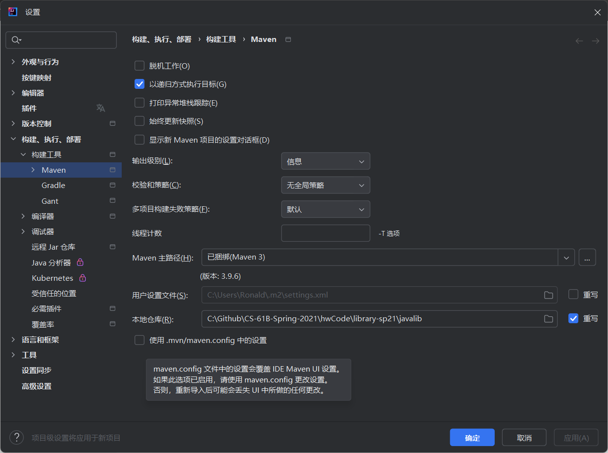{ loading=lazy }

### 2

一开始我使用的jdk是之前安装的azul zulu的jdk，但是lab 2 setup一直无法配置好maven，

于是就去装了oracel的openjdk 17，最后就可以运行了

### 3

>   This is because JUnit tests are short-circuiting – as soon as one of the asserts in a method fails, it will output the failure and move on to the next test.

如果测试的函数(添加了 `@Test` 的函数)中，有一个 `assert` 错了，那么就会直接报错，然后进行下一个要测试的函数

### 4

从 `IntList.java` 的 `of` 函数中发现，java中在声明函数时，可以使用 `...` 来以数组的形式获取传入的多个参数(类似于python中的 `*args` )，例如

```java
public static int max(int ...argList) {
    int result = 0;
    for (int i = 0; i < argList.length; i++) {
        if (argList[i] > result) {
            result = argList[i];
        }
    }
    return result;
}
```

### 5

最后发现 `DebugExercise2.java` 中的 `max` 需要修改(改成能正确返回最大值)，否则gradescope上的 `b001) DebugExercise: Hidden Test 1` 这个测试就通过不了

## Lecture 5 SLLists, Nested Classes, Sentinel Nodes

### 1

Josh说，如果嵌套的类，里面的类如果不需要访问外面类的属性，那么可以加上 `static` 关键字，好处是可以节省一些空间，例如

```java
public class SLList {
    private static class IntNode {
        public int item;
        public IntNode next;
        public IntNode(int i, IntNode n) {
            item = i;
            next = n;
        }
        ...
    }
}
```

个人理解是，如果是non-static，那么每次实例化外面的类时，都会给实例添加这个属性，如果是static，那么就不会这样

### 2

Josh提到，java代码中一个 `public` 的函数配一个 `private` 的同名helper函数很常见

### 3

如果需要创建空链表，可以给链表添加 *哨兵节点 sentinel node* (即空的头节点)，就可以在实现链表的其他功能时，避免处理空链表的特殊情况

## Lecture 5 Q&A

### 1

有人提问关于Josh课上说的，嵌套在内部定义的类，如果把类设置成了 `private` 的属性，那么类的成员设置成 `public` 还是 `private` 都差别不大，

Josh回答，因为类设置成 `private` 之后，里面的方法和属性(在外层的类之外)就都无法访问到了(应该是连构造方法也无法访问到)，所以成员的属性是 `public` 还是 `private` 都一样

## Lecture 6 DLLists, Arrays

### 1

介绍了*双向链表 doubly linked list (DLList)* (与之对应的是*单向链表 singly linked list (SLList)* )，为了避免*双向链表*的头和尾都指向同一个*哨兵节点*的情况，

>   { loading=lazy }

提到了两种解决方法，

-   设置两个*哨兵节点*

    { loading=lazy }

-   或者，设置成循环的双向链表

    { loading=lazy }

### 2

如果想要链表结构储存不同的数据类型(而不重复实现代码)，可以在定义类时，在类名后使用 `<...>` 添加自定义名称，之后在声明对应变量的数据类型时，都使用这个名称，例如

```java
public class SLList<LochNess> {
    private class StuffNode {
        public LochNess item;
        public StuffNode next;
        
        public StuffNode(LochNess i, StuffNode n) {
            item = i;
            next = n;
        }
    }
    
    private StuffNode first;
    private int size;
    
    public SLList(LochNess x) {
        first = new StuffNode(x, null);
        size = 1;
    }
    
    ...
}
```

使用这个类时，则需要在 `<>` 中添加数据类型

```java 
SLList<String> s1 = new SLList<String>("bone");
```

也可以将构造函数的 `String` 去除

```java
SLList<String> s1 = new SLList<>("bone");
```

### 3

java中创建数组的3种方法，

```java
y = new int[3];
```

```java
x = new int[] {1, 2, 3, 4, 5};
```

```java
int[] w = {9, 10, 11, 12, 13};
```

但需要注意第3种方法不能对**已经声明的变量**使用

### 4

`System.arraycopy` 的用法，

>   Takes 5 parameters:
>
>   -   Source array
>   -   Start position in source
>   -   Target array
>   -   Start position in target
>   -   Number to copy

以 `System.arraycopy(b, 0, x, 3, 2)` 为例，

-   `b` 是要复制的数组
-   `0` 是 `b` 中开始复制的下标
-   `x` 是要粘贴复制内容的数组
-   `3` 是 `x` 中开始粘贴的下标
-   `2` 是复制的元素个数

如果 `b` 是 `{9, 10, 11}` ，`x` 是 `{-1, 2, 5, 4, 99}` ，

那么复制后 `x` 就变成 `{-1, 2, 5, 9, 10}` 

### 5

java中，二维数组的每个元素是一维数组的地址，所以同一个二维数组中可以存储不同长度的一维数组

{ loading=lazy }

## Lecture 7 ALists, Resizing, vs. SLists

### 1

课上说到 *顺序表 (基于数组的列表) array based list (AList)* 由于在存储数据个数达到数组长度时需要更换一个更大的数组，但如果每次扩展都只增加固定的长度，那么数据量大时程序就会运行比较慢，所以提到每次扩展可以扩展成之前长度的2倍

### 2

在把*顺序表*改造成 泛型顺序表 时，在构造数组时，

```java
public class AList<Item> {
    private Item[] items;
    private int size;
    
    public AList() {
        items = new Item[100];
        size = 0;
    }
}
```

`new Item[100]` IDEA报错(会引起generic array creation的错误)，而需要改成

```java
items = (Item[]) new Object[100];
```

### 3

由于在java中，**==对象只有失去最后一个==*==指向 reference==*==时，才会被回收空间==**，所以在泛型顺序表的删除方法中，需要把数组中(需要删去的)最后一个元素指向 `null`

## Lab 3

### 1

异常断点的使用，

在 运行 --- 查看断点 中打开，或者使用 ++ctrl+shift+f8++ 打开，

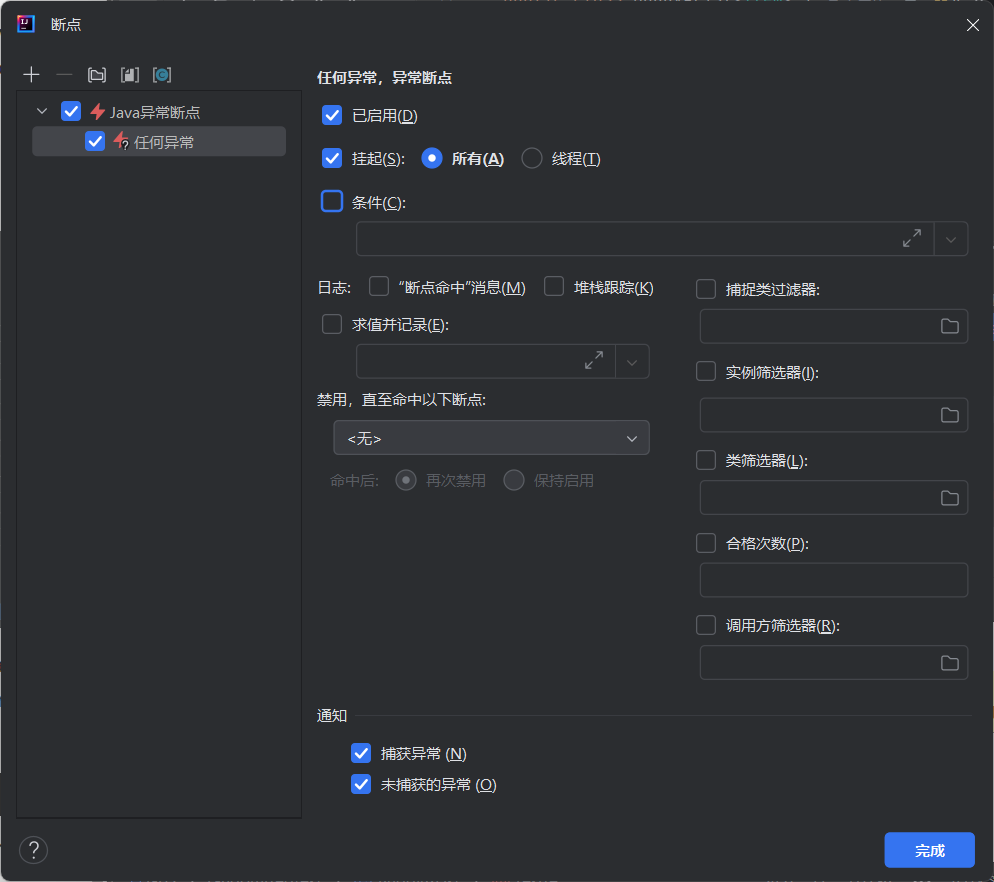{ loading=lazy }

选中(任何异常)断点，还可以在『条件』中添加判断的条件

>   如
>
>   ```java
>   this instanceof java.lang.ArrayIndexOutOfBoundsException
>   ```

## Lecture 8 Inheritance, Implements

### 1

*接口 interface* 的使用方法，例如

先实现一个*接口*(使用 `interface` 关键字)，

```java
public interface List61B<Item> {
    public void addFirst(Item x);
    public void addLast(Item y);
    public Item getFirst();
    public Item getLast();
    public Item removeLast();
    public Item get(int i);
    public void insert(Item x, int position);
    public in size();
}
```

然后之前的SLList和AList类就可以添加上 `implements List61B<...>`

```java
public class AList<Item> implements List61B<Item> {
    ...
}
```

```java
public class SLList<BLorp> implements List61B<Blorp> {
    ...
}
```

而再将函数传入的参数改成 `List61B<String> list` (原来是 `SLList` 或 `AList` )，那么在调用这个函数时，传入SLList或者AList实例都可以

---

{ loading=lazy }

继承*接口*的子类**必须**实现接口的所有方法

### 2

-   ***Override 覆写*** 指的是**子类**在类中重新重新实现父类或者接口中的方法
-   ***Overload 重载*** 指的是同一个**函数**被重复多次实现(可以是在不同的子类中)

### 3

`@Override` 注释，作用是只有函数是覆写父类或接口的函数时，才会被编译

>   Why use `@Override` ?
>
>   -   Main reason: Protects against typos.
>       -   If you say `@Override` , but it the method isn't actually overriding anything, you'll get a compile error.
>       -   e.g. `public void addLats(Item x)`
>   -   Reminds programmer that method definition came from somewhere higher up in the inheritance hierarchy.

### 4

***Implementation Inheritance 实现继承***，使用 `default` 关键字，可以在接口中实现函数，并且子类能继承已经实现好的函数(就可以不用*覆写*)，例如

```java
default public void print() {
    for (int i = 0; i < size(); i += 1) {
        System.out.print(get(i) + " ");
    }
    System.out.println();
}
```

>   由于是在接口中实现，所以只能使用接口中的方法

### 5

{ loading=lazy }

如果声明的是父类的变量，但指向的是子类的实例，在使用这个(父类类型的)变量调用覆写的方法时，由于 *动态方法选择 Dynamic Method Selection*，最终运行时运行的会是实际子类实例的方法

---

{ loading=lazy }

如果在子类中只是*重载*而没有*覆写*的方法，那么如果变量声明时是父类的类型，在调用*重载*的方法时，就会调用父类的方法，而如果是子类的类型就会调用子类的方法(如上图中，从父类和子类的方法中传入的参数不一致可以看出是*重载*，所以 `a.praise(d)` 调用的是 `Animal` 类的方法)

>   教授的解释：
>
>   this praise method, it's overloaded, not overriden. Notice that this is not the same method signature in the dog class, it's not praise animal in the dog class, it's praise dog in the dog class. This is actually a totally new method, so it's not overriding, it's overloading. The other praise method in this dog class

---

Josh说道，另一种*动态方法选择*的理解是，把它当成是一个两步的处理过程，第一步在编译时发生，第二步在运行时发生

>   -   At compile time: We determine the **signature S** of the method to be called.
>       -   S is decided using **ONLY static types**.
>   -   At runtime: The dynamic type of the **invoking object** uses its method with this exact signature S.

如上图中的例子

```java
Animal a = new Dog();
Dog d = new Dog();
a.greet(d);  // greet(Animal a)
a.sniff(d);  // sniff(Animal a)
d.praise(d); // praise(Dog a)
a.praise(d); // praise(Animal a)
```

在编译时，会变量的数据类型以及调用方法时传入的参数确定调用的函数，如 `a.praise(d)` 中 `a` 是 `Animal` ，所以会寻找 `Animal` 类中的方法，根据传入的参数 `d` 是 `Animal` (的子类)，所以确定调用的方法为 `praise(Animal a)` ，

在运行时，再根据具体变量指向的实例调用对应的方法，如 `a.sniff(d)` 在编译时确定方法为 `sniff(Animal a)` ，而实例 `a` ( `Dog` 类)中有对应的方法，所以调用的就是 `Dog` 类的 `sniff` 方法

---

### 6

```java
import java.util.List;
import java.util.ArrayList;
```

可以导入java已经实现好的链表类

## Lecture 8 Q&A

### 1

有人提问关于java中*类型转换 Casting*的问题

```java
Bird bird = new Falcon();
Falcon falcon = (Falcon) bird;
```

这两行代码(设置的变量)对应的*静态类型*和*动态类型*是这样，

|          | Static Type | Dynamic Type |
| -------- | ----------- | ------------ |
| `bird`   | Bird        | Falcon       |
| `falcon` | Falcon      | Falcon       |

然后Josh对代码稍加修改，

```java
Bird bird = (Bird) new Falcon();
Falcon falcon = (Falcon) bird;
```

然后说道第一行加上 `(Bird)` 也不会改变对应的*静态类型*和*动态类型*，

>   in fact, a cast doesn't change anything, it never changes anything. When I think about a cast as I'll say in lecture 9 is, it tells the compiler don't do your normal type checking, I know what I'm doing. It doesn't actually change anything, it just says for the purposes of type checking pretend this is a bird.

### 2

有人向Josh提问一题，要求只修改原方阵(不创建新矩阵)使矩阵旋转90°，答案的做法大概是，因为**方阵中的每个位置旋转4次就会回到原来的位置**，所以把每个元素替换到旋转后的位置，再把新位置的旧元素换到旋转后的位置，循环4次就能换好4个元素，可以参考Josh画的图

{ loading=lazy }

## Project 1

### 1

>   [Java instanceof - javatpoint](https://www.javatpoint.com/downcasting-with-instanceof-operator)
>
>   The **java instanceof operator** is used to test whether the object is an instance of the specified type (class or subclass or interface).

课程网站上说会用到 `instanceof` 关键字，然后根据课程网站上提供的链接，`instanceof` 关键字的解释如上

### 2

由于 `ArrayDeque` 没有测试的文件，如果要测试的话需要自己写一个测试的文件，课程网站上建议可以参考Lab 3中的测试，

>   So how do you verify correctness of your data structure? You use your skills that you got from Lab 3! You are encouraged to copy and paste those tests for `SList` and `AList` and adapt them for these data structures. The tests will look very similar and only require basic changes.

于是我cv了 `TestBuggyAList.java` ，然后改成了

??? example "code"

    ```java title="RandomizedComparisonTest.java" hl_lines="9-10 17-18 20 22 25-31"
    package deque;
    
    import ...;
    
    public class RandomizedComparisonTest {
        // YOUR TESTS HERE
        @Test
        public void testThreeAddThreeRemove() {
            LinkedListDeque<Integer> l1 = new LinkedListDeque<>();
            ArrayDeque<Integer> l2 = new ArrayDeque<>();
    
            ...
        }
    
        @Test
        public void randomizedTest() {
            LinkedListDeque<Integer> L = new LinkedListDeque<>();
            ArrayDeque<Integer> L2 = new ArrayDeque<>();
    
            int N = 100000;
            for (int i = 0; i < N; i += 1) {
                int operationNumber = StdRandom.uniform(0, 4);
                if (operationNumber == 0) {
                    ...
                } else if (operationNumber == 3) {
                    // addFirst
                    int randVal = StdRandom.uniform(0, 100);
                    L.addFirst(randVal);
                    L2.addFirst(randVal);
                    System.out.println("addFirst(" + randVal + ")");
                }
            }
        }
    }
    ```

### 3

java中生成随机数可以使用 `Math.random()` ，会返回 `[0, 1)` 的随机数

### 4

在autograder中，`Deque` 的子类可能不止自己实现的 `LinkedListDeque` 和 `ArrayDeque` ，所以在实现 `equals` 方法时，需要考虑到这样的情况( `equals` 方法的要求是，只要是 `Deque` 并且所有元素按顺序一致，则认为相等)

## Lecture 9 Extends, Casting, Higher Order Functions

### 1

`extends` 关键字，能继承另一个类的所有不是 `private` 的属性(包括方法)，然后可以添加新的方法

继承了之后，可以使用 `super` 来访问父类的非 `private` 的属性

---

子类的构造函数中，如果没有***显式*地**调用父类的构造函数(通过 `super([...]);` 调用)，那么会自动***隐式***地调用(调用 `super();` )

{ loading=lazy }

### 2

Java中的*高阶函数 Higher Order Functions*

Josh在课上展示了一个例子(使用*interface*)

=== "Java"

    ```java title="IntUnaryFunction"
    public interface IntUnaryFunction {
        int apply(int x);
    }
    ```
    
    ```java title="TenX"
    public class TenX implements IntUnaryFunction {
        public int apply(int x) {
            return 10 * x;
        }
    }
    ```
    
    ```java title="HoFDemo"
    public class HoFDemo {
        public static int do_twice(IntUnaryFunction f, int x) {
            return f.apply(f.apply(x));
        }
        public static void main(String[] args) {
            System.out.println(do_twice(new TenX(), 2));
        }
    }
    ```

=== "Python"

    ```python
    def tenX(x):
        return 10 * x
    
    def do_twice(f, x):
        return f(f(x))
    
    print(do_twice(tenX, 2))
    ```

## Lecture 10 Subtype Polymorphism vs. HoFs

### 1

Josh提到 `OurComparable` 的缺点

>   ```java
>   public interface OurComparable {
>       public int compareTo(Object o);
>   }
>   ```

即在运行时(如果类型不一致)会出现错误

>   ```java
>   public class Dog implements OurComparable {
>       public int compareTo(Object obj) {
>           /** Warning, cast can cause runtime error! */
>           Dog uddaDog = (Dog) obj;
>           return this.size - uddaDog.size;
>       }
>   }
>   ```

所以(为了避免这种情况)要换成使用 `Comparable<T>` (java内置的接口)

>   ```java
>   public interface Comparable<T> {
>       public int compareTo(T obj);
>   }
>   ```
>
>   ```java
>   public class Dog implements Comparable<Dog> {
>       public int compareTo(Dog uddaDog) {
>           return this.size - uddaDog.size;
>       }
>   }
>   ```

### 2

Josh提到，类似于python中传入 比较函数 进行不同的比较

```python title="python"
def print_larget(x, y, compare, stringify):
    if compare(x, y):
        return stringify(x)
    return stringify(y)
```

java中通常使用 `Comparator` ，他展示的示例如下

```java title="java"
import java.util.Comparator;

public class Dog {
    private String name;
    ...
    private static class NameComparator implements Comparator<Dog> {
        public int compare(Dog a, Dog b) {
            return a.name.compareTo(b.name);
        }
    }
    
    public static class Comparator<Dog> getNameComparator() {
        return new NameComparator();
    }
}
```

```java
Comparator<Dog> cd = Dog.getNameComparator();
if (cd.compare(d1, d3) > 0) {
    d1.bark();
} else {
    d3.bark();
}
```

## Lecture 10 Q&A

### 1

Josh根据下面这个Lecture 10课上提到的例子，对*类型转换 Casting*进行了进一步的解释

```java
Object o2 = new ShowDog("Mortimer", "Corgi", 25, 512.2);

ShowDog sdx = ((ShowDog) o2);
sdx.bark();

Dog dx = ((Dog) o2);
dx.bark();

((Dog) o2).bark();

Object o3 = (Dog) o2;
o3.bark();  // Compile error
```

类型转换**不会**改变原本变量的*静态类型*和*动态类型(即实际的类型)*，但是例如这一行代码中

```java
ShowDog sdx = ((ShowDog) o2);
```

`((ShowDog) o2)` 由于有*类型转换 Casting*，所以**这个表达式**(整体)会被认为静态类型是 `ShowDog` ，因而能赋值给静态类型同为 `ShowDog` 的 `sdx` ，而如果不加*类型转换*，

```java
ShowDog sdx = o2;
```

即使 `o2` 的*动态类型*(实际的类型)是 `ShowDog` ，但是因为 **`o2` *静态类型*是 `Object`** ， **`Object` 不能赋值给 `ShowDog`** (只有 `ShowDog` 类和 `ShowDog` 的子类才能赋值给 `ShowDog` )，所以会产生**编译错误**

## Lab 4

### 1

可以通过 `git checkout` 来变更文件到某个commit的状态

```bash
git checkout ... path/to/file
```

`...` 处可以是commit的编号(例如 `47bb0877` )，或者branch(例如 `main` )或者tag(例如 `origin/main` )

## Lecture 11 Exceptions, Iterators, Object Methods

### 1

java中的*集合 Set* `java.util.Set` 不能在一个*set*中加入两个一样的元素

>   Stores a set of values with on duplicates. Has no sense of order.

=== "Java"

    ```java
    Set<String> S = new HashSet<>();
    S.add("Tokyo");
    S.add("Beijing");
    S.add("Lagos");
    S.add("São Paulo");
    System.out.println(S.contains("Tokyo"));
    ```
    
    ```java title="Output"
    true
    ```

=== "Python"

    ```python
    s = set()
    s.add("Tokyo")
    s.add("Beijing")
    s.add("Lagos")
    s.add("São Paulo")
    print("Tokyo" in s)
    ```
    
    ```python title="Output"
    True
    ```

### 2

类似在python中用 `raise` 引发错误，在java中可以使用 `throw` 抛出异常，例如

```java
public void add(T x) {
    if (x == null) {
        throw new IllegalArgumentException("Cannot add null!");
    }
}
```

### 3

java中的foreach循环/*增强for循环 Enhanced For loop*，

>   ```java
>   Set<Integer> javaset = new HashSet<Integer>();
>   ```

```java title="Enhanced For / foreach"
for (int x : javaset) {
    System.out.println(x);
}
```

```java title="普通for循环"
Iterator<Integer> seer = javaset.iterator();

while (seer.hasNext()) {
    System.out.println(seer.next());
}
```

---

接口 `Iterator` 需要实现2个方法

```java
public interface Iterator<T> {
    boolean hasNext();
    T next();
}
```

Josh实现的示例

```java
public class ArraySet<T> {
    private class ArraySetIterator implements Iterator<T> {
        private int wizPos;
        public ArraySetIterator() {
            wizPos = 0;
        }

        public boolean hasNext() {
            return wizPos < size;
        }

        public T next() {
            T returnItem = items[wizPos];
            wizPos += 1;
            return returnItem;
        }
    }
}
```

---

如果想要支持*增强for循环*，那么需要让类实现 `Iterable` 接口

```java
public interface Iterable<T> {
    Iterator<T> iterator();
}
```

例如

```java
public class ArraySet<T> implements Iterable<T> {
    ...
    public Iterator<T> iterator() { ... }
}
```

或者需要是 `Iterable` 的子类，如下面的 `Set` 类

```java
public class Collection<E> extends Iterable<E> { ... }
```

```java
public class Set<E> extends Collection<E> { ... }
```

### 4

java中所有类都是 `Object` 类的子类

`Object` 中比较重要的4个方法(61b中会涉及到的)

-   `String toString()`
-   `boolean equals(Object obj)`
-   `Class<?> getClass()`
-   `int hashCode()`

### 5

java中，一个 `String` 加上另外一个东西的时候，会自动隐式地调用 `toString` 方法

### 6

Josh说道，java中 字符串拼接 比较耗时，所以可以使用 `StringBuilder` ，例如

```java
@Override
public String toString() {
    StringBuilder return SB = new StringBuilder("{");
    for (int i = 0; i < size - 1; i += 1) {
        returnSB.append(items[i].toString());
        returnSB.append(", ");
    }
    returnSB.append(items[size - 1]);
    returnSB.append("}");
    return returnSB.toString();
}
```

### 7

`==` 和 `.equals` 的区别

-   `==` 比较两个是不是指向同一个实例
-   `.equals` 调用的是类内的 `.equals` 方法

### 8

Josh实现 `equals` 的示例

```java
@Override
public boolean equals(Object other) {
    if (this == other) {
        return true;
    }
    if (other == null) {
        return false;
    }
    if (other.getClass() != Array.class) {  // or != this.getClass()
        return false;
    }
    ArraySet<T> o = (ArraySet<T>) other;
    if (o.size() != this.size()) {
        return false;
    }
    for (T item : this) {
        if (!o.contains(item)) {
            return false;
        }
    }
    return true;
}
```

>   注意到使用了 `.getClass` 方法

### 9

Josh提到了 `String.join` 函数的使用(用来简化 `.toString` 方法的实现)

```java
public String toString() {
    List<String> listOfItems = new ArrayList<>();
    for (T x : this) {
        listOfItems.add(x.toString());
    }
    return "{" + String.join(", ", listOfItems) + "}";
}
```

`String.join` 函数的一种用法是传入中间用于分割的字符串，和一个 `Iterable` ，然后会返回用 `Iterable` 中的元素拼接的字符串

### 10

Josh介绍了 `of` 静态方法的实现和用法

```java
public class ArratSet<T> implements Iterable<T> {
    public static <Glerp> ArratSet<Glerp> of(Glerp... stuff) {
        ArratSet<Glerp> returnSet = new ArratSet<Glerp>();
        for (Glerp x : stuff) {
            returnSet.add(x);
        }
        return returnSet;
    }
}
```

-   因为是**静态**方法，所以 `of` 不知道 `T` 是什么，所以需要声明一个新的 `Glerp`
-   `Glerp...` 是一个**可变数量**的参数(类似于python中的 `*args` )，并且是 `Iterable` (可以使用foreach)

Josh展示的使用的示例

```java
ArraySet<String> asetOfStrings = ArraySet.of("hi", "I'm", "here");
System.out.println(asetOfStrings);
```

```txt title="Output"
{hi, I'm, here}
```

## Lecture 11 Q&A

### 1

Josh展示了使用 `Arrays.sort(T[] a, Comparator<? super T> c)` 函数，将一个数组按照自定义的排序方式进行排序的方法

```java linenums="1"
import org.junit.Test;
import java.util.Arrays;
import java.util.Comparator;
import static org.junit.Assert.assertEquals;

public class SevenCountComparator implements Comparator<Integer> {
    @Test
    public void testSevenCount() {
        assertEquals(1, sevenCount(7));
        assertEquals(0, sevenCount(9));
        assertEquals(2, sevenCount(707));
        assertEquals(6, sevenCount(77707077));
    }
    
    private int sevenCount(int a) {
        String s = Integer.toString(a);
        int count = 0;
        for (int i = 0; i < s.length(); i += 1) {
            if (s.charAt(i) == '7') {
                count += 1;
            }
        }
        return count;
    }
    
    public int compare(Integer a, Integer b) {
        return sevenCount(a) - sevenCount(b);
    }
    
    public static void main(String[] args) {
        Integer[] a = {1, 3, 65, 88, 7, 126, 777, 728, 10912983, 99999999};
        Arrays.sort(a, new SevenCountComparator());
        
        System.out.println(Arrays.toString(a));
    }
}
```

```java title="Output"
[1, 3, 65, 88, 126, 10912983, 99999999, 7, 728, 777]
```

## Lecture 12 Command Line Programming, Git, Project 2 Preview

### 1

Josh展示 `main` 函数 `args` 参数的作用，作用大致是用命令行运行java文件时给获取传入的参数

```java title="Hello.java"
public class Hello {
    public static void main(String[] args) {
        System.out.println(args[0]);
        System.out.println(args[1]);
        System.out.println(args[2]);
    }
}
```

```bash
$ javac Hello.java
$ java Hello.java one two three four
one
two
three
```

### 2

ppt中展示了可以使用 `Integer.parseInt()` 将字符串转换成对应的数字的方法

### 3

Josh解释git使用git-SHA1哈希值来存储文件的方式

>   -   First, git computes the git-SHA1 hash:
>
>       -   HelloWorld.java → `66ccdc645c9d156d5c796dbe6ed768430c1562a2`
>
>   -   Git creates a folder called `.git/objects/66`
>
>       -   The `66` is the first two characters of the git-SHA1 hash.
>
>   -   Git stores the contents in a file called
>
>       `ccdc645c9d156d5c796dbe6ed768430c1562a2`.
>
>       -   File is stored in a compressed format (zlib) to save space.

```bash
$ cd .git
/.git$ cd objects
/.git/objects$ cd 66
/.git/objects/66$ ls
ccdc645c9d156d5c796dbe6ed768430c1562a2
/.git/objects/66$ cat ~/Scuts/gitview.py
import sys
import zlib  # A compression / decompression library
filename = sys.argv[1]
compressed_contents = open(filename, 'rb').read()
decompressed_contents = zlib.decompress(compressed_contents)
try:
    print(decompressed_contents.decode('utf-8'))
except:
    print(decompressed_contents)
/.git/objects/66$ python3 ~/Scuts/gitview.py ccdc645c9d156d5c796dbe6ed768430c1562a2
blob 115public class HelloWorld {
        public static void main(String[] args) {
                System.out.println("Hello World!");
        }
}
```

## Lecture 13 Asymptotics I

### 1

*Big Theta* 和 *Big O* 的区别

>   Whereas Big Theta can informally be thought of as something like “equals”, Big O can be thought of as “less than or equal”.
>
>   Example, the following are all true:
>
>   -   N³ + 3N⁴ ∈ Θ(N⁴)
>   -   N³ + 3N⁴ ∈ O(N⁴)
>   -   N³ + 3N⁴ ∈ O(N⁶)
>   -   N³ + 3N⁴ ∈ O(N!)
>   -   N³ + 3N⁴ ∈ O(N^N!^)
>
>   ---
>
>   $$
>   R(N) ∈ Θ(f(N)) ⇒ k_1 · f(N) ≤ R(N) ≤ k_2 · f(N)
>   $$
>
>   $$
>   R(N) ∈ Of(N)) ⇒ R(N) ≤ k_2 · f(N)
>   $$

## Lecture 14 Disjoint Sets

### 1

这节课Josh讲授了 得到应用于“*动态连接 Dynamic Connectivity*”问题的“*不交集 Disjoint Sets*”数据结构的过程

>   The ideas that made our implementation efficient:
>
>   -   Represent sets as connected components (don't track individual connections).
>       -   **ListOfSetsDS**: Store connected components as a List of Sets (slow, complicated).
>       -   **QuickFindDS**: Store connected components as set ids.
>       -   **QuickUnionDS**: Store connected components as parent ids.
>           -   **WeightedQuickUnionDS**: Also track the size of each set, and use size to decide on new tree root.
>               -   **WeightedQuickUnionWithPathCompressionDS**: On calls to connect and isConnected, set parent id to the root for all items seen.
>
>   |             Implementation              |    Runtime     |
>   | :-------------------------------------: | :------------: |
>   |              ListOfSetsDS               |     O(NM)      |
>   |               QuickFindDS               |     Θ(NM)      |
>   |              QuickUnionDS               |     O(NM)      |
>   |          WeightedQuickUnionDS           | O(N + M log N) |
>   | WeightedQuickUnionWithPathCompressionDS | O(N + M α(N))  |
>
>   Runtimes are given assuming:
>
>   -   We have a DisjointSets object of size N.
>   -   We perform M operations, where an operation is defined as either a call to `connected` or `isConnected`.

**要点1**

将*连通分量 connected components*用集合表示(忽略具体的边)，例如

=== "`connect(2, 3)` 操作前"

    ```mermaid
    flowchart TD
    0 --- 4
    0 --- 1 --- 2
    3 --- 5
    6
    ```
    
    ```java
    {0, 1, 2, 4}, {3, 5}, {6}
    ```

=== "`connect(2, 3)` 操作后"

    ```mermaid
    flowchart TD
    0 --- 4
    0 --- 1 --- 2 --- 3
    3 --- 5
    6
    ```
    
    ```java
    {0, 1, 2, 4, 3, 5}, {6}
    ```

**要点2**

QuickUnionDS，用一个数组标记每个节点的父节点(使得每个*连通分量*像一个树一样)，这样可以减少 `connect` 所需要做的更改/所需要的操作(相比于ListOfSetsDS)

| `parent` |  -1  |  0   |  1   |  -1  |  0   |  3   |  -1  |
| :------: | :--: | :--: | :--: | :--: | :--: | :--: | :--: |
|          |  0   |  1   |  2   |  3   |  4   |  5   |  6   |

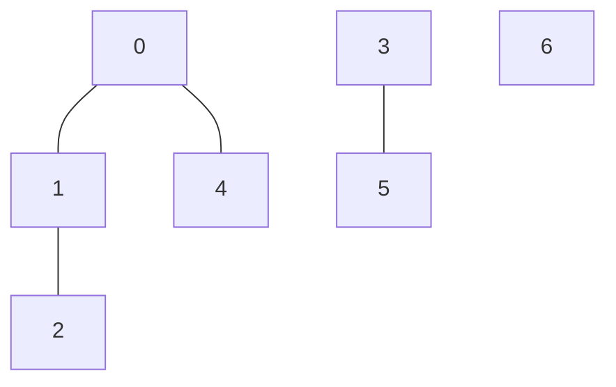
```mermaid
flowchart TD
0 --- 4
0 --- 1 --- 2
3 --- 5
6
```

**要点3**

WeightedQuickUnionDS，标记每个树的大小，每次 `connected` 时，都将小树的根连接到大树的根上，这样能使得 `connected` 后的树的层数不会太高，使得 `connect` 和 `isConnected` 的复杂度都降到 O(log N).

>   ```mermaid
>   flowchart TD
>   0 --- 1
>   0 --- 2
>   0 --- 3
>   0 --- 4
>   0 --- 5
>   6 --- 7
>   6 --- 8 --- 9
>   ```
>
>   Two common approaches:
>
>   -   Use values other than -1 in `parent` array for root nodes to track size.
>
>       | `parent` |  -6  |  0   |  0   |  0   |  0   |  0   |  -4  |  6   |  6   |  8   |
>       | :------: | :--: | :--: | :--: | :--: | :--: | :--: | :--: | :--: | :--: | :--: |
>       |          |  0   |  1   |  2   |  3   |  4   |  5   |  6   |  7   |  8   |  9   |
>
>   -   Create a separate `size` array.
>
>       | `size` |  6   |  1   |  1   |  1   |  1   |  1   |  4   |  1   |  2   |  1   |
>       | :----: | :--: | :--: | :--: | :--: | :--: | :--: | :--: | :--: | :--: | :--: |
>       |        |  0   |  1   |  2   |  3   |  4   |  5   |  6   |  7   |  8   |  9   |

**要点4**

WeightedQuickUnionWithPathCompressionDS，在 `isConnected` 时把经过的节点直接改为连接到根节点上

=== "`isConnected(15, 10)` 前"

    ```mermaid
    flowchart TD
    0 --- 1(["1"]) --- 5(["5"]) --- 11(["11"]) --- 15(["15"])
    5 --- 12
    1 --- 6 --- 13
    1 --- 7
    0 --- 2 --- 8 --- 14
    2 --- 9
    0 --- 3(["3"]) --- 10(["10"])
    0 --- 4
    ```

=== "`isConnected(15, 10)` 后"

    ```mermaid
    flowchart TD
    0 --- 15(["15"])
    0 --- 11(["11"])
    0 --- 5(["5"])
    0 --- 1(["1"])
    5 --- 12
    1 --- 6 --- 13
    1 --- 7
    0 --- 2 --- 8 --- 14
    2 --- 9
    0 --- 3(["3"])
    0 --- 10(["10"])
    0 --- 4
    ```

使得N个节点M次操作的复杂度减少到 O(N + M lg* N)

>   $2$ = lg* 1
>
>   $2^{2^{2^{2}}}$ = lg* 4
>
>   ...

## Lec 15 Asymptotics II

### 1

Josh讲解加入一次*Merge*对*选择排序 Selection Sort*的具体加速过程，并进而讲解*归并排序 Merge Sort*时如何比*选择排序*更快的

>   >   Runtime of selection sort is Θ(N²):
>   >
>   >   -   Look at all N unfixed items to find smallest.
>   >   -   Then look at N-1 remaining unfixed.
>   >   -   ...
>   >   -   Look at last two unfixed items.
>   >   -   Done, sum is 2+3+4+5+...+N = Θ(N²)
>   >
>   >   Given that runtime is quadratic, for N = 64, we might sat the runtime for selection sort is 2,048 arbitrary units of time (AU).
>
>   **Using Merge to Speed Up the Sorting Process**
>
>   Merging can give us an improvement over vanilla selection sort:
>
>   -   Selection sort the left half: Θ(N²).
>   -   Selection sort the right half: Θ(N²).
>   -   Merge the results: Θ(N).
>
>   N=64: \~1088 AU.
>
>   -   Merge: \~64 AU.
>   -   Selection Sort: \~2*512 = \~1024 AU.
>
>   Still Θ(N²), but faster since N+2*(N/2)² < N²
>
>   -   \~1088 vs. \~2048 AU for N=64.
>
>   ---
>
>   **Mergesort Order of Growth**
>
>   Mergesort has worst case runtime = Θ(N log N).
>
>   -   Every level takes \~N AU.
>       -   Top level takes \~N AU.
>       -   Next  level takes \~N/2 + \~N/2 =  \~N.
>       -   One more level down: \~N/4 + \~N/4 + \~N/4 + \~N/4 = \~N.
>   -   Thus, total runtime is \~Nk, where k is the number of levels.
>       -   How many levels? Goes until we get to size 1.
>       -   k = log₂(N).
>   -   Overall runtime is Θ(N log N).
>
>   ---
>
>   **Mergesort using Recurrence Relations (Extra)**
>
>   C(N): Number of calls to mergesort + number of array writes.
>   $$
>   C(N) = \begin{cases}
>   1 & : N < 2 \\
>   2C(N/2) + N & : N ≥ 2 \\
>   \end{cases}
>   $$
>
>   $$
>   \begin{equation}
>   \begin{aligned}
>   C(N) & = 2(2C(N/4) + N/2) + N \\
>        & = 4C(N/4) + N + N \\
>        & = 8C(N/8) + N + N + N \\
>        & = N \cdot 1 + N + N + \ldots + N \ (k = \lg N)\\
>        & = N + N \lg N \in \Theta(N \lg N)
>   \end{aligned}
>   \end{equation}
>   $$

## Lecture 16 ADTs, Sets, Maps, BSTs

### 1

Josh课上提到的java中的map的使用示例(和python中的字典类似)

=== "Java"

    ```java
    Map<String, Integer> m = new TreeMap<>();
    String[] text = {"sumomo", "mo", "momo", "mo", "momo", "no", "uchi"};
    
    for (String s : text) {
        int currentCount = m.getOrDefault(s, 0);
        m.put(s, currentCount + 1);
    }
    ```

=== "Python"

    ```python
    m = {}
    text = ["sumomo", "mo", "momo", "mo", "momo", "no", "uchi"]
    for s in text:
        current_count = m.get(s, 0)
        m[s] = current_count + 1
    ```

### 2

Josh在讲到二分查找树的*插入 insert*方法时，

```java
static BST insert(BST T, Key ik) {
    if (T == null)
        return new BST(ik);
    if (ik < T.key)
        T.left = insert(T.left, ik);
    else if (ik > T.key)
        T.right = insert(T.right, ik);
    return T;
}
```

要使用上面这样的代码结构，避免使用下面这样的代码(比上面的要复杂，也不美观)

>   ARMS LENGTH RECURSION!!!! No good.
>
>   A common rookie bad habit to avoid:

```java
    if (T.left == null)
        T.left = new BST(ik);
    else if (T.right = null)
        T.right = new BST(ik);
```

### 3

Josh讲到，在对二分查找树进行删除操作时，如果要删除的节点有两个子节点，那么需要找到**左子树中的最大节点(a.k.a *predecessor*)**或者**右子树中的最小节点(a.k.a successor)**，继续**递归地**删除这个节点，最后用这个节点的值构造一个新的节点代替被删除的节点，

例如，要删除 `k`

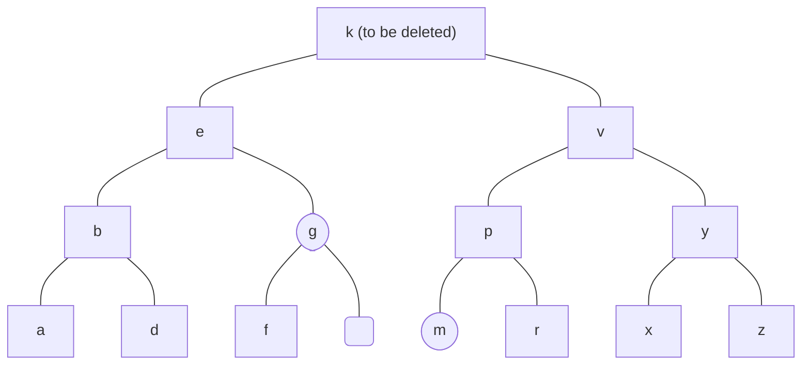
```mermaid
flowchart TD
k["k (to be deleted)"] --- e --- b --- a
b --- d
e --- g(["g"]) --- f
g --- null1(" ")
k --- v --- p --- m(["m"])
p --- r
v --- y --- x
y --- z
```

那么 `g` 是*predecessor*，`m` 是*successor*，

如果选择 `g` 代替 `k` 的位置，那么最后的结果就是

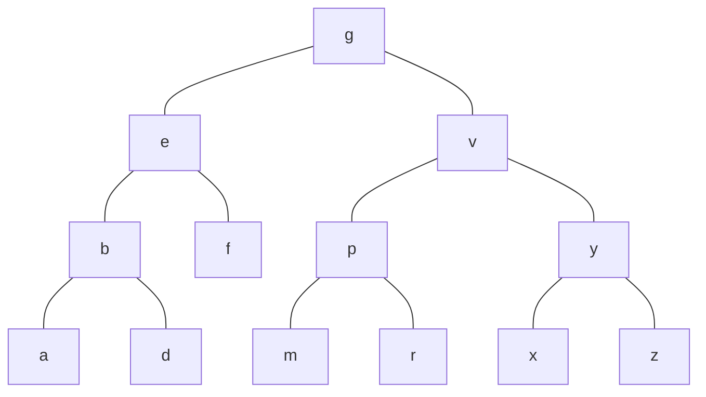
```mermaid
flowchart TD
g --- e --- b --- a
b --- d
e --- f
g --- v --- p --- m
p --- r
v --- y --- x
y --- z
```

### 4

Josh提到，使用二分查找树来实现之前提到的map，将key和value一起作为树的一个节点即可，查找时**按照key的值来查找**，例如

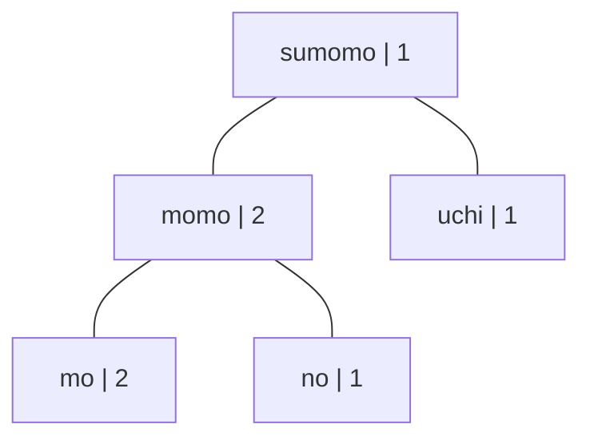
```mermaid
flowchart TD
sumomo["sumomo | 1"] --- momo["momo | 2"] --- mo["mo | 2"]
momo --- no["no | 1"]
sumomo --- uchi["uchi | 1"]
```

## Lecture 16 Q&A

### 1

有人提问这一题

```java
public static void f5(int N, int m) {
    if (N < 10) { return; }
    for (int i = 0; i <= N % 10; i++) {
        f5(N / 10, M / 10);
        System.out.println(M);
    }
}
```

题目是问这个函数的时间复杂度O是多少。

最后发现，通过取最坏情况的N，999...9对应会 `println` 1+10+100+...=111...1次，所以复杂度是O(N)，

所以我觉得这种题可以**直接取最坏的情况**进行分析判断

## Lab 6

### 1

实验说明中提到了，java中可以这样获取到运行时的路径(*当前工作目录 current working directory*)

```java
System.getProperty("user.dir")
```

>   The [current working directory](https://en.wikipedia.org/wiki/Working_directory) (CWD) of a Java program is the directory from where you execute that Java program. You can access the CWD from within a Java program by using `System.getProperty("user.dir")`.

---

教程中给出了IDEA中设置*当前工作目录*的方法，

>   In IntelliJ, the CWD is given by the specified directory under Run > Edit Configurations > Working Directory

『当前文件』下的『编辑配置』>『`+`』>『应用程序』，然后在之后的界面里就可以设置*当前工作目录*了

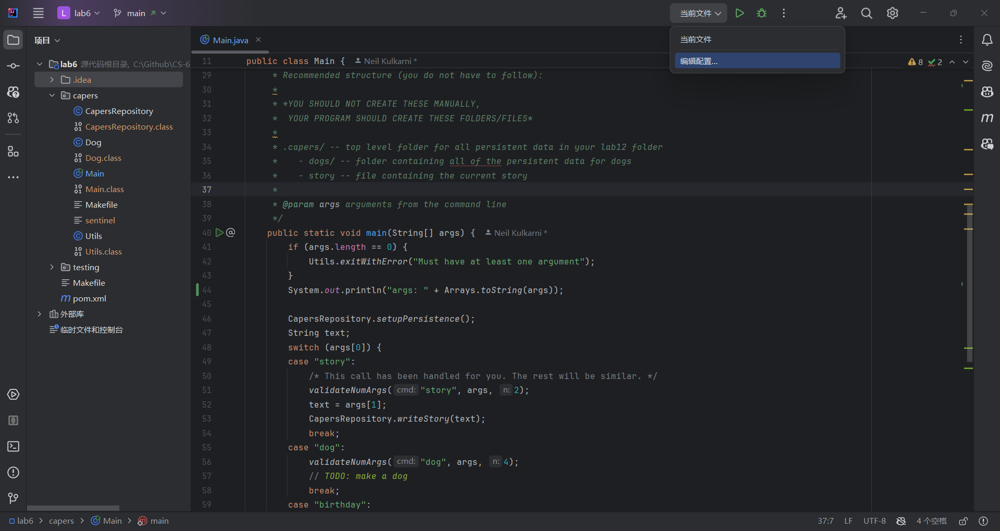{ loading=lazy }

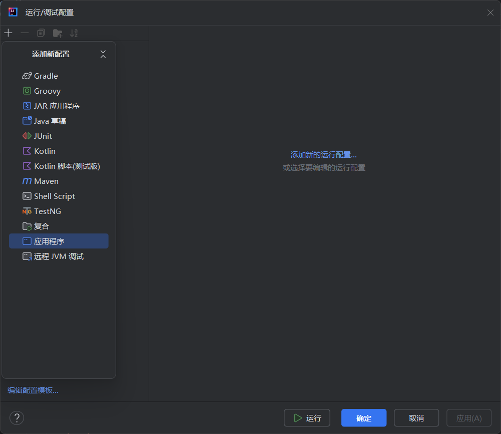{ loading=lazy }

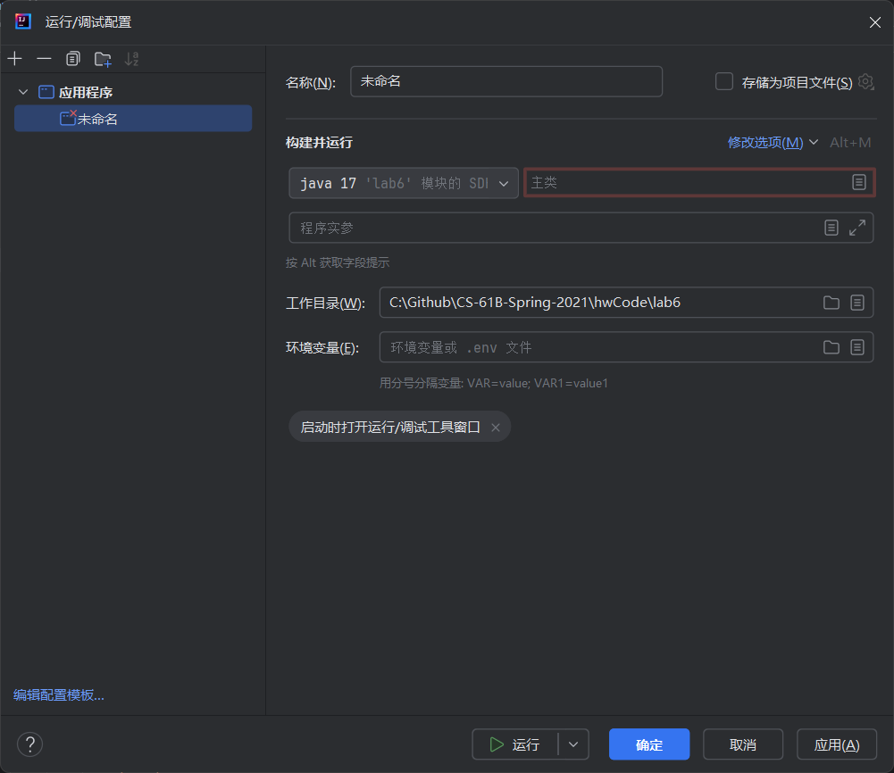{ loading=lazy }

### 2

实验说明中给出的java中关于文件和文件夹的操作

>   **Files**
>
>   You can make a File object in Java with the File constructor and passing in the path to the file:
>
>   ```java
>   File f = new File("dummy.txt");
>   ```
>
>   The above path is a relative path where we are referring to the file `dummy.txt` in our Java program’s CWD. You can think of this File object as a reference to the actual file `dummy.txt` - **when we create the new File object, we aren’t actually creating the `dummy.txt` file itself**, we are just saying, “in the future, when I do operations with `f`, I want to do these operations on `dummy.txt`”. To actually create this `dummy.txt` file, we could call
>
>   ```java
>   f.createNewFile();
>   ```
>
>   and then the file `dummy.txt` will actually now exist (and you could see it in File Explorer / Finder).
>
>   You can check if the file “dummy.txt” already exists or not with the `exists` method of the File class:
>
>   ```java
>   f.exists()
>   ```
>
>   Actually writing to a file is pretty ugly in Java. To keep things simple, we’ve provided you with a `Utils.java`. This class will be very handy for this lab and in Gitlet. You should look at the list of available methods in `Utils.java` to get a sense of what it can do for you. See the FAQ at the bottom of this lab for hints on what to focus on.
>
>   As an example, if you want to write a String to a file, you can do the following:
>
>   ```java
>   Utils.writeContents(f, "Hello World");
>   ```
>
>   Now `dummy.txt` would now have the text “Hello World” in it.
>
>   **Directories**
>
>   Directories in Java are also represented with File objects. For example, you can make a File object that represents a directory:
>
>   ```java
>   File d = new File("dummy");
>   ```
>
>   Similar to files, this directory might not actually exist in your file system. To actually create the folder in your file system, you can run:
>
>   ```java
>   d.mkdir();
>   ```
>
>   and now there should be a folder called `dummy` in your CWD. You should also checkout the `mkdirs()` method, whose documentation can be found [here](https://docs.oracle.com/javase/7/docs/api/java/io/File.html).

### 3

实验说明中提到了java中**将变量保存到文件中**的方法，即让自定义的类实现 `java.io.Serializable` 这个接口，然后就可以(结合java中对文件的操作)将变量写入到指定的文件当中或从文件中读取(感觉和python中的pickle包比较类似)，例如

```java
import java.io.Serializable;

public class Model implements Serializable {
    ...
}
```

```java title="写入"
Model m = ....;
File outFile = new File(saveFileName);
try {
    ObjectOutputStream out =
        new ObjectOutputStream(new FileOutputStream(outFile));
    out.writeObject(m);
    out.close();
} catch (IOException excp) {
    ...
}
```

```java title="读取"
Model m;
File inFile = new File(saveFileName);
try {
    ObjectInputStream inp =
        new ObjectInputStream(new FileInputStream(inFile));
    m = (Model) inp.readObject();
    inp.close();
} catch (IOException | ClassNotFoundException excp) {
    ...
    m = null;
}
```

### 4

在使用 `make` 时，需要使用git bash，使用powershell时出现了这样的报错

```bash
PS C:\Github\CS-61B-Spring-2021\hwCode\lab6> make check              
"C:/Program Files (x86)/GnuWin32/bin/make" -C testing PYTHON=python3 TESTER_FLAGS="" check
make[1]: Entering directory `C:/Github/CS-61B-Spring-2021/hwCode/lab6/testing'
系统找不到指定的路径。
'true' 不是内部或外部命令，也不是可运行的程序
或批处理文件。
make[1]: *** [check] 错误 1
make[1]: Leaving directory `C:/Github/CS-61B-Spring-2021/hwCode/lab6/testing'
make: *** [check] 错误 2
```

---

换成git bash之后，运行 `make check` 时出现了这样的报错

```bash
$ make check
"C:/Program Files (x86)/GnuWin32/bin/make" -C testing PYTHON=python3 TESTER_FLAGS="" check
make[1]: Entering directory `C:/Github/CS-61B-Spring-2021/hwCode/lab6/testing'
Testing application capers.Main...
python3 tester.py  --src=our-src our/*.in
make[1]: *** [check] 错误 49
make[1]: Leaving directory `C:/Github/CS-61B-Spring-2021/hwCode/lab6/testing'
make: *** [check] 错误 2
```

发现按照任务说明FAQs中说的，由于windows中的运行python的命令是 `python` 而不是 `python3` ，所以加一个 `PYTHON=python` 即可

```bash
make check PYTHON=python
```

## Lecture 17 B-Trees (2-3, 2-3-4 Trees)

### 1

*Big O*虽然类似于小于等于，但是**通常**用于表示最坏的情况的*Big Theta*是这样

>   (Big O) Allows us to make simple blanket statements, e.g. can just say “binary search is O(log N)” instead of “binary search is Θ(log N) in the worst cast”.

### 2

树的*高度 Height*、*深度 Depth*的定义，以及它们和*运行时间 Runtime*的关系

>   ```mermaid
>   flowchart TD
>   k --- e --- b --- a
>   b --- d
>   e --- g --- f
>   g --- j
>   k --- v --- p --- r --- s
>   v --- y --- z
>   ```
>
>   **Height and Depth**
>
>   Height and average depth are important properties of BSTs.
>
>   -   The **“depth” of a node** is how far it is from the root, e.g. depth(g) = 2.
>   -   The **“height” of a tree** is the depth of its deepest leaf, e.g. height(T) = 4.
>   -   The **“average depth”** of a tree is the average depth of a tree's nodes.
>       -   (**0**x1 + **1**x2 + **2**x4 + **3**x6 + **4**x1)/(1+2+4+6+1) = 2.35
>
>   ---
>
>   **Height, Depth and Runtime**
>
>   Height and average depth determine runtimes for BST operations.
>
>   -   The **“height” of a tree** determines the worst case runtime to find a node.
>       -   Example: Worst case is contains(s), requires 5 comparisons (height + 1).
>   -   The **“average depth”** determines the average case runtime to find a node.
>       -   Example: Average case is 3.35 comparisons (average depth + 1).

### 3

ppt中展示的一个3阶B树添加元素变化的过程

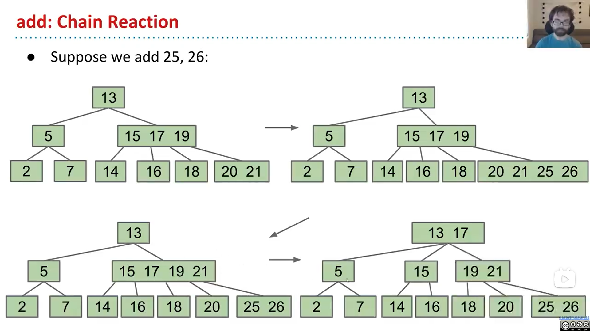{ loading=lazy }

### 4

特殊B树的别称

>   -   B-trees of order L=3 (like we used today) are also called a 2-3-4 tree or a 2-4 tree.
>       -   “2-3-4” refers to the number of children that a node can have, e.g. a 2-3-4 tree node may have 2, 3, or 4 children.
>   -   B-trees of order L=2 are also called a 2-3 tree.

---

>   B-Trees are most popular in two specific contexts:
>
>   -   Small L (L=2, L=3):
>       -   Used as a conceptually simple balanced search tree (as today).
>   -   L is very large (say thousands).
>       -   Used in practice for databases and filesystems (i.e. systems with very large records).

---

B树的两个*不变式 Invariant*

>   -   All leaves must be the same distance from the source.
>   -   A non-leaf node with k items must have exactly k+1 children.

---

B树的高度：在 \~log~L+1~(N) 和 \~log₂(N) 之间

### 5

B树的*运行时间 Runtime*

>   **Runtime for `contains`**
>
>   Runtime for contains:
>
>   -   Worst case number of nodes to inspect: H + 1
>   -   Worst case number of items to inspect per node: L
>   -   Overall runtime: O(HL)
>
>   Since H = Θ(log N), overall runtime is O(L log N).
>
>   -   Since L is a constant, runtime is therefore O(log N).
>
>   ---
>
>   Runtime for `add`:
>
>   -   Worst case number of nodes to inspect: H + 1
>   -   Worst case number of items to inspect per node: L
>   -   Worst case number of split operations: H + 1
>   -   Overall runtime: O(HL)
>
>   ... O(log N).

## Lecture 18 Red Black Trees

### 1

Josh介绍到红黑树和2-3 tree是一样的(数学上可以叫做*双射 bijection*)，下图ppt中展示的是*左倾 Left-Leaning*红黑树，*左倾*即代表 表示2-3tree中同一个节点上两个元素的红黑树的两个节点 之间**用连接左子树的线进行连接**

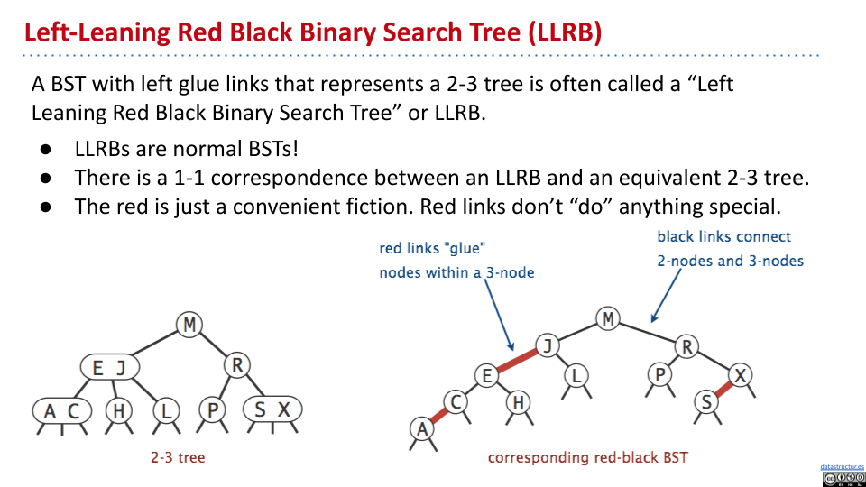{ loading=lazy }

---

>   Some handy LLRB properties:
>
>   -   No node has two red links [otherwise it'd be a analogous to a 4-node, which are disallowed in 2-3 trees].
>   -   Every path from root to a leaf has same number of **black links** [because 2-3 trees have the same number of links to every leaf]. LLRBs are therefore balanced.

### 2

Josh通过4个例子，讲解了红黑树如何构建的过程

>   -   When insering: Use a red link.
>   -   If there is a *right leaning “3-node”*, we have a **Left Leaning Violation.**
>       -   <u>Rotate left</u> the appropriate node to fix.
>   -   If there are *two consecutive left links*, we have an **Incorrect 4 Node Violation.**
>       -   <u>Rotate right</u> the appropriate node to fix.
>   -   If there are any <u>nodes with two red children</u>, we have a **Temporary 4 Node.**
>       -   Color flip the node to emulate the split operation.

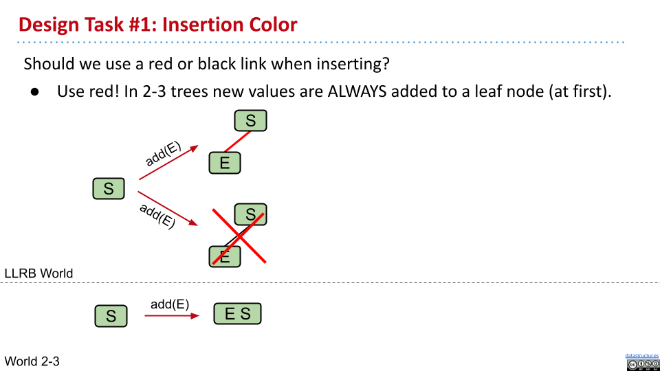{ loading=lazy }

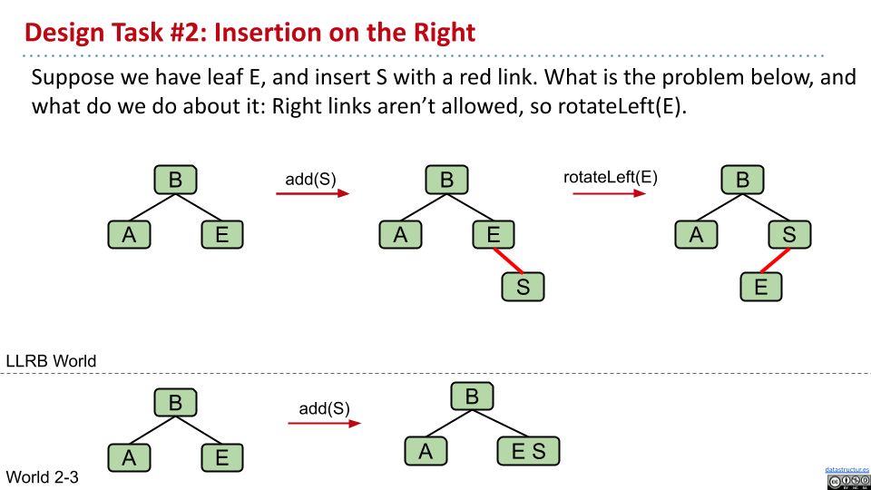{ loading=lazy }

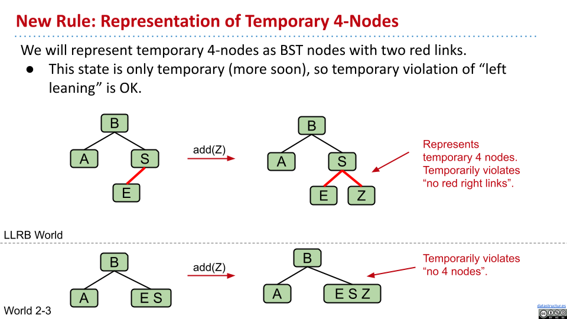{ loading=lazy }

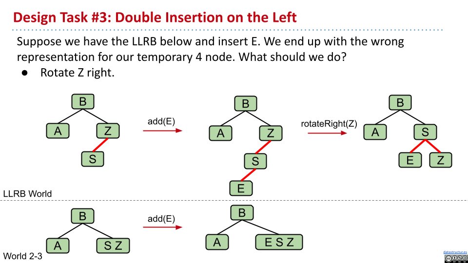{ loading=lazy }

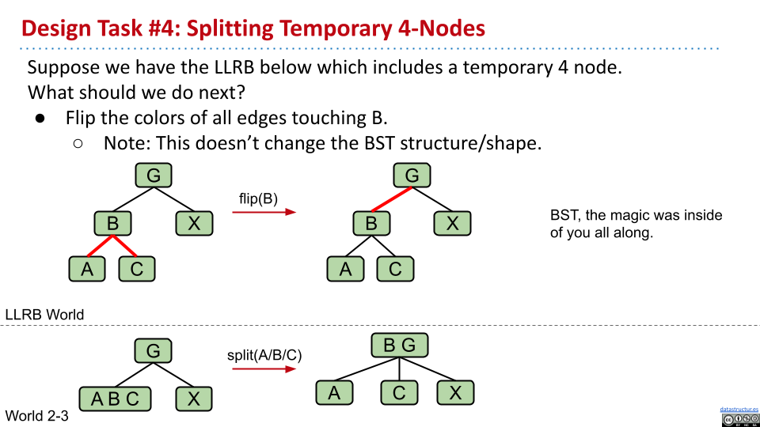{ loading=lazy }

## Lab 7

### 1

任务说明中提到了*泛型 generic*也可以指定类型

>   This can be enforced in Java with a [bounded type parameter](https://docs.oracle.com/javase/tutorial/java/generics/bounded.html). Consider the example below, taken from the Oracle docs:
>
>   ```java
>   /*
>    * Bounded type parameters allow you to invoke methods defined in the bounds:
>    * The `isEven` method invokes the `intValue` method defined in the 
>    * `Integer` class through `n`.
>    */
>   
>   public class NaturalNumber<T extends Integer> {
>   
>   	private T n;
>   
>   	public NaturalNumber(T n)  { this.n = n; }
>   
>   	public boolean isEven() {
>   		return n.intValue() % 2 == 0;
>   	}
>   
>   	// ...
>   }
>   ```

## Lecture 19


## Homework 2

我的答案(好像官方没有提供参考答案)

??? note "我的答案及思路"

    <h1>HW2: Conceptual Review</h1>
    
    <h2>Q1 Asymptotic Warmup<br/><small>32 Points</small></h2>
    
    Give the tightest asymptotic bound on `foo(n)`.
    
    ```java
    public int foo(int n) {
       if (n == 0) {
          return 0;
       }
       bloop(n);
       return foo(n/3) + foo(n/3) + foo(n/3);
    
    public int bloop(int n) {
       for (int i = 0; i < n; i += 1) {
          System.out.println("Ah, loops too");
       }
       return n;
    }
    ```
    
    -   [ ] $\Omega(1)$
    -   [ ] $\Omega(\log(n))$
    -   [ ] $\Omega(n)$
    -   [ ] $\Omega(n \cdot \log(n))$
    -   [ ] $\Omega(n^2)$
    -   [ ] $\Omega(n^3)$
    -   [ ] $\Omega(3^n)$
    -   [ ] $\Omega(n!)$
    -   [ ] $\Theta(1)$
    -   [ ] $\Theta(\log(n))$
    -   [ ] $\Theta(n)$
    -   [x] $\Theta(n \cdot \log(n))$
    -   [ ] $\Theta(n^2)$
    -   [ ] $\Theta(n^3)$
    -   [ ] $\Theta(3^n)$
    -   [ ] $\Theta(n!)$
    -   [ ] $O(1)$
    -   [ ] $O(\log(n))$
    -   [ ] $O(n)$
    -   [ ] $O(n \cdot \log(n))$
    -   [ ] $O(n^2)$
    -   [ ] $O(n^3)$
    -   [ ] $O(3^n)$
    -   [ ] $O(n!)$
    
    ??? note "思路"
    
        `foo` 的每一*层*递归，`foo(n/3) + foo(n/3) + foo(n/3)` 加起来刚好会 `println` n次，而一共会有 $\log_3 n$ *层*递归，所以是 $\Theta(n \cdot \log(n))$
    
    <h2>Q2 Asymptotic Potpourri<br/><small>32 Points</small></h2>
    
    **Note:** This is the hardest problem on this Homework. If you are stuck on it for a long time, move on to other problems, and post on Ed or come to Office Hours so we can help you.
    
    Give the runtime of the following functions in $\Theta$ notation. Your answer should be a function of N that is as simple as possible with no unnecessary leading constants or lower order terms.
    
    <h3>Q2.1 Mystery 1<br/><small>8 Points</small></h3>
    
    ```java
    public void mystery1(int n) {
       for (int i = n; i > 0; i = i / 2) {
          for (int j = 0; j < 100000000; j += 2) {
             System.out.println("Hello World");
          }
       }
    }
    ```
    
    -   [ ] $1$
    -   [x] $\log(n)$
    -   [ ] $n$
    -   [ ] $n \cdot \log(n)$
    -   [ ] $(\log(n))^2$
    -   [ ] $n^2$
    -   [ ] $n^2\cdot\log(n)$
    -   [ ] $2^n$
    -   [ ] $n!$
    -   [ ] Other
    
    <h3>Q2.2 Mystery 2<br/><small>8 Points</small></h3>
    
    ```java
    public void mystery2(int n) {
       for (int i = 1; i < n; i += 1) {
          for (int j = 0; j < n; j += 1) {
             i = i * 2;
             j = j * 2;
          }
       }
    }
    ```
    
    -   [ ] $1$
    -   [x] $\log(n)$
    -   [ ] $n$
    -   [ ] $n \cdot \log(n)$
    -   [ ] $(\log(n))^2$
    -   [ ] $n^2$
    -   [ ] $n^2\cdot\log(n)$
    -   [ ] $2^n$
    -   [ ] $n!$
    -   [ ] Other
    
    ??? note "思路"
    
        当内部 `j` 的循环结束的时候( `j >= n` 时)，基本上也有 `i >= n` 了，外部 `i` 的循环大概只能循环1到2次，因此是 $\Theta(\log(n))$
    
    <h3>Q2.3 Mystery 3<br/><small>8 Points</small></h3>
    
    ```java
    public void mystery3(int n) {
        for (int i = n; i > 0; i = i / 2) {
            for (int j = 1; j < i * i; j *= 2) {
                System.out.println("Hello World");
            }
        }
    }
    ```
    
    What sum represents the work done by `mystery3(n)`?
    
    -   [ ] $1 + 2 + 3 + \cdots + n$
    -   [ ] $1 + 2 + 3 + \cdots + \log(n)$
    -   [ ] $2^0 + 2^1 + 2^2 + \cdots + 2^{\log(n)}$
    -   [ ] $2^0 + 2^1 + 2^2 + \cdots + 2^n$
    -   [ ] $2^0 + 2^1 + 2^2 + \cdots + n^2$
    -   [x] $\log(n^2) + \log\left(\frac{n^2}{2}\right) + \log\left(\frac{n^2}{2^2}\right) + \log\left(\frac{n^2}{2^3}\right) + \cdots + 1$
    -   [ ] $\log(n) + \log\left(\frac{n}{2}\right) + \log\left(\frac{n}{3}\right) + \cdots + 1$
    -   [ ] Other
    
    <h3>Q2.4 Mystery 4<br/><small>8 Points</small></h3>
    
    Here, assume that the `SLList` constructor, and the `size` and `addFirst` methods take constant time.
    
    ```java
    public void mystery4(int n) {
        SLList<Integer> list = new SLList<>();
        for (int i = 1; list.size() < n; i += 1) {
            for (int j = 0; j < i; j += 1) {
                list.addFirst(j);
            }
            System.out.print(list.size() + " + ");
        }
    }
    ```
    
    -   [ ] $1$
    -   [ ] $\log(n)$
    -   [x] $n$
    -   [ ] $n \cdot \log(n)$
    -   [ ] $(\log(n))^2$
    -   [ ] $n^2$
    -   [ ] $n^2\cdot\log(n)$
    -   [ ] $2^n$
    -   [ ] $n!$
    -   [ ] Other
    
    <h3>Q3.1 Mechanical<br/><small>8 Points</small></h3>
    
    Here, fill in the value in each index of the resulting underlying array of the Weighted Quick Union object.
    
    Value in index 0:
    
    ```txt
    5
    ```
    
    Value in index 1:
    
    ```txt
    0
    ```
    
    Value in index 2:
    
    ```txt
    5
    ```
    
    Value in index 3:
    
    ```txt
    2
    ```
    
    Value in index 4:
    
    ```txt
    2
    ```
    
    Value in index 5:
    
    ```txt
    -5
    ```
    
    Value in index 6:
    
    ```txt
    -1
    ```
    
    Value in index 7:
    
    ```txt
    5
    ```
    
    Value in index 8:
    
    ```txt
    -1
    ```
    
    Value in index 9:
    
    ```txt
    5
    ```
    
    Value in index 10:
    
    ```txt
    -1
    ```
    
    ??? note "思路"
    
        这题中关键的结束循环的判断条件是 `list.size() < n` ，所以在结束前，链表只会被添加n个左右的元素，所以是 $\Theta(n)$
    
    <h2>Q2 WQU<br/><small>32 Points</small></h2>
    
    Draw the Weighted Quick Union object on 0 through 10, that results from the following `connect` calls. Do not use path compression. Note that if we connect two sets of  equal weight, by convention we make the set whose root has a smaller number the child of the other. We use the convention that if an element is the root of the set, its array value is the weight of the set negated.
    
    ```java
    connect(0, 1);
    connect(2, 3);
    connect(9, 5);
    connect(5, 7);
    connect(7, 1);
    connect(4, 2);
    connect(3, 1);
    ```
    
    ??? note "思路"
    
        用表格记录数组的变化如下
    
        | 数组下标      | 0    | 1    | 2    | 3    | 4    | 5    | 6    | 7    | 8    | 9    | 10   |
        | ------------- | ---- | ---- | ---- | ---- | ---- | ---- | ---- | ---- | ---- | ---- | ---- |
        | 初始          | -1   | -1   | -1   | -1   | -1   | -1   | -1   | -1   | -1   | -1   | -1   |
        | connect(0, 1) | -2   | 0    |      |      |      |      |      |      |      |      |      |
        | connect(2, 3) |      |      | -2   | 2    |      |      |      |      |      |      |      |
        | connect(9, 5) |      |      |      |      |      | -2   |      |      |      | 5    |      |
        | connect(5, 7) |      |      |      |      |      | -3   |      | 5    |      |      |      |
        | connect(7, 1) | 5    |      |      |      |      | -4   |      |      |      |      |      |
        | connect(4, 2) |      |      | -3   |      | 2    |      |      |      |      |      |      |
        | connect(3, 1) |      |      | 5    |      |      | -5   |      |      |      |      |      |
        | 结束          | 5    | 0    | 5    | 2    | 2    | -5   | -1   | 5    | -1   | 5    | -1   |
    
    <h3>Q3.2 Best and Worst Heights<br/><small>8 Points</small></h3>
    
    Assume that a single node has a height of 0. What are the shortest and tallest heights for a Quick Union object with 16 connected elements? What about for a Weighted Quick Union object?
    
    Quick Union: Shortest
    
    ```txt
    1
    ```
    
    Quick Union: Tallest
    
    ```txt
    15
    ```
    
    Weighted Quick Union: Shortest
    
    ```txt
    1
    ```
    
    Weighted Quick Union: Tallest
    
    ```txt
    4
    ```
    
    ??? note "思路"
    
        两者最好的情况都是所有节点都连在同一个根节点上(所以高度都是1)，Quick Union最坏的情况是变成类似链表，所以高度是n-1=15，Weighted Quick Union按照Josh ppt上的图，最坏的情况的高度是log₂n=4。
    
        下面两题的最好最坏情况也差不多就是这样的情况，因此答案类似。
    
    <h3>Q3.3 Connect Runtime<br/><small>8 Points</small></h3>
    
    What are the best and worst runtimes for `connect` in a Quick Union object with $n$ elements? What about in a Weighted Quick Union object?
    
    Quick Union: Best Case
    
    -   [x] $1$
    -   [ ] $\log(n)$
    -   [ ] $n$
    -   [ ] $n \cdot \log(n)$
    -   [ ] $n^2$
    -   [ ] $2^n$
    -   [ ] Other
    
    Quick Union: Worst Case
    
    -   [ ] $1$
    -   [ ] $\log(n)$
    -   [x] $n$
    -   [ ] $n \cdot \log(n)$
    -   [ ] $n^2$
    -   [ ] $2^n$
    -   [ ] Other
    
    Weighted Quick Union: Best Case
    
    -   [x] $1$
    -   [ ] $\log(n)$
    -   [ ] $n$
    -   [ ] $n \cdot \log(n)$
    -   [ ] $n^2$
    -   [ ] $2^n$
    -   [ ] Other
    
    Weighted Quick Union: Worst Case
    
    -   [ ] $1$
    -   [x] $\log(n)$
    -   [ ] $n$
    -   [ ] $n \cdot \log(n)$
    -   [ ] $n^2$
    -   [ ] $2^n$
    -   [ ] Other
    
    <h3>Q3.4 isConnected Runtime<br/><small>8 Points</small></h3>
    
    What are the best and worst runtimes for `isConnected` in a Quick Union object with $n$ elements? What about in a Weighted Quick Union object?
    
    Quick Union: Best Case
    
    -   [x] $1$
    -   [ ] $\log(n)$
    -   [ ] $n$
    -   [ ] $n \cdot \log(n)$
    -   [ ] $n^2$
    -   [ ] $2^n$
    -   [ ] Other
    
    Quick Union: Worst Case
    
    -   [ ] $1$
    -   [ ] $\log(n)$
    -   [x] $n$
    -   [ ] $n \cdot \log(n)$
    -   [ ] $n^2$
    -   [ ] $2^n$
    -   [ ] Other
    
    Weighted Quick Union: Best Case
    
    -   [x] $1$
    -   [ ] $\log(n)$
    -   [ ] $n$
    -   [ ] $n \cdot \log(n)$
    -   [ ] $n^2$
    -   [ ] $2^n$
    -   [ ] Other
    
    Weighted Quick Union: Worst Case
    
    -   [ ] $1$
    -   [x] $\log(n)$
    -   [ ] $n$
    -   [ ] $n \cdot \log(n)$
    -   [ ] $n^2$
    -   [ ] $2^n$
    -   [ ] Other
    
    <h2>Q4 Switcheroo<br/><small>32 Points</small></h2>
    
    Consider the following 2-3 tree:
    
    { loading=lazy }
    
    <h3>Q4.1 Balance the Tree<br/><small>20 Points</small></h3>
    
    Convert this 2-3 tree to an LLRB, and describe the 6 LLRB operations to balance the tree after inserting the number 11. The LLRB operations are: `rotateRight(x)`, `rotateLeft(x)`, and `colorFlip(x)`
    
    ```txt
    rotateLeft(10)
    ```
    
    ```txt
    rotateRight(15)
    ```
    
    ```txt
    colorFlip(11)
    ```
    
    ```txt
    rotateLeft(9)
    ```
    
    ```txt
    rotateRight(17)
    ```
    
    ```txt
    colorFlip(11)
    ```
    
    ??? note "思路"
    
        原始红黑树
    
        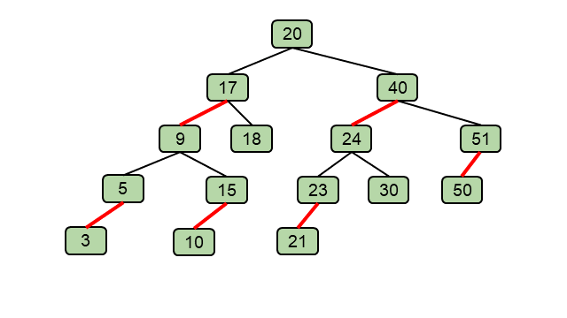{ loading=lazy }
    
        插入11
    
        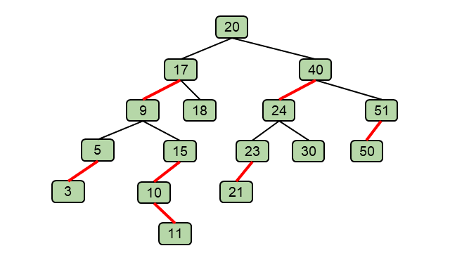{ loading=lazy }
    
        `rotateLeft(10)`
    
        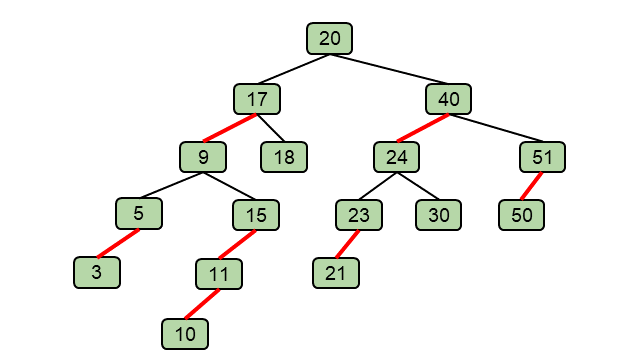{ loading=lazy }
    
        `rotateRight(15)`
    
        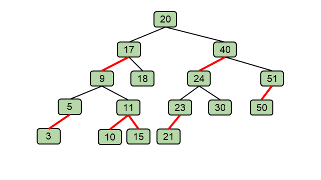{ loading=lazy }
    
        `colorFlip(11)`
    
        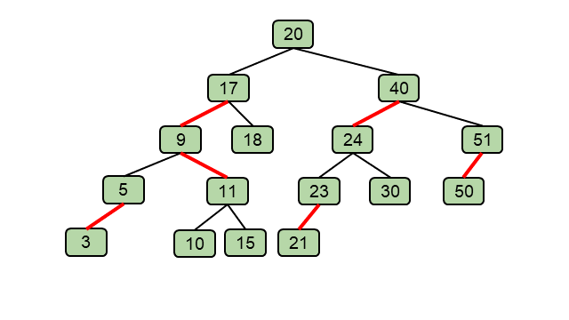{ loading=lazy }
    
        `rotateLeft(9)`
    
        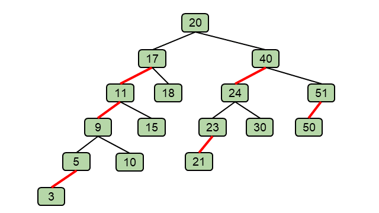{ loading=lazy }
    
        `rotateRight(17)`
    
        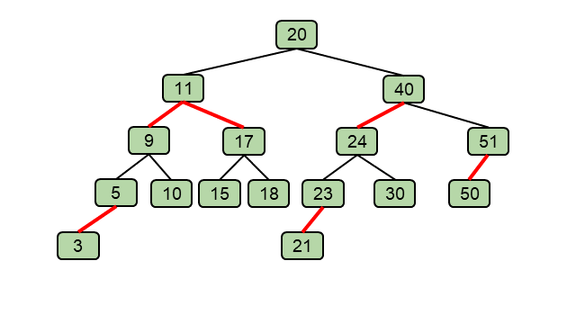{ loading=lazy }
    
        `colorFlip(11)`
    
        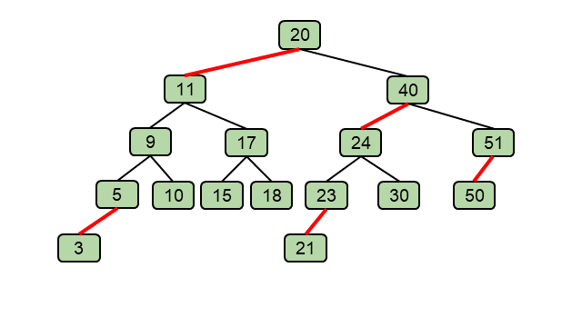{ loading=lazy }
    
    <h3>Q4.2 LLRB Height<br/><small>6 Points</small></h3>
    
    After inserting 11 and balancing the LLRB, how many nodes are on along the longest path from the root to a leaf.
    
    ```txt
    4
    ```
    
    <h3>Q4.3 Red Links<br/><small>6 Points</small></h3>
    
    After inserting 11 and balancing the LLRB, how many red links are on along the longest path from the root to a leaf.
    
    ```txt
    2
    ```
    
    <h2>Q5 Mechanical Hashing<br/><small>32 Points</small></h2>
    
    Suppose we insert the following words into an initially empty hash table, in this order: **kerfuffle**, **broom**, **hroom**, **ragamuffin**, **donkey**, **brekky**, **blob**, **zenzizenzizenzic**, and **yap**. Assume that the hash code of a String is just its length (note that this is not actually the hash code for Strings in Java). Use separate chaining to resolve collisions. Assume 4 is the initial size of the hash table array, and double this array’s size when the load factor is equal to 1. Illustrate this hash table with a box-and-pointer diagram.
    
    For each index of the final hash table, specify what Strings are stored in it. If it is empty, write NoneNone. In your final answer, **do not wrap Strings in quotes**. 
    
    If an index has more than 1 String in it, separate them using a comma and a single space. For example, if index 0 stores the Strings `one` and `two`, your answer should be `one, two`.
    
    Elements in index 0:
    
    ```txt
    
    ```
    
    Elements in index 1:
    
    ```txt
    
    ```
    
    Elements in index 2:
    
    ```txt
    
    ```
    
    Elements in index 3:
    
    ```txt
    
    ```
    
    Elements in index 4:
    
    ```txt
    
    ```
    
    Elements in index 5:
    
    ```txt
    
    ```
    
    Elements in index 6:
    
    ```txt
    
    ```
    
    Elements in index 7:
    
    ```txt
    
    ```
    
    Elements in index 8:
    
    ```txt
    
    ```
    
    Elements in index 9:
    
    ```txt
    
    ```
    
    Elements in index 10:
    
    ```txt
    
    ```
    
    Elements in index 11:
    
    ```txt
    
    ```
    
    Elements in index 12:
    
    ```txt
    
    ```
    
    Elements in index 13:
    
    ```txt
    
    ```
    
    Elements in index 14:
    
    ```txt
    
    ```
    
    Elements in index 15:
    
    ```txt
    
    ```
