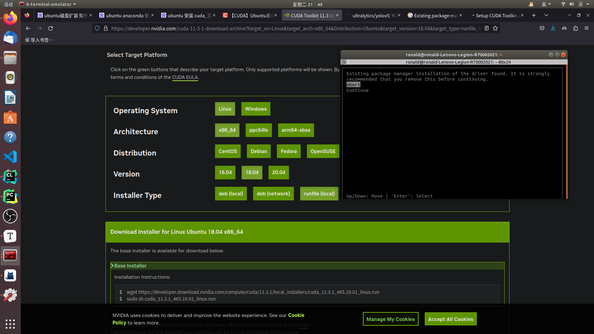

## 1 

[(7条消息) YOLOv7保姆级教程！（个人踩坑无数）----环境配置_yolov7环境搭建_AmbitionToFree的博客-CSDN博客](https://blog.csdn.net/weixin_55749226/article/details/128479694?spm=1001.2014.3001.5502)

第一次安装时，未知原因黑屏，强制关机重启之后，再次安装成功

[(7条消息) CUDA安装和检测【全】（nvcc命令找不到的解决办法）_windows nvcc -v 提示未找到命令_可靠的豆包蟹同志的博客-CSDN博客](https://blog.csdn.net/XieRuily/article/details/123670141)

安装后重新开启新的cmd，才有nvcc命令

## 2

ubuntu 安装 cuda

[(8条消息) 【CUDA】Ubuntu系统如何安装CUDA保姆级教程(2022年最新)_ubuntu cuda安装教程_自牧君的博客-CSDN博客](https://blog.csdn.net/Sihang_Xie/article/details/127347139)

> [(8条消息) Ubuntu安装cuda与cudnn，亲测可用_ubuntu安装cuda和cudnn_JulyLi2019的博客-CSDN博客](https://blog.csdn.net/JulyLi2019/article/details/125102098)

## 3

Existing package manager installation of the driver found. It is strongly recommended that you remove this before continuing.



>   Upon starting, we may be greeted with a warning stating that an existing package manager installation of the graphics driver was found. Unless you have a version of the graphics driver lower than required from this [page](https://docs.nvidia.com/cuda/cuda-toolkit-release-notes/index.html), you can choose to continue.

 [Get CUDA the right way.. (One that won’t break anything when you… | by Thameem Abbas | Medium](https://tabbas97.medium.com/get-cuda-the-right-way-c68d533bed3e)

## 4

解决安装cuda后，nvcc找不到命令

[(8条消息) 解决nvcc找不到的问题（Ubuntu16.04 CUDA 8.0）_rtygbwwwerr的博客-CSDN博客](https://blog.csdn.net/rtygbwwwerr/article/details/73656876)

修改`~/.bashrc`文件后，更新系统环境：

```bash
source ~/.bashrc
sudo ldconfig
```

## 5

安装 cudnn

[(8条消息) 基于ubuntu安装cuda,cuDNN_ubuntu安装cuda和cudnn_xyzxyz576的博客-CSDN博客](https://blog.csdn.net/u011304078/article/details/120955441)

[Installation Guide - NVIDIA Docs](https://docs.nvidia.com/deeplearning/cudnn/install-guide/index.html)

## 6

```bash
dpkg-deb: 错误: 'cudnn-local-repo-ubuntu1804-8.9.2.26_1.0-1_amd64.deb' is not a Debian format archive
```

[(8条消息) 错误: ‘containerd.io_1.4.9-1_amd64.deb‘ is not a Debian format archive_sun007700的博客-CSDN博客](https://blog.csdn.net/sun007700/article/details/123090917)

安装包没下载好

## 7

```bash
E: 未找到“libcudnn8”的“8.9.2.26-1+cuda11.3”版本
```

[E: Version '8.3.1.22-1+cuda10.2' for 'libcudnn8' was not found - Deep Learning (Training & Inference) / cuDNN - NVIDIA Developer Forums](https://forums.developer.nvidia.com/t/e-version-8-3-1-22-1-cuda10-2-for-libcudnn8-was-not-found/200801/8)

```txt
chrysophyt
22 年 4 月

*I already did
$ sudo apt-get update
, it just wont work.

In the end I went to the cudnn archive and download older version
https://developer.nvidia.com/rdp/cudnn-archive 280
```

```txt
dishant.daredevil
22 年 4 月

This might do the job.
After step -
sudo apt-key add /var/cudnn-local-repo-*/7fa2af80.pub
You will have the directory /var/cudnn-local-repo-ubuntu2004-8.4.0.27 (with your ubuntu version and cudnn downloaded)
Inside this directory, you will be having three .deb files.
just do for all the deb files-
sudo gdebi xxx.deb
which will install cudnn. ;)
```

采取旧版本安装

旧版本是runtime，dev，sample，三个分开

> 如这个：[(8条消息) Ubuntu安装cuda与cudnn，亲测可用_ubuntu安装cuda和cudnn_JulyLi2019的博客-CSDN博客](https://blog.csdn.net/JulyLi2019/article/details/125102098)

## 8

To verify that cuDNN is installed and is running properly, compile the `mnistCUDNN` sample located in the `/usr/src/cudnn_samples_v8` directory in the Debian file.

1. Copy the cuDNN samples to a writable path.

   ```bash
   cp -r /usr/src/cudnn_samples_v8/ $HOME
   ```

2. Go to the writable path.

   ```bash
   cd  $HOME/cudnn_samples_v8/mnistCUDNN
   ```

3. Compile the `mnistCUDNN`sample.

   ```bash
make clean && make        
   ```

4. Run the `mnistCUDNN` sample.

   ```bash
   ./mnistCUDNN        
   ```

If cuDNN is properly installed and running on your Linux system, you will see a message similar to the following:

```bash
Test passed!
```