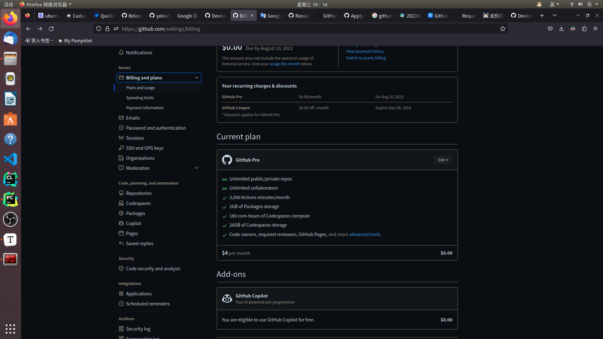
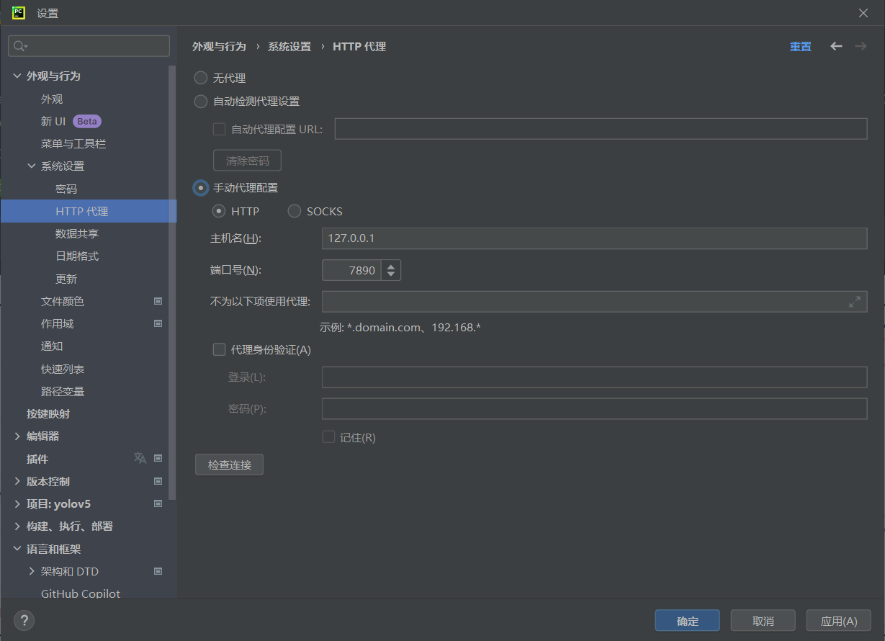

## 1



Copilot激活方式

1. 成功认证学生包后，打开GitHub，进入个人设置->Billing and plans->Plans and usage->Enable GitHub Copilot。

2. 跳转后点击Get access to GitHub Copilot就好啦。

3. 跳转后的页面选择Allow。 

## 2

pycharm、clion等ide安装github copilot插件后，无法登陆，可以在设置中设置ide的网络代理



>clash:
>
>-   主机：127.0.0.1
>-   端口：7890

## 3

使用经验：

1.   先用英文写一段注释（不会可以中文写出再用百度翻译）
2.   再回车等待copilot编写代码
3.   最后根据具体需求适当修改

示例：

想在python文件中编写一个函数将内容写入同目录下的 `latex.md` 文件

```python
# Define a function to overwrite the content in the latex.md file and open it with VSCode
```

若干次回车后

```python
# Define a function to overwrite the content in the latex.md file and open it with VSCode
def write_latex_md(content):
    with open("latex.md", "w") as f:
        f.write(content)
    os.system("code latex.md")
```