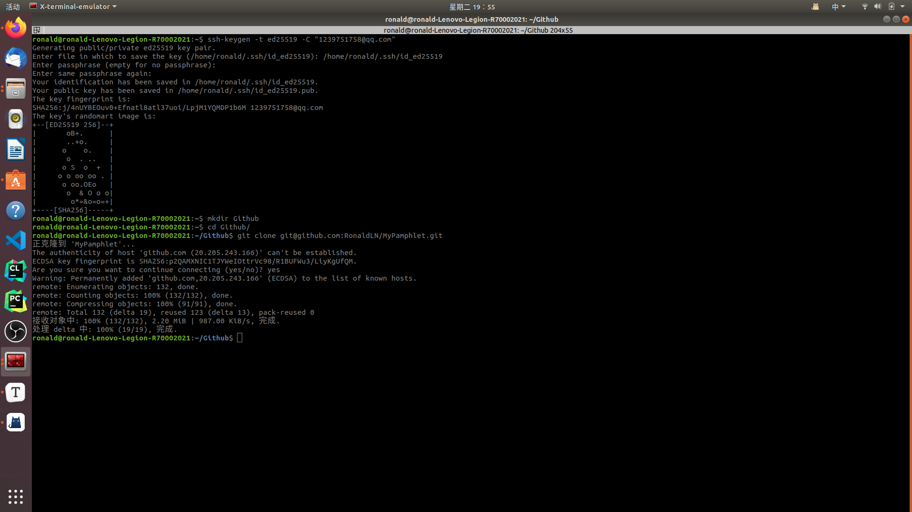

# Github & Gitee

## 1

-   gitee SSH公钥设置

    [SSH 公钥设置 | Gitee 产品文档](https://help.gitee.com/base/account/SSH公钥设置)

-   github SSH key 设置

    账户添加SSH: [Adding a new SSH key to your GitHub account - GitHub Docs](https://docs.github.com/en/authentication/connecting-to-github-with-ssh/adding-a-new-ssh-key-to-your-github-account)

    生成SSH: [Generating a new SSH key and adding it to the ssh-agent - GitHub Docs](https://docs.github.com/en/authentication/connecting-to-github-with-ssh/generating-a-new-ssh-key-and-adding-it-to-the-ssh-agent)

## 2

上传文件至仓库：

```bash
git add --all
git commit -m "..." # 会在仓库对应文件的处显示，应该是用于标记哪一次上传
git push -u origin [ master | main ]
```

## 3

gitee pages 更新需要手动点击更新，

github pages 可以自动更新

## 4

[Generating a new SSH key and adding it to the ssh-agent - GitHub Docs](https://docs.github.com/en/authentication/connecting-to-github-with-ssh/generating-a-new-ssh-key-and-adding-it-to-the-ssh-agent)



```bash
ssh-keygen -t ed25519 -C "xxx@example.com"
```

第二行填写文件要保存的位置（直接复制给的就好了），然后`passphrase`可以不设置，之后把`~/.ssh/id_ed25519.pub`中的全部复制粘贴到github设置ssh中就行了

## 5

更新本地的仓库：

```bash
git pull
```

## 6

github 仓库设置 *讨论* GitHub Discussions

[GitHub Discussions 文档 - GitHub 文档](https://docs.github.com/zh/discussions)

在 **Settings - General - Features - Discussions** 前面勾选上

就可以打开*讨论*功能了

## 7

git 代理相关问题

由于之前想在 git bash 终端中使用 clash 的代理所以在 `E:\Program Files\Git\etc\bash.bashrc` 最上方按网上说的添加了

```bash
# Clash
export http_proxy=https://127.0.0.1:7890;export https_proxy=https://127.0.0.1:7890
```

然后发现 `git clone` 在不打开 clash 的情况下会有报错

```bash
Collecting git+https://github.com/huggingface/peft.git (from -r requirements.txt (line 8))
  Cloning https://github.com/huggingface/peft.git to c:\users\administrator\appdata\local\temp\pip-req-build-t4u9g6h5
  Running command git clone --filter=blob:none --quiet https://github.com/huggingface/peft.git 'C:\Users\Administrator\AppData\Local\Temp\pip-req-build-t4u9g6h5'
  fatal: unable to access 'https://github.com/huggingface/peft.git/': Failed to connect to 127.0.0.1 port 7890 after 2032 ms: Couldn't connect to server
```

所以在网上查询相关信息，发现这篇文章

[解决git下载出现：Failed to connect to 127.0.0.1 port 1080: Connection refused拒绝连接错误-CSDN博客](https://blog.csdn.net/weixin_41010198/article/details/87929622)

可以通过(windows也可以)

```bash
git config --global http.proxy
git config --global https.proxy
```

查询 git http 和 htttps 有没有使用代理

>   文章还说到 linux 还可以使用
>
>   ```bash
>   env|grep -I proxy
>   ```
>
>   来查询系统环境有没有代理，不过windows下这个命令运行不了

**取消代理的方法**

我在 windows git bash 上使用

```bash
git config --global --unset http.proxy
git config --global --unset https.proxy
```

成功取消了代理

而文章中的另一种方法

```bash
unset http_proxy
unset ftp_proxy
unset all_proxy
unset https_proxy
unset no_proxy
```

我试了在 windows git bash 上不行，可能在linux上可以

最后我取消了代理之后 `git clone` 就不会有之前的 ` Failed to connect to 127.0.0.1 port 7890` 

>   但是没打开 clash 时，变成了
>
>   ```bash
>   fatal: unable to access 'https://github.com/huggingface/peft.git/': Failed to connect to github.com port 443 after 21065 ms: Couldn't connect to server
>   ```

## 8

git 设置代理

(因为有时可能会 git clone 不了)

[【git错误】Error: Failed to connect to github.com port 443 after 21074 ms: Timed out_Sheyami的博客-CSDN博客](https://blog.csdn.net/Sheyami/article/details/121631887)

```bash
git config --global http.proxy http://127.0.0.1:7890
git config --global https.proxy http://127.0.0.1:7890
```

## 9

>   [复现代码](https://ronaldln.github.io/MyPamphlet-Blog/2023/10/04/)

git bash 中在运行命令是，可以*环境变量(或者叫全局变量？)*，如

```bash
HF_DATASETS_OFFLINE=1 TRANSFORMERS_OFFLINE=1 \
python examples/pytorch/translation/run_translation.py --model_name_or_path t5-small --dataset_name wmt16 --dataset_config ro-en ...
```

或

```bash
# Make sure you have git-lfs installed (https://git-lfs.com)
git lfs install
git clone https://huggingface.co/decapoda-research/llama-7b-hf

# if you want to clone without large files – just their pointers
# prepend your git clone with the following env var:
GIT_LFS_SKIP_SMUDGE=1
```

## 10

可以使用 `--amend` 来修改上一次 `commit` 提交

```bash
usage: git commit [-a | --interactive | --patch] [-s] [-v] [-u<mode>] [--amend]
                  [--dry-run] [(-c | -C | --squash) <commit> | --fixup [(amend|reword):]<commit>)]
                  [-F <file> | -m <msg>] [--reset-author] [--allow-empty]
                  [--allow-empty-message] [--no-verify] [-e] [--author=<author>]
                  [--date=<date>] [--cleanup=<mode>] [--[no-]status]
                  [-i | -o] [--pathspec-from-file=<file> [--pathspec-file-nul]]
                  [(--trailer <token>[(=|:)<value>])...] [-S[<keyid>]]
                  [--] [<pathspec>...]
    ...
    --amend               amend previous commit
```

```bash
git commit --amend -m "..."
```

## 11

学习 git 的视频

[Git + GitHub 10分钟完全入门_哔哩哔哩_bilibili](https://www.bilibili.com/video/BV1KD4y1S7FL)

[Git + GitHub 10分钟完全入门 (进阶)_哔哩哔哩_bilibili](https://www.bilibili.com/video/BV1hA411v7qX)

[GitHub 到底怎么用？十分钟学会 GitHub 基础知识_哔哩哔哩_bilibili](https://www.bilibili.com/video/BV1yo4y1d7UK)
