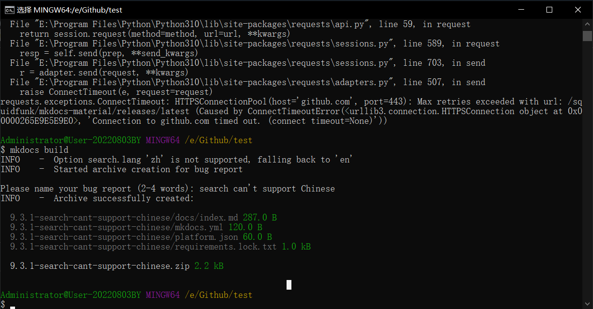

# Mkdocs (Material)

## 1

[Installation - Material for MkDocs (squidfunk.github.io)](https://squidfunk.github.io/mkdocs-material/getting-started/)

## 2

```yaml
markdown_extensions:
  - pymdownx.superfences: # mermaid画图
      custom_fences:
        - name: mermaid
          class: mermaid
          format: !!python/name:pymdownx.superfences.fence_code_format
  - attr_list # 矩形按钮/按键
  - def_list # a 无序/有序/任务 列表
  - pymdownx.tasklist: # a
      custom_checkbox: true
  - pymdownx.critic # b Formatting 含 高亮/删除线/下划线/上下角标 [等]
  - pymdownx.caret # b
  - pymdownx.keys # b
  - pymdownx.mark # b
  - pymdownx.tilde # b
  - toc: # 目录相关
      permalink: true # 每个页面内，各标题会生成各自的链接
      # title: 目录 # 修改页面右侧 Table of contents 文字
  - footnotes # 脚注
  - pymdownx.highlight: # c 代码块配置
      anchor_linenums: true
      line_spans: __span
      pygments_lang_class: true
  - pymdownx.inlinehilite # c
  - pymdownx.snippets # c
  - pymdownx.superfences # c
  - admonition # d 标注
  - pymdownx.details # d
  - pymdownx.superfences # d
  - pymdownx.emoji: # 使用emoji和icon
      emoji_index: !!python/name:material.extensions.emoji.twemoji 
      emoji_generator: !!python/name:material.extensions.emoji.to_svg
  - pymdownx.superfences # e 内容选项卡
  - pymdownx.tabbed: # e
      alternate_style: true
  - md_in_html # 在 md 文档中能显示 html 的效果
```

## 3

```yaml
theme:
  name: material # 固定
  # language: zh # 语言设置为中文(会改变搜索栏/最后修改 等文字)，默认为英文
  logo: assets/logo.jpg # 页面中顶部栏左侧图标
  favicon: assets/favicon.jpg # 浏览器页面标签图标
  custom_dir: overrides # html源代码扩展文件夹
  features:
    - navigation.expand # 目录自动展开子目录
    # - toc.integrate # 右边的toc融合到左侧的目录中
    - toc.follow # 右侧toc随着页面滑动自动滑动
    - navigation.top # 有回到页面最上方top的按键
    - search.suggest # 搜索建议
    - navigation.footer # 页面底部有下一页的链接(按目录上的顺序)
    - navigation.tabs # 一级目录融合至顶栏，并且只展示二级目录
    - content.code.copy # 代码块复制按键
    - search.suggest # 搜索建议
    - search.highlight # 搜索结果高亮/突出显示
    - search.share # 搜索结果分享
```

## 4

昼夜模式切换按键

```yaml
theme:
  palette: 

    # Palette toggle for light mode
    - media: "(prefers-color-scheme: light)"
      scheme: default
      toggle:
        icon: material/weather-night # 图标(可改，下同)
        name: Switch to dark mode

    # Palette toggle for dark mode
    - media: "(prefers-color-scheme: dark)"
      scheme: slate
      toggle:
        icon: material/weather-sunny
        name: Switch to light mode
```

## 5

目录

```yaml
nav:
  - 一级目录a: "a.md"
  - 一级目录b: "b.md"
  - 一级目录c: # 有子目录不能包含链接
    - 二级目录aa: "aa.md"
    - 二级目录ab: 
      - 三级目录aaa: "aaa.md"
  - 一级目录d: "d.md"
  ...
```

## 6

```yaml
plugins:
  # - blog: # 设置blog
  #     blog_dir: . # 设置blog对应的路径
  #     blog_toc: true # 设置blog索引页面的目录
  #     post_date_format: full # 设置blog索引页面的日期格式
  #     archive_toc: true
  #     categories_toc: true
  #     pagination_format: "$link_first $link_previous ~2~ $link_next $link_last" # 设置blog索引页面的分页格式
  #     pagination_keep_content: true # 设置blog索引页面的分页内容
  #     draft_if_future_date: true # 设置如果blog的日期是未来的话，就会被当成草稿不会被发布
  - i18n: # 语言切换 (需要放在 git-revision-date-localized 之前)
    # v0.5.6
      # default_language: en
      # material_alternate: true
      # languages:
      #   zh:
      #     name: 简体中文
      #     build: true
      #   en:
      #     name: English labels (英文标签)
      #     build: false
    # v1.0.3
      reconfigure_search: false
      languages:
          - locale: zh
            name: 简体中文
            build: true
            default: false
          - locale: en
            name: English labels (英文标签)
            build: true
            default: true
  - git-revision-date-localized: # 页面下方创建和修改时间
      enable_creation_date: true
      type: timeago
  - glightbox # 图片放大
  - search: # 搜索(支持中文、英文)
      # separator: '[\s\-,:!=\[\]()"/]+|(?!\b)(?=[A-Z][a-z])|\.(?!\d)|&[lg]t;'
      separator: '[\\s\\u200b\\u3000\\-、。，．？！；\s\-,:!=\[\]()"/]+|(?!\b)(?=[A-Z][a-z])|\.(?!\d)|&[lg]t;'
      # jieba_dict: jieba_dict/dict.txt.big
      # jieba_dict_user: jieba_dict/user_dict.txt
      lang: 
        # - zh
        - ja
        - en
  # - tags # 添加给单个文档添加tag标签
  - statistics # 统计页面字数、代码行数、阅读时间
```

-   [语言切换](#17)
-   [页面下方创建和修改时间](#13)
-   [图片放大](#14)

## 7

右上角github仓库

[Adding a git repository - Material for MkDocs (squidfunk.github.io)](https://squidfunk.github.io/mkdocs-material/setup/adding-a-git-repository/)

```yaml
repo_url: https://github.com/RonaldLN/Project-Application-Form-of-AIGC
repo_name: Project-Application-Form-of-AIGC
```

## 8

上传到`github`、`gitee`仓库：

```bash
mkdocs gh-deploy --force
```

(该命令只上传site文件夹至gh-pages分支，若是github仓库，会自动选择gh-pages分支生成github pages页面)

## 9

添加 KaTeX 公式书写

`docs/javascripts/katex.js`:

```js
document$.subscribe(({ body }) => { 
  renderMathInElement(body, {
    delimiters: [
      { left: "$$",  right: "$$",  display: true },
      { left: "$",   right: "$",   display: false },
      { left: "\\(", right: "\\)", display: false },
      { left: "\\[", right: "\\]", display: true }
    ],
  })
})
```

`mkdocs.yml`:

```yaml
extra_javascript:
  - javascripts/katex.js 
  - https://cdnjs.cloudflare.com/ajax/libs/KaTeX/0.16.7/katex.min.js  
  - https://cdnjs.cloudflare.com/ajax/libs/KaTeX/0.16.7/contrib/auto-render.min.js

extra_css:
  - https://cdnjs.cloudflare.com/ajax/libs/KaTeX/0.16.7/katex.min.css
```

## 10

放在 `/doc`内子文件夹里的md文件会根据该子文件夹名自动生成一级目录（如果没有自定义目录）

## 11

添加谷歌分析

```yaml
extra:
  analytics:
    provider: google
    property: G-xxxxxxxxxx
```

## 12

图像延迟加载

在每个图像后加上 `{ loading=lazy }` 

```markdown
{ loading=lazy }
```

## 13

设置每个文章底部显示创建和更新时间

[Adding a git repository - Material for MkDocs (squidfunk.github.io)](https://squidfunk.github.io/mkdocs-material/setup/adding-a-git-repository/?h=contributor#document-dates)

添加包：

```bash
pip install mkdocs-git-revision-date-localized-plugin
```

添加到 `mkdocs.yml`:

```yaml
plugins:
  - git-revision-date-localized:
      enable_creation_date: true
      type: timeago
```

## 14

图片缩放功能/点击放大

[Images - Material for MkDocs (squidfunk.github.io)](https://squidfunk.github.io/mkdocs-material/reference/images/#lightbox)

`pip`:

```bash
pip install mkdocs-glightbox
```

`mkdocs.yml`:

```yaml
plugins:
  - glightbox
```

>   插件官方使用文档：
>
>   [blueswen/mkdocs-glightbox: A MkDocs plugin supports image lightbox (zoom effect) with GLightbox. (github.com)](https://github.com/blueswen/mkdocs-glightbox#usage)

## 15

添加版权信息

```yaml
copyright: Copyright © 2023 - 2023 Ronald Luo
```

## 16

搜索

```yaml
theme:
    ...
    features:
 	...
    - search.suggest # 搜索建议
    - search.highlight # 搜索结果高亮/突出显示
    - search.share # 搜索结果分享

plugins:
  ...
  - search: # 搜索(选择支持中文、英文)
      separator: '[\s\-,:!=\[\]()"/]+|(?!\b)(?=[A-Z][a-z])|\.(?!\d)|&[lg]t;'
      lang: 
        # - zh
        - ja
        - en
```

中文暂不支持，可以选择日文( `ja` )代替

>   中文支持(即将)
>
>   >   [Setting up site search - Material for MkDocs (squidfunk.github.io)](https://squidfunk.github.io/mkdocs-material/setup/setting-up-site-search/#chinese-language-support)
>
>   为了在[内置搜索插件](https://squidfunk.github.io/mkdocs-material/setup/setting-up-site-search/#built-in-search-plugin)中添加对中文的支持，请通过 `pip` 安装 [jieba](https://pypi.org/project/jieba/) 文本分割库，插件将通过分句器运行所有文本：
>
>   ```bash
>   pip install jieba
>   ```

搜索建议功能：

>   启用搜索建议后，搜索将显示最后一个单词的最可能完成情况，该单词可以通过 ++arrow-right++ 键填充

## 17

语言切换

>   参考
>
>   [cs-self-learning/mkdocs.yml at master · PKUFlyingPig/cs-self-learning (github.com)](https://github.com/PKUFlyingPig/cs-self-learning/blob/master/mkdocs.yml)

需要安装 `mkdocs-static-i18n` 包

```bash
pip install mkdocs-static-i18n
```

并且在 `mkdocs.yml` 中 `plugins:` 里 `- i18n:` 需要写在 `git-revision-date-localized` 之前

>   报错信息：
>
>   ```bash
>   Error: [git-revision-date-localized] should be defined after the i18n plugin in your mkdocs.yml file. This is because i18n adds a 'locale' variable to markdown pages that this plugin supports.
>   ```

并且添加了i18n需要注释掉 `theme:` 中的 `language:` 

此外，

若想添加对应语言版本的文档，比如 `index.md` 的中文版，则在相同路径下创建 `index.zh.md` 进行编写

>   参考
>
>   [cs-self-learning/docs at master · PKUFlyingPig/cs-self-learning (github.com)](https://github.com/PKUFlyingPig/cs-self-learning/tree/master/docs)
>
>   ---
>
>   [ultrabug/mkdocs-static-i18n: MkDocs i18n plugin using static translation markdown files (github.com)](https://github.com/ultrabug/mkdocs-static-i18n/)

**==`mkdocs-static-i18n插件版本更新==**:

1.0.0之后的版本，似乎**配置格式改变**了，[cs-self-learning/docs at master · PKUFlyingPig/cs-self-learning (github.com)](https://github.com/PKUFlyingPig/cs-self-learning/tree/master/docs) 这里面使用的格式可能是旧版的，新版的配置格式可以见[Setting up languages - MkDocs static i18n plugin documentation (en) (ultrabug.github.io)](https://ultrabug.github.io/mkdocs-static-i18n/setup/setting-up-languages/#option-languages)：

```yaml
- i18n:
      reconfigure_search: false
      languages:
          - locale: zh
            name: 简体中文
            build: true
            default: false
          - locale: en
            name: English labels (英文标签)
            build: true
            default: true
```

由于应该是去除了 `default_language` 这个选项，所以默认语言需要在语言里面单独设置，**默认语言需要将 `build` 和 `default` 都设置为 `true`** ，否则会报错。

(新版中 `default_language` 和 `material_alternate` 两个选项都已经不能用，如果配置会报错)

此外，由于 mkdocs-material 本身的搜索功能不支持中文 `zh` ，因此需要将 `reconfigure_search` 设置为 `false` 

[Setting up search - MkDocs static i18n plugin documentation (en) (ultrabug.github.io)](https://ultrabug.github.io/mkdocs-static-i18n/setup/setting-up-search/)

[26](#26)记录的询问过程中涉及到了这个问题

## 18

添加自定义的代码

>   [javascript - How to add script to head tag in MkDocs? - Stack Overflow](https://stackoverflow.com/questions/61832890/how-to-add-script-to-head-tag-in-mkdocs)
>
>   [Customization - Material for MkDocs (squidfunk.github.io)](https://squidfunk.github.io/mkdocs-material/customization/#overriding-blocks)

以添加百度统计的代码为例：

先在 `mkdocs.yml` 中添加以下内容

```yaml
theme:
  ...
  custom_dir: overrides
```

>   [Customization - Material for MkDocs (squidfunk.github.io)](https://squidfunk.github.io/mkdocs-material/customization/#extending-the-theme)

并且在 `mkdocs.yml` 相同路径下创建 `overrides` 文件夹

再在该文件夹中创建 `main.html` 文件

```txt
.
├─ overrides/
│  └─ main.html
└─ mkdocs.yml
```

并在该文件中添加如下内容：

```html



  <!-- 从 百度统计-代码获取 中获取的代码 -->
  <script>
    var _hmt = _hmt || [];
    (function() {
      var hm = document.createElement("script");
      hm.src = "https://hm.baidu.com/hm.js?xxxxxxxxxxxxxxxxxxxxxxxxxxxxxxxx";
      var s = document.getElementsByTagName("script")[0]; 
      s.parentNode.insertBefore(hm, s);
    })();
    </script>

```

>   如果要追加(而不是覆写)，需要添加 `{{ super() }}` 来包含原有代码，如
>
>   ```html
>   
>   
>   
>     <!-- Add scripts that need to run before here -->
>     {{ super() }}
>     <!-- Add scripts that need to run afterwards here -->
>   
>   
>   ```
>
>   (由于 `extrahead` 本身就为空，
>
>   >   ***Empty block to add custom meta tags***
>
>   所以不需要包含原有代码，可以直接覆写)

## 19

>   [Setting up the footer - Material for MkDocs (squidfunk.github.io)](https://squidfunk.github.io/mkdocs-material/setup/setting-up-the-footer/#+social.link)

添加social links时，(以及logo和git仓库图标)可以更改icon

```yaml
extra:
  social:
    - icon: simple/github
      link: https://github.com/RonaldLN
    - icon: simple/gitee
      link: https://gitee.com/ronald-luo
    - icon: material/email-fast
      link: mailto:<ln12142325@mail.nwpu.edu.cn>
```

可用的icon可以在

[Icons, Emojis - Material for MkDocs (squidfunk.github.io)](https://squidfunk.github.io/mkdocs-material/reference/icons-emojis/#search)

中查询，

但在写入 `mkdocs.yml` 时需要适当修改，如

-   :octicons-mail-16: `:octicons-mail-16:` 改为 `octicons/mail-16`
-   :material-email-fast: `:material-email-fast:` 改为 `material/email-fast`
-   :simple-github: `:simple-github:` 改为 `simple/github`

## 20

>   [Content tabs - Material for MkDocs (squidfunk.github.io)](https://squidfunk.github.io/mkdocs-material/reference/content-tabs/#usage)

内容选项卡

`mkdocs.yml`:

```yaml
markdown_extensions:
  - pymdownx.superfences
  - pymdownx.tabbed:
      alternate_style: true 
```

>   示例
>
>   ```markdown
>   === "Unordered list"
>   
>       * Sed sagittis eleifend rutrum
>       * Donec vitae suscipit est
>       * Nulla tempor lobortis orci
>   
>   === "Ordered list"
>   
>       1. Sed sagittis eleifend rutrum
>       2. Donec vitae suscipit est
>       3. Nulla tempor lobortis orci
>   
>   ```

## 21

小技巧

如果 内容选项卡 或者 告诫/信息 不能在有序列表中显示(或 有序列表因为 内容选项卡 或者 告诫/信息 被中断)，如

```markdown
1.   步骤一

     !!! note

         ...

2.   步骤二

     ...
```

1.   步骤一

     !!! note

         ...

2.   步骤二

     ...

则可以借助 引用 `> `

```markdown
1.   步骤一

     > !!! note
     > 
     >     ...
     
     &nbsp;
     
     > === "tab"
     > 
     >     ...

2.   步骤二

     ...
```

1.   步骤一

     > !!! note
     > 
     >     ...
     
     &nbsp;
     
     > === "tab"
     > 
     >     ...

2.   步骤二

     ...

## 22

小技巧

在typora中

```markdown
>   ...

>   ...
```

会显示成两个分开的引用

而在 material for mkdocs 生成的页面中，会合成一个连着的引用

**处理技巧** 可以用 `&nbsp;` (好像是html中的空格)来分开两个引用：

```markdown
>   ...

&nbsp;

>   ...
```

## 23

用 material for mkdocs 在 github 或 gitee 上部署静态网页的(我的)方法：

1.   先在 github 或 gitee 上创建一个新的仓库(可以选择自动添加README.md文件，因为这样会自动创建出 main 或 master 分支)
2.   然后将仓库 `git clone` 到本地中
3.   再在命令行中 `mkdocs new xxx` 那个文件夹
4.   最后添加md文档文件，再部署到仓库即可

## 24

关于mkdocs-material的tag功能

>   [Setting up tags - Material for MkDocs (squidfunk.github.io)](https://squidfunk.github.io/mkdocs-material/setup/setting-up-tags/)

(个人猜测)其作用在于，能够在每个页面的第一个标题上方显示一个或多个 *标签* (好像只能在页面的上方)，以及在搜索时，含有对应标签的网页/文档下也会显示出该标签(这个有利于搜索文档，或者文档分类)

然后还有一个功能是，能设置一个文档成为 *标签索引页* ([Setting up tags - Material for MkDocs (squidfunk.github.io)](https://squidfunk.github.io/mkdocs-material/setup/setting-up-tags/#adding-a-tags-index))，能显示标签被哪些页面/文档包含了

[Tags support 🆕 · Issue #2593 · squidfunk/mkdocs-material (github.com)](https://github.com/squidfunk/mkdocs-material/issues/2593)

这个网页能看到一些效果

## 25

中文的搜索支持

>   [Setting up site search - Material for MkDocs (squidfunk.github.io)](https://squidfunk.github.io/mkdocs-material/setup/setting-up-site-search/#chinese-language-support)

需要从jieba github仓库中下载 `dict.txt` 或 `dict.txt.small` 或 `dict.txt.big` 文件，然后放到本地项目中

`mkdocs.yml` 中，

```yaml
plugins:
  - search:
      jieba_dict: dict.txt 
      jieba_dict_user: user_dict.txt
```

`dict.txt` 和 `user_dict.txt` 两处对应的是 `mkdocs.yml` 文件的位置，所以如果将这两个路径替换成别的路径，根目录应该是 `mkdocs.yml` 的目录

并且**要去除掉 `lang` 选项**(具体可见[26](#26))

## 26

[一次报告错误的经历](https://ronaldln.github.io/MyPamphlet-Blog/2023/09/11/github/)

>   2023-09-11

[Why does mkdocs-material display unsupported Chinese when running the mkdocs gh-deploy -- force command · squidfunk/mkdocs-material · Discussion #5992 (github.com)](https://github.com/squidfunk/mkdocs-material/discussions/5992)

**stage 1**

作者让创建一个*最小复制件*然后上传，

[Creating a reproduction - Material for MkDocs (squidfunk.github.io)](https://squidfunk.github.io/mkdocs-material/guides/creating-a-reproduction/#creating-a-reproduction)

我大致的操作过程是，创建一个新的mkdocs项目，然后按文档说的 在 `mkdocs.yml` 文件中添加必要的配置，

-   ```yaml
    theme:
      name: material
    ```

    基本上必须的

-   ```yaml
    plugins:
      - search:
          jieba_dict: jieba_dict/dict.txt.big
          jieba_dict_user: jieba_dict/user_dict.txt
          lang: 
            - zh
    ```

    报错的地方

然后 `mkdocs build` 一下，出现了报错，(如果没有应该就是继续按原来的配置添加可能导致报错的配置，不断尝试直到出现报错)

再按文档说的，添加生成错误报告的插件

```yaml
plugins:
  - info
```

最后再 `mkdocs build` 一次，但是这次需要能连接上 github (要挂梯子)，然后会在项目根目录生成一个 zip 文件

{ loading=lazy }

---

**stage 2**

作者[回复](https://github.com/squidfunk/mkdocs-material/discussions/5992?sort=old#discussioncomment-6981166)，将 `search` 中的 `lang` 选项全部去除即可

但在我去除后，仍产生了一行报错

```bash
...
WARNING - Language 'zh' is not supported by Lunr.js, not setting it in the 'plugins.search.lang' option
...
```

怀疑是由于使用了语言切换的插件 `i18n` 中设置的 `zh` 导致的，

将插件的配置代码注释掉之后，再次配置，发现报错信息消失(所以确定报错信息是由于在i18n插件中设置了 `zh` 相关的配置产生的)

在查看了 `mkdocs-static-i18n` 的官方文档([Installation - MkDocs static i18n plugin documentation (en) (ultrabug.github.io)](https://ultrabug.github.io/mkdocs-static-i18n/getting-started/installation/))之后，发现插件有个选项可以不更改mkdocs-material原有的内置search插件的配置

[Setting up search - MkDocs static i18n plugin documentation (en) (ultrabug.github.io)](https://ultrabug.github.io/mkdocs-static-i18n/setup/setting-up-search/)

然后发现这是新版本才有的选项，所以将原有版本 `v0.5.6` 更新为 `v1.0.3` ，但新版本的语言配置也改变，[Setting up languages - MkDocs static i18n plugin documentation (en) (ultrabug.github.io)](https://ultrabug.github.io/mkdocs-static-i18n/setup/setting-up-languages/#option-languages)，

(其余的一些关于新版变化的发现可见于[18](#18))

经过调整和选项的设置，最后报错信息消失了。

但是搜索功能的中文分割仍然不能用，向作者[再次询问](https://github.com/squidfunk/mkdocs-material/discussions/5992?sort=old#discussioncomment-6984967)

---

**stage 3**

作者[回复](https://github.com/squidfunk/mkdocs-material/discussions/5992#discussioncomment-6986083)他尝试了，可以正常使用

经过尝试，发现需要将 `theme` 设置中的 `language` 设置成 `zh` 才能使搜索的中文支持正常(不加就不行)，并向作者[反映](https://github.com/squidfunk/mkdocs-material/discussions/5992#discussioncomment-6986308)

作者回复，因为设置了 `language: zh` 会自动配置*搜索分割(search separator)*，如果没有设置 `language: zh` ，则需要**手动添加相应的*搜索分割(search separator)***，参考[Chinese search support - Material for MkDocs (squidfunk.github.io)](https://squidfunk.github.io/mkdocs-material/blog/2022/05/05/chinese-search-support/#configuration)

但是我看到他给出的[github里的文件](https://github.com/squidfunk/mkdocs-material/blob/502a517e2e7774c0518a60f0c8bf502b25671284/src/partials/languages/zh.html#L56)里，设置的的分割要更多( `  "search.config.separator": "[\\s\\u200b\\u3000\\-、。，．？！；]+",` )，所以我选取了那个文件里的配置添加到我的 `mkdocs.yml` 文件里

```yaml
  - search:
      separator: '[\\s\\u200b\\u3000\\-、。，．？！；\s\-,:!=\[\]()"/]+|(?!\b)(?=[A-Z][a-z])|\.(?!\d)|&[lg]t;'
```

>   原本为：
>
>   ```yaml
>     - search:
>         separator: '[\s\-,:!=\[\]()"/]+|(?!\b)(?=[A-Z][a-z])|\.(?!\d)|&[lg]t;'
>   ```

经过测试，搜索中文支持能够正常使用，并且 `i18n` 插件也能正常使用

## 27

[中文搜索支持](https://squidfunk.github.io/mkdocs-material/setup/setting-up-site-search/#chinese-language-support)感觉不是很好用，所以用回了原来的配置

```yaml
  - search: # 搜索(选择支持中文、英文)
      separator: '[\u200b\u3000\-、。，．？！；\s\-,:!=\[\]()"/]+|(?!\b)(?=[A-Z][a-z])|\.(?!\d)|&[lg]t;'
      # jieba_dict: jieba_dict/dict.txt.big
      # jieba_dict_user: jieba_dict/user_dict.txt
      lang: 
        # - zh
        - ja
        - en
```

## 28

[配置blog的过程记录](https://ronaldln.github.io/MyPamphlet-Blog/2023/09/13/mkdocs-material-blog/)

[Setting up a blog - Material for MkDocs (squidfunk.github.io)](https://squidfunk.github.io/mkdocs-material/setup/setting-up-a-blog/)

先配置好，再发布blog

设置blog插件：

```yaml
plugin:
  - blog
```

并创建相应的目录结构：

```bash
.
├─ docs/
│  └─ blog/
│     ├─ posts/
│     └─ index.md
└─ mkdocs.yml
```

并将 `blog` 路径下的 `index.md` 添加到 `mkdocs.yml` 目录的配置中：

```yaml
nav:
  - Blog:
    - blog/index.md 
```

默认配置下，blog对应的目录是上面目录结构中的 `blog/` ，

如果要自定义blog的目录，比如要设置*独立的blog*，可以将 `blog-dir` 设置成 `.` ：

```yaml
plugins:
  - blog:
      blog_dir: .
```

那么如果其他的路径使用默认的设置的话，文件结构应该变成

```bash
.
├─ docs/
│  ├─ posts/
│  └─ index.md
└─ mkdocs.yml
```

那么之前的目录的设置应该改成

```yaml
nav:
  - Blog:
    - index.md 
```

`post_dir` 参数同理

最终我的配置：

```yaml
nav:
  - Blog:
    - index.md 

plugins:
  - blog: # 设置blog
      blog_dir: . # 设置blog对应的路径
      blog_toc: true # 设置blog索引页面的目录
      post_date_format: full # 设置blog索引页面的日期格式
      archive_toc: true
      categories_toc: true
      pagination_format: "$link_first $link_previous ~2~ $link_next $link_last" # 设置blog索引页面的分页格式
      pagination_keep_content: true # 设置blog索引页面的分页内容
      draft_if_future_date: true # 设置如果blog的日期是未来的话，就会被当成草稿不会被发布
```

在post对应的目录中创建blog文档(默认为 `{blog}/posts` )，

```markdown
---
draft: false
date: 2023-09-11
authors:
  - ronald_luo
categories:
  - Configure & Debug
---

# 一次在github上询问作者的经历

>   2023-09-11

[Why does mkdocs-material display unsupported Chinese when running the mkdocs gh-deploy -- force command · squidfunk/mkdocs-material · Discussion #5992 (github.com)](https://github.com/squidfunk/mkdocs-material/discussions/5992)

<!-- more -->

## **stage 1**

作者让创建一个*最小复制件*然后上传，

...
```

-   `draft` : 是否设置成草稿，只有预览会构建，发布不会构建
-   `date` : 日期
-   `authors` : 选择一个或多个 `.author.yml` 文件中已有的作者
-   `categories` : 选择分类
-   `<!-- more -->` : 摘要设置，主页中只显示代码之前的内容

**注意：一级标题只能设置一个，否则目录不会显示**

[How can I make the table of content appear for each post in my blog? · squidfunk/mkdocs-material · Discussion #5998 (github.com)](https://github.com/squidfunk/mkdocs-material/discussions/5998#discussioncomment-6993353)

>   其余一些选项
>
>   [Adding categories](https://squidfunk.github.io/mkdocs-material/setup/setting-up-a-blog/#adding-categories)
>
>   设置分类比较简单 易懂
>
>   [Adding tags](https://squidfunk.github.io/mkdocs-material/setup/setting-up-a-blog/#adding-tags)
>
>   添加tags在我的尝试过程中只能在搜索结果中显示tag，文章顶部并不能显示tag，感觉实用性不是很高，所以就没有添加这个东西
>
>   [Setting the reading time](https://squidfunk.github.io/mkdocs-material/setup/setting-up-a-blog/#setting-the-reading-time)
>
>   阅读时间在blog插件里内置有这个功能，不用设置也能显示阅读时间，但是如果认为不准的话，可以自己对单篇blog设置阅读时间而覆盖掉自动计算的

## 29

[更改和配置自定义的网页颜色的记录](https://ronaldln.github.io/MyPamphlet-Blog/2023/09/16/mkdocs-material/#mkdocs-material)

如果只需修改顶部栏的颜色和鼠标放置处的链接的强调色，并且不使用自定义的颜色，那么根据官方文档中的指示，

[Changing the colors - Material for MkDocs (squidfunk.github.io)](https://squidfunk.github.io/mkdocs-material/setup/changing-the-colors/)

在 `mkdocs.yml` 添加相应的配置即可

**配置自定义的网页主题(网页包括底色、顶部栏颜色、强调色)**

在对应路径新建文件 `docs/stylesheets/extra.css` 

并在 `mkdocs.yml` 中添加：

```yaml
extra_css:
  - stylesheets/extra.css
```

[颜色计算器 - 在线颜色工具 - PhotoKit.com](https://photokit.com/colors/color-calculator/?lang=zh)

这个网站能查询颜色的HSL、HSV、HEX、RGB等对应的值

**css文件中的设置代码**：

-   **深色主题**：

    我是直接从mkdocs构建的网页的css文件中复制了默认 `slate` 主题的配置代码并稍加修改得到我自定义的主题配置代码：

    ```css
    [data-md-color-scheme="forest-dark"] {
      --md-hue: 221;
      --md-default-fg-color: hsla(var(--md-hue), 75%, 95%, 1);
      --md-default-fg-color--light: hsla(var(--md-hue), 75%, 90%, 0.62);
      --md-default-fg-color--lighter: hsla(var(--md-hue), 75%, 90%, 0.32);
      --md-default-fg-color--lightest: hsla(var(--md-hue), 75%, 90%, 0.12);
      --md-default-bg-color: hsla(var(--md-hue), 45%, 22%, 1);
      --md-default-bg-color--light: hsla(var(--md-hue), 45%, 22%, 0.54);
      --md-default-bg-color--lighter: hsla(var(--md-hue), 45%, 22%, 0.26);
      --md-default-bg-color--lightest: hsla(var(--md-hue), 45%, 22%, 0.07);
      --md-code-fg-color: hsla(var(--md-hue), 18%, 86%, 1);
      --md-code-bg-color: hsla(var(--md-hue), 45%, 16%, 1);
      --md-code-hl-color: #4287ff26;
      --md-code-hl-number-color: #e6695b;
      --md-code-hl-special-color: #f06090;
      --md-code-hl-function-color: #c973d9;
      --md-code-hl-constant-color: #9383e2;
      --md-code-hl-keyword-color: #6791e0;
      --md-code-hl-string-color: #2fb170;
      --md-code-hl-name-color: var(--md-code-fg-color);
      --md-code-hl-operator-color: var(--md-default-fg-color--light);
      --md-code-hl-punctuation-color: var(--md-default-fg-color--light);
      --md-code-hl-comment-color: var(--md-default-fg-color--light);
      --md-code-hl-generic-color: var(--md-default-fg-color--light);
      --md-code-hl-variable-color: var(--md-default-fg-color--light);
      --md-typeset-color: var(--md-default-fg-color);
      --md-typeset-a-color: var(--md-primary-fg-color);
      --md-typeset-mark-color: #ffb7424d;
      --md-typeset-kbd-color: hsla(var(--md-hue), 15%, 94%, 0.12);
      --md-typeset-kbd-accent-color: hsla(var(--md-hue), 15%, 94%, 0.2);
      --md-typeset-kbd-border-color: hsla(var(--md-hue), 15%, 14%, 1);
      --md-typeset-table-color: hsla(var(--md-hue), 75%, 95%, 0.12);
      --md-typeset-table-color--light: hsla(var(--md-hue), 75%, 95%, 0.035);
      --md-admonition-fg-color: var(--md-default-fg-color);
      --md-admonition-bg-color: var(--md-default-bg-color);
      --md-footer-bg-color: hsla(var(--md-hue), 15%, 12%, 0.87);
      --md-footer-bg-color--dark: hsla(var(--md-hue), 15%, 10%, 1);
      --md-shadow-z1: 0 0.2rem 0.5rem #0003, 0 0 0.05rem #0000001a;
      --md-shadow-z2: 0 0.2rem 0.5rem #0000004d, 0 0 0.05rem #00000040;
      --md-shadow-z3: 0 0.2rem 0.5rem #0006, 0 0 0.05rem #00000059;
      color-scheme: dark;
    
      --md-primary-fg-color: hsl(30, 78%, 61%);
      --md-primary-fg-color--light: hsl(38, 91%, 82%);
      --md-primary-fg-color--dark: hsl(25, 26%, 34%);
      --md-primary-bg-color: #fff;
      --md-primary-bg-color--light: #ffffffb3;
    
      --md-typeset-a-color: var(--md-primary-fg-color);
    
      --md-accent-fg-color: hsl(36, 100%, 45%);
      --md-accent-fg-color--transparent: #f500561a;
      --md-accent-bg-color: #fff;
      --md-accent-bg-color--light: #ffffffb3;
    }
    ```

    **网页底色推荐采用HSL模式设置颜色**，因为原始的代码中，单独将“H”(hue)设置为一个参数 `--md-hue` ，然后再其他属性中直接使用这个参数来配置相应的网页颜色属性

    **与网页底色相关的属性有**：

    -   `--md-hue` ：设置底色的**色相(Hue)**，范围为 0 - 360

    -   ```css
          --md-default-bg-color: hsla(var(--md-hue), 45%, 22%, 1);
          --md-default-bg-color--light: hsla(var(--md-hue), 45%, 22%, 0.54);
          --md-default-bg-color--lighter: hsla(var(--md-hue), 45%, 22%, 0.26);
          --md-default-bg-color--lightest: hsla(var(--md-hue), 45%, 22%, 0.07);
        ```

        `--md-default-bg-color` 对应的就是网页的底色，`45%` 对应的位置是**HSL**中的**S**饱和度，`22%` 对应的位置是**HSL**中的**L**亮度，另外三个属性暂不知道对应的颜色在哪里，但介于名字，所以认为这四个属性是一块的

    -   `  --md-code-bg-color` 设置代码块的底色，参数与 `--md-default-bg-color` 一样，深色模式下，代码块的底色的亮度一般设置成网页底色的亮度 -6%

    **与顶部栏颜色相关的属性**：

    ```css
      --md-primary-fg-color: hsl(30, 78%, 61%);
      --md-primary-fg-color--light: hsl(38, 91%, 82%);
      --md-primary-fg-color--dark: hsl(25, 26%, 34%);
      --md-primary-bg-color: #fff;
      --md-primary-bg-color--light: #ffffffb3;
    
      --md-typeset-a-color: var(--md-primary-fg-color);
    ```

    `--md-primary-fg-color` 是直接决定顶部栏颜色的属性，用HSL(如 `hsl(30, 78%, 61%)` )，HEX(如 `#db9aa5` )形式都可以设置颜色

    `--md-primary-fg-color--light` 和 `--md-primary-fg-color--dark` 虽然还不知道这两个有什么用，但是我参考[官方文档](https://squidfunk.github.io/mkdocs-material/setup/changing-the-colors/#custom-color-schemes)以及默认slate主题对应的css文件中的部分，将light设置成同色系的浅色，dark设置成同色系的深色，如上面的代码(设置的是黄色色系)

    `--md-typeset-a-color` 是设置链接等地方的颜色，直接将其设置成与顶部栏颜色一致即可：

    ```css
      --md-typeset-a-color: var(--md-primary-fg-color);
    ```

    **与*强调色*相关的属性**：

    ```css
      --md-accent-fg-color: hsl(36, 100%, 45%);
      --md-accent-fg-color--transparent: #f500561a;
      --md-accent-bg-color: #fff;
      --md-accent-bg-color--light: #ffffffb3;
    ```

    只用修改 `--md-accent-fg-color` 属性即可

-   **浅色主题**：

    下面是我目前(其中一个主题)的设置：

    ```css
    [data-md-color-scheme="forest"] {
      --md-hue: 82;
      --md-default-bg-color: hsla(var(--md-hue), 93%, 90%, 1);
      --md-default-bg-color--light: hsla(var(--md-hue), 93%, 90%, 0.54);
      --md-default-bg-color--lighter: hsla(var(--md-hue), 93%, 90%, 0.26);
      --md-default-bg-color--lightest: hsla(var(--md-hue), 93%, 90%, 0.07);
      --md-code-bg-color: hsla(var(--md-hue), 58%, 88%, 1);
    
      --md-primary-fg-color: hsl(38, 100%, 34%);
      --md-primary-fg-color--light: hsl(38, 91%, 82%);
      --md-primary-fg-color--dark: hsl(25, 26%, 34%);
      --md-primary-bg-color: #fff;
      --md-primary-bg-color--light: #ffffffb3;
    
      --md-typeset-a-color: var(--md-primary-fg-color);
    
      --md-accent-fg-color: hsl(36, 100%, 45%);
      --md-accent-fg-color--transparent: #f500561a;
      --md-accent-bg-color: #fff;
      --md-accent-bg-color--light: #ffffffb3;
    
      --md-admonition-fg-color: var(--md-default-fg-color);
      --md-admonition-bg-color: var(--md-default-bg-color);
    }
    ```

    相关的选项与深色主题中的设置都差不多，好像要注意的只有我设置的浅色模式下的代码块的底色亮度是比网页底色要高3%左右，以及补充相应的设置(参考[配置过程的记录](https://ronaldln.github.io/MyPamphlet-Blog/2023/09/16/mkdocs-material/#_7))

`css` 文件中的 `data-md-color-scheme=` 后的引号(没有引号也可以)中的内容，就是可以/应该写在 `mkdocs.yml` 中 `scheme:` 后的*关键字*，但是要注意，如果想设置的*关键字*不止一个单词，那么 `css` 文件中的设置**单词之间应该用短横线 `-` 连接**

**`mkdocs.yml` 中的设置**：

可以按 [Color scheme](https://squidfunk.github.io/mkdocs-material/setup/changing-the-colors/#color-scheme) 中直接设置 `scheme` 选项

也可以按 [Color palette toggle](https://squidfunk.github.io/mkdocs-material/setup/changing-the-colors/#color-palette-toggle) 设置多个主题切换，而都是在相应的 `scheme` 选项之后填写设置的对应 *关键字*/主题名字 即可

## 30

添加评论

[Adding a comment system - Material for MkDocs (squidfunk.github.io)](https://squidfunk.github.io/mkdocs-material/setup/adding-a-comment-system/)

需要先将github仓库的讨论打开(可见 [手册 - github - 6](https://ronaldln.github.io/MyPamphlet/git%E7%9B%B8%E5%85%B3/github%26gitee/#6))

然后按照说明文档上的，安装 **[Giscus GitHub App](https://github.com/apps/giscus)** 并给对应仓库的权限，

然后在 [giscus](https://giscus.app/zh-CN) 网页上自行选择一些选项，然后生成一小段代码

再在 `mkdocs.yml` 相同路径的 `overrides` 文件夹中(如果没有就创建一个)，创建 `overrides/partials/comments.html` :

```html

  <h2 id="__comments">{{ lang.t("meta.comments") }}</h2>
  <!-- Insert generated snippet here -->

  <!-- Synchronize Giscus theme with palette -->
  <script>
    var giscus = document.querySelector("script[src*=giscus]")

    // Set palette on initial load
    var palette = __md_get("__palette")
    if (palette && typeof palette.color === "object") {
      var theme = palette.color.scheme === "slate"
        ? "transparent_dark"
        : "light"

      // Instruct Giscus to set theme
      giscus.setAttribute("data-theme", theme) 
    }

    // Register event handlers after documented loaded
    document.addEventListener("DOMContentLoaded", function() {
      var ref = document.querySelector("[data-md-component=palette]")
      ref.addEventListener("change", function() {
        var palette = __md_get("__palette")
        if (palette && typeof palette.color === "object") {
          var theme = palette.color.scheme === "slate"
            ? "transparent_dark"
            : "light"

          // Instruct Giscus to change theme
          var frame = document.querySelector(".giscus-frame")
          frame.contentWindow.postMessage(
            { giscus: { setConfig: { theme } } },
            "https://giscus.app"
          )
        }
      })
    })
  </script>


```

并将 giscus 网页上生成的代码粘贴到注释中的对应位置

**此外**

由于我使用的是自定义的颜色，并且评论的颜色也想进行一些修改，所以对上面的代码进行一些修改

需要关注两处

```html
      var theme = palette.color.scheme === "slate"
        ? "transparent_dark"
        : "light"
```

我将 `"slate"` 改成了我之前自定义的网页主题 `"sunset-glow-dark"` ，将 `"transparent_dark"` 和 `"light"` 改成了我认为更适合我自定义主题的颜色 `"noborder_dark"` 和 `"dark_dimmed"`

## 31

解决 **`i18n` 插件首页进行语言切换时，跳转到不存在的网址并显示404页面**的问题

>   9月18日在 issue 向作者提问
>
>   [Link setting error on homepage (`index.md` `index.html`) · Issue #261 · ultrabug/mkdocs-static-i18n (github.com)](https://github.com/ultrabug/mkdocs-static-i18n/issues/261)

作者对我的 issue 进行[回答](https://github.com/ultrabug/mkdocs-static-i18n/issues/261#issuecomment-1761175325)

**解决方法是**，

需要在 `mkdocs.yml` 文件中，添加 `site_url` 的设置，

```yaml
site_url: https://ronaldln.github.io/MyPamphlet
```

## 32

非 blog 页面设置 页面字数、代码行数、阅读时间统计

使用 `mkdocs-statistics-plugin` 插件

[TonyCrane/mkdocs-statistics-plugin: A MkDocs plugin that generate statistic data of a site (github.com)](https://github.com/TonyCrane/mkdocs-statistics-plugin)

先 `pip install`

```bash
pip install mkdocs-statistics-plugin
```

然后在 `mkdocs.yml` 中添加设置

```yaml
plugins:
  - statistics
```

一些可以设置的选项：

-   `page_check_metadata` : 默认为空，用于筛选添加统计信息的页面(只在含有指定属性的页面中添加统计信息，如含有 `comments` )
-   `page_read_time` : 默认为 `true` ，设置是否显示阅读时间
-   `page_template` : 默认为空，设置自定义的统计信息样式，路径相对于 `/docs` 

**设置自定义的统计信息样式**

模板文件在仓库中有，[`mkdocs_statistics_plugin/templates/page_statistics.html`](https://github.com/TonyCrane/mkdocs-statistics-plugin/blob/master/mkdocs_statistics_plugin/templates/page_statistics.html)

我在 blog 中设置了自定义的样式，我把样式文件设置为 `/docs/page_template/page_statistics.html` ，并稍加了修改( `<div>` 里面格式与 `markdown` (所以要换行需要两行))

```html
<div markdown="1" style="margin-top: -30px; font-size: 0.75em; opacity: 0.7;">
&nbsp;

:material-circle-edit-outline: 约 {{ words }} 个字  • :fontawesome-solid-code: {{ code_lines }} 行代码 :material-clock-time-two-outline: 预计阅读时间不到 1 分钟预计阅读时间 {{ read_time }} 分钟

---
</div>
```

`mkdocs.yml` 中

```yaml
plugins:
  - statistics: # 统计页面字数、代码行数、阅读时间
      page_template: "page_template/page_statistics.html"
```

## 33

如果换用 [Google Font](https://fonts.google.com/) 上收录的字体，直接按照 [Changing the fonts - Material for MkDocs (squidfunk.github.io)](https://squidfunk.github.io/mkdocs-material/setup/changing-the-fonts/) 中的方法操作即可，但是这种方法应该不能使用多个字体

**使用未被 [Google Font](https://fonts.google.com/) 收录的字体，以及使用多个字体的方法(中英文不同字体)**

需要找到字体的 `css` 文件，[Google Font](https://fonts.google.com/) 上的字体可以选择具体粗细规格后，点击页面右上角像购物袋一样的图标，然后在右侧出现的一栏中找到 `css` 文件对应的地址，以及能看到关键字，

我使用了 [Google Font](https://fonts.google.com/) 上的 思源宋体，其对应地址

```css
https://fonts.googleapis.com/css2?family=Noto+Serif+SC&display=swap
```

关键字为 `Noto Serif SC` ，

如果是未被 [Google Font](https://fonts.google.com/) 收录的字体，则需要另外去寻找其 `css` 的地址，

然后在 `mkdocs.yml` 中 `extra_css` 处加上相应的 `css` 地址，

再在设置自定义网页外观的 `css` 文件中(我与[官方文档上](https://squidfunk.github.io/mkdocs-material/setup/changing-the-fonts/#customization)一样，使用 `docs/stylesheets/extra.css` )添加

```css
:root {
  --md-text-font: "JetBrains Mono", "LXGW WenKai Screen"; 
  --md-code-font: "JetBrains Mono", "Noto Serif SC";
}
```
