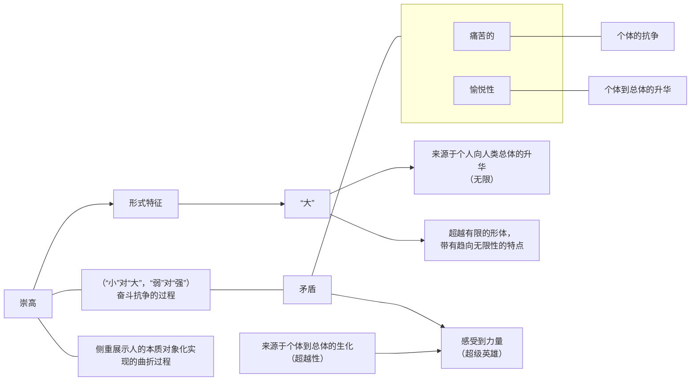

## 示例

```html
flowchart LR
崇高 --> 形式特征 --> a["“大”"] --> b["来源于个人向人类总体的升华<br \>（无限）"]
a --> c["超越有限的形体，<br \>带有趋向无限性的特点"]
崇高 --- d["（“小”对“大”，“弱”对“强”）<br \>奋斗抗争的过程"] --- 矛盾 --> e["感受到力量<br \>（超级英雄）"]
f["来源于个体到总体的生化（超越性）"] --> e
崇高 --- 侧重展示人的本质对象化实现的曲折过程
subgraph g[" "]
痛苦的
愉悦性
end
矛盾 --- g
痛苦的 --- 个体的抗争
愉悦性 --- 个体到总体的升华
```



[Typora(meimaid)绘制流程图 - 知乎 (zhihu.com)](https://zhuanlan.zhihu.com/p/481032338)

## 1

有标点或特殊符号，如`“` 、`<`、`（`、空格、html换行符 等时，需要用字母加`[]`来形成单元块，如：

```html
d["（“小”对“大”，“弱”对“强”）<br \>奋斗抗争的过程"]
```

## 2

支持html

-   换行  `<br \>`
-   斜体 `<i>...</i>`
-   加粗、下划线、大号小号字体 ...

## 3

```txt
subgraph g[" "]
a
b
end
```

子图，如上，需要一个名称，可以指向或被指向

## 4

在线画mermaid图网站

[Online FlowChart & Diagrams Editor - Mermaid Live Editor](https://mermaid.live/)