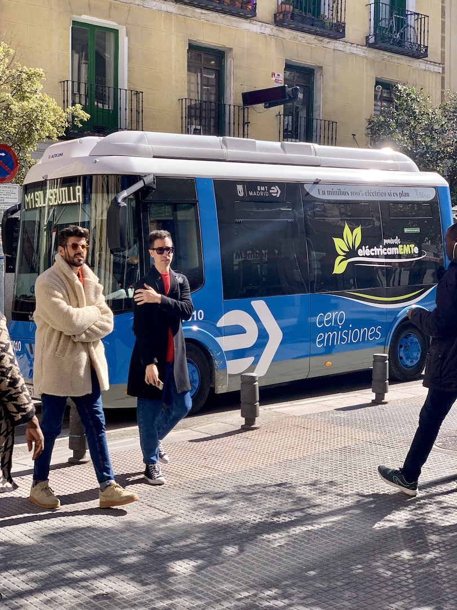

## 1

安装gpu版本的torch和torchvision

[Previous PyTorch Versions | PyTorch](https://pytorch.org/get-started/previous-versions/)

找 `Wheel`

例

> **v1.12.1**
>
> **Conda**
>
> ...
>
> **==Wheel==**
>
> **OSX**
>
> ```
> pip install torch==1.12.1 torchvision==0.13.1 torchaudio==0.12.1
> ```
>
> **Linux and Windows**
>
> ```bash
> # ROCM 5.1.1 (Linux only)
> pip install torch==1.12.1+rocm5.1.1 torchvision==0.13.1+rocm5.1.1 torchaudio==0.12.1 --extra-index-url  https://download.pytorch.org/whl/rocm5.1.1
> # CUDA 11.6
> pip install torch==1.12.1+cu116 torchvision==0.13.1+cu116 torchaudio==0.12.1 --extra-index-url https://download.pytorch.org/whl/cu116
> # CUDA 11.3
> pip install torch==1.12.1+cu113 torchvision==0.13.1+cu113 torchaudio==0.12.1 --extra-index-url https://download.pytorch.org/whl/cu113
> # CUDA 10.2
> pip install torch==1.12.1+cu102 torchvision==0.13.1+cu102 torchaudio==0.12.1 --extra-index-url https://download.pytorch.org/whl/cu102
> # CPU only
> pip install torch==1.12.1+cpu torchvision==0.13.1+cpu torchaudio==0.12.1 --extra-index-url https://download.pytorch.org/whl/cpu
> ```

## 2

```bash
ImportError: urllib3 v2.0 only supports OpenSSL 1.1.1+, currently the 'ssl' module is compiled with 'OpenSSL 1.0.2u  20 Dec 2019'. See: https://github.com/urllib3/urllib3/issues/2168
```

yolov5不要求`urllib3` 版本，则降低 `urllib3` 的版本

[urllib3 v2.0 only supports OpenSSL 1.1.1+, currently the 'ssl' module is compile - 掘金](https://juejin.cn/post/7229895584038617147)

查询可安装的 `urlib3` 版本：

```bash
pip install urllib3==
```

安装

```bash
pip install urllib3==1.x
```

> [(8条消息) openssl 默认版本问题（Anaconda相关）_anaconda openssl_wjh_test的博客-CSDN博客](https://blog.csdn.net/qq_42699580/article/details/105037325)
>
> 尝试更改 `openssl` 但没用

## 3

[Quickstart - Ultralytics YOLOv8 Docs](https://docs.ultralytics.com/yolov5/quickstart_tutorial/#install)

主目录下创建 `test.py` 文件：

```python
import torch

# Model
model = torch.hub.load("ultralytics/yolov5", "yolov5s")  # or yolov5n - yolov5x6, custom

# Images
img = "zidane.jpg"  # or file, Path, PIL, OpenCV, numpy, list

# Inference
results = model(img)

# Results
results.show()  # or .show(), .save(), .crop(), .pandas(), etc.
```

> ```python
> import torch
> 
> # Model
> model = torch.hub.load("ultralytics/yolov5", "yolov5s")  # or yolov5n - yolov5x6, custom
> 
> # Images
> img = "https://ultralytics.com/images/zidane.jpg"  # or file, Path, PIL, OpenCV, numpy, list
> 
> # Inference
> results = model(img)
> 
> # Results
> results.print()  # or .show(), .save(), .crop(), .pandas(), etc.
> 
> ```
>
> 指南中的原始的代码 `https://ultralytics.com/images/zidane.jpg` 需要梯子加载，提前下载，
>
> 
> 
>  
>
> 或自定义一个图片
>
> 将 `results.print()` 改成 `results.show()`

可先下载预训练模型：

```txt
https://github.com/ultralytics/yolov5/releases/download/vx.x/yolov5n.pt
```

```txt
https://github.com/ultralytics/yolov5/releases/download/vx.x/yolov5s.pt
```

```txt
https://github.com/ultralytics/yolov5/releases/download/vx.x/yolov5m.pt
```

```txt
https://github.com/ultralytics/yolov5/releases/download/vx.x/yolov5l.pt
```

```txt
https://github.com/ultralytics/yolov5/releases/download/vx.x/yolov5x.pt
```

## 4

coco 数据集的图片可以在[COCO - Ultralytics YOLOv8 Docs](https://docs.ultralytics.com/datasets/detect/coco/#dataset-yaml)里找到

```yaml
# Download data
  urls = ['http://images.cocodataset.org/zips/train2017.zip',  # 19G, 118k images
          'http://images.cocodataset.org/zips/val2017.zip',  # 1G, 5k images
          'http://images.cocodataset.org/zips/test2017.zip']  # 7G, 41k images (optional)
  download(urls, dir=dir / 'images', threads=3)
```

