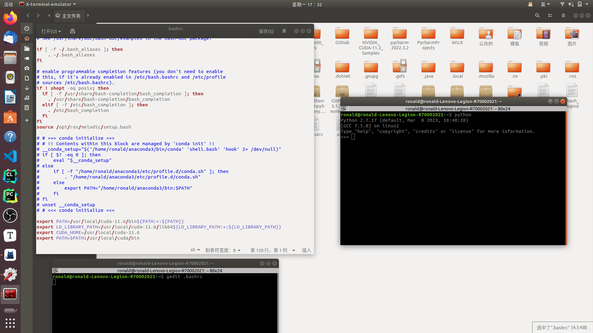
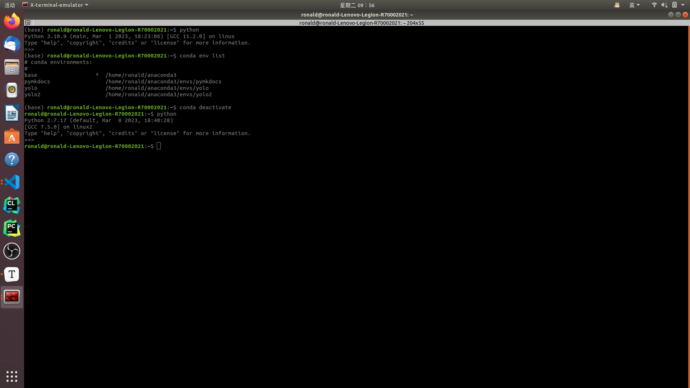

## 1

由于ros需要使用的是ubuntu系统自带的python，而我的ubuntu系统之前装了anaconda，所以在 `rosrun` 自己编写的包时，会显示 `No module named 'rospkg'` ：

```python
Traceback (most recent call last):
  File "/home/ronald/catkin_ws/src/beginner_tutorials/scripts/talker.py", line 3, in <module>
    import rospy
  File "/opt/ros/melodic/lib/python2.7/dist-packages/rospy/__init__.py", line 49, in <module>
    from .client import spin, myargv, init_node, \
  File "/opt/ros/melodic/lib/python2.7/dist-packages/rospy/client.py", line 52, in <module>
    import roslib
  File "/opt/ros/melodic/lib/python2.7/dist-packages/roslib/__init__.py", line 50, in <module>
    from roslib.launcher import load_manifest  # noqa: F401
  File "/opt/ros/melodic/lib/python2.7/dist-packages/roslib/launcher.py", line 42, in <module>
    import rospkg
ModuleNotFoundError: No module named 'rospkg'
```

询问老师，老师说这是由于使用了 anaconda 的 python ，应该要使用系统自带的python2(老师说这是一个经典的anaconda和ros冲突的问题)，所以老师的做法是

打开 `~/.bashrc` 文件，将

```bash
# >>> conda initialize >>>
# !! Contents within this block are managed by 'conda init' !!
__conda_setup="$('/home/ronald/anaconda3/bin/conda' 'shell.bash' 'hook' 2> /dev/null)"
if [ $? -eq 0 ]; then
    eval "$__conda_setup"
else
    if [ -f "/home/ronald/anaconda3/etc/profile.d/conda.sh" ]; then
        . "/home/ronald/anaconda3/etc/profile.d/conda.sh"
    else
        export PATH="/home/ronald/anaconda3/bin:$PATH"
    fi
fi
unset __conda_setup
# <<< conda initialize <<<
```

注释掉

从而终端中使用的python就变成了ubuntu18自带的python2.7

{ loading=lazy }

> 但是我发现直接执行 `conda deactivate` 的命令也可以退出 anaconda 的 base 环境
>
> { loading=lazy }

但是发现还是显示 `No module named 'rospkg'` ，

然后我突然想到可能是由于自己写的python文件中第一行

```python
#! /usr/bin/env python3
```

中的 `python3` 的问题，所以我尝试将其改成 `python2` 最后发现能够成功 `rosrun` 了

> 在之后一次测试中，还发现了，将 `python3` 改成 `python2` 之后，即使使用anaconda的python3，也能 `rosrun` 
