# Ubuntu

## 1

在客户机中装载虚拟CD驱动器，启动终端，使用tar解压缩安装程序，然后执行 `vmware-install.pl` 安装 VMware Tools。

## 2

安装ubuntu

-   [(8条消息) 双系统下Ubuntu18.04(Linux)安装超详细图文教程_没有灵魂的工具人的博客-CSDN博客](https://blog.csdn.net/weixin_43002433/article/details/95228648)

    根据 **3.制作装机系统U盘** 制作启动盘

-   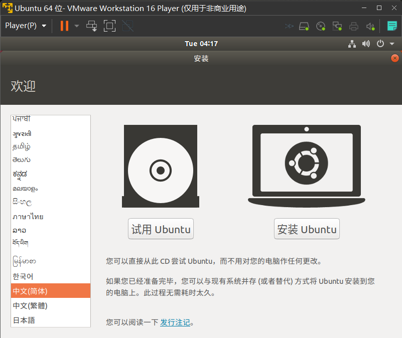

-   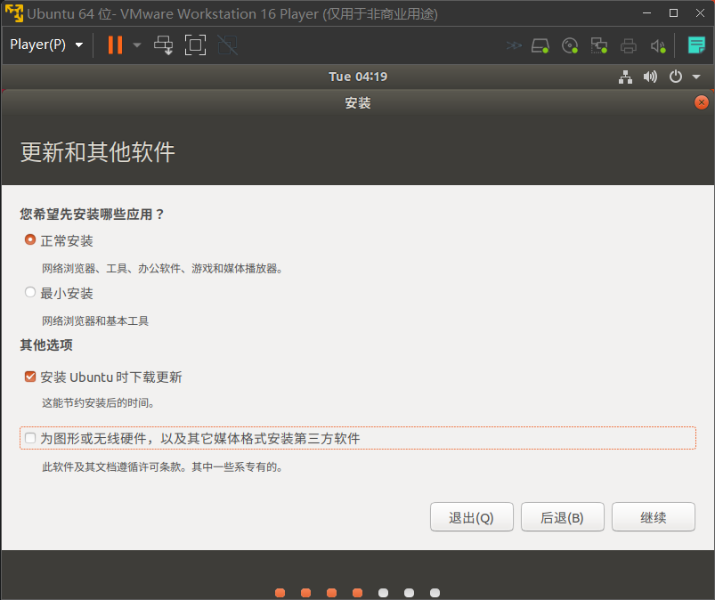

    正常安装

-   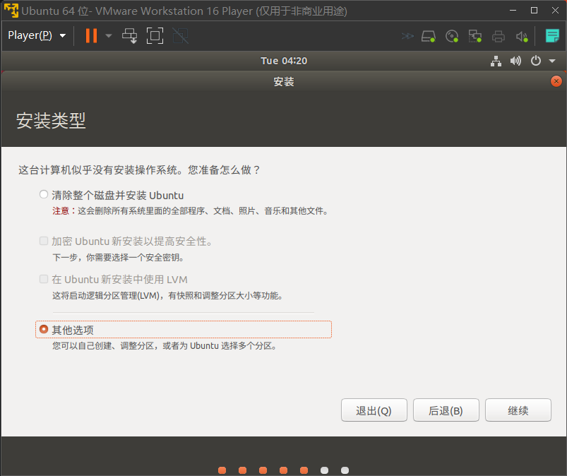

    选择 `其他选项` 才能自己分区

-   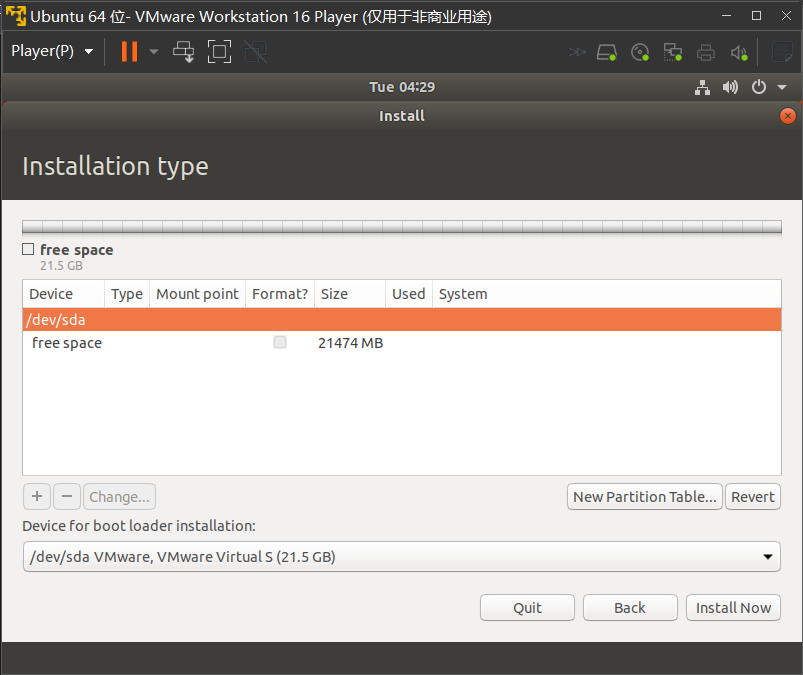

    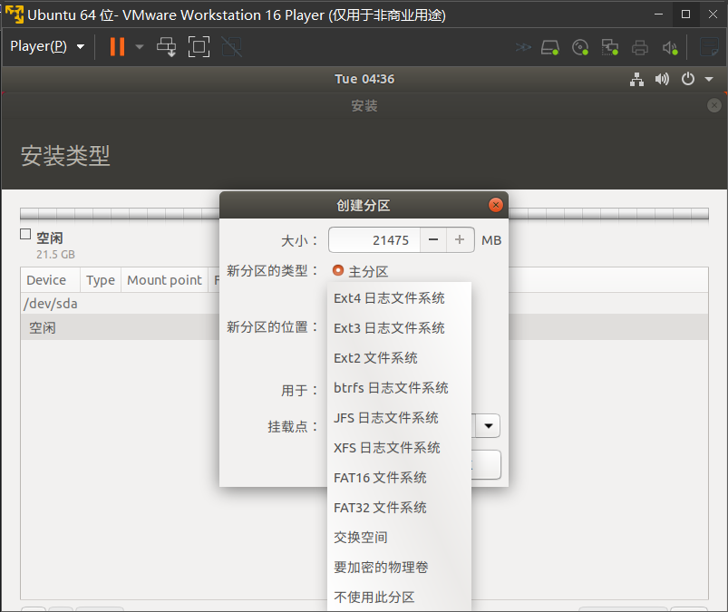

    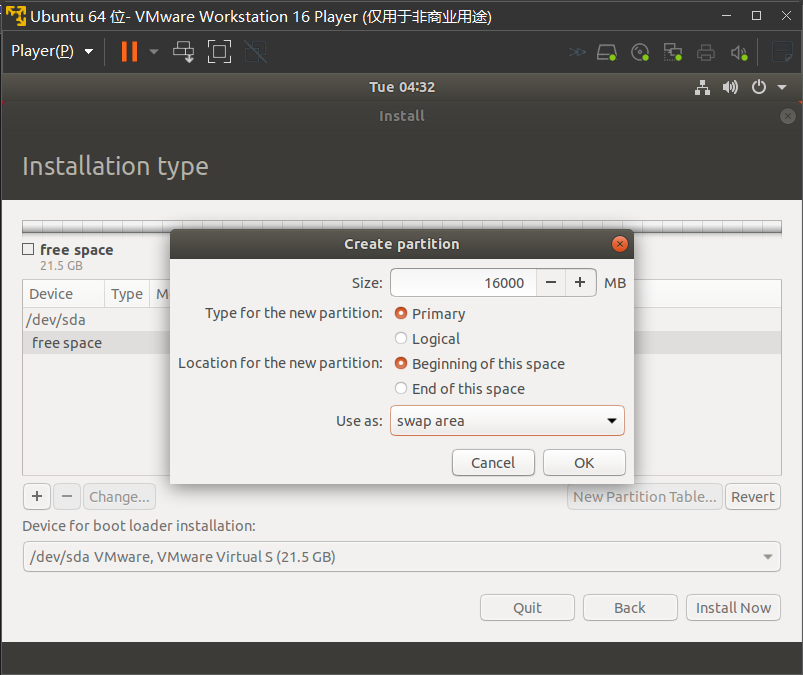

    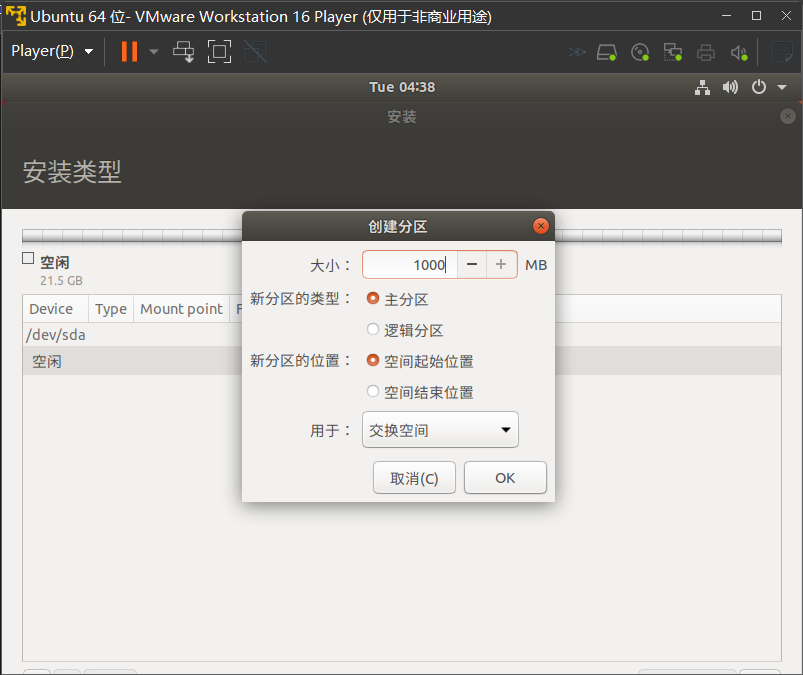

    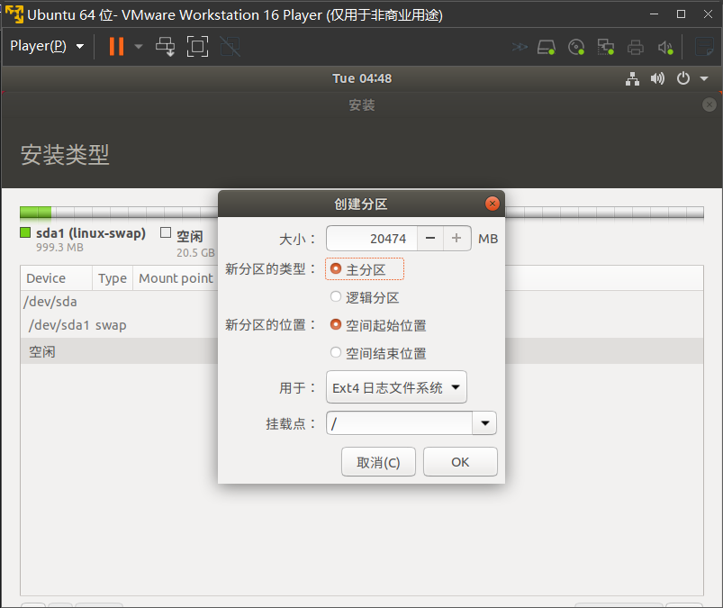

    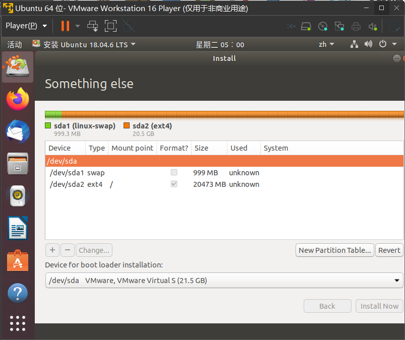

    -   分三个区就够了：

        |                          |                |                  |
        | :----------------------: | :------------: | :--------------: |
        |       EFI系统分区        |     300MB      |       ---        |
        |         交换空间         | 内存多大就多大 |       ---        |
        | 根目录分区 (挂载点：`/`) |    剩余空间    | Ext4日志文件系统 |

        （若有选项）均选主分区、空间起始位置
        
    -   `安装引导器的设备` / `Device for boot loader installation` 选跟EFI相同的硬盘，
    
        即如果分区都在同一个硬盘上就选那一个
    
-   后续按照引导操作就行

## 3

>   [ubuntu | 镜像站使用帮助 | 北京外国语大学开源软件镜像站 | BFSU Open Source Mirror](https://mirrors.bfsu.edu.cn/help/ubuntu/)

换北外源

>   18.04可以直接在软件与更新中选择北外源

修改`/etc/apt/sources.list`文件 ( 先将系统自带的该文件做个备份`source.list.save`，将该文件替换为下面内容，即可使用选择的软件源镜像。)：

-   18.04

    ```bash
    # 默认注释了源码镜像以提高 apt update 速度，如有需要可自行取消注释
    deb https://mirrors.bfsu.edu.cn/ubuntu/ bionic main restricted universe multiverse
    # deb-src https://mirrors.bfsu.edu.cn/ubuntu/ bionic main restricted universe multiverse
    deb https://mirrors.bfsu.edu.cn/ubuntu/ bionic-updates main restricted universe multiverse
    # deb-src https://mirrors.bfsu.edu.cn/ubuntu/ bionic-updates main restricted universe multiverse
    deb https://mirrors.bfsu.edu.cn/ubuntu/ bionic-backports main restricted universe multiverse
    # deb-src https://mirrors.bfsu.edu.cn/ubuntu/ bionic-backports main restricted universe multiverse
    
    # deb https://mirrors.bfsu.edu.cn/ubuntu/ bionic-security main restricted universe multiverse
    # # deb-src https://mirrors.bfsu.edu.cn/ubuntu/ bionic-security main restricted universe multiverse
    
    deb http://security.ubuntu.com/ubuntu/ bionic-security main restricted universe multiverse
    # deb-src http://security.ubuntu.com/ubuntu/ bionic-security main restricted universe multiverse
    
    # 预发布软件源，不建议启用
    # deb https://mirrors.bfsu.edu.cn/ubuntu/ bionic-proposed main restricted universe multiverse
    # # deb-src https://mirrors.bfsu.edu.cn/ubuntu/ bionic-proposed main restricted universe multiverse
    ```

-   20.04

    ```bash
    # 默认注释了源码镜像以提高 apt update 速度，如有需要可自行取消注释
    deb https://mirrors.bfsu.edu.cn/ubuntu/ focal main restricted universe multiverse
    # deb-src https://mirrors.bfsu.edu.cn/ubuntu/ focal main restricted universe multiverse
    deb https://mirrors.bfsu.edu.cn/ubuntu/ focal-updates main restricted universe multiverse
    # deb-src https://mirrors.bfsu.edu.cn/ubuntu/ focal-updates main restricted universe multiverse
    deb https://mirrors.bfsu.edu.cn/ubuntu/ focal-backports main restricted universe multiverse
    # deb-src https://mirrors.bfsu.edu.cn/ubuntu/ focal-backports main restricted universe multiverse
    
    # deb https://mirrors.bfsu.edu.cn/ubuntu/ focal-security main restricted universe multiverse
    # # deb-src https://mirrors.bfsu.edu.cn/ubuntu/ focal-security main restricted universe multiverse
    
    deb http://security.ubuntu.com/ubuntu/ focal-security main restricted universe multiverse
    # deb-src http://security.ubuntu.com/ubuntu/ focal-security main restricted universe multiverse
    
    # 预发布软件源，不建议启用
    # deb https://mirrors.bfsu.edu.cn/ubuntu/ focal-proposed main restricted universe multiverse
    # # deb-src https://mirrors.bfsu.edu.cn/ubuntu/ focal-proposed main restricted universe multiverse
    ```

## 4

语言改为中文：

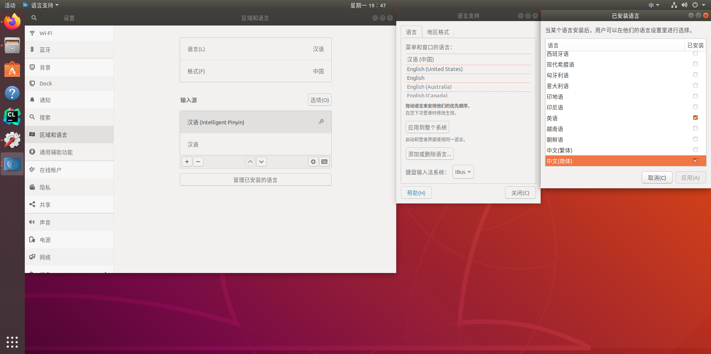

1.   设置，区域和语言，`管理已安装的语言`，
2.   `添加或删除语言...`，
3.   `中文简体`（勾选），`应用`

将输入法换成拼音（或五笔）输入：

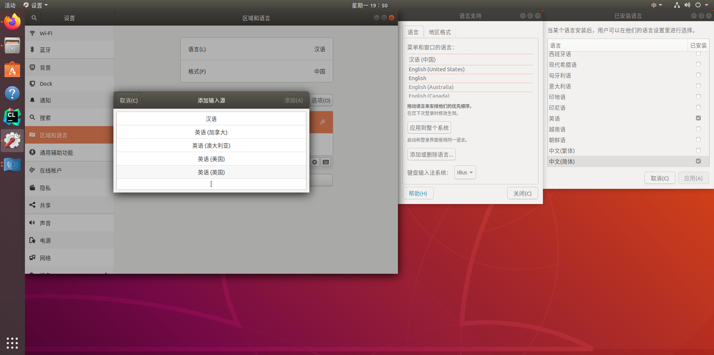

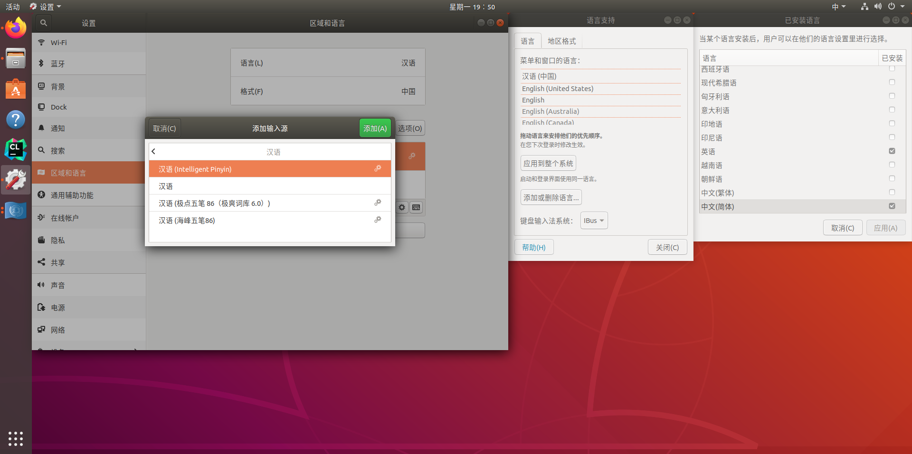

1.   设置，区域和语言，`+`(输入源处)，
2.   `汉语`
3.   选中`汉语 (Intelligent Pinyin)`(或其他)，`添加`

（将其余输入源可删除）

## 5

安装cmake

[(8条消息) ubuntu安装cmake的三种方法（超方便！）_Man_1man的博客-CSDN博客](https://blog.csdn.net/Man_1man/article/details/126467371)

使用第二种方法，并且在[Download | CMake](https://cmake.org/download/)里选择`Source distributions:`下的压缩包下载

## 6

安装clion、pycharm等：

安装到主目录中（建议）

1.   移动压缩包到主目录，并直接解压

     ```bash
     tar -zxvf xxx.tar.gz
     ```

2.   进入 `xxx/bin` 文件夹，运行 `xxx.sh`文件

     ```bash
     sh xxx.sh 
     ```

3.   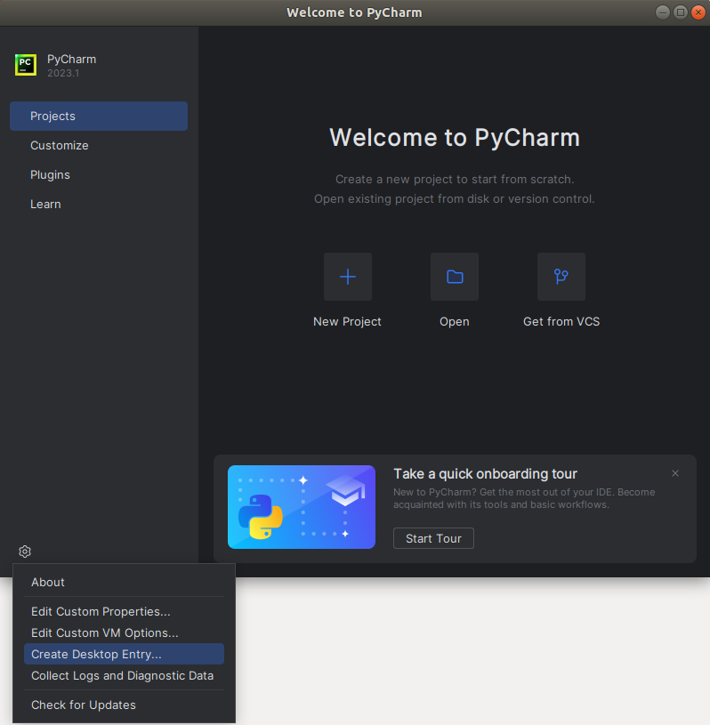

     左下角设置图标，`Create Desktop Entry...`，

     在全部应用程序中会出现ide的图标/快捷方式

4.   （可选）关闭原本打卡的ide，从全部应用程序中重新打卡，在任务栏中右键，添加到收藏夹

## 7

磁盘扩容：

[Ubuntu空间不足，如何扩容 - 知乎 (zhihu.com)](https://zhuanlan.zhihu.com/p/571501575)

## 8

安装并使用 `clash for windows` linux 端

[Linux/ubuntu下实现科学上网使用 clash for windows 详细步骤|翻墙|vpn|v2ray (cfmem.com)](https://www.cfmem.com/2021/09/linux-clash-for-windows-vpnv2ray.html?m=1)

(Linux端没有 `System proxy`选项)

设置，`网络`，`网络代理`，`手动`，填写`HTTP代理`和`HTTPS代理`(左`127.0.0.1`，右`7890`)

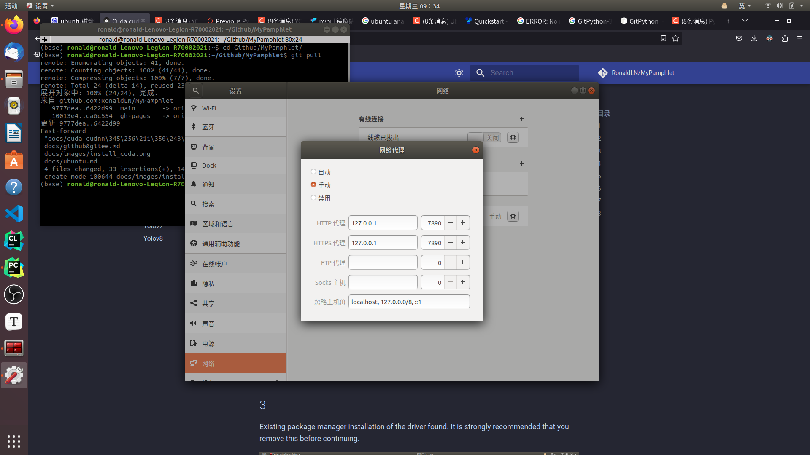

>   可设置开机启动 `start with linux` 和静默开启(不应用界面，只后台运行) `silent start`

## 9

>   [先进视觉](https://ronaldln.github.io/MyPamphlet-Blog/2023/09/29/2023/)

Ubuntu 下，如果要在 `.sh` 脚本中使用 `sudo` 命令，可以使用 `echo` 来自动输入密码，如

```bash
echo "1111" | sudo -S bash ./scripts/install_udev_rules.sh
echo "1111" | sudo -S udevadm control --reload-rules && echo "1111" | sudo -S udevadm trigger
```

